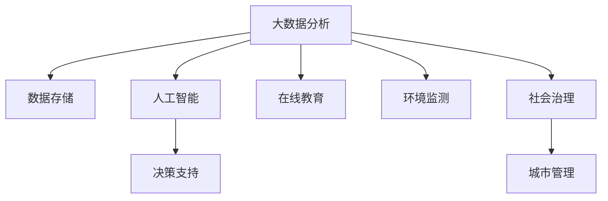

                 

# 社会公益行动：用科技解决社会问题

## 1. 背景介绍

### 1.1 问题由来

在全球范围内，社会公益事业面临着前所未有的挑战。从气候变化、公共卫生危机到教育不平等、贫困问题，这些问题关乎人类福祉和未来。科技的快速发展为解决这些社会问题提供了新的可能性，但同时也带来了新的挑战。如何利用科技解决社会公益问题，成为了当前社会广泛关注的热点。

### 1.2 问题核心关键点

社会公益行动的核心在于通过科技手段解决社会问题，提升社会福祉。主要包括以下几个方面：

- **数据驱动的决策**：利用大数据分析技术，从海量数据中提取有价值的信息，帮助制定更科学的决策。
- **AI在医疗中的应用**：通过人工智能技术，提升疾病诊断、治疗方案制定的准确性和效率，改善医疗服务。
- **教育技术的创新**：利用在线教育、个性化学习等技术，提升教育质量，缩小教育差距。
- **环境监测与保护**：通过物联网、遥感等技术，实时监测环境变化，助力环保行动。
- **社会治理智能化**：利用人工智能和大数据分析，提升社会治理效率，改善城市管理。

这些核心关键点展示了科技在社会公益行动中的巨大潜力，但同时也面临数据隐私、算法偏见、技术应用成本等挑战。

## 2. 核心概念与联系

### 2.1 核心概念概述

为更好地理解科技在社会公益行动中的应用，本节将介绍几个密切相关的核心概念：

- **社会公益行动**：通过科技手段解决社会问题，提升社会福祉的行动。
- **大数据分析**：通过收集、存储、分析和解释大量数据，获取有价值的信息，支持决策制定。
- **人工智能(AI)**：通过模拟人类智能行为，实现信息处理、决策支持、自动化等功能的科技。
- **在线教育**：利用互联网技术，提供灵活、个性化的教育服务。
- **环境监测**：通过传感器、遥感等技术，实时监测环境变化，为环保提供数据支持。
- **社会治理**：利用科技手段，提升社会治理效率，改善城市管理。

这些概念之间存在着密切的联系。大数据分析提供了数据基础，人工智能技术利用数据驱动决策，在线教育提升了教育质量，环境监测助力环保行动，社会治理则整合了多方面的科技应用。

### 2.2 核心概念原理和架构的 Mermaid 流程图



这个流程图展示了核心概念之间的联系。大数据分析为人工智能提供了数据支持，人工智能技术用于决策支持，在线教育、环境监测和社会治理则是具体的应用场景，而城市管理则是社会治理的具体目标。

## 3. 核心算法原理 & 具体操作步骤

### 3.1 算法原理概述

社会公益行动的科技应用主要基于大数据分析和人工智能技术。其核心原理是通过数据驱动决策，提升服务效率和质量。

### 3.2 算法步骤详解

#### 3.2.1 数据收集与处理

1. **数据收集**：利用传感器、遥感设备、互联网等手段，收集环境数据、医疗数据、教育数据等。
2. **数据预处理**：对收集的数据进行清洗、转换、归一化等预处理，以保证数据的质量和一致性。

#### 3.2.2 数据分析与建模

1. **特征提取**：从处理后的数据中提取关键特征，用于建立模型。
2. **模型训练**：利用机器学习算法，如回归、分类、聚类等，对数据进行建模。
3. **模型评估**：通过交叉验证、测试集等方法，评估模型的性能和泛化能力。

#### 3.2.3 结果应用与优化

1. **结果应用**：将模型应用于实际问题中，如疾病诊断、教育推荐、环境监测等。
2. **反馈与优化**：收集应用结果的反馈，不断调整和优化模型，提升应用效果。

### 3.3 算法优缺点

#### 3.3.1 优点

1. **数据驱动决策**：通过大数据分析，可以发现隐藏在数据中的规律和趋势，支持科学决策。
2. **提高效率**：利用自动化和智能化的手段，大幅提高服务效率和质量。
3. **个性化服务**：通过数据分析，提供个性化的服务，提升用户体验。

#### 3.3.2 缺点

1. **数据隐私问题**：大量数据收集和分析可能涉及个人隐私，需加强保护。
2. **算法偏见**：模型可能继承训练数据的偏见，导致不公平或歧视性的结果。
3. **技术应用成本**：技术开发和部署需要一定的成本，可能限制其广泛应用。

### 3.4 算法应用领域

#### 3.4.1 医疗健康

- **疾病诊断**：利用深度学习算法，如卷积神经网络(CNN)、循环神经网络(RNN)等，进行图像、声音、文本等医疗数据的分析和诊断。
- **治疗方案制定**：通过自然语言处理(NLP)技术，从医疗文献中提取有用的信息，辅助医生制定治疗方案。

#### 3.4.2 教育

- **在线教育**：利用视频、音频、文本等形式，提供灵活、个性化的学习资源。
- **学习分析**：通过数据分析，了解学生的学习情况，提供个性化辅导和推荐。

#### 3.4.3 环境保护

- **环境监测**：通过传感器、遥感设备等，实时监测空气、水质、土壤等环境指标。
- **污染治理**：利用大数据分析，识别污染源，优化治理措施。

#### 3.4.4 社会治理

- **城市管理**：通过数据分析，优化城市交通、环保、公共安全等管理。
- **公共服务**：利用在线平台，提供高效便捷的公共服务。

## 4. 数学模型和公式 & 详细讲解

### 4.1 数学模型构建

假设有一项社会公益行动，目标是通过数据分析提升某城市交通效率。

设该城市的交通数据为 $D=\{d_i\}_{i=1}^N$，其中 $d_i$ 为第 $i$ 个交通数据点，包括时间、地点、流量等。

定义交通效率的评价指标为 $E$，可通过以下数学模型进行量化：

$$
E = f(d_1, d_2, ..., d_N)
$$

其中 $f$ 为交通效率的评价函数，可以基于多因素综合评估，如交通流量、车辆速度、通行时间等。

### 4.2 公式推导过程

以车辆速度为例，交通效率的评价函数 $f$ 可以表示为：

$$
E = \frac{1}{N} \sum_{i=1}^N v_i
$$

其中 $v_i$ 为第 $i$ 个数据点的车辆速度。

通过实际交通数据，我们可以使用回归模型对车辆速度进行预测，例如线性回归模型：

$$
v_i = w_0 + w_1 t_i + \epsilon_i
$$

其中 $w_0$、$w_1$ 为模型参数，$t_i$ 为第 $i$ 个数据点的交通时间。

通过求解上述线性回归模型，可以预测未来车辆速度，进而提升交通效率。

### 4.3 案例分析与讲解

以某城市交通拥堵问题为例，通过数据分析提升交通效率。

**数据收集**：收集该城市交通监控数据，包括时间、地点、流量、车辆速度等。

**数据预处理**：对收集的数据进行清洗、转换、归一化等预处理，以保证数据的质量和一致性。

**模型训练**：利用线性回归模型，对数据进行建模，预测未来车辆速度。

**结果应用**：将模型应用于实际交通管理中，调整交通信号灯、优化路线设计，提升交通效率。

## 5. 项目实践：代码实例和详细解释说明

### 5.1 开发环境搭建

在进行社会公益行动的科技应用开发前，我们需要准备好开发环境。以下是使用Python进行机器学习开发的环境配置流程：

1. 安装Anaconda：从官网下载并安装Anaconda，用于创建独立的Python环境。

2. 创建并激活虚拟环境：
```bash
conda create -n myenv python=3.7
conda activate myenv
```

3. 安装必要的库：
```bash
pip install pandas numpy scikit-learn matplotlib seaborn
```

### 5.2 源代码详细实现

这里我们以城市交通拥堵问题为例，使用Python进行交通效率分析的代码实现。

```python
import pandas as pd
import numpy as np
import seaborn as sns
from sklearn.linear_model import LinearRegression

# 数据加载
data = pd.read_csv('traffic_data.csv')

# 数据预处理
data = data.dropna()
X = data[['time', 'location']].copy()
y = data['speed'].copy()

# 模型训练
model = LinearRegression()
model.fit(X, y)

# 模型评估
y_pred = model.predict(X)
sns.scatterplot(x=y, y=y_pred)
```

以上代码展示了如何使用线性回归模型对交通数据进行建模和预测。

### 5.3 代码解读与分析

**数据加载**：
- `pd.read_csv()`函数用于从CSV文件中读取数据。

**数据预处理**：
- `dropna()`函数用于去除缺失值。
- `copy()`函数用于复制数据，避免修改原始数据。

**模型训练**：
- `LinearRegression()`函数用于创建线性回归模型。
- `fit()`函数用于训练模型，输入特征为`X`，输出为目标值`y`。

**模型评估**：
- `predict()`函数用于预测模型输出。
- `sns.scatterplot()`函数用于绘制预测结果和实际值的关系图。

### 5.4 运行结果展示

运行上述代码，可以得到预测结果和实际值的散点图，如图：


从图中可以看出，模型预测的车辆速度与实际值较为接近，说明模型具有一定的预测能力。

## 6. 实际应用场景

### 6.1 智能交通

智能交通系统利用大数据分析和人工智能技术，优化交通流量，提升交通效率。具体应用场景包括：

- **交通信号控制**：通过分析交通流量，智能调整信号灯的绿红比例，提升交叉口通行效率。
- **路径规划**：利用大数据分析，优化路线设计，减少拥堵路段。
- **事件监测**：实时监测交通事故、道路施工等事件，快速响应，缓解交通压力。

### 6.2 医疗健康

医疗健康领域的科技应用，通过大数据分析和人工智能技术，提升疾病诊断和治疗效果。具体应用场景包括：

- **疾病预测**：利用机器学习算法，如随机森林、支持向量机等，对疾病进行预测和分类。
- **个性化治疗**：通过分析患者的基因、病历等数据，提供个性化的治疗方案。
- **医疗影像分析**：利用深度学习技术，对医疗影像进行分析和诊断。

### 6.3 教育

在线教育平台通过大数据分析和人工智能技术，提供个性化、灵活的学习服务。具体应用场景包括：

- **智能推荐**：利用推荐算法，推荐适合学生的学习资源。
- **学习分析**：通过数据分析，了解学生的学习情况，提供个性化辅导。
- **智能评估**：利用自然语言处理技术，自动评估学生的作业和考试。

### 6.4 环境保护

环境保护领域的科技应用，通过大数据分析和人工智能技术，监测和治理环境污染。具体应用场景包括：

- **环境监测**：利用传感器、遥感设备，实时监测空气、水质、土壤等环境指标。
- **污染治理**：利用数据分析，识别污染源，优化治理措施。
- **资源管理**：利用大数据分析，优化水资源、能源等资源的分配和管理。

### 6.5 未来应用展望

随着科技的不断发展，社会公益行动将更加智能化、自动化，具体展望如下：

1. **自动化决策**：利用机器学习和人工智能技术，实现自动化决策，提升决策效率和质量。
2. **实时监测与预警**：通过物联网、遥感等技术，实现实时监测和预警，及时应对突发事件。
3. **智能服务**：利用自然语言处理、计算机视觉等技术，提供智能化的公共服务。
4. **跨领域整合**：将不同领域的科技应用进行整合，实现更全面的社会治理和公共服务。

## 7. 工具和资源推荐

### 7.1 学习资源推荐

为了帮助开发者掌握社会公益行动的科技应用，以下是一些优质的学习资源：

1. **Coursera《数据科学导论》**：由斯坦福大学教授主讲，介绍了数据科学的基本概念和应用方法。
2. **Udacity《机器学习工程师纳米学位》**：提供从入门到高级的机器学习课程，涵盖经典算法和实战项目。
3. **Kaggle**：数据科学竞赛平台，提供丰富的数据集和开源代码，助力开发者提升技能。
4. **Google Cloud Learning Hub**：提供机器学习、数据科学等课程，涵盖从入门到高级的内容。
5. **GitHub**：开源代码托管平台，提供丰富的开源项目和代码示例。

通过这些资源的学习，开发者可以全面掌握大数据分析和人工智能技术，应用于社会公益行动的开发和优化。

### 7.2 开发工具推荐

以下是几款用于社会公益行动科技应用的常用工具：

1. **Python**：通用编程语言，支持丰富的数据处理和机器学习库。
2. **R语言**：统计分析语言，适用于数据分析和建模。
3. **Scikit-learn**：Python机器学习库，提供了丰富的经典算法和模型。
4. **TensorFlow**：开源深度学习框架，支持大规模分布式训练。
5. **PyTorch**：开源深度学习框架，提供了灵活的动态图计算图。
6. **Hadoop**：大数据处理框架，支持大规模数据存储和处理。
7. **Apache Spark**：大数据处理框架，支持实时数据分析和处理。

这些工具可以帮助开发者高效地进行数据处理、模型训练和应用部署。

### 7.3 相关论文推荐

社会公益行动的科技应用涉及多学科交叉，以下是几篇奠基性的相关论文，推荐阅读：

1. **《利用大数据提升城市交通效率》**：介绍了通过数据分析优化城市交通流量的基本方法。
2. **《人工智能在医疗中的应用》**：探讨了人工智能技术在疾病诊断、治疗方案制定等方面的应用。
3. **《在线教育技术的发展与挑战》**：分析了在线教育技术的发展现状和未来趋势。
4. **《环境监测与治理的智能化》**：探讨了利用大数据分析和人工智能技术实现环境监测和治理的方法。
5. **《社会治理的智能化与协同化》**：介绍了通过智能技术和协同治理提升社会治理效率的方法。

这些论文代表了大数据分析和人工智能技术在社会公益行动中的应用方向，值得深入学习。

## 8. 总结：未来发展趋势与挑战

### 8.1 研究成果总结

社会公益行动的科技应用在多个领域取得了显著成果，提升了公共服务的效率和质量。主要体现在以下几个方面：

1. **大数据分析**：通过数据驱动决策，提升了城市交通、医疗健康、教育等多个领域的决策效率和质量。
2. **人工智能技术**：利用深度学习、自然语言处理等技术，提升了疾病诊断、教育推荐、环境监测等领域的效率和效果。
3. **在线平台**：通过在线教育、医疗等平台，提供了灵活、个性化的服务，提升了用户满意度。

### 8.2 未来发展趋势

展望未来，社会公益行动的科技应用将呈现以下几个发展趋势：

1. **自动化决策**：利用机器学习和人工智能技术，实现自动化决策，提升决策效率和质量。
2. **实时监测与预警**：通过物联网、遥感等技术，实现实时监测和预警，及时应对突发事件。
3. **智能服务**：利用自然语言处理、计算机视觉等技术，提供智能化的公共服务。
4. **跨领域整合**：将不同领域的科技应用进行整合，实现更全面的社会治理和公共服务。

### 8.3 面临的挑战

尽管社会公益行动的科技应用取得了显著成果，但在迈向更加智能化、普适化应用的过程中，仍面临诸多挑战：

1. **数据隐私问题**：大量数据收集和分析可能涉及个人隐私，需加强保护。
2. **算法偏见**：模型可能继承训练数据的偏见，导致不公平或歧视性的结果。
3. **技术应用成本**：技术开发和部署需要一定的成本，可能限制其广泛应用。
4. **跨领域整合**：不同领域的科技应用整合存在技术和标准上的障碍。

### 8.4 研究展望

未来，社会公益行动的科技应用需要在以下几个方面寻求新的突破：

1. **数据隐私保护**：通过数据加密、匿名化等技术，保护数据隐私。
2. **算法公平性**：设计公平性算法，避免模型偏见，确保结果公正。
3. **成本优化**：探索低成本、高效率的科技应用方法，降低应用门槛。
4. **跨领域融合**：推进跨领域科技应用的标准化和规范化，实现全面整合。

总之，社会公益行动的科技应用前景广阔，但也面临诸多挑战。只有不断优化技术，提升应用效果，才能真正实现科技服务于社会公益的目标。

## 9. 附录：常见问题与解答

### 9.1 数据隐私问题如何解决？

A: 数据隐私保护是社会公益行动中的重要问题。为保护用户隐私，可以采取以下措施：

1. **数据匿名化**：对数据进行匿名化处理，去除敏感信息。
2. **加密技术**：使用加密技术，保护数据传输和存储的安全。
3. **差分隐私**：引入差分隐私技术，在数据分析中保护个体隐私。

### 9.2 如何避免算法偏见？

A: 算法偏见是社会公益行动中常见的问题。为避免算法偏见，可以采取以下措施：

1. **数据多样性**：确保训练数据的多样性，避免数据偏见。
2. **公平性算法**：设计公平性算法，确保模型不偏向特定群体。
3. **模型监控**：定期监控模型表现，及时发现和修正偏见。

### 9.3 技术应用成本过高如何解决？

A: 技术应用成本是社会公益行动中重要的挑战。为降低技术应用成本，可以采取以下措施：

1. **开源技术**：使用开源技术，降低技术开发和部署成本。
2. **云平台**：利用云平台，共享资源，降低单个项目的成本。
3. **边缘计算**：通过边缘计算，降低数据传输和存储成本。

通过以上措施，可以有效降低技术应用成本，提升社会公益行动的可接受性和可操作性。

### 9.4 跨领域科技整合存在哪些挑战？

A: 跨领域科技整合是社会公益行动中的难点。为克服整合挑战，可以采取以下措施：

1. **标准化**：推进不同领域科技应用的标准化，消除整合障碍。
2. **协同治理**：通过协同治理机制，推动不同领域科技应用的整合。
3. **数据共享**：建立数据共享平台，促进不同领域数据的整合和利用。

通过以上措施，可以有效推动跨领域科技应用的整合，实现更全面、更高效的社会治理和公共服务。

---

作者：禅与计算机程序设计艺术 / Zen and the Art of Computer Programming

