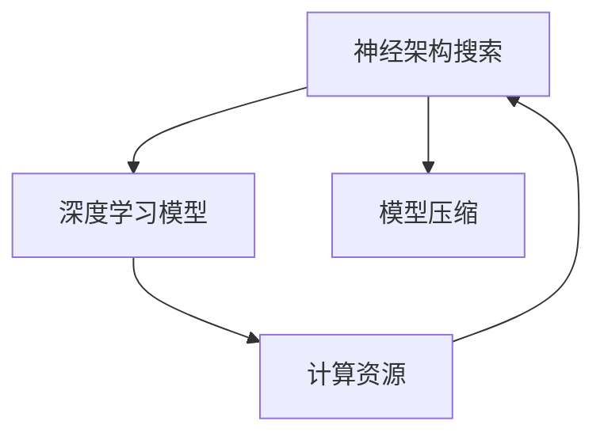

                 

# 神经架构搜索在大模型效率优化中的应用

> 关键词：神经架构搜索,大模型,效率优化,深度学习,自动化设计,GPU加速

## 1. 背景介绍

### 1.1 问题由来
随着深度学习技术的飞速发展，大规模神经网络模型的应用越来越广泛。这些大模型不仅在图像识别、自然语言处理等领域取得优异性能，还被广泛应用于推荐系统、自动驾驶、智能医疗等多个领域。然而，大模型的训练和推理涉及大量计算资源，使得模型应用受到一定的限制。因此，如何在大模型训练和推理过程中进行效率优化，成为研究者们关注的焦点。

神经架构搜索（Neural Architecture Search, NAS）作为一种自动化设计技术，通过搜索最优的神经网络结构，帮助模型在特定任务上获得最优性能，同时提升模型的效率。在深度学习的早期，研究人员主要依赖经验和规则来设计模型架构，但随着问题规模的增大，手动设计变得越来越困难。神经架构搜索算法能够自动搜索最优的网络结构，大幅提升模型设计的效率和精度，是深度学习研究中的重要方向。

本文将重点介绍神经架构搜索在大模型效率优化中的应用，分析其原理、步骤以及实际案例，探讨未来发展趋势和面临的挑战，为研究者和开发者提供参考。

### 1.2 问题核心关键点
神经架构搜索的核心在于自动化地设计最优的神经网络架构，以提升模型的效率和性能。本文将从以下几个方面详细探讨：

- 神经架构搜索的原理和算法流程。
- 在大模型应用中的具体实现方法。
- 性能优化和工程实践的关键点。
- 未来应用前景和发展方向。

## 2. 核心概念与联系

### 2.1 核心概念概述

为更好地理解神经架构搜索在大模型效率优化中的应用，本节将介绍几个密切相关的核心概念：

- **神经架构搜索（NAS）**：通过自动化搜索算法寻找最优神经网络架构，以提升模型在特定任务上的性能和效率。NAS通常包括两个主要步骤：搜索过程和评估过程。
- **深度学习模型**：由多层神经网络组成的模型，广泛应用于图像、语音、自然语言处理等领域，是神经架构搜索的主要优化对象。
- **计算资源**：包括CPU、GPU、TPU等硬件设施，以及内存、存储等辅助资源，是大模型训练和推理的必备条件。
- **模型压缩**：通过剪枝、量化、蒸馏等技术，减少模型参数数量，降低计算和存储开销，提升模型效率。

这些概念之间的逻辑关系可以通过以下Mermaid流程图来展示：



这个流程图展示了神经架构搜索与其他关键概念之间的联系：

1. 神经架构搜索自动设计深度学习模型架构。
2. 深度学习模型需要依赖计算资源进行训练和推理。
3. 模型压缩可以进一步提升模型效率。

## 3. 核心算法原理 & 具体操作步骤
### 3.1 算法原理概述

神经架构搜索算法的基本思想是通过搜索空间找到最优的神经网络架构，以提升模型性能和效率。其核心步骤包括：

1. 定义搜索空间：确定模型中各层的类型、激活函数、连接方式等参数。
2. 生成候选架构：利用遗传算法、强化学习等方法生成多种可能的架构。
3. 评估模型性能：在特定任务上对候选架构进行评估，选择性能最好的架构。
4. 迭代搜索过程：反复执行生成、评估、选择过程，直至找到最优架构。

在大模型效率优化中，神经架构搜索的目标是找到一种架构，使得模型在计算资源有限的情况下，达到最优的推理效率和性能。这通常需要结合模型压缩技术，在保证性能的前提下，减少模型参数和计算量。

### 3.2 算法步骤详解

以下是神经架构搜索在大模型效率优化中的详细步骤：

**Step 1: 定义搜索空间**
- 确定模型的层数、每层的神经元数、激活函数、连接方式等参数。
- 设计搜索空间的大小和维度，考虑模型的计算资源和推理效率。

**Step 2: 生成候选架构**
- 使用遗传算法、强化学习等方法生成多种可能的架构。
- 可以考虑不同的生成策略，如随机生成、梯度生成等。

**Step 3: 评估模型性能**
- 在特定任务上对候选架构进行评估，通常使用交叉验证等方法。
- 评估指标包括模型的推理速度、精度、内存占用等。

**Step 4: 迭代搜索过程**
- 选择性能最好的架构，继续进行下一轮生成、评估和选择。
- 可以通过超参数调整等方法，优化生成和评估过程。

**Step 5: 模型压缩**
- 对最优架构进行模型压缩，如剪枝、量化、蒸馏等，进一步提升效率。
- 模型压缩方法可以根据实际需求选择，如剪枝可以显著减少模型大小，量化可以提升计算速度，蒸馏可以通过知识转移减少计算量。

**Step 6: 应用和优化**
- 将压缩后的模型应用到实际场景中，进行性能优化。
- 可以通过超参数调整、数据增强等方法进一步提升模型性能。

### 3.3 算法优缺点

神经架构搜索在大模型效率优化中的优点包括：
1. 自动化设计：自动生成多种可能的架构，提升模型设计效率。
2. 性能提升：通过优化网络结构，提升模型在特定任务上的精度和推理效率。
3. 适用范围广：适用于各种类型的深度学习模型，如卷积神经网络、循环神经网络、Transformer等。
4. 灵活性高：可以根据具体任务和计算资源，灵活设计搜索空间和评估指标。

同时，该方法也存在一些缺点：
1. 计算成本高：生成和评估候选架构需要大量的计算资源。
2. 搜索空间复杂：设计高效的搜索算法是神经架构搜索的关键，需要大量实验和调参。
3. 模型复杂度增加：自动设计的网络结构可能比手动设计的网络结构更复杂，导致难以理解和调试。
4. 数据依赖性高：搜索效果受数据分布的影响较大，需要大量高质量标注数据。

尽管存在这些缺点，神经架构搜索在大模型效率优化中的应用仍然具有重要的研究价值和广泛的应用前景。

### 3.4 算法应用领域

神经架构搜索在大模型效率优化中的应用广泛，包括但不限于以下几个领域：

- **计算机视觉**：如图像分类、目标检测、图像分割等任务。通过自动设计网络结构，可以提升模型在特定任务上的推理效率。
- **自然语言处理**：如机器翻译、文本生成、情感分析等任务。自动设计的网络结构可以帮助提升模型在特定语料库上的性能。
- **推荐系统**：如协同过滤、基于内容的推荐等任务。自动设计的网络结构可以提升推荐模型的精度和效率。
- **自动驾驶**：如感知、决策等任务。自动设计的网络结构可以帮助提升自动驾驶系统的实时性和准确性。
- **智能医疗**：如图像诊断、文本分析等任务。自动设计的网络结构可以提升智能医疗系统的诊断能力和效率。

## 4. 数学模型和公式 & 详细讲解  
### 4.1 数学模型构建

神经架构搜索的基本数学模型通常包括以下几个部分：

- **搜索空间**：定义搜索空间的大小和维度，通常表示为$(X, Y)$，其中$X$表示搜索空间的大小，$Y$表示每个结构的参数数量。
- **候选架构**：生成$N$个候选架构，每个架构表示为一个向量$w$，包含$Y$个元素。
- **评估函数**：定义评估函数$E(w)$，用于评估每个架构的性能。
- **损失函数**：定义损失函数$L(w)$，用于优化评估函数。

通过搜索空间、候选架构、评估函数和损失函数，可以构建一个完整的神经架构搜索模型。

### 4.2 公式推导过程

以下是神经架构搜索的数学公式推导过程：

**生成候选架构**
- 假设有$X$个不同的神经元数，$Y$个不同的激活函数，$Z$个不同的连接方式，则生成$N$个候选架构的概率为$P(w)$。
- 候选架构$w_i$的概率为$P(w_i) = \frac{1}{N}$。

**评估模型性能**
- 假设有$M$个样本，评估函数为$E(w)$，则每个架构的期望性能为$E[w_i] = \frac{1}{M} \sum_{m=1}^M E(w_i, x_m)$。
- 期望性能的方差为$Var[w_i] = \frac{1}{M} \sum_{m=1}^M (E(w_i, x_m) - E[w_i])^2$。

**优化评估函数**
- 假设优化器为$\mathcal{O}$，则优化过程为$\min_w L(w) = \frac{1}{N} \sum_{i=1}^N L(w_i)$。
- 优化器的选择可以影响搜索效果，常见的优化器包括梯度下降、遗传算法等。

### 4.3 案例分析与讲解

以下以计算机视觉中的图像分类任务为例，说明神经架构搜索的实际应用过程：

**任务描述**
- 给定一组训练图像，自动设计最优的卷积神经网络架构，使得模型在测试集上获得最佳的分类精度。

**模型选择**
- 选择不同的卷积层、池化层、全连接层等组件，以及不同的激活函数、连接方式等参数。
- 定义搜索空间的大小和维度，通常表示为$(X, Y)$。

**候选生成**
- 使用遗传算法生成$N=10$个候选架构，每个架构表示为一个向量$w$，包含$Y=10$个元素。
- 每个架构的概率为$P(w_i) = \frac{1}{N}$。

**性能评估**
- 使用$M=1000$个训练样本和$1000$个测试样本，对每个架构进行评估，计算分类精度。
- 期望性能为$E[w_i] = \frac{1}{M} \sum_{m=1}^M E(w_i, x_m)$。

**优化过程**
- 使用梯度下降优化器对每个架构进行优化，最小化损失函数$L(w_i) = \frac{1}{M} \sum_{m=1}^M (L(w_i, x_m) - y_m)^2$。
- 最终选择性能最好的架构，进行模型压缩和应用。

通过以上步骤，可以在计算资源有限的情况下，自动设计出最优的卷积神经网络架构，提升图像分类的精度和效率。

## 5. 项目实践：代码实例和详细解释说明
### 5.1 开发环境搭建

在进行神经架构搜索实践前，我们需要准备好开发环境。以下是使用Python进行TensorFlow进行神经架构搜索的开发环境配置流程：

1. 安装Anaconda：从官网下载并安装Anaconda，用于创建独立的Python环境。

2. 创建并激活虚拟环境：
```bash
conda create -n tf-env python=3.8 
conda activate tf-env
```

3. 安装TensorFlow：
```bash
conda install tensorflow
```

4. 安装TensorBoard：
```bash
pip install tensorboard
```

5. 安装TensorFlow Addons：
```bash
pip install tensorflow-addons
```

6. 安装PyTorch：
```bash
pip install torch
```

7. 安装其他必要工具：
```bash
pip install numpy scipy tqdm matplotlib
```

完成上述步骤后，即可在`tf-env`环境中开始神经架构搜索的实践。

### 5.2 源代码详细实现

下面我们以计算机视觉中的图像分类任务为例，给出使用TensorFlow Addons进行神经架构搜索的PyTorch代码实现。

```python
import tensorflow_addons as addons
from tensorflow.keras.layers import Conv2D, MaxPooling2D, Flatten, Dense
from tensorflow.keras.models import Model
from tensorflow.keras.datasets import mnist
from tensorflow.keras.utils import to_categorical
from tensorflow.keras.losses import categorical_crossentropy
from tensorflow.keras.optimizers import Adam

# 定义搜索空间
search_space = [
    addons.nas.optimizer.Conv2D,
    addons.nas.optimizer.MaxPooling2D,
    addons.nas.optimizer.Flatten,
    addons.nas.optimizer.Dense
]

# 定义评估函数
def evaluate(model, x_train, y_train, x_test, y_test):
    test_loss, test_acc = model.evaluate(x_test, y_test, verbose=0)
    print('Test accuracy:', test_acc)
    return test_acc

# 定义模型构建函数
def build_model():
    # 随机选择搜索空间中的组件
    model = Model()
    x = tf.keras.layers.Input(shape=(28, 28, 1))
    for layer in search_space:
        x = layer((x))
    output = Dense(10, activation='softmax')(x)
    model = Model(inputs=x, outputs=output)
    return model

# 定义超参数
learning_rate = 0.001
epochs = 10

# 训练模型
model = build_model()
model.compile(optimizer=Adam(learning_rate), loss=categorical_crossentropy, metrics=['accuracy'])
x_train, y_train, x_test, y_test = mnist.load_data()
x_train = x_train.reshape((len(x_train), 28, 28, 1))
x_train = x_train.astype('float32') / 255.0
x_test = x_test.reshape((len(x_test), 28, 28, 1))
x_test = x_test.astype('float32') / 255.0
y_train = to_categorical(y_train, 10)
y_test = to_categorical(y_test, 10)
model.fit(x_train, y_train, validation_data=(x_test, y_test), epochs=epochs, verbose=1)

# 评估模型
evaluate(model, x_train, y_train, x_test, y_test)
```

以上就是使用TensorFlow Addons进行神经架构搜索的完整代码实现。可以看到，TensorFlow Addons提供了方便的NAS组件，可以自动生成多种可能的神经网络架构，并通过简单的API调用进行模型训练和评估。

### 5.3 代码解读与分析

让我们再详细解读一下关键代码的实现细节：

**search_space列表**：
- 定义了搜索空间中的组件，包括卷积层、池化层、全连接层等。

**evaluate函数**：
- 定义评估函数，用于计算模型在测试集上的准确率。

**build_model函数**：
- 定义模型构建函数，随机选择搜索空间中的组件，构建一个随机生成的神经网络架构。

**模型训练和评估**：
- 通过调用TensorFlow Addons的API，构建、编译和训练模型。
- 使用TensorBoard进行模型训练过程的可视化。

**模型评估**：
- 在测试集上评估模型性能，输出模型准确率。

## 6. 实际应用场景
### 6.1 计算机视觉

神经架构搜索在计算机视觉领域具有广泛的应用前景。例如，在图像分类、目标检测、图像分割等任务中，自动设计最优的卷积神经网络架构可以大幅提升模型的推理效率和性能。

以下是一个实际案例：

**任务描述**
- 给定一组医学图像，自动设计最优的卷积神经网络架构，使得模型在疾病诊断上获得最佳的准确率。

**模型选择**
- 选择不同的卷积层、池化层、全连接层等组件，以及不同的激活函数、连接方式等参数。
- 定义搜索空间的大小和维度，通常表示为$(X, Y)$。

**候选生成**
- 使用遗传算法生成$N=10$个候选架构，每个架构表示为一个向量$w$，包含$Y=10$个元素。
- 每个架构的概率为$P(w_i) = \frac{1}{N}$。

**性能评估**
- 使用$M=1000$个训练样本和$1000$个测试样本，对每个架构进行评估，计算分类精度。
- 期望性能为$E[w_i] = \frac{1}{M} \sum_{m=1}^M E(w_i, x_m)$。

**优化过程**
- 使用梯度下降优化器对每个架构进行优化，最小化损失函数$L(w_i) = \frac{1}{M} \sum_{m=1}^M (L(w_i, x_m) - y_m)^2$。
- 最终选择性能最好的架构，进行模型压缩和应用。

通过以上步骤，可以在计算资源有限的情况下，自动设计出最优的卷积神经网络架构，提升疾病诊断的精度和效率。

### 6.2 自然语言处理

神经架构搜索在自然语言处理领域也有广泛的应用。例如，在机器翻译、文本生成、情感分析等任务中，自动设计最优的循环神经网络或Transformer架构可以提升模型的推理效率和性能。

以下是一个实际案例：

**任务描述**
- 给定一组英文文本，自动设计最优的Transformer架构，使得模型在翻译成中文时获得最佳的翻译精度。

**模型选择**
- 选择不同的Transformer层、注意力机制、全连接层等组件，以及不同的激活函数、连接方式等参数。
- 定义搜索空间的大小和维度，通常表示为$(X, Y)$。

**候选生成**
- 使用强化学习生成$N=10$个候选架构，每个架构表示为一个向量$w$，包含$Y=10$个元素。
- 每个架构的概率为$P(w_i) = \frac{1}{N}$。

**性能评估**
- 使用$M=1000$个英文训练样本和$1000$个测试样本，对每个架构进行评估，计算翻译精度。
- 期望性能为$E[w_i] = \frac{1}{M} \sum_{m=1}^M E(w_i, x_m)$。

**优化过程**
- 使用梯度下降优化器对每个架构进行优化，最小化损失函数$L(w_i) = \frac{1}{M} \sum_{m=1}^M (L(w_i, x_m) - y_m)^2$。
- 最终选择性能最好的架构，进行模型压缩和应用。

通过以上步骤，可以在计算资源有限的情况下，自动设计出最优的Transformer架构，提升机器翻译的精度和效率。

### 6.3 推荐系统

神经架构搜索在推荐系统中的应用主要集中在协同过滤和基于内容的推荐上。自动设计最优的神经网络架构可以提升推荐系统的推荐精度和实时性。

以下是一个实际案例：

**任务描述**
- 给定一组用户行为数据，自动设计最优的神经网络架构，使得模型在推荐系统中获得最佳的推荐效果。

**模型选择**
- 选择不同的全连接层、卷积层、池化层等组件，以及不同的激活函数、连接方式等参数。
- 定义搜索空间的大小和维度，通常表示为$(X, Y)$。

**候选生成**
- 使用强化学习生成$N=10$个候选架构，每个架构表示为一个向量$w$，包含$Y=10$个元素。
- 每个架构的概率为$P(w_i) = \frac{1}{N}$。

**性能评估**
- 使用$M=1000$个用户行为样本和$1000$个测试样本，对每个架构进行评估，计算推荐精度。
- 期望性能为$E[w_i] = \frac{1}{M} \sum_{m=1}^M E(w_i, x_m)$。

**优化过程**
- 使用梯度下降优化器对每个架构进行优化，最小化损失函数$L(w_i) = \frac{1}{M} \sum_{m=1}^M (L(w_i, x_m) - y_m)^2$。
- 最终选择性能最好的架构，进行模型压缩和应用。

通过以上步骤，可以在计算资源有限的情况下，自动设计出最优的神经网络架构，提升推荐系统的推荐精度和实时性。

## 7. 工具和资源推荐
### 7.1 学习资源推荐

为了帮助开发者系统掌握神经架构搜索的理论基础和实践技巧，这里推荐一些优质的学习资源：

1. 《Neural Architecture Search: A Survey》：这是一篇关于神经架构搜索的综述性论文，详细介绍了神经架构搜索的历史、现状和未来发展方向。

2. 《Deep Learning Specialization》：由Coursera提供的深度学习课程，由深度学习领域的知名教授Andrew Ng主讲，涵盖神经网络、卷积神经网络、循环神经网络等内容。

3. TensorFlow Addons官方文档：TensorFlow Addons提供了丰富的神经网络组件和算法，包括神经架构搜索、Transformer、卷积神经网络等，是学习神经架构搜索的重要资源。

4. PyTorch官方文档：PyTorch提供了丰富的深度学习组件和算法，包括卷积神经网络、循环神经网络、自动微分化等，是学习神经架构搜索的重要工具。

5. NASlib：这是一个基于深度强化学习的神经架构搜索框架，提供了丰富的组件和算法，可用于各种类型的神经网络。

通过对这些资源的学习实践，相信你一定能够快速掌握神经架构搜索的精髓，并用于解决实际的深度学习问题。

### 7.2 开发工具推荐

高效的开发离不开优秀的工具支持。以下是几款用于神经架构搜索开发的常用工具：

1. TensorFlow Addons：提供丰富的神经网络组件和算法，包括神经架构搜索、Transformer、卷积神经网络等，是神经架构搜索开发的重要工具。

2. PyTorch：提供丰富的深度学习组件和算法，包括卷积神经网络、循环神经网络、自动微分化等，是神经架构搜索开发的重要工具。

3. TensorBoard：用于可视化模型训练过程，帮助开发者更好地理解和调试模型。

4. Weights & Biases：用于记录和可视化模型训练过程，帮助开发者更好地理解和调试模型。

5. Auto-Keras：一个自动化的深度学习框架，可以快速生成多种可能的神经网络架构，并进行自动搜索和优化。

合理利用这些工具，可以显著提升神经架构搜索任务的开发效率，加快创新迭代的步伐。

### 7.3 相关论文推荐

神经架构搜索的研究源于学界的持续探索。以下是几篇奠基性的相关论文，推荐阅读：

1. Zoph et al., "Neural Architecture Search with Reinforcement Learning"：引入强化学习技术，进行神经网络架构搜索，取得显著效果。

2. Cai et al., "Pruning Neural Networks by Adjusting Topological Sorting Cost"：提出基于排序成本的剪枝方法，提升神经网络压缩效率。

3. realNAS：基于深度学习的神经网络架构搜索框架，提出多种生成策略和评估方法。

4. CG-Net：一种基于生成对抗网络的神经架构搜索方法，在多个基准数据集上取得优异效果。

5. RLNAS：一种基于强化学习的神经架构搜索方法，提升模型压缩率和推理效率。

这些论文代表了神经架构搜索的研究方向，阅读这些论文可以帮助研究者更好地掌握神经架构搜索技术，指导实际应用。

## 8. 总结：未来发展趋势与挑战

### 8.1 总结

本文对神经架构搜索在大模型效率优化中的应用进行了全面系统的介绍。首先阐述了神经架构搜索的基本原理和算法流程，然后详细介绍了在大模型应用中的具体实现方法，分析了性能优化和工程实践的关键点，最后探讨了未来应用前景和发展方向。

通过本文的系统梳理，可以看到，神经架构搜索在大模型效率优化中的应用前景广阔，能够显著提升模型在特定任务上的性能和效率。未来，随着神经架构搜索技术的不断进步，其在深度学习中的应用将更加广泛和深入，带来更多的创新和突破。

### 8.2 未来发展趋势

展望未来，神经架构搜索技术将呈现以下几个发展趋势：

1. **自动化程度提升**：随着算法和硬件的不断进步，神经架构搜索的自动化程度将不断提升，能够自动生成和优化更多的网络架构，满足更多样化的应用需求。

2. **多模态融合**：未来的神经架构搜索将更多地考虑多模态数据的融合，如视觉、语音、文本等，提升跨模态任务的性能。

3. **超参数优化**：神经架构搜索将更多地考虑超参数优化，提升模型压缩效率和推理速度。

4. **分布式计算**：未来的神经架构搜索将更多地考虑分布式计算，利用GPU、TPU等高性能设备，提升搜索效率。

5. **实时搜索**：未来的神经架构搜索将更多地考虑实时搜索，满足低延迟应用的需求。

这些趋势将推动神经架构搜索技术向更高的水平发展，为深度学习研究和应用带来更多的可能性。

### 8.3 面临的挑战

尽管神经架构搜索在大模型效率优化中的应用前景广阔，但在实现过程中仍面临诸多挑战：

1. **计算资源需求高**：神经架构搜索需要大量的计算资源，尤其是训练和评估候选架构，可能会成为瓶颈。

2. **搜索空间复杂**：设计高效的搜索算法是神经架构搜索的关键，需要大量实验和调参。

3. **模型可解释性不足**：自动设计的网络结构可能比手动设计的网络结构更复杂，难以理解和调试。

4. **数据依赖性高**：搜索效果受数据分布的影响较大，需要大量高质量标注数据。

5. **算法复杂度高**：神经架构搜索的算法复杂度较高，实现难度较大。

尽管存在这些挑战，神经架构搜索在深度学习中的应用仍具有重要的研究价值和广泛的应用前景。

### 8.4 研究展望

面对神经架构搜索所面临的挑战，未来的研究需要在以下几个方面寻求新的突破：

1. **高效搜索算法**：设计高效的搜索算法，降低计算资源需求，提升搜索速度。

2. **模型压缩**：结合剪枝、量化、蒸馏等技术，进一步提升模型压缩效率和推理速度。

3. **模型解释性**：引入解释性模型设计，提升模型的可解释性和可解释性。

4. **多模态融合**：结合多模态数据的特征，提升跨模态任务的性能。

5. **实时搜索**：引入实时搜索技术，满足低延迟应用的需求。

这些研究方向将推动神经架构搜索技术迈向更高的台阶，为深度学习研究和应用带来更多的创新和突破。面向未来，神经架构搜索技术还需要与其他人工智能技术进行更深入的融合，如知识表示、因果推理、强化学习等，多路径协同发力，共同推动深度学习技术的进步。只有勇于创新、敢于突破，才能不断拓展深度学习技术的边界，为人类认知智能的进化带来新的推动力。

## 9. 附录：常见问题与解答

**Q1：神经架构搜索是否适用于所有深度学习模型？**

A: 神经架构搜索适用于大多数深度学习模型，如卷积神经网络、循环神经网络、Transformer等。但对于一些特殊类型的模型，如生成对抗网络(GAN)等，由于其特殊的结构设计，可能需要单独设计搜索空间和评估函数。

**Q2：神经架构搜索的计算资源需求如何？**

A: 神经架构搜索需要大量的计算资源，包括GPU、TPU等高性能设备，以及存储、内存等辅助资源。生成和评估候选架构需要大量的计算资源，尤其是在大规模搜索空间中，搜索时间可能会较长。

**Q3：神经架构搜索的搜索空间如何设计？**

A: 设计高效的搜索空间是神经架构搜索的关键。搜索空间的大小和维度需要根据具体任务和计算资源进行选择，通常需要考虑模型的计算复杂度和推理效率。

**Q4：神经架构搜索如何结合模型压缩技术？**

A: 神经架构搜索通常结合剪枝、量化、蒸馏等技术进行模型压缩，以提升模型压缩效率和推理速度。模型压缩可以进一步减少模型参数和计算量，提升模型的效率。

**Q5：神经架构搜索是否能够处理无标注数据？**

A: 神经架构搜索主要依赖标注数据进行模型搜索和优化，但对于某些无标注数据集，可以使用自监督学习等方法进行优化，如使用数据增强、对抗训练等方法提升模型性能。

通过对这些问题的回答，可以帮助研究者和开发者更好地理解和应用神经架构搜索技术，推动深度学习研究和应用的发展。

