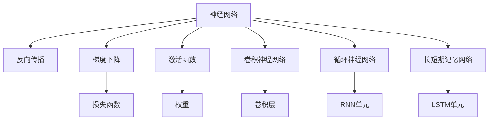

                 

# 神经网络(Neural Networks) - 原理与代码实例讲解

> 关键词：神经网络,深度学习,反向传播,梯度下降,激活函数,卷积神经网络,循环神经网络,长短期记忆网络,代码实现

## 1. 背景介绍

### 1.1 问题由来
神经网络（Neural Networks）是深度学习领域的核心技术，通过模拟人脑神经元之间的相互连接，实现对数据的自动处理和特征提取。近年来，神经网络在计算机视觉、自然语言处理、语音识别、游戏AI等领域取得了巨大成功。

神经网络的应用涉及图像分类、目标检测、语音识别、文本生成等众多任务，显著提升了人工智能技术在现实世界中的表现能力。然而，神经网络结构复杂、参数众多，需要大量的数据和计算资源进行训练，且模型复杂度与性能之间的平衡一直是一个重要问题。

本博文旨在全面系统地介绍神经网络的原理，并配以代码实例，帮助读者深入理解神经网络的结构、算法和应用。

## 2. 核心概念与联系

### 2.1 核心概念概述
为更好地理解神经网络的工作原理和实际应用，本节将介绍几个关键概念及其间的联系：

- 神经网络（Neural Networks）：由多个神经元（节点）组成的网络，通过模拟人脑神经元之间的相互连接，实现对数据的自动处理和特征提取。
- 反向传播（Backpropagation）：神经网络中的核心算法，通过计算损失函数对权重的梯度，反向更新权重，实现模型的优化。
- 梯度下降（Gradient Descent）：一种优化算法，用于求解损失函数的极小值，是反向传播的核心步骤。
- 激活函数（Activation Function）：将神经元的输入信号转化为输出信号，常用的有sigmoid、ReLU等函数。
- 卷积神经网络（Convolutional Neural Networks, CNN）：专门用于图像处理任务的神经网络，通过卷积操作提取图像局部特征。
- 循环神经网络（Recurrent Neural Networks, RNN）：处理序列数据的神经网络，通过循环连接存储历史信息，适用于语言模型、时间序列预测等任务。
- 长短期记忆网络（Long Short-Term Memory, LSTM）：一种特殊类型的RNN，通过门控结构解决长期依赖问题。

这些概念间的联系可以通过以下Mermaid流程图来展示：



这个流程图展示了几类核心神经网络模型及其相互之间的关系：

1. 神经网络作为总体模型框架。
2. 反向传播算法用于更新模型权重，通过梯度下降实现参数优化。
3. 激活函数作为神经元的非线性变换，引入模型非线性特性。
4. 卷积神经网络、循环神经网络和长短期记忆网络等特定类型的神经网络，分别适用于不同类型的数据处理任务。

这些概念共同构成了神经网络的完整理论体系，并广泛应用于实际应用中。

## 3. 核心算法原理 & 具体操作步骤

### 3.1 算法原理概述
神经网络的核心算法是反向传播（Backpropagation），其原理可以简要描述如下：

1. 前向传播：将输入数据通过神经网络，计算出网络输出。
2. 损失函数计算：将输出结果与真实标签比较，计算损失函数。
3. 反向传播：计算损失函数对各个参数的梯度，并将梯度回传到网络各层。
4. 权重更新：使用梯度下降等优化算法，更新网络权重。

通过上述步骤，神经网络可以不断优化模型参数，逐步逼近最优解，实现对数据的有效处理和特征提取。

### 3.2 算法步骤详解

#### 3.2.1 前向传播
前向传播是神经网络中的一种重要操作，其过程如下：

1. 将输入数据$x$通过神经网络的输入层，传递到隐藏层。
2. 在隐藏层中，输入数据$x$通过权重矩阵$W_h$和偏置向量$b_h$，得到隐藏层输出$h$。
3. 将隐藏层输出$h$通过权重矩阵$W_o$和偏置向量$b_o$，得到最终输出$y$。

公式表示为：

$$
h = f(W_h x + b_h) \\
y = f(W_o h + b_o)
$$

其中$f$为激活函数。

#### 3.2.2 损失函数
损失函数（Loss Function）用于衡量模型预测输出与真实标签之间的差异，常见的损失函数包括均方误差（MSE）、交叉熵（Cross-Entropy）等。

以交叉熵损失函数为例，其公式如下：

$$
L(y, \hat{y}) = -\frac{1}{n} \sum_{i=1}^n y_i \log \hat{y_i}
$$

其中$y$为真实标签，$\hat{y}$为模型预测输出，$n$为样本数量。

#### 3.2.3 反向传播
反向传播是神经网络训练的核心算法，其过程如下：

1. 计算损失函数对输出层的梯度。
2. 根据链式法则，计算隐藏层的梯度。
3. 回传梯度，更新权重矩阵和偏置向量。

具体实现步骤为：

1. 计算输出层误差：$e_o = y - \hat{y}$
2. 计算输出层梯度：$\delta_o = e_o \cdot f'(y)$
3. 计算隐藏层误差：$\delta_h = W_o^T \delta_o \cdot f'(h)$
4. 计算隐藏层梯度：$\delta_h$

最后，根据梯度下降等优化算法，更新权重矩阵和偏置向量：

$$
W_h = W_h - \eta \delta_h x^T \\
b_h = b_h - \eta \delta_h
$$

其中$\eta$为学习率。

### 3.3 算法优缺点

神经网络的主要优点包括：

1. 非线性拟合能力：通过多层结构，可以拟合复杂的非线性函数，解决许多传统机器学习方法无法解决的问题。
2. 泛化能力：在大规模数据集上进行训练，能够有效提升模型泛化能力。
3. 自我学习能力：通过反向传播算法，可以自动更新模型参数，实现对数据的自动处理和特征提取。

同时，神经网络也存在一些缺点：

1. 计算复杂度：参数众多，需要大量的计算资源和时间。
2. 过拟合问题：模型复杂度高，容易过拟合。
3. 训练困难：需要大量的标注数据和计算资源。
4. 可解释性差：神经网络的内部工作机制难以解释。

### 3.4 算法应用领域

神经网络已经被广泛应用于计算机视觉、自然语言处理、语音识别、游戏AI等多个领域，以下是几个典型的应用场景：

- 计算机视觉：用于图像分类、目标检测、人脸识别等任务。
- 自然语言处理：用于机器翻译、情感分析、问答系统等任务。
- 语音识别：用于语音识别、语音合成等任务。
- 游戏AI：用于游戏决策、策略优化等任务。
- 推荐系统：用于用户行为预测、物品推荐等任务。

## 4. 数学模型和公式 & 详细讲解 & 举例说明

### 4.1 数学模型构建

本节将使用数学语言对神经网络的工作原理进行更加严格的刻画。

记神经网络模型为$N(x; \theta)$，其中$x$为输入数据，$\theta$为模型参数。神经网络由多个神经元组成，每个神经元接收前一层的输出，通过激活函数$f$进行非线性变换，输出结果作为下一层输入。

假设神经网络共有$L$层，记第$l$层神经元输出为$h_l$，激活函数为$f$，权重矩阵为$W_l$，偏置向量为$b_l$。则前向传播过程可以表示为：

$$
h_1 = f(W_1 x + b_1) \\
h_2 = f(W_2 h_1 + b_2) \\
\cdots \\
h_L = f(W_L h_{L-1} + b_L) \\
y = h_L
$$

### 4.2 公式推导过程

以一个简单的两层神经网络为例，推导其前向传播和反向传播过程。

假设神经网络有$L=2$层，输入层有$n$个神经元，隐藏层有$m$个神经元。则前向传播过程如下：

1. 输入层到隐藏层的传递：$h_1 = f(W_1 x + b_1)$
2. 隐藏层到输出层的传递：$h_2 = f(W_2 h_1 + b_2)$
3. 输出层输出：$y = h_2$

其中$x$为输入数据，$W_1, W_2$为权重矩阵，$b_1, b_2$为偏置向量。

反向传播过程如下：

1. 计算输出层误差：$e = y - \hat{y}$
2. 计算输出层梯度：$\delta_2 = e \cdot f'(y)$
3. 计算隐藏层梯度：$\delta_1 = W_2^T \delta_2 \cdot f'(h_1)$
4. 计算权重矩阵和偏置向量的更新：

$$
W_1 = W_1 - \eta \delta_1 x^T \\
b_1 = b_1 - \eta \delta_1 \\
W_2 = W_2 - \eta \delta_2 h_1^T \\
b_2 = b_2 - \eta \delta_2
$$

其中$\eta$为学习率，$f'$为激活函数的导数。

### 4.3 案例分析与讲解

#### 4.3.1 激活函数
激活函数是神经网络中非常重要的组成部分，其作用是将神经元的输入信号转化为输出信号，引入模型的非线性特性。

常用的激活函数包括：

- Sigmoid函数：$f(x) = \frac{1}{1 + e^{-x}}$

$$
\frac{\partial f}{\partial x} = f(x) (1 - f(x))
$$

- ReLU函数：$f(x) = max(0, x)$

$$
\frac{\partial f}{\partial x} = \begin{cases}
0, & x \leq 0 \\
1, & x > 0
\end{cases}
$$

- Tanh函数：$f(x) = \frac{e^x - e^{-x}}{e^x + e^{-x}}$

$$
\frac{\partial f}{\partial x} = 1 - f(x)^2
$$

#### 4.3.2 卷积神经网络

卷积神经网络（CNN）是一种专门用于图像处理任务的神经网络，通过卷积操作提取图像局部特征。其核心结构包括卷积层、池化层和全连接层。

卷积层的公式表示为：

$$
h_{conv} = f(W_{conv} * x + b_{conv})
$$

其中$W_{conv}$为卷积核，$x$为输入数据，$b_{conv}$为偏置向量，$*$表示卷积操作。

池化层的公式表示为：

$$
h_{pool} = f(W_{pool} * h_{conv} + b_{pool})
$$

其中$W_{pool}$为池化核，$h_{conv}$为前一层输出，$b_{pool}$为偏置向量。

全连接层的公式表示为：

$$
y = f(W_{fc} * h_{pool} + b_{fc})
$$

其中$W_{fc}$为全连接权重矩阵，$h_{pool}$为前一层输出，$b_{fc}$为偏置向量。

## 5. 项目实践：代码实例和详细解释说明

### 5.1 开发环境搭建

在进行神经网络实践前，我们需要准备好开发环境。以下是使用Python进行TensorFlow开发的环境配置流程：

1. 安装Anaconda：从官网下载并安装Anaconda，用于创建独立的Python环境。

2. 创建并激活虚拟环境：
```bash
conda create -n tf-env python=3.8 
conda activate tf-env
```

3. 安装TensorFlow：根据CUDA版本，从官网获取对应的安装命令。例如：
```bash
pip install tensorflow
```

4. 安装各类工具包：
```bash
pip install numpy pandas scikit-learn matplotlib tqdm jupyter notebook ipython
```

完成上述步骤后，即可在`tf-env`环境中开始神经网络实践。

### 5.2 源代码详细实现

下面我们以手写数字识别（MNIST）为例，给出使用TensorFlow构建卷积神经网络（CNN）的代码实现。

首先，定义神经网络模型：

```python
import tensorflow as tf
from tensorflow.keras import layers

model = tf.keras.Sequential([
    layers.Conv2D(32, (3, 3), activation='relu', input_shape=(28, 28, 1)),
    layers.MaxPooling2D((2, 2)),
    layers.Flatten(),
    layers.Dense(128, activation='relu'),
    layers.Dense(10)
])
```

然后，定义优化器、损失函数和训练流程：

```python
optimizer = tf.keras.optimizers.Adam(learning_rate=0.001)
loss_fn = tf.keras.losses.SparseCategoricalCrossentropy(from_logits=True)
model.compile(optimizer=optimizer, loss=loss_fn, metrics=['accuracy'])

model.fit(train_images, train_labels, epochs=10, validation_data=(test_images, test_labels))
```

最后，在测试集上评估模型性能：

```python
test_loss, test_acc = model.evaluate(test_images, test_labels, verbose=2)
print('Test accuracy:', test_acc)
```

以上就是使用TensorFlow实现卷积神经网络的完整代码实现。可以看到，TensorFlow的Keras API使得构建和训练神经网络变得非常简单高效。

### 5.3 代码解读与分析

让我们再详细解读一下关键代码的实现细节：

**Sequential模型**：
- 通过Keras API，可以方便地构建序列模型，即多个层按顺序排列的模型。
- `Sequential`模型默认采用后向传播算法进行参数更新。

**卷积层**：
- `Conv2D`层表示2D卷积层，参数包括卷积核大小、数量、激活函数等。
- `input_shape`指定输入数据的维度，本例中为28x28的灰度图像。

**池化层**：
- `MaxPooling2D`层表示2D最大池化层，用于减少特征图尺寸，提升计算效率。

**全连接层**：
- `Flatten`层用于将特征图展平，形成一维向量。
- `Dense`层表示全连接层，用于将展平的特征映射到输出空间。

**优化器**：
- 使用Adam优化器，学习率为0.001。
- 优化器是神经网络训练的核心组件，负责更新模型参数。

**损失函数**：
- 使用交叉熵损失函数，`from_logits=True`表示直接使用未激活的logits作为输出。

**模型编译**：
- `compile`方法用于配置模型，指定优化器、损失函数和评估指标。
- 在编译模型时，可以选择自定义损失函数、评价指标、回调函数等。

**模型训练**：
- `fit`方法用于训练模型，输入为训练数据和标签。
- 训练过程中，模型自动进行前向传播、计算损失、反向传播和参数更新等操作。
- `validation_data`指定验证集数据和标签，用于监控模型训练过程中的性能变化。

**模型评估**：
- `evaluate`方法用于在测试集上评估模型性能。
- 返回损失值和评估指标，如准确率等。

可以看到，TensorFlow的Keras API使得神经网络的构建和训练变得非常简单高效。开发者可以专注于模型的设计和优化，而不必过多关注底层实现细节。

## 6. 实际应用场景

### 6.1 图像分类

神经网络在图像分类任务上取得了显著效果，广泛应用于物体识别、场景分类、人脸识别等领域。

以图像分类为例，神经网络可以将输入图像转化为高维特征向量，通过全连接层进行分类。通过在大量图像数据上训练模型，可以学习到不同物体和场景的特征，实现高效准确的分类。

### 6.2 自然语言处理

神经网络在自然语言处理（NLP）任务上也有广泛应用，如机器翻译、文本分类、情感分析、问答系统等。

以机器翻译为例，神经网络可以将输入序列转化为高维特征向量，通过多个编码器-解码器层，生成目标序列。通过在大量平行语料上训练模型，可以学习到语言之间的映射关系，实现高效准确的翻译。

### 6.3 语音识别

神经网络在语音识别任务上也取得了显著效果，广泛应用于语音助手、语音命令识别、电话自动语音应答等领域。

以语音识别为例，神经网络可以将输入语音转化为声学特征，通过多层网络结构，进行声学模型和语言模型的联合建模，实现高效准确的语音识别。

### 6.4 游戏AI

神经网络在人工智能游戏中也取得了重要进展，广泛应用于AlphaGo、AlphaStar等AI游戏平台。

以AlphaGo为例，神经网络结合蒙特卡罗树搜索算法，可以学习到围棋的复杂策略，实现高水平的围棋对弈。通过在大规模围棋数据上训练模型，可以学习到围棋的策略和规则，实现高效准确的策略选择。

## 7. 工具和资源推荐

### 7.1 学习资源推荐

为了帮助开发者系统掌握神经网络的理论基础和实践技巧，这里推荐一些优质的学习资源：

1. 《深度学习》系列博文：由大模型技术专家撰写，深入浅出地介绍了深度学习的基本概念和核心算法。

2. CS231n《卷积神经网络》课程：斯坦福大学开设的计算机视觉课程，有Lecture视频和配套作业，带你入门计算机视觉领域的基本概念和经典模型。

3. 《深度学习框架TensorFlow实战》书籍：TensorFlow官方文档中列出的书籍，详细介绍了TensorFlow框架的使用方法和最佳实践。

4. 《深度学习入门之神经网络》课程：DeepLearning.AI推出的入门课程，通过视频和代码实践，系统讲解了神经网络的构建和训练过程。

5. PyTorch官方文档：PyTorch官方文档，提供了海量预训练模型和完整的神经网络样例代码，是上手实践的必备资料。

通过对这些资源的学习实践，相信你一定能够快速掌握神经网络的核心原理和应用方法。

### 7.2 开发工具推荐

高效的开发离不开优秀的工具支持。以下是几款用于神经网络开发的常用工具：

1. TensorFlow：由Google主导开发的深度学习框架，功能强大，支持GPU/TPU算力，适合大规模工程应用。

2. PyTorch：由Facebook主导开发的深度学习框架，易于使用，支持动态计算图，适合快速迭代研究。

3. Keras：高层次API，支持多种深度学习框架，方便用户快速构建和训练神经网络。

4. Jupyter Notebook：基于Web的交互式笔记本，支持多语言编程，适合数据探索和模型调试。

5. Weights & Biases：模型训练的实验跟踪工具，可以记录和可视化模型训练过程中的各项指标，方便对比和调优。

6. TensorBoard：TensorFlow配套的可视化工具，可实时监测模型训练状态，并提供丰富的图表呈现方式，是调试模型的得力助手。

合理利用这些工具，可以显著提升神经网络的开发效率，加快创新迭代的步伐。

### 7.3 相关论文推荐

神经网络的研究源于学界的持续研究。以下是几篇奠基性的相关论文，推荐阅读：

1. A Framework for Learning Principal Manifolds via Linear Programming（自编码器）：提出自编码器结构，利用线性规划学习数据的低维表示。

2. Learning Deep Architectures for AI（多层神经网络）：提出多层神经网络结构，引入非线性变换，解决非线性回归问题。

3. ImageNet Classification with Deep Convolutional Neural Networks（卷积神经网络）：提出卷积神经网络结构，利用卷积操作提取图像局部特征，提升图像分类准确率。

4. Recurrent Neural Network Learning in Direct Supervised Sequence Prediction（循环神经网络）：提出循环神经网络结构，通过循环连接存储历史信息，适用于语言模型、时间序列预测等任务。

5. Long Short-Term Memory（长短期记忆网络）：提出长短期记忆网络结构，通过门控机制解决长期依赖问题，适用于自然语言处理和语音识别任务。

这些论文代表了大规模神经网络的研究脉络。通过学习这些前沿成果，可以帮助研究者把握学科前进方向，激发更多的创新灵感。

## 8. 总结：未来发展趋势与挑战

### 8.1 研究成果总结

本文对神经网络的原理与代码实例进行了全面系统的介绍。首先介绍了神经网络的核心概念和原理，然后以卷积神经网络、循环神经网络和长短期记忆网络为例，详细讲解了神经网络的构建和训练过程。最后，探讨了神经网络在图像分类、自然语言处理、语音识别和游戏AI等多个领域的应用前景。

通过本文的系统梳理，可以看到，神经网络已经成为深度学习领域的核心技术，在各个应用场景中发挥着重要作用。

### 8.2 未来发展趋势

展望未来，神经网络将呈现以下几个发展趋势：

1. 模型规模持续增大。随着算力成本的下降和数据规模的扩张，神经网络的参数量还将持续增长。超大规模神经网络蕴含的丰富特征信息，有望支撑更加复杂多变的任务微调。

2. 深度和广度并重。未来神经网络将追求更深层次的特征提取和更广泛的模型训练，以提升模型泛化能力和性能表现。

3. 无监督学习与半监督学习应用增加。未来神经网络将更多地利用无监督学习、半监督学习等方法，减少对标注数据的需求，提升模型通用性和泛化能力。

4. 模型压缩与加速。未来神经网络将更多地关注模型压缩、加速技术，如知识蒸馏、稀疏化存储等，以实现更加高效的应用部署。

5. 多模态融合。未来神经网络将更多地关注多模态融合技术，如视觉-文本、语音-文本、图像-语音等，实现更全面、准确的信息整合。

以上趋势凸显了神经网络技术的广阔前景。这些方向的探索发展，必将进一步提升神经网络的性能和应用范围，为人工智能技术的发展带来新的动力。

### 8.3 面临的挑战

尽管神经网络已经取得了巨大成功，但在迈向更加智能化、普适化应用的过程中，仍面临诸多挑战：

1. 训练成本高昂。神经网络需要大量的计算资源和时间进行训练，成本较高。如何降低训练成本，提升训练效率，是未来的一个重要研究方向。

2. 模型泛化能力有限。神经网络在特定任务上表现优异，但在通用数据集上的泛化能力仍有待提升。如何提升模型的泛化能力，是未来的一个关键问题。

3. 模型解释性不足。神经网络的内部工作机制难以解释，难以对模型输出进行有效监管。如何提高模型的可解释性，是未来的一个重要研究方向。

4. 数据隐私与安全问题。神经网络在处理大量数据时，可能涉及隐私和安全问题。如何保护数据隐私，确保数据安全，是未来的一个重要研究方向。

5. 模型鲁棒性不足。神经网络在面对噪声、对抗攻击等外部干扰时，可能产生鲁棒性问题。如何提高模型的鲁棒性，是未来的一个重要研究方向。

### 8.4 研究展望

面对神经网络面临的种种挑战，未来的研究需要在以下几个方面寻求新的突破：

1. 探索更加高效的神经网络结构。通过结构创新，提升神经网络的计算效率和模型泛化能力。

2. 研究无监督学习与半监督学习方法。减少对标注数据的需求，利用大数据提升模型泛化能力。

3. 引入多模态融合技术。实现视觉、文本、语音等不同模态数据的协同建模，提升多模态数据的处理能力。

4. 提升模型的可解释性。通过引入符号化知识、逻辑推理等方法，提升神经网络的可解释性，增强模型可信度。

5. 引入对抗训练和鲁棒性提升技术。提高神经网络的鲁棒性，防止模型在面对噪声、对抗攻击等外部干扰时产生鲁棒性问题。

6. 引入数据隐私保护技术。通过差分隐私、联邦学习等技术，保护数据隐私，确保数据安全。

这些研究方向的探索，必将引领神经网络技术迈向更高的台阶，为人工智能技术的发展提供新的动力。相信随着学界和产业界的共同努力，神经网络技术必将不断突破，推动人工智能技术向更广泛、更深入的领域发展。

