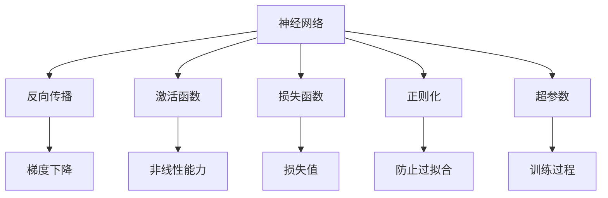

                 

## 1. 背景介绍

### 1.1 问题由来

随着人工智能技术的飞速发展，神经网络（Neural Networks, NNs）已经成为处理复杂计算任务的重要工具。从图像识别、语音识别到自然语言处理、自动驾驶等诸多领域，神经网络已经展现出强大的泛化能力和适应性。然而，尽管神经网络带来了诸多便利，但其背后的黑箱机制和潜在的决策风险也引起了广泛的关注。

如何在保障性能的同时，提升神经网络的透明度和安全性，成为当下研究的热点和难点。本文将探讨神经网络的核心概念、算法原理、数学模型以及应用场景，旨在为读者提供全面的技术指引，并展望未来研究的方向。

### 1.2 问题核心关键点

神经网络作为当今最主流的机器学习算法之一，其核心在于通过多层非线性变换，学习输入数据与输出数据之间的映射关系。然而，神经网络的黑箱特性、可解释性不足、鲁棒性问题等，都限制了其在实际应用中的广泛推广。

本研究将重点关注以下几个关键问题：

1. 神经网络的结构与参数优化。
2. 神经网络的数学建模与计算优化。
3. 神经网络的可解释性与鲁棒性。
4. 神经网络的应用场景与未来展望。

## 2. 核心概念与联系

### 2.1 核心概念概述

为更好地理解神经网络的核心概念，本节将介绍几个关键概念及其相互关系：

- **神经网络**：一种模仿生物神经网络结构，通过多层神经元节点进行信息传递和计算的机器学习模型。
- **反向传播**：一种用于计算神经网络梯度的方法，通过链式法则计算各层神经元对损失函数的贡献。
- **激活函数**：用于引入非线性变换的函数，常见如ReLU、Sigmoid、Tanh等，对神经网络非线性能力至关重要。
- **损失函数**：衡量模型预测输出与真实标签之间差异的函数，常见如均方误差（MSE）、交叉熵（Cross Entropy）等。
- **正则化**：通过引入惩罚项，防止模型过拟合的方法，常见如L1、L2正则化、Dropout等。
- **超参数**：在模型训练过程中需要手动设置的参数，如学习率、批量大小、训练轮数等，对模型性能有重要影响。
- **梯度下降**：一种常用的优化算法，通过不断调整模型参数，最小化损失函数。

这些核心概念之间的逻辑关系可以通过以下Mermaid流程图来展示：



这个流程图展示出神经网络各组件之间的相互作用：

1. 神经网络通过反向传播计算梯度，更新模型参数。
2. 激活函数引入非线性变换，增强模型表达能力。
3. 损失函数衡量模型性能，指导参数更新。
4. 正则化技术避免过拟合，保证模型泛化性。
5. 超参数设定训练过程，影响模型性能。

这些概念共同构成了神经网络的基本框架，使得神经网络能够高效地学习复杂映射关系。通过理解这些核心概念，我们可以更好地把握神经网络的工作原理和优化方向。

## 3. 核心算法原理 & 具体操作步骤

### 3.1 算法原理概述

神经网络的核心算法原理可以概括为以下几个关键步骤：

1. **前向传播**：将输入数据通过网络，计算出中间特征表示，最终输出预测结果。
2. **反向传播**：计算预测结果与真实标签之间的误差，反向传播误差，更新模型参数。
3. **参数优化**：通过优化算法（如梯度下降），不断调整模型参数，最小化损失函数。
4. **正则化**：应用正则化技术，防止模型过拟合，提升泛化能力。

这些步骤通过不断迭代，逐步逼近最优模型，使得神经网络能够在不同任务上取得优异性能。

### 3.2 算法步骤详解

以分类任务为例，神经网络的训练过程可以详细分解为以下几个步骤：

**Step 1: 数据准备与预处理**

- 收集训练集和测试集，并进行数据清洗、归一化等预处理操作。
- 划分训练集和验证集，保证模型在未知数据上的泛化能力。

**Step 2: 模型搭建**

- 选择合适的神经网络架构，如卷积神经网络（CNN）、循环神经网络（RNN）、长短期记忆网络（LSTM）等。
- 设计网络层次结构，包括输入层、隐藏层、输出层等。
- 选择合适的激活函数、损失函数和优化器。

**Step 3: 初始化参数**

- 随机初始化模型参数，通常是均值为0、方差为$\frac{1}{\sqrt{n}}$的高斯分布。

**Step 4: 前向传播**

- 将输入数据输入网络，计算中间特征表示。
- 通过激活函数引入非线性变换。

**Step 5: 计算损失**

- 将网络输出与真实标签计算损失值，如交叉熵损失。

**Step 6: 反向传播**

- 通过链式法则计算各层参数对损失函数的梯度。
- 更新模型参数，最小化损失函数。

**Step 7: 正则化**

- 应用L1、L2正则化、Dropout等技术，防止模型过拟合。

**Step 8: 训练迭代**

- 重复前向传播、反向传播、参数更新过程，直至模型收敛。

**Step 9: 模型评估**

- 在测试集上评估模型性能，输出混淆矩阵、准确率、召回率等指标。

以上是神经网络训练的一般流程，但实际应用中还需针对具体任务进行优化设计，如改进训练目标函数，引入更多的正则化技术，搜索最优的超参数组合等，以进一步提升模型性能。

### 3.3 算法优缺点

神经网络在机器学习和人工智能领域取得了诸多突破性成果，但同时也存在一些固有缺陷：

优点：

1. 高泛化能力：神经网络能够学习复杂映射关系，适应不同数据分布。
2. 非线性表达：通过多层非线性变换，提升模型表达能力。
3. 自适应学习：通过反向传播和梯度下降，网络自动优化参数。

缺点：

1. 黑箱特性：模型参数和决策过程复杂，难以解释。
2. 过拟合风险：易受训练数据影响，泛化性能不稳定。
3. 计算资源消耗高：参数量巨大，训练和推理耗时较长。

尽管存在这些局限性，但就目前而言，神经网络仍是处理复杂计算任务的重要工具。未来研究的方向在于如何进一步提升模型的可解释性和鲁棒性，降低计算资源消耗，同时保持高泛化能力。

### 3.4 算法应用领域

神经网络在诸多领域得到了广泛应用，以下列举几个典型应用场景：

- **计算机视觉**：用于图像分类、目标检测、图像生成等任务，如卷积神经网络（CNN）。
- **自然语言处理**：用于文本分类、情感分析、机器翻译等任务，如循环神经网络（RNN）、长短期记忆网络（LSTM）。
- **语音识别**：用于语音转文本、语音情感分析等任务，如卷积神经网络（CNN）、循环神经网络（RNN）。
- **机器人控制**：用于机器人路径规划、动作生成等任务，如深度强化学习（DRL）。
- **金融分析**：用于股票预测、风险评估等任务，如循环神经网络（RNN）、自注意力机制（Transformer）。
- **医疗诊断**：用于医学图像分析、疾病预测等任务，如卷积神经网络（CNN）、深度学习（DL）。

除了这些经典应用外，神经网络还被创新性地应用于更多场景中，如智能推荐、智能制造、智慧交通等，为各行各业带来了新的突破。

## 4. 数学模型和公式 & 详细讲解 & 举例说明

### 4.1 数学模型构建

神经网络的数学模型通常由以下几部分组成：

- **输入层**：将原始数据映射为神经网络所需格式，如将图像数据转化为向量形式。
- **隐藏层**：通过多层非线性变换，提取特征表示。
- **输出层**：将隐藏层的特征映射为模型的预测结果。

以一个简单的多层感知机（Multilayer Perceptron, MLP）为例，其数学模型可以表示为：

$$
y = W_h \cdot a_x + b_x
$$

$$
y' = W_o \cdot a_h + b_o
$$

其中，$a_x$ 为输入层激活，$a_h$ 为隐藏层激活，$W_h$ 和 $b_h$ 为隐藏层参数，$y'$ 为输出层激活，$W_o$ 和 $b_o$ 为输出层参数。

### 4.2 公式推导过程

以二分类任务为例，神经网络的训练过程可以详细推导如下：

**Step 1: 前向传播**

设输入数据为 $x$，隐藏层神经元数量为 $n$，激活函数为 $a(x) = \frac{1}{1+e^{-x}}$，则前向传播过程可以表示为：

$$
z_h = W_h \cdot a_x + b_h
$$

$$
a_h = a(z_h)
$$

$$
z_o = W_o \cdot a_h + b_o
$$

$$
y = a(z_o)
$$

其中，$z_h$ 为隐藏层输入，$a_h$ 为隐藏层输出，$z_o$ 为输出层输入，$y$ 为网络预测结果。

**Step 2: 计算损失**

设真实标签为 $y_t$，交叉熵损失函数为 $L = -y_t \log(y) - (1-y_t) \log(1-y)$，则损失值可以表示为：

$$
L = -\frac{1}{N} \sum_{i=1}^{N} y_t^i \log(y^i) + (1-y_t^i) \log(1-y^i)
$$

**Step 3: 反向传播**

通过链式法则计算各层参数对损失函数的梯度，并更新参数：

$$
\frac{\partial L}{\partial W_h} = \frac{\partial L}{\partial z_o} \frac{\partial z_o}{\partial a_h} \frac{\partial a_h}{\partial z_h} \frac{\partial z_h}{\partial W_h}
$$

$$
\frac{\partial L}{\partial b_h} = \frac{\partial L}{\partial z_o} \frac{\partial z_o}{\partial a_h} \frac{\partial a_h}{\partial z_h}
$$

$$
\frac{\partial L}{\partial W_o} = \frac{\partial L}{\partial z_o} \frac{\partial z_o}{\partial a_h}
$$

$$
\frac{\partial L}{\partial b_o} = \frac{\partial L}{\partial z_o}
$$

**Step 4: 参数更新**

通过优化算法（如梯度下降），不断调整模型参数，最小化损失函数。

$$
W_h \leftarrow W_h - \eta \frac{\partial L}{\partial W_h}
$$

$$
b_h \leftarrow b_h - \eta \frac{\partial L}{\partial b_h}
$$

$$
W_o \leftarrow W_o - \eta \frac{\partial L}{\partial W_o}
$$

$$
b_o \leftarrow b_o - \eta \frac{\partial L}{\partial b_o}
$$

其中，$\eta$ 为学习率。

### 4.3 案例分析与讲解

以手写数字识别任务为例，神经网络的训练过程如下：

1. **数据准备**：收集手写数字数据集，并进行数据清洗、归一化等预处理操作。
2. **模型搭建**：设计一个具有3层隐藏层的全连接神经网络，选择合适的激活函数和损失函数。
3. **初始化参数**：随机初始化模型参数。
4. **前向传播**：将输入数据输入网络，计算中间特征表示。
5. **计算损失**：将网络输出与真实标签计算交叉熵损失。
6. **反向传播**：计算各层参数对损失函数的梯度。
7. **参数更新**：通过梯度下降，不断调整模型参数，最小化损失函数。
8. **训练迭代**：重复前向传播、反向传播、参数更新过程，直至模型收敛。
9. **模型评估**：在测试集上评估模型性能，输出混淆矩阵、准确率、召回率等指标。

通过详细讲解手写数字识别任务，可以看出神经网络的训练过程相对复杂，但通过不断迭代和优化，可以在一定程度上提高模型性能。

## 5. 项目实践：代码实例和详细解释说明

### 5.1 开发环境搭建

在进行神经网络项目实践前，我们需要准备好开发环境。以下是使用Python进行TensorFlow开发的环境配置流程：

1. 安装Anaconda：从官网下载并安装Anaconda，用于创建独立的Python环境。

2. 创建并激活虚拟环境：
```bash
conda create -n tf-env python=3.8 
conda activate tf-env
```

3. 安装TensorFlow：根据CUDA版本，从官网获取对应的安装命令。例如：
```bash
conda install tensorflow-gpu=tensorflow-2.6=cudatoolkit=11.1 -c pytorch -c conda-forge
```

4. 安装各类工具包：
```bash
pip install numpy pandas scikit-learn matplotlib tqdm jupyter notebook ipython
```

完成上述步骤后，即可在`tf-env`环境中开始项目实践。

### 5.2 源代码详细实现

下面我们以手写数字识别（MNIST）为例，给出使用TensorFlow对神经网络进行训练的Python代码实现。

首先，导入必要的库：

```python
import tensorflow as tf
from tensorflow.keras.datasets import mnist
from tensorflow.keras.models import Sequential
from tensorflow.keras.layers import Dense, Dropout
from tensorflow.keras.optimizers import Adam
```

然后，准备数据集：

```python
(x_train, y_train), (x_test, y_test) = mnist.load_data()
x_train, x_test = x_train / 255.0, x_test / 255.0
x_train = x_train.reshape(-1, 784)
x_test = x_test.reshape(-1, 784)
```

接着，定义模型：

```python
model = Sequential([
    Dense(512, activation='relu', input_shape=(784,)),
    Dropout(0.5),
    Dense(10, activation='softmax')
])
```

然后，定义损失函数、优化器和评估指标：

```python
loss_fn = tf.keras.losses.SparseCategoricalCrossentropy(from_logits=True)
optimizer = Adam(learning_rate=0.001)
model.compile(optimizer=optimizer,
              loss=loss_fn,
              metrics=['accuracy'])
```

最后，训练模型并评估性能：

```python
epochs = 10
batch_size = 32

history = model.fit(x_train, y_train, epochs=epochs, validation_data=(x_test, y_test), batch_size=batch_size)
model.evaluate(x_test, y_test)
```

以上就是使用TensorFlow对神经网络进行手写数字识别的完整代码实现。可以看到，TensorFlow的高级API使得神经网络的搭建、训练和评估过程变得简洁高效。

### 5.3 代码解读与分析

让我们再详细解读一下关键代码的实现细节：

**Sequential模型定义**：
- `Sequential`：一种线性堆叠神经网络层的模型，便于定义和训练。
- `Dense`：全连接层，激活函数为ReLU。
- `Dropout`：随机丢弃部分神经元，防止过拟合。
- `Softmax`：输出层激活函数，用于多分类问题。

**模型编译**：
- `SparseCategoricalCrossentropy`：用于多分类问题的交叉熵损失函数。
- `Adam`：一种常用的优化算法，具有良好的收敛性和泛化能力。

**模型训练**：
- `fit`方法：指定训练数据、批次大小、迭代轮数等参数，启动模型训练。
- `evaluate`方法：在测试集上评估模型性能，输出混淆矩阵、准确率、召回率等指标。

可以看到，TensorFlow的高级API和Keras风格的接口，使得神经网络的开发过程更加简洁、高效。开发者可以将更多精力放在模型优化、数据处理等高层逻辑上，而不必过多关注底层的实现细节。

当然，工业级的系统实现还需考虑更多因素，如模型的保存和部署、超参数的自动搜索、更灵活的模型架构等。但核心的神经网络训练过程基本与此类似。

## 6. 实际应用场景

### 6.1 智能推荐系统

神经网络在智能推荐系统中的应用，主要体现在用户行为预测和物品推荐两个方面。通过对用户历史行为数据进行建模，神经网络可以预测用户的未来兴趣，从而推荐可能感兴趣的商品或内容。

在实践中，可以收集用户浏览、点击、评分等行为数据，并设计相应的神经网络模型，如协同过滤（CF）、深度神经网络（DNN）等，对用户兴趣进行建模。微调后的模型能够从用户行为数据中提取特征，准确把握用户兴趣点，提高推荐系统的效果和覆盖度。

### 6.2 医疗影像分析

神经网络在医疗影像分析中的应用，主要体现在病变检测和图像分类两个方面。通过对医疗影像数据进行预处理和标注，神经网络可以学习到病变区域的特征表示，从而自动检测和分类病变。

在实践中，可以收集大量医疗影像数据，并设计相应的神经网络模型，如卷积神经网络（CNN）、全卷积神经网络（FCN）等，对病变进行检测和分类。微调后的模型能够从影像数据中提取病变区域的特征，准确识别和分类病变，辅助医生进行诊断和治疗。

### 6.3 自动驾驶系统

神经网络在自动驾驶系统中的应用，主要体现在路径规划和行为预测两个方面。通过对道路环境数据进行建模，神经网络可以预测其他车辆的行驶行为，从而制定最优驾驶策略。

在实践中，可以收集道路环境数据，并设计相应的神经网络模型，如卷积神经网络（CNN）、循环神经网络（RNN）等，对道路环境进行建模。微调后的模型能够从道路环境数据中提取特征，预测其他车辆的行驶行为，制定最优驾驶策略，提高自动驾驶系统的安全性和稳定性。

### 6.4 未来应用展望

随着神经网络技术的不断发展，其在更多领域的应用前景将愈加广阔。未来，神经网络将不仅仅局限于图像、语音、文本等传统领域，还将拓展到更加复杂和多模态的任务中。

在智慧城市治理中，神经网络将应用于城市事件监测、舆情分析、应急指挥等环节，提高城市管理的自动化和智能化水平，构建更安全、高效的未来城市。

在智能制造领域，神经网络将应用于生产过程优化、故障预测、智能调度等任务，提升制造系统的效率和可靠性。

在金融分析领域，神经网络将应用于股票预测、风险评估、客户行为分析等任务，提升金融机构的决策能力和风险管理水平。

此外，在教育、环保、农业等众多领域，神经网络也将发挥重要作用，为各行各业带来新的突破。相信随着技术的不断进步，神经网络将更好地服务于人类社会，带来更广阔的发展空间。

## 7. 工具和资源推荐

### 7.1 学习资源推荐

为了帮助开发者系统掌握神经网络的理论基础和实践技巧，这里推荐一些优质的学习资源：

1. 《深度学习》系列书籍：Ian Goodfellow等所著，全面介绍了深度学习的基本概念、算法原理和应用实例。

2. CS231n《卷积神经网络》课程：斯坦福大学开设的深度学习课程，涵盖卷积神经网络、图像分类、目标检测等经典任务。

3. CS224n《自然语言处理与深度学习》课程：斯坦福大学开设的NLP课程，涵盖自然语言处理的基本概念、算法原理和应用实例。

4. 《Python深度学习》书籍：Francois Chollet所著，介绍了使用Keras框架进行深度学习的全过程。

5. TensorFlow官方文档：Google开发的深度学习框架，提供了详尽的API文档和教程，适合实战练习。

6. PyTorch官方文档：Facebook开发的深度学习框架，提供了高效的动态计算图和丰富的模型库，适合研究和开发。

通过对这些资源的学习实践，相信你一定能够快速掌握神经网络的核心思想和实践技巧，并应用于实际项目中。

### 7.2 开发工具推荐

高效的开发离不开优秀的工具支持。以下是几款用于神经网络开发的常用工具：

1. TensorFlow：由Google主导开发的深度学习框架，适合大规模工程应用，支持GPU/TPU加速。

2. PyTorch：由Facebook主导开发的深度学习框架，适合研究性开发，支持动态计算图和GPU加速。

3. Keras：基于TensorFlow和Theano开发的高级API，适合快速搭建和训练神经网络模型。

4. Scikit-Learn：Python机器学习库，提供了丰富的机器学习算法和模型评估工具。

5. Jupyter Notebook：交互式编程环境，支持Python、R等多种语言，适合实验和交流。

6. Google Colab：谷歌推出的在线Jupyter Notebook环境，免费提供GPU/TPU算力，方便实验和分享。

合理利用这些工具，可以显著提升神经网络开发和研究的效率，加速创新迭代的步伐。

### 7.3 相关论文推荐

神经网络作为当今最主流的机器学习算法之一，其研究领域广泛而深入。以下是几篇奠基性的相关论文，推荐阅读：

1. **AlexNet**：由ImageNet数据集竞赛启发，开创了卷积神经网络（CNN）在图像识别任务中的应用。

2. **VGGNet**：通过深度堆叠卷积层，展示了更深层神经网络在图像识别任务中的优越性能。

3. **ResNet**：通过残差连接解决了深度神经网络中的梯度消失问题，实现了更深层网络的训练。

4. **LSTM**：通过引入长短期记忆机制，解决了传统RNN在长序列上的梯度消失问题，适用于序列数据建模。

5. **Transformer**：基于自注意力机制，显著提升了序列建模的效果，适用于自然语言处理（NLP）任务。

6. **GAN**：通过生成对抗网络，实现了图像生成、视频合成等任务，展示了神经网络在生成建模中的潜力。

这些论文代表了大神经网络的发展脉络。通过学习这些前沿成果，可以帮助研究者把握学科前进方向，激发更多的创新灵感。

## 8. 总结：未来发展趋势与挑战

### 8.1 研究成果总结

本文对神经网络的核心概念、算法原理、数学模型以及应用场景进行了全面系统的介绍。首先阐述了神经网络的发展历程和核心思想，明确了其在图像识别、语音识别、自然语言处理等领域的广泛应用。其次，从原理到实践，详细讲解了神经网络的训练过程和优化策略，给出了详细的代码实现和分析。同时，本文还探讨了神经网络的未来发展趋势和面临的挑战，提出了进一步提升其可解释性和鲁棒性的研究方向。

通过本文的系统梳理，可以看到，神经网络在机器学习和人工智能领域取得了诸多突破性成果，其核心思想和方法论将继续指导未来的研究和发展。

### 8.2 未来发展趋势

展望未来，神经网络将呈现以下几个发展趋势：

1. **更深层的网络结构**：随着计算能力的提升，神经网络的深度将不断增加，以实现更复杂的建模和更强的泛化能力。

2. **更高效的网络架构**：研究更轻量级、更低功耗的网络架构，如MobileNet、EfficientNet等，以适应移动端和嵌入式设备的计算需求。

3. **更智能的学习策略**：引入强化学习、自监督学习等高级学习策略，提升神经网络的自我优化能力和泛化能力。

4. **更广泛的应用场景**：神经网络将在更多领域得到应用，如医疗、金融、教育等，为各行各业带来新的突破。

5. **更强大的可解释性**：研究更可解释的神经网络模型，如可解释深度学习（XDL）、神经符号混合等，提升模型的可解释性和可信度。

6. **更稳定的鲁棒性**：通过对抗训练、鲁棒优化等方法，提升神经网络的鲁棒性和抗干扰能力，以应对实际应用中的各种噪声和攻击。

以上趋势凸显了神经网络技术的广阔前景，这些方向的探索发展，必将进一步提升神经网络系统的性能和应用范围，为人工智能技术的发展注入新的动力。

### 8.3 面临的挑战

尽管神经网络技术取得了诸多突破性成果，但在迈向更加智能化、普适化应用的过程中，它仍面临诸多挑战：

1. **数据需求高**：神经网络需要大量标注数据进行训练，标注成本高、数据获取困难。

2. **计算资源消耗大**：大规模神经网络需要大量计算资源，训练和推理耗时长、资源消耗大。

3. **可解释性不足**：神经网络的决策过程难以解释，缺乏透明性和可信度。

4. **鲁棒性问题**：神经网络容易受到输入噪声和对抗攻击的影响，泛化性能不稳定。

5. **过拟合风险**：易受训练数据影响，泛化性能不稳定。

6. **算法复杂度高**：神经网络结构复杂，调试和优化难度大。

正视这些挑战，积极应对并寻求突破，将使神经网络技术不断进步，应用范围更加广泛。

### 8.4 研究展望

面对神经网络所面临的挑战，未来的研究需要在以下几个方面寻求新的突破：

1. **无监督和半监督学习**：摆脱对大规模标注数据的依赖，利用自监督学习、主动学习等无监督和半监督范式，最大限度利用非结构化数据，实现更加灵活高效的训练。

2. **参数高效和计算高效**：开发更加参数高效的神经网络模型，如 Adapter、Prefix等，在固定大部分参数的同时，只更新极少量的任务相关参数。同时优化计算图，减少前向传播和反向传播的资源消耗，实现更加轻量级、实时性的部署。

3. **因果学习和生成模型**：引入因果推断和生成模型，增强神经网络的稳定性和生成能力，学习更加普适、鲁棒的语言表征，提升模型的泛化性能。

4. **多模态学习**：融合视觉、语音、文本等多模态信息，实现更全面、准确的信息整合能力，提升模型的应用范围和效果。

5. **可解释性增强**：研究更可解释的神经网络模型，如可解释深度学习（XDL）、神经符号混合等，提升模型的透明性和可信度。

6. **鲁棒性提升**：通过对抗训练、鲁棒优化等方法，提升神经网络的鲁棒性和抗干扰能力，确保模型在实际应用中的稳定性和可靠性。

这些研究方向将引领神经网络技术的进一步发展，为构建安全、可靠、可解释、可控的智能系统铺平道路。

## 9. 附录：常见问题与解答

**Q1：神经网络的参数量对性能有何影响？**

A: 神经网络的性能很大程度上取决于其参数量。更大的参数量意味着更强的表达能力，但也带来了更高的计算资源消耗和训练难度。在实际应用中，需要根据任务复杂度和计算资源进行合理的参数量选择。

**Q2：神经网络如何避免过拟合？**

A: 神经网络的过拟合问题可以通过以下方法解决：

1. 数据增强：通过数据增强方法（如旋转、平移、裁剪等）扩充训练集，增加数据多样性。

2. 正则化：通过L1、L2正则化、Dropout等技术，防止模型过拟合。

3. 提前停止：通过监控验证集上的性能指标，在性能不再提升时提前停止训练。

4. 模型简化：减少模型参数量，降低模型复杂度，提升泛化能力。

**Q3：神经网络在多模态任务中的应用如何？**

A: 神经网络在多模态任务中的应用主要体现在融合不同模态数据，实现更全面、准确的信息整合能力。如融合视觉、语音、文本等多模态信息，提升模型的应用范围和效果。

**Q4：神经网络的可解释性不足如何应对？**

A: 神经网络的可解释性不足可以通过以下方法解决：

1. 可视化技术：通过可视化工具（如t-SNE、PCA等）展示模型的内部特征和结构。

2. 局部解释性方法：通过局部可解释性方法（如LIME、SHAP等）解释模型的具体决策过程。

3. 可解释模型设计：研究可解释深度学习（XDL）、神经符号混合等模型，提升模型的透明性和可信度。

**Q5：神经网络如何应用于实时场景？**

A: 神经网络在实时场景中的应用主要通过模型裁剪、量化加速、服务化封装等技术实现。如通过模型裁剪和量化，减小模型参数量和计算资源消耗，实现更轻量级、实时性的部署。同时，将模型封装为标准化服务接口，便于集成调用，提高服务效率和稳定性。

通过本文的系统梳理，可以看到，神经网络在机器学习和人工智能领域取得了诸多突破性成果，其核心思想和方法论将继续指导未来的研究和发展。相信随着技术的不断进步，神经网络将更好地服务于人类社会，带来更广阔的发展空间。

