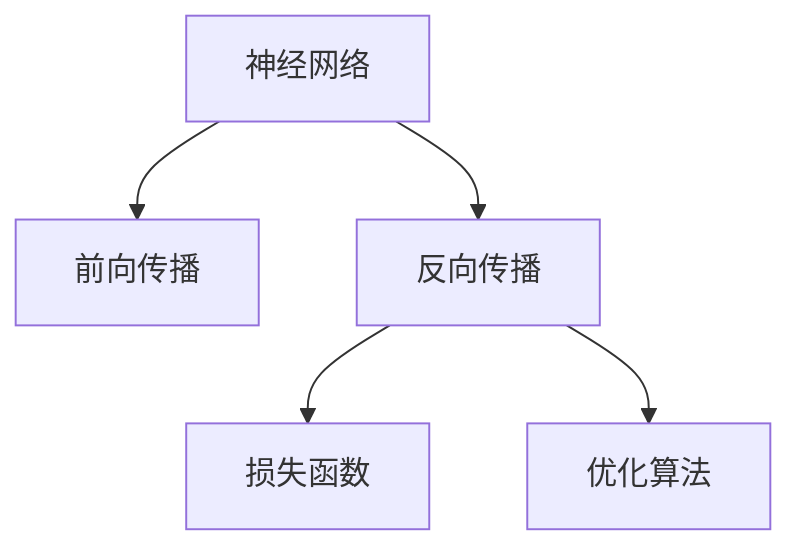

                 

# 神经网络：探索未知的领域

在人工智能领域，神经网络是近年来备受关注的技术之一，它不仅在图像识别、语音处理、自然语言处理等领域展现了强大的应用潜力，还在推动人工智能的进一步发展。本文将深入探讨神经网络的核心概念、算法原理及其实际应用，并展望其未来的发展趋势与面临的挑战。

## 1. 背景介绍

### 1.1 问题由来

神经网络作为一种模拟人脑神经元系统的计算模型，其发展可以追溯到20世纪40年代。然而，直到1980年代，由于计算资源的限制，神经网络的理论和实践进展都相对缓慢。直到深度学习技术兴起，大规模并行计算和深度网络结构的提出，神经网络才开始被大规模地应用于实际问题中，并取得了显著的效果。

### 1.2 问题核心关键点

神经网络的核心关键点包括：

- **神经元与连接**：神经网络的基本组成单位是神经元，它们通过连接形成复杂的计算图。
- **激活函数**：神经元的输出通常通过激活函数进行非线性变换。
- **损失函数**：用于评估模型预测与真实值之间差距的函数，指导模型的优化。
- **反向传播**：一种计算梯度的方法，用于神经网络的参数更新。
- **优化算法**：如梯度下降、Adam等，用于更新神经网络中的参数。

神经网络在计算机视觉、语音识别、自然语言处理等领域已经取得了显著的成果，为人工智能的发展提供了强有力的支持。

## 2. 核心概念与联系

### 2.1 核心概念概述

为了更好地理解神经网络的工作原理和优化方法，本节将介绍几个密切相关的核心概念：

- **神经网络**：由多个层次的神经元相互连接组成的计算模型。
- **深度学习**：一种利用多层神经网络进行数据建模和预测的技术。
- **前向传播**：从输入数据开始，通过网络各层计算，最终输出预测结果的过程。
- **反向传播**：通过反向传播算法，计算损失函数对网络参数的梯度，用于参数更新。
- **损失函数**：如交叉熵、均方误差等，用于衡量模型预测与真实值之间的差异。
- **优化算法**：如梯度下降、Adam等，用于更新神经网络中的参数。

这些核心概念之间的逻辑关系可以通过以下Mermaid流程图来展示：



这个流程图展示了一些核心概念及其之间的关系：

1. 神经网络通过前向传播计算预测结果。
2. 反向传播计算梯度，更新参数。
3. 损失函数评估预测结果与真实值之间的差距。
4. 优化算法指导参数更新。

## 3. 核心算法原理 & 具体操作步骤

### 3.1 算法原理概述

神经网络的训练过程主要包括前向传播和反向传播两个步骤。在前向传播过程中，输入数据通过网络各层进行线性变换和非线性变换，最终输出预测结果。在反向传播过程中，通过计算损失函数对网络参数的梯度，更新参数以最小化损失函数。

### 3.2 算法步骤详解

神经网络的训练通常包括以下几个关键步骤：

**Step 1: 准备数据集**
- 收集训练集、验证集和测试集，并进行预处理，如归一化、标准化、填充等。

**Step 2: 定义模型架构**
- 选择适当的神经网络架构，如卷积神经网络(CNN)、循环神经网络(RNN)、Transformer等。
- 定义网络各层的神经元数量、激活函数、正则化参数等。

**Step 3: 初始化参数**
- 随机初始化网络中的权重和偏置参数。

**Step 4: 前向传播**
- 输入数据通过网络各层进行计算，输出预测结果。

**Step 5: 计算损失**
- 使用损失函数计算模型预测与真实值之间的差距。

**Step 6: 反向传播**
- 计算损失函数对网络参数的梯度。
- 使用优化算法更新网络参数。

**Step 7: 验证集评估**
- 在验证集上评估模型性能，选择性能最佳的模型进行测试。

**Step 8: 测试集评估**
- 在测试集上评估最终模型的性能。

### 3.3 算法优缺点

神经网络在数据建模和预测方面具有以下优点：

- **强大的表示能力**：深度神经网络可以学习到高层次的抽象特征，适合处理复杂数据。
- **自动特征提取**：神经网络能够自动从数据中提取特征，无需人工干预。
- **高效泛化**：通过大量标注数据，神经网络可以高效泛化到未见过的数据。

同时，神经网络也存在一些局限性：

- **模型复杂度高**：神经网络的复杂度随着层数和神经元数量的增加而增加，导致过拟合风险增加。
- **训练成本高**：神经网络的训练过程需要大量的计算资源和时间。
- **可解释性差**：神经网络通常被视为“黑盒”模型，难以解释其内部决策过程。

## 4. 数学模型和公式 & 详细讲解 & 举例说明

### 4.1 数学模型构建

假设有一个包含 $L$ 层的神经网络，输入为 $x$，输出为 $y$。其数学模型可以表示为：

$$
y = f_L(f_{L-1}(...(f_1(x); W_1)...)
$$

其中，$f_l$ 表示第 $l$ 层的激活函数，$W_l$ 表示第 $l$ 层的权重矩阵。

### 4.2 公式推导过程

以三层神经网络为例，其前向传播和反向传播的公式推导如下：

**前向传播**

输入 $x$ 经过第一层线性变换和激活函数，得到第一层输出 $a_1$：

$$
a_1 = f_1(W_1x + b_1)
$$

第一层输出 $a_1$ 再经过第二层线性变换和激活函数，得到第二层输出 $a_2$：

$$
a_2 = f_2(W_2a_1 + b_2)
$$

第二层输出 $a_2$ 再经过第三层线性变换和激活函数，得到最终输出 $y$：

$$
y = f_3(W_3a_2 + b_3)
$$

**反向传播**

假设损失函数为 $L$，则其对第一层权重 $W_1$ 的梯度计算如下：

$$
\frac{\partial L}{\partial W_1} = \frac{\partial L}{\partial a_2} \frac{\partial a_2}{\partial a_1} \frac{\partial a_1}{\partial W_1}
$$

其中，$\frac{\partial L}{\partial a_2}$ 是损失函数对第二层输出 $a_2$ 的梯度，$\frac{\partial a_2}{\partial a_1}$ 是第二层激活函数对第一层输出 $a_1$ 的梯度，$\frac{\partial a_1}{\partial W_1}$ 是第一层线性变换对权重 $W_1$ 的梯度。

通过类似的方式，可以计算出第二层和第三层权重的梯度，用于参数更新。

### 4.3 案例分析与讲解

以图像分类任务为例，假设有一个包含卷积层、池化层、全连接层的神经网络，输入为图像 $x$，输出为类别 $y$。其前向传播和反向传播的公式推导如下：

**前向传播**

输入 $x$ 经过卷积层和池化层，得到卷积特征图 $F_1$：

$$
F_1 = \max(\sigma(W_1x + b_1), 0)
$$

卷积特征图 $F_1$ 再经过全连接层和激活函数，得到最终输出 $y$：

$$
y = f_3(W_3f_2(W_2F_1 + b_2) + b_3)
$$

**反向传播**

假设损失函数为交叉熵损失，则其对卷积层权重 $W_1$ 的梯度计算如下：

$$
\frac{\partial L}{\partial W_1} = \frac{\partial L}{\partial y} \frac{\partial y}{\partial f_3} \frac{\partial f_3}{\partial f_2} \frac{\partial f_2}{\partial W_2} \frac{\partial W_2}{\partial F_1} \frac{\partial F_1}{\partial x}
$$

其中，$\frac{\partial L}{\partial y}$ 是交叉熵损失对输出 $y$ 的梯度，$\frac{\partial y}{\partial f_3}$ 是激活函数对全连接层输出的梯度，$\frac{\partial f_3}{\partial f_2}$ 是全连接层激活函数对卷积特征图的梯度，$\frac{\partial f_2}{\partial W_2}$ 是卷积层对全连接层权重的梯度，$\frac{\partial W_2}{\partial F_1}$ 是池化层对卷积层权重的梯度，$\frac{\partial F_1}{\partial x}$ 是卷积层对输入图像的梯度。

通过类似的方式，可以计算出其他层权重的梯度，用于参数更新。

## 5. 项目实践：代码实例和详细解释说明

### 5.1 开发环境搭建

在进行神经网络项目开发前，我们需要准备好开发环境。以下是使用Python进行TensorFlow开发的环境配置流程：

1. 安装Anaconda：从官网下载并安装Anaconda，用于创建独立的Python环境。

2. 创建并激活虚拟环境：
```bash
conda create -n tf-env python=3.8 
conda activate tf-env
```

3. 安装TensorFlow：根据CUDA版本，从官网获取对应的安装命令。例如：
```bash
conda install tensorflow -c conda-forge
```

4. 安装各类工具包：
```bash
pip install numpy pandas scikit-learn matplotlib tqdm jupyter notebook ipython
```

完成上述步骤后，即可在`tf-env`环境中开始神经网络开发。

### 5.2 源代码详细实现

下面我们以图像分类任务为例，给出使用TensorFlow进行卷积神经网络(CNN)训练的Python代码实现。

首先，定义CNN模型的输入和输出：

```python
import tensorflow as tf

class CNNModel(tf.keras.Model):
    def __init__(self):
        super(CNNModel, self).__init__()
        self.conv1 = tf.keras.layers.Conv2D(32, (3, 3), activation='relu')
        self.pool1 = tf.keras.layers.MaxPooling2D((2, 2))
        self.conv2 = tf.keras.layers.Conv2D(64, (3, 3), activation='relu')
        self.pool2 = tf.keras.layers.MaxPooling2D((2, 2))
        self.flatten = tf.keras.layers.Flatten()
        self.fc1 = tf.keras.layers.Dense(128, activation='relu')
        self.fc2 = tf.keras.layers.Dense(10)

    def call(self, x):
        x = self.conv1(x)
        x = self.pool1(x)
        x = self.conv2(x)
        x = self.pool2(x)
        x = self.flatten(x)
        x = self.fc1(x)
        return self.fc2(x)
```

然后，定义损失函数和优化器：

```python
loss_fn = tf.keras.losses.SparseCategoricalCrossentropy(from_logits=True)
optimizer = tf.keras.optimizers.Adam(learning_rate=0.001)
```

接着，定义训练和评估函数：

```python
def train_epoch(model, dataset, batch_size, optimizer):
    model.train()
    for images, labels in dataset:
        with tf.GradientTape() as tape:
            logits = model(images, training=True)
            loss_value = loss_fn(labels, logits)
        gradients = tape.gradient(loss_value, model.trainable_variables)
        optimizer.apply_gradients(zip(gradients, model.trainable_variables))

def evaluate(model, dataset, batch_size):
    model.eval()
    correct_predictions = 0
    total_predictions = 0
    for images, labels in dataset:
        logits = model(images)
        predicted_labels = tf.argmax(logits, axis=1)
        correct_predictions += tf.reduce_sum(tf.cast(tf.equal(predicted_labels, labels), tf.float32))
        total_predictions += labels.shape[0]
    accuracy = correct_predictions / total_predictions
    return accuracy
```

最后，启动训练流程并在测试集上评估：

```python
epochs = 10
batch_size = 32

for epoch in range(epochs):
    train_epoch(model, train_dataset, batch_size, optimizer)
    accuracy = evaluate(model, test_dataset, batch_size)
    print(f"Epoch {epoch+1}, test accuracy: {accuracy:.3f}")

print("Final test accuracy:", evaluate(model, test_dataset, batch_size))
```

以上就是使用TensorFlow对卷积神经网络进行图像分类任务训练的完整代码实现。可以看到，TensorFlow提供了便捷的API和丰富的组件，使得神经网络的开发变得简单高效。

### 5.3 代码解读与分析

让我们再详细解读一下关键代码的实现细节：

**CNNModel类**：
- `__init__`方法：初始化卷积层、池化层、全连接层等组件。
- `call`方法：定义前向传播计算过程，将输入数据通过卷积层、池化层和全连接层进行计算，并返回最终输出。

**train_epoch和evaluate函数**：
- `train_epoch`方法：在训练集上进行前向传播和反向传播，计算损失并更新模型参数。
- `evaluate`方法：在测试集上进行前向传播，计算预测准确率，并返回结果。

**训练流程**：
- 定义总的epoch数和batch size，开始循环迭代
- 每个epoch内，在训练集上训练，输出准确率
- 在测试集上评估，给出最终准确率

可以看到，TensorFlow框架提供了丰富的组件和便捷的API，使得神经网络的开发变得简单高效。开发者可以将更多精力放在模型改进和数据处理上，而不必过多关注底层的实现细节。

当然，工业级的系统实现还需考虑更多因素，如模型的保存和部署、超参数的自动搜索、更加灵活的任务适配层等。但核心的训练范式基本与此类似。

## 6. 实际应用场景

### 6.1 计算机视觉

神经网络在计算机视觉领域有广泛的应用，如图像分类、目标检测、图像分割等。这些任务通过训练神经网络，可以自动从图像中提取特征并完成分类、检测和分割等操作。

在实际应用中，可以采用卷积神经网络(CNN)对图像数据进行训练，并在图像分类、目标检测等任务上进行微调。例如，可以使用YOLO(You Only Look Once)模型进行实时目标检测，使用U-Net模型进行医学图像分割等。

### 6.2 自然语言处理

神经网络在自然语言处理领域也有广泛的应用，如文本分类、情感分析、机器翻译等。这些任务通过训练神经网络，可以自动从文本中提取特征并完成分类、分析、翻译等操作。

在实际应用中，可以采用循环神经网络(RNN)或Transformer模型对文本数据进行训练，并在文本分类、情感分析等任务上进行微调。例如，可以使用BERT模型进行情感分析，使用机器翻译模型进行文本翻译等。

### 6.3 语音处理

神经网络在语音处理领域的应用包括语音识别、语音合成等。这些任务通过训练神经网络，可以自动从语音信号中提取特征并完成识别和合成等操作。

在实际应用中，可以采用循环神经网络(RNN)或卷积神经网络(CNN)对语音数据进行训练，并在语音识别、语音合成等任务上进行微调。例如，可以使用卷积神经网络进行语音识别，使用GAN模型进行语音合成等。

### 6.4 未来应用展望

随着神经网络技术的不断进步，未来的应用场景将更加广阔，涵盖更多领域和更多任务。以下是一些未来可能的突破：

- **多模态学习**：神经网络可以处理文本、图像、语音等多种模态数据，未来的研究将进一步探索多模态数据的融合和协同建模，提升模型的泛化能力和适应性。
- **自监督学习**：神经网络可以通过自监督学习任务进行预训练，进一步提升模型的泛化能力和可解释性。
- **联邦学习**：神经网络可以通过联邦学习的方式，在多个设备上进行分布式训练，保护数据隐私和提升模型性能。
- **对抗攻击与鲁棒性**：未来的研究将进一步探索神经网络的对抗攻击和鲁棒性，确保模型在面对恶意攻击时仍能保持高水平性能。
- **量子计算与神经网络**：量子计算技术的发展，将为神经网络的计算提供新的方向和手段，进一步提升模型的计算效率和性能。

这些方向的发展，将为神经网络技术带来新的突破和应用，推动人工智能技术的进一步发展。

## 7. 工具和资源推荐

### 7.1 学习资源推荐

为了帮助开发者系统掌握神经网络的核心概念和实践技巧，这里推荐一些优质的学习资源：

1. 《深度学习》系列书籍：由Ian Goodfellow等人撰写，深入浅出地介绍了深度学习的基本概念和算法。
2. CS231n《卷积神经网络》课程：斯坦福大学开设的计算机视觉课程，讲解了卷积神经网络的原理和实践。
3. CS224n《序列建模》课程：斯坦福大学开设的自然语言处理课程，讲解了循环神经网络和Transformer模型。
4. TensorFlow官方文档：提供了丰富的教程和样例代码，帮助开发者快速上手神经网络开发。
5. PyTorch官方文档：提供了丰富的教程和样例代码，帮助开发者快速上手神经网络开发。

通过对这些资源的学习实践，相信你一定能够快速掌握神经网络的核心概念和实践技巧，并用于解决实际的NLP问题。

### 7.2 开发工具推荐

高效的开发离不开优秀的工具支持。以下是几款用于神经网络开发和部署的常用工具：

1. TensorFlow：由Google主导开发的开源深度学习框架，生产部署方便，适合大规模工程应用。
2. PyTorch：由Facebook主导开发的开源深度学习框架，灵活高效，适合快速迭代研究。
3. Keras：基于TensorFlow和Theano的高级神经网络API，提供了便捷的API和丰富的组件，适合快速开发和原型设计。
4. Weights & Biases：模型训练的实验跟踪工具，可以记录和可视化模型训练过程中的各项指标，方便对比和调优。
5. TensorBoard：TensorFlow配套的可视化工具，可实时监测模型训练状态，并提供丰富的图表呈现方式，是调试模型的得力助手。

合理利用这些工具，可以显著提升神经网络开发的效率，加快创新迭代的步伐。

### 7.3 相关论文推荐

神经网络技术的发展源于学界的持续研究。以下是几篇奠基性的相关论文，推荐阅读：

1. Deep Blue Book：Ian Goodfellow等人撰写的《深度学习》一书，全面介绍了深度学习的理论和实践。
2. AlexNet论文：Hinton等人提出的AlexNet模型，是深度学习领域的里程碑论文。
3. VGGNet论文：Simonyan等人提出的VGGNet模型，进一步提升了深度神经网络的性能。
4. ResNet论文：He等人提出的ResNet模型，解决了深度神经网络中的梯度消失问题。
5. Transformer论文：Vaswani等人提出的Transformer模型，为神经网络处理序列数据提供了新的方向。

这些论文代表了大神经网络的发展脉络。通过学习这些前沿成果，可以帮助研究者把握学科前进方向，激发更多的创新灵感。

## 8. 总结：未来发展趋势与挑战

### 8.1 总结

本文对神经网络的核心概念、算法原理及其实际应用进行了全面系统的介绍。首先阐述了神经网络的发展背景和意义，明确了神经网络在数据建模和预测方面的独特价值。其次，从原理到实践，详细讲解了神经网络的数学模型和关键步骤，给出了神经网络开发和训练的完整代码实例。同时，本文还广泛探讨了神经网络在计算机视觉、自然语言处理、语音处理等多个领域的应用前景，展示了神经网络技术的广泛应用。

通过本文的系统梳理，可以看到，神经网络在人工智能领域具有广阔的前景，已经广泛应用于多个领域并取得了显著的成果。未来，伴随神经网络技术的进一步发展，其应用范围和性能都将不断拓展，为人工智能技术的进步和应用提供新的动力。

### 8.2 未来发展趋势

展望未来，神经网络技术将呈现以下几个发展趋势：

1. **深度和宽度不断增加**：神经网络的深度和宽度将不断增加，以应对更复杂和更大规模的数据。
2. **模型结构多样化**：未来将出现更多的神经网络结构，如残差网络、注意力机制、自注意力机制等。
3. **多模态融合**：神经网络可以处理多种模态数据，未来的研究将进一步探索多模态数据的融合和协同建模，提升模型的泛化能力和适应性。
4. **自监督学习**：神经网络可以通过自监督学习任务进行预训练，进一步提升模型的泛化能力和可解释性。
5. **联邦学习**：神经网络可以通过联邦学习的方式，在多个设备上进行分布式训练，保护数据隐私和提升模型性能。
6. **对抗攻击与鲁棒性**：未来的研究将进一步探索神经网络的对抗攻击和鲁棒性，确保模型在面对恶意攻击时仍能保持高水平性能。
7. **量子计算与神经网络**：量子计算技术的发展，将为神经网络的计算提供新的方向和手段，进一步提升模型的计算效率和性能。

这些趋势凸显了神经网络技术的广阔前景。这些方向的探索发展，必将进一步提升神经网络系统的性能和应用范围，为人工智能技术的进步和应用提供新的动力。

### 8.3 面临的挑战

尽管神经网络技术已经取得了显著的成果，但在迈向更加智能化、普适化应用的过程中，仍面临诸多挑战：

1. **计算资源需求高**：神经网络的计算需求高，对计算资源和存储空间的要求较高。
2. **过拟合风险高**：神经网络的过拟合风险较高，特别是在数据量较小的情况下。
3. **可解释性差**：神经网络通常被视为“黑盒”模型，难以解释其内部决策过程。
4. **对抗攻击敏感**：神经网络在面对对抗攻击时，容易产生误判和输出错误。
5. **数据隐私保护**：在分布式训练中，如何保护数据隐私是一个重要的挑战。

这些挑战需要在未来的研究中逐步解决，以便更好地应用神经网络技术。

### 8.4 研究展望

面对神经网络面临的诸多挑战，未来的研究需要在以下几个方面寻求新的突破：

1. **模型压缩与优化**：开发更加高效和轻量级的神经网络模型，减少计算资源的需求。
2. **正则化与泛化能力提升**：通过正则化等方法，提升神经网络的泛化能力和鲁棒性。
3. **可解释性与透明性**：探索神经网络的可解释性和透明性，确保模型的决策过程可以被理解和解释。
4. **对抗攻击与鲁棒性**：进一步探索神经网络的对抗攻击和鲁棒性，确保模型在面对恶意攻击时仍能保持高水平性能。
5. **数据隐私保护**：开发更加安全的分布式训练方法，保护数据隐私和模型安全。

这些方向的探索，必将引领神经网络技术的进一步发展，为人工智能技术的进步和应用提供新的动力。

## 9. 附录：常见问题与解答

**Q1：神经网络是否适用于所有数据类型？**

A: 神经网络主要适用于结构化数据和数值型数据，如图像、语音、文本等。但对于非结构化数据，如文本、图像、视频等，需要对其进行处理和编码，才能用于神经网络的输入。

**Q2：神经网络中的权重初始化方法有哪些？**

A: 神经网络中的权重初始化方法包括随机初始化、正态分布初始化、Xavier初始化、He初始化等。不同的初始化方法会影响神经网络的收敛速度和性能。

**Q3：神经网络中常用的激活函数有哪些？**

A: 神经网络中常用的激活函数包括Sigmoid、ReLU、Tanh、LeakyReLU等。不同的激活函数适用于不同的神经网络结构和任务。

**Q4：神经网络中常用的优化算法有哪些？**

A: 神经网络中常用的优化算法包括梯度下降、Adam、Adagrad、Adadelta等。不同的优化算法适用于不同的神经网络结构和训练任务。

**Q5：神经网络中的过拟合有哪些缓解方法？**

A: 神经网络中的过拟合缓解方法包括正则化、Dropout、Early Stopping、数据增强等。这些方法可以有效地缓解过拟合问题，提高神经网络的泛化能力。

这些问答将帮助读者更好地理解神经网络的核心概念和应用实践，为进一步探索神经网络技术奠定基础。

