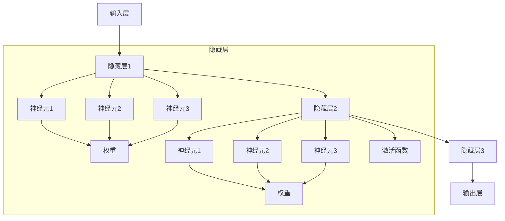

                 

## 1. 背景介绍

在当今数字化时代，神经网络已经成为推动社会进步的重要力量。从无人驾驶到医疗诊断，从语音识别到图像处理，神经网络技术的应用无处不在，深刻影响着各行各业的发展。本文将深入探讨神经网络的核心概念、算法原理、实际应用以及未来发展趋势，为读者提供一个全面的视角，理解神经网络如何改变世界。

## 2. 核心概念与联系

### 2.1 核心概念概述

神经网络是一种模拟人类神经系统的计算模型，由大量相互连接的神经元组成，通过训练学习数据的特征表示，进而实现分类、回归、聚类等任务。其核心组件包括：

- **输入层**：接收原始数据，并将其转化为神经网络可以处理的形式。
- **隐藏层**：对输入数据进行特征提取和表示，是神经网络的核心计算单元。
- **输出层**：将隐藏层的特征表示转化为任务相关的输出结果。

### 2.2 核心概念原理和架构的 Mermaid 流程图



## 3. 核心算法原理 & 具体操作步骤

### 3.1 算法原理概述

神经网络的训练过程可以分为两个阶段：前向传播和反向传播。在前向传播中，输入数据经过多层神经元的处理，最终输出预测结果；在反向传播中，通过计算预测结果与真实标签的误差，调整神经元之间的连接权重，以最小化误差。

### 3.2 算法步骤详解

1. **数据预处理**：将原始数据转化为适合神经网络处理的格式，如归一化、标准化、标签化等。
2. **模型定义**：选择合适的神经网络架构，定义输入层、隐藏层和输出层的神经元数量、激活函数等。
3. **损失函数选择**：根据任务类型选择合适的损失函数，如交叉熵、均方误差等。
4. **模型训练**：通过前向传播计算预测结果，并计算损失函数值；通过反向传播调整权重，更新模型参数。
5. **模型评估**：在测试集上评估模型性能，如准确率、召回率、F1值等。

### 3.3 算法优缺点

**优点**：

- **强大的表征能力**：神经网络能够自动学习数据的高阶特征表示，适应各种复杂任务。
- **并行计算**：神经网络可以利用GPU、TPU等并行计算设备，加速训练过程。
- **广泛应用**：神经网络技术在图像识别、自然语言处理、推荐系统等领域都有广泛应用。

**缺点**：

- **计算资源需求高**：训练大型神经网络需要大量的计算资源和存储空间。
- **模型复杂度高**：神经网络结构复杂，难以理解和调试。
- **过拟合风险**：在训练数据不足或模型复杂度过高的情况下，容易发生过拟合。

### 3.4 算法应用领域

神经网络技术已经广泛应用于多个领域，包括但不限于：

- **计算机视觉**：图像识别、目标检测、图像生成等。
- **自然语言处理**：语言模型、机器翻译、情感分析等。
- **语音识别**：语音转文本、语音合成、情感识别等。
- **推荐系统**：个性化推荐、广告推荐、广告点击率预测等。
- **医疗**：疾病诊断、治疗方案推荐、基因分析等。

## 4. 数学模型和公式 & 详细讲解 & 举例说明

### 4.1 数学模型构建

神经网络可以看作是一系列非线性函数的组合。以一个简单的三层神经网络为例，其数学模型可以表示为：

$$ y = f_w(f_{w_1}(x)) $$

其中 $x$ 是输入数据，$w_1, w$ 是权重参数，$f_w$ 和 $f_{w_1}$ 分别是输出层和隐藏层的激活函数。

### 4.2 公式推导过程

以一个简单的三层前馈神经网络为例，其前向传播过程可以表示为：

$$ h_1 = f_w_1(x) $$
$$ h_2 = f_w_2(h_1) $$
$$ y = f_w_3(h_2) $$

其中 $f_w$ 是激活函数，如ReLU、sigmoid等。反向传播过程中，通过链式法则计算梯度：

$$ \frac{\partial L}{\partial w_3} = \frac{\partial L}{\partial y} \frac{\partial y}{\partial h_2} \frac{\partial h_2}{\partial w_2} $$
$$ \frac{\partial L}{\partial w_2} = \frac{\partial L}{\partial y} \frac{\partial y}{\partial h_2} \frac{\partial h_2}{\partial h_1} \frac{\partial h_1}{\partial w_1} $$

其中 $L$ 是损失函数，$\frac{\partial L}{\partial y}$ 是输出层的梯度，$\frac{\partial y}{\partial h_2}$ 是激活函数的梯度，$\frac{\partial h_2}{\partial w_2}$ 和 $\frac{\partial h_1}{\partial w_1}$ 是权重参数的梯度。

### 4.3 案例分析与讲解

以手写数字识别为例，神经网络可以自动学习将手写数字转换为数字标签的特征表示。通过多层神经元的非线性变换，网络能够捕捉数字的复杂结构，最终输出数字的预测值。

## 5. 项目实践：代码实例和详细解释说明

### 5.1 开发环境搭建

使用Python和TensorFlow进行神经网络开发，需要安装以下环境：

```bash
pip install tensorflow
pip install matplotlib
pip install numpy
pip install pandas
```

### 5.2 源代码详细实现

```python
import tensorflow as tf
import numpy as np
import matplotlib.pyplot as plt

# 加载MNIST数据集
(x_train, y_train), (x_test, y_test) = tf.keras.datasets.mnist.load_data()

# 数据预处理
x_train = x_train.reshape(-1, 28*28) / 255.0
x_test = x_test.reshape(-1, 28*28) / 255.0

# 定义模型
model = tf.keras.Sequential([
    tf.keras.layers.Dense(128, activation='relu'),
    tf.keras.layers.Dense(10, activation='softmax')
])

# 编译模型
model.compile(optimizer='adam', loss='sparse_categorical_crossentropy', metrics=['accuracy'])

# 训练模型
history = model.fit(x_train, y_train, epochs=10, validation_data=(x_test, y_test))

# 评估模型
test_loss, test_acc = model.evaluate(x_test, y_test)
print('Test accuracy:', test_acc)
```

### 5.3 代码解读与分析

- **数据预处理**：将原始图像数据展平并归一化到0-1之间。
- **模型定义**：定义一个简单的两层神经网络，第一层为128个神经元，使用ReLU激活函数；第二层为10个神经元，使用softmax激活函数，用于输出数字标签。
- **模型编译**：选择合适的优化器、损失函数和评估指标，编译模型。
- **模型训练**：使用训练集进行模型训练，并在验证集上评估模型性能。
- **模型评估**：在测试集上评估模型性能，输出测试集的准确率。

### 5.4 运行结果展示

训练完成后，可以使用Matplotlib绘制训练过程中的损失和准确率曲线，如下所示：

```python
plt.plot(history.history['loss'], label='Train Loss')
plt.plot(history.history['val_loss'], label='Validation Loss')
plt.plot(history.history['accuracy'], label='Train Accuracy')
plt.plot(history.history['val_accuracy'], label='Validation Accuracy')
plt.legend()
plt.show()
```

## 6. 实际应用场景

### 6.1 智能交通系统

神经网络可以应用于智能交通系统，实现自动驾驶、交通流量预测等功能。通过分析历史交通数据和实时传感器数据，神经网络可以学习交通流动的复杂模式，预测未来交通状况，辅助驾驶员和交通管理部门做出决策。

### 6.2 医疗影像分析

在医疗影像分析领域，神经网络可以自动检测和分类肿瘤、病变等异常情况。通过训练大量医学影像数据，神经网络可以学习到不同疾病和病变特征，辅助医生进行诊断和治疗方案选择。

### 6.3 金融风险预测

神经网络可以应用于金融风险预测，识别和评估金融市场的波动和风险。通过分析历史金融数据和实时市场数据，神经网络可以预测市场趋势和风险事件，辅助金融机构制定投资策略和风险管理措施。

### 6.4 未来应用展望

未来，神经网络技术将进一步扩展到更多领域，如物联网、生物识别、智慧城市等。通过与物联网设备、传感器等硬件的结合，神经网络可以实现更高效的感知和决策，提升人类生活的智能化水平。

## 7. 工具和资源推荐

### 7.1 学习资源推荐

- **《深度学习》**（Goodfellow 等）：全面介绍深度学习的原理和算法，是深度学习领域的经典教材。
- **Coursera深度学习课程**：由斯坦福大学的Andrew Ng教授开设，涵盖深度学习的基本概念和应用。
- **Kaggle竞赛**：参与数据科学和机器学习竞赛，积累实战经验。

### 7.2 开发工具推荐

- **TensorFlow**：由Google开发的深度学习框架，支持GPU加速，适合大规模工程应用。
- **PyTorch**：由Facebook开发的深度学习框架，支持动态计算图，适合研究和实验。
- **Jupyter Notebook**：轻量级的交互式编程环境，适合数据处理和模型开发。

### 7.3 相关论文推荐

- **AlexNet**：ImageNet分类挑战赛的冠军模型，开创了深度学习在计算机视觉领域的应用。
- **LSTM**：长短期记忆网络，应用于自然语言处理任务，如机器翻译、情感分析等。
- **GANs**：生成对抗网络，应用于图像生成、视频编辑等领域。

## 8. 总结：未来发展趋势与挑战

### 8.1 研究成果总结

神经网络技术已经在各个领域取得了显著的进展，展示了强大的表征和计算能力。然而，神经网络模型的复杂性、计算资源的消耗和模型解释性等问题仍然存在，需要进一步研究和解决。

### 8.2 未来发展趋势

未来，神经网络技术将朝着以下方向发展：

- **更高效的模型架构**：研究更轻量级、高效的模型架构，降低计算资源消耗。
- **更强的模型解释性**：开发能够解释模型决策过程的技术，提升模型的可信度。
- **更广泛的应用领域**：神经网络技术将进一步扩展到更多领域，如生物信息学、材料科学等。
- **更智能的决策支持**：结合知识图谱、逻辑规则等先验知识，提升模型的智能决策能力。

### 8.3 面临的挑战

神经网络技术面临的挑战包括：

- **计算资源瓶颈**：训练大型神经网络需要大量的计算资源和存储空间。
- **模型解释性不足**：神经网络模型的决策过程难以理解和解释，存在一定的“黑盒”问题。
- **数据隐私和安全**：神经网络技术的应用涉及大量敏感数据，需要关注数据隐私和安全问题。
- **伦理和法律问题**：神经网络技术的应用可能带来伦理和法律风险，需要制定相应的规范和标准。

### 8.4 研究展望

未来的研究可以从以下几个方面着手：

- **更高效的模型训练**：研究更高效的模型训练算法和优化方法，提高训练效率。
- **更智能的模型决策**：结合因果推理、逻辑规则等先验知识，提升模型的智能决策能力。
- **更智能的模型解释**：开发能够解释模型决策过程的技术，提升模型的可信度。
- **更广泛的应用场景**：神经网络技术将进一步扩展到更多领域，如生物信息学、材料科学等。

## 9. 附录：常见问题与解答

**Q1: 神经网络是如何学习数据的特征表示的？**

A: 神经网络通过训练学习数据的特征表示。在前向传播中，输入数据经过多层神经元的非线性变换，逐步抽象出高阶特征表示。在反向传播中，通过计算预测结果与真实标签的误差，调整神经元之间的连接权重，以最小化误差，从而学习数据的特征表示。

**Q2: 神经网络有哪些常用的激活函数？**

A: 神经网络常用的激活函数包括：

- **Sigmoid**：将输出限制在0-1之间，适合二分类任务。
- **ReLU**：将输出限制在0以上，适合线性激活和网络结构优化。
- **Tanh**：将输出限制在-1到1之间，适合某些特定任务。
- **Leaky ReLU**：是ReLU的变种，解决ReLU在负值域为0的问题。

**Q3: 如何避免神经网络的过拟合问题？**

A: 避免神经网络过拟合的方法包括：

- **数据增强**：通过旋转、裁剪、翻转等方式扩充训练集。
- **正则化**：使用L2正则、Dropout等方法，防止过拟合。
- **早停法**：在验证集上监测模型性能，一旦性能不再提升，立即停止训练。
- **批标准化**：对网络中的每一层进行标准化，提高模型稳定性。

**Q4: 如何评估神经网络的性能？**

A: 神经网络的性能评估通常使用以下指标：

- **准确率**：分类任务中最常用的指标，表示正确分类的样本数占总样本数的比例。
- **召回率**：表示正确分类的正样本数占所有正样本数的比例，常用于不平衡数据的评估。
- **F1值**：综合考虑准确率和召回率的指标，是二分类任务常用的评估指标。
- **ROC曲线和AUC**：用于评估二分类任务的模型性能，曲线越接近左上角，模型性能越好。

**Q5: 神经网络在医疗领域有哪些应用？**

A: 神经网络在医疗领域有以下应用：

- **疾病诊断**：通过训练大量医学影像数据，神经网络可以自动检测和分类肿瘤、病变等异常情况。
- **治疗方案推荐**：结合患者的病历和基因数据，神经网络可以推荐最合适的治疗方案。
- **医疗影像分析**：通过分析医疗影像数据，神经网络可以辅助医生进行疾病诊断和治疗。

---

作者：禅与计算机程序设计艺术 / Zen and the Art of Computer Programming

