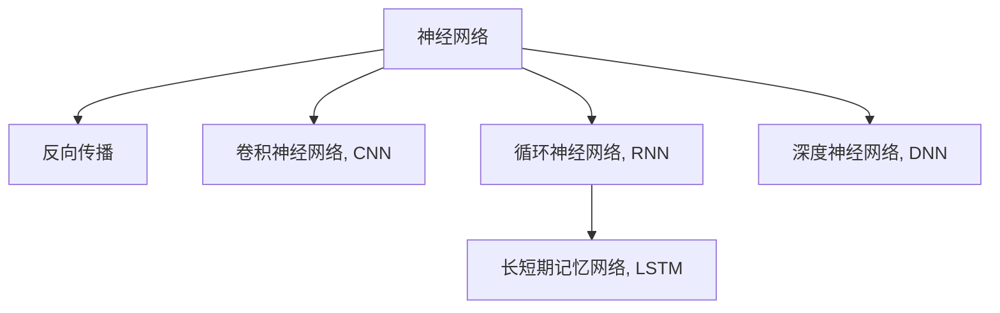

                 

# 神经网络：机器学习的新范式

> 关键词：神经网络,机器学习,深度学习,人工智能,模式识别,深度神经网络

## 1. 背景介绍

### 1.1 问题由来
机器学习（Machine Learning, ML）领域自1950年代诞生以来，经历了多次革命性的技术突破。从早期的感知机、决策树、支持向量机，到后来的集成学习、随机森林，再到深度学习（Deep Learning, DL）的崛起，机器学习技术正不断地演进，赋予计算机以更强的学习能力和泛化能力。其中，深度学习以多层的神经网络（Neural Networks, NN）为代表，极大地拓展了机器学习的应用场景和深度，使得其能够处理复杂的非线性数据关系，从而在计算机视觉、自然语言处理、语音识别、推荐系统等众多领域取得了显著成效。

然而，传统的深度学习模型主要聚焦于特征提取和参数优化，模型的结构和参数由人工设计。这限制了模型对数据的灵活适应性，也无法兼顾模型的泛化能力和计算效率。神经网络作为机器学习的新范式，其内部结构与功能更加紧密耦合，能够自适应地学习复杂的数据结构，从而展现出了强大的学习能力和广泛的应用前景。

### 1.2 问题核心关键点
神经网络作为一种强大的机器学习模型，其核心思想是通过模拟人脑神经元之间的连接关系，构建起多层次的抽象结构，从而逐步学习出数据中高层次的特征和规律。神经网络模型通常由输入层、若干个隐藏层和输出层构成，通过反向传播算法（Backpropagation）进行参数优化。

神经网络的主要优点包括：

- **自适应性**：神经网络能够自动提取数据的高层特征，适应性强，适用于多种类型的机器学习任务。
- **非线性表达能力**：通过堆叠多层神经元，神经网络能够建模复杂非线性关系，处理大规模数据集。
- **端到端学习**：神经网络可以通过端到端的方式直接从原始数据中学习目标函数，减少特征工程的负担。
- **并行计算优势**：深度神经网络中的参数量大，可以利用并行计算架构提高模型训练效率。

然而，神经网络也存在一些局限性，如：

- **参数调优复杂**：神经网络模型拥有大量参数，调优难度大，容易过拟合。
- **计算资源需求高**：深层神经网络需要大量的计算资源，对于大规模数据集和高维度数据处理能力要求较高。
- **模型解释性差**：深度神经网络作为一个黑盒模型，难以解释其内部决策过程，缺乏透明性。

## 2. 核心概念与联系

### 2.1 核心概念概述

为更好地理解神经网络的学习和应用机制，本节将介绍几个密切相关的核心概念：

- **神经网络（Neural Network, NN）**：由大量神经元构成的复杂网络结构，通常用于模拟人脑的工作方式。神经网络包括输入层、隐藏层和输出层，通过多层级联实现数据的高层特征提取和处理。

- **反向传播算法（Backpropagation, BP）**：一种用于神经网络参数优化的算法，通过链式法则计算网络中每一层参数对输出误差的影响，并反向传播误差信号，更新模型参数。

- **卷积神经网络（Convolutional Neural Network, CNN）**：专门用于处理图像、语音等数据类型的神经网络，其卷积操作能够有效捕捉局部特征，适用于图像分类、物体识别等计算机视觉任务。

- **循环神经网络（Recurrent Neural Network, RNN）**：用于处理序列数据的神经网络，其内部结构具有循环反馈机制，能够捕捉时间序列数据的时序依赖关系，适用于自然语言处理、语音识别等任务。

- **长短期记忆网络（Long Short-Term Memory, LSTM）**：一种改进的RNN结构，能够更有效地处理长序列数据，适用于自然语言处理中的文本生成、机器翻译等任务。

- **深度神经网络（Deep Neural Network, DNN）**：通常指包含多个隐藏层的神经网络，通过多层次的特征提取和学习，能够处理更加复杂的非线性关系，适用于语音识别、图像处理、自然语言处理等高级任务。

这些核心概念之间的逻辑关系可以通过以下Mermaid流程图来展示：



这个流程图展示出神经网络及其主要变体的内部结构和学习机制：

1. 神经网络是一个多层次的非线性映射，能够实现数据的抽象表示和复杂关系建模。
2. 反向传播是神经网络参数优化的核心算法，通过误差反向传播更新模型权重。
3. CNN专门用于图像、语音等数据处理，利用卷积操作提取局部特征。
4. RNN用于序列数据处理，通过循环结构捕捉时序依赖关系。
5. LSTM是RNN的改进结构，能够处理长序列数据，避免梯度消失和梯度爆炸问题。
6. DNN是包含多个隐藏层的神经网络，实现多层次的特征提取和表示学习。

这些概念共同构成了深度学习模型的核心框架，使其能够在各种复杂数据处理任务中发挥出色性能。

## 3. 核心算法原理 & 具体操作步骤
### 3.1 算法原理概述

神经网络的核心思想是通过模拟人脑神经元之间的连接关系，构建起多层次的抽象结构，从而逐步学习出数据中高层次的特征和规律。神经网络模型通常由输入层、若干个隐藏层和输出层构成，通过反向传播算法进行参数优化。

神经网络的学习过程大致可以分为两个阶段：前向传播（Forward Propagation）和反向传播（Backpropagation）。

- **前向传播**：将输入数据通过神经网络的前向传递，得到最终的输出结果。具体来说，输入数据首先经过输入层，然后逐层通过隐藏层进行特征提取，最终输出预测结果。

- **反向传播**：通过前向传播得到的预测结果与真实标签进行对比，计算误差，然后利用反向传播算法更新模型参数，以最小化预测误差。反向传播算法通过链式法则计算网络中每一层参数对输出误差的影响，并反向传播误差信号，更新模型参数。

### 3.2 算法步骤详解

神经网络的训练过程大致包括以下几个关键步骤：

**Step 1: 准备数据集**
- 收集训练数据集，并将其划分为训练集、验证集和测试集。训练集用于模型训练，验证集用于参数调优和模型选择，测试集用于模型性能评估。

**Step 2: 初始化模型参数**
- 初始化神经网络模型的所有权重和偏置，通常使用随机初始化或预训练权重。

**Step 3: 定义损失函数**
- 根据具体的任务类型，选择合适的损失函数。例如，分类任务通常使用交叉熵损失函数，回归任务使用均方误差损失函数。

**Step 4: 前向传播和反向传播**
- 使用前向传播算法计算模型的预测结果。
- 使用反向传播算法计算模型参数的梯度，并根据梯度更新模型参数。

**Step 5: 参数更新**
- 使用优化算法（如SGD、Adam等）更新模型参数，以最小化损失函数。

**Step 6: 验证和测试**
- 在验证集上评估模型性能，选择最优模型。
- 在测试集上测试模型性能，评估模型泛化能力。

以上步骤是神经网络训练的常见流程，实际应用中还需要根据具体任务和数据特点进行优化。例如，针对不同任务可以设计不同的模型结构，采用不同的优化算法和超参数调优策略。

### 3.3 算法优缺点

神经网络作为机器学习的新范式，具有以下优点：

- **强大的非线性建模能力**：神经网络可以通过多层级联，学习复杂非线性关系，适用于多种复杂数据处理任务。
- **端到端学习**：神经网络能够直接从原始数据中学习目标函数，减少特征工程的负担，实现更高效的数据建模。
- **自适应性**：神经网络能够自适应地学习数据特征，具有较强的泛化能力。

然而，神经网络也存在一些局限性：

- **计算资源需求高**：深层神经网络需要大量的计算资源，对于大规模数据集和高维度数据处理能力要求较高。
- **过拟合风险高**：神经网络参数量庞大，容易过拟合，需要进行适当的正则化和参数控制。
- **模型解释性差**：神经网络作为一个黑盒模型，难以解释其内部决策过程，缺乏透明性。

## 4. 数学模型和公式 & 详细讲解 & 举例说明

### 4.1 数学模型构建

神经网络通常可以表示为一种多层前馈网络（Feedforward Neural Network, FNN），其数学模型可以表示为：

$$
y = f(\sum_{i=1}^{n} w_i x_i + b)
$$

其中，$x_1,...,x_n$ 为输入数据，$w_1,...,w_n$ 为权重，$b$ 为偏置，$f$ 为激活函数。

神经网络的激活函数通常采用非线性函数，如Sigmoid、ReLU、Tanh等，通过引入非线性项，使得神经网络能够学习非线性关系。

### 4.2 公式推导过程

下面以Sigmoid激活函数为例，推导神经网络的输出结果计算公式。

考虑一个简单的两层神经网络，其中输入层有一个神经元，输出层有一个神经元。其数学模型可以表示为：

$$
y = \sigma(\mathbf{w}^T \mathbf{x} + b)
$$

其中，$\mathbf{w}=\begin{bmatrix} w_1 \\ w_2 \end{bmatrix}$，$\mathbf{x}=\begin{bmatrix} x_1 \\ x_2 \end{bmatrix}$，$b$ 为偏置项，$\sigma$ 为Sigmoid函数。

其反向传播算法的步骤如下：

1. **前向传播**：
   $$
   z = \mathbf{w}^T \mathbf{x} + b
   $$
   $$
   \hat{y} = \sigma(z)
   $$

2. **计算误差**：
   $$
   \delta = \frac{\partial L}{\partial \hat{y}}
   $$

3. **反向传播**：
   $$
   \frac{\partial L}{\partial w_1} = \frac{\partial L}{\partial \hat{y}} \frac{\partial \hat{y}}{\partial z} \frac{\partial z}{\partial w_1}
   $$
   $$
   \frac{\partial L}{\partial w_2} = \frac{\partial L}{\partial \hat{y}} \frac{\partial \hat{y}}{\partial z} \frac{\partial z}{\partial w_2}
   $$

其中，$L$ 为损失函数，$\frac{\partial L}{\partial \hat{y}}$ 为误差梯度，$\frac{\partial \hat{y}}{\partial z}$ 为激活函数的导数，$\frac{\partial z}{\partial w_1}$ 和 $\frac{\partial z}{\partial w_2}$ 分别为输入层和隐藏层的梯度。

### 4.3 案例分析与讲解

考虑一个用于图像分类的神经网络模型。假设输入图像经过卷积层和池化层后，得到一个高维特征向量 $\mathbf{x}$，通过全连接层得到输出结果 $y$。其数学模型可以表示为：

$$
y = \sigma(\mathbf{W}^T \mathbf{x} + b)
$$

其中，$\mathbf{W}$ 为全连接层权重，$b$ 为偏置项，$\sigma$ 为激活函数。

假设我们的损失函数为交叉熵损失函数：

$$
L = -\frac{1}{N} \sum_{i=1}^N y_i \log \hat{y}_i + (1-y_i) \log (1-\hat{y}_i)
$$

其中，$y_i$ 为真实标签，$\hat{y}_i$ 为模型预测结果。

通过反向传播算法，我们可以计算出全连接层的梯度：

$$
\frac{\partial L}{\partial W_{ij}} = \frac{\partial L}{\partial \hat{y}_i} \frac{\partial \hat{y}_i}{\partial z_i} \frac{\partial z_i}{\partial W_{ij}}
$$

其中，$\frac{\partial L}{\partial \hat{y}_i}$ 为误差梯度，$\frac{\partial \hat{y}_i}{\partial z_i}$ 为激活函数的导数，$\frac{\partial z_i}{\partial W_{ij}}$ 为权重梯度。

通过优化算法更新权重和偏置项，使得损失函数最小化，从而实现对输入数据的准确分类。

## 5. 项目实践：代码实例和详细解释说明
### 5.1 开发环境搭建

在进行神经网络项目开发前，我们需要准备好开发环境。以下是使用Python进行TensorFlow开发的环境配置流程：

1. 安装Anaconda：从官网下载并安装Anaconda，用于创建独立的Python环境。

2. 创建并激活虚拟环境：
```bash
conda create -n tensorflow-env python=3.8 
conda activate tensorflow-env
```

3. 安装TensorFlow：根据CUDA版本，从官网获取对应的安装命令。例如：
```bash
pip install tensorflow-gpu==2.5
```

4. 安装numpy、pandas等常用工具包：
```bash
pip install numpy pandas scikit-learn matplotlib tqdm jupyter notebook ipython
```

完成上述步骤后，即可在`tensorflow-env`环境中开始神经网络项目开发。

### 5.2 源代码详细实现

下面我们以一个简单的图像分类任务为例，给出使用TensorFlow进行神经网络开发的PyTorch代码实现。

首先，导入所需的TensorFlow库：

```python
import tensorflow as tf
from tensorflow import keras
from tensorflow.keras import layers
```

然后，定义神经网络模型：

```python
model = keras.Sequential([
    layers.Conv2D(32, (3, 3), activation='relu', input_shape=(28, 28, 1)),
    layers.MaxPooling2D((2, 2)),
    layers.Flatten(),
    layers.Dense(10, activation='softmax')
])
```

接着，编译模型并指定损失函数、优化器和评估指标：

```python
model.compile(optimizer='adam',
              loss='sparse_categorical_crossentropy',
              metrics=['accuracy'])
```

然后，加载MNIST数据集：

```python
mnist = keras.datasets.mnist
(x_train, y_train), (x_test, y_test) = mnist.load_data()
x_train, x_test = x_train / 255.0, x_test / 255.0
```

最后，训练模型：

```python
model.fit(x_train.reshape(-1, 28, 28, 1), y_train, epochs=5, validation_data=(x_test.reshape(-1, 28, 28, 1), y_test))
```

以上就是使用TensorFlow进行神经网络模型训练的完整代码实现。可以看到，TensorFlow的高级API使神经网络模型的构建和训练过程变得简洁高效。

### 5.3 代码解读与分析

让我们再详细解读一下关键代码的实现细节：

**Sequential模型**：
- 使用`keras.Sequential`创建序列化的神经网络模型。模型由多个层次级联构成，从输入层到输出层依次添加。

**卷积层（Conv2D）**：
- 使用`keras.layers.Conv2D`添加卷积层，卷积核大小为(3, 3)，输出通道数为32，激活函数为ReLU。

**池化层（MaxPooling2D）**：
- 使用`keras.layers.MaxPooling2D`添加池化层，池化大小为(2, 2)。

**全连接层（Dense）**：
- 使用`keras.layers.Dense`添加全连接层，输出单元数为10，激活函数为Softmax。

**模型编译**：
- 使用`model.compile`指定优化器、损失函数和评估指标。

**数据加载**：
- 使用`keras.datasets.mnist`加载MNIST数据集。
- 对数据进行预处理，将像素值归一化到[0, 1]区间。

**模型训练**：
- 使用`model.fit`进行模型训练，指定训练集和验证集，并设置训练轮数为5。

以上代码展示了使用TensorFlow进行神经网络训练的基本流程，对于初学者来说较为容易理解和实现。在实际应用中，还需要考虑更多的细节，如模型调参、数据增强、正则化等优化策略。

## 6. 实际应用场景
### 6.1 计算机视觉

神经网络在计算机视觉领域的应用极为广泛，涵盖了图像分类、物体检测、人脸识别等多个方向。以下列举几个典型的应用场景：

- **图像分类**：神经网络通过对输入图像的卷积和池化操作，提取高层次的特征表示，通过全连接层进行分类。常见的图像分类任务包括手写数字识别、物体识别、面部表情识别等。
- **物体检测**：神经网络通过区域候选框和目标分类器，对图像中的物体进行定位和识别。常见的物体检测任务包括行人检测、车辆检测、交通标志识别等。
- **人脸识别**：神经网络通过对人脸图像的特征提取和特征匹配，实现人脸识别和验证。

### 6.2 自然语言处理

神经网络在自然语言处理领域也有广泛应用，涵盖了语言模型、机器翻译、文本分类等多个方向。以下列举几个典型的应用场景：

- **语言模型**：神经网络通过对语言数据进行建模，学习语言的统计规律和语义表示。常见的语言模型包括LM-1b、BERT、GPT等。
- **机器翻译**：神经网络通过对序列数据进行建模，实现文本的自动翻译。常见的机器翻译任务包括英语到法语、中文到日语等。
- **文本分类**：神经网络通过对文本数据进行建模，实现文本的自动分类。常见的文本分类任务包括情感分析、主题分类、新闻分类等。

### 6.3 信号处理

神经网络在信号处理领域也有应用，如语音识别、信号降噪等。以下列举几个典型的应用场景：

- **语音识别**：神经网络通过对语音信号进行建模，实现语音的自动识别和转写。常见的语音识别任务包括自动语音识别（ASR）、说话人识别等。
- **信号降噪**：神经网络通过对信号数据进行建模，实现信号的降噪和恢复。常见的信号降噪任务包括图像去噪、视频去模糊等。

## 7. 工具和资源推荐
### 7.1 学习资源推荐

为了帮助开发者系统掌握神经网络的学习和应用技术，这里推荐一些优质的学习资源：

1. **《深度学习》课程**：斯坦福大学李飞飞教授开设的Coursera课程，讲解了深度学习的核心概念和经典算法，适合初学者和中级开发者。

2. **《神经网络与深度学习》书籍**：花书，由深度学习领域的知名学者Ian Goodfellow、Yoshua Bengio和Aaron Courville合著，系统介绍了神经网络和深度学习的理论基础和应用实践。

3. **TensorFlow官方文档**：TensorFlow的官方文档，包含了丰富的代码示例和教程，是学习TensorFlow的重要资源。

4. **Keras官方文档**：Keras的官方文档，包含了丰富的代码示例和教程，是学习Keras的重要资源。

5. **PyTorch官方文档**：PyTorch的官方文档，包含了丰富的代码示例和教程，是学习PyTorch的重要资源。

通过对这些资源的学习实践，相信你一定能够快速掌握神经网络的学习和应用技术，并用于解决实际的机器学习问题。

### 7.2 开发工具推荐

高效的开发离不开优秀的工具支持。以下是几款用于神经网络开发的常用工具：

1. **TensorFlow**：由Google主导开发的开源深度学习框架，生产部署方便，适合大规模工程应用。

2. **Keras**：基于TensorFlow的高级API，提供了丰富的层和优化器，使用简洁高效。

3. **PyTorch**：由Facebook主导开发的开源深度学习框架，灵活性高，适用于研究和实验。

4. **MXNet**：由Apache支持的深度学习框架，支持多种编程语言，适用于分布式训练。

5. **Caffe**：由Berkeley开发的深度学习框架，适合图像处理和计算机视觉任务。

6. **CNTK**：由微软开发的深度学习框架，支持多种数据并行处理和混合精度计算。

合理利用这些工具，可以显著提升神经网络开发的效率，加快创新迭代的步伐。

### 7.3 相关论文推荐

神经网络作为机器学习的新范式，其理论研究和实践应用得到了广泛关注。以下是几篇奠基性的相关论文，推荐阅读：

1. **《神经网络与深度学习》（花书）**：由深度学习领域的知名学者Ian Goodfellow、Yoshua Bengio和Aaron Courville合著，系统介绍了神经网络和深度学习的理论基础和应用实践。

2. **《ImageNet分类挑战》**：由Alex Krizhevsky等人发表，介绍了一种卷积神经网络模型在ImageNet分类任务上的突破性成果。

3. **《深度学习》（Deeplearning.ai）**：由深度学习领域的知名学者Andrew Ng开设的Coursera课程，讲解了深度学习的核心概念和经典算法。

4. **《神经网络与深度学习》**：由Ian Goodfellow、Yoshua Bengio和Aaron Courville合著，系统介绍了神经网络和深度学习的理论基础和应用实践。

5. **《自然语言处理》（CS224n）**：由斯坦福大学开设的NLP明星课程，有Lecture视频和配套作业，带你入门NLP领域的基本概念和经典模型。

这些论文代表了大神经网络的研究方向，阅读这些论文将有助于理解神经网络的理论基础和实践方法。

## 8. 总结：未来发展趋势与挑战

### 8.1 总结

本文对神经网络作为机器学习的新范式进行了全面系统的介绍。首先阐述了神经网络的核心理论和核心概念，明确了神经网络在深度学习中的重要地位和应用前景。其次，从原理到实践，详细讲解了神经网络的学习和训练过程，给出了神经网络模型开发的完整代码实例。同时，本文还广泛探讨了神经网络在计算机视觉、自然语言处理、信号处理等众多领域的应用，展示了神经网络模型的强大能力和广泛应用。

通过本文的系统梳理，可以看到，神经网络作为一种强大的机器学习模型，其强大的非线性建模能力、端到端学习机制和自适应性，使其在深度学习领域具有广泛的应用前景。未来，伴随神经网络技术的不断演进，其应用领域将更加广泛，展现出更加强大和普适的能力。

### 8.2 未来发展趋势

展望未来，神经网络作为机器学习的新范式，将呈现以下几个发展趋势：

1. **模型规模不断增大**：随着算力成本的下降和数据规模的扩张，神经网络的参数量还将持续增长。超大规模神经网络蕴含的丰富数据表示，有望支撑更加复杂多变的机器学习任务。

2. **模型结构更加多样**：除了传统的卷积神经网络、循环神经网络等结构，未来还将涌现更多新型的神经网络结构，如Transformer、注意力机制、自编码器等。这些新结构能够更好地捕捉数据中的复杂关系，提升模型的泛化能力和性能。

3. **计算效率不断提高**：伴随硬件算力的提升和模型压缩技术的发展，神经网络的计算效率将不断提升。未来，神经网络将能够在更短的时间内完成训练和推理，实现更高效的数据处理。

4. **可解释性和透明性增强**：随着神经网络模型的不断成熟，其内部机制和决策过程将逐渐被揭示。未来的神经网络模型将更加透明和可解释，便于开发者理解和调试。

5. **多模态融合技术发展**：未来的神经网络将更加注重多模态数据的融合，实现图像、语音、文本等多种数据的协同建模。多模态信息的融合，将显著提升神经网络模型的感知能力和泛化能力。

以上趋势凸显了神经网络作为机器学习新范式的广阔前景。这些方向的探索发展，必将进一步拓展神经网络的应用边界，推动人工智能技术迈向更高的台阶。

### 8.3 面临的挑战

尽管神经网络作为机器学习的新范式已经取得了显著成效，但在迈向更加智能化、普适化应用的过程中，其仍面临诸多挑战：

1. **计算资源需求高**：深层神经网络需要大量的计算资源，对于大规模数据集和高维度数据处理能力要求较高。尽管硬件算力不断提升，但在某些场景下，仍难以满足神经网络的高计算需求。

2. **模型复杂度高**：神经网络模型通常具有较高的参数量和复杂度，难以理解和调试。模型的过拟合风险高，需要进行适当的正则化和参数控制。

3. **数据依赖性强**：神经网络模型的训练依赖大量的标注数据，数据采集和标注成本较高。对于某些特定的应用场景，难以获得充足的标注数据。

4. **可解释性差**：神经网络作为一个黑盒模型，难以解释其内部决策过程，缺乏透明性。对于某些关键应用场景，如医疗、金融等，模型的可解释性和可解释性要求较高。

5. **伦理和安全性问题**：神经网络模型可能会学习到有害和偏见的信息，产生误导性输出，引发伦理和安全性问题。如何确保模型的公平性和安全性，将是重要的研究课题。

这些挑战凸显了神经网络技术的发展潜力，同时也指明了未来研究的方向。只有在解决这些挑战的基础上，才能实现神经网络技术的广泛应用和深远影响。

### 8.4 研究展望

面对神经网络技术面临的种种挑战，未来的研究需要在以下几个方面寻求新的突破：

1. **无监督学习和自监督学习**：探索无监督学习和自监督学习的方法，减少对标注数据的依赖，利用数据本身的结构进行学习。

2. **模型压缩和加速技术**：开发更高效的模型压缩和加速技术，如知识蒸馏、模型剪枝、量化等，提高神经网络模型的计算效率和可部署性。

3. **多模态数据融合**：结合多种模态的数据信息，实现更全面的数据表示和更强的感知能力。

4. **公平性和安全性**：研究如何确保神经网络模型的公平性和安全性，防止模型偏见和有害信息输出。

5. **可解释性和透明性**：开发可解释性和透明性更强的神经网络模型，增强模型的可理解和调试能力。

6. **自适应学习和持续学习**：研究如何使神经网络模型具备更强的自适应学习和持续学习能力，能够动态更新知识，应对数据分布的变化。

这些研究方向将进一步推动神经网络技术的发展，拓展其应用范围和深度，为人工智能技术的未来发展奠定坚实基础。

## 9. 附录：常见问题与解答

**Q1：神经网络模型的参数调优方法有哪些？**

A: 神经网络模型的参数调优通常包括以下几种方法：

1. **学习率调整**：通过手动调整学习率，控制模型的收敛速度和稳定性。常见的学习率调整方法包括学习率衰减、学习率重启等。

2. **优化器选择**：选择不同的优化器算法，如SGD、Adam、Adagrad等，调整模型的收敛速度和稳定性。

3. **正则化**：通过L1正则、L2正则、Dropout等方法，防止模型的过拟合。

4. **批次大小调整**：调整训练时的批次大小，影响模型的收敛速度和稳定性。

5. **数据增强**：通过数据增强技术，扩充训练数据集，提高模型的泛化能力。

6. **学习率调度**：通过学习率调度算法，动态调整学习率，优化模型的收敛性能。

通过合理选择和组合以上方法，可以有效地优化神经网络模型的参数，提高其性能和泛化能力。

**Q2：神经网络模型的常见结构有哪些？**

A: 神经网络模型的常见结构包括以下几种：

1. **前馈神经网络（FNN）**：最基本的神经网络结构，由输入层、隐藏层和输出层构成，通过前向传播和反向传播实现参数优化。

2. **卷积神经网络（CNN）**：专门用于图像、语音等数据处理，利用卷积操作提取局部特征，适用于图像分类、物体检测等任务。

3. **循环神经网络（RNN）**：用于处理序列数据，通过循环结构捕捉时序依赖关系，适用于自然语言处理、语音识别等任务。

4. **长短期记忆网络（LSTM）**：一种改进的RNN结构，能够处理长序列数据，避免梯度消失和梯度爆炸问题。

5. **自编码器（AE）**：通过编码器和解码器的交替训练，实现数据的压缩和重构，适用于数据降维和数据生成等任务。

6. **深度神经网络（DNN）**：包含多个隐藏层的神经网络，实现多层次的特征提取和表示学习，适用于复杂的机器学习任务。

这些结构各有特点，适用于不同的机器学习任务，需要根据具体的任务需求选择适当的神经网络结构。

**Q3：神经网络模型的常见激活函数有哪些？**

A: 神经网络模型的常见激活函数包括以下几种：

1. **Sigmoid函数**：将输入值映射到[0, 1]区间，适用于二分类任务。

2. **ReLU函数**：将输入值映射到[0, +∞)区间，具有计算简单、收敛快等优点，适用于大部分机器学习任务。

3. **Tanh函数**：将输入值映射到[-1, 1]区间，具有输出范围对称、收敛快等优点，适用于一些特定的机器学习任务。

4. **Softmax函数**：将多个输入值映射到(0, 1)区间，并保证输出之和为1，适用于多分类任务。

5. **Leaky ReLU函数**：与ReLU函数类似，但在输入为负时输出一个小的斜率，有助于解决ReLU函数的死亡神经元问题。

6. **ELU函数**：在负值部分具有平滑的S形曲线，有助于解决ReLU函数的死亡神经元问题，适用于深度神经网络。

选择合适的激活函数可以显著影响神经网络模型的性能和收敛速度，需要根据具体的任务需求进行选择。

**Q4：神经网络模型的常见损失函数有哪些？**

A: 神经网络模型的常见损失函数包括以下几种：

1. **均方误差（MSE）**：适用于回归任务，衡量模型预测值与真实值之间的差异。

2. **交叉熵（Cross-Entropy）**：适用于分类任务，衡量模型预测结果与真实标签之间的差异。

3. **对数似然（Log-Likelihood）**：适用于概率模型，衡量模型预测概率分布与真实概率分布之间的差异。

4. **Hinge Loss**：适用于支持向量机等二分类任务，衡量模型预测值与真实标签之间的差异。

5. **Focal Loss**：适用于二分类任务，特别关注容易混淆的样本，提升模型性能。

6. **KL散度（Kullback-Leibler Divergence）**：适用于概率模型，衡量模型分布与真实分布之间的差异。

选择合适的损失函数可以显著影响神经网络模型的性能和收敛速度，需要根据具体的任务需求进行选择。

---

作者：禅与计算机程序设计艺术 / Zen and the Art of Computer Programming

