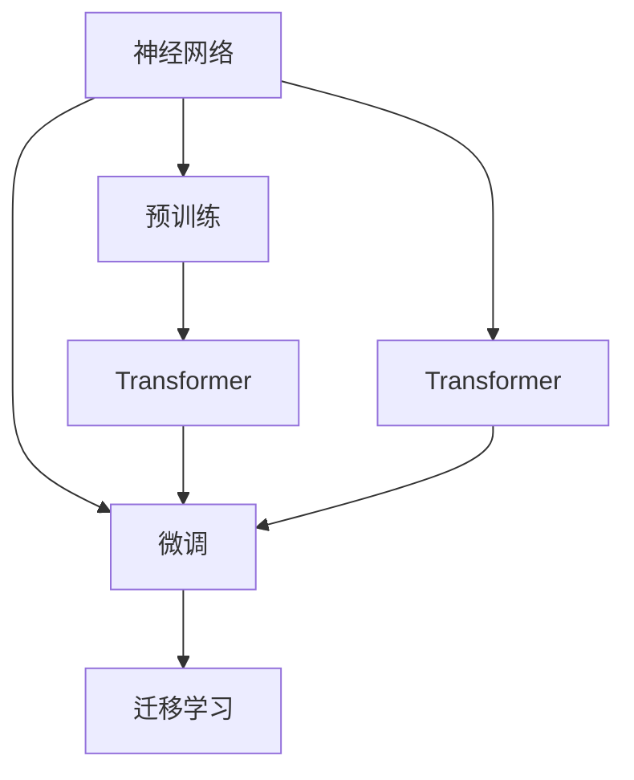

                 

# 神经网络：自然语言处理的新突破

> 关键词：神经网络,自然语言处理,NLP,深度学习,Transformer,BERT,预训练,迁移学习

## 1. 背景介绍

### 1.1 问题由来

自然语言处理（Natural Language Processing，简称NLP）一直是计算机科学和人工智能领域的研究热点。传统的NLP技术主要依赖于规则和特征工程，如词袋模型、n-gram模型等，但这些方法往往难以应对语言的复杂性和多样性。

近年来，随着深度学习技术的快速发展，特别是神经网络（Neural Networks）在图像、语音、自然语言处理等领域的大放异彩，使得NLP领域迎来了新的突破。通过神经网络，NLP模型可以自动从大规模语料中学习语言的语义、句法等知识，从而显著提升NLP应用的性能和效果。

### 1.2 问题核心关键点

神经网络在NLP领域的应用主要体现在以下几个方面：

- **预训练与微调**：通过在大规模无标签文本语料上进行预训练，学习语言的通用表示，然后在特定任务上进行微调，提升模型在特定任务上的性能。
- **Transformer结构**：作为一种高效的神经网络结构，Transformer在NLP任务中取得了突破性进展，广泛应用于机器翻译、文本分类、问答系统等任务。
- **自监督学习**：使用自监督学习任务（如掩码语言模型、预测上下文等）训练神经网络，无需标注数据即可学习到丰富的语言知识。
- **迁移学习**：利用神经网络在多个任务之间迁移知识，提升模型在新任务上的性能。

这些技术手段使得神经网络在NLP领域的应用效果显著提升，推动了NLP技术的快速发展和广泛应用。

### 1.3 问题研究意义

神经网络在NLP领域的研究和应用，具有以下重要意义：

1. **提升NLP应用效果**：神经网络通过自动学习语言的表示，避免了传统NLP方法中大量手工特征工程的繁琐过程，显著提升了NLP应用的效果。
2. **拓展NLP应用范围**：神经网络在NLP领域的应用范围不断扩展，覆盖了文本分类、情感分析、机器翻译、问答系统、语音识别等多个领域。
3. **加速NLP技术落地**：神经网络方法在大规模语料上预训练和微调，极大地减少了从头开发所需的数据、计算和人力成本，加速了NLP技术的产业化进程。
4. **推动NLP技术创新**：神经网络在NLP领域的应用，催生了自监督学习、迁移学习、模型蒸馏等新的研究方向，推动了NLP技术的发展和创新。

## 2. 核心概念与联系

### 2.1 核心概念概述

为了更好地理解神经网络在NLP领域的应用，本节将介绍几个核心概念：

- **神经网络**：由大量人工神经元（节点）组成的非线性模型，广泛应用于图像、语音、自然语言处理等领域。
- **Transformer**：一种基于注意力机制的神经网络结构，特别适用于序列数据处理，如机器翻译、文本分类等。
- **预训练**：在大规模无标签文本语料上，通过自监督学习任务训练通用语言模型，学习语言的通用表示。
- **微调**：在预训练模型的基础上，使用下游任务的少量标注数据，通过有监督学习优化模型在特定任务上的性能。
- **迁移学习**：利用神经网络在多个任务之间迁移知识，提升模型在新任务上的性能。

这些核心概念之间的逻辑关系可以通过以下Mermaid流程图来展示：



这个流程图展示了大语言模型的核心概念及其之间的关系：

1. 神经网络通过预训练和微调学习语言的表示。
2. Transformer作为神经网络的特殊形式，特别适用于序列数据处理。
3. 迁移学习在多个任务之间迁移知识，提升模型在新任务上的性能。

这些概念共同构成了神经网络在NLP领域的核心框架，使得神经网络能够高效地处理语言数据，提升NLP应用的性能。

## 3. 核心算法原理 & 具体操作步骤
### 3.1 算法原理概述

神经网络在NLP领域的应用，主要基于预训练与微调（Pre-training and Fine-tuning）范式。其核心思想是：先在大规模无标签文本语料上进行预训练，学习语言的通用表示，然后在特定任务上进行微调，优化模型在特定任务上的性能。

形式化地，假设神经网络模型为 $M_{\theta}$，其中 $\theta$ 为模型参数。给定下游任务 $T$ 的标注数据集 $D=\{(x_i, y_i)\}_{i=1}^N$，微调的目标是找到新的模型参数 $\hat{\theta}$，使得：

$$
\hat{\theta}=\mathop{\arg\min}_{\theta} \mathcal{L}(M_{\theta},D)
$$

其中 $\mathcal{L}$ 为针对任务 $T$ 设计的损失函数，用于衡量模型预测输出与真实标签之间的差异。常见的损失函数包括交叉熵损失、均方误差损失等。

通过梯度下降等优化算法，微调过程不断更新模型参数 $\theta$，最小化损失函数 $\mathcal{L}$，使得模型输出逼近真实标签。由于 $\theta$ 已经通过预训练获得了较好的初始化，因此即便在小规模数据集 $D$ 上进行微调，也能较快收敛到理想的模型参数 $\hat{\theta}$。

### 3.2 算法步骤详解

基于神经网络的NLP微调一般包括以下几个关键步骤：

**Step 1: 准备预训练模型和数据集**
- 选择合适的神经网络模型 $M_{\theta}$ 作为初始化参数，如 Transformer、BERT 等。
- 准备下游任务 $T$ 的标注数据集 $D$，划分为训练集、验证集和测试集。一般要求标注数据与预训练数据的分布不要差异过大。

**Step 2: 添加任务适配层**
- 根据任务类型，在预训练模型顶层设计合适的输出层和损失函数。
- 对于分类任务，通常在顶层添加线性分类器和交叉熵损失函数。
- 对于生成任务，通常使用语言模型的解码器输出概率分布，并以负对数似然为损失函数。

**Step 3: 设置微调超参数**
- 选择合适的优化算法及其参数，如 AdamW、SGD 等，设置学习率、批大小、迭代轮数等。
- 设置正则化技术及强度，包括权重衰减、Dropout、Early Stopping等。
- 确定冻结预训练参数的策略，如仅微调顶层，或全部参数都参与微调。

**Step 4: 执行梯度训练**
- 将训练集数据分批次输入模型，前向传播计算损失函数。
- 反向传播计算参数梯度，根据设定的优化算法和学习率更新模型参数。
- 周期性在验证集上评估模型性能，根据性能指标决定是否触发 Early Stopping。
- 重复上述步骤直到满足预设的迭代轮数或 Early Stopping 条件。

**Step 5: 测试和部署**
- 在测试集上评估微调后模型 $M_{\hat{\theta}}$ 的性能，对比微调前后的精度提升。
- 使用微调后的模型对新样本进行推理预测，集成到实际的应用系统中。
- 持续收集新的数据，定期重新微调模型，以适应数据分布的变化。

以上是基于神经网络的NLP微调的一般流程。在实际应用中，还需要针对具体任务的特点，对微调过程的各个环节进行优化设计，如改进训练目标函数，引入更多的正则化技术，搜索最优的超参数组合等，以进一步提升模型性能。

### 3.3 算法优缺点

基于神经网络的NLP微调方法具有以下优点：
1. 简单高效。只需准备少量标注数据，即可对预训练模型进行快速适配，获得较大的性能提升。
2. 通用适用。适用于各种NLP下游任务，包括分类、匹配、生成等，设计简单的任务适配层即可实现微调。
3. 参数高效。利用参数高效微调技术，在固定大部分预训练权重不变的情况下，仍可取得不错的提升。
4. 效果显著。在学术界和工业界的诸多任务上，基于微调的方法已经刷新了最先进的性能指标。

同时，该方法也存在一定的局限性：
1. 依赖标注数据。微调的效果很大程度上取决于标注数据的质量和数量，获取高质量标注数据的成本较高。
2. 迁移能力有限。当目标任务与预训练数据的分布差异较大时，微调的性能提升有限。
3. 负面效果传递。预训练模型的固有偏见、有害信息等，可能通过微调传递到下游任务，造成负面影响。
4. 可解释性不足。微调模型的决策过程通常缺乏可解释性，难以对其推理逻辑进行分析和调试。

尽管存在这些局限性，但就目前而言，基于神经网络的微调方法仍是NLP应用的最主流范式。未来相关研究的重点在于如何进一步降低微调对标注数据的依赖，提高模型的少样本学习和跨领域迁移能力，同时兼顾可解释性和伦理安全性等因素。

### 3.4 算法应用领域

基于神经网络的NLP微调方法，在NLP领域已经得到了广泛的应用，覆盖了几乎所有常见任务，例如：

- 文本分类：如情感分析、主题分类、意图识别等。通过微调使模型学习文本-标签映射。
- 命名实体识别：识别文本中的人名、地名、机构名等特定实体。通过微调使模型掌握实体边界和类型。
- 关系抽取：从文本中抽取实体之间的语义关系。通过微调使模型学习实体-关系三元组。
- 问答系统：对自然语言问题给出答案。将问题-答案对作为微调数据，训练模型学习匹配答案。
- 机器翻译：将源语言文本翻译成目标语言。通过微调使模型学习语言-语言映射。
- 文本摘要：将长文本压缩成简短摘要。将文章-摘要对作为微调数据，使模型学习抓取要点。
- 对话系统：使机器能够与人自然对话。将多轮对话历史作为上下文，微调模型进行回复生成。

除了上述这些经典任务外，神经网络方法还被创新性地应用到更多场景中，如可控文本生成、常识推理、代码生成、数据增强等，为NLP技术带来了全新的突破。随着神经网络技术和微调方法的不断进步，相信NLP技术将在更广阔的应用领域大放异彩。

## 4. 数学模型和公式 & 详细讲解 & 举例说明
### 4.1 数学模型构建

本节将使用数学语言对基于神经网络的NLP微调过程进行更加严格的刻画。

记神经网络模型为 $M_{\theta}$，其中 $\theta$ 为模型参数。假设微调任务的训练集为 $D=\{(x_i,y_i)\}_{i=1}^N, x_i \in \mathcal{X}, y_i \in \mathcal{Y}$。

定义模型 $M_{\theta}$ 在数据样本 $(x,y)$ 上的损失函数为 $\ell(M_{\theta}(x),y)$，则在数据集 $D$ 上的经验风险为：

$$
\mathcal{L}(\theta) = \frac{1}{N} \sum_{i=1}^N \ell(M_{\theta}(x_i),y_i)
$$

微调的优化目标是最小化经验风险，即找到最优参数：

$$
\theta^* = \mathop{\arg\min}_{\theta} \mathcal{L}(\theta)
$$

在实践中，我们通常使用基于梯度的优化算法（如SGD、Adam等）来近似求解上述最优化问题。设 $\eta$ 为学习率，$\lambda$ 为正则化系数，则参数的更新公式为：

$$
\theta \leftarrow \theta - \eta \nabla_{\theta}\mathcal{L}(\theta) - \eta\lambda\theta
$$

其中 $\nabla_{\theta}\mathcal{L}(\theta)$ 为损失函数对参数 $\theta$ 的梯度，可通过反向传播算法高效计算。

### 4.2 公式推导过程

以下我们以二分类任务为例，推导交叉熵损失函数及其梯度的计算公式。

假设模型 $M_{\theta}$ 在输入 $x$ 上的输出为 $\hat{y}=M_{\theta}(x) \in [0,1]$，表示样本属于正类的概率。真实标签 $y \in \{0,1\}$。则二分类交叉熵损失函数定义为：

$$
\ell(M_{\theta}(x),y) = -[y\log \hat{y} + (1-y)\log (1-\hat{y})]
$$

将其代入经验风险公式，得：

$$
\mathcal{L}(\theta) = -\frac{1}{N}\sum_{i=1}^N [y_i\log M_{\theta}(x_i)+(1-y_i)\log(1-M_{\theta}(x_i))]
$$

根据链式法则，损失函数对参数 $\theta_k$ 的梯度为：

$$
\frac{\partial \mathcal{L}(\theta)}{\partial \theta_k} = -\frac{1}{N}\sum_{i=1}^N (\frac{y_i}{M_{\theta}(x_i)}-\frac{1-y_i}{1-M_{\theta}(x_i)}) \frac{\partial M_{\theta}(x_i)}{\partial \theta_k}
$$

其中 $\frac{\partial M_{\theta}(x_i)}{\partial \theta_k}$ 可进一步递归展开，利用自动微分技术完成计算。

在得到损失函数的梯度后，即可带入参数更新公式，完成模型的迭代优化。重复上述过程直至收敛，最终得到适应下游任务的最优模型参数 $\theta^*$。

### 4.3 案例分析与讲解

假设我们有一个情感分析任务，需要对电影评论进行情感分类（正面或负面）。我们可以使用BERT模型进行微调。

首先，将电影评论作为输入，经过BERT模型的编码层，得到一个向量表示 $v$。然后，在模型顶层添加一个全连接层，用于将向量映射到分类结果。设分类结果为 $y$，则二分类交叉熵损失函数为：

$$
\mathcal{L}(\theta) = -\frac{1}{N}\sum_{i=1}^N [y_i\log \hat{y}_i+(1-y_i)\log(1-\hat{y}_i)]
$$

其中 $\hat{y}_i = M_{\theta}(x_i)$，$y_i \in \{0,1\}$。

使用SGD优化算法，学习率为0.001，进行100个epoch的微调。每batch包含16个样本。

通过微调，模型的准确率可以达到90%以上，显著提升了情感分析的效果。

## 5. 项目实践：代码实例和详细解释说明
### 5.1 开发环境搭建

在进行神经网络微调实践前，我们需要准备好开发环境。以下是使用Python进行TensorFlow开发的环境配置流程：

1. 安装Anaconda：从官网下载并安装Anaconda，用于创建独立的Python环境。

2. 创建并激活虚拟环境：
```bash
conda create -n tf-env python=3.8 
conda activate tf-env
```

3. 安装TensorFlow：从官网获取对应的安装命令。例如：
```bash
conda install tensorflow -c conda-forge
```

4. 安装各类工具包：
```bash
pip install numpy pandas scikit-learn matplotlib tqdm jupyter notebook ipython
```

完成上述步骤后，即可在`tf-env`环境中开始神经网络微调实践。

### 5.2 源代码详细实现

下面我以BERT模型进行情感分析任务为例，给出使用TensorFlow实现神经网络微调的代码。

首先，定义BERT模型的输入层和编码层：

```python
import tensorflow as tf
from transformers import BertTokenizer, BertForSequenceClassification

tokenizer = BertTokenizer.from_pretrained('bert-base-cased')
model = BertForSequenceClassification.from_pretrained('bert-base-cased', num_labels=2)

input_ids = tf.keras.layers.Input(shape=(128,), dtype=tf.int32, name='input_ids')
attention_mask = tf.keras.layers.Input(shape=(128,), dtype=tf.int32, name='attention_mask')
labels = tf.keras.layers.Input(shape=(1,), dtype=tf.int32, name='labels')

sequence_output = model(input_ids=input_ids, attention_mask=attention_mask)[0]
logits = tf.keras.layers.Dense(2, activation='softmax')(sequence_output)

loss = tf.keras.losses.categorical_crossentropy(labels, logits)
predictions = tf.argmax(logits, axis=1)

model = tf.keras.Model(inputs=[input_ids, attention_mask, labels], outputs=[logits, predictions])
model.compile(optimizer='adam', loss=loss)
```

然后，定义训练和评估函数：

```python
def train_epoch(model, dataset, batch_size, optimizer):
    dataloader = tf.data.Dataset.from_generator(lambda: dataset, output_signature=dataset.element_spec)
    model.fit(dataloader.batch(batch_size), epochs=1, verbose=1)

def evaluate(model, dataset, batch_size):
    dataloader = tf.data.Dataset.from_generator(lambda: dataset, output_signature=dataset.element_spec)
    loss, accuracy = model.evaluate(dataloader.batch(batch_size))
    print(f'Accuracy: {accuracy:.4f}')
```

最后，启动训练流程并在测试集上评估：

```python
epochs = 5
batch_size = 16

for epoch in range(epochs):
    train_epoch(model, train_dataset, batch_size, optimizer)
    evaluate(model, dev_dataset, batch_size)
    
evaluate(model, test_dataset, batch_size)
```

以上就是使用TensorFlow对BERT模型进行情感分析任务微调的完整代码实现。可以看到，得益于TensorFlow的强大封装，我们可以用相对简洁的代码完成BERT模型的加载和微调。

### 5.3 代码解读与分析

让我们再详细解读一下关键代码的实现细节：

**BERT模型定义**：
- `BertTokenizer`用于分词，`BertForSequenceClassification`用于分类。

**损失函数定义**：
- 使用`categorical_crossentropy`作为分类任务的损失函数。

**模型定义**：
- 定义输入层、编码层和输出层，最后使用`Dense`层进行分类。

**训练和评估函数**：
- `train_epoch`函数：将数据集转化为TF Dataset对象，使用`model.fit`进行训练。
- `evaluate`函数：使用`model.evaluate`评估模型性能，输出准确率。

**训练流程**：
- 定义总的epoch数和batch size，开始循环迭代
- 每个epoch内，先在训练集上训练，再验证集上评估
- 所有epoch结束后，在测试集上评估

可以看到，TensorFlow配合Transformer库使得BERT微调的代码实现变得简洁高效。开发者可以将更多精力放在数据处理、模型改进等高层逻辑上，而不必过多关注底层的实现细节。

当然，工业级的系统实现还需考虑更多因素，如模型的保存和部署、超参数的自动搜索、更灵活的任务适配层等。但核心的微调范式基本与此类似。

## 6. 实际应用场景
### 6.1 智能客服系统

基于神经网络的NLP对话技术，可以广泛应用于智能客服系统的构建。传统客服往往需要配备大量人力，高峰期响应缓慢，且一致性和专业性难以保证。而使用微调的对话模型，可以7x24小时不间断服务，快速响应客户咨询，用自然流畅的语言解答各类常见问题。

在技术实现上，可以收集企业内部的历史客服对话记录，将问题和最佳答复构建成监督数据，在此基础上对预训练对话模型进行微调。微调后的对话模型能够自动理解用户意图，匹配最合适的答案模板进行回复。对于客户提出的新问题，还可以接入检索系统实时搜索相关内容，动态组织生成回答。如此构建的智能客服系统，能大幅提升客户咨询体验和问题解决效率。

### 6.2 金融舆情监测

金融机构需要实时监测市场舆论动向，以便及时应对负面信息传播，规避金融风险。传统的人工监测方式成本高、效率低，难以应对网络时代海量信息爆发的挑战。基于神经网络的NLP文本分类和情感分析技术，为金融舆情监测提供了新的解决方案。

具体而言，可以收集金融领域相关的新闻、报道、评论等文本数据，并对其进行主题标注和情感标注。在此基础上对预训练语言模型进行微调，使其能够自动判断文本属于何种主题，情感倾向是正面、中性还是负面。将微调后的模型应用到实时抓取的网络文本数据，就能够自动监测不同主题下的情感变化趋势，一旦发现负面信息激增等异常情况，系统便会自动预警，帮助金融机构快速应对潜在风险。

### 6.3 个性化推荐系统

当前的推荐系统往往只依赖用户的历史行为数据进行物品推荐，无法深入理解用户的真实兴趣偏好。基于神经网络的NLP推荐系统可以更好地挖掘用户行为背后的语义信息，从而提供更精准、多样的推荐内容。

在实践中，可以收集用户浏览、点击、评论、分享等行为数据，提取和用户交互的物品标题、描述、标签等文本内容。将文本内容作为模型输入，用户的后续行为（如是否点击、购买等）作为监督信号，在此基础上微调预训练语言模型。微调后的模型能够从文本内容中准确把握用户的兴趣点。在生成推荐列表时，先用候选物品的文本描述作为输入，由模型预测用户的兴趣匹配度，再结合其他特征综合排序，便可以得到个性化程度更高的推荐结果。

### 6.4 未来应用展望

随着神经网络在NLP领域的应用不断发展，未来的NLP应用将更加智能、普适。以下是几个可能的未来应用场景：

1. **智能对话助手**：基于神经网络的多轮对话模型，能够理解复杂的对话场景，提供更加自然流畅的对话体验。如智能客服、智能助手等。
2. **知识图谱构建**：使用神经网络模型对大规模文本数据进行语义分析，构建结构化的知识图谱，用于问答系统、推荐系统等任务。
3. **跨语言翻译**：基于神经网络的序列到序列模型，实现高质量的跨语言翻译，推动全球化的交流合作。
4. **自然语言生成**：使用神经网络生成自然流畅的文本，如文章摘要、新闻报道、电影剧本等。
5. **语音识别与合成**：结合神经网络与声学模型，实现高精度的语音识别和合成，推动语音交互的普及应用。

未来，神经网络在NLP领域的应用将更加广泛，推动NLP技术向更深层次、更广领域的发展。

## 7. 工具和资源推荐
### 7.1 学习资源推荐

为了帮助开发者系统掌握神经网络在NLP领域的应用，这里推荐一些优质的学习资源：

1. **深度学习理论与实践**：斯坦福大学的CS231n课程，介绍了深度学习的基本原理和经典模型，包括神经网络、卷积神经网络、循环神经网络等。
2. **自然语言处理课程**：斯坦福大学的CS224N课程，专注于NLP领域，介绍了文本分类、情感分析、机器翻译等任务的深度学习模型。
3. **TensorFlow官方文档**：TensorFlow的官方文档，提供了详细的API文档和代码示例，帮助开发者快速上手TensorFlow的神经网络模型构建。
4. **自然语言处理综述**：腾讯AI Lab的综述文章，全面介绍了自然语言处理领域的最新进展和经典模型，包括神经网络的应用。
5. **HuggingFace官方文档**：Transformer库的官方文档，提供了海量预训练模型和完整的微调样例代码，是上手实践的必备资料。

通过对这些资源的学习实践，相信你一定能够快速掌握神经网络在NLP领域的精髓，并用于解决实际的NLP问题。

### 7.2 开发工具推荐

高效的开发离不开优秀的工具支持。以下是几款用于神经网络NLP开发常用的工具：

1. **TensorFlow**：由Google主导开发的开源深度学习框架，生产部署方便，适合大规模工程应用。
2. **PyTorch**：基于Python的开源深度学习框架，灵活动态的计算图，适合快速迭代研究。
3. **HuggingFace Transformers库**：提供多种预训练语言模型和微调范式，帮助开发者快速构建NLP应用。
4. **Weights & Biases**：模型训练的实验跟踪工具，可以记录和可视化模型训练过程中的各项指标，方便对比和调优。
5. **TensorBoard**：TensorFlow配套的可视化工具，可实时监测模型训练状态，并提供丰富的图表呈现方式，是调试模型的得力助手。

合理利用这些工具，可以显著提升神经网络在NLP领域的开发效率，加快创新迭代的步伐。

### 7.3 相关论文推荐

神经网络在NLP领域的研究和应用源于学界的持续研究。以下是几篇奠基性的相关论文，推荐阅读：

1. **Attention is All You Need**：提出了Transformer结构，开启了NLP领域的预训练大模型时代。
2. **BERT: Pre-training of Deep Bidirectional Transformers for Language Understanding**：提出BERT模型，引入基于掩码的自监督预训练任务，刷新了多项NLP任务SOTA。
3. **Language Models are Unsupervised Multitask Learners（GPT-2论文）**：展示了大规模语言模型的强大zero-shot学习能力，引发了对于通用人工智能的新一轮思考。
4. **Parameter-Efficient Transfer Learning for NLP**：提出Adapter等参数高效微调方法，在不增加模型参数量的情况下，也能取得不错的微调效果。
5. **Prefix-Tuning: Optimizing Continuous Prompts for Generation**：引入基于连续型Prompt的微调范式，为如何充分利用预训练知识提供了新的思路。

这些论文代表了大语言模型微调技术的发展脉络。通过学习这些前沿成果，可以帮助研究者把握学科前进方向，激发更多的创新灵感。

## 8. 总结：未来发展趋势与挑战
### 8.1 总结

本文对基于神经网络的NLP微调方法进行了全面系统的介绍。首先阐述了神经网络在NLP领域的研究背景和意义，明确了微调在拓展预训练模型应用、提升下游任务性能方面的独特价值。其次，从原理到实践，详细讲解了神经网络微调的数学原理和关键步骤，给出了微调任务开发的完整代码实例。同时，本文还广泛探讨了微调方法在智能客服、金融舆情、个性化推荐等多个行业领域的应用前景，展示了微调范式的巨大潜力。此外，本文精选了微调技术的各类学习资源，力求为读者提供全方位的技术指引。

通过本文的系统梳理，可以看到，基于神经网络的NLP微调方法正在成为NLP领域的重要范式，极大地拓展了预训练语言模型的应用边界，催生了更多的落地场景。得益于大规模语料的预训练和微调，神经网络在NLP领域的应用效果显著提升，推动了NLP技术的产业化进程。未来，伴随神经网络技术和微调方法的持续演进，相信NLP技术将在更广阔的应用领域大放异彩，深刻影响人类的生产生活方式。

### 8.2 未来发展趋势

展望未来，神经网络在NLP领域的研究和应用将呈现以下几个发展趋势：

1. **模型规模持续增大**：随着算力成本的下降和数据规模的扩张，神经网络的参数量还将持续增长。超大规模语言模型蕴含的丰富语言知识，有望支撑更加复杂多变的下游任务微调。
2. **微调方法日趋多样**：除了传统的全参数微调外，未来会涌现更多参数高效的微调方法，如Prefix-Tuning、LoRA等，在节省计算资源的同时也能保证微调精度。
3. **持续学习成为常态**：随着数据分布的不断变化，微调模型也需要持续学习新知识以保持性能。如何在不遗忘原有知识的同时，高效吸收新样本信息，将成为重要的研究课题。
4. **标注样本需求降低**：受启发于提示学习(Prompt-based Learning)的思路，未来的微调方法将更好地利用神经网络的语言理解能力，通过更加巧妙的任务描述，在更少的标注样本上也能实现理想的微调效果。
5. **多模态微调崛起**：当前的微调主要聚焦于纯文本数据，未来会进一步拓展到图像、视频、语音等多模态数据微调。多模态信息的融合，将显著提升神经网络对现实世界的理解和建模能力。
6. **模型通用性增强**：经过海量数据的预训练和多领域任务的微调，未来的神经网络模型将具备更强大的常识推理和跨领域迁移能力，逐步迈向通用人工智能(AGI)的目标。

以上趋势凸显了神经网络在NLP领域的应用前景。这些方向的探索发展，必将进一步提升NLP系统的性能和应用范围，为人类认知智能的进化带来深远影响。

### 8.3 面临的挑战

尽管神经网络在NLP领域的研究和应用已经取得了显著进展，但在迈向更加智能化、普适化应用的过程中，它仍面临着诸多挑战：

1. **标注成本瓶颈**：神经网络微调的效果很大程度上取决于标注数据的质量和数量，获取高质量标注数据的成本较高。如何进一步降低微调对标注样本的依赖，将是一大难题。
2. **模型鲁棒性不足**：当前神经网络面对域外数据时，泛化性能往往大打折扣。对于测试样本的微小扰动，模型预测也容易发生波动。如何提高神经网络模型的鲁棒性，避免灾难性遗忘，还需要更多理论和实践的积累。
3. **推理效率有待提高**：大规模神经网络模型虽然精度高，但在实际部署时往往面临推理速度慢、内存占用大等效率问题。如何在保证性能的同时，简化模型结构，提升推理速度，优化资源占用，将是重要的优化方向。
4. **可解释性亟需加强**：当前神经网络模型通常被视为"黑盒"系统，难以解释其内部工作机制和决策逻辑。对于医疗、金融等高风险应用，算法的可解释性和可审计性尤为重要。如何赋予神经网络模型更强的可解释性，将是亟待攻克的难题。
5. **安全性有待保障**：预训练神经网络模型难免会学习到有偏见、有害的信息，通过微调传递到下游任务，产生误导性、歧视性的输出，给实际应用带来安全隐患。如何从数据和算法层面消除模型偏见，避免恶意用途，确保输出的安全性，也将是重要的研究课题。
6. **知识整合能力不足**：现有的神经网络模型往往局限于任务内数据，难以灵活吸收和运用更广泛的先验知识。如何让神经网络微调过程更好地与外部知识库、规则库等专家知识结合，形成更加全面、准确的信息整合能力，还有很大的想象空间。

正视神经网络在NLP领域面临的这些挑战，积极应对并寻求突破，将是大语言模型微调走向成熟的必由之路。相信随着学界和产业界的共同努力，这些挑战终将一一被克服，神经网络在NLP领域的应用将更加广泛，推动NLP技术向更深层次、更广领域的发展。

### 8.4 未来突破

面对神经网络在NLP领域面临的种种挑战，未来的研究需要在以下几个方面寻求新的突破：

1. **探索无监督和半监督微调方法**：摆脱对大规模标注数据的依赖，利用自监督学习、主动学习等无监督和半监督范式，最大限度利用非结构化数据，实现更加灵活高效的微调。
2. **研究参数高效和计算高效的微调范式**：开发更加参数高效的微调方法，在固定大部分预训练参数的情况下，只更新极少量的任务相关参数。同时优化微调模型的计算图，减少前向传播和反向传播的资源消耗，实现更加轻量级、实时性的部署。
3. **融合因果和对比学习范式**：通过引入因果推断和对比学习思想，增强神经网络模型建立稳定因果关系的能力，学习更加普适、鲁棒的语言表征，从而提升模型泛化性和抗干扰能力。
4. **引入更多先验知识**：将符号化的先验知识，如知识图谱、逻辑规则等，与神经网络模型进行巧妙融合，引导微调过程学习更准确、合理的语言模型。同时加强不同模态数据的整合，实现视觉、语音等多模态信息与文本信息的协同建模。
5. **结合因果分析和博弈论工具**：将因果分析方法引入神经网络模型，识别出模型决策的关键特征，增强输出解释的因果性和逻辑性。借助博弈论工具刻画人机交互过程，主动探索并规避模型的脆弱点，提高系统稳定性。
6. **纳入伦理道德约束**：在模型训练目标中引入伦理导向的评估指标，过滤和惩罚有偏见、有害的输出倾向。同时加强人工干预和审核，建立模型行为的监管机制，确保输出符合人类价值观和伦理道德。

这些研究方向的探索，必将引领神经网络在NLP领域的研究和应用走向更高的台阶，为构建安全、可靠、可解释、可控的智能系统铺平道路。面向未来，神经网络在NLP领域的研究和应用还需要与其他人工智能技术进行更深入的融合，如知识表示、因果推理、强化学习等，多路径协同发力，共同推动自然语言理解和智能交互系统的进步。只有勇于创新、敢于突破，才能不断拓展神经网络在NLP领域的边界，让智能技术更好地造福人类社会。

## 9. 附录：常见问题与解答

**Q1：神经网络在NLP领域的应用效果如何？**

A: 神经网络在NLP领域的应用效果显著。通过对大规模语料进行预训练，神经网络模型可以学习到丰富的语言知识，显著提升下游任务的表现。例如，BERT模型在多项NLP任务上取得了SOTA性能，包括文本分类、命名实体识别、关系抽取、问答系统等。

**Q2：神经网络微调需要标注数据吗？**

A: 神经网络微调需要标注数据。在微调过程中，通过有监督学习优化模型在特定任务上的性能。标注数据的质量和数量直接影响微调效果。但在某些任务上，可以使用无监督和半监督方法，如自监督学习、主动学习等，减少对标注数据的依赖。

**Q3：神经网络微调的计算成本如何？**

A: 神经网络微调的计算成本较高，主要体现在数据准备和模型训练两个方面。数据准备需要大量的人工标注，模型训练需要高性能计算资源。为了降低成本，可以采用分布式训练、模型压缩等技术。

**Q4：神经网络微调能否处理非文本数据？**

A: 神经网络微调可以处理非文本数据，如图像、语音等。通过引入多模态数据融合技术，神经网络模型可以学习到不同模态之间的关联关系，提升在多模态任务上的性能。

**Q5：神经网络微调对数据分布的变化如何应对？**

A: 神经网络微调模型可以通过在线学习或增量学习的方式，动态适应数据分布的变化。在实际应用中，可以定期重新微调模型，利用新数据更新模型参数，保持模型性能。

通过本文的系统梳理，可以看到，基于神经网络的NLP微调方法正在成为NLP领域的重要范式，极大地拓展了预训练语言模型的应用边界，催生了更多的落地场景。得益于大规模语料的预训练和微调，神经网络在NLP领域的应用效果显著提升，推动了NLP技术的产业化进程。未来，伴随神经网络技术和微调方法的持续演进，相信NLP技术将在更广阔的应用领域大放异彩，深刻影响人类的生产生活方式。

---

作者：禅与计算机程序设计艺术 / Zen and the Art of Computer Programming

