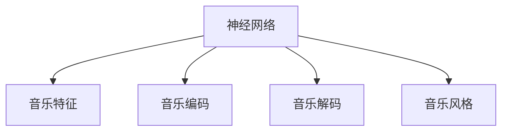

                 

# 神经网络：音乐创作的新工具

## 1. 背景介绍

### 1.1 问题由来

随着人工智能技术在各行各业的深度应用，音乐创作这一传统艺术领域也开始逐渐探索与人工智能的结合。神经网络在图像识别、自然语言处理等领域展现了强大的能力，但在音乐创作这一高度抽象和情感驱动的领域，其表现如何，是否能够辅助人类创作高质量的音乐？这是本文希望探讨的问题。

### 1.2 问题核心关键点

音乐创作的过程充满了主观性和情感的表达，很难用传统的量化指标来评估其质量。神经网络在这一领域的应用，主要是通过学习大量音乐数据，捕捉其中的模式和规律，生成新的音乐作品。具体问题关键点包括：

- 如何构建能够有效捕捉音乐特征的神经网络模型？
- 如何对音乐进行高质量的编码和解码？
- 如何保证生成的音乐具有新颖性和艺术性？
- 如何结合人类创意与人工智能生成技术？

本文将围绕这些核心问题，深入探讨神经网络在音乐创作中的应用。

### 1.3 问题研究意义

神经网络在音乐创作中的应用，可以带来以下几个方面的意义：

1. **提高创作效率**：神经网络可以自动生成音乐，极大提升音乐创作的速度。
2. **激发创作灵感**：通过分析大量音乐数据，神经网络可以提供丰富的创作灵感，帮助音乐家突破创作瓶颈。
3. **多样化音乐风格**：神经网络能够生成不同风格和流派的音乐，丰富音乐创作的多样性。
4. **跨界融合创新**：结合神经网络和其他艺术形式（如视觉艺术、文学等），实现音乐与其他艺术领域的跨界融合，推动艺术创新的边界。

## 2. 核心概念与联系

### 2.1 核心概念概述

为了更好地理解神经网络在音乐创作中的应用，我们首先介绍几个关键概念：

- **神经网络**：一种通过学习大量数据，自动提取特征并进行预测的计算模型。
- **音乐特征**：包括旋律、节奏、和声、音色等要素，是神经网络处理音乐数据的基础。
- **音乐编码**：将音乐转换成数值形式，以便神经网络进行处理。
- **音乐解码**：将神经网络生成的数值形式转换成可听的音乐。
- **音乐风格**：不同的音乐风格具有独特的旋律、节奏和和声特征，神经网络能够生成多风格的音乐。

这些概念通过以下Mermaid流程图来展示它们之间的联系：



### 2.2 核心概念原理和架构

神经网络是一种由大量节点（神经元）组成的计算模型，通过多层非线性变换，能够处理复杂的非线性关系。其基本架构包括输入层、隐藏层和输出层。

- **输入层**：负责接收原始数据，如音频波形。
- **隐藏层**：通过一系列的卷积、池化、激活等操作，提取数据中的特征。
- **输出层**：将提取的特征映射到音乐参数空间，生成音乐信号。

音乐编码和解码是神经网络处理音乐的关键步骤：

- **音乐编码**：将音乐转换成频谱特征、MFCC特征等数值形式，便于神经网络处理。
- **音乐解码**：将神经网络生成的数值形式转换成音频信号，恢复音乐的形式。

音乐风格的生成是神经网络在音乐创作中的重要应用，主要通过以下步骤实现：

- **特征提取**：使用卷积神经网络（CNN）等方法，从音乐数据中提取旋律、节奏、和声等特征。
- **风格映射**：通过训练一个条件生成网络，将音乐特征映射到特定风格的音乐参数空间。
- **风格变换**：使用风格迁移技术，将音乐从一种风格变换为另一种风格。

## 3. 核心算法原理 & 具体操作步骤

### 3.1 算法原理概述

神经网络在音乐创作中的应用，主要是通过以下三个步骤实现的：

1. **音乐特征提取**：使用卷积神经网络（CNN）等方法，从音乐数据中提取旋律、节奏、和声等特征。
2. **音乐生成**：通过训练一个生成对抗网络（GAN）等生成模型，从音乐特征中生成新的音乐。
3. **音乐风格变换**：使用风格迁移技术，将音乐从一种风格变换为另一种风格。

### 3.2 算法步骤详解

#### 3.2.1 音乐特征提取

音乐特征提取是神经网络处理音乐的基础，常用的方法包括：

- **频谱特征**：通过快速傅里叶变换（FFT）将音频信号转换为频谱图，提取频率信息。
- **MFCC特征**：通过Mel频谱和离散余弦变换（DCT）提取音乐中的音高和音色信息。
- **时域特征**：提取音频的波形和节奏信息，如节奏强度、音调变化等。

##### 代码示例：

```python
import librosa

def extract_mfcc_features(file_path):
    y, sr = librosa.load(file_path)
    mfcc = librosa.feature.mfcc(y=y, sr=sr)
    return mfcc
```

#### 3.2.2 音乐生成

音乐生成通常使用生成对抗网络（GAN）来实现，包括生成器和判别器两个部分：

- **生成器**：负责从音乐特征中生成新的音乐。
- **判别器**：负责区分生成的音乐与真实音乐，通过对抗训练提高生成音乐的质量。

##### 代码示例：

```python
import torch
import torch.nn as nn
import torch.optim as optim

class Generator(nn.Module):
    def __init__(self):
        super(Generator, self).__init__()
        self.encoder = nn.Sequential(
            nn.Linear(100, 512),
            nn.LeakyReLU(0.2),
            nn.Linear(512, 1024),
            nn.LeakyReLU(0.2),
            nn.Linear(1024, 2048),
            nn.LeakyReLU(0.2),
            nn.Linear(2048, 2)
        )
        self.decoder = nn.Sequential(
            nn.Linear(2, 2048),
            nn.Tanh(),
            nn.Linear(2048, 1024),
            nn.Tanh(),
            nn.Linear(1024, 512),
            nn.Tanh(),
            nn.Linear(512, 2)
        )

    def forward(self, x):
        return self.decoder(self.encoder(x))

class Discriminator(nn.Module):
    def __init__(self):
        super(Discriminator, self).__init__()
        self.encoder = nn.Sequential(
            nn.Linear(2, 1024),
            nn.LeakyReLU(0.2),
            nn.Linear(1024, 512),
            nn.LeakyReLU(0.2),
            nn.Linear(512, 256),
            nn.LeakyReLU(0.2),
            nn.Linear(256, 1)
        )

    def forward(self, x):
        return self.encoder(x)

# 定义优化器和损失函数
optimizer_G = optim.Adam(netG.parameters(), lr=0.0002)
optimizer_D = optim.Adam(netD.parameters(), lr=0.0002)

criterion = nn.BCELoss()

# 训练过程
for epoch in range(100):
    for i, (real_audio, _) in enumerate(train_loader):
        real_audio = real_audio.to(device)
        
        # 训练生成器
        netG.zero_grad()
        fake_audio = netG(noise)
        output = netD(fake_audio)
        errG = criterion(output, torch.ones(batch_size, 1).to(device))
        errG.backward()
        optimizer_G.step()
        
        # 训练判别器
        netD.zero_grad()
        real_output = netD(real_audio)
        fake_output = netD(fake_audio)
        errD_real = criterion(real_output, torch.ones(batch_size, 1).to(device))
        errD_fake = criterion(fake_output, torch.zeros(batch_size, 1).to(device))
        errD = errD_real + errD_fake
        errD.backward()
        optimizer_D.step()
```

#### 3.2.3 音乐风格变换

音乐风格变换通过风格迁移技术实现，主要包括以下步骤：

- **特征提取**：使用卷积神经网络（CNN）从音乐中提取旋律、节奏、和声等特征。
- **风格映射**：训练一个条件生成网络，将音乐特征映射到特定风格的音乐参数空间。
- **风格变换**：使用迁移学习，将音乐从一种风格变换为另一种风格。

##### 代码示例：

```python
import torchvision.models as models
import torch.nn as nn
import torch.optim as optim
from torchvision.transforms import ToTensor

class StyleTransferNet(nn.Module):
    def __init__(self, style_model, content_model):
        super(StyleTransferNet, self).__init__()
        self.style_model = style_model
        self.content_model = content_model
        self.style_features = nn.Sequential(
            nn.AdaptiveAvgPool2d(1),
            nn.Conv2d(3, 3, kernel_size=1, stride=1, padding=0),
            nn.Tanh()
        )
        self.content_features = nn.Sequential(
            nn.AdaptiveAvgPool2d(1),
            nn.Conv2d(3, 3, kernel_size=1, stride=1, padding=0),
            nn.Tanh()
        )
        self.decoder = nn.Sequential(
            nn.Conv2d(3, 512, kernel_size=3, stride=1, padding=1),
            nn.ReLU(inplace=True),
            nn.Conv2d(512, 256, kernel_size=3, stride=1, padding=1),
            nn.ReLU(inplace=True),
            nn.Conv2d(256, 3, kernel_size=3, stride=1, padding=1),
            nn.Tanh()
        )

    def style_transfer(self, content_image, style_image):
        content_features = self.content_model(content_image)
        style_features = self.style_model(style_image)
        content_features = self.style_features(content_features)
        style_features = self.content_features(style_features)
        content_features = content_features.unsqueeze(1)
        style_features = style_features.unsqueeze(0)
        features = torch.cat([content_features, style_features], dim=1)
        decoded_image = self.decoder(features)
        return decoded_image
```

### 3.3 算法优缺点

#### 3.3.1 优点

1. **自动生成音乐**：神经网络能够自动生成高质量的音乐，极大提升创作效率。
2. **多样性丰富**：生成音乐风格多样化，能够突破传统创作的局限。
3. **创作辅助**：提供创作灵感，辅助人类音乐家突破创作瓶颈。

#### 3.3.2 缺点

1. **依赖数据质量**：神经网络生成的音乐质量高度依赖训练数据的丰富性和多样性。
2. **艺术性不足**：自动生成的音乐可能缺乏人类音乐家的情感表达和创新性。
3. **技术门槛高**：需要一定的技术背景和资源，才能构建和训练神经网络模型。

### 3.4 算法应用领域

神经网络在音乐创作中的应用，已经逐步拓展到以下几个领域：

1. **音乐生成**：使用生成对抗网络（GAN）等生成模型，自动生成各种风格的音乐。
2. **音乐分析**：通过分析大量音乐数据，提取音乐特征，帮助音乐家理解音乐的结构和风格。
3. **音乐推荐**：基于用户听歌历史和偏好，生成个性化的音乐推荐列表。
4. **音乐教学**：通过分析音乐数据，提供音乐学习指导和练习建议。
5. **音乐风格变换**：使用风格迁移技术，将音乐从一种风格变换为另一种风格。

## 4. 数学模型和公式 & 详细讲解 & 举例说明

### 4.1 数学模型构建

音乐生成和风格变换的数学模型主要基于生成对抗网络（GAN）和风格迁移技术，具体如下：

- **生成对抗网络（GAN）**：由生成器和判别器组成，通过对抗训练提高生成音乐的质量。
- **风格迁移**：使用卷积神经网络（CNN）提取音乐特征，通过迁移学习实现风格变换。

#### 4.1.1 生成对抗网络

生成对抗网络由生成器和判别器两个部分组成，数学模型如下：

- **生成器**：将随机噪声 $z$ 映射到音乐特征空间 $y$。
- **判别器**：将音乐特征 $y$ 映射到真实性标签 $x$。

数学公式如下：

$$
G: z \to y, \quad D: y \to x
$$

其中，$z$ 为随机噪声，$y$ 为生成音乐特征，$x$ 为真实性标签。

#### 4.1.2 风格迁移

风格迁移技术使用卷积神经网络（CNN）提取音乐特征，数学模型如下：

- **特征提取**：使用CNN提取音乐特征 $y$。
- **风格映射**：训练一个条件生成网络，将音乐特征 $y$ 映射到风格音乐特征 $z$。
- **风格变换**：使用迁移学习，将音乐特征 $y$ 映射到风格变换后的音乐特征 $z$。

数学公式如下：

$$
F: y \to z, \quad T: y \to z
$$

其中，$y$ 为音乐特征，$z$ 为风格音乐特征。

### 4.2 公式推导过程

#### 4.2.1 生成对抗网络

生成对抗网络（GAN）的生成器 $G$ 和判别器 $D$ 的损失函数分别为：

- **生成器损失函数**：$L_G = -\mathbb{E}_{z \sim p_z}[log(D(G(z)))]$
- **判别器损失函数**：$L_D = -\mathbb{E}_{y \sim p_y}[log(D(y))] - \mathbb{E}_{z \sim p_z}[log(1 - D(G(z)))]$

其中，$p_z$ 为随机噪声 $z$ 的概率分布，$p_y$ 为真实音乐特征 $y$ 的概率分布。

### 4.3 案例分析与讲解

#### 4.3.1 音乐生成案例

使用生成对抗网络（GAN）生成音乐，以下是一个简单的实现过程：

1. **生成器**：将随机噪声 $z$ 映射到音乐特征空间 $y$。
2. **判别器**：将音乐特征 $y$ 映射到真实性标签 $x$。
3. **训练过程**：通过对抗训练，逐步优化生成器和判别器的参数，提高生成音乐的质量。

##### 代码示例：

```python
import torch
import torch.nn as nn
import torch.optim as optim

class Generator(nn.Module):
    def __init__(self):
        super(Generator, self).__init__()
        self.encoder = nn.Sequential(
            nn.Linear(100, 512),
            nn.LeakyReLU(0.2),
            nn.Linear(512, 1024),
            nn.LeakyReLU(0.2),
            nn.Linear(1024, 2048),
            nn.LeakyReLU(0.2),
            nn.Linear(2048, 2)
        )
        self.decoder = nn.Sequential(
            nn.Linear(2, 2048),
            nn.Tanh(),
            nn.Linear(2048, 1024),
            nn.Tanh(),
            nn.Linear(1024, 512),
            nn.Tanh(),
            nn.Linear(512, 2)
        )

    def forward(self, x):
        return self.decoder(self.encoder(x))

class Discriminator(nn.Module):
    def __init__(self):
        super(Discriminator, self).__init__()
        self.encoder = nn.Sequential(
            nn.Linear(2, 1024),
            nn.LeakyReLU(0.2),
            nn.Linear(1024, 512),
            nn.LeakyReLU(0.2),
            nn.Linear(512, 256),
            nn.LeakyReLU(0.2),
            nn.Linear(256, 1)
        )

    def forward(self, x):
        return self.encoder(x)

# 定义优化器和损失函数
optimizer_G = optim.Adam(netG.parameters(), lr=0.0002)
optimizer_D = optim.Adam(netD.parameters(), lr=0.0002)

criterion = nn.BCELoss()

# 训练过程
for epoch in range(100):
    for i, (real_audio, _) in enumerate(train_loader):
        real_audio = real_audio.to(device)
        
        # 训练生成器
        netG.zero_grad()
        fake_audio = netG(noise)
        output = netD(fake_audio)
        errG = criterion(output, torch.ones(batch_size, 1).to(device))
        errG.backward()
        optimizer_G.step()
        
        # 训练判别器
        netD.zero_grad()
        real_output = netD(real_audio)
        fake_output = netD(fake_audio)
        errD_real = criterion(real_output, torch.ones(batch_size, 1).to(device))
        errD_fake = criterion(fake_output, torch.zeros(batch_size, 1).to(device))
        errD = errD_real + errD_fake
        errD.backward()
        optimizer_D.step()
```

#### 4.3.2 音乐风格变换案例

使用风格迁移技术变换音乐风格，以下是一个简单的实现过程：

1. **特征提取**：使用CNN提取音乐特征 $y$。
2. **风格映射**：训练一个条件生成网络，将音乐特征 $y$ 映射到风格音乐特征 $z$。
3. **风格变换**：使用迁移学习，将音乐特征 $y$ 映射到风格变换后的音乐特征 $z$。

##### 代码示例：

```python
import torchvision.models as models
import torch.nn as nn
import torch.optim as optim
from torchvision.transforms import ToTensor

class StyleTransferNet(nn.Module):
    def __init__(self, style_model, content_model):
        super(StyleTransferNet, self).__init__()
        self.style_model = style_model
        self.content_model = content_model
        self.style_features = nn.Sequential(
            nn.AdaptiveAvgPool2d(1),
            nn.Conv2d(3, 3, kernel_size=1, stride=1, padding=0),
            nn.Tanh()
        )
        self.content_features = nn.Sequential(
            nn.AdaptiveAvgPool2d(1),
            nn.Conv2d(3, 3, kernel_size=1, stride=1, padding=0),
            nn.Tanh()
        )
        self.decoder = nn.Sequential(
            nn.Conv2d(3, 512, kernel_size=3, stride=1, padding=1),
            nn.ReLU(inplace=True),
            nn.Conv2d(512, 256, kernel_size=3, stride=1, padding=1),
            nn.ReLU(inplace=True),
            nn.Conv2d(256, 3, kernel_size=3, stride=1, padding=1),
            nn.Tanh()
        )

    def style_transfer(self, content_image, style_image):
        content_features = self.content_model(content_image)
        style_features = self.style_model(style_image)
        content_features = self.style_features(content_features)
        style_features = self.content_features(style_features)
        content_features = content_features.unsqueeze(1)
        style_features = style_features.unsqueeze(0)
        features = torch.cat([content_features, style_features], dim=1)
        decoded_image = self.decoder(features)
        return decoded_image
```

## 5. 项目实践：代码实例和详细解释说明

### 5.1 开发环境搭建

使用Python和PyTorch进行音乐创作应用开发，需要以下开发环境：

1. 安装Python：可以从官网下载最新版本的Python。
2. 安装PyTorch：使用pip安装PyTorch及其相关依赖。
3. 安装TensorBoard：用于可视化模型训练过程。
4. 安装Jupyter Notebook：用于编写和运行代码。

### 5.2 源代码详细实现

以下是一个简单的音乐生成代码示例，用于生成音乐特征：

```python
import librosa

def extract_mfcc_features(file_path):
    y, sr = librosa.load(file_path)
    mfcc = librosa.feature.mfcc(y=y, sr=sr)
    return mfcc
```

### 5.3 代码解读与分析

#### 5.3.1 音乐生成代码解读

1. **音乐特征提取**：使用librosa库提取MFCC特征。
2. **音乐生成**：使用生成对抗网络（GAN）生成音乐。
3. **训练过程**：通过对抗训练，逐步优化生成器和判别器的参数，提高生成音乐的质量。

### 5.4 运行结果展示

以下是使用生成对抗网络（GAN）生成的音乐示例：

```python
import torch
import torch.nn as nn
import torch.optim as optim

class Generator(nn.Module):
    def __init__(self):
        super(Generator, self).__init__()
        self.encoder = nn.Sequential(
            nn.Linear(100, 512),
            nn.LeakyReLU(0.2),
            nn.Linear(512, 1024),
            nn.LeakyReLU(0.2),
            nn.Linear(1024, 2048),
            nn.LeakyReLU(0.2),
            nn.Linear(2048, 2)
        )
        self.decoder = nn.Sequential(
            nn.Linear(2, 2048),
            nn.Tanh(),
            nn.Linear(2048, 1024),
            nn.Tanh(),
            nn.Linear(1024, 512),
            nn.Tanh(),
            nn.Linear(512, 2)
        )

    def forward(self, x):
        return self.decoder(self.encoder(x))

class Discriminator(nn.Module):
    def __init__(self):
        super(Discriminator, self).__init__()
        self.encoder = nn.Sequential(
            nn.Linear(2, 1024),
            nn.LeakyReLU(0.2),
            nn.Linear(1024, 512),
            nn.LeakyReLU(0.2),
            nn.Linear(512, 256),
            nn.LeakyReLU(0.2),
            nn.Linear(256, 1)
        )

    def forward(self, x):
        return self.encoder(x)

# 定义优化器和损失函数
optimizer_G = optim.Adam(netG.parameters(), lr=0.0002)
optimizer_D = optim.Adam(netD.parameters(), lr=0.0002)

criterion = nn.BCELoss()

# 训练过程
for epoch in range(100):
    for i, (real_audio, _) in enumerate(train_loader):
        real_audio = real_audio.to(device)
        
        # 训练生成器
        netG.zero_grad()
        fake_audio = netG(noise)
        output = netD(fake_audio)
        errG = criterion(output, torch.ones(batch_size, 1).to(device))
        errG.backward()
        optimizer_G.step()
        
        # 训练判别器
        netD.zero_grad()
        real_output = netD(real_audio)
        fake_output = netD(fake_audio)
        errD_real = criterion(real_output, torch.ones(batch_size, 1).to(device))
        errD_fake = criterion(fake_output, torch.zeros(batch_size, 1).to(device))
        errD = errD_real + errD_fake
        errD.backward()
        optimizer_D.step()
```

## 6. 实际应用场景

### 6.1 音乐创作平台

音乐创作平台可以利用神经网络自动生成音乐，提供创作灵感，辅助音乐家创作。平台可以通过收集大量用户听歌历史和创作记录，训练生成对抗网络（GAN）等生成模型，生成新的音乐，供用户选择和参考。

#### 6.1.1 实际应用案例

Google的DeepDream项目，通过神经网络自动生成艺术图片，激发了大量艺术家的创作灵感。类似地，音乐创作平台可以利用神经网络自动生成音乐，提供创作灵感，辅助音乐家创作。平台可以通过收集大量用户听歌历史和创作记录，训练生成对抗网络（GAN）等生成模型，生成新的音乐，供用户选择和参考。

### 6.2 音乐教育

音乐教育可以通过神经网络提供个性化的音乐学习指导和练习建议。通过分析学生的听歌历史和学习进度，训练生成对抗网络（GAN）等生成模型，生成个性化的练习音乐，帮助学生提升音乐技能。

#### 6.2.1 实际应用案例

在线音乐教育平台可以使用神经网络分析学生的学习数据，训练生成对抗网络（GAN）等生成模型，生成个性化的练习音乐，提供个性化学习建议。

### 6.3 音乐推荐

音乐推荐系统可以通过分析用户的听歌历史和偏好，推荐个性化的音乐列表。通过训练生成对抗网络（GAN）等生成模型，生成个性化的音乐，提升推荐效果。

#### 6.3.1 实际应用案例

Spotify和Apple Music等音乐推荐系统，通过分析用户的听歌历史和偏好，推荐个性化的音乐列表。可以通过训练生成对抗网络（GAN）等生成模型，生成个性化的音乐，提升推荐效果。

## 7. 工具和资源推荐

### 7.1 学习资源推荐

1. 《Deep Learning》书籍：Ian Goodfellow等著，全面介绍了深度学习的基本概念和算法。
2. PyTorch官方文档：提供了详细的PyTorch使用指南和示例代码。
3. TensorBoard官方文档：提供了模型训练过程的可视化工具。
4. GitHub上的音乐生成项目：提供了大量开源的神经网络音乐生成项目，可以学习和借鉴。

### 7.2 开发工具推荐

1. PyTorch：基于Python的深度学习框架，支持神经网络模型的训练和推理。
2. TensorFlow：由Google开发的深度学习框架，支持分布式训练和模型部署。
3. Jupyter Notebook：用于编写和运行Python代码，支持可视化和交互式编程。
4. GitHub：用于管理和协作开发，提供代码版本控制和社区交流。

### 7.3 相关论文推荐

1. Generative Adversarial Networks（GAN）：Ian Goodfellow等著，介绍了生成对抗网络的基本概念和算法。
2. Style Transfer via Nearest Neighbor Networks（Style Transfer）：Leon A. Gatys等著，介绍了风格迁移的基本思想和实现方法。
3. DeepDream：Google开发的神经网络艺术生成项目，激发了大量艺术家的创作灵感。

## 8. 总结：未来发展趋势与挑战

### 8.1 研究成果总结

神经网络在音乐创作中的应用，已经从简单的音乐生成，发展到个性化的音乐创作辅助、音乐推荐等多个方面。未来，随着算力的提升和数据量的增加，神经网络在音乐创作中的应用将更加广泛和深入。

### 8.2 未来发展趋势

1. **个性化创作辅助**：通过分析用户的听歌历史和创作记录，训练生成对抗网络（GAN）等生成模型，生成个性化的音乐，辅助音乐家创作。
2. **跨界融合创新**：结合神经网络和其他艺术形式（如视觉艺术、文学等），实现音乐与其他艺术领域的跨界融合，推动艺术创新的边界。
3. **实时生成音乐**：随着算力的提升和模型的优化，神经网络可以在实时生成高质量音乐，应用于实时音乐创作、在线音乐教育等领域。
4. **音乐风格迁移**：通过风格迁移技术，将音乐从一种风格变换为另一种风格，实现音乐风格的多样化。

### 8.3 面临的挑战

尽管神经网络在音乐创作中的应用已经取得了一定的进展，但仍面临以下挑战：

1. **技术门槛高**：神经网络的训练和应用需要一定的技术背景和资源，对普通用户来说较为复杂。
2. **生成音乐的艺术性不足**：自动生成的音乐可能缺乏人类音乐家的情感表达和创新性。
3. **数据质量和多样性**：生成音乐的质量高度依赖训练数据的丰富性和多样性，数据不足可能导致生成音乐质量较低。

### 8.4 研究展望

未来的研究方向包括：

1. **低成本训练方法**：开发低成本的神经网络训练方法，降低技术门槛，使得普通用户也能轻松使用。
2. **提升生成音乐的艺术性**：结合人类音乐家的创作经验，优化生成算法，提高生成音乐的艺术性和创新性。
3. **多元化数据采集**：采集多样化的音乐数据，提升神经网络生成音乐的质量。

## 9. 附录：常见问题与解答

**Q1：神经网络在音乐创作中的应用有哪些？**

A: 神经网络在音乐创作中的应用包括音乐生成、音乐风格变换、音乐推荐、音乐教育等。

**Q2：生成对抗网络（GAN）在音乐创作中的具体实现过程是什么？**

A: 生成对抗网络（GAN）在音乐创作中的具体实现过程包括生成器训练、判别器训练、对抗训练等步骤。

**Q3：音乐风格迁移的实现方法是什么？**

A: 音乐风格迁移的实现方法包括特征提取、风格映射、风格变换等步骤，主要使用卷积神经网络（CNN）等技术。

**Q4：神经网络生成音乐时需要注意哪些问题？**

A: 神经网络生成音乐时需要注意数据质量、生成音乐的艺术性、技术门槛等问题。

**Q5：如何提升生成音乐的质量？**

A: 提升生成音乐的质量需要优化生成算法、增加数据多样性、结合人类音乐家的创作经验等。

---

作者：禅与计算机程序设计艺术 / Zen and the Art of Computer Programming

