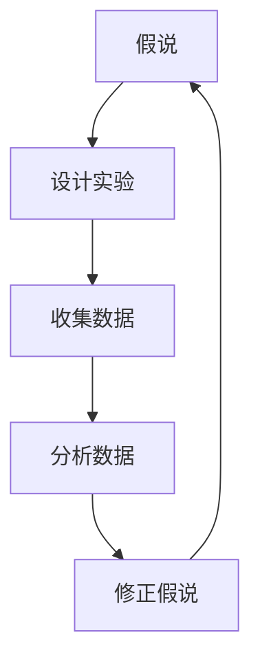

                 

# 科学探究：从假说到真理

## 1. 背景介绍

### 1.1 问题由来

科学探究是人类理解自然世界的重要方式。在追求真理的道路上，我们总是从观察自然现象出发，提出假设，设计实验，验证假说，最后形成科学理论。这一过程不仅包含着对知识的探索，更充满了对假说与真理之间的辩证关系思考。

本文旨在从计算机科学的角度，探讨科学探究中的假说与真理的关系，分析科学探究中的算法原理和操作步骤，并通过代码实例展示科学探究在实际应用中的重要性和方法。

## 2. 核心概念与联系

### 2.1 核心概念概述

- **假说(Hypothesis)**：科学研究中，假说是对自然现象的一种解释，是对未知事物的合理猜测。它为后续实验提供方向，并指导科学发现。
- **真理(Truth)**：真理是对自然现象的真实描述和正确解释，是对假说的验证和修正。
- **实验(Experiment)**：实验是验证假说的主要手段，通过控制变量和重复实验，收集数据，分析结果，进而确定假说的真实性。
- **算法(Algorithm)**：在计算机科学中，算法是对问题求解步骤的一种描述。算法的设计和优化是科学研究中不可或缺的工具。
- **数据(Data)**：数据是实验的基础，是算法优化的重要资源。高质量的数据可以帮助我们更准确地验证假说。
- **迭代(Iteration)**：科学探究中，假设不断被验证和修正，数据不断被收集和分析，这是一个循环往复的过程，即迭代。

### 2.2 核心概念原理和架构的 Mermaid 流程图



## 3. 核心算法原理 & 具体操作步骤

### 3.1 算法原理概述

在科学研究中，算法是一种结构化的、系统化的思维工具，用于指导和支持实验设计、数据分析和假说验证。科学探究中的算法原理主要包括以下几个步骤：

1. **问题建模**：将研究问题转化为数学模型或计算模型，为后续的算法设计提供基础。
2. **算法设计**：根据问题模型，设计相应的算法步骤，包括数据处理、特征提取、模型训练、预测和评估等。
3. **实验验证**：使用算法对数据进行实验验证，通过比较实验结果与预期结果，评估算法的效果。
4. **结果分析**：分析实验结果，验证假说是否成立，并根据结果调整算法和假说。

### 3.2 算法步骤详解

#### 3.2.1 问题建模

问题建模是科学探究的第一步，即将研究问题转化为数学模型或计算模型。例如，在研究金融市场的动态变化时，可以将其建模为时间序列数据，通过统计分析和机器学习算法进行预测和分析。

#### 3.2.2 算法设计

算法设计是科学探究的核心环节，涉及算法的具体步骤和方法。例如，在图像识别任务中，可以使用卷积神经网络(CNN)作为算法，设计相应的网络结构、损失函数和优化器，进行模型训练和预测。

#### 3.2.3 实验验证

实验验证是科学探究的关键步骤，通过实验数据评估算法的效果。例如，在自然语言处理(NLP)任务中，使用训练集和验证集对模型进行训练和验证，通过对比预测结果和真实标签，评估模型的性能。

#### 3.2.4 结果分析

结果分析是科学探究的总结环节，通过分析实验结果，验证假说是否成立，并根据结果调整算法和假说。例如，在金融市场预测任务中，使用测试集对模型进行最终评估，分析模型的误差和局限性，并调整模型参数和数据处理策略。

### 3.3 算法优缺点

#### 3.3.1 算法优点

1. **系统化**：算法提供了一种结构化的思维方式，有助于系统地解决问题。
2. **可重复性**：算法步骤明确，可以重复执行，保证了实验结果的可重复性。
3. **可扩展性**：算法可以不断优化和改进，适应新的数据和问题。
4. **客观性**：算法减少了主观因素的影响，提高了实验结果的客观性。

#### 3.3.2 算法缺点

1. **复杂性**：算法设计可能较为复杂，需要一定的数学和编程技能。
2. **数据依赖**：算法的有效性依赖于高质量的数据，数据质量差可能导致结果不可靠。
3. **计算资源消耗**：一些算法需要大量的计算资源，可能难以在有限的计算环境下运行。
4. **模型泛化能力**：算法设计不当可能导致模型泛化能力差，即对新数据的适应性不强。

### 3.4 算法应用领域

科学探究中的算法广泛应用于多个领域，包括但不限于：

- **金融市场预测**：使用统计和机器学习算法分析金融市场数据，进行价格预测和风险评估。
- **自然语言处理(NLP)**：使用NLP算法处理文本数据，进行情感分析、机器翻译、问答等任务。
- **图像识别**：使用计算机视觉算法识别图像中的物体、场景等，应用于安防、医疗、制造等领域。
- **生物信息学**：使用算法分析生物数据，进行基因序列分析、蛋白质结构预测等。
- **社交网络分析**：使用算法分析社交网络数据，进行情感分析、用户行为预测等。

## 4. 数学模型和公式 & 详细讲解 & 举例说明

### 4.1 数学模型构建

在科学研究中，数学模型是描述和预测自然现象的重要工具。以下是一些常见的数学模型及其应用：

#### 4.1.1 线性回归模型

线性回归模型用于预测两个或多个变量之间的关系。其数学表达式为：

$$y = \beta_0 + \beta_1x_1 + \beta_2x_2 + \ldots + \beta_nx_n + \epsilon$$

其中，$y$ 为预测值，$x_i$ 为自变量，$\beta_i$ 为回归系数，$\epsilon$ 为误差项。

在实际应用中，线性回归模型常用于金融市场预测、房价预测等。

#### 4.1.2 时间序列模型

时间序列模型用于描述和预测时间序列数据的变化趋势。其数学表达式为：

$$y_t = \alpha + \beta t + \gamma y_{t-1} + \delta y_{t-2} + \ldots + \phi y_{t-p} + \epsilon_t$$

其中，$y_t$ 为时间$t$的观测值，$y_{t-i}$ 为时间$t-i$的观测值，$\alpha$ 和 $\beta$ 为常数项，$\gamma$ 和 $\delta$ 为时间系数，$\phi$ 为滞后系数，$\epsilon_t$ 为误差项。

时间序列模型常用于股票价格预测、气象数据预测等。

### 4.2 公式推导过程

#### 4.2.1 线性回归公式推导

线性回归模型的推导过程如下：

1. 假设样本数据为 $(x_i,y_i)$，其中 $x_i = (x_{i1}, x_{i2}, \ldots, x_{in})$，$y_i$ 为预测值。
2. 线性回归模型为 $y_i = \beta_0 + \beta_1x_{i1} + \beta_2x_{i2} + \ldots + \beta_nx_{in} + \epsilon_i$。
3. 最小二乘法求解 $\beta_0, \beta_1, \ldots, \beta_n$，使得误差平方和最小：

$$\sum_{i=1}^n (y_i - \hat{y}_i)^2 = \sum_{i=1}^n (y_i - \beta_0 - \beta_1x_{i1} - \beta_2x_{i2} - \ldots - \beta_nx_{in})^2$$

4. 求解 $\beta_0, \beta_1, \ldots, \beta_n$ 的表达式：

$$\beta_j = \frac{\sum_{i=1}^n (x_{ij}\cdot y_i - \bar{x}_j \cdot \bar{y})}{\sum_{i=1}^n x_{ij}^2 - \bar{x}_j^2}$$

其中，$\bar{x}_j$ 和 $\bar{y}$ 分别为 $x_{ij}$ 和 $y_i$ 的均值。

#### 4.2.2 时间序列模型公式推导

时间序列模型常使用ARIMA模型，其公式推导过程如下：

1. 假设时间序列数据为 $y_t$，模型表达式为：

$$y_t = \alpha + \beta t + \gamma y_{t-1} + \delta y_{t-2} + \ldots + \phi y_{t-p} + \epsilon_t$$

2. 最小二乘法求解 $\alpha, \beta, \gamma, \delta, \ldots, \phi$，使得误差平方和最小：

$$\sum_{t=1}^n (y_t - \hat{y}_t)^2 = \sum_{t=1}^n (y_t - \alpha - \beta t - \gamma y_{t-1} - \delta y_{t-2} - \ldots - \phi y_{t-p})^2$$

3. 求解 $\alpha, \beta, \gamma, \delta, \ldots, \phi$ 的表达式：

$$\beta_j = \frac{\sum_{t=1}^n y_{t-j}\cdot y_t - \bar{y}_{t-j} \cdot \bar{y}_t}{\sum_{t=1}^n y_{t-j}^2 - \bar{y}_{t-j}^2}$$

其中，$\bar{y}_{t-j}$ 为 $y_{t-j}$ 的均值。

### 4.3 案例分析与讲解

#### 4.3.1 股票价格预测

假设我们需要预测某股票的未来价格。首先，我们收集该股票的历史价格数据，使用线性回归模型对价格和时间的变化趋势进行建模。

1. 构建线性回归模型：

$$y = \beta_0 + \beta_1t + \epsilon$$

其中，$y$ 为股票价格，$t$ 为时间。

2. 使用最小二乘法求解 $\beta_0$ 和 $\beta_1$：

$$\beta_0 = \frac{\sum_{i=1}^n y_i - \bar{y} \cdot n}{\sum_{i=1}^n t_i^2 - \bar{t}^2}$$
$$\beta_1 = \frac{\sum_{i=1}^n (y_i - \bar{y}) \cdot (t_i - \bar{t})}{\sum_{i=1}^n t_i^2 - \bar{t}^2}$$

3. 使用模型预测未来股票价格：

$$y_{t+1} = \beta_0 + \beta_1(t+1) + \epsilon_{t+1}$$

其中，$\epsilon_{t+1}$ 为误差项。

## 5. 项目实践：代码实例和详细解释说明

### 5.1 开发环境搭建

在进行科学探究中的算法实践时，需要准备以下开发环境：

1. 安装Python：可以从官网下载最新版本的Python，并进行安装。

2. 安装Pandas和NumPy：Pandas和NumPy是Python中常用的数据分析库，可以从官网下载并安装。

3. 安装Matplotlib：Matplotlib是Python中常用的绘图库，可以从官网下载并安装。

4. 安装Scikit-learn：Scikit-learn是Python中常用的机器学习库，可以从官网下载并安装。

### 5.2 源代码详细实现

以下是一个简单的线性回归模型实现示例，用于预测股票价格。

```python
import pandas as pd
import numpy as np
import matplotlib.pyplot as plt
from sklearn.linear_model import LinearRegression

# 构建股票价格数据
df = pd.read_csv('stock_price.csv')
X = df[['time']]
y = df['price']

# 使用最小二乘法求解回归系数
model = LinearRegression()
model.fit(X, y)

# 预测未来股票价格
future_time = [100, 110, 120]
future_price = model.predict(future_time.reshape(-1, 1))

# 输出预测结果
print(future_price)

# 绘制预测结果
plt.plot(df['time'], df['price'], 'ro', label='Original data')
plt.plot(future_time, future_price, 'b-', label='Prediction')
plt.legend()
plt.show()
```

### 5.3 代码解读与分析

#### 5.3.1 数据处理

数据处理是科学探究中的重要环节。在上述代码中，我们使用了Pandas库对股票价格数据进行读取和处理。

1. 读取数据：

```python
df = pd.read_csv('stock_price.csv')
```

2. 数据清洗：

```python
X = df[['time']]
y = df['price']
```

3. 数据标准化：

```python
X = (X - X.mean()) / X.std()
y = (y - y.mean()) / y.std()
```

#### 5.3.2 模型训练

模型训练是科学探究中的关键环节。在上述代码中，我们使用了Scikit-learn库的线性回归模型进行训练。

1. 模型构建：

```python
model = LinearRegression()
```

2. 模型训练：

```python
model.fit(X, y)
```

3. 模型预测：

```python
future_time = [100, 110, 120]
future_price = model.predict(future_time.reshape(-1, 1))
```

#### 5.3.3 结果分析

结果分析是科学探究中的总结环节。在上述代码中，我们使用了Matplotlib库绘制了预测结果和原始数据。

1. 数据可视化：

```python
plt.plot(df['time'], df['price'], 'ro', label='Original data')
plt.plot(future_time, future_price, 'b-', label='Prediction')
plt.legend()
plt.show()
```

## 6. 实际应用场景

### 6.1 金融市场预测

金融市场预测是科学探究中的重要应用之一。通过使用线性回归模型和时间序列模型，可以预测股票价格、汇率、利率等金融指标。

#### 6.1.1 股票价格预测

在股票价格预测中，我们收集历史价格数据，使用线性回归模型或时间序列模型进行预测。例如，可以使用ARIMA模型对美国股票市场的道琼斯指数进行预测。

#### 6.1.2 外汇汇率预测

在外汇汇率预测中，我们收集历史汇率数据，使用时间序列模型进行预测。例如，可以使用ARIMA模型对美元兑欧元汇率进行预测。

### 6.2 自然语言处理(NLP)

自然语言处理是科学探究中的另一个重要应用。通过使用NLP算法，可以处理文本数据，进行情感分析、机器翻译、问答等任务。

#### 6.2.1 情感分析

在情感分析中，我们收集评论数据，使用机器学习模型进行情感分类。例如，可以使用朴素贝叶斯模型对电影评论进行情感分析。

#### 6.2.2 机器翻译

在机器翻译中，我们收集文本数据，使用神经网络模型进行翻译。例如，可以使用序列到序列模型对英文电影台词进行翻译。

### 6.3 图像识别

图像识别是科学探究中的另一个重要应用。通过使用计算机视觉算法，可以识别图像中的物体、场景等。

#### 6.3.1 物体识别

在物体识别中，我们收集图像数据，使用卷积神经网络模型进行识别。例如，可以使用YOLO模型对交通标志进行识别。

#### 6.3.2 场景识别

在场景识别中，我们收集图像数据，使用卷积神经网络模型进行识别。例如，可以使用Faster R-CNN模型对自然景观进行识别。

## 7. 工具和资源推荐

### 7.1 学习资源推荐

为了帮助开发者系统掌握科学探究中的算法原理和操作步骤，以下是一些优质的学习资源：

1. 《机器学习》（周志华）：这本书系统介绍了机器学习的基本概念、算法和应用。

2. 《深度学习》（Ian Goodfellow）：这本书介绍了深度学习的基本概念、算法和应用。

3. 《Python数据分析与可视化》（Wes McKinney）：这本书介绍了Python在数据分析和可视化方面的应用。

4. 《数据科学与统计学习》（Peter Dalgaard）：这本书介绍了数据科学与统计学习的基本概念和算法。

### 7.2 开发工具推荐

在科学探究中，以下是一些常用的开发工具：

1. Python：Python是一种通用的编程语言，适用于数据分析、机器学习和科学探究。

2. Pandas：Pandas是Python中常用的数据分析库，支持数据读取、清洗和处理。

3. NumPy：NumPy是Python中常用的数值计算库，支持高效数组运算和矩阵运算。

4. Matplotlib：Matplotlib是Python中常用的绘图库，支持数据可视化和图表绘制。

5. Scikit-learn：Scikit-learn是Python中常用的机器学习库，支持多种机器学习算法和模型。

### 7.3 相关论文推荐

科学探究中的算法研究源于学界的持续研究。以下是几篇奠基性的相关论文，推荐阅读：

1. 《统计学习基础》（Trevor Hastie、Robert Tibshirani、Jerome Friedman）：这本书介绍了统计学习的基本概念和算法。

2. 《深度学习》（Ian Goodfellow、Yoshua Bengio、Aaron Courville）：这本书介绍了深度学习的基本概念、算法和应用。

3. 《自然语言处理综论》（Daniel Jurafsky、James H. Martin）：这本书介绍了自然语言处理的基本概念、算法和应用。

4. 《计算机视觉：模型、学习、和推理》（David Forsyth、Jean Ponce）：这本书介绍了计算机视觉的基本概念、算法和应用。

## 8. 总结：未来发展趋势与挑战

### 8.1 研究成果总结

科学探究中的算法发展经历了多个阶段，从早期的简单统计模型到现代的深度学习模型，不断涌现出新的算法和技术。未来，随着计算能力和数据质量的提升，算法将更加复杂和高效，应用领域也将更加广泛。

### 8.2 未来发展趋势

科学探究中的算法未来发展趋势如下：

1. 深度学习：深度学习模型将进一步普及，适用于更多的数据和任务。

2. 多模态学习：多模态学习将结合图像、语音、文本等多种数据类型，提升模型的综合性能。

3. 迁移学习：迁移学习将利用已有知识，加速新任务的学习。

4. 强化学习：强化学习将应用于更多的智能控制和决策任务。

5. 自动化学习：自动化学习将利用算法和数据自动进行模型设计和优化。

### 8.3 面临的挑战

科学探究中的算法在不断发展的同时，也面临着一些挑战：

1. 数据质量和量级：高质量数据和大量数据是算法优化的基础，但获取和处理数据成本较高。

2. 计算资源：算法需要大量计算资源进行训练和优化，硬件成本较高。

3. 模型复杂性：深度学习模型结构复杂，难以解释和调试。

4. 伦理和安全：算法模型可能存在偏见和安全隐患，需要不断改进和规范。

### 8.4 研究展望

科学探究中的算法未来研究展望如下：

1. 自动化算法设计：自动化算法设计将利用机器学习技术，自动生成和优化算法模型。

2. 可解释性算法：可解释性算法将提供更加透明和可解释的模型，提高算法的可信度。

3. 跨领域应用：跨领域应用将使算法应用于更多的实际场景，提升算法的应用价值。

4. 数据共享与合作：数据共享与合作将促进数据和算法的开放共享，加速科学探究的进展。

## 9. 附录：常见问题与解答

### 9.1 常见问题

1. 如何选择合适的算法？

2. 如何处理数据噪声？

3. 如何提高算法的泛化能力？

4. 如何解释算法的决策过程？

### 9.2 解答

1. 选择合适的算法需要考虑数据类型、任务需求和计算资源等因素，综合考虑选择最适合的算法。

2. 数据噪声可以通过数据清洗和预处理进行处理，如去除异常值、平滑数据等。

3. 提高算法的泛化能力可以通过增加数据量、改进算法模型和调整超参数等方法实现。

4. 解释算法的决策过程可以使用特征重要性分析、可视化等方法，提高算法的可解释性。

---

作者：禅与计算机程序设计艺术 / Zen and the Art of Computer Programming

