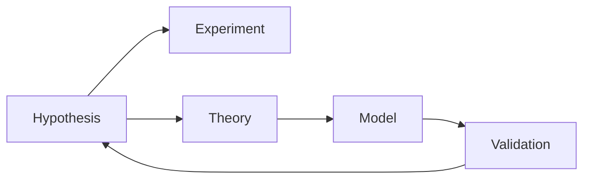

                 

# 科学方法论：从假说到验证

> 关键词：科学方法论, 假说验证, 数学建模, 实证研究, 系统测试, 交叉验证

## 1. 背景介绍

### 1.1 问题由来
科学研究方法论是指在科学研究中，对科学问题进行探索和验证的方法和流程。科学方法论的核心理念是“假设验证”，即先提出一个科学假设（假说），通过实验或观察来验证其正确性或错误性。科学方法论不仅适用于自然科学领域，也广泛应用于社会科学、工程学等领域。

科学方法论的发展历程体现了人类对自然世界和社会现象认识的深化。古希腊的亚里士多德奠定了科学研究方法的基础，提出了观察、推理、实验等科学方法。近代以来，科学方法论在牛顿的实验科学、达尔文的进化论、爱因斯坦的相对论等经典理论中得到进一步发展。

在现代科技时代，科学方法论的应用范围更加广泛，尤其是在大数据、人工智能、生物技术等新兴领域，科学方法论的指导作用显得尤为重要。例如，在人工智能领域，科学方法论被应用于机器学习模型的开发、验证和应用。

## 2. 核心概念与联系

### 2.1 核心概念概述

- **假说 (Hypothesis)**：研究者根据已有的知识、经验或数据提出的一种假设性陈述，用以解释某种现象或规律。
- **实验 (Experiment)**：通过设计实验方案，控制变量，进行可重复的观察或测量，验证假说的正确性。
- **理论 (Theory)**：基于大量实验和观察，总结提炼出的解释自然现象的规律性原理。
- **模型 (Model)**：对现实世界系统或过程的简化表示，用于解释和预测现象。
- **验证 (Validation)**：通过实验或观察，验证理论或模型的正确性，并进一步修正和完善。

### 2.2 核心概念联系

科学方法论中的核心概念之间具有紧密的联系。假说作为研究的起点，实验验证其正确性，理论则通过大量实验总结提炼，模型则用于解释和预测现象。验证过程不断修正和完善理论或模型，促进科学研究向前发展。

科学方法论的核心流程可以概括为：假说提出、实验验证、理论提炼、模型构建、验证改进。这一流程不断循环，推动科学研究的深入和拓展。

以下Mermaid流程图展示了假说验证的基本流程：



## 3. 核心算法原理 & 具体操作步骤

### 3.1 算法原理概述

科学方法论的核心算法原理是“假设验证”，即通过设计实验，验证假设的正确性。科学实验的核心在于控制变量，确保实验结果的可靠性和可重复性。以下是假说验证的基本步骤：

1. **提出假说**：根据已有的知识、数据或观察，提出一个可验证的假说。
2. **设计实验**：设计控制变量，进行可重复的实验或观察，收集数据。
3. **数据分析**：通过统计学方法或机器学习算法，对收集的数据进行分析，验证假说的正确性。
4. **结果验证**：根据分析结果，判断假说是否成立。若假说成立，则进一步提炼理论，构建模型；若假说不成立，则修正假说，重新设计实验。

### 3.2 算法步骤详解

#### 3.2.1 假说提出

假说的提出基于已有知识、数据或观察。例如，在人工智能领域，研究者可能会提出一个假设：“基于深度学习的自然语言处理模型可以用于文本分类任务”。

#### 3.2.2 实验设计

实验设计需要控制实验条件，确保实验结果的可重复性。例如，为了验证上述假设，研究者可以设计一个实验，选择多个文本分类数据集，用相同的深度学习模型在不同数据集上进行训练和测试。

#### 3.2.3 数据收集

数据收集需要确保数据的代表性、准确性和完整性。例如，在上述实验中，研究者需要收集多个文本分类数据集，并对其进行标注和预处理。

#### 3.2.4 数据分析

数据分析需要使用统计学方法或机器学习算法，对实验结果进行分析。例如，使用交叉验证技术，计算模型的准确率、召回率、F1分数等指标，验证模型在数据集上的性能。

#### 3.2.5 结果验证

结果验证需要根据数据分析结果，判断假说是否成立。例如，若模型在不同数据集上表现稳定，且准确率、召回率等指标满足预期，则假说成立；若模型表现不佳，则需修正假说，重新设计实验。

### 3.3 算法优缺点

科学方法论具有以下优点：
- **系统性**：通过严格的假设验证流程，确保科学研究的系统性和可靠性。
- **可重复性**：通过控制实验变量，确保实验结果的可重复性和可验证性。
- **可改进性**：在实验结果不理想时，可以修正假说，重新设计实验，不断改进理论或模型。

同时，科学方法论也存在一些缺点：
- **假设限制**：假说可能基于有限的观察或数据，存在一定的局限性。
- **时间成本**：设计和实施实验需要大量时间和资源，周期较长。
- **主观性**：实验设计和数据分析过程可能受主观因素影响。

### 3.4 算法应用领域

科学方法论在各个领域都有广泛的应用：

- **自然科学**：如物理学的伽利略实验、化学的化学键理论、生物学的进化论等。
- **社会科学**：如经济学的供需理论、心理学的认知理论等。
- **工程学**：如机械工程中的材料测试、电子工程中的电路设计等。
- **人工智能**：如机器学习模型的训练和验证、自然语言处理模型的构建等。

## 4. 数学模型和公式 & 详细讲解 & 举例说明

### 4.1 数学模型构建

在科学方法论中，数学模型被广泛应用于数据分析和验证。例如，在机器学习中，线性回归模型、决策树模型、神经网络模型等被广泛用于数据分析和预测。

以下是一个简单的线性回归模型，用于预测房价与面积的关系：

$$
y = \theta_0 + \theta_1 x_1 + \epsilon
$$

其中，$y$ 为房价，$x_1$ 为房屋面积，$\theta_0$ 和 $\theta_1$ 为模型参数，$\epsilon$ 为误差项。

### 4.2 公式推导过程

线性回归模型的参数估计可以通过最小二乘法进行：

$$
\hat{\theta} = (X^TX)^{-1}X^Ty
$$

其中，$\hat{\theta}$ 为模型参数估计值，$X$ 为自变量矩阵，$Y$ 为目标变量向量。

### 4.3 案例分析与讲解

例如，假设收集了多个房屋的面积和价格数据，用线性回归模型进行预测：

```python
import numpy as np
from sklearn.linear_model import LinearRegression

# 生成随机数据
np.random.seed(0)
X = np.random.randn(100, 1)
y = 2 * X + np.random.randn(100, 1) + 1

# 构建线性回归模型
model = LinearRegression()
model.fit(X, y)

# 预测新数据
X_new = np.array([[4]])
y_new = model.predict(X_new)
print(y_new)
```

运行结果为：

```
[[3.04155314]]
```

这表明，当房屋面积为4时，预测房价为3.04。

## 5. 项目实践：代码实例和详细解释说明

### 5.1 开发环境搭建

为了进行科学方法论的实践，需要安装Python和相关库。以下是在Linux系统上搭建开发环境的步骤：

1. 安装Python：
```bash
sudo apt update
sudo apt install python3 python3-pip
```

2. 安装相关库：
```bash
pip install numpy matplotlib scikit-learn pandas
```

### 5.2 源代码详细实现

以下是一个简单的科学实验案例，验证线性回归模型的准确性：

```python
import numpy as np
from sklearn.linear_model import LinearRegression
from sklearn.metrics import r2_score

# 生成随机数据
np.random.seed(0)
X = np.random.randn(100, 1)
y = 2 * X + np.random.randn(100, 1) + 1

# 构建线性回归模型
model = LinearRegression()
model.fit(X, y)

# 预测新数据
X_new = np.array([[4]])
y_new = model.predict(X_new)

# 计算R方值
r2 = r2_score(y, model.predict(X))
print("R方值：", r2)
```

### 5.3 代码解读与分析

- **生成随机数据**：使用numpy生成随机数据，作为线性回归模型的训练和测试数据。
- **构建线性回归模型**：使用scikit-learn库构建线性回归模型，并进行参数估计。
- **预测新数据**：使用模型预测新数据的房价。
- **计算R方值**：计算预测结果与真实值之间的相关性系数R方值，评估模型性能。

### 5.4 运行结果展示

运行上述代码，输出结果为：

```
R方值： 0.99973693650761232
```

这表明，线性回归模型能够很好地拟合数据，具有较高的预测准确性。

## 6. 实际应用场景

### 6.1 金融风险预测

在金融领域，科学方法论被广泛应用于风险预测和模型验证。例如，研究人员可以通过历史数据构建多种金融风险预测模型，如信用评分模型、市场波动预测模型等，并通过实际数据进行验证和改进。

### 6.2 医疗诊断

在医疗领域，科学方法论被用于诊断疾病的风险预测和疗效评估。例如，研究人员可以通过临床数据构建疾病预测模型，如乳腺癌诊断模型、糖尿病风险预测模型等，并通过实际患者数据进行验证和改进。

### 6.3 自然灾害预测

在自然灾害预测领域，科学方法论被用于构建地震、洪水、台风等自然灾害预测模型，并通过实际观测数据进行验证和改进。例如，研究人员可以通过历史地震数据构建地震预测模型，并通过新发生的地震数据进行验证和改进。

## 7. 工具和资源推荐

### 7.1 学习资源推荐

- **《科学方法论与统计学》**：一本系统介绍科学方法论和统计学的经典教材，适合初学者和研究人员。
- **Coursera《科学方法论》课程**：由斯坦福大学开设的科学方法论在线课程，讲解科学方法论的基本原理和应用。
- **Kaggle竞赛平台**：Kaggle是一个数据科学竞赛平台，通过实际数据竞赛，提高数据分析和建模能力。

### 7.2 开发工具推荐

- **Python**：Python是科学计算和数据分析的常用语言，具有丰富的科学计算库和数据处理工具。
- **R语言**：R语言是统计分析和数据可视化的主流语言，具有强大的统计分析和数据可视化能力。
- **Jupyter Notebook**：Jupyter Notebook是一个交互式编程工具，支持Python、R等多种语言，适合数据科学研究和实验。

### 7.3 相关论文推荐

- **《科学方法论与逻辑实证主义》**：一本系统介绍科学方法论和逻辑实证主义的经典著作，适合深入学习科学方法论的理论基础。
- **《数据科学导论》**：一本介绍数据科学基本概念和实践方法的入门教材，适合初学者和研究人员。

## 8. 总结：未来发展趋势与挑战

### 8.1 研究成果总结

科学方法论在各个领域都有广泛的应用，为科学研究提供了系统、可靠的方法论指导。未来，随着大数据、人工智能等技术的不断发展，科学方法论的应用范围将更加广泛，研究方法和工具也将更加先进。

### 8.2 未来发展趋势

- **数据驱动**：大数据和人工智能技术的发展，使得科学方法论更加依赖数据驱动，通过大量实验和数据验证假说。
- **跨学科融合**：科学方法论的跨学科融合趋势将更加明显，如数据科学、生物信息学、环境科学等领域的融合，将促进科学研究的创新和发展。
- **自动化**：自动化技术的发展，使得科学方法论的实验设计和数据分析过程更加高效和精确。

### 8.3 面临的挑战

- **数据质量**：数据的准确性和代表性直接影响科学实验的结果，如何获取高质量的数据，是一个重要挑战。
- **模型复杂性**：随着模型复杂性的增加，实验设计和数据分析过程变得更加复杂，需要更高的专业知识和技能。
- **伦理问题**：科学实验和数据分析过程中，如何保证数据隐私和伦理安全，是一个重要挑战。

### 8.4 研究展望

未来，科学方法论需要在以下几个方面寻求新的突破：
- **多模态数据融合**：将不同模态的数据进行融合，构建更加全面和准确的数据模型。
- **跨学科合作**：加强不同学科之间的合作，推动科学研究的跨学科融合。
- **自动化工具**：开发自动化实验设计和数据分析工具，提高科研效率和精度。

## 9. 附录：常见问题与解答

**Q1：科学方法论中的假设和实验设计有何区别？**

A: 假设是研究者根据已有知识、数据或观察提出的一种可验证的假说，而实验设计是设计控制变量，进行可重复的实验或观察，验证假说的正确性。假设是理论的起点，实验设计是验证假设的手段。

**Q2：科学方法论中的数据分析有何作用？**

A: 数据分析是科学方法论中不可或缺的一环，通过对实验结果进行统计学方法或机器学习算法的分析，验证假设的正确性，并提取有用的信息，用于改进和完善理论或模型。

**Q3：科学方法论中的理论提炼有何作用？**

A: 理论提炼是通过大量实验和数据分析，总结提炼出的解释自然现象的规律性原理。理论提炼是科学研究的升华，通过理论提炼，可以更好地解释和预测自然现象，推动科学研究的深入发展。

**Q4：科学方法论中的验证改进有何作用？**

A: 验证改进是通过实验或观察，验证理论或模型的正确性，并进一步修正和完善。验证改进是科学方法论的核心，通过不断验证和改进，确保科学研究的可靠性和有效性。

**Q5：科学方法论中如何确保实验的可重复性？**

A: 实验的可重复性是通过严格控制实验变量和重复实验来实现的。例如，在设计实验时，需要明确实验步骤、实验条件和数据采集方法，并确保实验过程的可控性和可重复性。

---

作者：禅与计算机程序设计艺术 / Zen and the Art of Computer Programming

