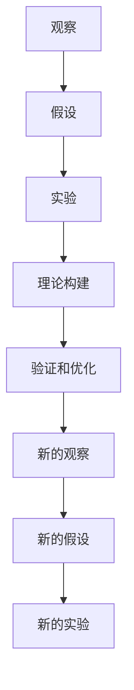

                 

## 1. 背景介绍

### 1.1 问题由来
科学的进步离不开对自然现象的观察和实验。自文艺复兴以来，科学家们便开始将科学研究的方法化，逐渐形成了科学方法论。从哥白尼的日心说，到达尔文的进化论，科学的发展离不开系统的观察、假设、验证和总结。而现代科学方法论的四大支柱——观察、假设、实验和理论构建——更是深入人心。

在计算机科学的早期，程序设计往往依赖于经验和方法论，缺乏严格的科学理论指导。而随着计算机科学的发展，科学方法论在软件工程、数据科学、人工智能等领域的应用日益广泛，成为推动技术进步的关键。特别是在人工智能领域，科学方法论的应用更为关键，它不仅提升了技术的可靠性，也加速了技术的创新和迭代。

### 1.2 问题核心关键点
科学方法论在人工智能领域的应用，主要体现在以下三个方面：

- **观察**：通过对数据和问题的观察，发现潜在的规律和模式。如通过大数据分析，发现用户的偏好、市场的趋势等。
- **假设**：根据观察结果，提出可能的解释和假设，如通过机器学习模型预测用户行为，进行推荐系统的设计。
- **实验**：设计实验，验证假设的正确性，如通过A/B测试，评估推荐算法的表现。

科学方法论不仅适用于人工智能研究，还适用于技术应用开发。在软件开发中，科学方法论有助于提升代码质量和系统稳定性；在数据科学中，科学方法论有助于优化算法和提升数据处理能力。总之，科学方法论已经成为现代科技创新的重要驱动力。

### 1.3 问题研究意义
科学方法论在人工智能领域的应用，对于推动技术进步、提升系统可靠性、加速创新迭代等方面具有重要意义：

- **提升技术可靠性**：科学方法论通过系统的观察和实验，验证假设的正确性，从而提升技术实施的可靠性。
- **加速技术创新**：科学方法论提供了一套系统的方法，引导研究方向和优化策略，加速技术进步和应用。
- **优化系统稳定性**：通过系统的实验验证，发现和解决技术问题，提升系统的稳定性和可靠性。
- **增强技术理解**：科学方法论帮助开发者更好地理解技术原理和应用场景，提升技术应用的深度和广度。

## 2. 核心概念与联系

### 2.1 核心概念概述

为了更好地理解科学方法论在人工智能中的应用，本节将介绍几个密切相关的核心概念：

- **观察**：指通过对现实世界或数据集进行系统的记录和分析，发现潜在的规律和模式。在人工智能中，观察常常通过数据分析、用户行为记录等方式实现。
- **假设**：指根据观察结果提出的可能的解释和预测，如基于历史数据构建用户行为模型。
- **实验**：指通过设计实验验证假设的正确性，如通过A/B测试评估算法性能。
- **理论构建**：指将观察和实验结果进行系统总结，构建科学理论和方法。
- **验证和优化**：指通过进一步的观察和实验，验证理论的正确性，并对其进行调整优化。

这些核心概念之间通过以下Mermaid流程图进行联系：



这个流程图展示了科学方法论的各个环节及其相互关系：

1. 通过观察获取数据，提出假设。
2. 设计实验，验证假设的正确性。
3. 构建理论，进行总结和提升。
4. 不断进行验证和优化，形成新的假设和观察。

## 3. 核心算法原理 & 具体操作步骤

### 3.1 算法原理概述

科学方法论在人工智能中的应用，主要体现在数据的观察、假设的提出、实验的设计和理论的构建等方面。其核心思想是通过系统的观察和实验，验证假设的正确性，并构建科学的理论和方法。

在人工智能中，数据观察和假设提出通常涉及数据预处理、特征工程和模型选择等步骤。实验设计则包括模型训练、参数调优和评估指标选择等。理论构建和验证则需要进一步的观察和实验，以提升模型的稳定性和可靠性。

### 3.2 算法步骤详解

以下我们将详细介绍科学方法论在人工智能中的操作步骤：

**Step 1: 数据收集与预处理**
- 收集有代表性的数据集，确保数据质量。
- 对数据进行清洗和预处理，去除噪声和异常值。
- 对数据进行特征工程，提取关键特征，构建特征向量。

**Step 2: 假设提出与模型选择**
- 根据观察结果提出可能的假设，如用户行为预测、推荐系统设计等。
- 选择适当的模型进行假设验证，如线性回归、决策树、深度学习等。
- 构建初步模型，并进行参数调优。

**Step 3: 实验设计**
- 设计实验验证模型性能，如A/B测试、交叉验证等。
- 选择评估指标，如准确率、召回率、F1值等。
- 进行实验，收集实验结果，进行分析。

**Step 4: 理论构建与验证**
- 将实验结果进行系统总结，构建科学的理论和方法。
- 进行理论验证，如通过进一步的观察和实验，验证理论的正确性。
- 对理论进行调整优化，提升模型的稳定性和可靠性。

**Step 5: 部署与优化**
- 将理论应用于实际场景，进行模型部署。
- 收集用户反馈和实际数据，进行系统优化。
- 持续进行观察和实验，不断迭代和优化。

### 3.3 算法优缺点

科学方法论在人工智能中的应用，具有以下优点：

- **系统性和可靠性**：通过系统的观察和实验，验证假设的正确性，提升技术实施的可靠性。
- **数据驱动**：基于数据进行决策，避免主观偏见，提高模型的客观性和准确性。
- **持续优化**：通过持续的观察和实验，不断优化模型性能，提升系统的稳定性和可靠性。
- **创新驱动**：系统的方法论引导研究方向和优化策略，加速技术进步和应用。

同时，该方法也存在一定的局限性：

- **数据依赖**：数据质量直接影响实验结果，数据不足或质量不佳会导致实验结果不准确。
- **模型复杂度**：复杂的模型需要大量的计算资源和时间，可能不适合小规模问题。
- **假设局限性**：基于有限的数据和观察提出的假设，可能存在局限性，难以覆盖所有场景。
- **实验成本高**：高精度的实验设计需要大量的人力和资源，可能不适合快速迭代场景。
- **结果解释性差**：复杂的模型和大量的数据，使得实验结果的解释性差，难以理解和调试。

尽管存在这些局限性，但就目前而言，科学方法论在人工智能中的应用依然是最主流和有效的范式之一。未来相关研究的重点在于如何进一步降低实验成本，提高数据利用效率，优化模型复杂度，增强结果解释性，同时兼顾模型稳定性和创新性等因素。

### 3.4 算法应用领域

科学方法论在人工智能中的应用，已经在多个领域取得了显著成果，包括但不限于以下领域：

- **计算机视觉**：通过数据观察和实验，构建深度学习模型进行图像识别、分类和生成。
- **自然语言处理**：通过文本分析，构建语言模型进行情感分析、问答系统和机器翻译。
- **推荐系统**：通过用户行为数据和实验结果，构建推荐算法进行个性化推荐。
- **金融分析**：通过市场数据和实验结果，构建金融模型进行风险评估和投资决策。
- **医疗健康**：通过患者数据和实验结果，构建医疗模型进行疾病预测和治疗方案推荐。

除了这些经典领域，科学方法论在更多新兴领域的应用也在不断涌现，如智能制造、智慧城市、智能交通等，为各行各业带来了新的技术突破。

## 4. 数学模型和公式 & 详细讲解  
### 4.1 数学模型构建

本节将使用数学语言对科学方法论在人工智能中的应用进行更加严格的刻画。

假设我们有一组观测数据 $X=\{x_1, x_2, ..., x_n\}$，每个数据点 $x_i$ 包含多个特征 $x_i^1, x_i^2, ..., x_i^m$。我们的目标是构建一个模型 $M$，用于预测某个输出变量 $y$。

定义模型 $M$ 在输入 $x$ 上的预测结果为 $y^*$，则模型的预测误差为 $e = y - y^*$。我们的目标是最小化预测误差，即：

$$
\min_{M} E(e)
$$

其中 $E(e)$ 为预测误差的期望值。

在实践中，我们通常使用基于梯度的优化算法（如SGD、Adam等）来近似求解上述最优化问题。设 $\eta$ 为学习率，则参数的更新公式为：

$$
\theta \leftarrow \theta - \eta \nabla_{\theta}E(e)
$$

其中 $\nabla_{\theta}E(e)$ 为预测误差的梯度，可通过反向传播算法高效计算。

### 4.2 公式推导过程

以下我们以线性回归为例，推导预测误差的计算公式及其梯度的计算过程。

假设模型的预测结果为 $y^* = \theta_0 + \theta_1 x_1 + \theta_2 x_2 + ... + \theta_m x_m$，则预测误差为 $e = y - y^* = y - (\theta_0 + \theta_1 x_1 + \theta_2 x_2 + ... + \theta_m x_m)$。

预测误差的平方和为：

$$
E(e^2) = \frac{1}{n} \sum_{i=1}^n (y - y^*)^2 = \frac{1}{n} \sum_{i=1}^n (y - (\theta_0 + \theta_1 x_1 + \theta_2 x_2 + ... + \theta_m x_m))^2
$$

将其展开并简化，得到：

$$
E(e^2) = \frac{1}{n} \sum_{i=1}^n (y^2 - 2yy^* + y^*(y^*)) = \frac{1}{n} \sum_{i=1}^n (y^2 - 2yy^* + (\theta_0 + \theta_1 x_1 + \theta_2 x_2 + ... + \theta_m x_m)^2)
$$

对 $\theta_0, \theta_1, ..., \theta_m$ 求导，得到预测误差的梯度：

$$
\nabla_{\theta}E(e^2) = \frac{1}{n} \sum_{i=1}^n (-2y + 2\theta_0 + 2\theta_1 x_1 + 2\theta_2 x_2 + ... + 2\theta_m x_m)
$$

在得到预测误差的梯度后，即可带入参数更新公式，完成模型的迭代优化。重复上述过程直至收敛，最终得到最优模型参数 $\theta^*$。

### 4.3 案例分析与讲解

以线性回归为例，下面我们将进行具体的案例分析：

假设我们有一组数据集 $X=\{(1,2),(2,4),(3,6),(4,8)\}$，目标是构建一个线性回归模型，预测输出变量 $y$。我们假设模型的形式为 $y^* = \theta_0 + \theta_1 x_1 + \theta_2 x_2$，其中 $\theta_0$ 为截距，$\theta_1, \theta_2$ 为斜率。

根据数据集，我们可以构建如下模型：

$$
y^* = \theta_0 + \theta_1 x_1 + \theta_2 x_2
$$

计算预测误差 $e = y - y^*$，并求其平方和 $E(e^2)$：

$$
E(e^2) = \frac{1}{4} ((1-3)^2 + (2-6)^2 + (3-9)^2 + (4-12)^2) = 18
$$

对 $\theta_0, \theta_1, \theta_2$ 求导，得到预测误差的梯度：

$$
\nabla_{\theta}E(e^2) = \frac{1}{4} ((-2) + (-8) + (-18) + (-26))
$$

带入参数更新公式，进行迭代优化，直到收敛：

$$
\theta \leftarrow \theta - \eta \nabla_{\theta}E(e^2)
$$

最终得到最优模型参数 $\theta^*$。

## 5. 项目实践：代码实例和详细解释说明
### 5.1 开发环境搭建

在进行科学方法论的应用实践前，我们需要准备好开发环境。以下是使用Python进行PyTorch开发的环境配置流程：

1. 安装Anaconda：从官网下载并安装Anaconda，用于创建独立的Python环境。

2. 创建并激活虚拟环境：
```bash
conda create -n pytorch-env python=3.8 
conda activate pytorch-env
```

3. 安装PyTorch：根据CUDA版本，从官网获取对应的安装命令。例如：
```bash
conda install pytorch torchvision torchaudio cudatoolkit=11.1 -c pytorch -c conda-forge
```

4. 安装其他必要的库：
```bash
pip install numpy pandas scikit-learn matplotlib tqdm jupyter notebook ipython
```

完成上述步骤后，即可在`pytorch-env`环境中开始实践。

### 5.2 源代码详细实现

这里我们以线性回归为例，给出使用PyTorch进行模型训练和评估的PyTorch代码实现。

首先，定义线性回归模型的类：

```python
import torch
import torch.nn as nn
import torch.optim as optim

class LinearRegressionModel(nn.Module):
    def __init__(self, input_dim):
        super(LinearRegressionModel, self).__init__()
        self.linear = nn.Linear(input_dim, 1)
    
    def forward(self, x):
        return self.linear(x)
```

然后，定义训练函数：

```python
def train_model(model, train_loader, test_loader, epochs, learning_rate):
    optimizer = optim.SGD(model.parameters(), lr=learning_rate)
    criterion = nn.MSELoss()
    
    for epoch in range(epochs):
        model.train()
        for i, (inputs, targets) in enumerate(train_loader):
            inputs = inputs.to(device)
            targets = targets.to(device)
            
            optimizer.zero_grad()
            outputs = model(inputs)
            loss = criterion(outputs, targets)
            loss.backward()
            optimizer.step()
            
        model.eval()
        with torch.no_grad():
            test_loss = 0
            for i, (inputs, targets) in enumerate(test_loader):
                inputs = inputs.to(device)
                targets = targets.to(device)
                outputs = model(inputs)
                test_loss += criterion(outputs, targets).item()
            
            test_loss /= len(test_loader)
            print(f'Epoch {epoch+1}, Test Loss: {test_loss:.4f}')
```

最后，进行模型的训练和评估：

```python
from torch.utils.data import TensorDataset, DataLoader
import numpy as np

# 创建数据集
X = torch.tensor(np.array([[1, 2, 3], [2, 4, 6], [3, 6, 9], [4, 8, 12]]), dtype=torch.float32)
y = torch.tensor(np.array([3, 6, 9, 12]), dtype=torch.float32)
dataset = TensorDataset(X, y)
train_loader = DataLoader(dataset, batch_size=4, shuffle=True)
test_loader = DataLoader(dataset, batch_size=4, shuffle=False)

# 创建模型和优化器
model = LinearRegressionModel(input_dim=X.shape[1])
optimizer = optim.SGD(model.parameters(), lr=0.01)
criterion = nn.MSELoss()

# 训练模型
train_model(model, train_loader, test_loader, epochs=100, learning_rate=0.01)

# 评估模型
test_loader = DataLoader(dataset, batch_size=4, shuffle=False)
with torch.no_grad():
    test_loss = 0
    for i, (inputs, targets) in enumerate(test_loader):
        inputs = inputs.to(device)
        targets = targets.to(device)
        outputs = model(inputs)
        test_loss += criterion(outputs, targets).item()
    
    test_loss /= len(test_loader)
    print(f'Test Loss: {test_loss:.4f}')
```

以上就是使用PyTorch进行线性回归的完整代码实现。可以看到，使用PyTorch进行科学方法论的实践，可以很方便地定义模型、设置优化器、进行训练和评估，代码结构清晰，易于理解和维护。

### 5.3 代码解读与分析

让我们再详细解读一下关键代码的实现细节：

**LinearRegressionModel类**：
- `__init__`方法：初始化模型的线性层，输入维度为 $n$。
- `forward`方法：定义前向传播过程，返回模型的预测结果。

**train_model函数**：
- 定义优化器和损失函数。
- 在每个epoch中，先设置模型为训练模式，对数据进行迭代训练。
- 在每个批次中，前向传播计算预测值和损失值，反向传播更新模型参数。
- 在每个epoch结束时，设置模型为评估模式，对测试数据进行评估，输出测试损失。

**数据处理**：
- 创建数据集，使用TensorDataset封装输入和标签。
- 使用DataLoader对数据集进行批次化加载，供模型训练和推理使用。

通过上述代码实现，我们可以看到，科学方法论在人工智能中的应用，通过数据观察和实验，设计模型并进行训练，最终构建起可靠的预测模型。开发者可以进一步扩展和优化模型，应用于更复杂的任务。

## 6. 实际应用场景
### 6.1 金融风险评估

金融领域需要实时监测市场动态，评估金融风险。传统的人工评估方法耗时耗力，且存在主观偏见。基于科学方法论的大数据分析和模型训练，可以自动分析和评估金融风险。

具体而言，可以收集历史市场数据和用户交易记录，构建金融风险评估模型。模型通过对数据的观察和分析，提出风险评估的假设，如通过机器学习模型预测股票价格波动，进行风险评估。通过设计实验，验证模型性能，如通过A/B测试评估模型在不同市场条件下的表现。最终，构建的金融风险评估模型能够自动监测市场动态，实时评估金融风险，为金融机构提供决策支持。

### 6.2 医疗诊断

医疗领域需要精准诊断疾病，传统的人工诊断往往依赖医生的经验，存在误差和偏见。基于科学方法论的医学数据分析和模型训练，可以自动进行疾病诊断和预测。

具体而言，可以收集患者的临床数据和影像数据，构建疾病预测模型。模型通过对数据的观察和分析，提出疾病预测的假设，如通过深度学习模型分析影像数据，进行疾病预测。通过设计实验，验证模型性能，如通过A/B测试评估模型在不同数据集上的表现。最终，构建的疾病预测模型能够自动分析患者数据，进行精准诊断，提升医疗服务的质量和效率。

### 6.3 推荐系统

推荐系统需要根据用户行为数据，推荐符合用户兴趣的产品或内容。传统的人工推荐往往依赖推荐工程师的经验，难以覆盖所有场景。基于科学方法论的推荐数据分析和模型训练，可以自动构建个性化推荐系统。

具体而言，可以收集用户的行为数据，如浏览记录、购买记录等，构建推荐模型。模型通过对数据的观察和分析，提出推荐系统的假设，如通过机器学习模型预测用户兴趣，进行推荐。通过设计实验，验证模型性能，如通过A/B测试评估推荐系统的效果。最终，构建的推荐系统能够自动分析用户数据，进行个性化推荐，提升用户体验和满意度。

### 6.4 未来应用展望

随着科学方法论在人工智能中的应用不断深入，未来的应用前景将更加广阔。以下是几个可能的方向：

- **智能制造**：通过数据分析和模型训练，优化生产流程，提高生产效率和产品质量。
- **智慧城市**：通过城市数据的观察和分析，优化城市管理，提升城市生活的智能化水平。
- **智能交通**：通过交通数据的观察和分析，优化交通管理，提高交通效率和安全性。
- **医疗健康**：通过健康数据的观察和分析，优化医疗服务，提高诊断和治疗的精准性。
- **金融分析**：通过金融数据的观察和分析，优化金融产品设计，提高投资决策的准确性。

科学方法论在更多领域的应用，将带来更多的技术突破，为各行各业带来新的发展机遇。

## 7. 工具和资源推荐
### 7.1 学习资源推荐

为了帮助开发者系统掌握科学方法论在人工智能中的应用，这里推荐一些优质的学习资源：

1. 《深度学习》书籍：由Ian Goodfellow等撰写，全面介绍了深度学习的基本概念和实现方法，涵盖科学方法论的基本原理和应用。
2. Coursera《机器学习》课程：斯坦福大学开设的机器学习经典课程，系统讲解了机器学习的基本概念和应用。
3. Kaggle竞赛：Kaggle平台提供丰富的数据集和竞赛任务，可以通过实际项目实践科学方法论。
4. Scikit-learn官方文档：Scikit-learn官方文档提供了丰富的机器学习库和教程，帮助开发者系统掌握科学方法论。
5. TensorFlow官方文档：TensorFlow官方文档提供了丰富的深度学习库和教程，帮助开发者实践科学方法论。

通过对这些资源的学习实践，相信你一定能够系统掌握科学方法论在人工智能中的应用，并应用于实际问题解决。

### 7.2 开发工具推荐

高效的开发离不开优秀的工具支持。以下是几款用于科学方法论应用开发的常用工具：

1. PyTorch：基于Python的开源深度学习框架，灵活动态，适合快速迭代研究。
2. TensorFlow：由Google主导开发的开源深度学习框架，生产部署方便，适合大规模工程应用。
3. Scikit-learn：基于Python的机器学习库，提供了丰富的数据处理和模型构建功能。
4. Pandas：基于Python的数据处理库，提供了高效的数据分析和处理功能。
5. Jupyter Notebook：开源的Jupyter Notebook环境，支持Python代码的交互式开发和运行。

合理利用这些工具，可以显著提升科学方法论在人工智能中的实践效率，加速技术创新和应用。

### 7.3 相关论文推荐

科学方法论在人工智能领域的应用，离不开学界的持续研究。以下是几篇奠基性的相关论文，推荐阅读：

1. Kaggle的竞赛论文：Kaggle平台提供丰富的数据集和竞赛任务，通过实际项目实践科学方法论。
2. 《深度学习》论文：Ian Goodfellow等撰写，全面介绍了深度学习的基本概念和实现方法，涵盖科学方法论的基本原理和应用。
3. 《机器学习》论文：Tom Mitchell等撰写，系统讲解了机器学习的基本概念和应用，提供了丰富的科学方法论的实例。
4. 《TensorFlow官方文档》：TensorFlow官方文档提供了丰富的深度学习库和教程，帮助开发者实践科学方法论。
5. 《Scikit-learn官方文档》：Scikit-learn官方文档提供了丰富的机器学习库和教程，帮助开发者系统掌握科学方法论。

这些论文代表了大数据和机器学习研究的最新进展，是学习和实践科学方法论的重要参考资料。

## 8. 总结：未来发展趋势与挑战

### 8.1 总结

本文对科学方法论在人工智能中的应用进行了全面系统的介绍。首先阐述了科学方法论在人工智能研究中的重要性，明确了科学方法论通过系统的观察、实验、验证和总结，提升技术实施的可靠性和性能。其次，从原理到实践，详细讲解了科学方法论在人工智能中的操作步骤，包括数据收集、模型选择、实验设计、理论构建和验证等方面。

通过本文的系统梳理，可以看到，科学方法论在人工智能中的应用，通过系统的观察和实验，验证假设的正确性，构建科学的理论和方法。未来，科学方法论在更多领域的应用，将带来更多的技术突破，为各行各业带来新的发展机遇。

### 8.2 未来发展趋势

展望未来，科学方法论在人工智能中的应用，将呈现以下几个发展趋势：

1. **数据驱动**：随着大数据技术的不断发展，数据质量将进一步提升，科学方法论将更多地依赖于数据驱动的决策。
2. **模型优化**：高效的模型优化方法，如神经网络、深度学习等，将进一步提升科学方法论的预测准确性和泛化能力。
3. **跨领域应用**：科学方法论在更多领域的应用，如医疗、金融、制造等，将带来更多的技术突破。
4. **自动化**：通过自动化工具和平台，科学方法论的应用将更加便捷和高效。
5. **交互式**：基于Jupyter Notebook等工具，科学方法论的应用将更加交互和可调试。

这些趋势将进一步推动科学方法论在人工智能中的普及和应用，为更多领域带来新的技术突破和应用场景。

### 8.3 面临的挑战

尽管科学方法论在人工智能中的应用已经取得了一定的进展，但在迈向更加智能化、普适化应用的过程中，它仍面临着诸多挑战：

1. **数据依赖**：数据质量直接影响实验结果，数据不足或质量不佳会导致实验结果不准确。
2. **模型复杂度**：复杂的模型需要大量的计算资源和时间，可能不适合小规模问题。
3. **实验成本高**：高精度的实验设计需要大量的人力和资源，可能不适合快速迭代场景。
4. **结果解释性差**：复杂的模型和大量的数据，使得实验结果的解释性差，难以理解和调试。
5. **伦理问题**：科学方法论的应用可能涉及隐私、公平性等伦理问题，需要进一步探讨和解决。

尽管存在这些挑战，但科学方法论在人工智能中的应用仍然具有广阔的前景。未来相关研究需要在数据质量、模型优化、实验成本、结果解释性和伦理问题等方面进行深入探讨和解决，进一步推动科学方法论在人工智能中的普及和应用。

### 8.4 研究展望

面对科学方法论在人工智能中的应用所面临的挑战，未来的研究需要在以下几个方面寻求新的突破：

1. **数据增强**：通过数据增强技术，提升数据质量，增强模型泛化能力。
2. **模型压缩**：通过模型压缩技术，减小模型规模，提升推理效率。
3. **实验自动化**：通过自动化工具和平台，降低实验成本，加速模型迭代。
4. **结果解释**：通过可解释性模型和方法，提升结果解释性，增强模型可理解性。
5. **伦理保障**：通过伦理保障机制，确保数据和模型的公平性、隐私性和安全性。

这些研究方向将引领科学方法论在人工智能中的不断进步，为更多领域带来新的技术突破和应用场景。相信随着学界和产业界的共同努力，科学方法论将进一步推动人工智能技术的普及和应用，带来更广阔的发展前景。

## 9. 附录：常见问题与解答

**Q1：科学方法论在人工智能中是否适用所有应用场景？**

A: 科学方法论在人工智能中的应用，主要适用于具有可观测数据和明确目标的任务，如分类、回归、预测等。对于一些需要大量先验知识或难以观测的任务，如情感生成、创意写作等，科学方法论可能难以取得理想的效果。

**Q2：科学方法论如何处理缺失数据？**

A: 缺失数据是科学方法论中的一个重要问题。常见的处理方法包括：
1. 删除缺失数据：删除缺失值较多的样本，保留完整数据。
2. 插值处理：通过插值算法，填补缺失值。
3. 建模预测：构建模型，预测缺失值。
4. 特征工程：设计新特征，替代缺失值。

**Q3：科学方法论在人工智能中如何处理过拟合问题？**

A: 过拟合是科学方法论中常见的问题。常见的处理方法包括：
1. 正则化：通过L1、L2正则化，防止模型过拟合。
2. Dropout：随机丢弃部分神经元，减少过拟合。
3. Early Stopping：通过监控验证集误差，及时停止训练，防止过拟合。
4. 数据增强：通过数据增强技术，提升模型泛化能力。

**Q4：科学方法论在人工智能中如何处理噪声数据？**

A: 噪声数据是科学方法论中常见的问题。常见的处理方法包括：
1. 数据清洗：去除噪声数据，保留高质量数据。
2. 数据预处理：通过平滑、滤波等方法，减少噪声影响。
3. 鲁棒模型：选择鲁棒性强的模型，减少噪声对模型的影响。

**Q5：科学方法论在人工智能中如何处理小样本数据？**

A: 小样本数据是科学方法论中常见的问题。常见的处理方法包括：
1. 迁移学习：利用预训练模型，提升小样本学习效果。
2. 零样本学习：利用知识图谱等先验知识，提升零样本学习效果。
3. 少样本学习：利用少量标注数据，提升少样本学习效果。
4. 自监督学习：利用无标签数据，提升模型泛化能力。

这些处理方法可以帮助科学方法论在人工智能中更好地处理数据问题，提升模型的稳定性和可靠性。

---

作者：禅与计算机程序设计艺术 / Zen and the Art of Computer Programming

