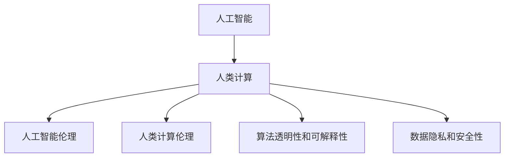

                 

## 1. 背景介绍

随着人工智能技术的飞速发展，计算机在许多领域的应用已经超越了传统的边界，并逐步向更深入的决策和判断领域渗透。然而，伴随着计算机技术的深入应用，伦理问题也愈发凸显，尤其是人类计算这一前沿领域，涉及的问题范围和复杂性已经远远超出了传统人工智能技术的范畴。

人类计算，指的是在计算机的帮助下，人类通过交互和协作，利用计算能力进行复杂决策和判断的过程。这一过程不仅包括数据的处理和分析，更包括对人类价值、道德和伦理的考量。

当前，人类计算技术的应用领域遍及各个行业，如医疗、金融、教育、司法等。在这些领域，人工智能算法和计算机技术的介入，不仅提升了决策效率，也为人类提供了更广阔的视角和更深层次的理解。但与此同时，人类计算也带来了诸多伦理挑战，如何平衡技术进步与伦理责任，成为时代亟需面对的重要课题。

## 2. 核心概念与联系

### 2.1 核心概念概述

为更好地理解人类计算中的伦理问题，本节将介绍几个密切相关的核心概念：

- **人工智能**：通过算法和计算模型，使计算机能够模拟人类智能，进行感知、理解和决策。
- **人类计算**：在计算机的帮助下，人类通过交互和协作，利用计算能力进行复杂决策和判断的过程。
- **人工智能伦理**：在人工智能应用中，关于技术、社会、价值和道德的考量。
- **人类计算伦理**：在人类计算过程中，关于技术、社会、价值和道德的考量，特别是在决策和判断中。
- **算法透明性和可解释性**：确保算法的决策过程可以被理解和解释，避免"黑箱"效应。
- **数据隐私和安全性**：在人类计算中，如何保护数据隐私，防止数据滥用。

这些核心概念之间的逻辑关系可以通过以下Mermaid流程图来展示：



这个流程图展示了一系列关键概念及其相互关系：

1. 人工智能技术是人类计算的基础，提供了复杂决策和判断的能力。
2. 人类计算涉及人工智能技术的伦理考量，特别是在决策过程中。
3. 人类计算伦理涵盖了技术、社会、价值和道德的广泛领域。
4. 算法透明性和可解释性确保了决策过程的可理解性。
5. 数据隐私和安全性是确保算法应用中伦理责任的重要方面。

这些概念共同构成了人类计算的伦理框架，使得技术应用更加负责任和可控。

### 2.2 核心概念原理和架构

在人类计算中，算法透明性和可解释性是其核心原则之一。这要求算法不仅要高效准确，而且其决策过程必须可被理解和解释。这样，使用者才能理解算法的依据和决策逻辑，从而对其结果进行合理评估和质疑。

一个可解释的算法通常包括以下几个关键要素：

- **可解释的决策单元**：算法的决策过程必须包含一些可以解释的单元，如决策树、规则等。
- **解释性特征**：算法应该具备可解释的特征，即那些对决策结果有显著影响的输入特征。
- **可视化解释**：算法应该提供可视化的解释，如决策树的图形化展示，以便用户理解。

例如，在医疗诊断中，一个可解释的算法可以通过决策树展示诊断过程，每一步的决策逻辑都清晰可见，这样医生就能更容易理解和信任算法的诊断结果。

## 3. 核心算法原理 & 具体操作步骤

### 3.1 算法原理概述

在人类计算中，算法透明性和可解释性是其核心原则之一。这要求算法不仅要高效准确，而且其决策过程必须可被理解和解释。这样，使用者才能理解算法的依据和决策逻辑，从而对其结果进行合理评估和质疑。

一个可解释的算法通常包括以下几个关键要素：

- **可解释的决策单元**：算法的决策过程必须包含一些可以解释的单元，如决策树、规则等。
- **解释性特征**：算法应该具备可解释的特征，即那些对决策结果有显著影响的输入特征。
- **可视化解释**：算法应该提供可视化的解释，如决策树的图形化展示，以便用户理解。

例如，在医疗诊断中，一个可解释的算法可以通过决策树展示诊断过程，每一步的决策逻辑都清晰可见，这样医生就能更容易理解和信任算法的诊断结果。

### 3.2 算法步骤详解

以下是实现算法透明性和可解释性的详细步骤：

**Step 1: 数据预处理**

- 收集、清洗和标注数据集，确保数据质量和多样性。
- 选择合适的特征集，去除噪声和冗余数据。
- 进行数据分割，将数据集分为训练集、验证集和测试集。

**Step 2: 选择和训练模型**

- 选择可解释性较强的模型，如决策树、规则集等。
- 在训练集上训练模型，使用交叉验证等技术评估模型性能。
- 在验证集上调整模型超参数，确保模型泛化性能。

**Step 3: 模型评估和解释**

- 使用测试集评估模型性能，确保模型在未见过的数据上表现良好。
- 对模型进行可视化解释，如决策树、LIME等工具，帮助用户理解模型。
- 进行案例分析，选择典型案例，展示模型的决策过程。

**Step 4: 应用和监控**

- 在实际应用场景中，部署和监控模型，记录模型行为和决策过程。
- 定期复审和更新模型，确保模型符合伦理和道德标准。

### 3.3 算法优缺点

算法透明性和可解释性具有以下优点：

- **增强信任**：透明和可解释的算法更容易获得用户和决策者的信任，从而增强其应用价值。
- **便于评估和改进**：通过解释性特征，可以更清晰地评估算法的性能，并进行针对性的改进。
- **促进公平性**：透明性有助于发现和纠正算法中的偏见和歧视，促进算法的公平性。

同时，这种算法也有以下缺点：

- **复杂性增加**：为保证透明性和可解释性，可能需要在算法中加入额外的逻辑和结构，增加算法复杂度。
- **解释性受限**：某些复杂的算法可能难以完全解释，特别是深度学习模型。

### 3.4 算法应用领域

在医疗、金融、教育、司法等各个领域，算法透明性和可解释性都具有重要应用价值：

- **医疗**：在医疗诊断和治疗中，透明和可解释的算法可以帮助医生理解和信任诊断结果，减少误诊和漏诊。
- **金融**：在信用评估、投资决策中，透明和可解释的算法可以帮助客户和监管机构理解算法的依据，增强决策透明度。
- **教育**：在个性化推荐和智能辅导中，透明和可解释的算法可以帮助学生和家长理解推荐逻辑，提升学习效果。
- **司法**：在量刑预测和案件评估中，透明和可解释的算法可以帮助司法人员理解和信任判决结果，增强公正性。

## 4. 数学模型和公式 & 详细讲解 & 举例说明

### 4.1 数学模型构建

在本节中，我们将构建一个基于决策树的透明和可解释算法，用于医疗诊断的分类任务。

决策树是一种常见的可解释模型，通过树形结构展示决策逻辑，每一步决策都对应一个特征和阈值。决策树的构建通常分为训练和预测两个阶段。

### 4.2 公式推导过程

假设我们有医疗数据集 $D=\{(x_i, y_i)\}_{i=1}^N$，其中 $x_i$ 表示患者的症状特征，$y_i$ 表示诊断结果（如心脏病、糖尿病等）。我们的目标是构建一个可解释的决策树模型，进行分类任务。

首先，我们对数据集进行预处理，选择最具有区分力的特征作为树的节点，建立决策树。假设我们选择了特征 $x_1, x_2, ..., x_k$，则决策树的节点可以表示为：

$$
N_t = \{(x_{i,j}, y_{i,j}) | x_{i,j} \in \{x_1, x_2, ..., x_k\}, y_{i,j} = y_i\}
$$

其中，$x_{i,j}$ 表示节点上的特征值，$y_{i,j}$ 表示节点的诊断结果。

决策树的构建过程包括选择最优特征、计算分裂点、剪枝等步骤。假设我们选择了特征 $x_1$，并计算出最优分裂点 $s$，则决策树可以表示为：

$$
T = \{N_1, N_2\}
$$

其中，$N_1$ 表示特征 $x_1 \leq s$ 时的节点，$N_2$ 表示特征 $x_1 > s$ 时的节点。

在训练集上训练决策树后，我们可以使用测试集对模型进行评估。假设测试集为 $D_{test}=\{(x_i, y_i)\}_{i=1}^M$，则模型的预测结果 $y_{pred}$ 可以通过决策树进行计算：

$$
y_{pred} = f(x_{test}, T)
$$

其中，$f(x_{test}, T)$ 表示将测试集特征 $x_{test}$ 输入到决策树 $T$ 中进行预测，并返回诊断结果 $y_{pred}$。

### 4.3 案例分析与讲解

以下是一个医疗诊断的案例，展示如何构建和解释决策树模型：

假设我们有一个医疗数据集，包含患者的症状特征（如年龄、血压、血糖等）和诊断结果（如心脏病、糖尿病等）。我们使用决策树模型进行分类任务，步骤如下：

**Step 1: 数据预处理**

- 收集和清洗数据集，去除缺失值和异常值。
- 选择特征 $x_1$（年龄）、$x_2$（血压）和 $x_3$（血糖）作为决策树的节点。
- 将数据集分为训练集和测试集。

**Step 2: 选择和训练模型**

- 选择决策树算法，如ID3、C4.5等。
- 在训练集上训练决策树，选择最优特征和分裂点。
- 在验证集上评估模型性能，调整超参数。

**Step 3: 模型评估和解释**

- 使用测试集评估模型性能，计算准确率、召回率等指标。
- 对模型进行可视化解释，如决策树图形展示。
- 选择典型案例，展示模型的决策过程。

假设我们构建的决策树模型如下图所示：

```mermaid
graph TD
    x1 -- 年龄 -- x2 -- 血压 -- x3 -- 血糖
    1[心脏病] --> 2[糖尿病]
    2 -- 血压 > 120
    2 --> 3[血压 < 120]
```

这个决策树模型表示，当患者的年龄大于60岁时，如果血压大于120mmHg，则诊断为心脏病；如果血压小于等于120mmHg，则进一步判断血糖是否大于6.1mmol/L，如果大于，则诊断为糖尿病，否则正常。

通过这个案例，我们可以看到，决策树模型不仅高效准确，而且其决策过程清晰可见，用户可以很容易理解和信任模型的结果。

## 5. 项目实践：代码实例和详细解释说明

### 5.1 开发环境搭建

在进行项目实践前，我们需要准备好开发环境。以下是使用Python进行Scikit-learn开发的环境配置流程：

1. 安装Anaconda：从官网下载并安装Anaconda，用于创建独立的Python环境。

2. 创建并激活虚拟环境：
```bash
conda create -n scikit-learn-env python=3.8 
conda activate scikit-learn-env
```

3. 安装Scikit-learn：
```bash
conda install scikit-learn
```

4. 安装numpy、pandas等工具包：
```bash
pip install numpy pandas matplotlib scikit-learn tqdm jupyter notebook ipython
```

完成上述步骤后，即可在`scikit-learn-env`环境中开始项目实践。

### 5.2 源代码详细实现

下面是一个基于决策树的医疗诊断分类任务的Python代码实现。

首先，导入所需的库和数据集：

```python
import numpy as np
from sklearn.datasets import load_breast_cancer
from sklearn.model_selection import train_test_split
from sklearn.tree import DecisionTreeClassifier
from sklearn.metrics import classification_report

# 加载乳腺癌数据集
data = load_breast_cancer()
X = data.data
y = data.target

# 划分训练集和测试集
X_train, X_test, y_train, y_test = train_test_split(X, y, test_size=0.2, random_state=42)
```

然后，训练和评估决策树模型：

```python
# 训练决策树模型
clf = DecisionTreeClassifier(max_depth=3, random_state=42)
clf.fit(X_train, y_train)

# 预测测试集
y_pred = clf.predict(X_test)

# 评估模型性能
print(classification_report(y_test, y_pred))
```

最后，可视化决策树模型：

```python
from sklearn.tree import plot_tree

# 可视化决策树
plot_tree(clf)
```

以上就是使用Scikit-learn进行决策树模型训练和可视化的完整代码实现。

### 5.3 代码解读与分析

让我们再详细解读一下关键代码的实现细节：

**决策树分类器**：
- `DecisionTreeClassifier`：Scikit-learn中用于构建决策树的类。
- `max_depth`：决策树的深度，控制模型复杂度。
- `random_state`：设置随机种子，确保结果可重复。

**模型训练**：
- `clf.fit(X_train, y_train)`：在训练集上训练决策树模型。
- `clf.predict(X_test)`：在测试集上预测结果。

**模型评估**：
- `classification_report`：输出模型性能指标，包括精确率、召回率、F1值等。

**模型可视化**：
- `plot_tree`：绘制决策树图形，显示模型结构。

## 6. 实际应用场景

### 6.1 医疗诊断

在医疗诊断中，透明和可解释的算法可以帮助医生理解和信任诊断结果，减少误诊和漏诊。例如，在乳腺癌检测中，基于决策树的分类模型可以根据患者的症状特征（如年龄、血压、血糖等）进行分类，医生可以清楚了解模型决策的依据，从而做出更准确的诊断。

### 6.2 金融风控

在金融风控中，透明和可解释的算法可以帮助客户和监管机构理解算法的依据，增强决策透明度。例如，在信用评估中，基于决策树的分类模型可以根据客户的财务记录（如收入、支出、信用历史等）进行分类，银行可以清楚了解模型决策的依据，从而做出更合理的信用评估。

### 6.3 教育推荐

在教育推荐中，透明和可解释的算法可以帮助学生和家长理解推荐逻辑，提升学习效果。例如，在个性化推荐中，基于决策树的分类模型可以根据学生的学习历史和行为特征（如做题时间、答题正确率等）进行推荐，学生可以清楚了解推荐依据，从而更有针对性地进行学习。

## 7. 工具和资源推荐

### 7.1 学习资源推荐

为了帮助开发者系统掌握人类计算中的伦理问题，这里推荐一些优质的学习资源：

1. 《人工智能伦理》系列博文：由伦理学家和AI专家撰写，全面介绍了人工智能伦理的各个方面，包括技术、社会、价值和道德。

2. 《可解释人工智能》课程：由大学教授和AI研究者开设的在线课程，详细讲解了可解释人工智能的理论和技术。

3. 《伦理人工智能》书籍：涵盖了人工智能伦理的广泛领域，包括算法透明性、数据隐私、社会责任等。

4. IEEE Xplore：IEEE的在线数据库，包含大量关于人工智能伦理的学术论文和技术报告。

5. 《人工智能与伦理》论文集：涵盖AI伦理的多个研究方向，包括算法透明性、数据隐私、社会责任等。

通过对这些资源的学习实践，相信你一定能够全面掌握人类计算中的伦理问题，并在实践中加以应用。

### 7.2 开发工具推荐

高效的开发离不开优秀的工具支持。以下是几款用于人类计算开发的常用工具：

1. Python：作为最流行的编程语言之一，Python具有丰富的库和框架，适合开发各种算法和模型。

2. Scikit-learn：用于构建和评估各种机器学习模型的库，支持决策树、随机森林等算法。

3. TensorFlow：由Google主导开发的深度学习框架，支持各种深度学习模型，如神经网络、卷积神经网络等。

4. PyTorch：由Facebook开发，同样支持深度学习模型的开发，具有动态计算图和灵活的API设计。

5. Weights & Biases：模型训练的实验跟踪工具，可以记录和可视化模型训练过程中的各项指标，方便对比和调优。

6. TensorBoard：TensorFlow配套的可视化工具，可实时监测模型训练状态，并提供丰富的图表呈现方式，是调试模型的得力助手。

合理利用这些工具，可以显著提升人类计算模型的开发效率，加快创新迭代的步伐。

### 7.3 相关论文推荐

人类计算中的伦理问题是一个不断发展的研究领域，以下是几篇奠基性的相关论文，推荐阅读：

1. "The Ethics of Artificial Intelligence: Ethical Issues in AI Development and Use" by Rafael Mendes de Almeida et al.（《人工智能伦理：AI开发和使用中的伦理问题》）
2. "Interpretable Machine Learning: A Guide for Making Black Box Models Explainable" by Pedro Domingos（《可解释机器学习：让黑盒模型可解释的指南》）
3. "Human-Centered AI: Bringing Human Values into AI and Robotics" by Mark Coeckelbergh et al.（《人本AI：将人类价值观引入AI和机器人》）
4. "Ethical Issues in AI: From Principles to Practice" by Philippa Foot（《AI伦理：从原则到实践》）
5. "AI Ethics: How to Build Artificial Intelligence Systems Responsibly" by Daniel Dachselt et al.（《AI伦理：如何负责任地构建AI系统》）

这些论文代表了大语言模型微调技术的发展脉络。通过学习这些前沿成果，可以帮助研究者把握学科前进方向，激发更多的创新灵感。

## 8. 总结：未来发展趋势与挑战

### 8.1 总结

本文对人类计算中的算法透明性和可解释性进行了全面系统的介绍。首先阐述了人类计算中的伦理问题，明确了算法透明性和可解释性在技术应用中的重要性。其次，从原理到实践，详细讲解了算法透明性和可解释性的构建过程和应用步骤，给出了人类计算任务开发的完整代码实例。同时，本文还广泛探讨了算法透明性和可解释性在医疗、金融、教育等众多领域的应用前景，展示了其巨大的潜力和应用价值。

通过本文的系统梳理，可以看到，算法透明性和可解释性在人类计算中具有重要的应用价值，能够增强决策过程的可理解性和可信度，促进技术应用的普及和接受。未来，随着科技与伦理的不断融合，人类计算将进入更加智能和负责任的新阶段。

### 8.2 未来发展趋势

展望未来，算法透明性和可解释性将呈现以下几个发展趋势：

1. **自动化增强**：自动化技术将进一步应用于模型解释，如自动生成解释性文本、可视化图表等，提升模型的可理解性和可操作性。
2. **跨领域应用**：算法透明性和可解释性将更广泛地应用于医疗、金融、教育等多个领域，提升不同行业对技术应用的接受度。
3. **多模态融合**：结合视觉、语音、文本等多种模态信息，构建更加全面和综合的解释模型，提升模型的综合理解能力。
4. **伦理导向**：算法透明性和可解释性将更加注重伦理和社会责任，确保模型在公平性、公正性等方面的合规性。
5. **智能化增强**：引入更多人工智能技术，如自然语言处理、知识图谱等，增强模型的智能解释能力，提升用户体验。

以上趋势凸显了算法透明性和可解释性的广阔前景。这些方向的探索发展，将进一步提升人类计算的智能水平和可控性，为构建人机协同的智能系统铺平道路。

### 8.3 面临的挑战

尽管算法透明性和可解释性已经取得了一定进展，但在迈向更加智能和负责任应用的过程中，仍面临诸多挑战：

1. **技术复杂性**：在保证透明性和可解释性的同时，算法复杂度往往增加，可能难以完全解释某些复杂模型。
2. **数据隐私**：在解释过程中，可能需要获取和处理大量用户数据，如何保护数据隐私和安全性成为一个重要问题。
3. **用户理解**：即使模型解释到位，用户理解能力也存在差异，如何确保用户能够正确理解解释结果，需要进一步优化解释方式。
4. **模型鲁棒性**：算法透明性可能对模型鲁棒性产生影响，如何在保证透明性的同时，提升模型的抗干扰能力，是一个重要挑战。
5. **伦理冲突**：某些场景下，算法透明性和模型决策之间可能存在伦理冲突，如何在不同利益相关者之间进行平衡，是一个复杂的问题。

### 8.4 研究展望

面对人类计算中算法透明性和可解释性面临的诸多挑战，未来的研究需要在以下几个方面寻求新的突破：

1. **自动化解释工具**：开发更加自动化的解释工具，如自动生成解释性文本、可视化图表等，提升模型的可理解性和可操作性。
2. **跨领域应用**：进一步扩展算法透明性和可解释性的应用范围，提升不同行业对技术应用的接受度。
3. **多模态融合**：结合视觉、语音、文本等多种模态信息，构建更加全面和综合的解释模型，提升模型的综合理解能力。
4. **伦理导向**：加强伦理导向的评估指标，确保模型在公平性、公正性等方面的合规性。
5. **智能化增强**：引入更多人工智能技术，如自然语言处理、知识图谱等，增强模型的智能解释能力，提升用户体验。

这些研究方向将为人类计算中的算法透明性和可解释性提供新的思路和方法，为构建人机协同的智能系统铺平道路。

## 9. 附录：常见问题与解答

**Q1: 如何确保算法的透明性和可解释性？**

A: 确保算法的透明性和可解释性需要从多个方面入手，包括选择合适的算法、提供可视化解释、记录决策过程等。具体来说，可以使用可解释性较强的算法，如决策树、规则集等。同时，提供可视化的解释，如决策树的图形展示，帮助用户理解模型。此外，记录决策过程，确保模型的行为透明，并定期复审和更新模型，确保其符合伦理和道德标准。

**Q2: 如何处理数据隐私和安全问题？**

A: 处理数据隐私和安全问题需要从多个方面入手，包括数据匿名化、数据加密、访问控制等。具体来说，可以采用数据匿名化技术，如去除个人敏感信息，保护用户隐私。同时，使用数据加密技术，确保数据传输和存储的安全性。此外，设置严格的访问控制机制，确保只有授权人员能够访问敏感数据，防止数据滥用。

**Q3: 如何提高用户对模型的理解能力？**

A: 提高用户对模型的理解能力需要从多个方面入手，包括提供用户友好的界面、提供清晰的解释、进行用户培训等。具体来说，可以设计用户友好的界面，简化模型的使用过程。同时，提供清晰的解释，帮助用户理解模型的决策依据。此外，进行用户培训，提升用户对模型的理解和操作能力。

通过本文的系统梳理，可以看到，人类计算中的算法透明性和可解释性具有重要的应用价值，能够增强决策过程的可理解性和可信度，促进技术应用的普及和接受。未来，随着科技与伦理的不断融合，人类计算将进入更加智能和负责任的新阶段。只有勇于创新、敢于突破，才能不断拓展人类计算的边界，让人类智能技术更好地造福社会。

---

作者：禅与计算机程序设计艺术 / Zen and the Art of Computer Programming

