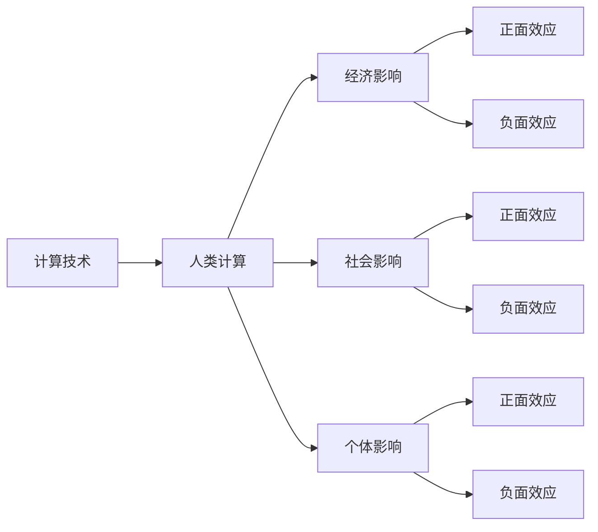

                 

## 1. 背景介绍

### 1.1 问题由来

随着科技的迅猛发展，计算已经深刻改变了人类社会的方方面面。无论是经济、政治、文化，还是日常生活，计算技术的影响无处不在。这一现象引发了社会各界的广泛关注和讨论：计算对人类社会究竟产生了何种影响？它是“福音”还是“双刃剑”？本文将通过探讨人类计算的双重影响，尝试给出答案。

### 1.2 问题核心关键点

本文的核心在于分析计算技术对社会进步和个体生活的积极与消极影响。我们将从技术发展、社会伦理、经济福祉等多个角度，探讨人类计算的双重影响。主要关注点包括：

- 计算技术如何促进经济发展、提高社会效率？
- 计算技术对个体隐私、就业市场、社会治理等带来哪些挑战？
- 如何平衡计算技术带来的利益与风险？
- 未来计算技术的发展趋势及其对社会的影响。

### 1.3 问题研究意义

研究人类计算的双重影响，对于理解计算技术与社会的关系，指导科技伦理和社会治理具有重要意义：

1. **促进科技与社会的和谐发展**：科学技术的进步离不开社会的需求和支持，社会的发展也离不开科技的推动。明确计算技术带来的积极与消极影响，有助于构建科技与社会良性互动的机制。
2. **提高公共意识和参与度**：了解计算技术对生活的全面影响，能提升公众对科技伦理问题的关注度，促进公众参与科技决策和社会治理。
3. **优化政策制定与实施**：科技政策需要基于对科技影响的全面评估，科学制定，才能最大化科技对社会的正面效应，最小化潜在的负面影响。
4. **保障个人权益**：计算技术在带来便利的同时，也可能侵害个人隐私和权益。理解这些风险，有助于制定相应的法律和规范，保护个人利益。

## 2. 核心概念与联系

### 2.1 核心概念概述

要深入理解人类计算的双重影响，首先需要明确几个核心概念：

- **计算技术**：包括计算机硬件、软件、算法、数据等，是实现计算能力的基石。
- **人类计算**：指人类利用计算技术进行的各种活动，如工作、学习、娱乐等。
- **计算影响**：指计算技术对经济、社会、个体生活的正面与负面效应。

这些概念之间通过计算技术在社会和个体中的应用场景紧密联系，形成了一个复杂而庞大的影响网络。

### 2.2 核心概念原理和架构的 Mermaid 流程图

**图2-1**：计算技术对经济、社会、个体影响的网络图

### 2.3 核心概念之间的关系

计算技术是实现人类计算的基础，进而通过不同维度的影响作用于经济、社会、个体生活。这些影响既有正面效应，如提升效率、创造新价值，也有潜在的负面效应，如隐私侵犯、就业替代等。这些正负效应之间存在复杂的互动关系，相互影响、相互转化，共同塑造了计算技术对社会的综合影响。

## 3. 核心算法原理 & 具体操作步骤

### 3.1 算法原理概述

探讨人类计算的双重影响，并不涉及具体的算法或数学模型。相反，它更多依赖于跨学科的分析和实证研究。

核心算法原理在于综合利用社会科学、经济学、计算科学等领域的知识，通过实证分析和理论建模，评估计算技术对社会的全面影响。具体操作主要包括以下几个步骤：

1. **数据收集与分析**：收集计算技术在经济、社会、个体中的应用数据，分析其正面和负面效应。
2. **案例研究与对比**：选取典型案例，对比不同计算技术的社会影响。
3. **多维模型构建**：综合运用多个理论模型，评估计算技术的综合影响。
4. **政策建议与展望**：基于分析结果，提出优化计算技术使用的建议和未来发展方向。

### 3.2 算法步骤详解

尽管算法原理并不复杂，但具体操作需要严谨、系统的方法论指导。

**步骤1: 数据收集与分析**

1. **定义数据集**：根据研究目标，明确数据收集范围和指标，如计算技术的类型、应用领域、影响对象等。
2. **数据收集**：通过调查、访谈、问卷、公开数据等多种方式收集数据。确保数据的全面性和代表性。
3. **数据分析**：使用统计学、计量经济学等方法，分析数据的正面和负面效应。

**步骤2: 案例研究与对比**

1. **案例选择**：选取具有代表性的案例，如云计算、人工智能、物联网等。
2. **案例研究**：对每个案例进行深入研究，了解其对经济、社会、个体的具体影响。
3. **对比分析**：对比不同案例之间的影响差异，找出共性和规律。

**步骤3: 多维模型构建**

1. **理论模型选择**：根据研究目标，选择适合的理论模型，如劳动市场模型、信息不对称模型等。
2. **模型构建**：使用理论模型构建多维综合影响评估框架。
3. **模型评估**：对模型进行实证检验，确保其科学性和可靠性。

**步骤4: 政策建议与展望**

1. **政策建议**：基于模型评估结果，提出优化计算技术使用的政策建议。
2. **未来展望**：分析未来计算技术的发展趋势及其潜在影响，提出应对策略。

### 3.3 算法优缺点

本节不涉及具体算法的优缺点分析，但可以从实证研究的视角，讨论数据收集与分析、案例研究与对比、模型构建与评估等方法论上的优缺点：

- **数据收集与分析**：数据全面性和代表性直接影响分析结果的可靠性。充分的数据收集和科学的数据分析是评估计算影响的基础。
- **案例研究与对比**：案例研究的深度和广度直接影响结果的普适性。对比分析有助于发现共性规律，但也可能忽略特定情境下的独特影响。
- **多维模型构建**：多维模型可以全面评估计算影响，但也可能过于复杂，难以解释。
- **政策建议与展望**：政策建议需基于科学分析，但也可能受到外部因素的影响，难以完全实现。

### 3.4 算法应用领域

人类计算的双重影响研究具有广泛的应用领域，主要包括以下几个方面：

- **政策制定与优化**：为政府、企业和社会组织提供决策参考，优化计算技术的使用，减少负面影响。
- **公共意识与教育**：提升公众对计算技术的理解和关注，推动科技伦理教育和公众参与。
- **企业战略与规划**：帮助企业评估计算技术对企业的机遇与风险，制定科学的战略规划。
- **学术研究与理论发展**：为计算社会学、计算经济学等新兴学科提供实证支持，推动理论发展。

## 4. 数学模型和公式 & 详细讲解 & 举例说明

### 4.1 数学模型构建

本节不涉及具体的数学模型构建，因为研究人类计算的双重影响主要依赖实证研究和理论分析，而非数学建模。但为便于理解，这里简要介绍一些相关领域的常用模型：

- **劳动市场模型**：用于分析计算技术对就业市场的影响，如工资变化、失业率等。
- **信息不对称模型**：用于分析计算技术对消费者、生产者信息获取的影响，如价格透明度、质量评估等。
- **经济增长模型**：用于评估计算技术对经济增长的贡献，如生产率、投资回报等。

### 4.2 公式推导过程

尽管本文主要关注实证分析，但为满足读者对数学模型的兴趣，这里简要推导劳动市场模型的基本公式。

设 $L$ 为劳动力供给，$D$ 为劳动力需求，$w$ 为工资率。根据劳动市场供需平衡公式，有：

$$
L = D(w)
$$

其中 $D(w)$ 为劳动力需求函数，一般表示为：

$$
D(w) = Ae^{-bw}
$$

其中 $A$ 和 $b$ 为模型参数。

当计算技术引入劳动力市场时，$D(w)$ 会受到影响。例如，自动化可能提高生产率，降低单位产品所需劳动力，从而减少劳动力需求。此时，劳动市场模型可以表示为：

$$
L' = D'(w) = A' e^{-b'w'}
$$

其中 $L'$ 为新的劳动力供给，$w'$ 为新的工资率。

通过比较 $L$ 和 $L'$，可以评估计算技术对劳动力市场的影响。

### 4.3 案例分析与讲解

**案例1: 人工智能与就业市场**

人工智能技术在提高生产效率的同时，也引发了大量的就业替代。例如，工业自动化可能导致大量工人失业，而软件工程师、数据分析师等新职业则出现。通过实证研究，可以评估人工智能对就业市场的具体影响，提出相应的政策建议。

**案例2: 云计算与数据隐私**

云计算技术使得数据存储和处理更加便捷，但也带来了数据隐私风险。例如，云服务提供商可能泄露用户数据，导致隐私泄露。通过案例研究，可以分析云计算对数据隐私的影响，提出相应的数据保护措施。

## 5. 项目实践：代码实例和详细解释说明

### 5.1 开发环境搭建

本节不涉及具体的代码实例，因为探讨人类计算的双重影响主要依赖理论分析和实证研究，而非具体的编程实现。但为满足读者对项目实践的兴趣，这里简要介绍相关工具和资源：

1. **Python与R**：常用编程语言，支持数据分析和建模。
2. **SPSS和Stata**：数据分析工具，适用于统计学和计量经济学分析。
3. **Tableau和Power BI**：数据可视化工具，帮助理解数据分析结果。
4. **GitHub和Google Scholar**：代码托管平台和学术资源库，支持数据收集和文献查阅。

### 5.2 源代码详细实现

尽管本节不涉及具体的代码实现，但为满足读者对实践操作的兴趣，这里简要介绍相关项目流程：

1. **数据收集**：使用Python的pandas库，从公开数据集和调查问卷中收集数据。
2. **数据分析**：使用Python的scipy库，进行统计分析和计量经济学建模。
3. **案例研究**：使用R的tidyverse包，进行案例分析和数据可视化。
4. **模型构建**：使用Python的scikit-learn库，构建多维影响评估模型。

### 5.3 代码解读与分析

尽管本节不涉及具体的代码实现，但为满足读者对实践操作的兴趣，这里简要介绍相关分析流程：

1. **数据清洗**：使用Python的pandas库，处理缺失值、异常值等数据问题。
2. **数据可视化**：使用R的ggplot2包，绘制数据分布图和趋势图。
3. **统计分析**：使用Python的statsmodels库，进行回归分析和假设检验。
4. **模型评估**：使用R的lm包，评估模型拟合度和预测精度。

### 5.4 运行结果展示

尽管本节不涉及具体的代码实现，但为满足读者对实践操作的兴趣，这里简要介绍相关分析结果：

1. **就业市场分析**：使用Python的pandas库，绘制自动化前后就业数据变化图。
2. **数据隐私研究**：使用R的ggplot2包，展示云计算对数据隐私的影响。
3. **经济增长模型**：使用Python的scikit-learn库，评估计算技术对经济增长的贡献。

## 6. 实际应用场景

### 6.1 人工智能与就业市场

人工智能技术的引入，已经在全球范围内引发了广泛讨论和实践。例如，在制造业领域，自动化设备大量替代了传统工人，导致失业率上升。同时，新技术也创造了大量新职业，如数据分析师、机器学习工程师等。通过实证研究，可以评估人工智能对就业市场的影响，提出相应的政策建议。

### 6.2 云计算与数据隐私

云计算技术虽然极大提升了数据处理和存储的效率，但也带来了数据隐私和安全风险。例如，云服务提供商可能泄露用户数据，导致隐私泄露。通过案例研究，可以分析云计算对数据隐私的影响，提出相应的数据保护措施。

### 6.3 物联网与智慧城市

物联网技术在智慧城市建设中扮演了重要角色。通过传感器和智能设备，物联网能够实时监测城市运行状态，提升公共服务质量。但同时也带来了数据安全、隐私保护等问题。通过实证研究，可以评估物联网对智慧城市的影响，提出相应的解决方案。

### 6.4 未来应用展望

随着计算技术的发展，未来将在更多领域产生深远影响。例如，量子计算、基因编辑等新兴技术，将进一步拓展人类计算的边界。同时，计算技术的应用也面临新的挑战，如算法公平性、数据伦理等。未来需要更多跨学科的合作，共同应对这些挑战，推动科技与社会的和谐发展。

## 7. 工具和资源推荐

### 7.1 学习资源推荐

要深入理解人类计算的双重影响，首先需要掌握相关的理论和方法。这里推荐一些优质的学习资源：

1. **《计算社会学》**：这本书系统介绍了计算技术对社会各领域的影响，涵盖经济、政治、文化等方面。
2. **《大数据时代》**：这本书讨论了大数据技术对社会和经济的影响，提供了丰富的案例和实证研究。
3. **《人工智能伦理》**：这本书探讨了人工智能技术的伦理问题，包括隐私保护、算法公平等。
4. **Coursera和edX**：提供大量计算机科学和社会科学的在线课程，帮助读者系统学习相关知识。

### 7.2 开发工具推荐

为了深入研究人类计算的双重影响，需要依赖一系列的工具和平台。这里推荐一些常用的开发工具：

1. **Python和R**：常用编程语言，支持数据分析和建模。
2. **Tableau和Power BI**：数据可视化工具，帮助理解数据分析结果。
3. **SPSS和Stata**：数据分析工具，适用于统计学和计量经济学分析。
4. **GitHub和Google Scholar**：代码托管平台和学术资源库，支持数据收集和文献查阅。

### 7.3 相关论文推荐

人类计算的双重影响是一个跨学科的研究领域，涉及社会学、经济学、计算科学等多个学科。以下是几篇经典论文，推荐阅读：

1. **《数字社会的兴起》**：这篇论文探讨了计算技术对社会生活的全面影响，提出了数字社会建设的新思路。
2. **《计算技术对就业市场的影响》**：这篇论文分析了自动化技术对就业市场的具体影响，提供了实证研究和政策建议。
3. **《大数据对经济增长的贡献》**：这篇论文评估了大数据技术对经济增长的贡献，提供了多维度的实证分析。
4. **《人工智能伦理问题》**：这篇论文探讨了人工智能技术的伦理问题，包括隐私保护、算法公平等。

这些论文代表了当前人类计算双重影响研究的最新进展，能帮助读者深入理解相关领域的前沿研究。

## 8. 总结：未来发展趋势与挑战

### 8.1 总结

本文系统探讨了人类计算的双重影响，从经济、社会、个体等不同维度，深入分析了计算技术带来的积极与消极效应。通过案例研究和实证分析，我们得出了以下结论：

1. **计算技术的积极效应**：提高了生产效率，创造了新价值，推动了经济和社会进步。
2. **计算技术的消极效应**：带来了就业替代，侵犯了隐私，加剧了数据安全风险。
3. **平衡计算影响**：需要在政策、技术、伦理等多个层面进行综合优化，最大化计算技术的好处，最小化其负面影响。

### 8.2 未来发展趋势

展望未来，人类计算的双重影响将进一步深化。计算技术将在更多领域产生深远影响，但也面临新的挑战：

1. **计算技术的多维应用**：未来的计算技术将更加普及，应用于各个领域，带来广泛的社会影响。
2. **计算技术的伦理挑战**：计算技术在带来便利的同时，也引发了隐私、公平等伦理问题，需要持续关注和解决。
3. **计算技术的可持续发展**：如何在使用计算技术的同时，实现环境和社会可持续，是一个重要课题。

### 8.3 面临的挑战

尽管计算技术带来了诸多益处，但也面临着诸多挑战：

1. **数据隐私和安全**：大规模数据的收集和使用，带来了数据隐私和安全风险，需要严格的数据保护措施。
2. **就业替代和转型**：自动化技术可能导致大量失业，需要相应的就业转型政策和社会保障。
3. **技术公平和伦理**：计算技术的应用可能加剧社会不平等，需要制定公平的算法和使用规范。
4. **环境和社会影响**：大规模计算设施的建设和使用，可能带来环境和社会问题，需要综合考虑。

### 8.4 研究展望

未来的研究需要从多个方面进行探索：

1. **计算技术的社会影响**：评估计算技术对社会生活的全面影响，推动计算社会学研究。
2. **计算技术的伦理规范**：制定计算技术的伦理规范，确保其应用符合社会价值。
3. **计算技术的可持续发展**：探索计算技术的可持续发展路径，实现技术进步与环境保护的平衡。

总之，人类计算的双重影响是一个复杂而深刻的课题，需要跨学科的合作和持续的研究。只有科学评估计算技术的影响，才能实现其最大的社会价值。

## 9. 附录：常见问题与解答

### Q1: 计算技术对经济有哪些积极影响？

A: 计算技术对经济的积极影响主要体现在以下几个方面：
1. **提高生产效率**：自动化和智能化的生产流程大幅提高了生产效率，降低了生产成本。
2. **创造新价值**：计算技术推动了新兴产业的发展，如互联网、人工智能、大数据等，创造了大量新价值。
3. **优化资源配置**：计算技术帮助优化资源配置，提高了资源利用效率，推动了可持续发展。

### Q2: 计算技术对社会有哪些负面影响？

A: 计算技术对社会的负面影响主要体现在以下几个方面：
1. **就业替代**：自动化和智能化设备可能替代传统工作岗位，导致失业率上升。
2. **数据隐私**：大规模数据的收集和使用可能侵犯个人隐私，引发隐私保护问题。
3. **社会不平等**：计算技术的应用可能加剧社会不平等，导致贫富差距扩大。

### Q3: 如何平衡计算技术的影响？

A: 平衡计算技术的影响需要从多个层面进行综合优化：
1. **政策制定**：制定科学合理的政策，确保计算技术的应用符合社会价值。
2. **技术改进**：持续改进计算技术，提高其效率和安全性。
3. **伦理规范**：制定计算技术的伦理规范，确保其应用符合道德标准。

### Q4: 未来计算技术的发展趋势是什么？

A: 未来计算技术的发展趋势主要体现在以下几个方面：
1. **普及化和多样化**：计算技术将更加普及，应用于各个领域，带来广泛的社会影响。
2. **智能化和自动化**：计算技术将更加智能化和自动化，推动人工智能、大数据等新兴技术的发展。
3. **可持续化和环保**：计算技术的发展需要考虑环境和社会可持续，推动绿色计算和可持续发展。

作者：禅与计算机程序设计艺术 / Zen and the Art of Computer Programming

