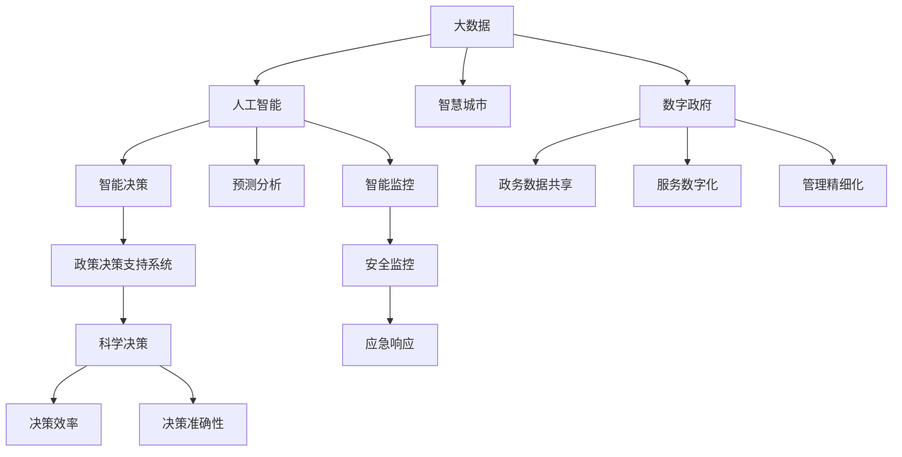

                 

# 科技创新：社会治理的新思路

> 关键词：科技创新,社会治理,大数据,人工智能,政策决策,城市管理,公共服务

## 1. 背景介绍

### 1.1 问题由来
在过去几十年中，随着信息技术的高速发展，全球社会治理模式发生了深刻变革。互联网、物联网、人工智能等技术的广泛应用，使得政府和企业的决策过程变得更加透明和高效。然而，面对复杂多变的社会问题，传统的治理模式仍存在诸多不足之处。这主要体现在以下几个方面：

1. **数据分散**：各行业、各领域的原始数据分散在不同平台，缺乏统一的标准和格式，难以进行有效整合和分析。
2. **响应迟缓**：传统决策流程繁琐冗长，信息传递速度慢，难以快速响应突发事件。
3. **缺乏透明度**：政府决策过程不透明，民众难以及时了解和参与，存在信任危机。
4. **资源浪费**：各政府部门和机构重复建设了大量信息化系统，导致资源浪费。

这些问题迫切需要新的技术手段来解决，以实现更加高效、透明、参与性强的社会治理模式。科技创新，尤其是大数据、人工智能等技术的运用，为社会治理注入了新的活力。

### 1.2 问题核心关键点
为了更深入理解科技创新在社会治理中的应用，本节将重点探讨几个关键点：

1. **数据治理与融合**：如何整合异构数据源，构建统一的大数据平台。
2. **智能决策与优化**：如何利用大数据和人工智能技术，提升决策效率和质量。
3. **透明度与参与度**：如何提高决策过程的透明度，增加民众的参与度。
4. **协同治理与资源共享**：如何实现跨部门、跨层级、跨地域的协同治理，避免资源浪费。

## 2. 核心概念与联系

### 2.1 核心概念概述

在探讨科技创新与社会治理的联系之前，我们需要了解几个关键概念：

1. **大数据 (Big Data)**：指规模巨大、类型多样的数据集，通常需要分布式计算和存储才能处理。大数据技术包括数据采集、存储、处理、分析等环节，是支持社会治理创新的基础。

2. **人工智能 (AI)**：利用机器学习、深度学习等技术，让机器具备类似于人类的学习、推理和决策能力。人工智能技术在社会治理中的应用，主要包括预测分析、智能决策、智能监控等。

3. **智慧城市 (Smart City)**：利用信息和通信技术（ICT），对城市的各种要素进行感知、分析、管理和优化，提升城市的智能化水平，实现高效、安全、可持续的城市运行。

4. **数字政府 (Digital Government)**：利用信息技术提升政府治理效能，实现政务数据共享、服务数字化、管理精细化等目标，提高公共服务的质量和效率。

5. **政策决策支持系统 (Policy Decision Support Systems, PDSS)**：基于大数据和人工智能技术，辅助政府和企业管理者进行科学决策，提高决策的准确性和效率。

这些核心概念之间的逻辑关系可以通过以下Mermaid流程图来展示：



这个流程图展示了大数据、人工智能等技术如何在智慧城市、数字政府等具体应用场景中发挥作用，推动社会治理的创新。

## 3. 核心算法原理 & 具体操作步骤
### 3.1 算法原理概述

社会治理中的科技创新主要依赖于数据驱动的决策过程。算法原理主要包括以下几个方面：

1. **数据预处理**：对原始数据进行清洗、去重、标准化等预处理，以提高数据的可用性和分析精度。
2. **特征工程**：通过特征提取、特征选择、特征降维等技术，提取对决策有重要影响的关键特征。
3. **模型训练与优化**：利用机器学习算法（如随机森林、神经网络等）对特征数据进行训练，优化模型参数，提高预测准确性。
4. **智能决策与预测**：基于训练好的模型，对新的数据进行实时分析和预测，辅助决策者做出科学决策。

### 3.2 算法步骤详解

基于上述算法原理，以下是社会治理中科技创新的一般操作步骤：

1. **数据收集与整合**：
   - 收集各类社会数据，如人口信息、交通流量、环境监测、公共服务需求等。
   - 整合不同来源的数据，构建统一的大数据平台，支持跨部门、跨层级的数据共享。

2. **数据清洗与预处理**：
   - 清洗数据中的噪声、错误、缺失值等，保证数据的准确性和完整性。
   - 对数据进行标准化、归一化等预处理，便于后续的分析和建模。

3. **特征提取与选择**：
   - 从原始数据中提取对决策有重要影响的特征，如用户行为特征、环境监测指标、政策效果等。
   - 使用特征选择算法（如LASSO、PCA等），筛选出对目标变量影响最大的特征。

4. **模型训练与优化**：
   - 选择合适的机器学习算法，对特征数据进行训练，如随机森林、梯度提升树、神经网络等。
   - 使用交叉验证等技术，对模型进行调优，避免过拟合。

5. **智能决策与预测**：
   - 将训练好的模型部署到生产环境，对实时数据进行分析和预测。
   - 利用预测结果，辅助决策者进行科学决策，优化公共服务和资源配置。

### 3.3 算法优缺点

大数据和人工智能技术在社会治理中的应用具有以下优点：

1. **提高决策效率**：通过实时数据分析和预测，可以迅速响应突发事件，优化资源配置。
2. **提升决策质量**：利用数据驱动的决策过程，减少人为干扰，提高决策的科学性和准确性。
3. **增强透明度**：数据的公开透明，可以增强决策过程的透明度，增加民众的信任和参与度。
4. **促进协同治理**：跨部门、跨层级的数据共享，可以实现协同治理，提高治理效能。

同时，这些技术也存在一定的局限性：

1. **数据隐私与安全**：大量数据集中存储和处理，存在隐私泄露和数据安全的风险。
2. **技术复杂度**：大数据和人工智能技术的应用，需要较高的技术门槛，对数据科学家和技术人员的要求较高。
3. **成本高昂**：数据采集、存储、处理等环节需要大量资金投入，增加了治理成本。
4. **数据质量问题**：数据采集和清洗过程复杂，可能存在数据质量问题，影响分析结果。

### 3.4 算法应用领域

科技创新在社会治理中的应用广泛，以下是几个典型的应用领域：

1. **智慧城市管理**：
   - 利用物联网、传感器等技术，对城市运行状态进行实时监控，如交通流量、环境污染、能源消耗等。
   - 通过大数据分析，优化城市资源配置，提高城市运行效率和安全性。

2. **公共服务优化**：
   - 利用人工智能技术，对公共服务需求进行预测，优化资源分配，如医疗资源、教育资源等。
   - 通过智能客服、智能导诊等应用，提升公共服务的质量和效率。

3. **应急响应与灾情管理**：
   - 通过实时数据分析，监测灾害预警信息，提前采取应对措施。
   - 利用AI技术，对灾情数据进行快速分析，辅助救援决策。

4. **政策决策支持**：
   - 利用大数据和人工智能技术，对政策效果进行评估和预测，辅助政府制定科学决策。
   - 通过政策模拟和优化，提高政策的精准度和可行性。

## 4. 数学模型和公式 & 详细讲解 & 举例说明

### 4.1 数学模型构建

本节将使用数学语言对大数据和人工智能在社会治理中的应用进行更加严格的刻画。

假设社会治理的数据集为 $D=\{(x_i, y_i)\}_{i=1}^N$，其中 $x_i$ 为输入特征，$y_i$ 为输出变量，如政策效果、服务质量等。

定义大数据和人工智能模型为 $M(x; \theta)$，其中 $\theta$ 为模型参数。

定义目标变量 $y$ 的损失函数为 $\ell(y, \hat{y})$，用于衡量模型预测结果与真实标签之间的差异。

社会治理的目标是构建一个泛化能力强的模型 $M(x; \theta)$，使得在新的数据 $D'$ 上也能有良好的表现。

### 4.2 公式推导过程

以下我们以智慧城市交通流量预测为例，推导随机森林模型的训练和预测过程。

假设模型 $M(x; \theta)$ 为随机森林，在训练集 $D$ 上定义交叉熵损失函数为：

$$
\ell(y, \hat{y}) = -\frac{1}{N} \sum_{i=1}^N \sum_{k=1}^K y_i \log \hat{y}_{ik}
$$

其中 $K$ 为随机森林的树数。

在训练过程中，通过最小化交叉熵损失函数，更新模型参数 $\theta$，得到：

$$
\theta = \mathop{\arg\min}_{\theta} \frac{1}{N} \sum_{i=1}^N \sum_{k=1}^K \ell(y_i, \hat{y}_{ik})
$$

预测时，将新的输入数据 $x'$ 输入模型 $M(x; \theta)$，得到预测结果 $\hat{y}'$：

$$
\hat{y}' = M(x'; \theta)
$$

### 4.3 案例分析与讲解

以一个智慧城市交通流量预测的实际案例来说明随机森林模型在社会治理中的应用。

1. **数据收集与预处理**：
   - 从城市交通管理中心获取交通流量数据，包括时间、地点、车流量等。
   - 清洗数据，处理缺失值，标准化数据格式。

2. **特征工程**：
   - 提取关键特征，如时间、天气、节假日等，作为模型的输入。
   - 使用特征选择算法（如LASSO），筛选出对交通流量影响最大的特征。

3. **模型训练与优化**：
   - 构建随机森林模型，设置树数、特征数等参数。
   - 使用交叉验证等技术，对模型进行调优，避免过拟合。

4. **智能决策与预测**：
   - 将训练好的模型部署到生产环境，对实时数据进行预测。
   - 利用预测结果，辅助交通管理中心进行流量调控，优化城市交通运行。

## 5. 项目实践：代码实例和详细解释说明
### 5.1 开发环境搭建

在进行社会治理相关的科技创新实践前，我们需要准备好开发环境。以下是使用Python进行项目开发的常用环境配置流程：

1. 安装Anaconda：从官网下载并安装Anaconda，用于创建独立的Python环境。

2. 创建并激活虚拟环境：
```bash
conda create -n smart-gov python=3.8 
conda activate smart-gov
```

3. 安装PyTorch、Pandas、Scikit-Learn等常用工具包：
```bash
conda install pytorch pandas scikit-learn torchvision torchaudio cudatoolkit=11.1 -c pytorch -c conda-forge
```

4. 安装各类可视化工具：
```bash
pip install matplotlib seaborn
```

5. 安装Jupyter Notebook：
```bash
pip install jupyter notebook
```

完成上述步骤后，即可在`smart-gov`环境中开始项目开发。

### 5.2 源代码详细实现

下面以智慧城市交通流量预测为例，给出使用PyTorch实现随机森林模型的代码示例。

首先，定义数据预处理函数：

```python
import pandas as pd
from sklearn.ensemble import RandomForestRegressor
from sklearn.model_selection import train_test_split
from sklearn.metrics import mean_squared_error

def preprocess_data(data):
    # 数据清洗与标准化
    data = data.dropna()
    data['date'] = pd.to_datetime(data['date'])
    data = data.groupby('date').mean()
    data['weather'] = data['weather'].fillna('clear')
    
    # 特征工程
    features = ['traffic_volume', 'weather', 'time']
    X = data[features]
    y = data['traffic_volume']
    
    return X, y

# 加载数据集
data = pd.read_csv('traffic_data.csv')
X, y = preprocess_data(data)
```

然后，定义模型训练函数：

```python
from sklearn.model_selection import cross_val_score
from sklearn.ensemble import RandomForestRegressor
from sklearn.metrics import mean_squared_error
from sklearn.model_selection import train_test_split

def train_model(X, y, n_estimators=100, max_depth=10):
    X_train, X_test, y_train, y_test = train_test_split(X, y, test_size=0.2, random_state=42)
    
    model = RandomForestRegressor(n_estimators=n_estimators, max_depth=max_depth)
    model.fit(X_train, y_train)
    
    return model
```

接着，定义模型评估函数：

```python
def evaluate_model(model, X_test, y_test):
    y_pred = model.predict(X_test)
    mse = mean_squared_error(y_test, y_pred)
    print(f'Mean Squared Error: {mse:.2f}')
    return mse
```

最后，启动模型训练流程：

```python
model = train_model(X, y, n_estimators=100, max_depth=10)
mse = evaluate_model(model, X_test, y_test)
print(f'Model Performance: MSE={mse:.2f}')
```

以上代码实现了使用随机森林模型对智慧城市交通流量进行预测的过程。可以看到，利用Python的Scikit-Learn库，模型训练和评估变得非常简单和高效。

### 5.3 代码解读与分析

让我们再详细解读一下关键代码的实现细节：

**数据预处理函数**：
- 清洗数据，处理缺失值，标准化数据格式。
- 特征工程：提取关键特征，使用特征选择算法（如LASSO）筛选重要特征。

**模型训练函数**：
- 使用train_test_split函数将数据集划分为训练集和测试集。
- 构建随机森林模型，设置参数n_estimators和max_depth。
- 使用fit函数进行模型训练。

**模型评估函数**：
- 对模型进行预测，计算预测值与真实值之间的均方误差。
- 输出评估结果，便于后续调整模型参数。

**模型训练流程**：
- 在训练函数中，使用train_model函数训练模型。
- 在评估函数中，使用evaluate_model函数评估模型性能。
- 输出最终评估结果。

可以看到，Python的Scikit-Learn库提供了丰富的机器学习算法，使得模型训练和评估变得非常便捷。这为社会治理中的科技创新提供了强大的工具支持。

## 6. 实际应用场景

### 6.1 智能交通管理

智慧城市交通流量预测模型可以广泛应用于智能交通管理。通过对历史交通流量数据的分析，模型可以预测未来交通流量趋势，辅助交通管理中心进行流量调控，优化城市交通运行。

具体应用包括以下几个方面：

1. **实时流量监测**：
   - 利用实时数据分析，监测交通流量变化，及时发现拥堵和异常情况。
   - 通过模型预测，提前调整信号灯和道路资源，缓解交通拥堵。

2. **事件应急响应**：
   - 在发生突发事件（如交通事故、道路施工）时，模型可以迅速分析影响范围和程度，辅助交通管理中心进行应急响应。
   - 根据预测结果，调整道路通行策略，减少事故对交通的影响。

3. **公共交通优化**：
   - 利用模型预测公共交通需求，优化公交线路和发车频率，提高公共交通效率。
   - 根据实时数据，调整公交车和出租车的行驶路线，减少拥堵和延误。

### 6.2 公共服务优化

基于大数据和人工智能的社会治理，可以显著提升公共服务的质量和效率。以下是一个实际应用案例：

**智慧医疗系统**：
- 利用人工智能技术，对医院门诊数据进行分析，预测就诊高峰期，优化资源配置。
- 通过智能诊断系统，提高医生诊断的准确性和效率，减少误诊和延误。
- 利用自然语言处理技术，对病历和医嘱进行智能分类和检索，提高医疗服务质量。

**智慧教育平台**：
- 利用大数据分析，对学生学习数据进行监控，预测学习效果，提供个性化推荐。
- 通过智能辅导系统，提供即时反馈和指导，提升教学质量。
- 利用自然语言处理技术，对学生作业和论文进行智能评估，减轻教师负担。

### 6.3 应急响应与灾情管理

基于大数据和人工智能的应急响应与灾情管理系统，可以显著提高灾害预警和应急响应能力。以下是一个实际应用案例：

**自然灾害预警**：
- 利用传感器和物联网技术，实时监测地震、洪水、火灾等自然灾害情况。
- 通过大数据分析，预测灾害发生的概率和影响范围，提前发出预警信息。
- 根据预警信息，制定应急预案，确保民众及时避险。

**突发事件响应**：
- 在发生突发事件（如恐怖袭击、突发疫情）时，模型可以迅速分析影响范围和程度，辅助政府进行应急响应。
- 利用模型预测，调整资源配置和应急措施，减少灾害对社会的影响。

## 7. 工具和资源推荐
### 7.1 学习资源推荐

为了帮助开发者系统掌握科技创新在社会治理中的应用，以下是一些优质的学习资源：

1. **《智慧城市技术与应用》系列博文**：由智慧城市技术专家撰写，介绍了智慧城市的主要技术架构和应用案例。

2. **《人工智能在社会治理中的应用》课程**：由人工智能领域的知名专家讲授，涵盖了人工智能技术在公共服务、应急响应等方面的应用。

3. **《大数据科学与工程》课程**：由大数据领域的知名专家讲授，介绍了大数据技术的原理和应用，涵盖了数据采集、处理、分析等环节。

4. **《政策决策支持系统设计》书籍**：详细介绍了政策决策支持系统的设计思路和实现方法，适合从事政策研究和管理的工作者参考。

5. **智慧城市开源项目**：提供了一系列智慧城市的开源代码和文档，包括交通管理、公共服务、应急响应等方面的应用。

通过学习这些资源，相信你一定能够系统掌握科技创新在社会治理中的应用，并应用于实际项目中。

### 7.2 开发工具推荐

高效的开发离不开优秀的工具支持。以下是几款用于社会治理科技创新开发的常用工具：

1. **Python**：开源的编程语言，灵活高效，适合进行数据分析和机器学习开发。
2. **Jupyter Notebook**：交互式开发环境，支持多种编程语言，便于进行实验和协作开发。
3. **Pandas**：数据处理和分析库，支持多种数据格式和操作，便于进行数据清洗和预处理。
4. **Scikit-Learn**：机器学习库，提供了丰富的算法和工具，便于进行模型训练和评估。
5. **TensorBoard**：可视化工具，可以实时监控模型训练状态，提供丰富的图表呈现方式。

合理利用这些工具，可以显著提升社会治理中的科技创新项目的开发效率，加快创新迭代的步伐。

### 7.3 相关论文推荐

科技创新在社会治理中的应用源于学界的持续研究。以下是几篇奠基性的相关论文，推荐阅读：

1. **《智能交通系统：理论、建模与仿真》**：介绍了智能交通系统的理论基础、建模方法和仿真技术，是交通管理领域的经典教材。

2. **《大数据驱动的公共服务优化研究》**：利用大数据技术，对公共服务需求进行分析，提出了基于大数据的公共服务优化策略。

3. **《人工智能在应急响应中的应用》**：介绍了人工智能技术在应急响应中的应用，包括预测分析、智能决策等方面。

4. **《政策决策支持系统：理论与实践》**：详细介绍了政策决策支持系统的设计思路和实现方法，适合从事政策研究和管理的工作者参考。

5. **《智慧城市建设与运营》**：介绍了智慧城市的定义、框架和建设策略，涵盖了智慧城市的主要应用领域。

这些论文代表了大数据和人工智能技术在社会治理中的应用研究的发展脉络。通过学习这些前沿成果，可以帮助研究者把握学科前进方向，激发更多的创新灵感。

## 8. 总结：未来发展趋势与挑战

### 8.1 总结

本文对基于大数据和人工智能的社会治理科技创新进行了全面系统的介绍。首先阐述了科技创新在社会治理中的重要性和紧迫性，明确了大数据和人工智能技术在智慧城市、公共服务优化、应急响应等领域的应用潜力。其次，从原理到实践，详细讲解了数据驱动决策的算法原理和具体操作步骤，给出了社会治理创新项目的完整代码实现。同时，本文还广泛探讨了科技创新在社会治理中的应用场景，展示了其巨大的应用前景。此外，本文精选了科技创新在社会治理中的应用资源，力求为读者提供全方位的技术指引。

通过本文的系统梳理，可以看到，基于大数据和人工智能的社会治理科技创新正在成为推动社会治理变革的重要力量。这些技术的广泛应用，不仅提升了政府和企业的治理效能，也提高了民众的参与度和满意度。未来，伴随大数据和人工智能技术的不断发展，社会治理模式将更加智能化、透明化和参与化，为构建智慧社会奠定坚实基础。

### 8.2 未来发展趋势

展望未来，大数据和人工智能在社会治理中的应用将呈现以下几个发展趋势：

1. **智能化水平提升**：随着技术的不断进步，智慧城市、智慧交通、智慧医疗等应用将更加智能和高效，提升公共服务的质量和效率。
2. **数据隐私与安全加强**：随着数据量的不断增加，数据隐私和安全问题将更加突出，需要制定更加严格的数据保护政策和法律。
3. **跨领域协同治理加强**：跨部门、跨层级、跨地域的数据共享和协同治理，将进一步提高社会治理的协同性和整体性。
4. **多模态数据融合加强**：利用多模态数据融合技术，提高数据的全面性和准确性，为决策提供更多维度的支持。
5. **智能化应急响应加强**：通过智能分析和预测，提高自然灾害和突发事件的应急响应能力，减少灾害带来的损失。

以上趋势凸显了大数据和人工智能技术在社会治理中的广阔前景。这些方向的探索发展，必将进一步提升社会治理的智能化水平，构建更加高效、透明、参与性的社会治理体系。

### 8.3 面临的挑战

尽管大数据和人工智能技术在社会治理中的应用取得了显著成效，但在迈向更加智能化、普适化应用的过程中，仍面临诸多挑战：

1. **数据质量问题**：数据采集和清洗过程复杂，可能存在数据质量问题，影响分析结果。
2. **技术门槛较高**：大数据和人工智能技术的应用，需要较高的技术门槛，对数据科学家和技术人员的要求较高。
3. **隐私和安全问题**：大量数据集中存储和处理，存在隐私泄露和数据安全的风险。
4. **成本高昂**：数据采集、存储、处理等环节需要大量资金投入，增加了治理成本。
5. **模型解释性不足**：模型往往是"黑盒"系统，难以解释其内部工作机制和决策逻辑。

### 8.4 研究展望

面对大数据和人工智能技术在社会治理中面临的挑战，未来的研究需要在以下几个方面寻求新的突破：

1. **数据质量提升**：提高数据采集和清洗的自动化水平，减少人工干预，提高数据质量。
2. **技术普及和教育**：通过培训和教育，降低大数据和人工智能技术的入门门槛，提升全社会的科技创新能力。
3. **隐私保护技术**：开发更加安全、高效的数据保护技术，确保数据隐私和安全。
4. **智能化应急响应技术**：利用人工智能技术，提高自然灾害和突发事件的应急响应能力。
5. **模型解释性和透明化**：提高模型的解释性，增加决策过程的透明度，增强公众的信任和参与度。

这些研究方向的探索，必将引领大数据和人工智能技术在社会治理中的应用走向更高的台阶，为构建更加智能化、透明化、参与性的社会治理体系奠定坚实基础。

## 9. 附录：常见问题与解答

**Q1：科技创新在社会治理中的应用有哪些具体案例？**

A: 科技创新在社会治理中的应用具体案例包括：

1. **智慧城市交通流量预测**：利用随机森林模型，对城市交通流量进行预测，辅助交通管理中心进行流量调控。
2. **智慧医疗系统**：利用人工智能技术，对医院门诊数据进行分析，提高医生诊断的准确性和效率。
3. **智能应急响应系统**：利用大数据和人工智能技术，对自然灾害和突发事件进行预警和应急响应。
4. **公共服务优化平台**：利用大数据分析，对公共服务需求进行监控和优化，提高服务质量和效率。
5. **智慧教育平台**：利用人工智能技术，对学生学习数据进行分析和推荐，提升教学质量。

这些案例展示了大数据和人工智能技术在社会治理中的应用潜力，为实现智能化、透明化、参与性的社会治理提供了有力支持。

**Q2：如何提高数据的质量？**

A: 提高数据质量可以从以下几个方面入手：

1. **数据清洗**：清洗数据中的噪声、错误、缺失值等，保证数据的准确性和完整性。
2. **数据标准化**：对数据进行标准化、归一化等预处理，便于后续的分析和建模。
3. **数据采集自动化**：利用物联网、传感器等技术，自动化采集数据，减少人工干预。
4. **数据验证**：对采集的数据进行验证和校验，确保数据来源可靠、数据格式一致。

通过这些措施，可以有效提高数据质量，减少数据采集和清洗的复杂度，为数据分析和模型训练提供更可靠的数据基础。

**Q3：如何在模型训练中避免过拟合？**

A: 避免模型过拟合可以从以下几个方面入手：

1. **数据增强**：通过数据增强技术，增加训练集的多样性，防止模型对特定样本的过度拟合。
2. **正则化技术**：使用L2正则、Dropout等正则化技术，限制模型复杂度，防止过拟合。
3. **交叉验证**：使用交叉验证等技术，对模型进行调优，避免过拟合。
4. **参数调优**：通过网格搜索、随机搜索等技术，寻找最优的模型参数组合，防止过拟合。

通过这些措施，可以有效避免模型过拟合，提高模型的泛化能力和应用效果。

**Q4：如何提高模型的解释性？**

A: 提高模型的解释性可以从以下几个方面入手：

1. **特征重要性分析**：利用特征重要性分析技术，了解模型对各个特征的依赖程度，提高模型的可解释性。
2. **模型可视化**：利用模型可视化技术，展示模型内部结构，增加模型的透明度。
3. **模型可解释性工具**：使用可解释性工具（如SHAP、LIME等），对模型进行解释和分析，增加模型的可理解性。
4. **模型分解**：通过模型分解技术，将复杂的模型拆分为多个简单模型，增加模型的可解释性。

通过这些措施，可以有效提高模型的解释性，增加决策过程的透明度，增强公众的信任和参与度。

---

作者：禅与计算机程序设计艺术 / Zen and the Art of Computer Programming

