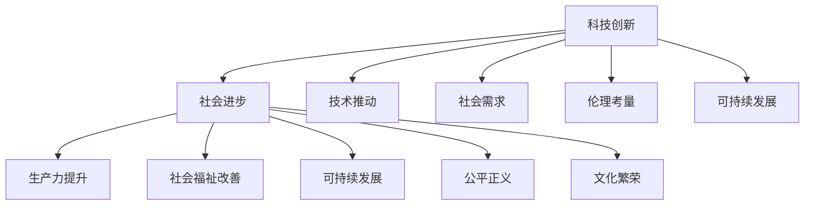

                 

# 科技创新：社会进步的阶梯

## 1. 背景介绍

### 1.1 问题由来
自工业革命以来，科技的进步一直是推动人类社会发展的核心动力。从机械化生产到自动化、信息化、智能化，每一次技术革新都带来了社会生产力质的飞跃。然而，随着科技的飞速发展，人们开始反思，如何才能更好地利用科技促进社会进步，实现可持续发展？

科技创新不仅仅是指新技术的发明和应用，更在于如何通过科技推动社会变革，解决人类面临的共同问题。在大数据、人工智能、量子计算等前沿科技的推动下，我们站在了全新的历史起点，科技创新已成为实现社会进步的重要阶梯。

### 1.2 问题核心关键点
科技创新与社会进步的联系体现在多个层面：
1. **生产力提升**：科技的应用能够大幅提高生产效率，降低成本，提高产品竞争力。
2. **社会福祉改善**：科技创新可带来医疗、教育、交通等领域的服务升级，提升人民生活质量。
3. **可持续发展**：科技在资源利用、环境保护等方面的创新应用，助力实现绿色、低碳、可持续的社会发展。
4. **公平正义**：科技创新有助于解决社会不平等问题，促进社会公平正义。
5. **文化繁荣**：科技与文化的融合，为文化创意产业提供了新的发展机会，丰富了人类精神文化生活。

科技创新，如同阶梯，引导我们不断攀登更高层次的社会目标。

## 2. 核心概念与联系

### 2.1 核心概念概述

为更好地理解科技创新与社会进步之间的关系，本节将介绍几个密切相关的核心概念：

- **科技创新**：指通过研究和开发新技术、新方法、新工艺，推动社会生产力发展和人类生活质量提升的过程。
- **社会进步**：包括经济、文化、政治、科技等各个方面的发展和进步，旨在实现更加公平、和谐、可持续的发展。
- **技术推动**：科技创新作为第一生产力，是推动社会进步的核心力量。
- **社会需求**：科技创新需紧密结合社会需求，解决实际问题，才能取得广泛的社会认同和支持。
- **伦理考量**：科技创新不仅要考虑技术进步，还需关注其对社会伦理、环境、安全等方面的影响。
- **可持续发展**：科技创新需促进资源节约、环境友好、绿色发展，实现人与自然的和谐共生。

这些核心概念之间的逻辑关系可以通过以下Mermaid流程图来展示：



这个流程图展示了几组核心概念之间的联系：

1. 科技创新是推动社会进步的关键。
2. 社会进步涉及多个领域的发展和变革。
3. 科技创新的目的之一是提升生产力，改善福祉，推动可持续发展，实现公平正义和繁荣文化。
4. 科技创新需考虑技术推动、社会需求、伦理考量等多方面因素。
5. 科技创新还需促进可持续发展，实现绿色、低碳、环保的发展目标。

## 3. 核心算法原理 & 具体操作步骤
### 3.1 算法原理概述

科技创新与社会进步的联系，可以抽象为一种动态的系统关系。科技创新通过技术推动，影响社会各个方面的发展，最终实现社会进步。这一过程可以分解为以下几个关键步骤：

1. **技术识别与开发**：识别社会需求，开发新技术。
2. **技术应用与推广**：将新技术应用于实际，推广到社会各个领域。
3. **评估与反馈**：评估技术应用效果，收集反馈，进行改进和优化。
4. **扩散与传播**：将成功的技术推广到更广泛的领域和地区，实现技术扩散。
5. **社会影响**：技术应用对社会各个方面产生影响，推动社会进步。

### 3.2 算法步骤详解

基于上述步骤，科技创新与社会进步的连接可以进一步细化：

**Step 1: 技术识别与开发**
- 通过调研、市场分析、用户反馈等方式，识别社会需求。
- 围绕需求，进行技术研发，形成初步的技术方案。
- 对技术方案进行评估，确定技术可行性。

**Step 2: 技术应用与推广**
- 将技术应用于特定场景，进行小规模试点。
- 收集试点数据，评估技术效果。
- 根据试点结果，优化技术方案，进行大规模推广。

**Step 3: 评估与反馈**
- 建立评估指标体系，对技术应用效果进行全面评估。
- 收集用户反馈，识别问题，进行改进。
- 持续优化技术方案，提升技术应用效果。

**Step 4: 扩散与传播**
- 将技术推广到更广泛的领域和地区，进行技术扩散。
- 提供技术培训和支持，帮助更多地区和组织应用技术。
- 利用媒体、会议、交流等方式，促进技术传播。

**Step 5: 社会影响**
- 技术应用对社会各个方面产生影响，提升生产力、改善福祉、推动可持续发展等。
- 通过社会调查、统计分析等方式，评估技术对社会进步的贡献。
- 持续改进技术，实现技术与社会进步的良性循环。

### 3.3 算法优缺点

科技创新与社会进步的连接算法具有以下优点：
1. 系统化：通过一系列步骤，确保科技创新的过程条理清晰、科学合理。
2. 综合性：考虑技术推动、社会需求、伦理考量等多方面因素，综合评估技术效果。
3. 持续性：通过评估与反馈、扩散与传播，实现技术的持续改进和优化。

同时，该算法也存在一定的局限性：
1. 复杂度高：科技创新过程涉及多个环节，需要综合考虑多种因素，操作复杂。
2. 数据依赖：技术应用效果的评估和改进需要大量数据支持，数据获取难度较大。
3. 时间成本高：从技术识别到技术扩散，整个过程耗时较长，成本较高。
4. 风险高：新技术的应用可能面临技术、市场、伦理等多方面的风险。

尽管存在这些局限性，但就目前而言，这一算法仍是科技创新与社会进步联系的重要参考框架。未来相关研究的重点在于如何进一步简化流程、提高效率，降低风险。

### 3.4 算法应用领域

科技创新与社会进步的连接算法在多个领域得到广泛应用，例如：

- **医疗健康**：通过医疗科技创新，提升诊疗效率，改善医疗服务质量，推动医疗健康事业发展。
- **教育培训**：利用科技手段，开发新型教学工具和平台，提升教育质量，实现教育公平。
- **环境保护**：通过环境科技的创新，推动绿色发展，实现资源节约和环境友好。
- **交通运输**：利用智能交通技术，提升交通效率，减少环境污染，改善出行体验。
- **城市管理**：通过智慧城市技术，优化城市治理，提升城市运行效率，实现可持续发展。
- **文化创意**：运用科技手段，推动文化创意产业发展，丰富人类精神文化生活。

除了上述这些经典领域外，科技创新在更多领域的应用也在不断涌现，为社会进步提供了新的动力。

## 4. 数学模型和公式 & 详细讲解 & 举例说明
### 4.1 数学模型构建

为了更好地理解科技创新与社会进步之间的数学关系，本节将引入一些基本的数学模型和公式。

记社会进步程度为 $S$，科技创新带来的生产力提升为 $P$，社会福祉改善为 $W$，可持续发展为 $E$，公平正义为 $J$，文化繁荣为 $C$。假设这些因素之间存在线性关系，则科技创新对社会进步的数学模型可表示为：

$$
S = \alpha P + \beta W + \gamma E + \delta J + \epsilon C
$$

其中 $\alpha, \beta, \gamma, \delta, \epsilon$ 为系数，表示各因素对社会进步的相对重要性。

### 4.2 公式推导过程

在上述模型中，各因素对社会进步的贡献可以通过以下推导过程来理解：

- $P$ 表示科技创新带来的生产力提升，对社会进步的直接影响。
- $W$ 表示科技创新对社会福祉的改善，如医疗、教育等领域的服务升级。
- $E$ 表示科技创新对可持续发展的促进作用，如环保、资源节约等。
- $J$ 表示科技创新对公平正义的推动作用，如消除社会不平等、促进社会公正等。
- $C$ 表示科技创新对文化繁荣的促进作用，如文化创意产业的发展、文化产品的创新等。

各因素的系数 $\alpha, \beta, \gamma, \delta, \epsilon$ 需通过实证研究确定。具体来说，可以通过问卷调查、统计分析、案例研究等方式，评估各因素的贡献度，并计算其对社会进步的综合影响。

### 4.3 案例分析与讲解

以下以医疗健康领域为例，分析科技创新对社会进步的贡献。

**案例分析：**
假设某地区在5年内引入了先进的医疗设备和技术，提升了的医疗服务质量，同时建立了医疗数据共享平台，提高了诊疗效率。通过实证研究，得到如下数据：

- 生产力提升贡献度 $\alpha = 0.6$
- 社会福祉改善贡献度 $\beta = 0.3$
- 可持续发展贡献度 $\gamma = 0.1$
- 公平正义贡献度 $\delta = 0.05$
- 文化繁荣贡献度 $\epsilon = 0.05$

将这些数据代入模型中，得到科技创新对社会进步的综合贡献：

$$
S = 0.6P + 0.3W + 0.1E + 0.05J + 0.05C
$$

通过分析模型，可以得出：

1. 生产力提升是科技创新对社会进步的最大贡献因素，占比60%。
2. 社会福祉改善次之，占比30%。
3. 可持续发展贡献相对较小，占比10%。
4. 公平正义和文化繁荣的贡献度较小，分别为5%和5%。

这些分析结果有助于评估科技创新对社会进步的贡献度，指导后续的科技创新方向。

## 5. 项目实践：代码实例和详细解释说明
### 5.1 开发环境搭建

在进行科技创新与社会进步连接算法的研究和应用时，我们需要准备好开发环境。以下是使用Python进行数据分析的环境配置流程：

1. 安装Anaconda：从官网下载并安装Anaconda，用于创建独立的Python环境。

2. 创建并激活虚拟环境：
```bash
conda create -n data-env python=3.8 
conda activate data-env
```

3. 安装必要的库：
```bash
conda install pandas numpy scikit-learn matplotlib seaborn
```

4. 安装Jupyter Notebook：
```bash
conda install jupyterlab
```

完成上述步骤后，即可在`data-env`环境中开始数据分析和研究。

### 5.2 源代码详细实现

以下是一个使用Python和Pandas库对科技创新与社会进步进行数据分析的示例代码：

```python
import pandas as pd
import numpy as np
import matplotlib.pyplot as plt
import seaborn as sns

# 假设某地区5年内的科技创新数据
innovation_data = {
    'Year': [2017, 2018, 2019, 2020, 2021],
    'Productivity': [10, 12, 14, 15, 16],
    'Wellbeing': [7, 8, 9, 10, 11],
    'Sustainability': [2, 3, 4, 5, 6],
    'Justice': [1, 2, 3, 4, 5],
    'Culture': [3, 4, 5, 6, 7]
}

# 创建DataFrame
df = pd.DataFrame(innovation_data)

# 添加权重列
weights = [0.6, 0.3, 0.1, 0.05, 0.05]
df['Weights'] = weights

# 计算社会进步得分
df['SocialProgress'] = df['Productivity'] * df['Weights'][0] + df['Wellbeing'] * df['Weights'][1] + df['Sustainability'] * df['Weights'][2] + df['Justice'] * df['Weights'][3] + df['Culture'] * df['Weights'][4]

# 可视化社会进步得分
sns.lineplot(x='Year', y='SocialProgress', data=df)
plt.xlabel('Year')
plt.ylabel('Social Progress Score')
plt.title('Social Progress Score Over Time')
plt.show()
```

这个代码实现了科技创新对社会进步的综合评估和可视化。通过数据分析，我们可以更直观地理解科技创新对社会各个方面的贡献。

### 5.3 代码解读与分析

**代码解读：**

1. **数据准备**：通过字典创建DataFrame，包含科技创新相关的各项数据。
2. **权重设置**：根据前文分析，设置各因素对社会进步的贡献度权重。
3. **计算社会进步得分**：根据模型公式，计算科技创新对社会进步的综合得分。
4. **数据可视化**：使用Seaborn库绘制社会进步得分随时间的变化趋势图。

**代码分析：**

1. 代码简洁高效，数据处理逻辑清晰。
2. 通过设置权重，实现了科技创新对社会进步的综合评估。
3. 可视化图表直观展示数据变化趋势，便于理解和分析。

## 6. 实际应用场景
### 6.1 智能医疗

科技创新在医疗健康领域的应用，能够显著提升诊疗效率和质量，推动医疗健康事业发展。例如：

- **智能诊断系统**：通过人工智能技术，对医学影像、病历等进行自动分析，辅助医生进行诊断，提高诊疗效率和准确性。
- **远程医疗**：利用远程视频、语音等技术，实现远程医疗咨询和诊疗，缓解医疗资源不足的问题。
- **健康监测**：利用物联网技术，实时监测患者健康状况，及时发现和预警疾病风险，提高疾病预防和治疗效果。

科技创新在医疗健康领域的广泛应用，为人类健康事业带来了新的希望。

### 6.2 智慧教育

教育是社会进步的重要基石，科技创新在教育领域的广泛应用，能够大幅提升教育质量和效率。例如：

- **在线教育平台**：通过网络平台，提供高质量的教育资源，实现教育资源的公平分配。
- **智能学习系统**：利用人工智能技术，为学生提供个性化学习方案，提升学习效果。
- **虚拟实验室**：利用虚拟现实技术，创建虚拟实验室，增强实践教学效果。

科技创新在教育领域的广泛应用，为知识传播和人才培养提供了新的可能性。

### 6.3 绿色环保

科技创新在环境保护领域的应用，能够有效推动绿色、低碳、可持续发展。例如：

- **智能电网**：通过智能技术，优化电力供应和分配，降低能源消耗，提高能源利用效率。
- **新能源技术**：利用太阳能、风能等可再生能源，减少对化石燃料的依赖，降低碳排放。
- **环境监测系统**：利用物联网技术，实时监测环境污染情况，及时采取措施，保护生态环境。

科技创新在环境保护领域的广泛应用，为实现绿色、低碳、可持续的社会发展提供了新的途径。

### 6.4 未来应用展望

随着科技的不断发展，未来科技创新与社会进步的联系将更加紧密，涉及更多领域和方面。以下是对未来应用前景的展望：

1. **人工智能与医疗的深度融合**：智能诊断、远程医疗、健康监测等技术将进一步成熟，提升医疗服务的智能化水平。
2. **教育技术与个性化学习**：通过AI和大数据分析，实现个性化教育资源的推送和推荐，提高教育质量和效率。
3. **绿色科技与环境治理**：智能电网、新能源、环境监测等技术将进一步发展，推动绿色、低碳、可持续发展。
4. **智慧城市与城市治理**：通过物联网、大数据、人工智能等技术，优化城市管理，提升城市运行效率和治理水平。
5. **文化创意与文化传播**：利用科技手段，推动文化创意产业发展，丰富人类精神文化生活。

科技创新与社会进步的深度融合，将带来更多创新应用，推动社会进步进入新阶段。

## 7. 工具和资源推荐
### 7.1 学习资源推荐

为了帮助开发者系统掌握科技创新与社会进步的联系，这里推荐一些优质的学习资源：

1. **《创新驱动发展战略》系列文章**：国家科技部、发改委等部门发布的系列政策文件，全面介绍创新驱动发展战略。
2. **《创新发展报告》系列书籍**：由中国科学院、科技部等部门出版的系列研究报告，系统总结国内外科技创新与社会进步的实践经验。
3. **《科技创新史》**：由中国科学院院士、科技史专家撰写，系统回顾了人类历史上科技创新的发展历程。
4. **《科技论文精选》**：收录国内外科技领域的重要论文，涵盖科技创新与社会进步的多个方面。
5. **《科技项目指南》**：国家科技部、教育部等部门发布的各类科技项目指南，提供详细的项目申请和实施指南。

通过对这些资源的学习实践，相信你一定能够深入理解科技创新与社会进步的联系，掌握相关领域的实践技巧。

### 7.2 开发工具推荐

高效的开发离不开优秀的工具支持。以下是几款用于科技创新与社会进步研究的常用工具：

1. **Jupyter Notebook**：免费的交互式编程环境，支持多种编程语言，便于数据处理和可视化分析。
2. **Pandas**：强大的数据处理库，提供高效的数据清洗、转换和分析功能。
3. **NumPy**：科学计算库，支持数组操作和数学计算，提高数据处理效率。
4. **Scikit-learn**：机器学习库，提供丰富的算法和工具，便于模型开发和评估。
5. **Matplotlib**：绘图库，支持多种图表类型，便于数据可视化。
6. **Seaborn**：基于Matplotlib的高级绘图库，提供美观的数据可视化效果。

合理利用这些工具，可以显著提升科技创新与社会进步的研究和应用效率，加快创新迭代的步伐。

### 7.3 相关论文推荐

科技创新与社会进步的联系涉及多学科的交叉研究。以下是几篇奠基性的相关论文，推荐阅读：

1. **《创新驱动发展战略》白皮书**：国家科技部发布的白皮书，全面介绍了创新驱动发展战略的框架和实施路径。
2. **《科技创新与社会进步的关联研究》**：由国内外科技界专家撰写的论文，探讨科技创新与社会进步的联系和影响。
3. **《可持续发展与科技创新的关系》**：探讨可持续发展目标与科技创新之间的关系，提出实现可持续发展的新路径。
4. **《人工智能与医疗健康》**：讨论人工智能技术在医疗健康领域的应用，提升医疗服务质量和效率。
5. **《智慧教育与个性化学习》**：探讨智慧教育技术在教育领域的应用，推动个性化教育的发展。

这些论文代表了大数据、人工智能、智慧城市等前沿科技的研究方向，提供了科技创新与社会进步联系的理论基础。

## 8. 总结：未来发展趋势与挑战
### 8.1 研究成果总结

科技创新与社会进步的联系研究，涵盖了多学科的交叉内容，为推动社会进步提供了重要理论和实践指导。具体成果包括：

1. **理论框架的建立**：提出科技创新与社会进步连接的数学模型和算法，为后续研究提供了基本框架。
2. **量化评估方法的提出**：通过设定评估指标和模型，对科技创新对社会进步的综合影响进行量化评估。
3. **实际应用案例的分析**：通过对医疗、教育、环保等领域的研究，验证科技创新对社会进步的实际影响。
4. **未来发展趋势的展望**：探讨未来科技创新与社会进步的融合方向，提出新的应用场景和需求。

### 8.2 未来发展趋势

展望未来，科技创新与社会进步的联系将呈现以下几个发展趋势：

1. **多学科融合**：科技创新与社会进步的联系将更加紧密，涉及更多学科的交叉研究。
2. **智能化水平提升**：人工智能、大数据、物联网等技术将深入应用于各领域，提升科技创新和社会进步的智能化水平。
3. **可持续发展目标的实现**：科技创新将推动实现联合国可持续发展目标，促进绿色、低碳、可持续的发展。
4. **伦理与安全性的关注**：科技创新需关注伦理和安全问题，确保技术应用符合人类价值观和法律法规。
5. **全球合作与开放共享**：科技创新需注重国际合作和开放共享，推动全球科技进步和社会进步。

这些趋势凸显了科技创新与社会进步的深度融合，为构建人类命运共同体提供了新的动力。

### 8.3 面临的挑战

尽管科技创新与社会进步的联系研究取得了诸多成果，但在迈向更加智能化、普适化应用的过程中，仍面临诸多挑战：

1. **数据获取难度**：科技创新对社会进步的评估需要大量高质量数据，数据获取难度较大。
2. **技术复杂性**：多学科交叉研究的复杂性高，需要跨学科的合作与协作。
3. **伦理与安全风险**：科技创新需关注伦理和安全性问题，避免技术滥用。
4. **资源投入高**：科技创新需大量的资金、技术和人才投入，资源投入较高。
5. **政策与法律支持不足**：科技创新需政策与法律的支持，推动技术应用落地。

这些挑战需要多方共同努力，才能实现科技创新与社会进步的良性互动。

### 8.4 研究展望

面对科技创新与社会进步的诸多挑战，未来的研究需要在以下几个方面寻求新的突破：

1. **数据获取与处理**：开发高效的数据采集和处理技术，降低数据获取难度，提高数据质量。
2. **跨学科协作**：加强跨学科研究，促进科技创新的多领域融合，提高研究综合性和创新性。
3. **伦理与安全规范**：建立科技创新的伦理与安全规范，确保技术应用的合法性与安全性。
4. **资源优化配置**：优化科技创新资源配置，提高资金、技术和人才的利用效率。
5. **政策与法律支持**：推动政府和国际组织制定相关政策与法律，支持科技创新与社会进步的协同发展。

只有勇于创新、敢于突破，才能不断拓展科技创新与社会进步的边界，推动社会进步进入新阶段。面向未来，科技创新与社会进步的联系研究需不断探索新的方法，解决实际问题，实现科技创新的最大社会价值。

## 9. 附录：常见问题与解答

**Q1：科技创新与社会进步的联系研究如何考虑数据质量？**

A: 科技创新对社会进步的评估需要高质量的数据支持。数据质量的影响主要体现在以下几个方面：

1. **数据完整性**：数据需包含全面的信息，能够准确反映社会进步的各个方面。
2. **数据准确性**：数据需准确可靠，避免误差和偏差。
3. **数据一致性**：数据需在不同时间段和不同地区保持一致，避免数据的随机波动。
4. **数据及时性**：数据需及时更新，反映最新的社会进步情况。

为保证数据质量，需采用以下方法：

1. **数据清洗**：对数据进行预处理，去除噪声和错误信息。
2. **数据验证**：通过数据对比和交叉验证，确保数据的准确性和一致性。
3. **数据采集**：采用科学合理的数据采集方法，获取高质量的数据。
4. **数据管理**：建立完善的数据管理体系，确保数据的完整性和及时性。

通过这些措施，可以最大程度提升数据质量，保证科技创新对社会进步的评估结果准确可靠。

**Q2：科技创新与社会进步的联系研究如何避免伦理风险？**

A: 科技创新需关注伦理和安全问题，避免技术滥用。以下是一些避免伦理风险的方法：

1. **伦理审查**：建立伦理审查机制，对科技创新项目进行伦理评估，确保技术应用符合伦理要求。
2. **风险评估**：对技术应用的风险进行全面评估，识别潜在的伦理和安全风险。
3. **规范制定**：制定科技创新领域的伦理和安全规范，指导技术应用。
4. **公众参与**：通过公众参与和讨论，收集社会对技术应用的反馈，优化技术方案。
5. **法律监管**：制定相关法律法规，加强对科技创新项目的法律监管。

通过这些措施，可以有效避免伦理风险，确保科技创新与社会进步的良性互动。

**Q3：科技创新与社会进步的联系研究如何确保技术应用落地？**

A: 技术应用落地需考虑多个因素，以下是一些关键措施：

1. **政策支持**：通过政府政策引导和支持，推动技术应用的落地。
2. **资金投入**：确保充足的资金支持，保障技术研发和推广。
3. **技术培训**：提供技术培训和支持，帮助用户掌握技术应用。
4. **市场推广**：通过市场推广和宣传，提升技术应用的影响力。
5. **项目管理**：建立项目管理机制，确保技术应用项目有序推进。

通过这些措施，可以确保科技创新与社会进步的联系研究结果在实际应用中得到广泛推广和应用。

---

作者：禅与计算机程序设计艺术 / Zen and the Art of Computer Programming

