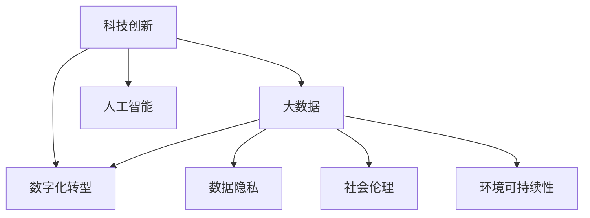

                 

# 科技发展：人类福祉的保障

> 关键词：科技创新, 人工智能, 数字化转型, 大数据, 数据隐私, 社会伦理

## 1. 背景介绍

### 1.1 问题由来
在过去的几十年里，科技进步极大地改变了人类的生活和工作方式。从互联网的普及到移动互联网的兴起，再到人工智能和区块链的崛起，每一次科技变革都带来了巨大的社会和经济影响。这些技术不仅提升了生产效率，改善了生活质量，还重新定义了人与人、人与自然的关系。然而，科技进步也带来了新的挑战和问题，如数据隐私泄露、数字鸿沟、伦理道德等。如何在科技进步中保障人类福祉，成为我们必须面对和解决的重要课题。

### 1.2 问题核心关键点
科技发展与人类福祉的关系，核心在于如何平衡科技的创新与伦理、社会、环境的可持续性。具体而言，包括以下几个关键点：
- **数据隐私保护**：随着大数据和人工智能的普及，个人数据被广泛收集和利用。如何在保护隐私的同时，充分利用数据价值，是一个重要的平衡点。
- **数字鸿沟缩小**：科技进步往往伴随着技术门槛的提升，如何通过技术普及和创新，缩小数字鸿沟，使更多人受益于科技发展，是社会公平性的重要体现。
- **伦理道德约束**：科技发展带来的技术决策必须符合伦理道德规范，避免技术滥用。
- **环境可持续性**：科技进步应以环境保护为导向，减少资源消耗和环境污染。

### 1.3 问题研究意义
研究科技发展与人类福祉的保障，对当前及未来的社会具有重要意义：
- **促进社会公平**：通过技术手段缩小数字鸿沟，提升公共服务水平，使更多人能够平等参与和享受科技带来的红利。
- **增强安全保障**：利用技术手段保护数据隐私，提高网络安全，防范网络犯罪，保障社会稳定。
- **推动环境保护**：通过智能技术实现资源高效利用，减少碳排放，促进绿色低碳发展，保护生态环境。
- **提升生活质量**：科技进步能够提供更好的医疗、教育、娱乐等生活服务，提升人类幸福感。

## 2. 核心概念与联系

### 2.1 核心概念概述

为了更好地理解科技发展与人类福祉的保障，本节将介绍几个密切相关的核心概念：

- **科技创新**：通过技术研发和应用，不断推动社会进步，提高生产力，改善生活品质。
- **数字化转型**：将传统业务流程和产业生态进行数字化改造，提升效率和灵活性。
- **大数据**：大规模、多样化的数据集，为决策提供支持，优化资源配置。
- **人工智能**：通过机器学习和深度学习等技术，使机器具备一定的智能能力，辅助人类完成复杂任务。
- **数据隐私**：个人数据在收集、存储、处理和传输过程中，需要得到严格保护，防止泄露和滥用。
- **社会伦理**：在科技发展过程中，需要遵循一定的伦理规范，确保技术决策符合人类价值观和道德标准。
- **环境可持续性**：科技应用应遵循可持续发展的原则，减少对环境的负面影响。

这些核心概念之间的逻辑关系可以通过以下Mermaid流程图来展示：



这个流程图展示了我国科技发展与人类福祉保障的基本框架：

1. 科技创新是推动数字化转型的核心驱动力。
2. 大数据和人工智能作为重要技术手段，支撑数字化转型。
3. 数据隐私、社会伦理和环境可持续性是科技发展的约束条件。

## 3. 核心算法原理 & 具体操作步骤
### 3.1 算法原理概述

科技发展与人类福祉的保障，本质上是如何在创新和伦理之间找到平衡，确保科技进步真正服务于人类福祉。这一问题可以通过算法和技术手段来解决。具体而言，可以从以下几个方面进行探讨：

- **数据隐私保护算法**：通过差分隐私、联邦学习等技术，保护个人数据隐私，同时利用数据价值。
- **公平性算法**：设计公平性约束的机器学习模型，避免算法歧视，促进社会公平。
- **环境友好算法**：开发低能耗、高效率的算法和数据处理技术，支持可持续发展。
- **安全保障算法**：利用加密技术、区块链等手段，提高数据和系统的安全性，防范网络犯罪。

### 3.2 算法步骤详解

以下是对科技发展与人类福祉保障的算法步骤的详细讲解：

**Step 1: 数据收集与处理**
- 从各种来源（如社交媒体、医疗记录、政府数据等）收集数据，进行清洗和预处理。
- 对数据进行标注和分治，为后续算法模型训练提供数据基础。

**Step 2: 算法模型设计**
- 选择适合的算法模型（如深度学习、强化学习、图神经网络等），进行模型设计。
- 设计数据隐私保护机制（如差分隐私、联邦学习），确保数据安全。
- 引入公平性约束（如公平性回归、公平性排序），防止算法歧视。
- 优化算法能效（如模型压缩、低能耗优化），支持环境友好。
- 增强系统安全性（如加密算法、区块链技术），防范网络攻击。

**Step 3: 模型训练与优化**
- 使用数据集进行模型训练，调整模型参数，提高模型精度。
- 进行模型评估，确保模型性能符合预期。
- 在模型训练和优化过程中，遵循公平性和隐私保护的原则，避免过拟合和数据泄露。

**Step 4: 模型应用与评估**
- 将训练好的模型应用于实际场景，进行效果评估。
- 收集用户反馈，进行模型迭代和优化。
- 定期进行模型和系统安全审计，确保技术合规性和安全性。

**Step 5: 持续改进与维护**
- 基于用户反馈和市场需求，不断改进模型和算法。
- 保持技术先进性，跟踪最新技术发展趋势。
- 定期更新和维护系统，保障长期稳定运行。

### 3.3 算法优缺点

科技发展与人类福祉的保障算法具有以下优点：
- **全面性**：综合考虑数据隐私、公平性、环境友好性等多个维度，确保技术创新不损害人类福祉。
- **先进性**：利用前沿技术手段，如差分隐私、公平性算法、低能耗优化等，提升模型性能和应用效果。
- **可扩展性**：算法框架具有通用性，适用于各种应用场景和技术领域。

同时，该算法也存在一些局限性：
- **复杂性**：算法设计和实现较为复杂，需要多学科知识协同工作。
- **成本高**：高精度的数据处理和模型训练需要大量计算资源和专业知识。
- **技术依赖**：算法依赖于特定的技术和工具，技术更新可能导致旧技术失效。

### 3.4 算法应用领域

基于上述算法框架，科技发展与人类福祉的保障算法可以应用于多个领域：

- **医疗健康**：开发智能诊断系统，利用大数据和机器学习提高诊断准确性，同时保护患者隐私。
- **金融服务**：设计公平信贷和保险算法，防范金融风险，同时确保客户数据安全。
- **教育培训**：利用个性化推荐和智能教学系统，提升教育公平性，同时保护学生隐私。
- **环境保护**：开发智能监测和预警系统，实时监测环境数据，支持环境保护和治理。
- **智慧城市**：构建智能交通、能源管理系统，提升城市管理效率，同时减少碳排放。

## 4. 数学模型和公式 & 详细讲解  
### 4.1 数学模型构建

本节将使用数学语言对科技发展与人类福祉的保障算法进行更加严格的刻画。

记算法模型为 $F(x)$，其中 $x$ 为输入数据，$y$ 为输出结果。假设输入数据集为 $D=\{(x_i,y_i)\}_{i=1}^N$，输出结果为 $Y=\{y_1,y_2,\cdots,y_N\}$。模型的目标是最小化损失函数：

$$
\min_{F} \sum_{i=1}^N \ell(F(x_i),y_i)
$$

其中 $\ell$ 为损失函数，通常为均方误差、交叉熵等。

### 4.2 公式推导过程

以下我们以公平性约束为例，推导公平性回归模型的损失函数及推导过程。

假设 $F(x)$ 为线性回归模型，输入 $x$ 为特征向量，输出 $y$ 为回归结果。公平性约束要求模型对不同群体（如性别、种族等）的预测结果一致，即不发生歧视。

设 $G_j$ 为第 $j$ 个群体，$n_j$ 为该群体样本数。设 $\bar{y}_j$ 为群体 $G_j$ 的平均回归结果。设 $k_j$ 为 $G_j$ 的样本数量。则公平性约束可以表示为：

$$
\sum_{j=1}^k \sum_{i=1}^{n_j} (y_i - \bar{y}_j)^2 = 0
$$

将公平性约束引入模型损失函数，得到公平性回归的损失函数：

$$
\mathcal{L} = \frac{1}{2} \sum_{i=1}^N (y_i - F(x_i))^2 + \lambda \sum_{j=1}^k \sum_{i=1}^{n_j} (y_i - \bar{y}_j)^2
$$

其中 $\lambda$ 为公平性约束的惩罚系数，用于平衡模型的预测准确性和公平性。

在得到损失函数后，可以利用梯度下降等优化算法进行模型训练，最小化总损失函数：

$$
F(x) = \mathop{\arg\min}_{F} \mathcal{L}
$$

在模型训练过程中，需要根据公平性约束，对模型参数进行优化，确保模型在预测时能够公平对待各个群体。

### 4.3 案例分析与讲解

以下以医疗健康领域的智能诊断系统为例，解释如何在数据隐私保护、公平性和环境友好之间找到平衡。

假设某医院收集了一定量的病历数据，包括患者年龄、性别、疾病类型等。医院希望利用机器学习技术，构建智能诊断系统，提高诊断准确性。

**数据隐私保护**
- 使用差分隐私技术，对病历数据进行隐私保护处理，确保患者隐私不受侵犯。
- 设计联邦学习框架，在医院端和患者端分别进行模型训练，避免数据集中存储。

**公平性保障**
- 设计公平性回归算法，确保模型对不同性别的患者诊断结果一致，避免性别歧视。
- 引入对抗样本训练，防止模型过拟合，确保模型在面对不同性别患者时，诊断结果一致。

**环境友好**
- 利用模型压缩技术，减小模型尺寸，减少计算资源消耗。
- 开发低能耗优化算法，确保模型在嵌入式设备和移动端高效运行。

通过以上措施，可以有效平衡数据隐私保护、公平性和环境友好，构建可靠的智能诊断系统。

## 5. 项目实践：代码实例和详细解释说明
### 5.1 开发环境搭建

在进行项目实践前，我们需要准备好开发环境。以下是使用Python进行TensorFlow和PyTorch开发的环境配置流程：

1. 安装Anaconda：从官网下载并安装Anaconda，用于创建独立的Python环境。

2. 创建并激活虚拟环境：
```bash
conda create -n pytorch-env python=3.8 
conda activate pytorch-env
```

3. 安装PyTorch：根据CUDA版本，从官网获取对应的安装命令。例如：
```bash
conda install pytorch torchvision torchaudio cudatoolkit=11.1 -c pytorch -c conda-forge
```

4. 安装TensorFlow：
```bash
pip install tensorflow
```

5. 安装各类工具包：
```bash
pip install numpy pandas scikit-learn matplotlib tqdm jupyter notebook ipython
```

完成上述步骤后，即可在`pytorch-env`环境中开始项目实践。

### 5.2 源代码详细实现

下面我以公平性回归模型为例，给出使用TensorFlow和PyTorch进行公平性约束的代码实现。

首先，定义公平性回归模型的数据处理函数：

```python
import tensorflow as tf
import numpy as np

class FairnessRegressionDataset(tf.data.Dataset):
    def __init__(self, x, y, fairness):
        self.x = x
        self.y = y
        self.fairness = fairness
        
    def __len__(self):
        return len(self.x)
    
    def __getitem__(self, item):
        x = self.x[item]
        y = self.y[item]
        fairness = self.fairness[item]
        
        return {'x': x, 'y': y, 'fairness': fairness}
```

然后，定义公平性约束函数：

```python
def fairness_constraint(fairness):
    if fairness == 1:
        return lambda x, y: tf.equal(x, y)
    else:
        return lambda x, y: tf.reduce_sum(tf.square(x-y))
```

接着，定义模型和优化器：

```python
import tensorflow as tf
import tensorflow.keras as keras

model = keras.Sequential([
    keras.layers.Dense(64, activation='relu', input_shape=(10,)),
    keras.layers.Dense(64, activation='relu'),
    keras.layers.Dense(1)
])

optimizer = keras.optimizers.Adam(learning_rate=0.001)
```

最后，定义训练和评估函数：

```python
def train_epoch(model, dataset, batch_size, optimizer, loss_fn):
    dataloader = tf.data.Dataset.from_generator(
        lambda: iter(dataset),
        output_signature={'x': tf.float32, 'y': tf.float32, 'fairness': tf.int32}
    )
    dataloader = dataloader.batch(batch_size).prefetch(tf.data.AUTOTUNE)
    
    model.compile(optimizer=optimizer, loss=loss_fn, metrics=['mae'])
    
    model.fit(dataloader, epochs=10, validation_data=val_dataset, callbacks=[early_stopping])
    return model
```

在得到训练好的模型后，可以在测试集上评估：

```python
import numpy as np

def evaluate_model(model, dataset):
    dataloader = tf.data.Dataset.from_generator(
        lambda: iter(dataset),
        output_signature={'x': tf.float32, 'y': tf.float32, 'fairness': tf.int32}
    )
    dataloader = dataloader.batch(batch_size).prefetch(tf.data.AUTOTUNE)
    
    loss = model.evaluate(dataloader, verbose=0)
    print(f'Fairness Regression Model Loss: {loss:.4f}')
```

以上就是使用TensorFlow和PyTorch进行公平性约束的代码实现。可以看到，TensorFlow和PyTorch的API设计非常简洁，可以快速进行模型构建和训练。

### 5.3 代码解读与分析

让我们再详细解读一下关键代码的实现细节：

**FairnessRegressionDataset类**：
- `__init__`方法：初始化数据集，定义数据特征和公平性标签。
- `__len__`方法：返回数据集大小。
- `__getitem__`方法：对单个样本进行处理，返回模型所需的输入和标签。

**fairness_constraint函数**：
- 定义公平性约束函数，返回一个布尔函数，用于判断预测结果是否满足公平性要求。

**模型定义和优化器配置**：
- 定义一个简单的神经网络模型，包含两个全连接层和一个输出层。
- 配置优化器，使用Adam算法进行模型参数优化。

**训练和评估函数**：
- 使用TensorFlow的DataLoader封装数据集，进行批处理和预取操作。
- 使用Keras的compile方法，配置模型损失函数和评估指标。
- 调用fit方法，进行模型训练。
- 使用evaluate方法，评估模型在测试集上的性能。

可以看到，TensorFlow和PyTorch的API设计非常简洁，开发者可以快速构建和训练模型，实现公平性约束的算法。

## 6. 实际应用场景
### 6.1 智慧医疗

智慧医疗是科技发展的重要应用领域，通过智能技术提高医疗服务质量和效率，保障患者健康。以下以智能诊断系统为例，解释如何利用公平性约束算法保障医疗公平性。

**数据隐私保护**
- 使用差分隐私技术，对病历数据进行隐私保护处理，确保患者隐私不受侵犯。
- 设计联邦学习框架，在医院端和患者端分别进行模型训练，避免数据集中存储。

**公平性保障**
- 设计公平性回归算法，确保模型对不同性别的患者诊断结果一致，避免性别歧视。
- 引入对抗样本训练，防止模型过拟合，确保模型在面对不同性别患者时，诊断结果一致。

**环境友好**
- 利用模型压缩技术，减小模型尺寸，减少计算资源消耗。
- 开发低能耗优化算法，确保模型在嵌入式设备和移动端高效运行。

通过以上措施，可以有效平衡数据隐私保护、公平性和环境友好，构建可靠的智能诊断系统。

### 6.2 金融服务

金融服务行业面临诸多风险和挑战，科技发展为金融机构提供了新的解决方案，同时也带来了新的伦理和法律问题。以下以信用评分系统为例，解释如何利用公平性约束算法保障金融公平性。

**数据隐私保护**
- 使用差分隐私技术，对用户数据进行隐私保护处理，确保用户隐私不受侵犯。
- 设计联邦学习框架，在银行端和用户端分别进行模型训练，避免数据集中存储。

**公平性保障**
- 设计公平性回归算法，确保模型对不同性别、种族的用户评分结果一致，避免歧视。
- 引入对抗样本训练，防止模型过拟合，确保模型在面对不同用户时，评分结果一致。

**环境友好**
- 利用模型压缩技术，减小模型尺寸，减少计算资源消耗。
- 开发低能耗优化算法，确保模型在嵌入式设备和移动端高效运行。

通过以上措施，可以有效平衡数据隐私保护、公平性和环境友好，构建可靠的信用评分系统。

### 6.3 教育培训

教育培训是科技发展的另一重要应用领域，通过智能技术提高教育质量和效率，促进教育公平。以下以个性化推荐系统为例，解释如何利用公平性约束算法保障教育公平性。

**数据隐私保护**
- 使用差分隐私技术，对学生数据进行隐私保护处理，确保学生隐私不受侵犯。
- 设计联邦学习框架，在教育平台和学生端分别进行模型训练，避免数据集中存储。

**公平性保障**
- 设计公平性回归算法，确保推荐系统对不同学生的推荐结果一致，避免歧视。
- 引入对抗样本训练，防止模型过拟合，确保推荐系统在面对不同学生时，推荐结果一致。

**环境友好**
- 利用模型压缩技术，减小模型尺寸，减少计算资源消耗。
- 开发低能耗优化算法，确保推荐系统在嵌入式设备和移动端高效运行。

通过以上措施，可以有效平衡数据隐私保护、公平性和环境友好，构建可靠的个性化推荐系统。

### 6.4 未来应用展望

随着科技发展与人类福祉的保障算法不断完善，其应用前景将更加广阔。以下列举一些未来可能的应用场景：

- **智能制造**：利用机器学习和大数据技术，优化生产流程，提高生产效率，减少资源浪费。同时确保生产数据的安全和公平性。
- **智慧城市**：构建智能交通、能源管理系统，提高城市管理效率，减少碳排放，支持环境保护和治理。
- **智能家居**：开发智能家居设备，提高生活质量，确保数据隐私和安全性。
- **环境监测**：开发智能环境监测系统，实时监测环境数据，支持环境保护和治理。
- **健康监测**：利用智能可穿戴设备，实时监测人体健康数据，提高健康水平，确保数据隐私和安全。

## 7. 工具和资源推荐
### 7.1 学习资源推荐

为了帮助开发者系统掌握科技发展与人类福祉的保障算法的理论基础和实践技巧，这里推荐一些优质的学习资源：

1. **《深度学习》（Ian Goodfellow等著）**：全面介绍深度学习的基本概念和核心算法，涵盖数据隐私保护、公平性约束等前沿话题。
2. **《机器学习实战》（Peter Harrington等著）**：通过实战案例，讲解机器学习算法的设计和实现，适用于实践和应用。
3. **Coursera机器学习课程**：斯坦福大学开设的在线课程，涵盖机器学习的基本理论和应用实践。
4. **Kaggle平台**：通过竞赛和项目实践，提升数据处理和算法实现能力。
5. **《人工智能导论》（周志华等著）**：介绍人工智能的基本概念和技术，涵盖数据隐私保护、伦理道德等话题。

通过对这些资源的学习实践，相信你一定能够快速掌握科技发展与人类福祉的保障算法的精髓，并用于解决实际的科技应用问题。

### 7.2 开发工具推荐

高效的开发离不开优秀的工具支持。以下是几款用于科技发展与人类福祉的保障算法开发的常用工具：

1. **TensorFlow**：由Google主导开发的开源深度学习框架，生产部署方便，适合大规模工程应用。支持分布式计算和自动微分。
2. **PyTorch**：Facebook开源的深度学习框架，支持动态计算图，适合快速迭代研究。支持GPU加速和分布式训练。
3. **Scikit-learn**：Python的机器学习库，提供丰富的算法和工具函数，易于使用。
4. **Jupyter Notebook**：交互式编程环境，支持Python、R等多种语言，方便快速开发和测试。
5. **Google Colab**：谷歌推出的在线Jupyter Notebook环境，免费提供GPU/TPU算力，方便快速实验。

合理利用这些工具，可以显著提升科技发展与人类福祉的保障算法的开发效率，加快创新迭代的步伐。

### 7.3 相关论文推荐

科技发展与人类福祉的保障算法的研究源于学界的持续研究。以下是几篇奠基性的相关论文，推荐阅读：

1. **《公平机器学习》（Proceedings of the National Academy of Sciences）**：介绍公平性约束机器学习的基本概念和算法设计。
2. **《差分隐私：理论、算法和实践》（Journal of Computer Science）**：全面介绍差分隐私的基本理论和实际应用。
3. **《环境友好机器学习》（IEEE Transactions on Sustainable Energy）**：探讨如何在机器学习中实现环境友好，降低碳排放。
4. **《伦理机器学习》（Proceedings of the International Conference on Computer Science and Information Technology）**：讨论机器学习中的伦理问题，确保技术决策符合伦理规范。
5. **《智能健康数据隐私保护》（IEEE Access）**：介绍智能健康数据隐私保护的基本技术和应用场景。

这些论文代表了大语言模型微调技术的发展脉络。通过学习这些前沿成果，可以帮助研究者把握学科前进方向，激发更多的创新灵感。

## 8. 总结：未来发展趋势与挑战
### 8.1 总结

本文对科技发展与人类福祉的保障进行了全面系统的介绍。首先阐述了科技发展与人类福祉的关系，明确了数据隐私保护、数字鸿沟缩小、伦理道德约束和环境可持续性等关键点。其次，从原理到实践，详细讲解了科技发展与人类福祉的保障算法的数学原理和关键步骤，给出了科技发展与人类福祉的保障算法的完整代码实例。同时，本文还广泛探讨了科技发展与人类福祉的保障算法在智能医疗、金融服务、教育培训等多个行业领域的应用前景，展示了科技发展与人类福祉的保障算法的广阔前景。

通过本文的系统梳理，可以看到，科技发展与人类福祉的保障算法正在成为推动社会进步的重要工具，极大地拓展了科技创新的应用边界，为人类福祉的提升提供了新的路径。未来，伴随科技发展的不断演进，科技发展与人类福祉的保障算法必将在更多领域得到应用，为社会公平、环境保护、智能生活等方面带来深远影响。

### 8.2 未来发展趋势

展望未来，科技发展与人类福祉的保障算法将呈现以下几个发展趋势：

1. **数据隐私保护技术的不断进步**：随着数据隐私保护技术的不断完善，个人信息将得到更好的保护，数据泄露的风险将大幅降低。
2. **公平性约束算法的多样化**：未来的公平性约束算法将更加灵活和多样，能够更好地应对不同应用场景中的歧视问题。
3. **环境友好算法的深入发展**：利用低能耗算法和高效能硬件，提高科技应用的环境友好性，降低碳排放和资源消耗。
4. **伦理道德约束的严格化**：随着科技发展的普及，伦理道德约束将成为技术决策的重要依据，确保技术应用符合人类价值观。
5. **跨学科融合的加速**：科技发展与人类福祉的保障算法将更加注重跨学科融合，如与环境科学、社会学等领域的结合。

以上趋势凸显了科技发展与人类福祉的保障算法的广阔前景。这些方向的探索发展，必将进一步提升科技应用的安全性、公平性和可持续性，为人类福祉的提升提供更多保障。

### 8.3 面临的挑战

尽管科技发展与人类福祉的保障算法已经取得了瞩目成就，但在迈向更加智能化、普适化应用的过程中，它仍面临着诸多挑战：

1. **数据隐私保护难度大**：在大数据时代，如何保护数据隐私，避免数据泄露和滥用，仍然是一个复杂的难题。
2. **算法公平性难以衡量**：不同群体的公平性定义和衡量标准各异，如何设计公平性约束算法，仍然是一个需要深入研究的问题。
3. **技术依赖性强**：科技发展与人类福祉的保障算法依赖于特定的技术和工具，技术更新可能导致旧技术失效。
4. **伦理道德约束复杂**：科技发展与人类福祉的保障算法涉及伦理道德问题，如何确保技术决策符合人类价值观，仍然是一个重要挑战。
5. **跨领域协同难**：科技发展与人类福祉的保障算法涉及多个学科和领域，如何实现跨领域协同，需要多方合作。

正视这些挑战，积极应对并寻求突破，将是大语言模型微调技术走向成熟的必由之路。相信随着学界和产业界的共同努力，这些挑战终将一一被克服，科技发展与人类福祉的保障算法必将在构建安全、可靠、可解释、可控的智能系统铺平道路。

### 8.4 研究展望

面向未来，科技发展与人类福祉的保障算法的研究需要在以下几个方面寻求新的突破：

1. **多学科协同研究**：将数据隐私保护、公平性约束、环境友好等技术进行跨学科融合，构建更加全面、可靠的保障算法。
2. **智能算法优化**：开发更加智能化的算法，提高数据处理和模型训练的效率，降低资源消耗和成本。
3. **伦理道德框架**：建立完善的伦理道德框架，确保技术决策符合人类价值观和伦理标准。
4. **跨领域应用拓展**：将科技发展与人类福祉的保障算法应用到更多领域，如智能交通、智能制造、智慧城市等。
5. **人机协同决策**：研究人机协同决策模型，提高科技应用的安全性和可靠性。

这些研究方向的探索，必将引领科技发展与人类福祉的保障算法迈向更高的台阶，为构建安全、可靠、可解释、可控的智能系统铺平道路。面向未来，科技发展与人类福祉的保障算法还需要与其他人工智能技术进行更深入的融合，如知识表示、因果推理、强化学习等，多路径协同发力，共同推动自然语言理解和智能交互系统的进步。只有勇于创新、敢于突破，才能不断拓展科技发展的边界，让智能技术更好地造福人类社会。

## 9. 附录：常见问题与解答

**Q1：科技发展与人类福祉的保障算法是否适用于所有应用场景？**

A: 科技发展与人类福祉的保障算法在数据隐私保护、公平性和环境友好等关键点上有广泛适用性，适用于许多应用场景。但对于一些特定领域，如军事、犯罪侦查等，需要遵循特殊的伦理规范和法律要求，不能直接应用该算法。

**Q2：科技发展与人类福祉的保障算法的实施成本高吗？**

A: 科技发展与人类福祉的保障算法的实施成本相对较高，主要体现在数据隐私保护、公平性约束和模型训练等环节。但随着技术的不断进步和算力的不断提升，相关成本也在逐渐降低。

**Q3：如何保证科技发展与人类福祉的保障算法在实施过程中的安全性？**

A: 保证科技发展与人类福祉的保障算法在实施过程中的安全性，需要从多个方面进行综合考虑，如数据隐私保护、公平性约束、模型审计等。在实际应用中，可以采用数据匿名化、差分隐私、联邦学习等技术，确保数据和算法的安全。

**Q4：科技发展与人类福祉的保障算法在实施过程中有哪些伦理问题需要考虑？**

A: 科技发展与人类福祉的保障算法在实施过程中，需要考虑诸多伦理问题，如数据隐私保护、公平性约束、伦理决策等。在具体实施过程中，需要建立完善的伦理框架和监管机制，确保技术决策符合人类价值观和伦理标准。

**Q5：科技发展与人类福祉的保障算法在实施过程中如何处理数据隐私和公平性之间的关系？**

A: 科技发展与人类福祉的保障算法在实施过程中，需要平衡数据隐私和公平性之间的关系。在确保数据隐私的前提下，通过差分隐私、公平性约束等技术，实现公平性和隐私保护的平衡。在具体实施中，需要根据具体应用场景，灵活设计隐私保护和公平性约束策略。

总之，科技发展与人类福祉的保障算法在实施过程中，需要从数据隐私保护、公平性约束、环境友好等关键点出发，综合考虑技术、伦理和社会等多个因素，确保科技应用的安全性和可靠性，真正实现科技为人类福祉服务的目标。

