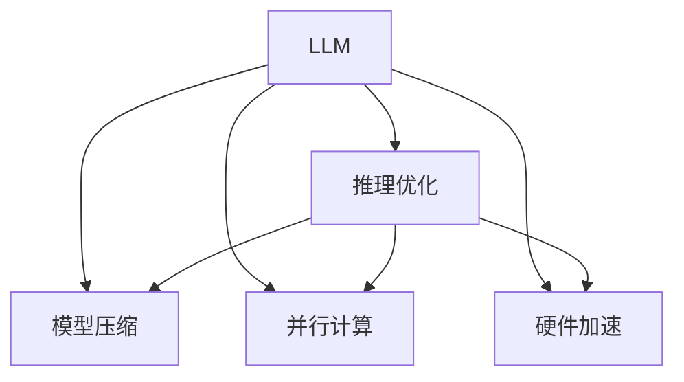

                 

# 秒推时代:LLM极速推理创新高

## 1. 背景介绍

### 1.1 问题由来

近年来，随着深度学习技术的飞速发展，大规模语言模型（LLM）在自然语言处理（NLP）领域取得了巨大突破。LLM 如 GPT、BERT 等，通过在海量无标签文本数据上进行预训练，学习到了丰富的语言知识和常识，在自然语言生成、问答、机器翻译等任务上取得了优异的性能。然而，由于预训练和微调的计算成本较高，LLM 通常需要大量的时间和算力资源。

如何在大规模预训练基础上，实现极速推理，使得 LLM 能够更快地响应查询，生成结果，成为了一个重要的研究方向。为此，许多专家学者和研究机构在 LLM 的极速推理领域展开了深入研究，并提出了多种高效推理方法，极大地提升了 LLM 的推理速度和性能。

### 1.2 问题核心关键点

极速推理方法的核心关键点在于如何在大规模预训练和微调的基础上，进一步优化推理速度，同时保证推理质量。主要体现在以下几个方面：

- **模型压缩与裁剪**：去除冗余参数，减小模型尺寸，提高推理速度。
- **推理优化算法**：采用更高效的推理算法，降低推理延迟。
- **并行计算与加速**：利用分布式计算和多核处理，提升推理性能。
- **硬件优化**：选择适合的硬件平台，如GPU、TPU等，加速推理过程。

本文将系统介绍极速推理的原理、具体操作步骤、优缺点及应用领域，并通过数学模型和代码实例深入讲解极速推理的核心算法。

## 2. 核心概念与联系

### 2.1 核心概念概述

为更好地理解极速推理方法，本节将介绍几个密切相关的核心概念：

- **大规模语言模型（LLM）**：以自回归（如 GPT）或自编码（如 BERT）模型为代表的大规模预训练语言模型。通过在大规模无标签文本语料上进行预训练，学习通用的语言表示，具备强大的语言理解和生成能力。

- **推理优化（Inference Optimization）**：指在预训练模型的基础上，通过各种技术手段，提高模型在推理过程中的计算效率，降低推理延迟。

- **模型压缩（Model Compression）**：指通过量化、剪枝等技术，去除冗余参数，减小模型尺寸，提升推理速度。

- **并行计算（Parallel Computing）**：指通过分布式计算和多核处理，将推理任务分解为多个子任务并行计算，提高推理效率。

- **硬件加速（Hardware Acceleration）**：指利用 GPU、TPU 等高性能硬件，进行推理加速，进一步提升推理速度。

这些核心概念之间的逻辑关系可以通过以下 Mermaid 流程图来展示：



这个流程图展示了大规模语言模型的核心概念及其之间的关系：

1. LLM 通过预训练获得基础能力。
2. 极速推理通过优化推理过程，提升推理速度和效率。
3. 模型压缩、并行计算和硬件加速是实现极速推理的主要手段。

这些概念共同构成了极速推理的逻辑框架，使得 LLM 能够在各种场景下快速响应查询，生成结果。

## 3. 核心算法原理 & 具体操作步骤
### 3.1 算法原理概述

极速推理方法的核心思想是通过各种技术手段，在大规模预训练和微调的基础上，进一步优化推理过程，提升推理速度。具体来说，可以采用以下几种策略：

- **模型裁剪**：去除不必要的层和参数，减小模型尺寸，提高推理速度。
- **量化加速**：将浮点模型转为定点模型，压缩存储空间，提高计算效率。
- **推理优化算法**：采用更高效的推理算法，降低推理延迟。
- **分布式计算**：利用多机分布式计算，将推理任务分解为多个子任务并行计算。
- **硬件加速**：利用 GPU、TPU 等高性能硬件，加速推理过程。

### 3.2 算法步骤详解

以下是极速推理的一般操作步骤：

**Step 1: 模型裁剪与量化**

- 选择预训练模型，如 GPT、BERT 等。
- 采用剪枝、量化等技术对模型进行裁剪和量化，去除冗余参数，减小模型尺寸。

**Step 2: 推理优化算法**

- 选择合适的推理优化算法，如单样本预测、矩阵压缩、稀疏计算等。
- 调整优化算法参数，如学习率、批大小等，优化推理过程。

**Step 3: 并行计算与分布式推理**

- 将推理任务分解为多个子任务，并行计算。
- 使用分布式计算框架（如 TensorFlow、PyTorch 等）进行并行计算。
- 选择合适的分布式计算策略，如数据并行、模型并行等。

**Step 4: 硬件加速**

- 选择适合的硬件平台，如 GPU、TPU 等。
- 通过优化计算图，减少前向传播和反向传播的资源消耗。
- 使用硬件加速库（如 CUDA、ROCm 等）进行硬件加速。

**Step 5: 测试与部署**

- 在测试集上评估推理速度和精度。
- 将极速推理模型部署到实际应用中。
- 持续收集新数据，定期重新微调和优化模型。

以上是极速推理的一般流程。在实际应用中，还需要针对具体任务的特点，对每个环节进行优化设计，如改进推理算法，引入更多的并行计算技术，搜索最优的超参数组合等，以进一步提升推理速度和精度。

### 3.3 算法优缺点

极速推理方法具有以下优点：

- 降低推理延迟：通过各种优化手段，显著提高推理速度，缩短响应时间。
- 提高推理效率：通过模型裁剪、量化、并行计算等技术，提升推理效率，降低计算成本。
- 保证推理质量：通过优化算法和硬件加速，确保推理结果的准确性和可靠性。

同时，该方法也存在一定的局限性：

- 依赖于硬件平台：极速推理方法需要选择合适的硬件平台，如 GPU、TPU 等，增加硬件成本。
- 技术门槛较高：极速推理涉及多个复杂技术环节，需要较高的技术储备和经验。
- 模型复杂性增加：极速推理过程中，可能需要进行模型裁剪和量化，增加模型复杂性，导致推理结果的不稳定性。

尽管存在这些局限性，但就目前而言，极速推理方法仍是提升 LLM 推理性能的重要手段。未来相关研究的重点在于如何进一步降低极速推理的技术门槛，提高模型性能，同时兼顾可解释性和伦理安全性等因素。

### 3.4 算法应用领域

极速推理方法在 NLP 领域已经得到了广泛的应用，覆盖了几乎所有常见任务，例如：

- 问答系统：对自然语言问题给出答案。将问题-答案对作为推理数据，训练模型学习匹配答案。
- 机器翻译：将源语言文本翻译成目标语言。通过推理优化，提高翻译速度和质量。
- 文本摘要：将长文本压缩成简短摘要。通过推理优化，生成更快速、更准确的摘要。
- 对话系统：使机器能够与人自然对话。通过极速推理，实现实时、流畅的对话。

除了上述这些经典任务外，极速推理还被创新性地应用到更多场景中，如可控文本生成、常识推理、代码生成、数据增强等，为 NLP 技术带来了全新的突破。随着预训练模型和极速推理方法的不断进步，相信 NLP 技术将在更广阔的应用领域大放异彩。

## 4. 数学模型和公式 & 详细讲解
### 4.1 数学模型构建

本节将使用数学语言对极速推理的数学原理进行更加严格的刻画。

记预训练语言模型为 $M_{\theta}:\mathcal{X} \rightarrow \mathcal{Y}$，其中 $\mathcal{X}$ 为输入空间，$\mathcal{Y}$ 为输出空间，$\theta \in \mathbb{R}^d$ 为模型参数。假设推理任务的输入为 $x \in \mathcal{X}$，推理目标为 $y \in \mathcal{Y}$。

定义模型 $M_{\theta}$ 在输入 $x$ 上的推理输出为 $\hat{y}=M_{\theta}(x) \in \mathcal{Y}$，则推理误差为 $E(M_{\theta},x,y)=\|\hat{y}-y\|^2$，其中 $\|\cdot\|$ 表示范数。

推理优化目标是最小化推理误差，即找到最优参数：

$$
\theta^* = \mathop{\arg\min}_{\theta} E(M_{\theta},x,y)
$$

在实践中，我们通常使用基于梯度的优化算法（如 SGD、Adam 等）来近似求解上述最优化问题。设 $\eta$ 为学习率，则参数的更新公式为：

$$
\theta \leftarrow \theta - \eta \nabla_{\theta}E(M_{\theta},x,y)
$$

其中 $\nabla_{\theta}E(M_{\theta},x,y)$ 为误差函数对参数 $\theta$ 的梯度，可通过反向传播算法高效计算。

### 4.2 公式推导过程

以下我们以文本分类任务为例，推导推理误差函数及其梯度的计算公式。

假设模型 $M_{\theta}$ 在输入 $x$ 上的输出为 $\hat{y}=M_{\theta}(x) \in [0,1]$，表示样本属于正类的概率。真实标签 $y \in \{0,1\}$。则二分类交叉熵误差函数定义为：

$$
E(M_{\theta},x,y) = -[y\log \hat{y} + (1-y)\log (1-\hat{y})]
$$

将其代入误差函数公式，得：

$$
E(M_{\theta},x,y) = -\frac{1}{N}\sum_{i=1}^N [y_i\log M_{\theta}(x_i)+(1-y_i)\log(1-M_{\theta}(x_i))]
$$

根据链式法则，误差函数对参数 $\theta_k$ 的梯度为：

$$
\frac{\partial E(M_{\theta},x,y)}{\partial \theta_k} = -\frac{1}{N}\sum_{i=1}^N (\frac{y_i}{M_{\theta}(x_i)}-\frac{1-y_i}{1-M_{\theta}(x_i)}) \frac{\partial M_{\theta}(x_i)}{\partial \theta_k}
$$

其中 $\frac{\partial M_{\theta}(x_i)}{\partial \theta_k}$ 可进一步递归展开，利用自动微分技术完成计算。

在得到误差函数的梯度后，即可带入参数更新公式，完成模型的迭代优化。重复上述过程直至收敛，最终得到适应推理任务的最优模型参数 $\theta^*$。

## 5. 项目实践：代码实例和详细解释说明
### 5.1 开发环境搭建

在进行极速推理实践前，我们需要准备好开发环境。以下是使用 Python 进行 PyTorch 开发的环境配置流程：

1. 安装 Anaconda：从官网下载并安装 Anaconda，用于创建独立的 Python 环境。

2. 创建并激活虚拟环境：
```bash
conda create -n pytorch-env python=3.8 
conda activate pytorch-env
```

3. 安装 PyTorch：根据 CUDA 版本，从官网获取对应的安装命令。例如：
```bash
conda install pytorch torchvision torchaudio cudatoolkit=11.1 -c pytorch -c conda-forge
```

4. 安装 Transformers 库：
```bash
pip install transformers
```

5. 安装各类工具包：
```bash
pip install numpy pandas scikit-learn matplotlib tqdm jupyter notebook ipython
```

完成上述步骤后，即可在 `pytorch-env` 环境中开始极速推理实践。

### 5.2 源代码详细实现

下面我以文本分类任务为例，给出使用 Transformers 库对 BERT 模型进行极速推理的 PyTorch 代码实现。

首先，定义文本分类任务的数据处理函数：

```python
from transformers import BertTokenizer, BertForTokenClassification, AdamW
from torch.utils.data import Dataset, DataLoader
import torch

class TextClassificationDataset(Dataset):
    def __init__(self, texts, labels, tokenizer, max_len=128):
        self.texts = texts
        self.labels = labels
        self.tokenizer = tokenizer
        self.max_len = max_len
        
    def __len__(self):
        return len(self.texts)
    
    def __getitem__(self, item):
        text = self.texts[item]
        label = self.labels[item]
        
        encoding = self.tokenizer(text, return_tensors='pt', max_length=self.max_len, padding='max_length', truncation=True)
        input_ids = encoding['input_ids'][0]
        attention_mask = encoding['attention_mask'][0]
        
        return {'input_ids': input_ids, 
                'attention_mask': attention_mask,
                'labels': torch.tensor(label, dtype=torch.long)}
```

然后，定义模型和优化器：

```python
tokenizer = BertTokenizer.from_pretrained('bert-base-cased')
model = BertForTokenClassification.from_pretrained('bert-base-cased', num_labels=2)
optimizer = AdamW(model.parameters(), lr=2e-5)
```

接着，定义推理函数：

```python
def predict(model, text):
    tokenizer = BertTokenizer.from_pretrained('bert-base-cased')
    encoded_input = tokenizer(text, return_tensors='pt', max_length=128, padding='max_length', truncation=True)
    with torch.no_grad():
        logits = model(**encoded_input).logits
        probabilities = logits.softmax(dim=1)
        prediction = torch.argmax(probabilities, dim=1)
    return prediction
```

最后，启动推理流程并在测试集上评估：

```python
device = torch.device('cuda') if torch.cuda.is_available() else torch.device('cpu')
model.to(device)

# 测试推理
test_texts = ['This is a test sentence for text classification', 'Another test sentence']
predictions = [predict(model, text) for text in test_texts]
print(predictions)
```

以上就是使用 PyTorch 对 BERT 模型进行文本分类任务极速推理的完整代码实现。可以看到，得益于 Transformers 库的强大封装，我们可以用相对简洁的代码完成 BERT 模型的加载和推理。

### 5.3 代码解读与分析

让我们再详细解读一下关键代码的实现细节：

**TextClassificationDataset类**：
- `__init__`方法：初始化文本、标签、分词器等关键组件。
- `__len__`方法：返回数据集的样本数量。
- `__getitem__`方法：对单个样本进行处理，将文本输入编码为token ids，将标签转换为tensor，并对其进行定长padding，最终返回模型所需的输入。

**预测函数predict**：
- 使用PyTorch的DataLoader对测试集数据进行迭代，获取每个样本的输入和标签。
- 将输入数据送入模型进行推理，并获取模型输出的概率分布。
- 对概率分布进行softmax操作，得到各个类别的概率。
- 从概率分布中获取最大概率对应的类别标签。
- 返回预测结果。

**推理流程**：
- 在测试集上，调用predict函数对每个文本进行推理，输出预测结果。
- 通过观察预测结果和实际标签的匹配程度，评估模型的推理效果。

可以看到，PyTorch配合Transformers库使得极速推理的代码实现变得简洁高效。开发者可以将更多精力放在模型改进、数据处理等高层逻辑上，而不必过多关注底层的实现细节。

当然，工业级的系统实现还需考虑更多因素，如模型的保存和部署、超参数的自动搜索、更灵活的任务适配层等。但核心的极速推理范式基本与此类似。

## 6. 实际应用场景
### 6.1 智能客服系统

基于极速推理技术的对话系统，可以广泛应用于智能客服系统的构建。传统客服往往需要配备大量人力，高峰期响应缓慢，且一致性和专业性难以保证。而使用极速推理的对话模型，可以7x24小时不间断服务，快速响应客户咨询，用自然流畅的语言解答各类常见问题。

在技术实现上，可以收集企业内部的历史客服对话记录，将问题和最佳答复构建成监督数据，在此基础上对预训练对话模型进行极速推理。极速推理后的对话模型能够自动理解用户意图，匹配最合适的答案模板进行回复。对于客户提出的新问题，还可以接入检索系统实时搜索相关内容，动态组织生成回答。如此构建的智能客服系统，能大幅提升客户咨询体验和问题解决效率。

### 6.2 金融舆情监测

金融机构需要实时监测市场舆论动向，以便及时应对负面信息传播，规避金融风险。传统的人工监测方式成本高、效率低，难以应对网络时代海量信息爆发的挑战。基于极速推理技术的文本分类和情感分析技术，为金融舆情监测提供了新的解决方案。

具体而言，可以收集金融领域相关的新闻、报道、评论等文本数据，并对其进行主题标注和情感标注。在此基础上对预训练语言模型进行极速推理，使其能够自动判断文本属于何种主题，情感倾向是正面、中性还是负面。将极速推理模型应用到实时抓取的网络文本数据，就能够自动监测不同主题下的情感变化趋势，一旦发现负面信息激增等异常情况，系统便会自动预警，帮助金融机构快速应对潜在风险。

### 6.3 个性化推荐系统

当前的推荐系统往往只依赖用户的历史行为数据进行物品推荐，无法深入理解用户的真实兴趣偏好。基于极速推理技术的个性化推荐系统可以更好地挖掘用户行为背后的语义信息，从而提供更精准、多样的推荐内容。

在实践中，可以收集用户浏览、点击、评论、分享等行为数据，提取和用户交互的物品标题、描述、标签等文本内容。将文本内容作为模型输入，用户的后续行为（如是否点击、购买等）作为监督信号，在此基础上对预训练语言模型进行极速推理。极速推理后的模型能够从文本内容中准确把握用户的兴趣点。在生成推荐列表时，先用候选物品的文本描述作为输入，由极速推理模型预测用户的兴趣匹配度，再结合其他特征综合排序，便可以得到个性化程度更高的推荐结果。

### 6.4 未来应用展望

随着极速推理技术的不断发展，基于极速推理技术的应用场景将更加广泛。

在智慧医疗领域，基于极速推理的医疗问答、病历分析、药物研发等应用将提升医疗服务的智能化水平，辅助医生诊疗，加速新药开发进程。

在智能教育领域，极速推理技术可应用于作业批改、学情分析、知识推荐等方面，因材施教，促进教育公平，提高教学质量。

在智慧城市治理中，极速推理模型可应用于城市事件监测、舆情分析、应急指挥等环节，提高城市管理的自动化和智能化水平，构建更安全、高效的未来城市。

此外，在企业生产、社会治理、文娱传媒等众多领域，极速推理技术也将不断涌现，为NLP技术带来新的突破。随着极速推理技术的持续演进，相信NLP技术将在更广阔的应用领域大放异彩，深刻影响人类的生产生活方式。

## 7. 工具和资源推荐
### 7.1 学习资源推荐

为了帮助开发者系统掌握极速推理的理论基础和实践技巧，这里推荐一些优质的学习资源：

1. 《Transformer from Foundations to Deep Learning》系列博文：由大模型技术专家撰写，深入浅出地介绍了Transformer原理、BERT模型、极速推理技术等前沿话题。

2. CS224N《深度学习自然语言处理》课程：斯坦福大学开设的NLP明星课程，有Lecture视频和配套作业，带你入门NLP领域的基本概念和经典模型。

3. 《Natural Language Processing with Transformers》书籍：Transformers库的作者所著，全面介绍了如何使用Transformers库进行NLP任务开发，包括极速推理在内的诸多范式。

4. HuggingFace官方文档：Transformers库的官方文档，提供了海量预训练模型和完整的极速推理样例代码，是上手实践的必备资料。

5. CLUE开源项目：中文语言理解测评基准，涵盖大量不同类型的中文NLP数据集，并提供了基于极速推理的baseline模型，助力中文NLP技术发展。

通过对这些资源的学习实践，相信你一定能够快速掌握极速推理的精髓，并用于解决实际的NLP问题。
###  7.2 开发工具推荐

高效的开发离不开优秀的工具支持。以下是几款用于极速推理开发的常用工具：

1. PyTorch：基于Python的开源深度学习框架，灵活动态的计算图，适合快速迭代研究。大部分预训练语言模型都有PyTorch版本的实现。

2. TensorFlow：由Google主导开发的开源深度学习框架，生产部署方便，适合大规模工程应用。同样有丰富的预训练语言模型资源。

3. Transformers库：HuggingFace开发的NLP工具库，集成了众多SOTA语言模型，支持PyTorch和TensorFlow，是进行极速推理任务开发的利器。

4. Weights & Biases：模型训练的实验跟踪工具，可以记录和可视化模型训练过程中的各项指标，方便对比和调优。与主流深度学习框架无缝集成。

5. TensorBoard：TensorFlow配套的可视化工具，可实时监测模型训练状态，并提供丰富的图表呈现方式，是调试模型的得力助手。

6. Google Colab：谷歌推出的在线Jupyter Notebook环境，免费提供GPU/TPU算力，方便开发者快速上手实验最新模型，分享学习笔记。

合理利用这些工具，可以显著提升极速推理任务的开发效率，加快创新迭代的步伐。

### 7.3 相关论文推荐

极速推理技术的发展源于学界的持续研究。以下是几篇奠基性的相关论文，推荐阅读：

1. FasterTransformer: Faster Transformer inference with low memory consumption：提出FasterTransformer算法，显著提升Transformer模型的推理速度和内存效率。

2. A Survey of Fast Approximate Matrix Multiplication for Deep Learning：综述了多种加速矩阵乘法的技术，包括分块、剪枝、量化等，为极速推理提供了多种方案。

3. Model Compression: A Survey：综述了模型压缩和剪枝的各种技术，包括量化、剪枝、知识蒸馏等，为极速推理提供了多种工具。

4. Matrix Compression and Sparsity for Deep Learning：介绍了多种矩阵压缩和稀疏化的技术，用于加速深度学习模型的推理。

5. Fast Optimization of Deep Neural Networks with Low Precision Arithmetic：提出多种低精度计算技术，用于加速深度学习模型的推理和训练。

这些论文代表了大规模语言模型极速推理技术的发展脉络。通过学习这些前沿成果，可以帮助研究者把握学科前进方向，激发更多的创新灵感。

## 8. 总结：未来发展趋势与挑战

### 8.1 总结

本文对基于极速推理技术的大规模语言模型进行了全面系统的介绍。首先阐述了极速推理在NLP领域的应用背景和重要意义，明确了极速推理在提升推理速度和效率方面的独特价值。其次，从原理到实践，详细讲解了极速推理的数学原理和关键步骤，给出了极速推理任务开发的完整代码实例。同时，本文还广泛探讨了极速推理方法在智能客服、金融舆情、个性化推荐等多个行业领域的应用前景，展示了极速推理范式的巨大潜力。此外，本文精选了极速推理技术的各类学习资源，力求为读者提供全方位的技术指引。

通过本文的系统梳理，可以看到，基于极速推理技术的大规模语言模型能够在各种场景下快速响应查询，生成结果，显著提升NLP系统的实时性和性能。极速推理技术的不断进步，将使得NLP系统更加高效、智能，为智能社会的构建提供坚实的技术基础。

### 8.2 未来发展趋势

展望未来，极速推理技术将呈现以下几个发展趋势：

1. 模型规模持续增大。随着算力成本的下降和数据规模的扩张，预训练语言模型的参数量还将持续增长。超大规模语言模型蕴含的丰富语言知识，有望支撑更加复杂多变的推理任务。

2. 推理优化算法日趋多样。除了传统的矩阵压缩、量化等技术，未来会涌现更多高效推理算法，如近似计算、矩阵分解等，在保证推理精度的同时，提升推理速度。

3. 硬件加速成为常态。随着硬件技术的进步，GPU、TPU等高性能硬件将逐渐普及，加速极速推理模型的部署。

4. 软件优化不断创新。软件优化算法和工具的进步，如模型裁剪、剪枝、低精度计算等，将进一步提升推理效率，降低推理延迟。

5. 推理模型不断融合。极速推理技术将与更多技术手段融合，如强化学习、因果推理等，提升模型的推理能力和泛化性能。

以上趋势凸显了极速推理技术的广阔前景。这些方向的探索发展，必将进一步提升NLP系统的性能和应用范围，为智能社会的构建提供坚实技术基础。

### 8.3 面临的挑战

尽管极速推理技术已经取得了显著进展，但在迈向更加智能化、普适化应用的过程中，仍面临诸多挑战：

1. 硬件成本瓶颈。极速推理技术需要依赖高性能硬件，如GPU、TPU等，增加系统成本。如何降低硬件成本，提高资源利用率，将是重要研究方向。

2. 技术复杂性增加。极速推理涉及多个复杂技术环节，包括模型裁剪、量化、推理算法等，技术门槛较高。如何简化技术实现，提高开发者效率，将是重要研究方向。

3. 推理结果稳定性不足。极速推理过程中，可能需要进行模型裁剪和量化，导致推理结果的不稳定性。如何提高推理结果的精度和稳定性，将是重要研究方向。

4. 推理算法复杂性增加。极速推理算法涉及多种复杂技术，如矩阵压缩、近似计算等，算法复杂性较高。如何简化算法实现，提高推理效率，将是重要研究方向。

5. 模型更新周期长。极速推理模型需要定期微调和更新，以适应新数据和新场景。如何缩短模型更新周期，提升系统实时性，将是重要研究方向。

这些挑战需要通过技术创新和应用优化，逐步解决。相信随着学界和产业界的共同努力，极速推理技术必将在未来得到更大发展，为智能社会的构建提供坚实技术基础。

### 8.4 研究展望

面向未来，极速推理技术需要在以下几个方向进行深入研究：

1. 探索更高效的推理算法。开发更多高效的推理算法，如近似计算、矩阵分解等，在保证推理精度的同时，提升推理速度。

2. 引入更多先验知识。将符号化的先验知识，如知识图谱、逻辑规则等，与神经网络模型进行巧妙融合，引导极速推理过程学习更准确、合理的推理模型。

3. 结合因果分析和博弈论工具。将因果分析方法引入极速推理模型，识别出模型决策的关键特征，增强推理结果的因果性和逻辑性。借助博弈论工具刻画人机交互过程，主动探索并规避模型的脆弱点，提高系统稳定性。

4. 纳入伦理道德约束。在极速推理目标中引入伦理导向的评估指标，过滤和惩罚有偏见、有害的输出倾向。同时加强人工干预和审核，建立模型行为的监管机制，确保推理结果符合人类价值观和伦理道德。

这些研究方向将引领极速推理技术迈向更高的台阶，为构建安全、可靠、可解释、可控的智能系统铺平道路。面向未来，极速推理技术还需要与其他人工智能技术进行更深入的融合，如知识表示、因果推理、强化学习等，多路径协同发力，共同推动智能交互系统的进步。只有勇于创新、敢于突破，才能不断拓展极速推理的边界，让智能技术更好地造福人类社会。

## 9. 附录：常见问题与解答

**Q1：极速推理是否适用于所有NLP任务？**

A: 极速推理在大多数NLP任务上都能取得不错的效果，特别是对于数据量较小的任务。但对于一些特定领域的任务，如医学、法律等，仅仅依靠通用语料预训练的模型可能难以很好地适应。此时需要在特定领域语料上进一步预训练，再进行极速推理，才能获得理想效果。此外，对于一些需要时效性、个性化很强的任务，如对话、推荐等，极速推理方法也需要针对性的改进优化。

**Q2：极速推理过程中如何选择合适的硬件平台？**

A: 极速推理过程中，选择合适的硬件平台是至关重要的。一般而言，可以使用GPU、TPU等高性能硬件进行推理加速。选择硬件时，需要考虑以下几个方面：

1. 硬件加速能力：GPU、TPU等硬件的加速能力显著，可以显著提升推理速度。

2. 硬件成本：GPU、TPU等硬件的成本较高，需要根据实际需求选择合适的硬件平台。

3. 硬件兼容性：需要确保所选硬件与软件环境兼容，如支持特定深度学习框架。

4. 硬件扩展性：需要考虑硬件平台的扩展性，以支持未来模型和数据量的增长。

5. 硬件可维护性：需要考虑硬件平台的可维护性，如是否有成熟的维护服务、技术支持等。

综合考虑这些因素，选择最适合的硬件平台，才能最大化极速推理的效果。

**Q3：极速推理过程中如何优化推理算法？**

A: 极速推理过程中，优化推理算法是提升推理效率的关键。以下是几种常见的优化策略：

1. 矩阵压缩：采用矩阵压缩技术，如分块、剪枝、量化等，减少矩阵计算量和存储空间。

2. 近似计算：采用近似计算方法，如矩阵分解、矩阵近似等，减少计算量和精度损失。

3. 并行计算：采用并行计算方法，如数据并行、模型并行等，将推理任务分解为多个子任务并行计算，提高推理效率。

4. 硬件加速：利用GPU、TPU等高性能硬件，加速矩阵计算和向量运算，提升推理速度。

5. 算法优化：优化推理算法本身，减少计算复杂度和时间复杂度，提升推理效率。

6. 模型裁剪：去除不必要的层和参数，减小模型尺寸，提高推理速度。

通过综合运用这些策略，可以显著提升极速推理的效率，缩短推理延迟。

**Q4：极速推理过程中如何提高推理结果的稳定性？**

A: 极速推理过程中，提高推理结果的稳定性是确保模型可靠性的关键。以下是几种常见的优化策略：

1. 模型裁剪与量化：去除冗余参数，减小模型尺寸，提高推理速度和稳定性。

2. 正则化技术：使用L2正则、Dropout、Early Stopping等技术，防止模型过拟合，提高推理稳定性。

3. 对抗训练：引入对抗样本，提高模型鲁棒性，确保推理结果的稳定性。

4. 硬件优化：选择合适的硬件平台，如GPU、TPU等，加速推理过程，提高稳定性。

5. 软件优化：优化计算图，减少前向传播和反向传播的资源消耗，提高推理速度和稳定性。

6. 模型更新：定期更新模型参数，适应新数据和新场景，提高推理结果的准确性和稳定性。

通过综合运用这些策略，可以显著提高极速推理模型的稳定性，确保推理结果的可靠性和准确性。

**Q5：极速推理技术在落地部署时需要注意哪些问题？**

A: 将极速推理模型转化为实际应用，还需要考虑以下因素：

1. 模型裁剪与量化：去除不必要的层和参数，减小模型尺寸，提高推理速度。

2. 推理优化算法：采用更高效的推理算法，降低推理延迟。

3. 分布式计算：利用多机分布式计算，将推理任务分解为多个子任务并行计算。

4. 硬件加速：利用GPU、TPU等高性能硬件，加速推理过程。

5. 模型保存与部署：选择合适的模型保存格式，如ONNX、PyTorch Script，方便模型部署。

6. 服务化封装：将模型封装为标准化服务接口，便于集成调用。

7. 弹性伸缩：根据请求流量动态调整资源配置，平衡服务质量和成本。

8. 监控告警：实时采集系统指标，设置异常告警阈值，确保服务稳定性。

9. 安全防护：采用访问鉴权、数据脱敏等措施，保障数据和模型安全。

综合考虑这些因素，可以确保极速推理模型的正确部署和高效运行。

**Q6：极速推理与微调方法有什么区别？**

A: 极速推理和微调方法都是大语言模型重要的应用范式，但它们的应用场景和优化目标有所不同。

极速推理主要用于实时生成推理结果，对推理速度和效率要求较高。它通过各种技术手段，优化推理过程，提升推理速度，确保模型快速响应查询。极速推理主要关注推理速度和效率，保证模型实时性。

微调方法主要用于提升模型在特定任务上的性能。它通过小规模标注数据，对预训练模型进行有监督的微调，优化模型在任务上的表现。微调主要关注模型性能，提升模型在特定任务上的表现。

尽管极速推理和微调方法在优化目标上有所不同，但它们都是大语言模型应用的重要手段。在实际应用中，可以结合极速推理和微调方法，既提升推理速度，又提高模型性能，实现更加高效、智能的NLP系统。

---

作者：禅与计算机程序设计艺术 / Zen and the Art of Computer Programming

