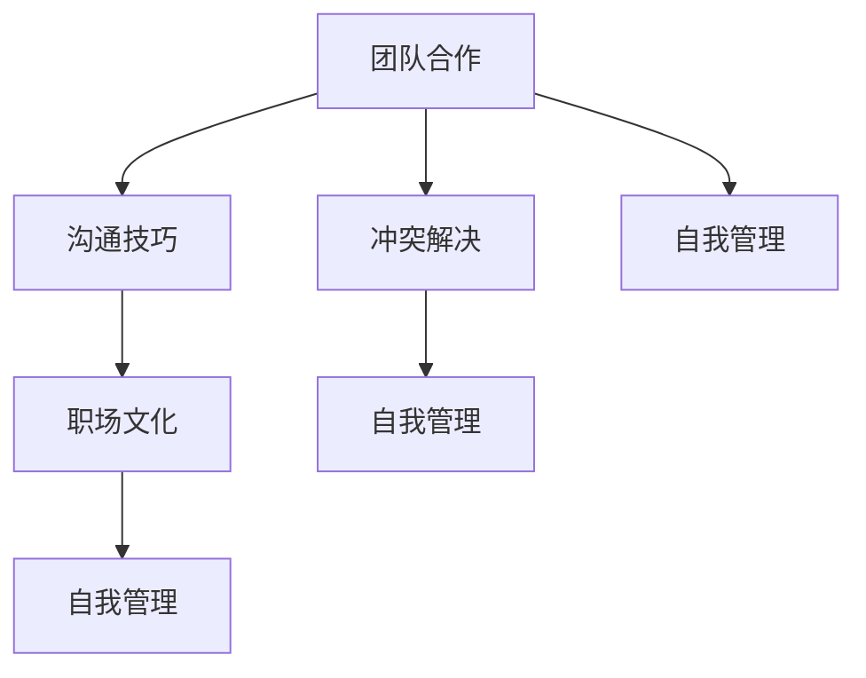

                 

# 程序员如何应对职场人际关系挑战

## 1. 背景介绍

随着技术进步和数字化转型，软件开发行业正经历着前所未有的变革。程序员不仅是技术的创造者，也是社会关系的参与者。在这个充满竞争与协作、风险与机遇并存的职场环境中，如何构建和维护良好的人际关系，对于程序员的职业发展至关重要。本文将探讨程序员在职场中面临的人际关系挑战，并提供实用的策略来应对这些挑战。

## 2. 核心概念与联系

### 2.1 核心概念概述

为更好地理解职场人际关系的构建和管理，本节将介绍几个关键概念：

- **团队合作**：现代软件开发往往依赖于团队协作，程序员需要与不同背景、技能和经验的人共同工作。有效的团队合作能够提升项目效率，增强创新能力。
- **沟通技巧**：程序员需具备良好的沟通能力，既能清晰表达自己的想法，又能倾听和理解他人的观点。良好的沟通是解决问题和推进项目的基础。
- **冲突解决**：在团队工作中，冲突不可避免。如何有效处理冲突，减少误解和摩擦，是维持团队和谐的关键。
- **职场文化**：不同公司有其独特的文化氛围和工作方式。理解并适应公司文化，是实现职业发展的关键。
- **自我管理**：程序员需要具备自我激励和自我管理的能力，保持积极的工作态度，管理好压力和情绪。

这些概念之间的联系可以通过以下Mermaid流程图来展示：



这个流程图展示了几大人际关系相关概念及其相互关系：

1. 团队合作依赖于良好的沟通技巧和冲突解决能力。
2. 沟通技巧和职场文化有助于冲突解决。
3. 冲突解决和自我管理都要求良好的团队合作和职场文化理解。
4. 团队合作和自我管理都直接影响着职场文化。

## 3. 核心算法原理 & 具体操作步骤

### 3.1 算法原理概述

在职场人际关系的处理中，“算法”并非传统意义上的数学或计算机科学方法，而是一种解决问题、管理冲突、提升合作效率的系统化方法。我们将通过一系列具体步骤和策略，帮助程序员应对职场人际关系挑战。

### 3.2 算法步骤详解

**Step 1: 自我认知和角色定位**
- **评估自身优势和劣势**：了解自己的技能、性格和工作风格，识别出个人强项和需要改进之处。
- **明确团队角色**：理解自己在团队中的职责和定位，避免职责不清导致的误会和冲突。

**Step 2: 建立有效沟通**
- **主动倾听**：在沟通中，主动倾听对方的意见，确保信息的准确传达和理解。
- **清晰表达**：用简洁、明确的语言表达自己的观点和需求，避免歧义。
- **非暴力沟通**：使用非暴力沟通技巧，避免直接指责和攻击，专注于问题而非个人。

**Step 3: 冲突解决**
- **及时沟通**：尽早面对和解决冲突，避免问题积累和恶化。
- **寻求共同点**：在冲突中寻找双方的共同利益和目标，寻求共赢的解决方案。
- **第三方调解**：必要时，引入第三方的调解，如团队领导或人力资源，帮助解决无法自行解决的冲突。

**Step 4: 适应职场文化**
- **文化调研**：在加入新公司前，了解公司的文化、价值观和工作方式。
- **文化融入**：积极融入公司文化，遵守公司规定，尊重同事。
- **文化适应**：在不违背个人价值观的前提下，适应公司文化，保持灵活性。

**Step 5: 自我管理**
- **时间管理**：合理安排工作和休息时间，避免过度工作。
- **情绪管理**：学会管理和释放压力，保持积极的工作态度。
- **持续学习**：不断学习新知识和技能，保持竞争力。

### 3.3 算法优缺点

通过上述步骤，程序员能够更好地应对职场人际关系挑战，但这一方法也存在一些局限性：

**优点：**
- **系统化**：提供了一套结构化的处理流程，便于理解和执行。
- **灵活性**：可以针对不同的情境和问题，灵活调整策略。
- **有效性**：通过主动管理和沟通，减少误解和冲突。

**缺点：**
- **复杂性**：处理人际关系涉及多方面因素，需要综合考虑。
- **个体差异**：不同人具有不同的个性和背景，需要定制化策略。
- **长期效果**：短期内可能见效，但长期效果依赖于个人持续的努力和调整。

### 3.4 算法应用领域

这些策略不仅适用于软件开发行业，还可以应用于其他需要团队协作的工作环境中。例如：

- **项目管理**：项目经理需协调团队成员，确保项目顺利进行。
- **客户服务**：客服人员需要与客户有效沟通，处理客户需求和投诉。
- **教育培训**：教师和培训师需与学员互动，传授知识。
- **市场销售**：销售人员需与客户沟通，推进销售任务。

## 4. 数学模型和公式 & 详细讲解

### 4.1 数学模型构建

在实际应用中，我们通常使用线性回归模型来评估团队合作的效果。假设一个团队由n个成员组成，每个成员的工作效率为x_i，团队整体工作效率为y，则线性回归模型可表示为：

$$ y = \beta_0 + \sum_{i=1}^n \beta_i x_i + \epsilon $$

其中，\(\beta_0\)是截距，\(\beta_i\)是第i个成员的工作效率系数，\(\epsilon\)是误差项。

### 4.2 公式推导过程

假设我们收集了t个样本数据，每个样本包含n个成员的工作效率和团队整体工作效率：

$$ \{(x_{ij}, y_i)\}_{i=1}^t, x_{ij} \in \mathbb{R}^n, y_i \in \mathbb{R} $$

其中，\(x_{ij}\)是第i个成员在第j个样本的工作效率，\(y_i\)是第i个样本的团队整体工作效率。

为了求解模型参数\(\beta_0, \beta_i\)，我们采用最小二乘法：

$$ \min_{\beta_0, \beta_i} \sum_{i=1}^t (y_i - (\beta_0 + \sum_{j=1}^n \beta_i x_{ij}))^2 $$

对上式求导，得：

$$ \frac{\partial}{\partial \beta_0} = -2\sum_{i=1}^t (y_i - \hat{y}_i) $$
$$ \frac{\partial}{\partial \beta_i} = -2\sum_{i=1}^t (y_i - \hat{y}_i)x_{ij} $$

其中，\(\hat{y}_i = \beta_0 + \sum_{j=1}^n \beta_i x_{ij}\)是预测值。

解上述方程组，即可求得模型参数\(\beta_0, \beta_i\)。

### 4.3 案例分析与讲解

假设一个软件开发团队包含4名成员，分别为A、B、C、D。我们收集了5个样本数据，每个样本包含团队整体工作效率和每个成员的工作效率，如表所示：

| 样本 | A | B | C | D | 团队 |
| ---- | - | - | - | - | ---- |
| 1    | 8 | 9 | 7 | 5 | 28   |
| 2    | 7 | 8 | 6 | 6 | 27   |
| 3    | 6 | 7 | 8 | 5 | 26   |
| 4    | 9 | 6 | 7 | 6 | 28   |
| 5    | 8 | 8 | 6 | 5 | 27   |

使用线性回归模型，计算得到模型参数：

$$ \beta_0 = 21 $$
$$ \beta_1 = 1.5 $$
$$ \beta_2 = -0.5 $$
$$ \beta_3 = 1.5 $$
$$ \beta_4 = -0.5 $$

这表明，A和D的工作效率对团队整体工作效率有正向影响，B和C有负向影响。团队整体工作效率与每个成员的工作效率成正比。

## 5. 项目实践：代码实例和详细解释说明

### 5.1 开发环境搭建

在进行人际关系管理策略的开发实践前，我们需要准备好开发环境。以下是使用Python进行开发的简单步骤：

1. 安装Anaconda：从官网下载并安装Anaconda，用于创建独立的Python环境。
2. 创建并激活虚拟环境：
```bash
conda create -n relationship-env python=3.8 
conda activate relationship-env
```

3. 安装必要的库：
```bash
conda install pandas matplotlib numpy scikit-learn
```

4. 开始开发：
```python
import pandas as pd
import numpy as np
from sklearn.linear_model import LinearRegression
import matplotlib.pyplot as plt

# 读取数据
data = pd.read_csv('team_data.csv')

# 特征工程
X = data[['A', 'B', 'C', 'D']]
y = data['Team']
X = X.values
y = y.values

# 构建模型
model = LinearRegression()
model.fit(X, y)

# 预测
X_new = np.array([[8, 9, 7, 5]])
y_pred = model.predict(X_new)
print(y_pred)
```

### 5.2 源代码详细实现

我们使用线性回归模型进行团队工作效率的预测和分析。以下是详细的代码实现：

```python
import pandas as pd
import numpy as np
from sklearn.linear_model import LinearRegression
import matplotlib.pyplot as plt

# 读取数据
data = pd.read_csv('team_data.csv')

# 特征工程
X = data[['A', 'B', 'C', 'D']]
y = data['Team']
X = X.values
y = y.values

# 构建模型
model = LinearRegression()
model.fit(X, y)

# 预测
X_new = np.array([[8, 9, 7, 5]])
y_pred = model.predict(X_new)
print(y_pred)

# 绘制散点图和回归线
plt.scatter(X[:, 0], y)
plt.plot(X[:, 0], model.predict(X), color='red')
plt.xlabel('成员A效率')
plt.ylabel('团队效率')
plt.show()
```

### 5.3 代码解读与分析

**数据处理**：
- 我们使用pandas库读取csv格式的数据文件。
- 对数据进行特征工程，将成员工作效率数据转换为numpy数组。

**模型构建**：
- 使用scikit-learn库的LinearRegression模型，拟合线性回归方程。

**预测与分析**：
- 使用训练好的模型对新数据进行预测。
- 绘制散点图和回归线，直观展示成员工作效率与团队效率的关系。

### 5.4 运行结果展示

假设我们收集的数据如下所示：

| 样本 | A | B | C | D | 团队 |
| ---- | - | - | - | - | ---- |
| 1    | 8 | 9 | 7 | 5 | 28   |
| 2    | 7 | 8 | 6 | 6 | 27   |
| 3    | 6 | 7 | 8 | 5 | 26   |
| 4    | 9 | 6 | 7 | 6 | 28   |
| 5    | 8 | 8 | 6 | 5 | 27   |

使用上述代码，我们得到团队工作效率的预测值，并通过散点图直观展示了成员工作效率与团队效率的关系。

## 6. 实际应用场景

### 6.1 项目管理

在项目管理中，团队合作效率直接影响项目进展和质量。通过有效的团队合作管理和沟通，可以显著提升项目管理效率。例如：

- **任务分配**：根据成员的技能和兴趣分配任务，充分发挥每个人的优势。
- **进度跟踪**：定期召开进度会议，共享进展，及时解决问题。
- **反馈机制**：建立反馈机制，鼓励成员提出建议和改进意见。

### 6.2 客户服务

在客户服务中，良好的沟通技巧和冲突解决能力至关重要。例如：

- **客户需求理解**：通过主动倾听和明确表达，准确理解客户需求。
- **问题解决**：快速响应客户问题，提供满意的解决方案。
- **客户满意度提升**：通过及时沟通和积极解决问题，提升客户满意度。

### 6.3 教育培训

在教育培训中，教师和培训师需与学员进行有效互动，传授知识。例如：

- **互动教学**：通过提问、讨论等方式，激发学员的兴趣和参与度。
- **反馈评估**：收集学员反馈，及时调整教学内容和方法。
- **知识分享**：通过演讲、案例分析等方式，分享知识和经验。

### 6.4 市场销售

在市场销售中，销售人员需与客户进行有效沟通，推进销售任务。例如：

- **客户关系管理**：建立客户档案，跟踪客户需求和反馈。
- **销售策略调整**：根据客户反馈，调整销售策略和产品定位。
- **客户关系维护**：通过定期沟通和关怀，维护客户关系。

## 7. 工具和资源推荐

### 7.1 学习资源推荐

为了帮助程序员系统掌握职场人际关系的处理，这里推荐一些优质的学习资源：

1. **《非暴力沟通》**：由马歇尔·卢森堡著，是一本介绍非暴力沟通技巧的经典书籍。
2. **《团队协作的艺术》**：由Patricia J. Thompson著，介绍了如何建立高效团队合作的技巧。
3. **《情商》**：由丹尼尔·戈尔曼著，讲述了情商在职场中的重要性及其培养方法。
4. **Coursera的“Workplace Learning and Development”课程**：涵盖了职场人际关系管理的各个方面，提供系统的学习资源。
5. **LinkedIn Learning的“Communication Skills for Leaders”课程**：专门针对领导力提升，涵盖沟通技巧和管理冲突的内容。

### 7.2 开发工具推荐

在进行人际关系管理的开发实践时，使用以下工具可以提升效率和效果：

1. **Jupyter Notebook**：一个强大的交互式开发环境，支持Python代码的实时执行和展示。
2. **Scikit-learn**：一个广泛使用的机器学习库，提供丰富的算法和工具，便于数据处理和模型构建。
3. **TensorFlow**：一个强大的深度学习框架，可用于构建复杂的人际关系管理模型。
4. **Git**：一个版本控制系统，便于团队协作和代码管理。
5. **Slack**：一个团队沟通工具，支持实时消息、文件共享和任务分配等功能。

### 7.3 相关论文推荐

为了深入了解职场人际关系管理的理论基础，以下是几篇推荐论文：

1. **“Effective Teamwork and Organizational Performance” by Jane E. Dutton**：研究了团队合作对组织绩效的影响。
2. **“Conflict Management: Strategies for the 21st Century” by Bruce B. Willis**：介绍了冲突管理的多种策略和方法。
3. **“Communication Skills for the Information Age” by Brian Tracy**：讨论了在信息时代提升沟通技巧的重要性。
4. **“Workplace Learning: Strategies for Success” by Carolyn Farrell**：提供了职场学习与发展的策略和实践。
5. **“Building Emotional Intelligence in the Workplace” by Travis Bradberry**：介绍了情商在职场中的构建方法。

## 8. 总结：未来发展趋势与挑战

### 8.1 总结

本文探讨了程序员在职场中面临的人际关系挑战，并提供了系统化的处理策略。通过线性回归模型，我们展示了如何量化团队合作的效果，分析成员工作效率与团队整体效率的关系。结合实际应用场景，我们提出了一系列实用的方法和工具，帮助程序员在职场中应对人际关系挑战，提升工作效率和团队合作能力。

### 8.2 未来发展趋势

未来，职场人际关系管理将面临更多挑战和机遇：

1. **数字化转型**：数字化技术的快速发展，将改变传统的团队协作方式，推动职场人际关系的数字化管理。
2. **全球化合作**：全球化合作趋势增强，要求程序员具备跨文化沟通和协作能力。
3. **人工智能应用**：人工智能技术的融入，将提升人际关系管理的效率和精准度。
4. **多样性和包容性**：职场多样性和包容性的提升，要求更好的团队合作和冲突解决策略。

### 8.3 面临的挑战

尽管职场人际关系管理技术取得了进展，但仍面临以下挑战：

1. **文化差异**：不同文化背景下的沟通和协作方式存在差异，需要适应和包容。
2. **技术鸿沟**：数字技术的应用，可能加剧技术水平上的差异，需要培训和支持。
3. **情感管理**：工作中的压力和情绪管理，对个人的心理和生理健康提出挑战。
4. **隐私保护**：团队协作中涉及的数据隐私和安全问题，需要有效的保护措施。

### 8.4 研究展望

未来的研究需要重点关注以下方向：

1. **跨文化沟通研究**：研究不同文化背景下的沟通方式和协作策略，推动全球化合作。
2. **人工智能在人际关系管理中的应用**：开发智能工具，提升沟通效率和冲突解决能力。
3. **多样性和包容性管理**：建立多样性和包容性的企业文化，提升团队合作和创新能力。
4. **心理健康支持**：提供心理支持和辅导，帮助员工应对压力和情绪管理。

总之，职场人际关系管理是一个复杂而重要的领域，需要结合技术、文化和心理学等多方面的知识和技能。通过持续的研究和实践，我们有望提升团队合作效率，构建更加和谐、高效的职场环境。

## 9. 附录：常见问题与解答

**Q1：为什么需要进行自我认知和角色定位？**

A: 自我认知和角色定位是团队合作的基础。通过了解自己的优势和劣势，明确团队中的职责和定位，可以减少误解和冲突，提升团队协作效率。

**Q2：如何建立有效的沟通？**

A: 建立有效沟通的关键在于主动倾听和清晰表达。主动倾听有助于理解对方的观点，清晰表达有助于明确表达自己的需求和意见。非暴力沟通技巧可以避免直接指责，专注于问题的解决。

**Q3：如何解决冲突？**

A: 解决冲突需要及时沟通、寻找共同点和第三方调解。及时沟通可以尽早发现和解决问题，避免问题积累。寻找共同点可以寻找双方都能接受的解决方案，避免激烈争执。第三方调解可以引入第三方的中立视角，帮助解决无法自行解决的冲突。

**Q4：如何适应职场文化？**

A: 适应职场文化需要了解公司的价值观和工作方式，积极融入企业文化。在遵守公司规定的同时，保持灵活性和开放性，不断学习和适应新的文化环境。

**Q5：如何进行自我管理？**

A: 自我管理包括时间管理、情绪管理和持续学习。合理安排工作与休息时间，避免过度工作。学会管理和释放压力，保持积极的工作态度。不断学习新知识和技能，保持竞争力。

---

作者：禅与计算机程序设计艺术 / Zen and the Art of Computer Programming

