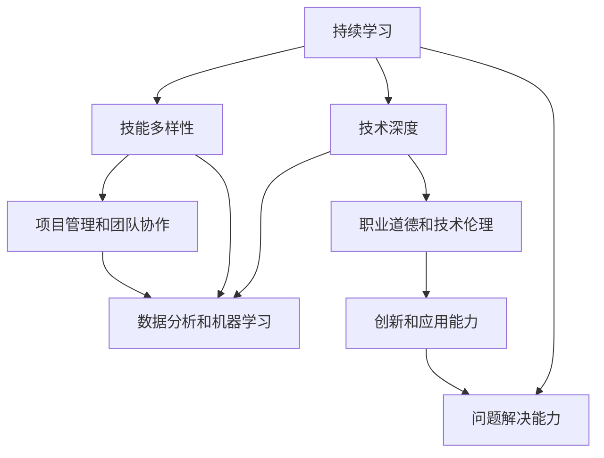

                 

# 程序员如何建立长期的职业竞争力

在快速变化的科技行业中，持续学习和适应新技术、掌握行业趋势，是保持长期竞争力的关键。本文旨在帮助程序员构建一个能够持续进化的技能框架，从而在职业生涯中保持领先地位。

## 1. 背景介绍

### 1.1 行业现状
当前IT行业正经历前所未有的变革，从云计算、大数据、人工智能到区块链，新技术不断涌现。这些技术不仅改变了软件开发模式，也对软件开发人员提出了新的要求。

### 1.2 职业发展趋势
随着技术的发展，对程序员的职业要求也发生了变化。除了编程技能外，项目管理和跨团队协作、数据分析和机器学习等技能也变得越发重要。此外，对职业道德和技术伦理的认识，以及终身学习的态度，也是程序员获得长远职业发展的关键。

## 2. 核心概念与联系

### 2.1 核心概念概述
为更好地理解如何构建长期的职业竞争力，本节将介绍几个关键概念：

- **持续学习**：程序员需要不断学习新技术，更新知识储备，以保持与行业发展同步。
- **技能多样性**：掌握多种编程语言、开发工具和框架，能够更灵活地应对项目需求。
- **技术深度**：对某一领域有深入研究，成为该领域的专家。
- **项目管理和团队协作**：良好的沟通和领导能力，能够高效地管理和协调团队。
- **数据分析和机器学习**：掌握数据分析和机器学习技能，提升解决复杂问题的能力。
- **职业道德和技术伦理**：理解技术对社会的影响，确保技术应用符合道德规范。

这些概念之间存在紧密联系，构建一个多元化的技能体系，能够帮助程序员在多变的技术环境中保持竞争力。

### 2.2 核心概念原理和架构的 Mermaid 流程图(Mermaid 流程节点中不要有括号、逗号等特殊字符)



这个流程图展示了持续学习如何通过多种途径，构建一个全面的技能体系，并最终转化为解决问题和创新的能力。

## 3. 核心算法原理 & 具体操作步骤
### 3.1 算法原理概述
建立长期职业竞争力的核心算法可以概括为：

- **输入**：持续获取新知识和技术，提升技能多样性。
- **处理**：通过跨领域学习和实践，形成技术深度和问题解决能力。
- **输出**：结合项目管理、团队协作和伦理知识，将技能应用到实际工作中。
- **反馈**：持续评估和调整技能体系，确保其与行业发展同步。

### 3.2 算法步骤详解
1. **持续学习**：
    - 定期阅读行业文章、参加技术会议、参与开源项目，了解最新技术趋势。
    - 通过在线课程和培训，系统学习编程语言、开发工具和框架。

2. **技能多样性**：
    - 掌握至少3-5种编程语言，如Java、Python、JavaScript等。
    - 熟悉多种开发工具和框架，如Git、Docker、Spring等。

3. **技术深度**：
    - 选择一个感兴趣的领域，深入学习其核心技术、架构和最佳实践。
    - 参与开源项目，解决复杂问题，积累实际经验。

4. **项目管理和团队协作**：
    - 学习敏捷开发、Scrum等项目管理方法，提升项目管理和团队协作能力。
    - 参加团队建设活动，培养领导力和沟通能力。

5. **数据分析和机器学习**：
    - 掌握SQL、Pandas等数据分析工具，学习机器学习算法和模型。
    - 应用到实际项目中，解决数据驱动的业务问题。

6. **职业道德和技术伦理**：
    - 了解技术对社会的影响，遵守相关法律法规。
    - 培养对技术伦理的敏感性和责任感。

### 3.3 算法优缺点
**优点**：
- 技能体系全面，适应性强，能够应对多种项目需求。
- 持续学习使技术栈不断更新，保持竞争力。
- 结合了技术深度和项目管理能力，能够高效解决复杂问题。

**缺点**：
- 需要大量时间和精力进行学习和实践。
- 对于跨领域的技能要求较高，可能需要较长时间才能全面掌握。

### 3.4 算法应用领域
该算法适用于所有IT行业的软件开发者，包括前端、后端、移动开发等。

## 4. 数学模型和公式 & 详细讲解 & 举例说明

### 4.1 数学模型构建
建立长期职业竞争力的数学模型可以表述为：

$$
竞争力 = f(学习速度, 技能多样性, 技术深度, 项目管理, 团队协作, 数据分析, 机器学习, 职业道德)
$$

其中，$f$ 为函数映射关系。

### 4.2 公式推导过程
假设每个子技能 $i$ 的权重为 $w_i$，其对竞争力的贡献度为 $C_i$，则竞争力 $C$ 可以表示为：

$$
C = \sum_{i=1}^{n} w_i C_i
$$

其中 $n$ 为技能总数。

### 4.3 案例分析与讲解
以软件开发人员为例，假设其持续学习速度为 $L$，技能多样性为 $S$，技术深度为 $D$，项目管理能力为 $M$，团队协作能力为 $T$，数据分析能力为 $A$，机器学习能力为 $L$，职业道德为 $E$。则竞争力为：

$$
C = w_L L + w_S S + w_D D + w_M M + w_T T + w_A A + w_L L + w_E E
$$

根据行业标准和实际需求，可以调整各个子技能对竞争力的权重。

## 5. 项目实践：代码实例和详细解释说明
### 5.1 开发环境搭建
- **编程语言**：Python、Java、JavaScript
- **开发工具**：Git、Docker、JIRA
- **学习平台**：Coursera、Udacity、edX
- **项目框架**：Spring、Django、React

### 5.2 源代码详细实现

以下是一个简单的代码实例，展示了如何使用Python进行数据分析和机器学习：

```python
import pandas as pd
from sklearn.model_selection import train_test_split
from sklearn.linear_model import LogisticRegression

# 读取数据集
df = pd.read_csv('data.csv')

# 特征工程
X = df.drop(['target'], axis=1)
y = df['target']

# 分割训练集和测试集
X_train, X_test, y_train, y_test = train_test_split(X, y, test_size=0.2, random_state=42)

# 训练模型
model = LogisticRegression()
model.fit(X_train, y_train)

# 评估模型
accuracy = model.score(X_test, y_test)
print(f'模型准确率：{accuracy}')
```

### 5.3 代码解读与分析
该代码展示了基本的机器学习流程：数据读取、特征工程、模型训练和评估。通过这个例子，程序员可以理解机器学习的基本流程和Python库的使用。

### 5.4 运行结果展示
运行上述代码，将输出模型的准确率，帮助程序员评估模型的性能。

## 6. 实际应用场景

### 6.1 软件开发项目
在软件开发项目中，掌握多种编程语言和开发工具，可以更灵活地应对项目需求。例如，某公司需要同时开发Web应用和移动应用，具备Python、Java和JavaScript技能的开发人员可以同时参与这两个项目。

### 6.2 数据科学项目
数据科学项目中，数据分析和机器学习技能至关重要。例如，某公司需要开发一个推荐系统，具备数据分析和机器学习技能的开发人员可以参与模型构建和优化。

### 6.3 人工智能项目
人工智能项目中，需要对特定领域的知识有深入研究。例如，某公司需要开发一个语音识别系统，具备语音处理和深度学习知识的开发人员可以参与技术实现和优化。

### 6.4 未来应用展望
未来，随着技术的不断进步，软件开发人员需要更多关注云计算、区块链、边缘计算等新兴技术。掌握这些新技术，将使程序员在职业生涯中保持领先地位。

## 7. 工具和资源推荐
### 7.1 学习资源推荐
- **在线课程**：Coursera、Udacity、edX
- **技术博客**：Medium、Dev.to
- **开源项目**：GitHub

### 7.2 开发工具推荐
- **编程语言**：Python、Java、JavaScript
- **开发工具**：Git、Docker、JIRA
- **学习平台**：Coursera、Udacity、edX

### 7.3 相关论文推荐
- **《持续学习的有效性》**：探讨持续学习在职业发展中的应用。
- **《跨领域技能的重要性》**：分析技能多样性对职业竞争力的影响。
- **《技术伦理的重要性》**：讨论技术伦理在软件开发中的应用。

## 8. 总结：未来发展趋势与挑战
### 8.1 研究成果总结
本文详细介绍了如何通过持续学习、技能多样性、技术深度、项目管理、团队协作、数据分析、机器学习和职业道德等概念，建立长期职业竞争力。

### 8.2 未来发展趋势
- **技术更新**：云计算、大数据、人工智能等新技术将持续变革软件开发模式。
- **技能需求**：跨领域技能和新兴技术需求将不断增加。
- **职业生态**：远程工作、开源项目等将改变传统的职业发展路径。

### 8.3 面临的挑战
- **时间管理**：如何在繁忙的工作中持续学习。
- **跨领域学习**：如何系统地掌握跨领域的技能。
- **技术伦理**：如何应对技术发展带来的伦理挑战。

### 8.4 研究展望
未来的研究将更多关注如何高效地进行持续学习、如何在跨领域技能之间建立关联、如何平衡技术更新与伦理应用等问题。

## 9. 附录：常见问题与解答

**Q1：如何快速掌握一种新的编程语言？**
A: 可以通过在线课程、书籍和实际项目学习。掌握语法基础后，通过编写小项目和参与开源项目加深理解。

**Q2：如何在工作中保持持续学习的动力？**
A: 设定明确的学习目标，并将其纳入工作计划。定期评估学习进度，庆祝小成就以保持动力。

**Q3：如何平衡工作和学习？**
A: 制定时间表，合理分配工作和学习的优先级。利用碎片时间进行学习，如通勤、午休时。

**Q4：如何提升团队协作能力？**
A: 参加团队建设活动，主动与团队成员沟通交流。学习敏捷开发方法，提升项目管理能力。

**Q5：如何应对技术更新带来的挑战？**
A: 关注行业动态，参与技术会议和社区活动。持续学习新技术，并尝试将其应用到实际项目中。

作者：禅与计算机程序设计艺术 / Zen and the Art of Computer Programming

