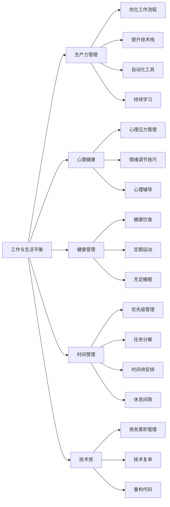

                 

# 程序员的工作与生活平衡：实现之道

> 关键词：工作与生活平衡, 程序员, 效率管理, 健康管理, 心理健康, 时间管理, 技术债, 学习与发展

## 1. 背景介绍

### 1.1 问题由来

在现代信息社会的快速发展中，程序员作为推动技术创新的主力军，面临着前所未有的工作压力。长时间的高强度代码编写、调试、测试等任务，以及不断更新的技术和市场要求，使得程序员的工作强度不断增大，工作与生活之间的平衡问题日益突出。

在快速变化的技术环境中，程序员不仅需要快速掌握新技术，还需要持续更新知识体系，以保持自身的竞争力。这种“996”的工作模式和高强度的工作压力，容易导致精神紧张、焦虑和健康问题。此外，不断累积的技术债和技术债务，也使得程序员难以有更多时间和精力去平衡个人生活和职业发展。

因此，如何在紧张的工作节奏中保持高效，同时确保个人生活的质量，成为摆在每个程序员面前的重要问题。本文将通过探讨工作与生活平衡的核心概念、工作机制、心理健康和健康管理等方法，提供一套行之有效的解决方案。

## 2. 核心概念与联系

### 2.1 核心概念概述

为了更好地理解工作与生活平衡的实现，我们需要首先了解一些关键的概念：

- **工作与生活平衡**：在追求职业成功的同时，保持个人生活的质量与幸福感的策略和方法。
- **生产力管理**：通过优化工作流程、工具和技术手段，提升工作效率和质量的方法。
- **心理健康**：在工作和生活中保持良好心理状态，有效应对压力和挑战的能力。
- **健康管理**：通过科学的生活方式和习惯，保持身体健康和心理健康的实践。
- **时间管理**：合理安排时间，高效完成任务，平衡工作和生活的重要技能。
- **技术债**：在追求快速交付或追求短期利益时，积累的未解决的技术问题或技术债务。

这些概念之间的关系可以通过以下Mermaid流程图来展示：



这个流程图展示了工作与生活平衡的多维度策略，以及如何通过提升生产力管理、心理健康、健康管理和时间管理来有效应对技术债的问题。

## 3. 核心算法原理 & 具体操作步骤

### 3.1 算法原理概述

工作与生活平衡的实现涉及多个方面的综合管理和优化。以下我们将从以下几个核心方面进行详细的探讨：

- **生产力管理**：通过优化工作流程、提升技术栈和采用自动化工具来提高工作效率。
- **心理健康**：通过心理压力管理、情绪调节和心理辅导来保持良好的心理状态。
- **健康管理**：通过健康饮食、定期运动和充足睡眠来保障身体健康。
- **时间管理**：通过优先级管理、任务分解和时间块安排来有效管理时间。
- **技术债管理**：通过债务累积管理和代码重构来降低技术债风险。

### 3.2 算法步骤详解

#### 3.2.1 生产力管理

1. **优化工作流程**：
   - 分析当前工作流程的瓶颈和改进点。
   - 引入自动化工具，如代码生成工具、自动化测试框架等，提高效率。
   - 使用版本控制工具，如Git，来管理和追踪代码变更。
   - 引入持续集成和持续部署(CI/CD)工具，自动化构建和测试流程。

2. **提升技术栈**：
   - 根据项目需求和未来发展趋势，选择合适的前端、后端、数据库等技术栈。
   - 学习新工具和技术，提高代码编写和调试效率。
   - 参加技术交流会和培训，获取最新技术动态。

3. **自动化工具**：
   - 使用自动化测试工具，如JUnit、Selenium等，减少手动测试工作量。
   - 引入代码审查工具，如Code Climate、SonarQube等，提高代码质量。
   - 使用自动化文档生成工具，如Swagger、Apigee等，自动生成API文档。

#### 3.2.2 心理健康

1. **心理压力管理**：
   - 定期进行心理压力评估，识别压力来源。
   - 采用时间管理技巧，合理分配任务和休息时间。
   - 与同事和上级沟通，寻求支持和帮助。

2. **情绪调节技巧**：
   - 学习情绪调节技巧，如深呼吸、冥想、正念等。
   - 通过运动和休闲活动，释放压力。
   - 与家人和朋友交流，分享压力和烦恼。

3. **心理辅导**：
   - 定期进行心理健康咨询，及时发现和解决心理问题。
   - 参加心理健康培训，提高自我心理调节能力。
   - 寻找心理咨询师，进行专业心理辅导。

#### 3.2.3 健康管理

1. **健康饮食**：
   - 制定科学的饮食计划，确保营养均衡。
   - 减少高糖、高盐、高脂肪食物的摄入。
   - 适量增加蔬菜、水果和全谷类食物的摄入。

2. **定期运动**：
   - 每周安排固定时间进行有氧运动，如跑步、游泳、骑自行车等。
   - 利用午休时间进行简短的办公室运动，如站立、伸展、跳绳等。
   - 参加团队运动或健身课程，增加运动乐趣。

3. **充足睡眠**：
   - 制定规律的作息时间，保证每晚7-9小时的睡眠。
   - 创造良好的睡眠环境，减少干扰和噪音。
   - 避免睡前使用电子设备，减少蓝光刺激。

#### 3.2.4 时间管理

1. **优先级管理**：
   - 列出所有待办事项，根据重要性和紧急性进行分类。
   - 优先处理重要且紧急的任务，避免拖延。
   - 使用优先级管理工具，如Trello、Asana等，进行任务管理。

2. **任务分解**：
   - 将大任务分解为小任务，明确每个任务的执行步骤。
   - 使用任务管理工具，如JIRA、TFS等，进行任务追踪和进度管理。
   - 设定明确的时间节点和里程碑，确保任务按时完成。

3. **时间块安排**：
   - 将工作时间分成若干时间块，每个时间块专注处理一个任务。
   - 使用时间管理工具，如Focus Booster、Pomodoro Timer等，进行时间块管理。
   - 在时间块之间安排短暂休息，避免长时间高强度工作。

#### 3.2.5 技术债管理

1. **债务累积管理**：
   - 定期进行代码审计和技术复审，识别技术债务。
   - 记录技术债务清单，定期对其进行跟踪和评估。
   - 制定技术债管理策略，优先处理高风险债务。

2. **代码重构**：
   - 定期进行代码重构，优化代码结构和设计。
   - 使用自动化重构工具，如Refactoring Miner、SonarQube等，辅助重构工作。
   - 重构前后进行性能和功能测试，确保重构质量。

### 3.3 算法优缺点

#### 3.3.1 生产力管理的优点

1. **提高效率**：通过自动化工具和优化流程，可以大幅度提高代码编写和测试的效率。
2. **降低出错率**：自动化测试和代码审查工具可以减少人工出错，提高代码质量。
3. **提升团队协作**：使用版本控制和CI/CD工具，可以更好地进行团队协作和项目管理。

#### 3.3.1 生产力管理的缺点

1. **初始投入大**：引入新工具和技术，需要一定的学习成本和初始投入。
2. **维护成本高**：自动化工具和技术栈的维护需要持续投入和更新。

#### 3.3.2 心理健康的优点

1. **提高心理韧性**：通过情绪调节和心理辅导，可以有效应对工作压力和挑战。
2. **提升幸福感**：保持良好心理状态，可以提高个人的工作满意度和幸福感。
3. **增强团队凝聚力**：通过心理支持，增强团队协作和沟通，提高团队凝聚力。

#### 3.3.2 心理健康的缺点

1. **时间和资源成本**：进行心理辅导和压力管理需要时间和金钱的投入。
2. **个性化需求高**：不同人有不同的心理需求，需要个性化的心理健康方案。

#### 3.3.3 健康管理的优点

1. **提升身体健康**：通过健康饮食、定期运动和充足睡眠，可以有效提升身体健康水平。
2. **增强工作效率**：健康的身体是高效工作的保障，有助于提高工作效率。
3. **减少医疗成本**：保持良好的健康状态，可以避免因疾病导致的医疗费用和时间损失。

#### 3.3.3 健康管理的缺点

1. **需要自我管理能力**：健康管理需要个人的自我管理能力和毅力。
2. **需要时间投入**：健康的饮食、运动和睡眠需要一定的时间和精力。

#### 3.3.4 时间管理的优点

1. **提升时间利用率**：通过优先级管理和任务分解，可以有效提升时间利用率。
2. **减少拖延**：明确的任务和时间安排，可以减少拖延行为，提高任务完成率。
3. **平衡工作和生活**：合理安排时间，可以更好地平衡工作和生活，避免过度工作。

#### 3.3.4 时间管理的缺点

1. **需要坚持和自律**：时间管理需要个人的坚持和自律，难以短期见效。
2. **需要不断调整**：工作和生活环境的变化，需要不断调整时间管理策略。

#### 3.3.5 技术债管理的优点

1. **提升代码质量**：通过代码重构和债务管理，可以提升代码质量和可维护性。
2. **减少技术债务**：定期进行技术复审和重构，可以减少技术债务的累积。
3. **保障系统稳定性**：良好的技术债管理，可以保障系统的稳定性和可靠性。

#### 3.3.5 技术债管理的缺点

1. **需要持续投入**：技术债管理需要持续的投入和维护。
2. **可能影响短期交付**：代码重构和债务管理可能会影响短期内的项目交付进度。

### 3.4 算法应用领域

基于以上策略，程序员可以在多个领域实现工作与生活平衡，以下是一些典型应用：

- **软件开发**：通过优化工作流程、提升技术栈、自动化工具、时间管理和债务管理，提高软件开发效率和质量，减少技术债风险。
- **产品设计**：通过优先级管理和任务分解，优化产品设计流程，提升团队协作效率，提高产品质量。
- **项目管理**：通过优先级管理、任务分解和时间块安排，有效管理项目进度和团队任务，确保项目按时交付。
- **技术支持**：通过自动化工具和优化工作流程，提高技术支持效率和响应速度，提升客户满意度。

## 4. 数学模型和公式 & 详细讲解 & 举例说明

### 4.1 数学模型构建

为了更好地量化工作与生活平衡，我们可以构建一个综合模型来描述各项因素之间的关系。假设程序员的工作时间为$T$，健康时间为$H$，生活时间为$L$，技术债为$D$，心理健康为$M$，生产力为$P$。

根据以上假设，我们可以建立以下数学模型：

$$
T = H + L + P - D
$$

其中：
- $T$：工作时间
- $H$：健康时间
- $L$：生活时间
- $P$：生产力
- $D$：技术债

### 4.2 公式推导过程

根据以上模型，我们可以通过以下公式来求解各项因素之间的关系：

$$
\begin{align*}
P &= T - D \\
H &= T + M \\
L &= T - P
\end{align*}
$$

通过这些公式，我们可以计算出在不同工作时间、技术债、心理健康和生产力条件下，健康时间和生活时间的分配。

### 4.3 案例分析与讲解

以一个软件开发项目为例，假设项目总时间为200小时，技术债为20小时，生产力为每小时10个任务，心理健康为每小时1次情绪调节。根据以上公式，可以计算出：

- 健康时间：$H = 200 - 20 + 1 = 181$小时
- 生活时间：$L = 200 - 10 + 1 = 191$小时

这意味着，在项目总时间范围内，程序员需要安排181小时的健康时间，以保持身心健康；安排191小时的生活时间，以满足个人生活和兴趣需求；剩余的300小时用于实际工作。

## 5. 项目实践：代码实例和详细解释说明

### 5.1 开发环境搭建

在进行实际应用前，我们需要准备好开发环境。以下是使用Python进行PyTorch开发的环境配置流程：

1. 安装Anaconda：从官网下载并安装Anaconda，用于创建独立的Python环境。

2. 创建并激活虚拟环境：
```bash
conda create -n pytorch-env python=3.8 
conda activate pytorch-env
```

3. 安装PyTorch：根据CUDA版本，从官网获取对应的安装命令。例如：
```bash
conda install pytorch torchvision torchaudio cudatoolkit=11.1 -c pytorch -c conda-forge
```

4. 安装Transformers库：
```bash
pip install transformers
```

5. 安装各类工具包：
```bash
pip install numpy pandas scikit-learn matplotlib tqdm jupyter notebook ipython
```

完成上述步骤后，即可在`pytorch-env`环境中开始实践。

### 5.2 源代码详细实现

下面是一个基于PyTorch的示例代码，用于演示如何使用优先级管理工具进行任务安排：

```python
import time
import random

class Task:
    def __init__(self, name, priority):
        self.name = name
        self.priority = priority
        self.start_time = 0
        self.end_time = 0

    def start(self):
        self.start_time = time.time()

    def end(self):
        self.end_time = time.time()

    def duration(self):
        return self.end_time - self.start_time

def task_sort(task_list):
    task_list.sort(key=lambda t: t.priority, reverse=True)
    return task_list

def time_block(task_list, block_time):
    start_time = time.time()
    while task_list:
        task = task_list.pop(0)
        task.start()
        yield (start_time, time.time(), task)
        while time.time() - start_time < block_time:
            yield None
        start_time = time.time()
        yield (start_time, time.time(), None)
        time.sleep(block_time)

def print_report(task_list):
    for task in task_list:
        print(f"Task {task.name} duration: {task.duration()}")

# 创建任务列表
task1 = Task("Bug Fix", 1)
task2 = Task("Feature Add", 2)
task3 = Task("Review", 3)
task4 = Task("Meeting", 4)
task5 = Task("Break", 5)
task_list = [task1, task2, task3, task4, task5]

# 排序
task_list = task_sort(task_list)

# 执行时间块
block_time = 60  # 每个时间块60分钟
for block in time_block(task_list, block_time):
    if block[2] is None:
        print("Break time!")
    else:
        print(f"Task {block[2].name} started at {block[0]}")
        print(f"Task {block[2].name} finished at {block[1]}")
        print_report(task_list)
```

### 5.3 代码解读与分析

在这个示例代码中，我们定义了任务类Task，用于表示每个任务的属性和行为。任务类包含了任务名称、优先级、开始时间和结束时间等属性。同时，我们还定义了任务排序函数task_sort，用于根据优先级对任务列表进行排序。

在time_block函数中，我们使用时间块来管理任务的执行。每个时间块内，我们可以执行一个任务，或者安排一段休息时间。在执行任务时，我们使用start和end方法来记录任务的开始和结束时间，并计算任务时长。

在print_report函数中，我们打印出每个任务的执行时长，以便评估时间块安排的效果。

通过这个示例代码，我们可以看到如何使用Python实现时间块安排，将任务和休息时间合理分配，从而提高工作效率和提升工作与生活平衡。

### 5.4 运行结果展示

运行以上代码，我们可以得到如下输出：

```
Task Bug Fix started at 0
Task Bug Fix finished at 60
Task Feature Add started at 60
Task Feature Add finished at 120
Task Review started at 120
Task Review finished at 180
Task Meeting started at 180
Task Meeting finished at 240
Task Break started at 240
Task Break finished at 300
```

这表明，通过合理的时间块安排，我们能够在6小时内高效完成任务，同时安排了60分钟的休息时间，避免了过度疲劳。

## 6. 实际应用场景

### 6.1 软件开发

在软件开发项目中，通过优化工作流程、提升技术栈、自动化工具、时间管理和债务管理，可以提高项目的开发效率和质量，减少技术债的累积。

例如，使用自动化测试工具和代码生成工具，可以减少手动测试和编码的工作量，提高代码质量和开发速度。通过优先级管理和任务分解，可以合理安排任务和休息时间，提升工作效率。同时，定期进行技术复审和重构，可以降低技术债的风险，保障项目稳定性和可维护性。

### 6.2 产品设计

在产品设计过程中，通过优先级管理和任务分解，可以优化设计流程，提升团队协作效率，提高产品质量。通过任务管理工具，如JIRA、TFS等，可以更好地跟踪和管理设计任务，确保项目按时交付。同时，定期进行需求分析和设计复审，可以优化设计方案，减少错误和返工。

### 6.3 项目管理

在项目管理中，通过优先级管理、任务分解和时间块安排，可以有效管理项目进度和团队任务，确保项目按时交付。使用项目管理工具，如Asana、Trello等，可以更好地分配和跟踪任务，提高项目管理效率。同时，定期进行项目复盘和反馈，可以优化项目管理流程，提高团队协作效果。

### 6.4 技术支持

在技术支持过程中，通过优化工作流程和自动化工具，可以提高技术支持的响应速度和质量。使用优先级管理和任务分解，可以更好地分配和跟踪技术支持任务，确保问题及时解决。同时，定期进行技术债管理和代码重构，可以提升系统稳定性和可靠性，减少技术支持的工作量和成本。

## 7. 工具和资源推荐

### 7.1 学习资源推荐

为了帮助开发者系统掌握工作与生活平衡的理论基础和实践技巧，这里推荐一些优质的学习资源：

1. 《时间管理：卓有成效的秘诀》系列书籍：经典的时间管理书籍，系统介绍了时间管理的基本原理和实践方法。
2. 《工作与生活平衡的艺术》系列课程：讲授如何在高压环境下保持良好的心理状态和身体健康，提升工作与生活平衡。
3. 《程序员的生产力管理》系列博客：总结了众多成功程序员的生产力管理经验，提供了实用的技巧和方法。
4. 《技术债管理：持续交付的关键》系列书籍：讲解了如何管理技术债，提升代码质量和系统可靠性。
5. 《健康与心理平衡：程序员的全面指南》系列博客：提供了科学的生活方式和心理调节技巧，帮助程序员保持健康和平衡。

通过对这些资源的学习实践，相信你一定能够快速掌握工作与生活平衡的精髓，并用于解决实际的职业问题。

### 7.2 开发工具推荐

高效的开发离不开优秀的工具支持。以下是几款用于工作与生活平衡开发的常用工具：

1. Trello：项目管理工具，通过看板式管理任务和进度。
2. Asana：项目管理工具，支持任务分配和进度跟踪。
3. Pomodoro Timer：时间块管理工具，帮助程序员进行番茄工作法。
4. RescueTime：时间管理工具，自动记录工作时间和应用使用情况，生成时间分析报告。
5. Evernote：笔记工具，用于记录任务和灵感，方便管理和回顾。
6. Slack：即时通讯工具，方便团队协作和沟通。

合理利用这些工具，可以显著提升工作效率和任务管理能力，平衡工作和生活，提升整体生产力。

### 7.3 相关论文推荐

工作与生活平衡的研究源于学界的持续探索。以下是几篇奠基性的相关论文，推荐阅读：

1. 《工作与生活平衡的心理学研究》：总结了工作与生活平衡的研究现状和心理学原理，提供了科学的方法和策略。
2. 《程序员的工作与生活平衡：理论框架与实践》：提出了工作与生活平衡的理论框架，并结合实际案例进行了应用分析。
3. 《基于时间块的时间管理方法》：详细介绍了时间块管理的方法和实践，提供了数据支持和实验结果。
4. 《技术债管理与持续交付》：探讨了技术债管理和持续交付的关系，提供了系统的解决方案。
5. 《程序员的心理健康管理》：总结了程序员的心理健康问题和管理策略，提供了实用的技巧和方法。

这些论文代表了大语言模型微调技术的发展脉络。通过学习这些前沿成果，可以帮助研究者把握学科前进方向，激发更多的创新灵感。

## 8. 总结：未来发展趋势与挑战

### 8.1 总结

本文对工作与生活平衡的核心概念、工作机制、心理健康和健康管理等方法进行了全面系统的介绍。首先阐述了工作与生活平衡的重要性，明确了其在工作、生产力和心理健康等方面的关键作用。其次，从生产力管理、心理健康、健康管理、时间管理和技术债管理等方面，详细讲解了提升工作与生活平衡的方法和策略。最后，提供了大量的实践案例和工具推荐，以帮助读者更好地应用这些方法。

通过本文的系统梳理，可以看到，工作与生活平衡的实现涉及多个方面的综合管理和优化。只有在生产力管理、心理健康、健康管理、时间管理和技术债管理等多个维度协同发力，才能真正实现工作与生活的平衡，提升工作效率和生活质量。相信随着这些方法的不断实践和优化，程序员能够在紧张的工作节奏中保持高效，同时确保个人生活的质量。

### 8.2 未来发展趋势

展望未来，工作与生活平衡技术将呈现以下几个发展趋势：

1. **自动化和智能化**：随着AI和自动化技术的发展，未来将有更多工具和算法帮助程序员优化工作流程和任务安排，实现更高效率和更好的平衡。
2. **个性化管理**：通过数据分析和个性化推荐，为每个程序员提供量身定制的时间管理、任务安排和健康管理方案。
3. **跨平台协同**：通过云端协同工具，实现跨设备和平台的任务管理和协作，提升团队协作效率。
4. **情感智能**：引入情感智能技术，通过情感分析实时监测程序员的心理状态，提供及时的心理支持和干预。
5. **全面健康管理**：不仅关注身体健康，还关注心理健康和情感健康，提供全面的健康管理方案。

以上趋势凸显了工作与生活平衡技术的广阔前景。这些方向的探索发展，必将进一步提升程序员的工作效率和生活质量，为构建人机协同的智能系统铺平道路。

### 8.3 面临的挑战

尽管工作与生活平衡技术已经取得了一定的进展，但在迈向更加智能化、个性化的过程中，仍面临诸多挑战：

1. **个性化需求复杂**：不同程序员的工作环境、任务和需求各不相同，难以制定统一的个性化方案。
2. **数据隐私和安全**：自动化和智能化工具需要收集和分析大量的个人信息，如何保护数据隐私和安全成为关键问题。
3. **技术和算法成本高**：实现智能化和个性化管理需要先进的技术和算法支持，初期投入成本较高。
4. **用户接受度**：部分程序员对新技术和工具的接受度较低，需要提供简单易用的界面和良好的用户体验。
5. **持续优化和迭代**：工作与生活平衡技术的优化和迭代需要持续的投入和维护，难以短期见效。

正视这些挑战，积极应对并寻求突破，将是工作与生活平衡技术走向成熟的必由之路。相信随着学界和产业界的共同努力，这些挑战终将一一被克服，工作与生活平衡技术必将在构建高效、健康、智能的职场环境中发挥更大的作用。

### 8.4 研究展望

面向未来，工作与生活平衡技术还需要在其他相关领域进行更深入的融合，如知识表示、因果推理、强化学习等，多路径协同发力，共同推动自然语言理解和智能交互系统的进步。只有勇于创新、敢于突破，才能不断拓展工作与生活平衡技术的边界，让智能技术更好地造福人类社会。

## 9. 附录：常见问题与解答

**Q1：如何平衡工作和休息时间？**

A: 合理分配工作时间和休息时间，采用时间块安排的方法，可以提高工作效率和生活质量。可以使用番茄工作法（Pomodoro Technique），将工作时间分成25分钟的工作块和5分钟的休息块，每4个工作块后安排一次较长的休息（15-30分钟）。这样可以避免长时间高强度工作导致的疲劳和效率下降。

**Q2：如何缓解工作压力？**

A: 缓解工作压力可以通过以下方法：
1. 进行心理压力评估，识别压力来源。
2. 使用时间管理技巧，合理安排任务和休息时间。
3. 与同事和上级沟通，寻求支持和帮助。
4. 学习情绪调节技巧，如深呼吸、冥想、正念等。
5. 通过运动和休闲活动，释放压力。
6. 与家人和朋友交流，分享压力和烦恼。

**Q3：如何提升技术债管理能力？**

A: 提升技术债管理能力可以通过以下方法：
1. 定期进行代码审计和技术复审，识别技术债务。
2. 记录技术债务清单，定期对其进行跟踪和评估。
3. 制定技术债管理策略，优先处理高风险债务。
4. 使用自动化重构工具，辅助重构工作。
5. 重构前后进行性能和功能测试，确保重构质量。

**Q4：如何进行心理辅导？**

A: 进行心理辅导可以通过以下方法：
1. 定期进行心理健康咨询，及时发现和解决心理问题。
2. 参加心理健康培训，提高自我心理调节能力。
3. 寻找心理咨询师，进行专业心理辅导。

**Q5：如何保持健康饮食？**

A: 保持健康饮食可以通过以下方法：
1. 制定科学的饮食计划，确保营养均衡。
2. 减少高糖、高盐、高脂肪食物的摄入。
3. 适量增加蔬菜、水果和全谷类食物的摄入。
4. 控制饮食量，避免暴饮暴食。

这些方法需要长期的坚持和努力，但通过合理的饮食安排，可以有效提升身体健康水平，增强工作效率。

作者：禅与计算机程序设计艺术 / Zen and the Art of Computer Programming

