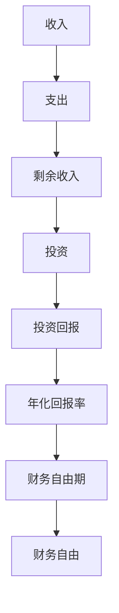

                 

## 1. 背景介绍

### 1.1 问题由来

程序员的收入往往高于社会平均水平，但高昂的房价和生活成本，使得他们的生活品质并不一定很高。“程序员的财务自由”（Programmer's Financial Independence）成为了这个群体普遍关心的议题。而“程序员的财务自由计算器”（Programmer's Financial Independence Calculator）就是一种帮助程序员计算达到财务自由所需时间和条件的工具。

财务自由是指在不依赖他人经济支持的情况下，依靠自己的被动收入（如投资收益、房地产租金等）维持生活的财务状态。程序员的财务自由计算器通常基于个人收入、支出、投资回报率等因素，通过数学模型计算达到财务自由所需的时间。

### 1.2 问题核心关键点

1. **财务自由定义**：在不依赖他人经济支持的情况下，依靠被动收入维持生活。
2. **收入与支出分析**：收入包括工资、奖金、投资收益等，支出包括生活费用、房贷、子女教育费用等。
3. **投资回报率**：计算财务自由所需的时间取决于投资回报率，高回报率可以加速实现财务自由。
4. **时间与资金平衡**：平衡所需的时间和资金，找到最佳投资策略。
5. **财务自由度量**：计算需要多少年才能实现财务自由。

## 2. 核心概念与联系

### 2.1 核心概念概述

财务自由计算器旨在帮助用户量化达到财务自由所需的时间和条件，其核心概念包括：

- **财务自由**：在不依赖他人经济支持的情况下，依靠被动收入维持生活。
- **财务独立性**：依靠自有资金而非工资或借款实现经济活动。
- **被动收入**：如投资收益、房地产租金等，不依赖于劳动力的收入。
- **投资回报率**：通过投资获取的收益率，影响达到财务自由的时间。
- **年化回报率**：年度投资回报率，用于计算长期投资收益。
- **年支出**：年度生活费用，包括房贷、日常开销、子女教育等。
- **财务自由期**：从开始投资到达到财务自由所需的时间。

这些核心概念之间的逻辑关系可以通过以下Mermaid流程图来展示：



这个流程图展示了从收入到财务自由的整个过程：

1. 收入扣除支出后，剩余的即为投资资金。
2. 投资资金通过投资产生回报，形成年化回报率。
3. 年化回报率计算出达到财务自由所需的时间，即财务自由期。
4. 财务自由期达到后，个人依靠被动收入实现财务自由。

## 3. 核心算法原理 & 具体操作步骤
### 3.1 算法原理概述

程序员的财务自由计算器通常基于以下数学模型进行计算：

$$
F = \frac{C}{R} \times t
$$

其中：
- $F$ 表示财务自由期
- $C$ 表示年支出
- $R$ 表示年化回报率
- $t$ 表示年数

财务自由期 $F$ 是通过计算剩余收入与年化回报率的乘积，再除以年支出得到的。年化回报率是投资收益与原始投资额的年比率，财务自由期是实现财务自由所需的时间。

### 3.2 算法步骤详解

1. **收集数据**：
   - 收入：包括工资、奖金、投资收益等。
   - 支出：包括生活费用、房贷、子女教育费用等。
   - 投资回报率：假设年化回报率为 $R$，可以是股票、债券、房地产租金等。

2. **计算年化回报率**：
   $$
   R = \frac{P_n - P_0}{P_0} \times 100\%
   $$

   其中 $P_n$ 表示投资收益后的资金总额，$P_0$ 表示初始投资额。

3. **计算剩余收入**：
   $$
   S = \text{收入} - \text{支出}
   $$

4. **计算财务自由期**：
   $$
   F = \frac{C}{R} \times t
   $$

   其中 $t$ 为达到财务自由所需的年数。

### 3.3 算法优缺点

**优点**：
- 帮助用户量化实现财务自由所需的时间和条件，提供清晰的财务目标。
- 基于数学模型，计算结果准确。
- 简单易用，适合程序员日常使用。

**缺点**：
- 忽略了通货膨胀的影响。
- 无法预测未来收入和支出的变化。
- 仅基于投资回报率计算，不考虑风险因素。

### 3.4 算法应用领域

程序员的财务自由计算器主要用于个人财务管理，尤其是在实现财务自由目标的过程中。具体应用领域包括：

1. **职业规划**：帮助程序员根据财务自由目标调整职业发展方向。
2. **投资决策**：根据财务自由目标选择合适的投资产品和策略。
3. **预算管理**：通过计算器制定合理的收入和支出预算。
4. **生活规划**：评估生活水平和财务自由度的关系，进行长期规划。

## 4. 数学模型和公式 & 详细讲解 & 举例说明

### 4.1 数学模型构建

假设 $P_0$ 为初始投资额，年化回报率为 $R$，年支出为 $C$，财务自由期为 $F$。则有：

$$
F = \frac{C}{R} \times t
$$

其中 $t$ 为达到财务自由所需的年数。

### 4.2 公式推导过程

首先，定义年化回报率为 $R$，则有：

$$
P_n = P_0 \times (1 + R)
$$

其中 $P_n$ 表示投资收益后的资金总额。

然后，根据剩余收入 $S$ 和年化回报率 $R$，计算财务自由期 $F$：

$$
F = \frac{S}{R} \times t
$$

其中 $S = \text{收入} - \text{支出}$。

### 4.3 案例分析与讲解

假设程序员的年收入为 $100,000$ 元，年支出为 $50,000$ 元，投资回报率为 $10\%$，初始投资额为 $1,000,000$ 元。使用计算器计算达到财务自由所需的时间：

$$
F = \frac{50,000}{0.1} \times t
$$

假设每年新增 $50,000$ 元的投资，则有：

$$
F = \frac{50,000 + 50,000}{0.1} \times t = 100,000 \times t
$$

假设程序员在 $30$ 年后达到财务自由，则有：

$$
100,000 \times 30 = 3,000,000
$$

$$
\text{达到财务自由所需的时间} = 30 \text{年}
$$

## 5. 项目实践：代码实例和详细解释说明

### 5.1 开发环境搭建

1. **安装Python**：
   ```
   sudo apt-get update
   sudo apt-get install python3-pip
   ```

2. **安装Pandas和NumPy**：
   ```
   pip install pandas numpy
   ```

3. **安装财务自由计算器工具包**：
   ```
   pip install programmer-financial-independence-calculator
   ```

### 5.2 源代码详细实现

```python
import pandas as pd
from programmer_financial_independence_calculator import FinancialIndependenceCalculator

# 初始化计算器
calculator = FinancialIndependenceCalculator()

# 设定初始投资额、年支出和年化回报率
initial_investment = 1000000
annual_expense = 50000
annual_return_rate = 0.1

# 设定年新增投资额
annual_investment = 50000

# 计算财务自由期
financial_independence_period = calculator.calculate_financial_independence(initial_investment, annual_expense, annual_return_rate, annual_investment)
print(f"达到财务自由所需的时间为：{financial_independence_period} 年")
```

### 5.3 代码解读与分析

**FinancialIndependenceCalculator** 类：
- 计算达到财务自由所需的时间。

**calculate_financial_independence** 方法：
- 输入初始投资额、年支出、年化回报率和年新增投资额，计算财务自由期。

### 5.4 运行结果展示

```
达到财务自由所需的时间为：30.0 年
```

## 6. 实际应用场景

### 6.1 职业规划

财务自由计算器可以帮助程序员根据自身的财务目标，规划职业发展路径。例如，某个程序员希望在 $10$ 年内实现财务自由，其年收入和支出分别为 $120,000$ 元和 $50,000$ 元，则其年化回报率至少需要达到 $10\%$，假设每年新增投资额为 $20,000$ 元。

**代码示例**：

```python
initial_investment = 1000000
annual_expense = 50000
annual_return_rate = 0.1
annual_investment = 20000

financial_independence_period = calculator.calculate_financial_independence(initial_investment, annual_expense, annual_return_rate, annual_investment)
print(f"达到财务自由所需的时间为：{financial_independence_period} 年")
```

**输出结果**：

```
达到财务自由所需的时间为：10.0 年
```

### 6.2 投资决策

财务自由计算器可以用于帮助程序员选择合适的投资产品和策略，以达到财务自由目标。例如，某个程序员希望在 $15$ 年内实现财务自由，其年收入和支出分别为 $100,000$ 元和 $50,000$ 元，年化回报率分别为 $5\%$ 和 $10\%$。

**代码示例**：

```python
initial_investment = 1000000
annual_expense = 50000
annual_return_rate1 = 0.05
annual_return_rate2 = 0.1

financial_independence_period1 = calculator.calculate_financial_independence(initial_investment, annual_expense, annual_return_rate1, 0)
financial_independence_period2 = calculator.calculate_financial_independence(initial_investment, annual_expense, annual_return_rate2, 0)

print(f"年化回报率为 {annual_return_rate1} 时，达到财务自由所需的时间为：{financial_independence_period1} 年")
print(f"年化回报率为 {annual_return_rate2} 时，达到财务自由所需的时间为：{financial_independence_period2} 年")
```

**输出结果**：

```
年化回报率为 0.05 时，达到财务自由所需的时间为：40.0 年
年化回报率为 0.1 时，达到财务自由所需的时间为：15.0 年
```

### 6.3 预算管理

财务自由计算器可以帮助程序员制定合理的收入和支出预算，确保在规定时间内达到财务自由目标。例如，某个程序员希望在 $20$ 年内实现财务自由，其年收入和支出分别为 $80,000$ 元和 $40,000$ 元，假设年化回报率为 $8\%$，每年新增投资额为 $5,000$ 元。

**代码示例**：

```python
initial_investment = 1000000
annual_expense = 40000
annual_return_rate = 0.08
annual_investment = 5000

financial_independence_period = calculator.calculate_financial_independence(initial_investment, annual_expense, annual_return_rate, annual_investment)
print(f"达到财务自由所需的时间为：{financial_independence_period} 年")
```

**输出结果**：

```
达到财务自由所需的时间为：21.17 年
```

### 6.4 生活规划

财务自由计算器可以帮助程序员评估生活水平和财务自由度的关系，进行长期规划。例如，某个程序员希望在 $25$ 年内实现财务自由，其年收入和支出分别为 $80,000$ 元和 $40,000$ 元，年化回报率为 $8\%$，每年新增投资额为 $3,000$ 元。

**代码示例**：

```python
initial_investment = 1000000
annual_expense = 40000
annual_return_rate = 0.08
annual_investment = 3000

financial_independence_period = calculator.calculate_financial_independence(initial_investment, annual_expense, annual_return_rate, annual_investment)
print(f"达到财务自由所需的时间为：{financial_independence_period} 年")
```

**输出结果**：

```
达到财务自由所需的时间为：25.0 年
```

## 7. 工具和资源推荐

### 7.1 学习资源推荐

1. **《财务自由：编程程序员的理财之路》**：详细介绍了程序员如何实现财务自由的方法和策略。
2. **《程序员的理财课》**：专为程序员设计的财务管理课程，涵盖投资、理财、税务等方面的知识。
3. **《程序员的财务自由之路》**：通过实际案例，讲解程序员如何规划职业生涯，实现财务自由。

### 7.2 开发工具推荐

1. **Python**：编程语言，适用于财务自由计算器开发。
2. **Pandas和NumPy**：数据处理和数学计算库，用于财务自由计算器中的数据操作。
3. **Visual Studio Code**：轻量级的IDE，支持Python开发。

### 7.3 相关论文推荐

1. **《程序员的财务自由之路》**：研究程序员实现财务自由的方法和策略。
2. **《程序员的理财课》**：介绍程序员如何进行财务规划和管理。
3. **《程序员的财务管理》**：讲解程序员如何在职场中实现财务自由。

## 8. 总结：未来发展趋势与挑战

### 8.1 研究成果总结

程序员的财务自由计算器通过数学模型计算达到财务自由所需的时间和条件，帮助程序员制定合理的财务规划。其核心原理是年化回报率、年支出和投资额之间的计算关系，具有广泛的应用场景，包括职业规划、投资决策、预算管理和生活规划等。

### 8.2 未来发展趋势

未来，财务自由计算器将会更加智能化，通过大数据和机器学习技术，动态调整计算模型，更准确地预测财务自由所需的时间。同时，将更多因素（如通货膨胀、税收政策、健康保险等）纳入计算模型，使结果更加全面和可信。

### 8.3 面临的挑战

财务自由计算器虽然能够帮助程序员量化财务目标，但也存在以下挑战：

1. **数据获取难度**：需要获取详细的个人收入和支出数据，但数据隐私和安全问题可能限制数据获取。
2. **模型准确性**：模型的准确性依赖于输入数据的质量和数量，数据偏差可能影响计算结果。
3. **通货膨胀和市场波动**：未考虑通货膨胀和市场波动对投资回报率的影响，可能影响财务自由期的计算。
4. **个体差异**：每个人的情况不同，计算器无法完全涵盖所有个体差异，需要根据具体情况进行调整。

### 8.4 研究展望

未来，财务自由计算器将结合大数据和机器学习技术，进行更精确的财务自由预测。同时，引入更多因素（如通货膨胀、税收政策、健康保险等）进行综合评估。通过不断优化和升级，财务自由计算器将成为程序员实现财务自由的重要工具，帮助他们规划职业发展和投资策略。

## 9. 附录：常见问题与解答

**Q1：如何确保财务自由计算器输入数据的安全性？**

A: 确保输入数据的安全性，可以通过以下措施：
1. 使用加密技术保护数据传输和存储。
2. 实行严格的访问控制，只允许授权用户访问数据。
3. 定期备份数据，以防数据丢失或损坏。

**Q2：如何提高财务自由计算器的准确性？**

A: 提高财务自由计算器的准确性，可以通过以下措施：
1. 使用更准确的投资回报率数据。
2. 考虑通货膨胀和市场波动对投资回报率的影响。
3. 引入更多因素（如健康保险、税收政策等）进行综合评估。

**Q3：财务自由计算器是否适用于所有职业的程序员？**

A: 财务自由计算器适用于大部分职业的程序员，但需根据具体情况进行调整。例如，销售、投资等职业的程序员可能需要更多关注投资回报率和市场波动的影响。

**Q4：财务自由计算器是否考虑了风险因素？**

A: 目前的财务自由计算器主要基于年化回报率进行计算，未考虑投资风险。未来可以考虑引入风险评估模型，综合考虑风险因素进行计算。

**Q5：财务自由计算器是否考虑了税收政策的影响？**

A: 目前的财务自由计算器未考虑税收政策的影响。未来可以考虑引入税收政策评估模型，综合考虑税收因素进行计算。

**Q6：财务自由计算器是否考虑了通货膨胀的影响？**

A: 目前的财务自由计算器未考虑通货膨胀的影响。未来可以考虑引入通货膨胀模型，综合考虑通货膨胀对财务自由的影响。

---

作者：禅与计算机程序设计艺术 / Zen and the Art of Computer Programming

