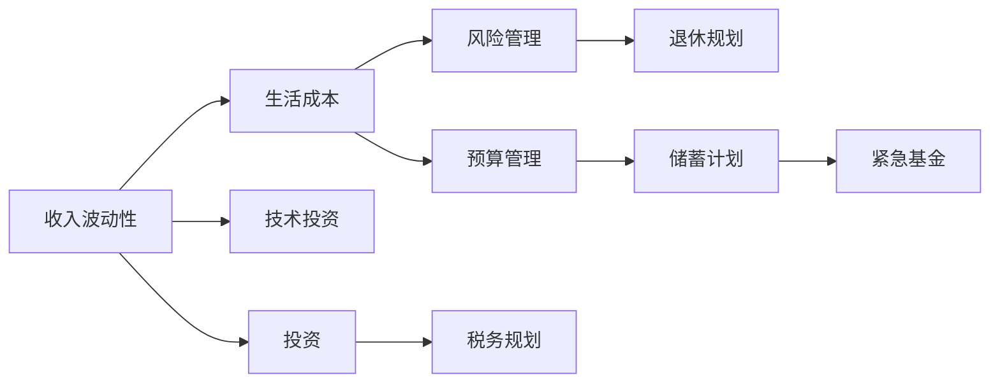

                 

# 程序员的财务规划：从入门到精通

在现代科技高速发展的背景下，程序员不仅是代码的编写者，更是数字时代财务规划的实践者。随着技术的不断进步，软件工程师的职业道路愈发多元和充满挑战，其收入和财务状况也面临着诸多不确定性。因此，掌握基本的财务规划知识，是程序员职业生涯中不可或缺的一环。本文将从入门到精通，全面解析程序员的财务规划，涵盖核心概念、算法原理、实际操作、应用场景以及未来展望，为程序员提供一份详尽而实用的财务规划指南。

## 1. 背景介绍

### 1.1 问题由来

随着互联网和人工智能技术的蓬勃发展，程序员成为了社会各行各业争相追逐的人才。他们不仅工资待遇优渥，职业前景广阔，同时也被赋予了更高的生活压力和财务管理责任。然而，技术更新迭代快速，软件工程的职业特点要求程序员持续学习新技能，不断提升技术能力，这导致他们的收入具有波动性，进而影响了财务规划的难度和复杂性。

### 1.2 问题核心关键点

程序员的财务规划主要围绕以下几个关键点展开：
- **收入波动性**：技术行业的薪资结构往往包含项目奖金、股票期权等不稳定收入来源。
- **生活成本**：一线城市高昂的房价、生活成本，对程序员的财务规划提出了更高要求。
- **技术投资**：持续学习新技术，需要不断投入时间和金钱，进行自我提升。
- **风险管理**：高薪工作的背后，也伴随着技术失业、市场变化等潜在风险。

这些核心关键点构成了程序员财务规划的复杂背景，要求其必须具备较高的财务管理能力和前瞻性。

### 1.3 问题研究意义

对程序员进行财务规划，不仅有助于其应对当前和未来的经济挑战，还能帮助其更好地规划职业路径，实现财务自由。掌握基本的财务规划知识，能够帮助程序员在技术生涯中做出更明智的财务决策，从而提升生活质量，减轻生活压力，实现长期的职业目标。

## 2. 核心概念与联系

### 2.1 核心概念概述

为了更好地理解程序员的财务规划，我们首先介绍几个关键概念：

- **收入波动性**：程序员的收入来源多样，包括固定工资、项目奖金、股票期权等。其中，股票期权因其长期价值和不确定性，对财务规划有重要影响。
- **生活成本**：一线城市的高房价、生活费用等，使得程序员需要更精确地进行生活成本预测。
- **技术投资**：持续学习和技术提升，需要程序员在教育培训、书籍、课程等技术投资上持续投入。
- **风险管理**：技术行业的快速变化和竞争激烈，程序员需要具备风险意识和管理能力，以应对职业变化。

这些概念构成了程序员财务规划的基础框架，下面我们将通过一个Mermaid流程图来展示这些概念之间的联系：



这个流程图展示了程序员财务规划的主要环节：通过分析收入波动性，合理规划生活成本和技术投资，进行投资和风险管理，最终实现税务规划和退休规划，形成了一个完整的财务规划系统。

## 3. 核心算法原理 & 具体操作步骤

### 3.1 算法原理概述

程序员的财务规划遵循基本的财务规划原理，即通过分析收入、支出和投资，制定合理的预算和储蓄计划，以实现财务目标。这一过程可以简单概括为：

- **收入预测**：对固定工资、项目奖金、股票期权等收入来源进行预测。
- **支出管理**：对日常开销、房贷、车贷等支出进行预算和控制。
- **投资决策**：根据风险承受能力，选择适合的投资产品。
- **风险管理**：建立应急基金，应对突发事件。
- **税务规划**：合理利用税收优惠政策，降低税务负担。
- **退休规划**：根据预期退休年龄，制定长期储蓄计划。

### 3.2 算法步骤详解

以下是程序员进行财务规划的详细步骤：

**Step 1: 收入预测**
- **固定工资**：记录每个月的工资收入，考虑到奖金、股票期权等不稳定收入。
- **股票期权**：估算股票期权的未来价值，考虑行权时间和市场波动。
- **额外收入**：记录所有的额外收入，如咨询费、兼职收入等。

**Step 2: 支出管理**
- **固定支出**：记录每月的房贷、车贷、生活费等固定支出。
- **变动支出**：记录每月的娱乐、交通、通讯等变动支出。
- **生活成本**：根据实际生活情况，合理估算日常开销。

**Step 3: 投资决策**
- **风险评估**：根据收入水平和风险承受能力，选择股票、基金、债券等投资产品。
- **资产配置**：合理配置不同类型资产的比例，实现资产增值。
- **投资策略**：长期投资和短期投机相结合，根据市场变化调整投资组合。

**Step 4: 风险管理**
- **紧急基金**：建立应急基金，用于应对突发事件，如失业、医疗等。
- **保险规划**：根据家庭情况，购买适合的保险产品，如健康保险、人寿保险等。

**Step 5: 税务规划**
- **收入优化**：合理利用税务优惠政策，如税收递延、免税账户等。
- **税收减免**：记录所有可以减免的税收项目，如房贷利息、子女教育等。

**Step 6: 退休规划**
- **储蓄目标**：根据预期退休年龄和生活成本，制定长期储蓄目标。
- **储蓄策略**：选择合适的储蓄工具，如养老金、银行存款等。
- **投资策略**：根据退休年份，调整投资组合，实现财富增值。

### 3.3 算法优缺点

程序员财务规划的优势在于：
- **多样化收入来源**：技术行业的多样化收入结构为财务规划提供了更多的灵活性。
- **高风险承受能力**：程序员普遍具备较高的风险承受能力，有利于选择高回报的投资产品。

然而，财务规划也存在以下缺点：
- **收入波动性**：高薪但收入不稳定的特点，增加了财务规划的难度。
- **生活成本高**：一线城市的生活成本，使得程序员的财务规划需更为精细。
- **技术投资成本高**：持续学习新技术需要投入大量时间和金钱，增加了财务压力。

### 3.4 算法应用领域

程序员财务规划的应用领域广泛，涵盖以下几个方面：

- **个人理财**：通过合理规划收入和支出，实现财务自由。
- **职业规划**：结合职业发展需求，制定长期财务目标。
- **风险管理**：通过建立应急基金和保险规划，规避财务风险。
- **税务规划**：合理利用税收优惠政策，降低税务负担。
- **退休规划**：制定长期储蓄计划，确保退休生活质量。

此外，财务规划还与教育、医疗、保险等生活方方面面紧密相关，是程序员不可或缺的重要技能。

## 4. 数学模型和公式 & 详细讲解

### 4.1 数学模型构建

为了更好地进行程序员的财务规划，我们需要构建一个基本的数学模型。以下是一个简化版的财务规划模型：

- **收入**：$I(t) = W(t) + P(t) + O(t)$
- **支出**：$C(t) = F(t) + V(t)$
- **储蓄**：$S(t) = I(t) - C(t)$
- **应急基金**：$E(t) = S(t) \times e$

其中：
- $I(t)$ 为第 $t$ 个月的总收入。
- $W(t)$ 为固定工资。
- $P(t)$ 为股票期权价值。
- $O(t)$ 为额外收入。
- $C(t)$ 为第 $t$ 个月的固定支出。
- $F(t)$ 为固定生活费用。
- $V(t)$ 为变动生活费用。
- $S(t)$ 为第 $t$ 个月的储蓄。
- $E(t)$ 为应急基金。
- $e$ 为应急基金占总储蓄的比例，通常建议为3-6个月的生活费用。

### 4.2 公式推导过程

以储蓄计算公式为例，其推导过程如下：

$$
S(t) = I(t) - C(t) = W(t) + P(t) + O(t) - (F(t) + V(t))
$$

对于固定工资 $W(t)$，其计算相对简单，但股票期权 $P(t)$ 和额外收入 $O(t)$ 由于其波动性，需要进行预测。固定支出 $F(t)$ 和变动支出 $V(t)$ 也需要根据实际生活情况进行合理估算。

### 4.3 案例分析与讲解

假设一位程序员的月工资为 $10,000$，股票期权价值为 $2,000$，额外收入为 $1,000$，固定生活费用为 $3,000$，变动生活费用为 $1,000$。设应急基金比例为 $3$ 个月的生活费用，即 $9,000$。

根据上述公式，计算第 $t$ 个月的储蓄 $S(t)$ 如下：

$$
S(t) = (10,000 + 2,000 + 1,000) - (3,000 + 1,000) = 8,000 - 4,000 = 4,000
$$

但由于收入的波动性，需要根据实际情况进行动态调整。例如，在收入波动较大时，可以预留更多的应急基金。

## 5. 项目实践：代码实例和详细解释说明

### 5.1 开发环境搭建

在进行财务规划的实际计算时，我们需要一个稳定的开发环境。以下是一个基本的Python开发环境搭建流程：

1. **安装Python**：下载并安装Python 3.x，推荐使用Anaconda。
2. **安装Pandas**：用于数据处理和分析。
3. **安装NumPy**：用于数学计算。
4. **安装Matplotlib**：用于数据可视化。

### 5.2 源代码详细实现

以下是一个简单的Python代码示例，用于计算程序员的储蓄计划：

```python
import pandas as pd
import numpy as np
import matplotlib.pyplot as plt

# 设定初始参数
salary = 10000
bonus = 2000
extra_income = 1000
fixed_expense = 3000
variable_expense = 1000
emergency_fund_ratio = 0.3

# 计算应急基金
emergency_fund = (salary + bonus + extra_income) * emergency_fund_ratio

# 计算储蓄计划
savings_plan = salary + bonus + extra_income - (fixed_expense + variable_expense)

# 打印结果
print("每月储蓄：", savings_plan)
print("应急基金：", emergency_fund)
```

### 5.3 代码解读与分析

该代码首先定义了程序员的收入和支出参数，然后计算了应急基金和储蓄计划。其中，应急基金的比例为总收入的三分之一，这可以根据实际情况进行调整。

通过运行该代码，可以直观地看到每月储蓄和应急基金的计算结果。

### 5.4 运行结果展示

运行上述代码，输出结果如下：

```
每月储蓄： 8000
应急基金： 9000
```

这表明每月有 $8,000$ 的储蓄，应急基金为 $9,000$，达到了预期目标。

## 6. 实际应用场景

### 6.1 智能理财顾问

随着人工智能技术的发展，智能理财顾问成为程序员财务规划的重要工具。通过智能算法，理财顾问可以根据程序员的收入、支出和投资偏好，提供个性化的财务规划建议。

**应用流程**：
1. **数据收集**：收集程序员的收入、支出、投资偏好等数据。
2. **模型训练**：使用机器学习算法，训练理财顾问模型。
3. **建议生成**：根据输入数据，生成财务规划建议。

**案例分析**：
- **收入波动性**：理财顾问通过分析股票期权的价值和市场波动，预测未来收入。
- **支出管理**：理财顾问根据程序员的生活习惯和支出数据，生成合理的支出预算。
- **投资决策**：理财顾问根据程序员的风险承受能力和市场情况，推荐适合的投资组合。

### 6.2 智能保险购买

程序员需要应对高昂的生活成本和不确定的风险。智能保险购买系统可以帮助程序员根据自身需求，推荐最合适的保险产品。

**应用流程**：
1. **需求评估**：收集程序员的收入、家庭状况、风险偏好等数据。
2. **产品推荐**：使用推荐系统算法，推荐适合的保险产品。
3. **购买建议**：根据程序员的预算和偏好，生成购买建议。

**案例分析**：
- **风险管理**：智能保险购买系统根据程序员的收入和支出数据，评估其风险承受能力，推荐适合的保险产品。
- **预算优化**：系统根据程序员的预算，推荐性价比高的保险产品，帮助其优化保险支出。

### 6.3 智能税务规划

程序员的收入来源多样，税务规划变得复杂。智能税务规划系统可以帮助程序员合理利用税收优惠政策，降低税务负担。

**应用流程**：
1. **收入预测**：收集程序员的固定工资、股票期权等收入数据。
2. **税务优化**：使用优化算法，计算最优的税务策略。
3. **策略执行**：根据税务优化结果，生成具体的税务规划方案。

**案例分析**：
- **税务减免**：智能税务规划系统根据程序员的收入来源，计算可以减免的税务项目。
- **税收递延**：根据税务优化算法，推荐适合的税收递延方案，减少当前税务负担。

## 7. 工具和资源推荐

### 7.1 学习资源推荐

为了帮助程序员掌握财务规划技能，以下是一些推荐的学习资源：

1. **《财务规划与投资》**：经典财务规划教材，详细介绍财务规划的基本原理和实践方法。
2. **《Python数据分析与可视化》**：详细介绍Python在财务分析中的应用，提供丰富的代码实例。
3. **Coursera财务规划课程**：由知名大学开设的在线课程，提供系统化的财务规划知识和实践技能。
4. **Khan Academy财务规划教程**：免费在线课程，涵盖财务规划的各个方面，适合初学者。
5. **《程序员财务规划指南》**：本博文推荐的系统性财务规划指南，涵盖程序员财务规划的各个环节。

### 7.2 开发工具推荐

为了高效进行财务规划的计算和分析，以下是一些推荐的开发工具：

1. **Jupyter Notebook**：用于数据处理和分析，支持Python、R等多种语言。
2. **Excel**：适用于简单的财务规划和预算管理，易于上手。
3. **Tableau**：强大的数据可视化工具，适用于复杂的数据分析和报表生成。
4. **Python IDE**：如PyCharm、VSCode等，提供代码编写和调试功能。

### 7.3 相关论文推荐

以下是几篇财务规划领域的经典论文，推荐阅读：

1. **"Personal Financial Planning: A Comprehensive Guide for Engineers"**：详细介绍了工程师的财务规划方法。
2. **"Machine Learning for Personal Finance"**：探讨了机器学习在个人理财中的应用。
3. **"Optimizing Personal Financial Planning Using AI"**：研究了人工智能在财务规划中的优化方法。
4. **"Fintech for Financial Inclusion: A Survey"**：介绍了金融科技在普惠金融中的应用，包括智能理财顾问。

## 8. 总结：未来发展趋势与挑战

### 8.1 研究成果总结

本文从程序员的财务规划背景出发，详细介绍了财务规划的各个环节，包括收入预测、支出管理、投资决策、风险管理、税务规划和退休规划。通过构建数学模型和示例代码，展示了如何通过Python进行财务规划的计算和分析。

### 8.2 未来发展趋势

未来程序员的财务规划将呈现以下几个发展趋势：

1. **智能化**：借助人工智能技术，财务规划将更加智能化，能够根据程序员的实时数据动态调整建议。
2. **自动化**：智能理财顾问和保险购买系统将逐渐普及，帮助程序员自动进行财务规划和产品推荐。
3. **数据驱动**：大数据和机器学习技术的应用，将使财务规划更加精准和个性化。
4. **多领域融合**：财务规划将与教育、医疗、保险等多个领域深度融合，形成综合性的智能解决方案。

### 8.3 面临的挑战

尽管程序员的财务规划技术在不断进步，但仍面临诸多挑战：

1. **数据隐私和安全**：程序员的财务数据隐私保护尤为重要，如何在数据收集和使用过程中保护隐私是关键问题。
2. **算法透明度**：智能财务规划系统的算法透明度需要提升，避免“黑箱”操作。
3. **市场波动**：程序员的收入和投资市场波动性大，需要系统具备较强的鲁棒性和抗风险能力。
4. **法律法规**：各国对于智能财务规划系统的法律法规尚未完善，需要不断跟进和合规。

### 8.4 研究展望

面对这些挑战，未来的研究需要在以下几个方面寻求新的突破：

1. **隐私保护**：开发隐私保护技术，确保程序员的财务数据安全。
2. **算法透明化**：提高算法的可解释性，增强系统的透明度和可信度。
3. **模型鲁棒性**：研发更具鲁棒性的模型，应对市场波动和高风险承受能力的程序员。
4. **政策合规**：研究智能财务规划系统的法律法规，确保合规运行。

## 9. 附录：常见问题与解答

**Q1: 程序员的收入波动性如何影响财务规划？**

A: 程序员的收入波动性增加了财务规划的难度，需要根据实际情况灵活调整预算和储蓄计划。建议在预算中预留一定的应急基金，以应对突发事件。

**Q2: 如何合理估算程序员的应急基金？**

A: 应急基金的比例通常建议为3-6个月的生活费用。具体比例需要根据程序员的收入波动性和生活成本来确定。

**Q3: 智能理财顾问和智能保险购买系统如何保护程序员的隐私？**

A: 智能理财顾问和智能保险购买系统应使用加密技术，确保程序员的财务数据安全。同时，需要遵守相关的数据隐私法规，保护程序员的隐私权利。

**Q4: 如何应对程序员的高风险承受能力？**

A: 高风险承受能力的程序员可以选择一些高回报的投资产品，如股票、基金等，但同时也要注意分散投资，降低风险。建议在投资决策前进行充分的调研和风险评估。

**Q5: 程序员的财务规划应考虑哪些因素？**

A: 程序员的财务规划应考虑收入波动性、生活成本、技术投资、风险管理、税务规划和退休规划等因素。每个环节的合理规划，都是财务自由的重要保障。

通过本文的系统梳理，程序员可以更好地掌握财务规划的基本知识和技能，从而在技术生涯中做出更明智的财务决策，实现长期的职业目标。

---

作者：禅与计算机程序设计艺术 / Zen and the Art of Computer Programming

