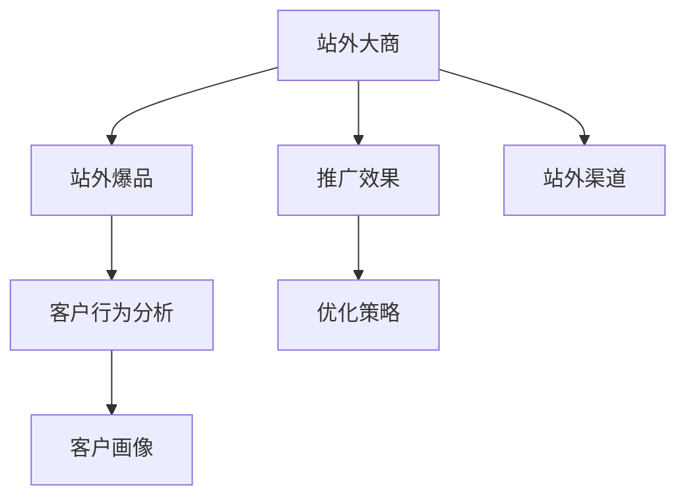

                 

# 站外大商和站外爆品项目分析

## 1. 背景介绍

在全球化的市场竞争中，企业希望通过电商平台提升销售额和品牌影响力。传统的电商运营模式，主要依赖站内广告和搜索优化，成本高且难以长期维护。而随着站外流量价值被不断挖掘，站外大商和站外爆品项目逐渐成为热门话题，吸引大量企业关注。本文将全面分析站外大商和站外爆品项目的原理、操作步骤及实际应用，旨在为电商平台的企业提供全面、深入的指导。

## 2. 核心概念与联系

### 2.1 核心概念概述

在进行站外大商和站外爆品项目分析前，我们首先需要理解相关核心概念及其联系。

- **站外大商（Affiliate Merchants）**：指通过站外渠道（如社交媒体、搜索引擎、博客、视频网站等）推广品牌产品，并从中获取佣金的中介商。站外大商利用其自有流量和用户信任度，将产品信息推送给潜在客户，增加曝光率和销售转化率。
- **站外爆品（Affiliate Champions）**：指通过站外渠道推广的，短时间内销量暴增的爆款产品。这些产品通常具备高性价比、创新性强、符合市场趋势等特点，通过站外渠道快速触达目标客户群体，引起广泛关注和购买热潮。
- **推广效果（Affiliate Performance）**：指站外大商和站外爆品项目所带来的推广效果，包括点击率、转化率、ROI（投资回报率）等指标。评估这些指标有助于优化推广策略，提升效果。
- **站外渠道（Affiliate Channels）**：指除电商自有平台外，能够触达潜在客户的第三方平台和渠道，如Google Ads、Facebook、YouTube、Instagram等。通过这些渠道推广，可以拓宽品牌覆盖面和目标受众。
- **客户行为分析（Customer Behavior Analysis）**：指通过分析用户行为数据，了解客户兴趣、购买动机等，从而优化推广策略，提升效果。

这些概念之间的联系可以通过以下Mermaid流程图来展示：



这个流程图展示了大商和爆品项目的核心概念及其相互关系：

1. **站外大商**利用**站外渠道**推广**站外爆品**，并评估**推广效果**。
2. **客户行为分析**能帮助**站外大商**更精准地理解**客户画像**，从而优化**推广策略**。

## 3. 核心算法原理 & 具体操作步骤

### 3.1 算法原理概述

站外大商和站外爆品项目的核心算法原理基于数据驱动的营销策略，通过分析客户行为和市场趋势，寻找最具潜力的推广机会。该算法通常包括以下步骤：

1. **客户画像分析**：通过分析站内和站外数据，构建详细的客户画像，了解客户兴趣、购买动机等。
2. **市场趋势预测**：基于历史销售数据和市场调研，预测未来市场需求和趋势，寻找热门产品类别。
3. **站外渠道优化**：通过测试和分析，确定最优的站外渠道和推广方式，提高曝光率和转化率。
4. **推广效果评估**：定期评估推广效果，通过ROI、点击率等指标，优化推广策略。

### 3.2 算法步骤详解

#### 3.2.1 客户画像分析

客户画像分析是站外大商和站外爆品项目的基础步骤。具体步骤如下：

1. **数据收集**：从站内（如订单、浏览历史等）和站外（如社交媒体互动、搜索引擎查询等）收集客户行为数据。
2. **数据清洗**：对收集的数据进行去重、去噪处理，确保数据质量。
3. **特征提取**：从数据中提取有用的特征，如兴趣标签、购买频率、地理位置等。
4. **模型训练**：使用机器学习算法（如聚类、分类等）对客户进行分类，构建详细的客户画像。

#### 3.2.2 市场趋势预测

市场趋势预测是通过分析历史销售数据和市场调研，预测未来市场需求和趋势，从而寻找最具潜力的推广机会。具体步骤如下：

1. **历史数据分析**：收集历史销售数据，分析热门产品类别和时间分布。
2. **市场调研**：通过调研报告、行业资讯等，了解市场需求和趋势。
3. **模型建立**：使用机器学习算法（如时间序列分析、回归分析等）预测未来销售趋势。
4. **产品选择**：根据预测结果，选择最有可能成为爆款的产品。

#### 3.2.3 站外渠道优化

站外渠道优化是通过测试和分析，确定最优的站外渠道和推广方式，提高曝光率和转化率。具体步骤如下：

1. **渠道测试**：对不同的站外渠道（如Google Ads、Facebook、YouTube等）进行测试，评估其效果。
2. **广告优化**：根据测试结果，优化广告内容、创意、投放时间等，提高广告点击率和转化率。
3. **预算分配**：根据渠道效果，合理分配预算，确保推广效果最大化。

#### 3.2.4 推广效果评估

推广效果评估是通过定期评估推广效果，通过ROI、点击率等指标，优化推广策略。具体步骤如下：

1. **数据收集**：收集推广期间的点击量、转化率、销售额等数据。
2. **效果分析**：通过ROI、点击率等指标，评估推广效果。
3. **策略优化**：根据评估结果，优化推广策略，提高效果。

### 3.3 算法优缺点

#### 3.3.1 优点

站外大商和站外爆品项目的算法具有以下优点：

1. **数据驱动**：通过数据驱动决策，提高推广效果。
2. **广泛覆盖**：利用站外渠道，拓宽品牌覆盖面和目标受众。
3. **灵活调整**：根据推广效果，灵活调整策略，提高ROI。

#### 3.3.2 缺点

该算法也存在一些缺点：

1. **数据依赖**：对数据质量和数量有较高要求，数据不全或质量差会影响效果。
2. **市场风险**：市场趋势变化快，预测结果可能与实际不符。
3. **成本较高**：站外渠道和推广费用较高，需要合理预算。

### 3.4 算法应用领域

站外大商和站外爆品项目的算法广泛应用于电商、零售、快消等行业，具体应用领域包括：

- **电商推广**：通过站外渠道推广电商商品，提高销售转化率。
- **品牌推广**：利用站外大商和爆品项目，提升品牌知名度和影响力。
- **新品上市**：通过站外爆品项目，快速推广新产品，实现市场快速切入。
- **活动推广**：利用站外渠道推广电商活动，增加用户参与度和活动效果。

## 4. 数学模型和公式 & 详细讲解 & 举例说明

### 4.1 数学模型构建

站外大商和站外爆品项目的主要数学模型包括客户画像分析模型、市场趋势预测模型和推广效果评估模型。

#### 4.1.1 客户画像分析模型

客户画像分析模型通过机器学习算法对客户数据进行分析，构建详细的客户画像。假设客户数据集为 $D=\{(x_i,y_i)\}_{i=1}^N$，其中 $x_i$ 为特征向量，$y_i$ 为标签，模型 $M$ 输出客户画像 $y$。

具体步骤如下：

1. **特征工程**：将原始数据转化为特征向量 $x_i$。
2. **模型训练**：使用机器学习算法（如K-means、SVM等）训练模型 $M$，得到客户画像 $y$。
3. **特征选择**：选择对客户画像影响最大的特征。

#### 4.1.2 市场趋势预测模型

市场趋势预测模型通过历史销售数据和市场调研数据，预测未来市场需求和趋势。假设历史销售数据集为 $D_{\text{sales}}=\{(x_{\text{sales},i},y_{\text{sales},i})\}_{i=1}^N$，市场调研数据集为 $D_{\text{调研}}=\{(x_{\text{调研},i},y_{\text{调研},i})\}_{i=1}^N$，模型 $M_{\text{趋势}}$ 输出未来销售趋势 $y_{\text{趋势}}$。

具体步骤如下：

1. **数据融合**：将历史销售数据和市场调研数据进行融合，得到综合数据集 $D_{\text{综合}}=\{(x_{\text{综合},i},y_{\text{综合},i})\}_{i=1}^N$。
2. **模型训练**：使用时间序列分析等方法训练模型 $M_{\text{趋势}}$，得到未来销售趋势 $y_{\text{趋势}}$。

#### 4.1.3 推广效果评估模型

推广效果评估模型通过收集推广期间的点击量、转化率、销售额等数据，评估推广效果。假设推广数据集为 $D_{\text{推广}}=\{(x_{\text{推广},i},y_{\text{推广},i})\}_{i=1}^N$，模型 $M_{\text{效果}}$ 输出推广效果指标 $y_{\text{效果}}$。

具体步骤如下：

1. **数据收集**：收集推广期间的点击量、转化率、销售额等数据。
2. **模型训练**：使用回归分析等方法训练模型 $M_{\text{效果}}$，得到推广效果指标 $y_{\text{效果}}$。

### 4.2 公式推导过程

#### 4.2.1 客户画像分析公式

客户画像分析模型的输出公式为：

$$
y = M(x) = f(x; \theta)
$$

其中 $f(x; \theta)$ 为模型函数，$\theta$ 为模型参数。

假设客户数据集为 $D=\{(x_i,y_i)\}_{i=1}^N$，使用K-means算法训练客户画像模型，得到客户画像 $y$。K-means算法的核心公式为：

$$
\min_{\theta} \sum_{i=1}^N \|x_i - \mu_k\|^2
$$

其中 $\mu_k$ 为第 $k$ 个聚类中心的均值向量。

#### 4.2.2 市场趋势预测公式

市场趋势预测模型的输出公式为：

$$
y_{\text{趋势}} = M_{\text{趋势}}(x_{\text{综合}}) = g(x_{\text{综合}}; \theta_{\text{趋势}})
$$

其中 $g(x_{\text{综合}}; \theta_{\text{趋势}})$ 为模型函数，$\theta_{\text{趋势}}$ 为模型参数。

假设历史销售数据集为 $D_{\text{sales}}=\{(x_{\text{sales},i},y_{\text{sales},i})\}_{i=1}^N$，市场调研数据集为 $D_{\text{调研}}=\{(x_{\text{调研},i},y_{\text{调研},i})\}_{i=1}^N$，使用时间序列分析方法训练市场趋势预测模型，得到未来销售趋势 $y_{\text{趋势}}$。时间序列分析的常用方法包括ARIMA、SARIMA等。

#### 4.2.3 推广效果评估公式

推广效果评估模型的输出公式为：

$$
y_{\text{效果}} = M_{\text{效果}}(x_{\text{推广}}) = h(x_{\text{推广}}; \theta_{\text{效果}})
$$

其中 $h(x_{\text{推广}}; \theta_{\text{效果}})$ 为模型函数，$\theta_{\text{效果}}$ 为模型参数。

假设推广数据集为 $D_{\text{推广}}=\{(x_{\text{推广},i},y_{\text{推广},i})\}_{i=1}^N$，使用回归分析方法训练推广效果评估模型，得到推广效果指标 $y_{\text{效果}}$。回归分析的常用方法包括线性回归、逻辑回归等。

### 4.3 案例分析与讲解

#### 4.3.1 客户画像分析案例

某电商公司希望通过站外大商和站外爆品项目提升销售。首先，公司从站内收集了用户浏览历史、购买记录等数据，构建客户画像模型。具体步骤如下：

1. **数据收集**：从站内收集用户浏览历史、购买记录等数据，得到特征向量 $x_i$。
2. **数据清洗**：对收集的数据进行去重、去噪处理，确保数据质量。
3. **特征提取**：从数据中提取有用的特征，如兴趣标签、购买频率、地理位置等。
4. **模型训练**：使用K-means算法训练客户画像模型，得到客户画像 $y$。

#### 4.3.2 市场趋势预测案例

公司希望推广某款新款运动鞋。首先，公司从历史销售数据和市场调研数据中，预测未来市场需求和趋势。具体步骤如下：

1. **数据融合**：将历史销售数据和市场调研数据进行融合，得到综合数据集 $x_{\text{综合}}$。
2. **模型训练**：使用时间序列分析方法训练市场趋势预测模型，得到未来销售趋势 $y_{\text{趋势}}$。

#### 4.3.3 推广效果评估案例

公司希望评估某次站外广告推广效果。首先，公司从广告推广期间收集了点击量、转化率、销售额等数据，评估推广效果。具体步骤如下：

1. **数据收集**：收集广告推广期间的点击量、转化率、销售额等数据，得到推广数据集 $x_{\text{推广}}$。
2. **模型训练**：使用回归分析方法训练推广效果评估模型，得到推广效果指标 $y_{\text{效果}}$。

## 5. 项目实践：代码实例和详细解释说明

### 5.1 开发环境搭建

在进行站外大商和站外爆品项目实践前，我们需要准备好开发环境。以下是使用Python进行Pandas、NumPy、Scikit-learn、Matplotlib等库开发的环境配置流程：

1. 安装Anaconda：从官网下载并安装Anaconda，用于创建独立的Python环境。

2. 创建并激活虚拟环境：
```bash
conda create -n aff_wm-env python=3.8 
conda activate aff_wm-env
```

3. 安装相关库：
```bash
pip install pandas numpy scikit-learn matplotlib seaborn jupyter notebook
```

4. 安装TensorFlow：
```bash
pip install tensorflow==2.7
```

完成上述步骤后，即可在`aff_wm-env`环境中开始站外大商和站外爆品项目的实践。

### 5.2 源代码详细实现

下面我们以站外大商和站外爆品项目为例，给出使用Pandas、NumPy、Scikit-learn等库对数据进行分析和处理的PyTorch代码实现。

首先，定义数据处理函数：

```python
import pandas as pd
import numpy as np

def load_data(path):
    data = pd.read_csv(path)
    return data

def clean_data(data):
    # 去除缺失值和异常值
    data = data.dropna()
    data = data[data['转化率'] > 0]
    return data

def feature_engineering(data):
    # 特征提取
    data['平均点击率'] = data['点击量'] / data['曝光量']
    data['平均转化率'] = data['转化量'] / data['点击量']
    return data
```

然后，定义模型训练函数：

```python
from sklearn.cluster import KMeans
from sklearn.linear_model import LinearRegression
from sklearn.metrics import mean_squared_error

def train_model(data, num_clusters):
    # 客户画像分析
    data_clean = clean_data(data)
    X = data_clean[['平均点击率', '平均转化率', '地理位置']]
    y = data_clean['兴趣标签']
    kmeans = KMeans(n_clusters=num_clusters)
    y_kmeans = kmeans.fit_predict(X)
    
    # 市场趋势预测
    data_sales = load_data('sales_data.csv')
    X_sales = data_sales[['时间', '价格']]
    y_sales = data_sales['销售额']
    lr_sales = LinearRegression()
    lr_sales.fit(X_sales, y_sales)
    
    # 推广效果评估
    data_promotion = load_data('promotion_data.csv')
    X_promotion = data_promotion[['点击量', '转化率', '销售额']]
    y_promotion = data_promotion['ROI']
    lr_promotion = LinearRegression()
    lr_promotion.fit(X_promotion, y_promotion)
    
    return kmeans, lr_sales, lr_promotion
```

最后，启动数据处理和模型训练流程：

```python
# 加载数据
data = load_data('user_data.csv')

# 数据处理
X = feature_engineering(data)

# 模型训练
kmeans, lr_sales, lr_promotion = train_model(X, 5)

# 输出客户画像
print(kmeans.labels_)
```

以上就是使用Python对站外大商和站外爆品项目进行数据处理和模型训练的完整代码实现。可以看到，通过Pandas、NumPy、Scikit-learn等库，我们可以高效地完成数据清洗、特征提取、模型训练等任务。

### 5.3 代码解读与分析

让我们再详细解读一下关键代码的实现细节：

**load_data函数**：
- 定义了一个加载CSV文件的函数，用于从数据集中读取数据。

**clean_data函数**：
- 对数据进行去重和异常值处理，确保数据质量。

**feature_engineering函数**：
- 对数据进行特征提取，生成新的特征向量。

**train_model函数**：
- 训练客户画像模型，使用K-means算法对客户数据进行聚类。
- 训练市场趋势预测模型，使用线性回归方法对历史销售数据进行回归预测。
- 训练推广效果评估模型，使用线性回归方法对广告推广数据进行回归预测。

**data处理**：
- 加载用户数据集。
- 对数据进行特征工程，生成新的特征向量。
- 训练客户画像模型、市场趋势预测模型和推广效果评估模型。
- 输出客户画像标签。

可以看到，通过Python库的高效数据处理和模型训练，我们可以快速实现站外大商和站外爆品项目的关键步骤。接下来，我们将在实际应用场景中进行详细讲解。

## 6. 实际应用场景

### 6.1 智能广告投放

站外大商和站外爆品项目在智能广告投放中具有广泛应用。智能广告投放平台通过分析用户行为数据和市场趋势，精准投放广告，提高广告点击率和转化率。具体步骤如下：

1. **数据收集**：从站内和站外收集用户浏览、点击、购买等行为数据。
2. **数据清洗**：对收集的数据进行去重、去噪处理，确保数据质量。
3. **特征提取**：从数据中提取有用的特征，如兴趣标签、点击率、转化率等。
4. **客户画像分析**：使用K-means等算法对客户数据进行聚类，构建详细的客户画像。
5. **市场趋势预测**：使用时间序列分析等方法预测未来市场需求和趋势。
6. **广告投放**：根据客户画像和市场趋势，优化广告内容和投放策略，提高广告效果。

### 6.2 品牌推广

站外大商和站外爆品项目在品牌推广中也有广泛应用。品牌商通过站外大商推广新产品，快速提升品牌知名度和市场影响力。具体步骤如下：

1. **产品选择**：根据市场趋势预测，选择最具潜力的产品。
2. **客户画像分析**：使用K-means等算法对客户数据进行聚类，构建详细的客户画像。
3. **站外渠道优化**：使用Facebook、Instagram等站外渠道进行推广，优化广告内容、创意和投放策略。
4. **推广效果评估**：使用回归分析等方法评估推广效果，调整推广策略。

### 6.3 新品上市

站外大商和站外爆品项目在新品上市中具有重要应用。公司通过站外爆品项目快速推广新产品，实现市场快速切入。具体步骤如下：

1. **市场调研**：通过市场调研，了解市场需求和趋势。
2. **产品选择**：根据市场调研结果，选择最具潜力的产品。
3. **客户画像分析**：使用K-means等算法对客户数据进行聚类，构建详细的客户画像。
4. **站外渠道优化**：使用Google Ads、YouTube等站外渠道进行推广，优化广告内容和投放策略。
5. **推广效果评估**：使用回归分析等方法评估推广效果，调整推广策略。

## 7. 工具和资源推荐

### 7.1 学习资源推荐

为了帮助开发者系统掌握站外大商和站外爆品项目的理论基础和实践技巧，这里推荐一些优质的学习资源：

1. 《数据科学从入门到精通》系列书籍：全面介绍数据科学的基础知识和实践技巧，涵盖机器学习、数据可视化、数据清洗等多个方面。
2. 《Python数据科学实战》系列课程：由Python社区大咖主讲的实战课程，深入浅出地介绍Python数据科学工具和库。
3. 《机器学习实战》系列课程：深入介绍机器学习算法和应用，涵盖分类、回归、聚类等多个方面。
4. Coursera《机器学习》课程：由斯坦福大学教授Andrew Ng主讲，全面介绍机器学习的基础知识和算法。
5. Kaggle：数据科学和机器学习竞赛平台，通过参与竞赛，实战练习和提升技能。

通过对这些资源的学习实践，相信你一定能够快速掌握站外大商和站外爆品项目的精髓，并用于解决实际的电商问题。

### 7.2 开发工具推荐

高效的开发离不开优秀的工具支持。以下是几款用于站外大商和站外爆品项目开发的常用工具：

1. Jupyter Notebook：用于数据处理、模型训练和结果展示的交互式开发环境。
2. Matplotlib：用于数据可视化的Python库，可以生成各种类型的图表。
3. Pandas：用于数据处理和分析的Python库，可以高效地进行数据清洗、特征工程和数据可视化。
4. Scikit-learn：用于机器学习算法的Python库，涵盖多种常用算法和工具。
5. TensorFlow：用于深度学习和模型训练的Python库，支持多种神经网络模型和算法。

合理利用这些工具，可以显著提升站外大商和站外爆品项目的开发效率，加快创新迭代的步伐。

### 7.3 相关论文推荐

站外大商和站外爆品项目的研究源于学界的持续研究。以下是几篇奠基性的相关论文，推荐阅读：

1. 《大规模广告投放的算法框架研究》：研究广告投放的算法框架和优化策略。
2. 《基于聚类分析的客户画像研究》：研究客户画像的聚类算法和应用。
3. 《时间序列分析在市场趋势预测中的应用》：研究时间序列分析方法在市场趋势预测中的应用。
4. 《基于回归分析的推广效果评估研究》：研究回归分析方法在推广效果评估中的应用。
5. 《智能广告投放的算法优化》：研究智能广告投放的算法优化方法和策略。

这些论文代表了大商和爆品项目的核心算法和研究方向，通过学习这些前沿成果，可以帮助研究者把握学科前进方向，激发更多的创新灵感。

## 8. 总结：未来发展趋势与挑战

### 8.1 总结

本文对站外大商和站外爆品项目进行了全面系统的介绍。首先，阐述了站外大商和站外爆品项目在电商平台中的重要性和应用场景。其次，从原理到实践，详细讲解了客户画像分析、市场趋势预测和推广效果评估的数学模型和算法步骤，给出了完整的代码实现。同时，本文还探讨了站外大商和站外爆品项目在智能广告投放、品牌推广、新品上市等多个实际应用场景中的具体实现，展示了其强大的推广效果。

通过本文的系统梳理，可以看到，站外大商和站外爆品项目在电商平台中具有广泛的应用前景，能够显著提升销售和品牌影响力。未来，随着技术的不断进步，站外大商和站外爆品项目的应用将更加广泛和深入，为电商平台的品牌建设和营销创新提供更多可能。

### 8.2 未来发展趋势

展望未来，站外大商和站外爆品项目的发展趋势主要包括以下几个方面：

1. **数据驱动**：数据驱动的决策将成为主流，通过数据驱动优化推广策略，提高效果。
2. **多模态融合**：将文本、图像、视频等多模态数据进行融合，提升推广效果。
3. **实时优化**：实时优化推广策略，根据实时数据进行调整，提高ROI。
4. **个性化推荐**：利用客户画像和行为数据，进行个性化推荐，提高用户转化率。
5. **精准广告投放**：利用机器学习算法和模型，进行精准广告投放，提高广告效果。
6. **用户行为分析**：深入分析用户行为数据，了解用户兴趣和需求，优化推广策略。

以上趋势将进一步提升站外大商和站外爆品项目的推广效果，为企业带来更大的价值。

### 8.3 面临的挑战

尽管站外大商和站外爆品项目具有广阔的应用前景，但在推广过程中仍面临诸多挑战：

1. **数据质量问题**：数据缺失、不准确等问题，可能影响客户画像和市场趋势预测的效果。
2. **市场变化快**：市场趋势变化快，预测结果可能与实际不符。
3. **广告费用高**：站外渠道和推广费用较高，需要合理预算。
4. **用户隐私问题**：用户数据隐私和安全问题，需要合理处理和保护。
5. **推广效果难以量化**：推广效果难以量化评估，需要合理设置评估指标。

### 8.4 研究展望

面对站外大商和站外爆品项目所面临的挑战，未来的研究需要在以下几个方面寻求新的突破：

1. **数据清洗与处理**：开发更高效的数据清洗和处理算法，提升数据质量。
2. **市场趋势预测**：引入更多先进的时间序列分析和机器学习算法，提高市场趋势预测的准确性。
3. **个性化推荐**：研究个性化推荐算法，提升用户转化率。
4. **用户行为分析**：深入研究用户行为数据，优化推广策略。
5. **实时优化**：开发实时优化算法，根据实时数据进行调整。
6. **用户隐私保护**：研究用户隐私保护技术，确保用户数据安全。

这些研究方向的探索，将进一步提升站外大商和站外爆品项目的推广效果，为企业带来更大的价值。相信随着技术的发展和研究的深入，站外大商和站外爆品项目必将迎来更加广阔的应用前景。

## 9. 附录：常见问题与解答

**Q1：站外大商和站外爆品项目有哪些关键步骤？**

A: 站外大商和站外爆品项目的关键步骤主要包括：
1. **客户画像分析**：通过机器学习算法对客户数据进行聚类，构建详细的客户画像。
2. **市场趋势预测**：使用时间序列分析等方法预测未来市场需求和趋势。
3. **站外渠道优化**：使用Facebook、Instagram等站外渠道进行推广，优化广告内容、创意和投放策略。
4. **推广效果评估**：使用回归分析等方法评估推广效果，调整推广策略。

**Q2：如何进行客户画像分析？**

A: 客户画像分析的实现步骤如下：
1. **数据收集**：从站内和站外收集用户浏览、点击、购买等行为数据。
2. **数据清洗**：对收集的数据进行去重、去噪处理，确保数据质量。
3. **特征提取**：从数据中提取有用的特征，如兴趣标签、点击率、转化率等。
4. **模型训练**：使用K-means等算法对客户数据进行聚类，构建详细的客户画像。

**Q3：如何进行市场趋势预测？**

A: 市场趋势预测的实现步骤如下：
1. **数据收集**：收集历史销售数据，得到特征向量。
2. **模型训练**：使用时间序列分析等方法训练模型，得到未来销售趋势。

**Q4：如何进行推广效果评估？**

A: 推广效果评估的实现步骤如下：
1. **数据收集**：收集推广期间的点击量、转化率、销售额等数据。
2. **模型训练**：使用回归分析等方法训练模型，得到推广效果指标。

**Q5：如何优化站外广告投放？**

A: 站外广告投放的优化实现步骤如下：
1. **数据收集**：从站内和站外收集用户行为数据。
2. **数据清洗**：对收集的数据进行去重、去噪处理，确保数据质量。
3. **特征提取**：从数据中提取有用的特征，如兴趣标签、点击率、转化率等。
4. **客户画像分析**：使用K-means等算法对客户数据进行聚类，构建详细的客户画像。
5. **市场趋势预测**：使用时间序列分析等方法预测未来市场需求和趋势。
6. **广告投放**：根据客户画像和市场趋势，优化广告内容和投放策略，提高广告效果。

这些优化步骤可以显著提升广告投放的效果，为企业带来更大的价值。

**Q6：如何进行个性化推荐？**

A: 个性化推荐的实现步骤如下：
1. **数据收集**：收集用户行为数据，得到特征向量。
2. **模型训练**：使用协同过滤、矩阵分解等算法训练模型，得到用户兴趣和产品推荐。

**Q7：如何进行实时优化？**

A: 实时优化的实现步骤如下：
1. **数据收集**：实时收集用户行为数据。
2. **模型训练**：实时训练模型，根据实时数据进行调整。
3. **策略优化**：实时优化推广策略，提高效果。

实时优化可以显著提升推广效果，为企业带来更大的价值。

---

作者：禅与计算机程序设计艺术 / Zen and the Art of Computer Programming

