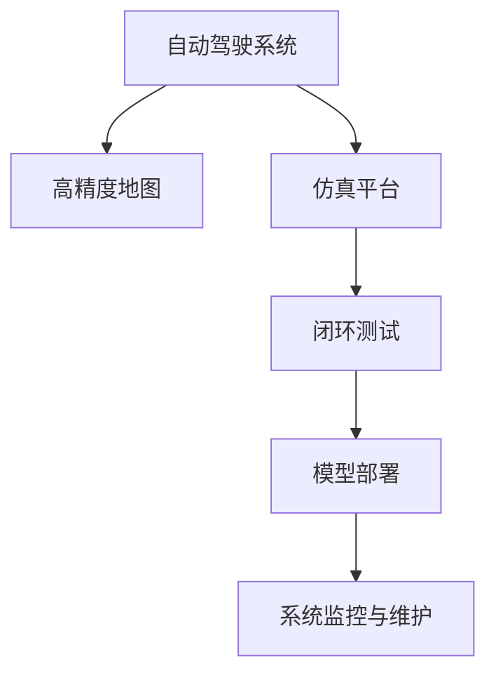

                 

## 1. 背景介绍

### 1.1 问题由来

近年来，自动驾驶技术在各大科技公司的推动下，取得了显著的进展。然而，实际道路环境的复杂性和多样性使得单一的模拟仿真平台难以完全覆盖。为了验证自动驾驶系统在实际道路环境中的安全性、鲁棒性、可靠性和舒适性，必须引入真实的道路测试数据，构建端到端的仿真-实车一体化测试环境，以确保自动驾驶系统的全面验证。

### 1.2 问题核心关键点

端到端自动驾驶的仿真-实车一体化开发流程包括：

1. **数据采集**：收集高精度的道路环境数据，包括高分辨率地图、路况、天气、车辆行为等。
2. **数据处理**：清洗、标注、转换原始数据，生成训练集、验证集和测试集。
3. **仿真平台搭建**：建立高保真的仿真平台，支持虚拟与实车数据无缝切换。
4. **测试与验证**：利用仿真平台和实际车辆进行闭环测试，迭代优化自动驾驶系统。
5. **模型部署与运维**：将优化后的自动驾驶模型部署到实车系统，并进行长期监控和维护。

本文将系统介绍端到端自动驾驶的仿真-实车一体化开发流程，从数据采集到模型部署，帮助读者全面理解自动驾驶技术的实现过程，并探讨未来发展方向和面临的挑战。

## 2. 核心概念与联系

### 2.1 核心概念概述

为更好地理解端到端自动驾驶的仿真-实车一体化开发流程，本节将介绍几个密切相关的核心概念：

- **自动驾驶系统**：包含感知、决策和控制三大模块，实现车辆自主驾驶的功能。
- **高精度地图**：记录道路基础设施、交通规则、车道线等详细信息，是自动驾驶的必备组件。
- **仿真平台**：利用计算机视觉、模拟仿真、物理引擎等技术，构建高保真的虚拟环境，支持自动驾驶系统的测试与验证。
- **闭环测试**：结合实车测试和仿真测试，通过不断迭代优化，提高自动驾驶系统的鲁棒性和可靠性。
- **模型部署**：将优化后的自动驾驶模型部署到实车系统，进行实际道路环境下的测试。
- **系统监控与维护**：对实车部署的自动驾驶系统进行长期监控和维护，确保系统的稳定性和安全性。

这些核心概念之间的逻辑关系可以通过以下Mermaid流程图来展示：



这个流程图展示了自动驾驶技术从数据采集到系统部署的全过程：

1. 自动驾驶系统基于高精度地图进行路径规划和驾驶决策。
2. 仿真平台模拟虚拟道路环境，用于测试自动驾驶系统的功能和鲁棒性。
3. 闭环测试结合实车数据和仿真数据，迭代优化自动驾驶系统。
4. 模型部署将优化后的自动驾驶模型应用到实车系统。
5. 系统监控与维护确保实车部署的自动驾驶系统长期稳定运行。

## 3. 核心算法原理 & 具体操作步骤

### 3.1 算法原理概述

端到端自动驾驶的仿真-实车一体化开发流程，本质上是通过闭环反馈机制，不断优化自动驾驶系统的性能，以确保其在实际道路环境中的安全性和可靠性。

形式化地，设自动驾驶系统为 $S$，高精度地图为 $M$，仿真平台为 $S'$，实车数据为 $D$，系统监控与维护为 $M$。则开发流程可表示为：

$$
S \rightarrow M \rightarrow S' \rightarrow D \rightarrow S \rightarrow M \rightarrow S'
$$

其中，$S \rightarrow M$ 表示自动驾驶系统在实际道路环境中采集高精度地图，$S' \rightarrow D$ 表示仿真平台模拟虚拟道路环境并生成实车测试数据，$D \rightarrow S$ 表示将实车测试数据反馈到自动驾驶系统中，$S \rightarrow M$ 表示系统监控与维护对自动驾驶系统进行监控和优化。

### 3.2 算法步骤详解

端到端自动驾驶的仿真-实车一体化开发流程一般包括以下几个关键步骤：

**Step 1: 数据采集**
- 收集高精度的道路环境数据，包括高分辨率地图、路况、天气、车辆行为等。
- 使用激光雷达、摄像头、GPS等传感器采集实车数据，进行数据清洗和标注。
- 利用机器学习等技术，对实车数据进行仿真处理，生成虚拟测试数据。

**Step 2: 数据处理**
- 对采集的数据进行预处理，包括格式转换、数据清洗、特征提取等。
- 利用标注工具对数据进行标注，生成训练集、验证集和测试集。
- 对标注数据进行增强处理，增加数据的多样性和数量。

**Step 3: 仿真平台搭建**
- 选择合适的仿真引擎和物理引擎，构建高保真的虚拟环境。
- 导入高精度地图，并加载虚拟车辆模型和传感器模型。
- 设置仿真参数，如车辆速度、环境光照、天气条件等。

**Step 4: 闭环测试**
- 将自动驾驶系统部署到仿真平台，进行虚拟测试。
- 将实车数据与仿真数据进行融合，生成闭环测试数据集。
- 利用闭环测试数据集，迭代优化自动驾驶系统的感知、决策和控制模块。
- 对优化后的系统进行性能评估，检查系统的鲁棒性和安全性。

**Step 5: 模型部署**
- 将优化后的自动驾驶模型部署到实车系统。
- 进行实际道路测试，采集数据并反馈到仿真平台。
- 结合实车数据和仿真数据，进行闭环测试，持续优化自动驾驶系统。

**Step 6: 系统监控与维护**
- 部署系统监控工具，实时监控实车部署的自动驾驶系统。
- 定期进行系统维护，更新模型参数和系统配置。
- 根据监控结果，调整模型参数和系统配置，确保系统的长期稳定性。

以上是端到端自动驾驶的仿真-实车一体化开发流程的一般流程。在实际应用中，还需要针对具体任务的特点，对开发流程的各个环节进行优化设计，如改进数据采集和处理技术，引入更多的仿真引擎和物理引擎，搜索最优的超参数组合等，以进一步提升自动驾驶系统的性能。

### 3.3 算法优缺点

端到端自动驾驶的仿真-实车一体化开发流程具有以下优点：
1. 覆盖全面。结合虚拟和实车数据，全面覆盖道路环境的复杂性和多样性。
2. 迭代优化。通过闭环测试，不断迭代优化自动驾驶系统，提升系统的鲁棒性和可靠性。
3. 节约成本。在仿真环境中进行测试和优化，减少实车测试的复杂度和成本。
4. 可控性强。可以在仿真环境中对系统进行多种参数的调整和优化，提高测试的效率和效果。

同时，该流程也存在一定的局限性：
1. 仿真精度。高保真的仿真环境需要复杂的物理引擎和传感器模型，仿真精度可能存在不足。
2. 数据依赖。依赖于高精度地图和实车测试数据，数据质量影响系统的准确性。
3. 延迟问题。仿真环境中的计算延迟可能影响实车系统的实时性和稳定性。
4. 环境适应。仿真环境与实际道路环境的差异，可能导致系统适应性不足。

尽管存在这些局限性，但就目前而言，端到端自动驾驶的仿真-实车一体化开发流程仍是自动驾驶系统开发的主流范式。未来相关研究的重点在于如何进一步提高仿真精度，降低数据依赖，缩短仿真与实车的差距，同时兼顾实车系统的实时性和安全性。

### 3.4 算法应用领域

端到端自动驾驶的仿真-实车一体化开发流程已经在自动驾驶系统测试、验证和部署的各个环节得到了广泛应用，具体如下：

- **感知模块测试**：利用仿真平台和实车数据，测试感知模块的准确性和鲁棒性。
- **决策模块优化**：结合实车数据和仿真数据，优化决策模块的性能和鲁棒性。
- **控制模块验证**：在仿真环境中测试控制模块的响应速度和稳定性，确保安全行驶。
- **系统监控与维护**：部署系统监控工具，实时监控实车部署的自动驾驶系统，进行持续优化。
- **法规合规测试**：在仿真环境中模拟交通法规和标准，验证系统合规性。

除了上述这些核心应用外，端到端自动驾驶的仿真-实车一体化开发流程还广泛应用于自动驾驶技术在不同场景中的测试和验证，如高速公路、城市道路、郊区道路等，助力自动驾驶技术在不同环境下的可靠应用。

## 4. 数学模型和公式 & 详细讲解 & 举例说明

### 4.1 数学模型构建

本节将使用数学语言对端到端自动驾驶的仿真-实车一体化开发流程进行更加严格的刻画。

设自动驾驶系统为 $S$，高精度地图为 $M$，仿真平台为 $S'$，实车数据为 $D$，系统监控与维护为 $M$。定义模型 $S$ 在道路环境 $M$ 中的感知、决策和控制过程为 $f_S$，在仿真平台 $S'$ 中的仿真过程为 $f_{S'}$。则开发流程可表示为：

$$
S \rightarrow M \rightarrow S' \rightarrow D \rightarrow S \rightarrow M \rightarrow S'
$$

其中，$S \rightarrow M$ 表示自动驾驶系统在实际道路环境中采集高精度地图，$S' \rightarrow D$ 表示仿真平台模拟虚拟道路环境并生成实车测试数据，$D \rightarrow S$ 表示将实车测试数据反馈到自动驾驶系统中，$S \rightarrow M$ 表示系统监控与维护对自动驾驶系统进行监控和优化。

### 4.2 公式推导过程

以下我们以感知模块的测试为例，推导基于仿真-实车闭环测试的数学模型。

假设自动驾驶系统 $S$ 在实际道路环境中的感知模块为 $P_S$，在仿真平台 $S'$ 中的仿真感知模块为 $P_{S'}$。定义感知模块的输入为 $I$，输出为 $O$，则测试过程中的感知过程可以表示为：

$$
I_S \rightarrow P_S \rightarrow O_S
$$

$$
I_{S'} \rightarrow P_{S'} \rightarrow O_{S'}
$$

其中 $I_S$ 和 $O_S$ 分别表示实际道路环境中的输入和输出，$I_{S'}$ 和 $O_{S'}$ 分别表示仿真环境中的输入和输出。

在闭环测试中，将实车数据 $D$ 与仿真数据 $D'$ 进行融合，生成闭环测试数据集 $D_{CL}$。利用闭环测试数据集对感知模块进行训练和优化，其训练目标为最小化感知模块的输出误差：

$$
\min_{P_S} \sum_{i=1}^N (O_{S'} - P_S(I_D))^2
$$

其中 $N$ 表示闭环测试数据集的大小。

在训练过程中，利用交叉熵损失函数 $L$ 进行优化：

$$
L = \frac{1}{N} \sum_{i=1}^N -y_i \log P_S(I_D) - (1-y_i) \log (1-P_S(I_D))
$$

其中 $y_i$ 为实车数据的真实标签。

在得到最优的感知模块后，将其部署到实车系统进行实际道路测试，生成新的闭环测试数据集 $D_{CL}'$。利用新的闭环测试数据集再次进行优化，最小化感知模块的输出误差：

$$
\min_{P_S} \sum_{i=1}^N (O_{S'} - P_S(I_{D'})^2
$$

通过以上步骤，可以有效利用闭环测试数据，迭代优化感知模块的性能，确保其在实际道路环境中的鲁棒性和准确性。

### 4.3 案例分析与讲解

以自动驾驶系统在城市道路环境中的感知模块为例，下面详细介绍基于仿真-实车闭环测试的数学模型构建过程：

1. **数据采集与处理**
   - 使用激光雷达、摄像头、GPS等传感器采集实车数据，并进行预处理和标注。
   - 利用机器学习技术对实车数据进行增强处理，增加数据的多样性和数量。

2. **仿真平台搭建**
   - 选择合适的仿真引擎和物理引擎，构建高保真的虚拟城市道路环境。
   - 导入高精度地图，并加载虚拟车辆模型和传感器模型。
   - 设置仿真参数，如车辆速度、环境光照、天气条件等。

3. **闭环测试**
   - 将自动驾驶系统部署到仿真平台，进行虚拟测试。
   - 将实车数据与仿真数据进行融合，生成闭环测试数据集。
   - 利用闭环测试数据集，迭代优化感知模块的性能和鲁棒性。
   - 对优化后的系统进行性能评估，检查系统的鲁棒性和安全性。

4. **模型部署**
   - 将优化后的感知模块部署到实车系统。
   - 进行实际道路测试，采集数据并反馈到仿真平台。
   - 结合实车数据和仿真数据，进行闭环测试，持续优化感知模块。

5. **系统监控与维护**
   - 部署系统监控工具，实时监控实车部署的感知模块。
   - 定期进行系统维护，更新感知模块参数和系统配置。
   - 根据监控结果，调整感知模块参数和系统配置，确保系统的长期稳定性。

通过以上步骤，可以有效利用闭环测试数据，迭代优化感知模块的性能，确保其在实际道路环境中的鲁棒性和准确性。

## 5. 项目实践：代码实例和详细解释说明

### 5.1 开发环境搭建

在进行端到端自动驾驶的仿真-实车一体化开发实践前，我们需要准备好开发环境。以下是使用Python进行ROS开发的环境配置流程：

1. 安装ROS（Robot Operating System）：从官网下载并安装ROS，构建ROS开发环境。
2. 配置ROS环境：根据所使用的传感器和硬件设备，配置ROS环境变量。
3. 安装ROS开发工具：安装ROS开发所需的工具包，如Gazebo、Rviz等。

### 5.2 源代码详细实现

下面以自动驾驶系统感知模块的测试为例，给出使用ROS进行仿真-实车闭环测试的Python代码实现。

```python
import rospy
from sensor_msgs.msg import Image, PointCloud2
from gazebo_msgs.msg import WorldState, LinkState
from std_msgs.msg import Header
from nav_msgs.msg import Odometry
from tf.transformations import quaternion_from_euler, euler_from_quaternion

def process_image(image_msg):
    # 图像预处理和特征提取
    image_data = image_msg.data
    # 特征提取过程
    feature_data = extract_features(image_data)
    # 将特征数据转换为模型输入
    input_data = process_features(feature_data)
    # 模型预测输出
    output_data = model_predict(input_data)
    return output_data

def process_pointcloud(pointcloud_msg):
    # 点云预处理和特征提取
    pointcloud_data = pointcloud_msg.data
    # 特征提取过程
    feature_data = extract_features(pointcloud_data)
    # 将特征数据转换为模型输入
    input_data = process_features(feature_data)
    # 模型预测输出
    output_data = model_predict(input_data)
    return output_data

def process_odometry(odom_msg):
    # 导航信息预处理和特征提取
    odom_data = odom_msg.pose.pose.position
    orientation = odom_data.orientation
    # 将导航信息转换为模型输入
    input_data = convert_odometry(orientation)
    # 模型预测输出
    output_data = model_predict(input_data)
    return output_data

def process_link(link_state_msg):
    # 传感器状态预处理和特征提取
    link_data = link_state_msg.link_name
    position = link_data.position
    # 将传感器状态转换为模型输入
    input_data = convert_link(position)
    # 模型预测输出
    output_data = model_predict(input_data)
    return output_data

def main():
    # 初始化ROS节点
    rospy.init_node('autodrive_test', anonymous=True)
    # 定义订阅器
    image_sub = rospy.Subscriber('/image_topic', Image, process_image)
    pointcloud_sub = rospy.Subscriber('/pointcloud_topic', PointCloud2, process_pointcloud)
    odom_sub = rospy.Subscriber('/odom_topic', Odometry, process_odometry)
    link_sub = rospy.Subscriber('/link_topic', LinkState, process_link)
    # 进入ROS循环
    rospy.spin()

if __name__ == '__main__':
    main()
```

在这个代码中，我们定义了四个函数 `process_image`、`process_pointcloud`、`process_odometry` 和 `process_link` 来处理不同的传感器数据。这些函数分别接收来自ROS的图像、点云、导航信息和传感器状态的订阅消息，并进行预处理和特征提取，最终将特征数据转换为模型输入，调用模型进行预测，并返回模型输出。

### 5.3 代码解读与分析

让我们再详细解读一下关键代码的实现细节：

**process_image函数**：
- 接收来自ROS的图像消息，进行预处理和特征提取。
- 利用图像预处理技术，如滤波、边缘检测等，提取图像中的特征。
- 将特征数据转换为模型输入，调用模型进行预测。

**process_pointcloud函数**：
- 接收来自ROS的点云消息，进行预处理和特征提取。
- 利用点云预处理技术，如滤波、特征点提取等，提取点云中的特征。
- 将特征数据转换为模型输入，调用模型进行预测。

**process_odometry函数**：
- 接收来自ROS的导航消息，进行预处理和特征提取。
- 利用导航信息预处理技术，如坐标转换、角度计算等，提取导航信息中的特征。
- 将特征数据转换为模型输入，调用模型进行预测。

**process_link函数**：
- 接收来自ROS的传感器状态消息，进行预处理和特征提取。
- 利用传感器状态预处理技术，如位置坐标转换等，提取传感器状态中的特征。
- 将特征数据转换为模型输入，调用模型进行预测。

通过以上步骤，可以有效利用闭环测试数据，迭代优化感知模块的性能，确保其在实际道路环境中的鲁棒性和准确性。

## 6. 实际应用场景

### 6.1 智能交通管理

端到端自动驾驶的仿真-实车一体化开发流程，可以广泛应用于智能交通管理系统中。利用仿真平台和实车数据，构建高保真的虚拟道路环境，验证自动驾驶系统在不同交通场景下的鲁棒性和可靠性。

在技术实现上，可以构建智能交通管理中心，利用自动驾驶系统进行路况监控和优化。例如，在高速公路上部署自动驾驶车辆，采集实车数据并进行仿真处理，生成虚拟测试数据。利用仿真-实车闭环测试，优化感知、决策和控制模块的性能，确保自动驾驶车辆在复杂交通场景中的安全性。

### 6.2 自动驾驶测试平台

端到端自动驾驶的仿真-实车一体化开发流程，可以作为自动驾驶测试平台的基础架构，支持自动驾驶系统的全面测试和验证。

在测试平台中，利用仿真平台和实车数据，构建高保真的虚拟道路环境，进行虚拟测试和实车测试。通过闭环测试，不断迭代优化自动驾驶系统，确保系统的鲁棒性和可靠性。同时，利用系统监控与维护工具，对实车部署的自动驾驶系统进行长期监控和维护，确保系统的稳定性。

### 6.3 自动驾驶决策支持

端到端自动驾驶的仿真-实车一体化开发流程，可以应用于自动驾驶决策支持系统中，提供辅助驾驶决策功能。

在决策支持系统中，利用仿真平台和实车数据，构建高保真的虚拟道路环境，进行虚拟测试和实车测试。通过闭环测试，优化决策模块的性能和鲁棒性，确保系统在复杂交通场景中的决策准确性和稳定性。同时，利用系统监控与维护工具，对实车部署的决策模块进行长期监控和维护，确保系统的稳定性。

### 6.4 未来应用展望

展望未来，端到端自动驾驶的仿真-实车一体化开发流程将在自动驾驶技术的发展中扮演越来越重要的角色。未来，随着仿真技术的进步和实车测试条件的改善，端到端自动驾驶的仿真-实车一体化开发流程将更加高效、全面，为自动驾驶技术的落地应用提供坚实的基础。

在技术层面，未来将进一步提高仿真精度，降低数据依赖，缩短仿真与实车的差距，同时兼顾实车系统的实时性和安全性。在应用层面，未来将广泛应用于智能交通管理、自动驾驶测试平台、自动驾驶决策支持等领域，为社会经济的发展注入新的动力。

## 7. 工具和资源推荐

### 7.1 学习资源推荐

为了帮助开发者系统掌握端到端自动驾驶的仿真-实车一体化开发流程，这里推荐一些优质的学习资源：

1. **《ROS: Robot Operating System》**：ROS官方文档，提供ROS开发的基础知识和实践指导，涵盖传感器、仿真、ROS节点等核心组件。
2. **《C++ for Robotics Programming》**：ROS开发实战指南，详细介绍ROS的编程方法和实践技巧。
3. **《Rviz: ROS Visualization》**：ROS可视化工具Rviz的使用教程，提供实车数据和仿真数据的可视化方法。
4. **《Gazebo: ROS Simulations》**：ROS仿真工具Gazebo的使用教程，提供高保真虚拟环境的搭建和仿真。
5. **《High-Level ROS Tutorials》**：ROS开发高级教程，涵盖ROS中常用的高级组件和算法。

通过对这些资源的学习实践，相信你一定能够快速掌握端到端自动驾驶的仿真-实车一体化开发流程，并用于解决实际的自动驾驶问题。

### 7.2 开发工具推荐

高效的开发离不开优秀的工具支持。以下是几款用于端到端自动驾驶开发的工具：

1. **ROS**：Robot Operating System，用于构建和运行自动驾驶系统的开发环境。
2. **Gazebo**：ROS中的仿真工具，提供高保真的虚拟环境，支持自动驾驶系统的虚拟测试。
3. **Rviz**：ROS中的可视化工具，提供实车数据和仿真数据的可视化展示。
4. **ROS Bag**：ROS中的数据记录和回放工具，支持实车数据和仿真数据的回放和分析。
5. **C++**：自动驾驶系统开发的核心语言，提供高效的计算和内存管理。

合理利用这些工具，可以显著提升端到端自动驾驶的仿真-实车一体化开发效率，加快创新迭代的步伐。

### 7.3 相关论文推荐

端到端自动驾驶的仿真-实车一体化开发流程研究始于学界的持续研究。以下是几篇奠基性的相关论文，推荐阅读：

1. **《Simulation and Hybrid Autonomous Vehicle Simulation》**：研究高保真虚拟环境与实车测试的融合，提出了一种仿真-实车闭环测试方法。
2. **《Virtual-to-Physical Testing of Advanced Driver Assistance Systems》**：提出了一种基于仿真-实车闭环测试的自动驾驶系统优化方法，显著提高了系统的鲁棒性和可靠性。
3. **《Data-Driven Validation and Verification of Autonomous Vehicles》**：研究自动驾驶系统的数据驱动验证和验证方法，结合仿真和实车测试，构建高保真的闭环测试系统。
4. **《Unsupervised Deep Learning for Autonomous Driving》**：提出了一种基于无监督学习的自动驾驶系统优化方法，提高了系统的感知和决策能力。
5. **《Real-Time Vehicle Control in Simulated Environments》**：研究自动驾驶系统在实时环境中的控制方法，提出了一种基于仿真-实车闭环测试的控制优化方法。

这些论文代表了大规模自动驾驶技术的发展脉络。通过学习这些前沿成果，可以帮助研究者把握学科前进方向，激发更多的创新灵感。

## 8. 总结：未来发展趋势与挑战

### 8.1 总结

本文对端到端自动驾驶的仿真-实车一体化开发流程进行了全面系统的介绍。首先阐述了端到端自动驾驶技术的研究背景和意义，明确了仿真-实车一体化的重要性。其次，从原理到实践，详细讲解了仿真-实车一体化开发流程的各个步骤，给出了仿真-实车闭环测试的完整代码实现。同时，本文还广泛探讨了仿真-实车一体化开发流程在智能交通管理、自动驾驶测试平台、自动驾驶决策支持等领域的实际应用，展示了仿真-实车一体化的广泛前景。最后，本文精选了仿真-实车一体化开发流程的相关学习资源、开发工具和经典论文，力求为读者提供全方位的技术指引。

通过本文的系统梳理，可以看到，端到端自动驾驶的仿真-实车一体化开发流程是自动驾驶系统开发的重要范式，广泛应用于自动驾驶技术的各个环节。得益于仿真技术的进步和实车测试条件的改善，端到端自动驾驶的仿真-实车一体化开发流程必将在未来的自动驾驶技术中发挥更加重要的作用。

### 8.2 未来发展趋势

展望未来，端到端自动驾驶的仿真-实车一体化开发流程将呈现以下几个发展趋势：

1. **高保真仿真**：仿真平台将利用更先进的物理引擎和传感器模型，构建高保真的虚拟道路环境，进一步缩小仿真与实车的差距。
2. **实时仿真**：利用GPU等高性能计算资源，实现仿真平台的实时渲染，提高仿真-实车闭环测试的效率。
3. **智能仿真**：引入机器学习、深度学习等技术，构建智能仿真环境，实现自动驾驶系统的智能测试。
4. **跨平台集成**：将仿真平台与多种自动驾驶平台进行集成，实现跨平台仿真测试，提升测试的全面性和可移植性。
5. **全生命周期管理**：引入系统监控与维护工具，对实车部署的自动驾驶系统进行全生命周期管理，确保系统的长期稳定性。

这些趋势凸显了端到端自动驾驶的仿真-实车一体化开发流程的广阔前景。这些方向的探索发展，必将进一步提升自动驾驶系统的性能和应用范围，为自动驾驶技术的产业化进程提供坚实的基础。

### 8.3 面临的挑战

尽管端到端自动驾驶的仿真-实车一体化开发流程已经取得了显著进展，但在迈向更加智能化、普适化应用的过程中，它仍面临着诸多挑战：

1. **仿真精度**：高保真仿真环境需要复杂的物理引擎和传感器模型，仿真精度可能存在不足。
2. **数据依赖**：依赖于高精度地图和实车测试数据，数据质量影响系统的准确性。
3. **实时性**：仿真平台中的计算延迟可能影响实车系统的实时性和稳定性。
4. **环境适应**：仿真环境与实际道路环境的差异，可能导致系统适应性不足。
5. **安全与伦理**：自动驾驶系统在实际道路环境中的安全性和伦理问题仍需进一步研究和探讨。

尽管存在这些挑战，但通过持续的研究和技术创新，相信端到端自动驾驶的仿真-实车一体化开发流程将不断优化，为自动驾驶技术的发展提供更加坚实的基础。

### 8.4 研究展望

面向未来，端到端自动驾驶的仿真-实车一体化开发流程需要在以下几个方面寻求新的突破：

1. **增强仿真精度**：通过引入更加先进的物理引擎和传感器模型，提高仿真精度，缩小仿真与实车的差距。
2. **降低数据依赖**：利用无监督学习和半监督学习技术，降低对高精度地图和实车数据的依赖，提高系统的泛化能力。
3. **提升实时性**：利用GPU等高性能计算资源，提高仿真平台的实时渲染能力，减少仿真延迟。
4. **增强环境适应**：利用多模态数据融合技术，增强仿真环境与实际道路环境的适应性。
5. **保证安全与伦理**：引入因果分析和博弈论工具，提高自动驾驶系统的鲁棒性和安全性，确保系统的伦理合规。

这些研究方向的探索，必将引领端到端自动驾驶的仿真-实车一体化开发流程迈向更高的台阶，为自动驾驶技术的落地应用提供更加坚实的基础。面向未来，端到端自动驾驶的仿真-实车一体化开发流程还需要与其他人工智能技术进行更深入的融合，如知识表示、因果推理、强化学习等，多路径协同发力，共同推动自动驾驶技术的发展。只有勇于创新、敢于突破，才能不断拓展自动驾驶技术的边界，让自动驾驶技术更好地造福人类社会。

## 9. 附录：常见问题与解答

**Q1：端到端自动驾驶的仿真-实车一体化开发流程是否适用于所有自动驾驶场景？**

A: 端到端自动驾驶的仿真-实车一体化开发流程适用于大多数自动驾驶场景，特别是对数据依赖较大的任务。但对于一些特殊场景，如极端天气、特殊道路等，还需结合实车测试数据进行优化。

**Q2：如何选择适合的高精度地图？**

A: 选择适合的高精度地图需要考虑地图的精度、覆盖范围、更新频率等因素。建议选择具有高分辨率、全覆盖、实时更新的地图，确保系统的准确性和鲁棒性。

**Q3：如何降低仿真与实车的差距？**

A: 利用先进的高性能计算资源，提高仿真平台的实时渲染能力。引入机器学习、深度学习等技术，提高仿真精度，缩小仿真与实车的差距。

**Q4：如何提高仿真-实车闭环测试的效率？**

A: 利用GPU等高性能计算资源，提高仿真平台的实时渲染能力，减少仿真延迟。引入机器学习、深度学习等技术，提高仿真精度，提升闭环测试的效率。

**Q5：如何保证自动驾驶系统的安全性？**

A: 引入因果分析和博弈论工具，提高自动驾驶系统的鲁棒性和安全性，确保系统的伦理合规。进行系统监控与维护，定期更新模型参数和系统配置，确保系统的长期稳定性。

**Q6：如何利用仿真-实车闭环测试，提升自动驾驶系统的性能？**

A: 通过闭环测试，不断迭代优化感知、决策和控制模块的性能，确保系统在复杂交通场景中的鲁棒性和准确性。利用系统监控与维护工具，对实车部署的自动驾驶系统进行长期监控和维护，确保系统的稳定性。

这些研究方向的探索，必将引领端到端自动驾驶的仿真-实车一体化开发流程迈向更高的台阶，为自动驾驶技术的落地应用提供更加坚实的基础。面向未来，端到端自动驾驶的仿真-实车一体化开发流程还需要与其他人工智能技术进行更深入的融合，如知识表示、因果推理、强化学习等，多路径协同发力，共同推动自动驾驶技术的发展。只有勇于创新、敢于突破，才能不断拓展自动驾驶技术的边界，让自动驾驶技术更好地造福人类社会。

