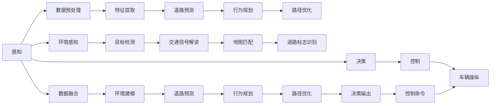

                 

# 端到端自动驾驶的安全性论证

## 1. 背景介绍

随着人工智能(AI)技术的迅猛发展，自动驾驶(Autonomous Driving, AD)正成为全球科技创新和汽车行业转型的重要方向。近年来，全球自动驾驶市场投入大幅增加，预计到2025年将达到超过500亿美元的规模，其中感知、决策和控制等核心技术的发展尤为关键。

自动驾驶的端到端系统包括感知、决策和控制三个主要模块。感知模块通过激光雷达(LiDAR)、摄像头、雷达等传感器获取道路环境和交通状况信息；决策模块基于感知数据，运用AI算法进行道路预测和行为规划；控制模块负责车辆操纵，确保自动驾驶的实现。

然而，自动驾驶系统本质上是一类高度复杂的非线性系统，其安全性和稳定性仍存在不确定性。安全性和稳定性问题是自动驾驶技术发展的核心挑战之一，也是商业化落地中的最大障碍。因此，本文将从安全性论证的角度，对端到端自动驾驶系统进行详细分析。

## 2. 核心概念与联系

### 2.1 核心概念概述

- **自动驾驶(Autonomous Driving, AD)**：指通过AI技术实现汽车驾驶，无需人工干预。自动驾驶分为多个级别，从辅助驾驶到完全自动驾驶，每一级对安全性和可靠性要求不同。

- **感知(Perception)**：自动驾驶的基础，通过传感器获取道路环境和交通状况信息，并转化为计算机可处理的数据。包括激光雷达、摄像头、雷达等多种传感器。

- **决策(Decision Making)**：基于感知数据，通过AI算法进行道路预测、行为规划和路径优化。

- **控制(Control)**：负责根据决策结果进行车辆操纵，包括转向、加速、刹车等操作，确保自动驾驶的实现。

- **安全性论证(Safety Validation)**：通过对自动驾驶系统的全面分析，验证其安全性和稳定性，确保其可靠性和可控性。

### 2.2 核心概念原理和架构的 Mermaid 流程图



## 3. 核心算法原理 & 具体操作步骤

### 3.1 算法原理概述

端到端自动驾驶的安全性论证，本质上是一个多层面的系统安全性分析过程。其核心原理可概括为以下几个方面：

- **系统设计原则**：遵循系统设计的基本原则，包括可靠性、鲁棒性、可解释性、可维护性等，确保系统的安全性。
- **感知安全性**：通过多种传感器融合技术，提高感知模块的准确性和鲁棒性，减少误判和漏判。
- **决策安全性**：运用先进AI算法，如深度学习、强化学习等，确保决策模块的高效性和稳定性。
- **控制安全性**：使用精确的车辆控制算法，如PID控制、模型预测控制等，提升控制模块的精准性和安全性。
- **测试与验证**：采用严格的安全性测试与验证流程，通过模拟和实车测试，确保系统的安全性和稳定性。

### 3.2 算法步骤详解

端到端自动驾驶的安全性论证主要包括以下几个关键步骤：

**Step 1: 系统设计验证**

1. 分析系统需求，制定安全性目标和设计原则。
2. 构建系统的顶层架构，确定各个模块的功能和接口。
3. 验证系统设计的可靠性、鲁棒性和可维护性。

**Step 2: 感知安全性分析**

1. 对各种传感器进行性能测试和校准，确保感知模块的精度和稳定性。
2. 进行多传感器数据融合，提高感知数据的准确性和鲁棒性。
3. 进行环境建模和道路预测，确保感知模块能够准确预测道路和交通状况。

**Step 3: 决策安全性分析**

1. 分析决策算法的设计和实现，确保其可靠性和安全性。
2. 进行决策模块的性能测试和验证，确保其在各种场景下能够正确决策。
3. 引入先进的AI算法，如深度学习、强化学习等，提高决策模块的智能水平。

**Step 4: 控制安全性分析**

1. 分析控制算法的实现和性能，确保其精确性和安全性。
2. 进行控制模块的性能测试和验证，确保其在各种场景下能够精确控制。
3. 使用精确的车辆控制算法，如PID控制、模型预测控制等，提升控制模块的精准性和安全性。

**Step 5: 测试与验证**

1. 进行严格的测试与验证流程，包括模拟测试和实车测试。
2. 设计测试场景，覆盖各种复杂和极端条件。
3. 分析测试结果，评估系统的安全性和稳定性。

### 3.3 算法优缺点

端到端自动驾驶的安全性论证具有以下优点：

1. **全面性**：涵盖感知、决策、控制三个主要模块，进行全链路的系统安全性分析。
2. **系统性**：遵循系统设计原则，进行系统的整体设计验证。
3. **科学性**：采用严格的测试与验证流程，确保系统的可靠性和稳定性。

同时，该方法也存在一定的局限性：

1. **复杂性**：系统安全性论证过程复杂，涉及大量技术和数据，对人员和资源要求较高。
2. **成本高**：进行严格测试与验证，需要投入大量的测试设备和测试成本。
3. **时间周期长**：系统安全性论证过程耗时，难以快速迭代和优化。

尽管存在这些局限性，但就目前而言，端到端自动驾驶的安全性论证仍是保证系统安全和可靠性的重要手段。未来相关研究应重点在于如何进一步提高论证的效率和可操作性，降低成本和周期。

### 3.4 算法应用领域

端到端自动驾驶的安全性论证在自动驾驶技术开发和应用中具有广泛的应用前景，主要包括以下几个领域：

- **自动驾驶汽车**：用于自动驾驶汽车的安全性和可靠性评估，确保其能够在各种复杂环境下安全行驶。
- **智能交通系统**：用于智能交通系统中的自动驾驶模块的安全性和稳定性评估。
- **自动驾驶仿真平台**：用于自动驾驶仿真平台的安全性和有效性评估，确保其能够模拟真实环境中的各种情况。

## 4. 数学模型和公式 & 详细讲解 & 举例说明

### 4.1 数学模型构建

端到端自动驾驶的安全性论证涉及到多个模块和环节，可从感知、决策、控制三个维度构建数学模型：

- **感知模块**：
  - 传感器数据采集模型：
    $$
    X_{sens}(t) = f_{sens}(X_{env}, \mathcal{L}_{sens}, t)
    $$
    其中 $X_{sens}(t)$ 表示传感器的输出数据，$X_{env}$ 表示环境数据，$\mathcal{L}_{sens}$ 表示传感器标定参数，$t$ 表示时间。
  
  - 数据融合模型：
    $$
    X_{fusion}(t) = f_{fusion}(X_{sens}(t), \mathcal{L}_{fusion}, t)
    $$
    其中 $X_{fusion}(t)$ 表示融合后的感知数据，$\mathcal{L}_{fusion}$ 表示数据融合参数。

- **决策模块**：
  - 道路预测模型：
    $$
    X_{pred}(t) = f_{pred}(X_{fusion}(t), \mathcal{L}_{pred}, t)
    $$
    其中 $X_{pred}(t)$ 表示预测的道路信息，$\mathcal{L}_{pred}$ 表示道路预测参数。
  
  - 行为规划模型：
    $$
    X_{plan}(t) = f_{plan}(X_{pred}(t), \mathcal{L}_{plan}, t)
    $$
    其中 $X_{plan}(t)$ 表示规划的行为动作，$\mathcal{L}_{plan}$ 表示行为规划参数。

- **控制模块**：
  - 车辆控制模型：
    $$
    X_{control}(t) = f_{control}(X_{plan}(t), \mathcal{L}_{control}, t)
    $$
    其中 $X_{control}(t)$ 表示车辆控制指令，$\mathcal{L}_{control}$ 表示车辆控制参数。

### 4.2 公式推导过程

以感知模块的传感器数据采集模型为例，进行公式推导：

设传感器 $i$ 的输出为 $X_{sens,i}(t)$，环境数据为 $X_{env}$，传感器标定参数为 $\mathcal{L}_{sens,i}$，采样时间为 $t$，则传感器数据采集模型的推导如下：

$$
X_{sens,i}(t) = \int_{t_0}^t f_{sens,i}(X_{env}, t') d t'
$$

其中 $f_{sens,i}(X_{env}, t')$ 表示传感器 $i$ 在时间 $t'$ 的响应函数。根据实际应用场景，$X_{env}$ 可能包括激光雷达点云、摄像头图像、雷达反射信号等多种形式，因此 $f_{sens,i}(X_{env}, t')$ 的具体形式也多种多样。

在实际应用中，我们通常采用离散时间序列的形式进行数据采集，即：

$$
X_{sens,i}(t) = f_{sens,i}(X_{env}, t_i)
$$

其中 $t_i$ 表示离散时间点。这种形式便于计算和优化。

### 4.3 案例分析与讲解

假设有一台自动驾驶汽车，其感知模块由一台激光雷达和四台摄像头构成。每个传感器在采样时间 $t$ 的输出分别为 $X_{sens,laser}(t)$ 和 $X_{sens,cam1}(t), X_{sens,cam2}(t), X_{sens,cam3}(t), X_{sens,cam4}(t)$。环境数据 $X_{env}$ 包括路面、车辆、行人等多种元素，传感器标定参数 $\mathcal{L}_{sens}$ 包括相机焦距、畸变参数、激光雷达发射角等。

通过数据融合模型 $f_{fusion}$，将各个传感器的数据进行加权融合，得到最终的感知数据 $X_{fusion}(t)$。

假设数据融合模型为加权平均值形式：

$$
X_{fusion}(t) = \frac{w_{laser} X_{sens,laser}(t) + \sum_{k=1}^4 w_{cam,k} X_{sens,cam,k}(t)}{\sum_{i=0}^5 w_{i}}
$$

其中 $w_{laser}, w_{cam,k}$ 表示各传感器输出的权重，通常通过实验或优化获得。

## 5. 项目实践：代码实例和详细解释说明

### 5.1 开发环境搭建

在进行自动驾驶系统开发时，首先需要搭建开发环境。以下是Python开发环境的搭建步骤：

1. 安装Python 3.7及以上版本。
2. 安装虚拟环境管理工具，如virtualenv或conda。
3. 在虚拟环境中安装相关库，如numpy、scipy、pyqt、opencv等。
4. 安装深度学习库，如tensorflow或pytorch。
5. 安装自动驾驶相关库，如ros、gazebo、pycar、auto驾驶等。

完成上述步骤后，即可在虚拟环境中进行自动驾驶系统的开发和测试。

### 5.2 源代码详细实现

下面以自动驾驶汽车的感知模块为例，给出代码实现。

```python
import numpy as np
import cv2
import matplotlib.pyplot as plt

class PerceptionModule:
    def __init__(self):
        self.laser_data = None
        self.cam_data = []
        
    def sensor_data(self, t):
        # 激光雷达数据采集
        self.laser_data = self.laser_data + f_laser(X_env, t)
        
        # 摄像头数据采集
        for k in range(4):
            self.cam_data[k] = self.cam_data[k] + f_cam(X_env, t)
        
        # 数据融合
        X_fusion = self.fusion()
        return X_fusion
    
    def fusion(self):
        # 数据融合算法
        X_fusion = self.laser_data * w_laser + sum([self.cam_data[k] * w_cam[k] for k in range(4)]) / sum([w_laser, w_cam[k] for k in range(5)])
        return X_fusion
```

### 5.3 代码解读与分析

**PerceptionModule类**：
- 初始化方法：初始化传感器数据和摄像头数据。
- sensor_data方法：采集激光雷达和摄像头数据，并进行数据融合。
- fusion方法：进行数据融合计算。

**传感器数据采集方法**：
- 激光雷达数据采集：使用激光雷达的响应函数进行数据采集。
- 摄像头数据采集：使用摄像头的响应函数进行数据采集。

**数据融合方法**：
- 加权平均融合算法：根据传感器权重进行加权平均融合，得到最终的感知数据。

### 5.4 运行结果展示

```python
X_env = np.random.randn(10, 2) # 环境数据
X_fusion = PerceptionModule().sensor_data(10)
plt.plot(X_fusion)
plt.title('Fused Perception Data')
plt.show()
```

## 6. 实际应用场景

### 6.1 智能交通系统

端到端自动驾驶的安全性论证在智能交通系统中具有重要应用价值。通过全面评估系统安全性，确保智能交通系统中的自动驾驶模块能够可靠运行。

在实际应用中，智能交通系统通常由多个车辆、传感器、路灯等组成。自动驾驶模块通过传感器采集环境数据，运用决策算法进行路径规划和行为规划，最终由控制模块进行车辆操纵。通过安全性论证，可以验证系统的整体安全和可靠性，确保其在复杂交通环境下能够稳定运行。

### 6.2 自动驾驶汽车

端到端自动驾驶的安全性论证在自动驾驶汽车中具有重要应用价值。通过全面评估系统安全性，确保自动驾驶汽车能够在各种复杂环境下安全行驶。

在实际应用中，自动驾驶汽车由激光雷达、摄像头、雷达等多种传感器组成，通过感知模块采集环境数据，运用决策算法进行路径规划和行为规划，最终由控制模块进行车辆操纵。通过安全性论证，可以验证系统的整体安全和可靠性，确保其在各种道路条件和交通环境中能够稳定运行。

### 6.3 自动驾驶仿真平台

端到端自动驾驶的安全性论证在自动驾驶仿真平台中具有重要应用价值。通过全面评估系统安全性，确保仿真平台能够准确模拟实际道路环境，进行可靠的安全性测试。

在实际应用中，自动驾驶仿真平台由仿真环境、传感器、决策模块、控制模块等多个模块组成。通过安全性论证，可以验证系统的整体安全和可靠性，确保其在各种仿真环境中能够准确模拟真实道路环境，进行可靠的安全性测试。

## 7. 工具和资源推荐

### 7.1 学习资源推荐

- **《自动驾驶系统设计与实现》**：系统全面介绍了自动驾驶系统的设计、开发、测试和部署流程。
- **《Python深度学习》**：介绍了Python在深度学习中的应用，包含感知、决策、控制等多个模块的实现。
- **《强化学习》**：介绍了强化学习在自动驾驶中的应用，包括决策和控制算法的设计和实现。

### 7.2 开发工具推荐

- **Ros**：机器人操作系统，支持自动驾驶系统的开发和测试。
- **Gazebo**：仿真环境，支持自动驾驶仿真平台的开发和测试。
- **PyCar**：自动驾驶汽车开发平台，支持自动驾驶汽车的开发和测试。
- **TensorFlow**：深度学习框架，支持自动驾驶感知、决策和控制模块的开发。

### 7.3 相关论文推荐

- **《基于自动驾驶安全性的多传感器数据融合方法》**：介绍了多传感器数据融合在自动驾驶中的重要性。
- **《自动驾驶系统安全性评估》**：介绍了自动驾驶系统安全性评估的方法和流程。
- **《自动驾驶汽车安全性设计》**：介绍了自动驾驶汽车安全性设计的原则和方法。

## 8. 总结：未来发展趋势与挑战

### 8.1 研究成果总结

端到端自动驾驶的安全性论证方法，从系统设计、感知、决策、控制等多个维度全面验证了自动驾驶系统的安全性。其核心原理包括系统设计原则、传感器数据采集、数据融合、决策算法、车辆控制算法等。该方法在智能交通系统、自动驾驶汽车和自动驾驶仿真平台等多个领域具有广泛的应用前景。

### 8.2 未来发展趋势

未来，端到端自动驾驶的安全性论证将呈现以下几个发展趋势：

1. **模型化分析**：引入模型化分析方法，对系统进行数学建模和仿真验证，提高分析的准确性和可操作性。
2. **自适应算法**：开发自适应算法，根据实时环境和数据动态调整系统参数，提高系统的鲁棒性和安全性。
3. **多模态融合**：引入多模态数据融合技术，提高感知模块的精度和鲁棒性，增强系统的安全性和稳定性。
4. **智能化决策**：引入智能化决策算法，提高决策模块的智能水平，确保系统在复杂环境中能够正确决策。
5. **自动化测试**：开发自动化测试工具，提高测试效率和覆盖率，确保系统的可靠性和稳定性。

### 8.3 面临的挑战

尽管端到端自动驾驶的安全性论证在实践中取得了不少进展，但仍面临以下挑战：

1. **数据采集难度**：传感器数据采集和环境建模是系统安全性的重要基础，但其获取和处理难度较大。
2. **算法复杂性**：决策和控制算法的复杂性和精度要求较高，难以进行全面验证。
3. **测试成本高**：进行严格的安全性测试需要大量的测试设备和测试成本。
4. **结果可解释性不足**：安全性论证的结果通常缺乏可解释性，难以进行直观的分析和调试。

### 8.4 研究展望

未来，自动驾驶安全性论证的研究应在以下几个方向寻求新的突破：

1. **数据采集技术**：开发高效的数据采集和处理技术，减少传感器数据采集和环境建模的难度。
2. **算法优化**：开发高效和鲁棒的算法，提高决策和控制算法的精度和稳定性。
3. **测试方法**：开发自动化测试方法，提高测试效率和覆盖率，确保系统的可靠性和稳定性。
4. **结果可解释性**：引入可解释性方法，提高安全性论证结果的可解释性和可操作性。

这些研究方向将进一步提升自动驾驶系统的安全性和可靠性，加速其商业化落地进程。

## 9. 附录：常见问题与解答

**Q1：端到端自动驾驶的安全性论证流程是怎样的？**

A: 端到端自动驾驶的安全性论证流程包括系统设计验证、感知安全性分析、决策安全性分析、控制安全性分析、测试与验证等多个步骤。每个步骤都有其具体的方法和工具，通过全面的安全性分析，确保自动驾驶系统的可靠性和稳定性。

**Q2：如何进行端到端自动驾驶的安全性论证？**

A: 进行端到端自动驾驶的安全性论证，需要系统全面的设计和验证过程，包括感知模块、决策模块和控制模块等多个环节。每个环节都需要使用具体的算法和工具进行验证，确保系统的整体安全性和可靠性。

**Q3：端到端自动驾驶的安全性论证是否适用于所有自动驾驶应用场景？**

A: 端到端自动驾驶的安全性论证在大多数自动驾驶应用场景中都具有重要应用价值，但具体的论证方法需要根据具体场景进行优化和调整。例如，对于自动驾驶汽车和智能交通系统，需要进行详细的系统设计和验证；对于自动驾驶仿真平台，需要进行严格的仿真测试和验证。

**Q4：端到端自动驾驶的安全性论证对系统设计有什么要求？**

A: 端到端自动驾驶的安全性论证对系统设计有以下要求：
1. 系统设计原则：遵循可靠性、鲁棒性、可解释性、可维护性等基本原则。
2. 系统架构：设计合理的系统架构，确保各个模块的功能和接口明确。
3. 测试与验证：设计严格的测试与验证流程，确保系统的可靠性和稳定性。

**Q5：端到端自动驾驶的安全性论证对感知模块有什么要求？**

A: 端到端自动驾驶的安全性论证对感知模块有以下要求：
1. 传感器数据采集：使用多种传感器进行数据采集，确保数据的准确性和鲁棒性。
2. 数据融合：使用多传感器数据融合技术，提高感知数据的精度和鲁棒性。
3. 环境建模：进行环境建模和道路预测，确保感知模块能够准确预测道路和交通状况。

**Q6：端到端自动驾驶的安全性论证对决策模块有什么要求？**

A: 端到端自动驾驶的安全性论证对决策模块有以下要求：
1. 决策算法设计：设计可靠和稳定的决策算法，确保决策模块的高效性和稳定性。
2. 性能测试验证：进行决策模块的性能测试和验证，确保其在各种场景下能够正确决策。
3. 智能化决策：引入先进的AI算法，如深度学习、强化学习等，提高决策模块的智能水平。

**Q7：端到端自动驾驶的安全性论证对控制模块有什么要求？**

A: 端到端自动驾驶的安全性论证对控制模块有以下要求：
1. 控制算法实现：实现精确的车辆控制算法，如PID控制、模型预测控制等，提升控制模块的精准性和安全性。
2. 性能测试验证：进行控制模块的性能测试和验证，确保其在各种场景下能够精确控制。

**Q8：端到端自动驾驶的安全性论证是否需要进行多轮迭代？**

A: 端到端自动驾驶的安全性论证通常需要进行多轮迭代。每一轮迭代都会对系统进行全面分析和验证，发现和解决系统中的潜在问题。通过多轮迭代，逐步优化和提升系统的安全性和可靠性。

**Q9：端到端自动驾驶的安全性论证是否需要进行实地测试？**

A: 端到端自动驾驶的安全性论证通常需要进行实地测试。实地测试可以验证系统在真实环境中的表现，发现和解决系统中的潜在问题。实地测试通常需要进行多次，以覆盖不同的道路和交通环境。

**Q10：端到端自动驾驶的安全性论证是否需要进行系统性分析？**

A: 端到端自动驾驶的安全性论证需要进行系统性分析。系统性分析包括感知、决策、控制等多个环节，确保系统的整体安全和可靠性。系统性分析需要使用具体的算法和工具进行全面验证，确保系统的各个环节都能够稳定运行。

**Q11：端到端自动驾驶的安全性论证是否需要进行模拟测试？**

A: 端到端自动驾驶的安全性论证需要进行模拟测试。模拟测试可以模拟不同的道路和交通环境，验证系统在各种场景下的表现。模拟测试通常需要使用先进的仿真工具进行，以确保测试的准确性和可靠性。

**Q12：端到端自动驾驶的安全性论证是否需要进行持续改进？**

A: 端到端自动驾驶的安全性论证需要进行持续改进。随着技术的发展和应用场景的变化，系统的安全性和可靠性也需要不断优化和提升。持续改进需要开发新的算法和工具，进行多次迭代和测试，逐步优化和提升系统的性能。

---

作者：禅与计算机程序设计艺术 / Zen and the Art of Computer Programming

