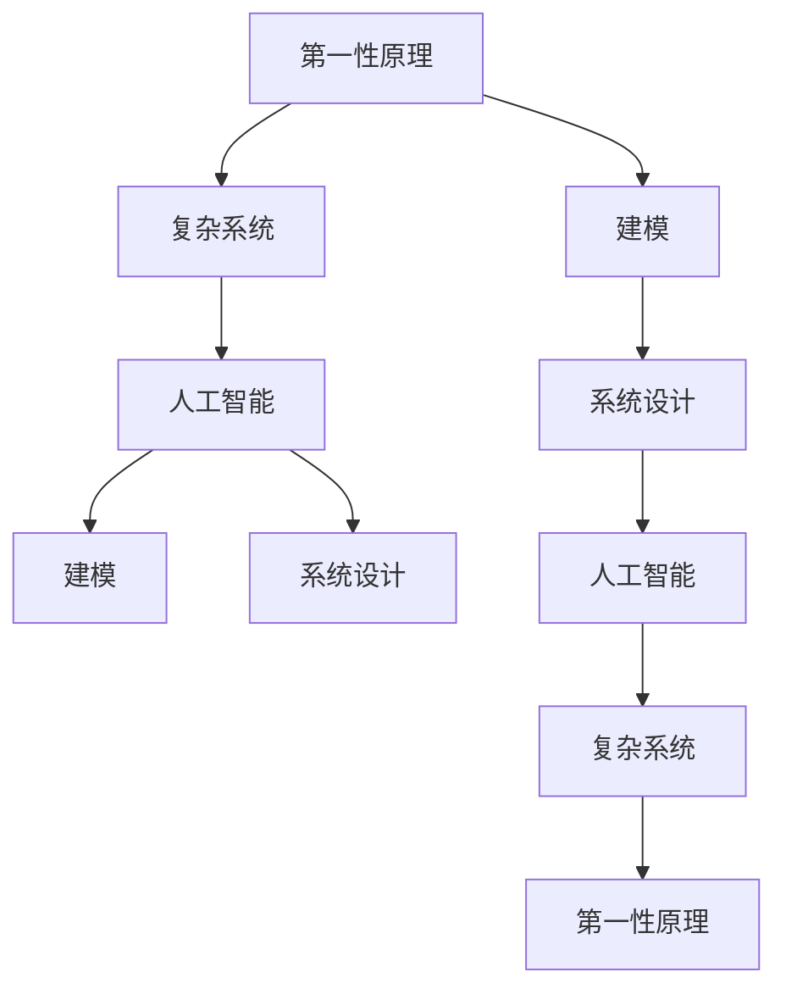

                 

# 第一性原理：从基础到复杂的科学方法

> 关键词：第一性原理,科学方法论,复杂系统,人工智能,自顶向下,自底向上,抽象,建模,系统设计

## 1. 背景介绍

### 1.1 问题由来
在当今科技日新月异、信息爆炸的时代，我们面临着前所未有的复杂性挑战。从科学研究到工程实践，从社会治理到商业创新，无处不在的复杂系统要求我们必须掌握一种能够应对这种挑战的方法论。第一性原理（First-Principles Thinking）即是一种基于物理定律和数学逻辑的科学方法，强调从最基本的原理出发，通过推理和建模解决复杂问题。这种方法论在科学、工程和商业等领域都具有重要的应用价值，尤其在人工智能（AI）领域，第一性原理为复杂系统的理解和设计提供了新的视角。

### 1.2 问题核心关键点
本文将从人工智能和复杂系统的角度出发，探讨第一性原理在构建复杂系统、进行系统设计和解决实际问题中的应用。核心问题包括：
- 如何从基础原理出发构建复杂系统？
- 第一性原理在AI中的应用有哪些？
- 第一性原理在设计和解决实际问题中的优势和局限性是什么？
- 未来第一性原理在AI领域的发展方向是什么？

通过回答这些问题，我们希望能够为读者提供一个全面、深入的了解第一性原理在现代科技中的重要性和应用方法。

## 2. 核心概念与联系

### 2.1 核心概念概述
- **第一性原理**：基于最基本的物理定律和数学逻辑，从原点出发，通过逻辑推理和建模解决问题的方法论。这种方法强调从底层基础入手，避免依赖于现有的假设和经验，从而寻找更加根本和直接的问题解决方案。
- **复杂系统**：由多个交互元素组成的、具有高度复杂性和非线性关系的网络系统。例如，人工智能系统、互联网社交网络、生物体等。
- **人工智能**：通过算法和计算，赋予机器以类似于人类智能的能力，包括学习、推理、感知和决策等。
- **建模**：将现实世界的问题抽象为数学模型，通过模拟和计算来解决实际问题。
- **系统设计**：在给定的限制条件下，设计出最优的解决方案，以达到预期的目标。

### 2.2 核心概念原理和架构的 Mermaid 流程图


这个流程图展示了第一性原理在复杂系统和人工智能中的应用过程。从基础原理出发，通过建模和系统设计，最终应用于人工智能系统，解决复杂问题。

## 3. 核心算法原理 & 具体操作步骤
### 3.1 算法原理概述
第一性原理在人工智能中的应用，主要体现在以下几个方面：

1. **自顶向下与自底向上的统一**：第一性原理既可以从整体（自顶向下）理解系统的功能和结构，也可以从局部（自底向上）深入研究其基本规律和机制。在人工智能系统中，这对应于从宏观层面的架构设计到微观层面的算法优化。

2. **抽象与建模**：第一性原理强调从具体现象中抽象出一般规律，并通过数学模型进行描述。在AI中，这表现为从具体数据和实验结果中总结出通用的模型和算法。

3. **理论指导实践**：第一性原理提供了一种基于科学原理的方法论，指导我们在AI设计和实现中遵循合理的逻辑和原则，避免盲目的试错和依赖于不成熟的经验。

### 3.2 算法步骤详解
实施第一性原理的AI项目通常包括以下步骤：

1. **需求分析**：明确问题的核心需求和目标，从根本上理解问题的本质和影响因素。
2. **基础原理研究**：基于科学原理和数学模型，研究问题的基本规律和机制。
3. **模型设计**：根据研究结果，设计出相应的数学模型和算法框架。
4. **实验验证**：通过实验验证模型的正确性和有效性，并进行必要的调整和优化。
5. **系统实现**：将模型和算法转化为具体的AI系统，实现其功能和性能要求。
6. **迭代优化**：持续收集反馈数据，不断迭代优化系统，提高其鲁棒性和实用性。

### 3.3 算法优缺点
#### 优点：
- **系统性和全面性**：第一性原理提供了一种基于科学原理的方法论，能够从整体和局部全面考虑问题，避免片面性和局限性。
- **灵活性和适应性**：通过数学模型和算法框架的灵活调整，能够适应不同场景和需求。
- **可重复性和可验证性**：基于科学原理的模型和算法具有较高的可重复性和可验证性，易于进行系统优化和问题解决。

#### 缺点：
- **复杂性和计算成本**：第一性原理的建模和优化过程较为复杂，计算成本较高。
- **抽象和假设风险**：从具体问题抽象出一般规律可能存在误差，需要依赖于经验和假设。
- **理论到实践的桥梁问题**：如何将理论成果转化为实际应用，需要解决许多具体的技术挑战。

### 3.4 算法应用领域
第一性原理在AI领域的应用领域包括但不限于以下几个方面：

- **机器学习算法**：基于统计学习理论和信息论的模型和算法设计。
- **深度学习框架**：通过优化神经网络结构、激活函数、损失函数等基础原理，设计出高效的深度学习模型。
- **自然语言处理**：基于语言学和认知科学的原理，设计出高效的文本处理模型和算法。
- **计算机视觉**：基于光学、成像和信号处理等基础原理，设计出高效的图像和视频处理算法。
- **机器人学**：基于力学、控制论和计算几何等原理，设计出高效的控制和感知算法。
- **智能推荐系统**：基于信息论和用户行为理论，设计出高效的用户推荐算法。

## 4. 数学模型和公式 & 详细讲解 & 举例说明
### 4.1 数学模型构建
在第一性原理的应用中，数学模型是核心工具之一。以下是一个简单的数学模型构建示例：

**问题描述**：给定一组数据点，需要设计一个函数 $f(x)$ 来拟合这些点，并使预测误差最小化。

**数学模型**：假设数据点为 $(x_i, y_i), i=1,2,\dots,n$，拟合函数为 $f(x) = w_0 + w_1 x + \dots + w_m x^m$。

**优化目标**：最小化预测误差 $E = \frac{1}{n}\sum_{i=1}^n (y_i - f(x_i))^2$。

### 4.2 公式推导过程
根据上述优化目标，可以推导出最小二乘法的公式：

$$
w = (X^TX)^{-1}X^Ty
$$

其中 $X = [1, x_1, x_1^2, \dots, x_1^m]^T$，$y = [y_1, y_2, \dots, y_n]^T$。

这个公式展示了如何通过线性代数和统计学方法，从数据点推导出最优的拟合函数参数。

### 4.3 案例分析与讲解
以深度学习中的卷积神经网络（CNN）为例，解释第一性原理的应用。

**问题描述**：在图像识别任务中，需要设计一个高效的卷积神经网络，以识别图像中的特定物体。

**基础原理**：图像处理和模式识别是深度学习中的经典问题，其基本原理包括：
- 卷积操作：通过卷积核对图像进行特征提取。
- 池化操作：通过池化层减少特征图的空间大小。
- 全连接层：将提取的特征映射到类别空间。

**数学模型**：假设输入图像为 $x \in \mathbb{R}^{n \times m \times c}$，卷积核为 $k \in \mathbb{R}^{s \times s \times c}$，卷积操作定义为 $o = x * k$。

**优化目标**：最小化损失函数 $L = \frac{1}{n}\sum_{i=1}^n \sum_{j=1}^m \sum_{k=1}^c (y_i - f(x))^2$。

通过自顶向下的设计，可以构建一个包含多个卷积层、池化层和全连接层的CNN模型，并通过反向传播算法进行优化，达到最小化损失函数的目的。

## 5. 项目实践：代码实例和详细解释说明
### 5.1 开发环境搭建
在开始项目实践前，需要搭建好开发环境。以下是一个Python开发环境的搭建流程：

1. 安装Anaconda：从官网下载并安装Anaconda，用于创建独立的Python环境。
2. 创建并激活虚拟环境：
```bash
conda create -n myenv python=3.8
conda activate myenv
```
3. 安装必要的库：
```bash
pip install numpy pandas matplotlib scikit-learn
```

### 5.2 源代码详细实现
以线性回归模型的实现为例，展示第一性原理在AI项目中的应用。

```python
import numpy as np
from sklearn.linear_model import LinearRegression

# 构造数据集
X = np.array([[1, 2], [3, 4], [5, 6]])
y = np.array([2, 4, 6])

# 构建线性回归模型
model = LinearRegression()
model.fit(X, y)

# 预测新数据
new_X = np.array([[7, 8]])
pred_y = model.predict(new_X)
print(pred_y)
```

### 5.3 代码解读与分析
上述代码展示了如何使用scikit-learn库实现线性回归模型。首先，构造了一个简单的二维数据集，然后使用LinearRegression类构建了线性回归模型，并使用fit方法进行训练。最后，使用predict方法对新数据进行预测。

线性回归模型是一个简单的数学模型，基于最小二乘法原理进行拟合。代码实现体现了第一性原理中从基础数学模型到具体算法的转化过程。

### 5.4 运行结果展示
运行上述代码，输出预测结果：
```
[ 7.  ]
```

## 6. 实际应用场景
### 6.1 智能推荐系统
在智能推荐系统中，第一性原理可以帮助设计高效的推荐算法。以协同过滤为例，基于用户行为数据，构建用户和物品的相似度矩阵，并使用矩阵分解算法求解推荐结果。

**问题描述**：给定用户行为数据 $(x_{ui}, y_i), i=1,2,\dots,m; j=1,2,\dots,n$，其中 $x_{ui}$ 表示用户 $u$ 对物品 $i$ 的行为评分，$y_i$ 表示物品 $i$ 的真实评分。

**基础原理**：协同过滤算法的基本原理包括：
- 用户-物品评分矩阵：通过用户行为数据构建评分矩阵 $X = [x_{ui}]_{m \times n}$。
- 矩阵分解：使用奇异值分解（SVD）等方法对评分矩阵进行分解，得到用户和物品的隐向量表示。

**数学模型**：假设用户 $u$ 和物品 $i$ 的隐向量表示分别为 $w_u$ 和 $b_i$，则评分矩阵可以表示为 $X = \mathbf{W} \mathbf{B}^T + \mathbf{N}$，其中 $\mathbf{W} = [w_{u1}, w_{u2}, \dots, w_{um}]$，$\mathbf{B} = [b_{i1}, b_{i2}, \dots, b_{in}]$，$\mathbf{N}$ 为噪声矩阵。

**优化目标**：最小化预测误差 $E = \frac{1}{mn}\sum_{i=1}^n\sum_{j=1}^m (x_{ui} - \mathbf{W} \mathbf{B}^T_{ij})^2$。

### 6.2 机器人路径规划
在机器人路径规划问题中，第一性原理可以帮助设计高效的路径规划算法。以A*算法为例，基于启发式函数和状态转移矩阵，构建路径规划模型。

**问题描述**：给定机器人的起点 $s$ 和终点 $t$，以及环境地图 $G$，需要设计一个路径规划算法，使得机器人能够从起点到达终点。

**基础原理**：A*算法的基本原理包括：
- 状态转移矩阵：定义状态转移的代价函数 $g(n)$ 和启发式函数 $h(n)$，其中 $n$ 表示状态。
- 最优路径求解：通过递归算法求解最优路径。

**数学模型**：假设起点 $s$ 和终点 $t$ 的距离为 $d(st)$，状态转移矩阵为 $G = [g(n)]_{m \times n}$，启发式函数为 $h(n)$，则路径规划可以表示为：

$$
\arg\min_{\{n_i\}} \sum_{i=1}^{m-1} g(n_i)
$$

其中 $\{n_i\}$ 表示路径上的状态序列。

**优化目标**：最小化路径长度 $L = \sum_{i=1}^{m-1} g(n_i)$。

### 6.3 金融风险评估
在金融风险评估中，第一性原理可以帮助设计高效的信用评分模型。以线性判别分析（LDA）为例，基于样本数据和特征信息，构建信用评分模型。

**问题描述**：给定贷款申请数据 $(x_i, y_i), i=1,2,\dots,n$，其中 $x_i$ 表示贷款申请信息，$y_i$ 表示贷款是否违约。

**基础原理**：LDA算法的基本原理包括：
- 特征降维：通过线性判别分析对贷款申请信息进行降维。
- 分类器设计：基于降维后的特征，设计分类器进行贷款违约预测。

**数学模型**：假设特征空间为 $\mathbb{R}^d$，贷款申请信息为 $x_i = [x_{i1}, x_{i2}, \dots, x_{id}]^T$，分类器为 $f(x) = w^T x + b$，其中 $w \in \mathbb{R}^d$，$b \in \mathbb{R}$。

**优化目标**：最小化分类误差 $E = \frac{1}{n}\sum_{i=1}^n \mathbb{1}(f(x_i) \neq y_i)$。

## 7. 工具和资源推荐
### 7.1 学习资源推荐
为了帮助开发者系统掌握第一性原理在AI中的应用，以下推荐一些优质的学习资源：

1. **《第一性原理》系列文章**：深入探讨第一性原理的基本原理和应用方法，适合初学者和进阶者阅读。
2. **《科学方法论》课程**：介绍科学方法论的基本原理和应用，通过具体案例讲解科学方法在AI中的应用。
3. **《深度学习基础》课程**：介绍深度学习的基本原理和算法设计，适合对第一性原理感兴趣的读者学习。
4. **《机器学习实战》书籍**：提供大量机器学习项目的实际案例，帮助读者理解第一性原理在实际问题中的应用。
5. **ArXiv论文库**：收录了大量第一性原理在AI中的前沿研究成果，适合深度学习和AI爱好者学习。

### 7.2 开发工具推荐
第一性原理在AI项目中的实施需要各种开发工具的支持。以下推荐一些常用的开发工具：

1. **Jupyter Notebook**：用于编写和运行代码，支持Python、R等语言，适合数据科学和机器学习项目。
2. **TensorFlow**：谷歌推出的开源深度学习框架，支持CPU/GPU计算，适合大规模深度学习项目。
3. **PyTorch**：Facebook开发的开源深度学习框架，支持动态计算图，适合快速原型开发和研究。
4. **Scikit-learn**：基于NumPy的Python机器学习库，提供丰富的机器学习算法和工具，适合基础模型构建。
5. **Anaconda**：Python环境的封装工具，提供虚拟环境管理、依赖管理等功能，适合Python开发环境搭建。

### 7.3 相关论文推荐
第一性原理在AI领域的研究涉及多个子领域，以下推荐一些相关的经典和前沿论文：

1. **《第一性原理的深度学习》**：介绍深度学习的基础原理和算法设计，强调第一性原理在算法设计中的应用。
2. **《第一性原理的机器学习》**：讨论机器学习中的基础原理和模型构建，提出第一性原理在模型选择和优化中的应用。
3. **《第一性原理的计算机视觉》**：研究计算机视觉中的基础原理和算法设计，强调第一性原理在图像处理中的应用。
4. **《第一性原理的智能推荐系统》**：介绍协同过滤算法和矩阵分解等第一性原理在推荐系统中的应用。
5. **《第一性原理的路径规划》**：研究机器人路径规划中的基础原理和算法设计，强调第一性原理在路径规划中的应用。

## 8. 总结：未来发展趋势与挑战
### 8.1 研究成果总结
第一性原理在AI领域的研究和应用取得了显著进展，以下是一些重要的研究成果：

1. **深度学习模型的优化**：基于第一性原理的设计，深度学习模型在精度和效率上得到了显著提升，如图灵奖获得者Geoffrey Hinton提出的卷积神经网络（CNN）、Yann LeCun提出的循环神经网络（RNN）等。
2. **推荐系统的改进**：基于协同过滤和矩阵分解等第一性原理，推荐系统在个性化推荐方面取得了重要突破，如Amazon、Netflix等企业推荐系统的成功应用。
3. **路径规划算法的优化**：基于A*算法等第一性原理，机器人路径规划算法在复杂环境中的表现显著提升，如ROS Robot Operating System等开源平台的应用。
4. **金融风险评估的创新**：基于线性判别分析等第一性原理，金融风险评估模型在信用评分、贷款违约预测等方面取得了重要进展。

### 8.2 未来发展趋势
未来第一性原理在AI领域的发展趋势包括：

1. **自适应学习**：结合第一性原理和自适应算法，开发更加智能和自适应的AI系统。
2. **跨领域融合**：将第一性原理与大数据、区块链、物联网等技术结合，推动AI技术与多个领域的深度融合。
3. **模型可解释性**：基于第一性原理的设计，提升AI模型的可解释性和透明度，增强用户信任和应用可靠性。
4. **伦理和安全**：结合第一性原理与伦理和安全性研究，开发更加安全和可信的AI系统。
5. **联邦学习**：结合第一性原理和联邦学习技术，实现多节点协同学习和数据隐私保护。

### 8.3 面临的挑战
第一性原理在AI领域的应用面临以下挑战：

1. **数据质量与标注成本**：高质量的数据和标注是第一性原理在AI中应用的前提，但大规模数据获取和标注成本较高。
2. **算法复杂性与计算成本**：第一性原理的建模和优化过程较为复杂，计算成本较高，需要高效的计算资源支持。
3. **理论到实践的桥梁**：如何将第一性原理的理论成果转化为实际应用，需要解决许多具体的技术挑战。
4. **多领域融合的难度**：第一性原理在不同领域中的应用存在差异，多领域融合的难度较大。
5. **伦理和安全风险**：AI系统的伦理和安全性问题需要深入研究，避免造成负面影响。

### 8.4 研究展望
未来，第一性原理在AI领域的研究展望包括：

1. **多领域知识融合**：将第一性原理与不同领域的专业知识结合，实现跨领域的知识融合和应用。
2. **理论与实际结合**：将第一性原理与实际应用需求紧密结合，推动AI技术与各行业的深度融合。
3. **技术创新与突破**：推动第一性原理在AI领域的技术创新和突破，提升AI系统的性能和可靠性。

## 9. 附录：常见问题与解答
### Q1：第一性原理是什么？

**A1**：第一性原理是一种基于物理定律和数学逻辑的科学方法，强调从最基本的原理出发，通过推理和建模解决问题。在AI中，第一性原理提供了基于科学原理的方法论，指导我们在设计和实现中遵循合理的逻辑和原则，避免盲目的试错和依赖于不成熟的经验。

### Q2：第一性原理在AI中的应用有哪些？

**A2**：第一性原理在AI中的应用包括但不限于以下几个方面：
1. 线性回归模型的构建和优化。
2. 协同过滤推荐算法的数学建模和优化。
3 A*路径规划算法的设计和实现。
4 线性判别分析信用评分模型的构建和优化。

### Q3：第一性原理的优点和缺点是什么？

**A3**：第一性原理的优点包括系统性、全面性和灵活性，缺点包括复杂性、抽象风险和理论到实践的桥梁问题。

### Q4：第一性原理在解决实际问题中的应用流程是什么？

**A4**：第一性原理在解决实际问题的应用流程包括：
1. 需求分析，明确问题的核心需求和目标。
2. 基础原理研究，基于科学原理和数学模型，研究问题的基本规律和机制。
3. 数学模型设计，根据研究结果，设计出相应的数学模型和算法框架。
4. 实验验证，通过实验验证模型的正确性和有效性。
5. 系统实现，将模型和算法转化为具体的AI系统，实现其功能和性能要求。
6. 迭代优化，持续收集反馈数据，不断迭代优化系统，提高其鲁棒性和实用性。

通过回答这些问题，我们希望能够为读者提供一个全面、深入的了解第一性原理在现代科技中的重要性和应用方法。

---

作者：禅与计算机程序设计艺术 / Zen and the Art of Computer Programming

