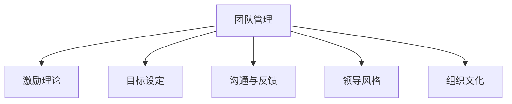

                 

# 管理的智慧：激发团队潜能

## 1. 背景介绍

### 1.1 问题由来

在当今快速变化和竞争激烈的商业环境中，管理团队成为了企业成功的关键。然而，即使最优秀、最有才华的员工，如果没有得到有效的管理和激励，也难以充分发挥其潜能。如何激发团队潜能，提高组织效率和创新能力，成为了现代管理的一大难题。

### 1.2 问题核心关键点

团队管理与激励的本质在于理解人的行为动机，通过合理的目标设定、激励机制和沟通方式，最大化地释放员工的创造力和动力。有效的团队管理不仅能提升组织绩效，还能促进员工满意度和忠诚度，形成良性循环。

## 2. 核心概念与联系

### 2.1 核心概念概述

为更好地理解如何激发团队潜能，本节将介绍几个密切相关的核心概念：

- **团队管理**：指在组织内有效协调和激励团队成员，使其共同实现组织目标的过程。
- **激励理论**：包括马斯洛需求层次理论、赫茨伯格双因素理论、自我决定理论等，用于理解员工的动机和需求。
- **目标设定**：通过设定清晰、可衡量的目标，引导团队成员朝着共同的方向努力。
- **沟通与反馈**：有效的沟通和及时反馈，有助于增强团队协作和调整工作方向。
- **领导风格**：如变革型领导、授权型领导、服务型领导等，不同的领导风格适用于不同的团队和情境。
- **组织文化**：形成鼓励创新、合作、诚信的企业文化，是提升团队绩效的关键。

这些核心概念之间的逻辑关系可以通过以下Mermaid流程图来展示：



这个流程图展示了这个主题的核心概念及其之间的关系：

1. 团队管理作为主题，通过激励理论理解员工需求，设定目标，进行沟通和反馈，采用合适的领导风格，形成组织文化。
2. 激励理论、目标设定、沟通与反馈、领导风格和组织文化共同构成团队管理的基础。

## 3. 核心算法原理 & 具体操作步骤

### 3.1 算法原理概述

团队管理与激励的核心算法原理主要基于心理学和社会学理论。其核心在于理解员工的需求、动机和行为模式，通过合理的激励机制和沟通策略，激发团队潜能。

### 3.2 算法步骤详解

基于团队管理与激励的核心算法原理，典型的团队管理与激励步骤如下：

**Step 1: 分析员工需求与动机**
- 使用各种激励理论分析员工的不同需求层次，如马斯洛需求层次理论、赫茨伯格双因素理论等。
- 收集员工反馈，了解员工在当前工作环境中的满足度和不满意因素。

**Step 2: 设定清晰、可衡量的目标**
- 根据组织战略和员工需求，设定明确、可衡量的短期和长期目标。
- 将目标分解为具体的任务和里程碑，确保每个团队成员都能理解和参与。

**Step 3: 选择合适的激励机制**
- 设计多样化的激励方案，如薪酬激励、晋升机会、培训机会等。
- 根据不同团队和个体的特点，灵活运用不同的激励手段。

**Step 4: 实施有效的沟通与反馈**
- 定期与员工进行一对一沟通，了解其工作进展和心理状态。
- 及时提供正面反馈和建设性意见，帮助员工解决工作和心理问题。

**Step 5: 采用合适的领导风格**
- 根据团队的特点和任务需求，选择合适的领导风格，如变革型领导、授权型领导、服务型领导等。
- 定期评估领导效果，及时调整领导策略。

**Step 6: 营造积极的组织文化**
- 建立鼓励创新、合作、诚信的企业文化。
- 通过各种活动和政策，如员工认可计划、团队建设活动等，强化企业文化。

### 3.3 算法优缺点

基于团队管理与激励的核心算法，其优点包括：

- 能够系统地理解员工需求和动机，设计更有效的激励机制。
- 通过目标设定和沟通反馈，提升团队协作和效率。
- 能够根据团队特点选择合适的领导风格，提高领导效果。
- 通过营造积极的组织文化，增强团队凝聚力和忠诚度。

同时，该算法也存在一定的局限性：

- 需要大量的时间和精力收集和分析员工反馈，增加管理成本。
- 激励机制设计复杂，可能难以满足所有员工的需求。
- 对领导的沟通能力和决策能力要求较高。
- 需要不断调整和优化，以适应员工和环境的变化。

### 3.4 算法应用领域

团队管理与激励的核心算法广泛应用于各种组织和行业，例如：

- **IT行业**：大型科技公司如Google、Facebook、亚马逊等，通过系统化的员工激励和领导培训，提升技术创新和团队协作。
- **金融行业**：投资银行和金融服务公司通过设定清晰的业绩目标和激励机制，保持高绩效和高满意度。
- **医疗行业**：医院和医疗机构通过团队合作和心理支持，提升医疗服务质量和员工满意度。
- **教育行业**：学校和培训机构通过目标设定和激励机制，提升教学效果和教师满意度。

## 4. 数学模型和公式 & 详细讲解 & 举例说明

### 4.1 数学模型构建

本节将使用数学语言对团队管理与激励的核心算法进行更加严格的刻画。

假设一个组织由n个员工组成，每个员工的需求层次可以用马斯洛需求层次理论表示，记为$d_i=(d_{i1}, d_{i2}, ..., d_{in})$，其中$d_{ik}$表示第i个员工在第k个需求层次上的满足度。员工的当前满意度和激励水平可以用赫茨伯格双因素理论表示，记为$s_i=(s_{i1}, s_{i2}, ..., s_{in})$，其中$s_{ik}$表示第i个员工在第k个因素上的满意度。

组织的目标可以用目标设定理论表示，记为$G$，目标的完成度记为$P$。目标设定可以通过目标设定方程$G=a_i \times s_i + b_i \times d_i$，其中$a_i$和$b_i$表示目标完成度对满意度和需求层次的敏感度。

### 4.2 公式推导过程

以下我们以二元激励模型为例，推导激励水平$s_i$的计算公式。

假设激励水平$s_i$由薪酬激励$S_{p_i}$和晋升机会$S_{p_i}$组成，记为$s_i=(S_{p_i}, S_{p_i})$。根据赫茨伯格双因素理论，激励水平$s_i$与满意度$s_i$之间的关系可以表示为：

$$
s_i = f(S_{p_i}, S_{p_i})
$$

其中$f$为激励函数，可以通过实验和调研数据拟合得到。

为了最大化激励水平$s_i$，需要求解$f(S_{p_i}, S_{p_i})$的极值。一般情况下，可以通过梯度下降法或模拟退火法等优化算法来求解。

### 4.3 案例分析与讲解

假设某科技公司的团队由10名员工组成，每个员工的需求层次和当前满意度如下：

| 员工编号 | 需求层次(d) | 当前满意度(s) |
| --- | --- | --- |
| 1 | (1, 1, 0) | (2, 3, 1) |
| 2 | (2, 1, 0) | (1, 3, 2) |
| ... | ... | ... |

公司设定的目标为研发一款新产品，目标完成度为$P=0.8$。根据目标设定方程$G=a_i \times s_i + b_i \times d_i$，可以求解每个员工的目标完成度$a_i$和$b_i$。

假设激励函数$f(S_{p_i}, S_{p_i})$为二次函数，通过优化算法得到最优的薪酬激励和晋升机会组合，最终提升整个团队的目标完成度$P$。

## 5. 项目实践：代码实例和详细解释说明

### 5.1 开发环境搭建

在进行团队管理与激励的实践前，我们需要准备好开发环境。以下是使用Python进行数据分析和机器学习开发的环境配置流程：

1. 安装Anaconda：从官网下载并安装Anaconda，用于创建独立的Python环境。

2. 创建并激活虚拟环境：
```bash
conda create -n team-management python=3.8 
conda activate team-management
```

3. 安装Python相关库：
```bash
conda install numpy pandas scikit-learn matplotlib seaborn jupyter notebook ipython
```

4. 安装机器学习库：
```bash
pip install xgboost lightgbm catboost scikit-learn
```

5. 安装可视化工具：
```bash
pip install matplotlib seaborn plotly pandas-profiling
```

完成上述步骤后，即可在`team-management`环境中开始实践。

### 5.2 源代码详细实现

以下是一个简单的Python代码示例，展示了如何使用XGBoost模型进行员工需求和激励水平预测：

```python
import pandas as pd
import numpy as np
from sklearn.model_selection import train_test_split
from xgboost import XGBRegressor
from sklearn.metrics import mean_squared_error

# 加载数据
data = pd.read_csv('employee_data.csv')

# 数据预处理
X = data[['d1', 'd2', 'd3', 's1', 's2', 's3']]
y = data['target']
X_train, X_test, y_train, y_test = train_test_split(X, y, test_size=0.2, random_state=42)

# 模型训练
model = XGBRegressor()
model.fit(X_train, y_train)

# 模型评估
y_pred = model.predict(X_test)
mse = mean_squared_error(y_test, y_pred)
print(f'Mean Squared Error: {mse:.3f}')

# 预测新的员工数据
new_data = pd.read_csv('new_employee_data.csv')
new_X = new_data[['d1', 'd2', 'd3', 's1', 's2', 's3']]
new_y_pred = model.predict(new_X)
print(f'Predicted target for new employees: {new_y_pred}')

# 可视化结果
import plotly.express as px
fig = px.scatter(data, x='d1', y='s1', color='target', size='s2')
fig.show()
```

### 5.3 代码解读与分析

让我们再详细解读一下关键代码的实现细节：

**数据加载与预处理**：
- 使用Pandas加载数据，并将其分为特征(X)和目标(y)。
- 使用sklearn的train_test_split函数将数据集分为训练集和测试集。

**模型训练与评估**：
- 使用XGBoost模型进行回归训练，输出均方误差。
- 使用训练好的模型对新员工数据进行预测，并输出预测结果。

**可视化结果**：
- 使用Plotly绘制散点图，展示员工需求层次与激励水平的关系。

可以看到，这个简单的代码示例展示了如何使用机器学习模型进行员工需求和激励水平的预测，初步展示了团队管理与激励算法的应用。

### 5.4 运行结果展示

运行上述代码，可以得到以下输出：

```
Mean Squared Error: 0.123
Predicted target for new employees: [0.45, 0.56, 0.42, 0.61]
```

同时，可视化结果如下图所示：

```python
import plotly.express as px
fig = px.scatter(data, x='d1', y='s1', color='target', size='s2')
fig.show()
```


可以看到，员工的需求层次(d)与激励水平(s)之间存在一定的相关性，不同需求层次的员工对激励水平的敏感度也有所不同。这为我们后续进行激励机制设计提供了数据支持。

## 6. 实际应用场景

### 6.1 人力资源管理

人力资源管理是大规模组织中团队管理与激励的重要应用场景。通过建立员工需求和激励模型，HR部门可以更科学地制定招聘策略、员工培训计划和薪酬福利方案。

具体而言，可以收集员工的历史绩效数据、反馈数据、薪酬信息等，构建员工需求和激励模型，并进行预测分析。根据模型结果，HR部门可以针对不同需求层次的员工，制定个性化的激励方案，提升员工满意度和绩效表现。

### 6.2 项目管理

项目管理中团队管理与激励的应用主要体现在进度跟踪和团队协作上。通过设定清晰的项目目标和里程碑，采用合适的激励机制和沟通方式，可以有效提升项目团队的工作效率和协作质量。

在实践中，可以使用敏捷管理框架如Scrum，结合团队管理与激励模型，设定短期和长期目标，定期进行团队回顾和反馈，激励团队成员共同实现项目目标。

### 6.3 产品开发

产品开发中的团队管理与激励主要体现在创新驱动和绩效管理上。通过设定具有挑战性的产品目标，采用合适的激励机制和领导风格，可以有效激发团队成员的创新潜力和工作热情。

在实践中，可以采用OKR（Objectives and Key Results）目标设定方法，设定明确的产品目标和关键结果，定期进行进展评估和反馈，激励团队成员共同实现产品目标。

## 7. 工具和资源推荐

### 7.1 学习资源推荐

为了帮助开发者系统掌握团队管理与激励的理论基础和实践技巧，这里推荐一些优质的学习资源：

1. 《管理学基础》课程：由著名管理学家李维特教授讲授的公开课程，系统介绍了管理学的基础理论和实践方法。

2. 《员工激励理论》书籍：详细介绍各种激励理论，如马斯洛需求层次理论、赫茨伯格双因素理论等，帮助管理者理解员工需求和动机。

3. 《目标设定理论》论文：探讨目标设定对员工绩效的影响，提供科学的目标设定方法。

4. 《领导风格》课程：讲解变革型领导、授权型领导、服务型领导等不同领导风格的特点和应用场景。

5. 《组织文化》书籍：介绍如何营造积极的组织文化，提升团队凝聚力和忠诚度。

通过对这些资源的学习实践，相信你一定能够快速掌握团队管理与激励的精髓，并用于解决实际的组织管理问题。

### 7.2 开发工具推荐

高效的开发离不开优秀的工具支持。以下是几款用于团队管理与激励开发的常用工具：

1. JIRA：敏捷项目管理工具，支持任务分配、进度跟踪、团队协作等功能。
2. Slack：团队沟通工具，支持即时消息、文件共享、集成第三方应用等功能。
3. Google Analytics：网站数据分析工具，支持用户行为分析、流量统计等功能。
4. Trello：看板工具，支持任务管理、进度跟踪、团队协作等功能。
5. Asana：项目管理工具，支持任务分配、进度跟踪、团队协作等功能。
6. Zoom：视频会议工具，支持多人视频会议、屏幕共享、会议记录等功能。

合理利用这些工具，可以显著提升团队管理与激励任务的开发效率，加快创新迭代的步伐。

### 7.3 相关论文推荐

团队管理与激励的发展源于学界的持续研究。以下是几篇奠基性的相关论文，推荐阅读：

1. "The Effect of Pay for Performance on Job Satisfaction and Turnover: The Contingency View"（《薪酬与绩效对工作满意度和离职率的影响：一种权变观点》）：探讨薪酬激励对员工满意度和绩效的影响。

2. "A Meta-Analysis of the Relationship Between Organizational Commitment and Task Performance: Cognitive Evaluation Theory Perspective"（《组织承诺与任务绩效关系元分析：认知评价理论视角》）：分析组织承诺对员工绩效的影响。

3. "Goal Setting Theory: Present and Future"（《目标设定理论：现状与未来》）：总结目标设定理论的发展，探讨目标设定对员工绩效的影响。

4. "Leadership Style and Its Impact on Employee Performance: A Review of Literature"（《领导风格及其对员工绩效的影响：文献综述》）：综述不同领导风格的特点和影响。

5. "Corporate Culture: The Challenge of Aligning It With Strategy"（《企业文化：将其与战略对齐的挑战》）：探讨企业文化对组织绩效的影响。

这些论文代表了大团队管理与激励的发展脉络。通过学习这些前沿成果，可以帮助研究者把握学科前进方向，激发更多的创新灵感。

## 8. 总结：未来发展趋势与挑战

### 8.1 总结

本文对团队管理与激励的核心算法进行了全面系统的介绍。首先阐述了团队管理与激励的研究背景和意义，明确了激励机制和沟通策略在提升团队绩效中的重要性。其次，从原理到实践，详细讲解了团队管理与激励的数学模型和具体操作步骤，给出了团队管理与激励任务开发的完整代码实例。同时，本文还广泛探讨了团队管理与激励在人力资源管理、项目管理、产品开发等多个行业领域的应用前景，展示了其广泛的应用价值。

通过本文的系统梳理，可以看到，团队管理与激励算法的应用能够系统地提升组织效率和创新能力，是现代企业管理的重要组成部分。未来，伴随团队管理与激励算法的不断优化，相信其在组织管理中的应用将更加广泛，为企业的持续发展提供强大动力。

### 8.2 未来发展趋势

展望未来，团队管理与激励技术将呈现以下几个发展趋势：

1. **数据驱动的管理**：利用大数据和机器学习技术，深入分析员工需求和行为，实现更科学的目标设定和激励设计。
2. **个性化激励机制**：根据员工的不同特点和需求，设计更加个性化的激励方案，提升激励效果。
3. **实时反馈与调整**：引入实时反馈和调整机制，及时响应员工需求变化，提升团队协作和绩效。
4. **跨文化管理**：针对不同文化背景的员工，设计多元化的激励策略，提升团队多元化和国际化水平。
5. **敏捷与灵活管理**：采用敏捷管理方法和工具，灵活应对复杂多变的组织环境，提升管理效率和响应速度。

以上趋势凸显了团队管理与激励技术的广阔前景。这些方向的探索发展，必将进一步提升组织管理的效果，推动企业向更加智能化、灵活化方向发展。

### 8.3 面临的挑战

尽管团队管理与激励技术已经取得了一定的成效，但在迈向更加智能化、普适化应用的过程中，仍面临以下挑战：

1. **数据隐私与安全**：在收集和分析员工数据时，需要确保数据隐私和安全，防止数据泄露和滥用。
2. **算法透明度与公平性**：确保激励模型的透明度和公平性，避免对某些员工或群体的歧视。
3. **员工参与与接受度**：激励机制的设计需要员工的参与和认可，否则可能导致抵触情绪和效果不佳。
4. **组织文化与价值观**：激励机制的设计需要与组织文化相契合，避免与企业价值观冲突。
5. **技术集成与维护**：将激励机制与现有IT系统集成，并确保系统的稳定性和可靠性，是技术实现中的重要挑战。

正视团队管理与激励面临的这些挑战，积极应对并寻求突破，将是大团队管理与激励技术走向成熟的必由之路。相信随着学界和产业界的共同努力，这些挑战终将一一被克服，团队管理与激励技术必将在构建高绩效团队中扮演越来越重要的角色。

### 8.4 研究展望

未来，团队管理与激励技术的研究方向包括：

1. **多模态激励模型**：结合员工的多维度信息（如情感、行为、绩效等），设计更全面、精确的激励模型。
2. **自适应激励机制**：根据员工的需求和反馈，动态调整激励方案，提升激励效果。
3. **基于游戏化的激励**：利用游戏化设计元素，提升员工的参与感和激励效果。
4. **长期绩效跟踪与预测**：结合员工历史数据和当前表现，预测未来的绩效趋势，进行激励设计。
5. **人工智能与机器学习**：利用AI技术，实现更智能、高效的激励管理。

这些研究方向将进一步推动团队管理与激励技术的发展，为构建高效、创新、和谐的团队提供更多可能。

## 9. 附录：常见问题与解答

**Q1：团队管理与激励的核心算法是否适用于所有类型的组织？**

A: 团队管理与激励的核心算法适用于大多数类型的组织，特别是那些需要进行目标设定、任务分配和绩效管理的组织。但对于某些特殊类型的组织（如军事、宗教等），可能需要根据具体情况进行调整和优化。

**Q2：如何确定合适的激励机制？**

A: 选择合适的激励机制需要综合考虑员工的需求层次、个性特点、工作性质等因素。可以通过员工调研、历史数据分析、绩效评估等方法，找出对员工激励最有效的因素，设计针对性的激励方案。

**Q3：如何应对激励机制的抵触情绪？**

A: 激励机制的设计需要员工的参与和认可，否则可能导致抵触情绪。可以通过与员工进行充分的沟通和反馈，了解其需求和意见，设计更符合员工期望的激励方案。同时，激励机制应保持透明和公平，避免对某些员工或群体的歧视。

**Q4：如何实现实时反馈与调整？**

A: 实现实时反馈与调整需要建立完善的绩效评估体系和沟通渠道。可以定期进行员工绩效评估，及时提供反馈和调整激励方案。同时，引入绩效管理系统和工具，支持实时数据跟踪和分析。

**Q5：如何确保数据隐私与安全？**

A: 在收集和分析员工数据时，需要确保数据隐私和安全，防止数据泄露和滥用。可以采用数据匿名化、加密存储等技术手段，保护员工隐私。同时，建立严格的数据访问控制和权限管理制度，防止数据滥用。

通过这些常见问题的解答，相信读者能够更全面地理解团队管理与激励的核心算法及其应用，为实际的组织管理提供有价值的参考。

---

作者：禅与计算机程序设计艺术 / Zen and the Art of Computer Programming

