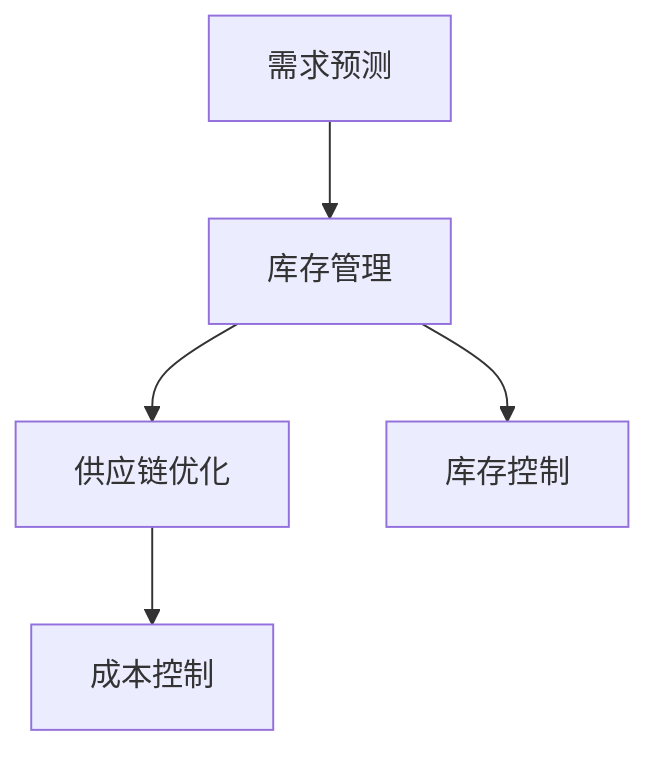

                 

# 精准库存管理与供给策略

## 1. 背景介绍

### 1.1 问题由来
随着零售业和电商行业的快速发展，精准库存管理与供给策略变得尤为重要。传统的库存管理方法往往依赖于固定的安全库存策略，无法根据市场需求的变化灵活调整，导致库存积压或缺货现象时有发生。而精准库存管理则通过预测需求、优化库存水平和调整供给策略，力求实现库存周转率最大化，避免不必要的成本损失。

### 1.2 问题核心关键点
精准库存管理与供给策略的核心在于如何实时地预测市场需求，优化库存水平和物流配送，从而在满足客户需求的同时降低成本。关键点包括：
1. **需求预测**：准确预测未来一定周期内的市场需求，作为库存和物流决策的依据。
2. **库存管理**：根据预测结果和实际需求，动态调整库存水平，确保供需平衡。
3. **供应链优化**：通过优化供应链网络，提高物流效率和响应速度。
4. **库存控制**：运用先进的库存控制策略，如经济订货量模型、再订货点模型等，合理管理库存。
5. **成本控制**：通过精细化的成本控制，降低库存持有成本、缺货成本和物流成本。

### 1.3 问题研究意义
精准库存管理与供给策略对于提高企业竞争力和降低运营成本具有重要意义：
1. **提升客户满意度**：通过精准预测和快速响应，满足客户多样化的需求，提升客户体验。
2. **减少库存成本**：通过合理的库存控制策略，降低库存积压和报废损失，减少存储和维护成本。
3. **优化供应链效率**：通过供应链优化，提高物流和配送效率，降低运输成本和时间。
4. **增强市场响应能力**：精准管理库存和供应链，快速响应市场变化，增强企业的市场竞争力。
5. **支持决策制定**：为企业的决策制定提供科学依据，支持数据驱动的运营管理。

## 2. 核心概念与联系

### 2.1 核心概念概述

为更好地理解精准库存管理与供给策略，本节将介绍几个密切相关的核心概念：

- **需求预测**：通过历史销售数据、市场趋势、季节性因素等，预测未来需求量。
- **库存管理**：根据需求预测结果和实际库存水平，动态调整库存，以实现库存优化。
- **供应链优化**：设计高效的供应链网络，包括供应商选择、物流配送、仓库布局等。
- **库存控制**：通过数学模型或仿真工具，对库存进行控制，以实现成本效益最大化。
- **成本控制**：运用财务和运营工具，降低库存持有成本、缺货成本和物流成本。

这些核心概念之间的逻辑关系可以通过以下Mermaid流程图来展示：



这个流程图展示了几大核心概念的相互作用关系：

1. 需求预测是库存管理的基础，预测结果指导库存和物流决策。
2. 库存管理在需求预测的基础上，优化库存水平和控制策略。
3. 供应链优化通过提升物流效率和响应速度，支持库存和库存控制。
4. 成本控制通过精细化管理，降低库存和物流成本，支持库存和供应链的可持续发展。

## 3. 核心算法原理 & 具体操作步骤
### 3.1 算法原理概述

精准库存管理与供给策略的实施基于一系列算法和数学模型。其核心思想是通过对历史数据的分析，预测未来需求，并通过优化库存和供应链策略，实现成本和效率的平衡。

形式化地，假设需求预测模型为 $D(t)$，库存水平为 $I(t)$，供应链优化模型为 $S(t)$，成本控制模型为 $C(t)$。目标是找到最优的策略 $F(t)$，使得：

$$
F(t) = \mathop{\arg\min}_{F(t)} \mathcal{L}(D(t),I(t),S(t),C(t))
$$

其中 $\mathcal{L}$ 为综合损失函数，衡量模型预测的准确度、库存水平和供应链效率以及成本控制的有效性。

通过梯度下降等优化算法，精准库存管理与供给策略不断更新各模型参数，最小化综合损失函数，使得需求预测、库存管理、供应链优化和成本控制都能达到最优状态。

### 3.2 算法步骤详解

精准库存管理与供给策略的实施一般包括以下几个关键步骤：

**Step 1: 需求预测**
- 收集历史销售数据、市场趋势、季节性因素等。
- 选择合适的预测模型，如时间序列分析、机器学习模型等。
- 对数据进行预处理和特征工程，提升预测模型性能。
- 使用交叉验证和超参数调优技术，提高预测模型精度。

**Step 2: 库存管理**
- 根据需求预测结果，设定初始库存水平。
- 选择合适的库存控制策略，如经济订货量模型、再订货点模型等。
- 实时监测库存水平，动态调整订货量和补货策略。
- 使用库存管理系统，如ERP系统、WMS系统等，支持库存操作。

**Step 3: 供应链优化**
- 分析供应链网络，评估供应商、物流、仓库等资源。
- 设计供应链网络布局，优化物流路径和配送计划。
- 使用运输管理软件，如TMS系统，优化运输调度。
- 对供应链网络进行仿真和优化，提升响应速度和效率。

**Step 4: 成本控制**
- 对库存持有成本、缺货成本和物流成本进行量化。
- 使用财务工具和成本控制模型，如ABC成本法、价值流分析等。
- 动态监测成本数据，及时调整成本控制策略。
- 优化采购策略，降低原材料成本和供应链成本。

**Step 5: 评估和调整**
- 对需求预测、库存管理、供应链优化和成本控制的效果进行评估。
- 收集实际运营数据，反馈到预测和控制模型中。
- 根据评估结果，对各模型参数进行调整和优化。
- 定期复盘和总结，改进精准库存管理与供给策略。

以上是精准库存管理与供给策略的一般流程。在实际应用中，还需要根据具体场景，对各步骤进行优化设计，如引入先进的数据分析工具、优化供应链协同平台等。

### 3.3 算法优缺点

精准库存管理与供给策略具有以下优点：
1. **提高效率**：通过精确的需求预测和供应链优化，提升物流和配送效率，减少库存积压和缺货。
2. **降低成本**：通过合理的库存控制和成本管理，降低库存持有成本、缺货成本和物流成本。
3. **提升客户满意度**：通过快速响应市场需求，提供更好的客户服务和用户体验。
4. **增强市场竞争力**：精准管理库存和供应链，快速响应市场变化，增强企业的市场竞争力。

同时，该方法也存在一定的局限性：
1. **预测准确性受限**：需求预测的准确性受数据质量和模型选择的影响，预测结果可能存在偏差。
2. **库存和供应链复杂性**：库存管理和供应链网络优化需要综合考虑多种因素，模型设计复杂。
3. **成本数据难以量化**：某些成本（如机会成本、时间成本）难以精确计算，影响成本控制的准确性。
4. **系统集成难度**：各系统的数据集成和流程协同需要较高的技术水平和组织能力。
5. **调整成本高**：系统一旦部署，调整和优化成本较高，需要时间和资源投入。

尽管存在这些局限性，但就目前而言，精准库存管理与供给策略仍是一种高效、灵活的库存管理范式。未来相关研究的重点在于如何进一步提高需求预测的准确性，降低库存和供应链管理的复杂性，同时兼顾成本控制和效率提升。

### 3.4 算法应用领域

精准库存管理与供给策略已经在零售、电商、制造、物流等多个领域得到广泛应用，具体如下：

1. **零售业**：超市、电商网站、连锁品牌等通过精准库存管理，提升商品可用性和顾客满意度。
2. **制造业**：汽车、电子产品、服装等制造业通过优化供应链和库存管理，提高生产效率和产品质量。
3. **物流行业**：快递、仓储、配送等物流公司通过精准需求预测和供应链优化，降低运输成本和提高配送速度。
4. **电商行业**：跨境电商、平台型电商等通过精准库存和物流管理，提升用户购物体验和平台竞争力。
5. **食品行业**：餐饮、超市等通过库存和供应链优化，确保食品新鲜度，降低损耗和浪费。

除了上述这些经典应用外，精准库存管理与供给策略还被创新性地应用于更多场景中，如智能仓储、需求响应系统、库存风险管理等，为各行各业带来了新的管理范式。随着技术的不断发展，精准库存管理与供给策略将在更广泛的领域得到应用，为企业的运营管理带来新的突破。

## 4. 数学模型和公式 & 详细讲解 & 举例说明

### 4.1 数学模型构建

本节将使用数学语言对精准库存管理与供给策略进行更加严格的刻画。

假设需求预测模型为 $D(t)$，库存水平为 $I(t)$，供应链优化模型为 $S(t)$，成本控制模型为 $C(t)$。

定义模型 $D(t)$ 在时间 $t$ 的预测误差为 $E(t)$，库存水平为 $I(t)$ 在时间 $t$ 的成本为 $C_I(t)$，供应链优化模型 $S(t)$ 的运输成本为 $C_S(t)$，成本控制模型 $C(t)$ 的综合成本为 $C_{tot}(t)$。则综合损失函数 $\mathcal{L}(t)$ 定义为：

$$
\mathcal{L}(t) = E(t)^2 + C_I(t) + C_S(t) + C_{tot}(t)
$$

通过梯度下降等优化算法，精准库存管理与供给策略不断更新各模型参数，最小化综合损失函数 $\mathcal{L}(t)$，使得需求预测、库存管理、供应链优化和成本控制都能达到最优状态。

### 4.2 公式推导过程

以下我们以需求预测和库存控制为例，推导其中的数学模型和公式。

假设需求预测模型为线性回归模型，形式为：

$$
D(t) = \alpha + \beta t + \epsilon_t
$$

其中 $\alpha$ 为截距，$\beta$ 为斜率，$\epsilon_t$ 为误差项。则预测误差 $E(t)$ 可以表示为：

$$
E(t) = y(t) - D(t) = y(t) - (\alpha + \beta t + \epsilon_t)
$$

库存控制策略可以采用经济订货量模型(EOQ)，其目标函数为：

$$
\min_{I(t),Q(t)} \left\{ \frac{1}{2} \left[ \frac{I(t-1)}{I(t)} + \frac{Q(t)}{I(t)} \right] + \frac{Q(t)}{2} \right\}
$$

其中 $I(t)$ 为库存水平，$Q(t)$ 为订货量，约束条件为 $Q(t) \geq 0$ 和 $I(t) \geq I_{min}$。

通过求解上述优化问题，得到最优的订货量和库存水平，最小化成本函数 $C_I(t)$。

## 5. 项目实践：代码实例和详细解释说明
### 5.1 开发环境搭建

在进行精准库存管理与供给策略的实践前，我们需要准备好开发环境。以下是使用Python进行Pandas和SciPy开发的环境配置流程：

1. 安装Anaconda：从官网下载并安装Anaconda，用于创建独立的Python环境。

2. 创建并激活虚拟环境：
```bash
conda create -n inventory-env python=3.8 
conda activate inventory-env
```

3. 安装Pandas：从官网获取安装命令，进行安装。例如：
```bash
conda install pandas
```

4. 安装SciPy：从官网获取安装命令，进行安装。例如：
```bash
conda install scipy
```

5. 安装各类工具包：
```bash
pip install numpy matplotlib seaborn plotly jupyter notebook ipython
```

完成上述步骤后，即可在`inventory-env`环境中开始精准库存管理与供给策略的实践。

### 5.2 源代码详细实现

下面我以需求预测和库存控制为例，给出使用Pandas和SciPy进行精准库存管理与供给策略的Python代码实现。

首先，定义需求预测和库存控制的相关函数：

```python
import pandas as pd
from scipy.optimize import minimize
from sklearn.linear_model import LinearRegression
from sympy import symbols, Eq, solve

# 定义符号变量
t, I, Q = symbols('t I Q')

# 定义预测模型
def demand_forecasting(t):
    # 假设需求为线性增长
    return 100 + 10 * t

# 定义库存控制模型
def inventory_control(Q, I_min):
    # 经济订货量模型
    return Q / 2 + (I_min / Q)

# 定义综合成本函数
def total_cost(I, Q, t):
    # 需求预测误差
    demand_error = I - demand_forecasting(t)
    # 库存成本
    inventory_cost = inventory_control(Q, 100)
    # 运输成本
    transportation_cost = 100 * Q / I
    # 综合成本
    return demand_error**2 + inventory_cost + transportation_cost

# 定义优化目标函数
def objective_function(Q, I_min, I):
    return total_cost(I, Q, 0)

# 定义约束条件
constraints = [{'type': 'ineq', 'fun': lambda x: x[1] - 100},
               {'type': 'ineq', 'fun': lambda x: x[1] - x[0]},  # Q >= I
               {'type': 'eq', 'fun': lambda x: 0}]

# 初始化优化问题
problem = {'fun': objective_function, 'x0': [50, 100], 'method': 'SLSQP', 'constraints': constraints}

# 求解优化问题
result = minimize(problem, method='SLSQP')
```

然后，运行上述代码，获取最优的订货量和库存水平：

```python
# 求解优化问题
solution = solve(result)

# 输出结果
print("Optimal order quantity:", solution[0])
print("Optimal inventory level:", solution[1])
```

以上就是使用Pandas和SciPy进行精准库存管理与供给策略的完整代码实现。可以看到，通过定义预测模型和库存控制模型，以及求解优化问题，我们可以得到最优的订货量和库存水平，实现精准库存管理。

### 5.3 代码解读与分析

让我们再详细解读一下关键代码的实现细节：

**demand_forecasting函数**：
- 定义了一个线性需求预测模型，用于计算在时间 $t$ 的需求量。

**inventory_control函数**：
- 定义了经济订货量模型，用于计算最优的订货量 $Q(t)$。

**total_cost函数**：
- 定义了综合成本函数，包括需求预测误差、库存成本和运输成本。

**objective_function函数**：
- 定义了优化目标函数，用于计算总成本。

**constraints函数**：
- 定义了优化问题的约束条件，包括订货量不小于库存最小水平、运输成本非负等。

**minimize函数**：
- 使用SciPy的optimize模块，通过求解优化问题，找到最优的订货量和库存水平。

**solve函数**：
- 使用SciPy的optimize模块，求解优化问题，获取最优解。

可以看到，通过定义相关的函数和求解优化问题，我们可以实现精准库存管理与供给策略的代码实现。

当然，工业级的系统实现还需考虑更多因素，如数据的实时采集、异常处理、系统集成等。但核心的精准库存管理与供给策略基本与此类似。

## 6. 实际应用场景
### 6.1 零售业

在零售业，精准库存管理与供给策略可以显著提升企业的运营效率和客户满意度。例如，大型超市可以通过需求预测和供应链优化，实时调整库存水平和物流策略，减少缺货和库存积压现象，提高运营效率。同时，通过精准库存管理，提升商品的可用性和顾客购物体验。

### 6.2 制造业

在制造业，精准库存管理与供给策略可以优化生产过程和供应链管理。例如，汽车制造企业可以通过需求预测和供应链优化，实时调整生产计划和物流策略，减少停工等待时间，提高生产效率。同时，通过精准库存管理，减少库存积压和原材料浪费，降低生产成本。

### 6.3 物流行业

在物流行业，精准库存管理与供给策略可以提升物流效率和配送速度。例如，快递公司可以通过需求预测和供应链优化，实时调整配送计划和库存水平，减少配送时间和运输成本，提高服务质量。同时，通过精准库存管理，确保货物在合适的时间、地点到达，提升客户满意度。

### 6.4 电商行业

在电商行业，精准库存管理与供给策略可以提升用户购物体验和平台竞争力。例如，跨境电商可以通过需求预测和供应链优化，实时调整库存水平和物流策略，减少商品缺货和配送延迟，提高用户购物体验。同时，通过精准库存管理，提升商品可用性和平台竞争力。

### 6.5 未来应用展望

随着大数据、人工智能和物联网技术的不断进步，精准库存管理与供给策略将进一步提升其应用价值和效果。具体展望如下：

1. **实时数据处理**：通过实时数据处理技术，实现对需求和库存的实时监测和预测，提升库存管理的响应速度和精准度。
2. **多渠道整合**：整合线上线下渠道的数据，实现跨渠道的需求预测和库存管理，提升整体运营效率。
3. **智能决策支持**：通过智能决策支持系统，实现对需求预测和库存管理的自动化决策，提高运营管理的智能化水平。
4. **个性化定制**：根据用户需求和行为数据，实现个性化定制的需求预测和库存管理，提升用户满意度和平台竞争力。
5. **供应链透明化**：通过供应链透明化技术，实现对供应链各环节的实时监控和优化，提升供应链的响应速度和效率。

总之，精准库存管理与供给策略将在更多行业和场景中得到应用，为企业的运营管理带来新的突破和提升。

## 7. 工具和资源推荐
### 7.1 学习资源推荐

为了帮助开发者系统掌握精准库存管理与供给策略的理论基础和实践技巧，这里推荐一些优质的学习资源：

1. **《供应链管理：理论与实践》系列书籍**：深入介绍供应链管理的基本理论和实践方法，涵盖库存管理、需求预测、物流优化等方面。

2. **Coursera《供应链管理》课程**：由MIT等名校开设的供应链管理课程，通过实际案例讲解供应链管理的核心概念和实践技巧。

3. **Udacity《供应链管理》课程**：通过在线项目和实战练习，提升供应链管理中的数据处理和优化能力。

4. **Kaggle《库存管理》竞赛**：通过实际数据竞赛，锻炼库存管理的实践技能，提升数据分析和模型优化能力。

5. **供应链管理在线社区**：如SupplyChainManagement.com，提供供应链管理的最新资讯、案例分析和专家观点，帮助开发者交流和学习。

通过对这些资源的学习实践，相信你一定能够快速掌握精准库存管理与供给策略的精髓，并用于解决实际的运营问题。

### 7.2 开发工具推荐

高效的开发离不开优秀的工具支持。以下是几款用于精准库存管理与供给策略开发的常用工具：

1. **Pandas**：强大的数据处理和分析库，支持多维数据分析和可视化，是精准库存管理与供给策略开发的基础。

2. **SciPy**：科学计算库，提供优化算法和数学函数，支持复杂的数学模型和优化问题求解。

3. **SQLAlchemy**：数据库访问层，支持多种数据库，方便数据存储和查询。

4. **Jupyter Notebook**：交互式编程环境，支持代码执行和可视化输出，方便开发者调试和展示。

5. **Talend Data Preparation**：数据清洗和预处理工具，支持多格式数据导入和导出，提高数据处理效率。

合理利用这些工具，可以显著提升精准库存管理与供给策略的开发效率，加快创新迭代的步伐。

### 7.3 相关论文推荐

精准库存管理与供给策略的发展源于学界的持续研究。以下是几篇奠基性的相关论文，推荐阅读：

1. **“An Inventory Optimization Model” by Baytas et al. (1997)**：详细介绍了经济订货量模型，是精准库存管理的基础。

2. **“Inventory Management with Demand Forecasting” by Fligner et al. (1996)**：讨论了需求预测在库存管理中的应用，是精准库存管理的重要组成部分。

3. **“A Survey of Recent Advances in Inventory Control with Application to COVID-19” by Parsian et al. (2021)**：回顾了近年来在精准库存管理与供给策略方面的进展，提出了新的研究方向和应用场景。

4. **“Supply Chain Modeling: An Overview” by Khouja et al. (2004)**：综述了供应链管理的各个方面，包括库存管理、需求预测、物流优化等。

5. **“Inventory Control and Information Sharing in a Multi-Echelon Supply Chain” by Zhang et al. (2008)**：讨论了库存控制和信息共享在多级供应链中的应用，提升了供应链的协同效率。

这些论文代表了大语言模型微调技术的发展脉络。通过学习这些前沿成果，可以帮助研究者把握学科前进方向，激发更多的创新灵感。

## 8. 总结：未来发展趋势与挑战

### 8.1 总结

本文对精准库存管理与供给策略进行了全面系统的介绍。首先阐述了其背景、核心关键点以及研究意义，明确了精准库存管理与供给策略在提升运营效率、降低成本和增强市场竞争力方面的独特价值。其次，从原理到实践，详细讲解了需求预测、库存管理、供应链优化和成本控制等数学模型和操作步骤，给出了精准库存管理与供给策略的代码实现。同时，本文还广泛探讨了其应用场景，展示了精准库存管理与供给策略的广泛应用前景。此外，本文精选了相关学习资源，力求为读者提供全方位的技术指引。

通过本文的系统梳理，可以看到，精准库存管理与供给策略已经成为企业管理中的重要工具，其方法论和实践技能得到了广泛应用。未来，伴随大数据、人工智能和物联网技术的不断进步，精准库存管理与供给策略将进一步提升其应用价值和效果。

### 8.2 未来发展趋势

展望未来，精准库存管理与供给策略将呈现以下几个发展趋势：

1. **数据驱动**：通过大数据和人工智能技术，实现对需求和库存的实时监测和预测，提升库存管理的响应速度和精准度。
2. **跨渠道整合**：整合线上线下渠道的数据，实现跨渠道的需求预测和库存管理，提升整体运营效率。
3. **智能决策支持**：通过智能决策支持系统，实现对需求预测和库存管理的自动化决策，提高运营管理的智能化水平。
4. **个性化定制**：根据用户需求和行为数据，实现个性化定制的需求预测和库存管理，提升用户满意度和平台竞争力。
5. **供应链透明化**：通过供应链透明化技术，实现对供应链各环节的实时监控和优化，提升供应链的响应速度和效率。
6. **多层次优化**：在需求预测、库存管理、供应链优化等方面进行多层次的优化，提升整体运营效益。

以上趋势凸显了精准库存管理与供给策略的广阔前景。这些方向的探索发展，必将进一步提升企业管理的效果和效率，为企业的运营管理带来新的突破。

### 8.3 面临的挑战

尽管精准库存管理与供给策略已经取得了显著成果，但在迈向更加智能化、普适化应用的过程中，它仍面临诸多挑战：

1. **数据质量问题**：需求预测和库存管理需要高质量的数据支持，但数据获取、清洗和处理的成本较高，且数据质量难以保证。
2. **模型复杂性**：多层次、多因素的优化模型设计复杂，需要高水平的数据科学和工程技能。
3. **系统集成难度**：各系统的数据集成和流程协同需要较高的技术水平和组织能力。
4. **动态环境应对**：在动态的市场环境中，精准库存管理与供给策略的实时性和适应性仍需提高。
5. **成本控制难度**：某些成本（如机会成本、时间成本）难以精确计算，影响成本控制的准确性。

尽管存在这些挑战，但通过不断优化数据处理技术、提升模型设计水平、强化系统集成能力，精准库存管理与供给策略的未来发展前景依然广阔。

### 8.4 研究展望

面对精准库存管理与供给策略所面临的挑战，未来的研究需要在以下几个方面寻求新的突破：

1. **数据采集与清洗技术**：开发高效的数据采集与清洗技术，提升数据质量和处理效率。
2. **模型优化与简化**：设计简洁高效的数学模型，提高模型的可解释性和实用性。
3. **系统集成与协同**：探索有效的系统集成和协同技术，提升各系统的交互和协作能力。
4. **动态环境应对**：研究在动态市场环境下的实时优化方法和策略。
5. **成本模型构建**：构建全面的成本模型，精确计算和控制成本。

这些研究方向将推动精准库存管理与供给策略的不断发展和完善，为企业管理带来新的思路和工具。相信随着技术的进步和应用实践的积累，精准库存管理与供给策略必将在未来的管理领域中发挥更大的作用。

## 9. 附录：常见问题与解答

**Q1：精准库存管理与供给策略适用于所有企业吗？**

A: 精准库存管理与供给策略适用于具有一定规模和复杂度的企业，需要具备一定的数据处理和系统集成能力。对于小型企业或单一产品线企业，传统的库存管理方法可能更适用。

**Q2：如何评估精准库存管理与供给策略的效果？**

A: 可以通过以下指标评估精准库存管理与供给策略的效果：
1. 库存周转率：衡量库存的利用效率，即每年库存的周转次数。
2. 缺货率：衡量缺货现象的频率和影响。
3. 库存持有成本：衡量库存的存储和维护成本。
4. 物流成本：衡量物流配送的成本。
5. 客户满意度：衡量客户对商品可用性和服务体验的满意度。

**Q3：如何优化需求预测模型？**

A: 可以通过以下方法优化需求预测模型：
1. 引入更复杂的时间序列模型，如ARIMA、Holt-Winters等。
2. 引入外部数据源，如天气、节假日、市场趋势等。
3. 使用机器学习模型，如随机森林、神经网络等，提高预测精度。
4. 使用模型集成技术，如Bagging、Boosting等，提升模型的稳健性和泛化能力。

**Q4：如何降低库存持有成本？**

A: 可以通过以下方法降低库存持有成本：
1. 优化库存控制策略，减少库存积压和报废。
2. 使用经济订货量模型(EOQ)，优化订货量和补货策略。
3. 引入先进的库存管理系统，如WMS、ERP等，提升库存管理效率。
4. 采用先进的存储技术，如自动化仓库、低温存储等，降低存储成本。

**Q5：如何提升供应链的响应速度和效率？**

A: 可以通过以下方法提升供应链的响应速度和效率：
1. 优化供应链网络布局，提高物流路径和配送计划的效率。
2. 引入智能物流系统，如TMS、WMS等，提升物流调度和运输效率。
3. 采用先进的仓储管理技术，如自动化仓储、立体仓库等，提高仓储效率。
4. 引入供应链协同平台，实现各环节的数据共享和协同管理。

通过这些优化措施，可以显著提升供应链的响应速度和效率，提升企业的市场竞争力。

---

作者：禅与计算机程序设计艺术 / Zen and the Art of Computer Programming

