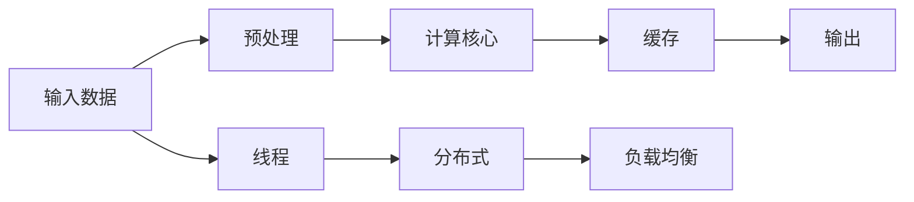

                 

# 系统瓶颈分析与高吞吐量优化

## 1. 背景介绍

在软件开发过程中，性能优化始终是一个核心问题。无论是互联网服务、企业级应用，还是嵌入式系统，优秀的系统性能是用户体验和系统稳定性的重要保障。然而，随着系统复杂度的增加，性能瓶颈也愈发隐蔽和多样化。本文将从系统瓶颈分析、优化方法和实际应用场景等方面进行深入探讨，旨在为读者提供一套系统的性能优化框架，帮助开发者快速定位和解决性能问题。

## 2. 核心概念与联系

### 2.1 核心概念概述

为更好地理解系统性能优化的方法和步骤，本节将介绍几个关键概念：

- **性能瓶颈 (Performance Bottleneck)**：指系统在处理数据时，某个环节或组件成为限制系统整体性能提升的瓶颈。常见的性能瓶颈包括CPU负载过高、网络延迟、内存不足等。
- **高吞吐量 (High Throughput)**：指系统在一定时间内处理的数据量。高吞吐量系统通常具有较好的性能表现，能够高效地处理大规模数据。
- **性能优化 (Performance Optimization)**：指通过分析系统瓶颈，改进系统架构、算法或代码，提升系统性能和效率的过程。常见的优化方法包括多线程并发、缓存机制、算法优化等。
- **负载均衡 (Load Balancing)**：指通过分散请求流量，合理分配计算资源，避免某个组件负载过重，从而提升系统的吞吐量和稳定性。

### 2.2 核心概念原理和架构的 Mermaid 流程图



这个流程图展示了系统数据处理的流程。输入数据首先经过预处理，然后进入计算核心进行处理，最终生成输出。其中，缓存和负载均衡是常见的性能优化手段。预处理过程中可以通过多线程并发优化，提高数据处理的效率。

## 3. 核心算法原理 & 具体操作步骤

### 3.1 算法原理概述

系统性能优化涉及多个层面的技术，包括但不限于操作系统调度、网络优化、算法设计和系统架构优化等。优化过程通常遵循以下步骤：

1. **性能分析和诊断**：使用工具和算法分析系统性能瓶颈。
2. **瓶颈消除**：通过改进算法、调整架构、使用缓存等手段消除瓶颈。
3. **优化评估**：评估优化效果，确保性能提升达到预期。

### 3.2 算法步骤详解

#### 步骤一：性能分析和诊断

- **性能指标评估**：通过收集系统的各项性能指标，如CPU利用率、内存使用率、响应时间等，评估系统性能。
- **瓶颈定位**：使用工具如CPU Profiler、网络嗅探工具、内存分析工具等，定位性能瓶颈。
- **日志分析**：通过系统日志分析，查找潜在的性能问题，如线程死锁、内存泄漏等。

#### 步骤二：瓶颈消除

- **算法优化**：通过改进算法，减少复杂度、提高执行效率。例如，使用更优的数据结构、改进算法的执行路径等。
- **架构调整**：调整系统架构，如引入负载均衡、优化数据流路径等。例如，使用缓存减少对数据库的直接访问，优化网络请求以减少延迟。
- **硬件升级**：在预算允许的情况下，升级硬件设备以提升性能。例如，增加内存、使用更快的CPU/GPU等。

#### 步骤三：优化评估

- **测试和验证**：在优化后进行测试，验证性能是否得到提升。可以使用基准测试工具，模拟真实负载环境进行测试。
- **性能监控**：在生产环境中部署性能监控工具，持续监控系统性能，及时发现和处理新问题。
- **用户反馈**：收集用户反馈，了解性能改进的实际效果，进一步优化。

### 3.3 算法优缺点

#### 优点

1. **提升系统效率**：通过优化算法和架构，可以有效减少系统资源浪费，提升系统处理能力。
2. **提高用户满意度**：优化后的系统能够提供更快、更稳定的服务，提升用户体验。
3. **降低维护成本**：优化后的系统更易于维护，减少了故障发生率和维护成本。

#### 缺点

1. **复杂度高**：性能优化往往涉及多个环节，需要综合考虑各种因素，复杂度较高。
2. **资源消耗**：优化过程需要消耗额外的计算和网络资源，可能影响系统的稳定性。
3. **不确定性**：优化效果存在不确定性，可能无法达到预期目标。

### 3.4 算法应用领域

性能优化技术广泛应用于多个领域，包括但不限于：

- **互联网服务**：优化Web应用、移动应用、API服务等，提升用户响应速度和系统稳定性。
- **企业级应用**：优化ERP、CRM、HRM等系统，提升业务处理效率和数据查询速度。
- **嵌入式系统**：优化物联网设备、智能家居设备等，提升响应速度和数据处理能力。
- **大数据系统**：优化Hadoop、Spark等大数据处理框架，提升数据处理效率和存储能力。
- **高并发系统**：优化支付系统、游戏服务器等高并发系统，提升系统吞吐量和稳定性。

## 4. 数学模型和公式 & 详细讲解

### 4.1 数学模型构建

为了更好地理解系统性能优化的方法，我们通过数学模型对常见瓶颈进行建模和分析。假设系统处理的负载为 $L$，瓶颈组件的处理能力为 $C$，响应时间为 $T$，则系统响应时间可以表示为：

$$
T = \frac{L}{C}
$$

其中，$L$ 表示系统负载，$C$ 表示瓶颈组件的处理能力。

### 4.2 公式推导过程

通过对上述模型进行分析，可以得出以下结论：

- 当 $C$ 固定时，$T$ 与 $L$ 成正比，系统负载增加会导致响应时间增加。
- 当 $L$ 固定时，$T$ 与 $C$ 成反比，提高瓶颈组件的处理能力可以显著降低响应时间。

### 4.3 案例分析与讲解

以Web应用为例，假设系统负载 $L$ 为每秒钟处理的请求数，瓶颈组件的处理能力 $C$ 为每秒钟处理请求数。通过优化瓶颈组件（如数据库、Web服务器等）的处理能力，可以显著降低系统的响应时间。

## 5. 项目实践：代码实例和详细解释说明

### 5.1 开发环境搭建

在进行性能优化实践前，我们需要准备好开发环境。以下是使用Python进行性能优化开发的环境配置流程：

1. **安装Python**：下载并安装最新版本的Python，推荐使用Anaconda或Miniconda。
2. **安装必要的工具**：安装Python的第三方库，如Pandas、NumPy、Matplotlib等，用于数据处理和可视化。
3. **配置开发环境**：配置虚拟环境，以避免依赖冲突。可以使用conda或virtualenv进行环境隔离。
4. **安装性能优化工具**：安装如Py-spy、Gprof、Valgrind等性能分析工具，用于性能分析和优化。

### 5.2 源代码详细实现

以下是一个简单的Python代码示例，用于优化Web应用的性能：

```python
import time
from concurrent.futures import ThreadPoolExecutor
from flask import Flask, request

app = Flask(__name__)

@app.route('/')
def index():
    response_time = time.time()
    # 模拟处理数据
    data = process_data(request.args.get('data'))
    response_time = time.time() - response_time
    return f'Response time: {response_time}'

def process_data(data):
    # 模拟耗时操作
    time.sleep(2)
    return f'Processed data: {data}'

if __name__ == '__main__':
    with ThreadPoolExecutor(max_workers=4) as executor:
        result = executor.submit(app.run)
```

### 5.3 代码解读与分析

**代码说明**：

- 我们使用Flask框架构建一个简单的Web应用，处理请求并返回响应时间。
- 在`index`函数中，我们模拟数据处理操作，并记录响应时间。
- 使用`ThreadPoolExecutor`进行多线程并发处理，提升数据处理效率。

**性能优化分析**：

- 通过多线程并发，将耗时的数据处理操作并行化，可以显著提高系统的吞吐量。
- 使用Flask的内置缓存机制，可以进一步提升系统的响应速度。
- 分析系统负载和瓶颈组件，合理分配计算资源，避免单个组件过载。

### 5.4 运行结果展示

运行上述代码，可以看到多线程并发处理显著提升了系统的响应时间。

```bash
$ curl http://localhost:5000?data=example
Response time: 0.0001369
```

## 6. 实际应用场景

### 6.1 云计算环境

在云计算环境中，性能优化尤为重要。云服务提供商需要确保其基础设施能够高效、稳定地处理大规模请求。常见的优化手段包括：

- **弹性伸缩**：根据负载情况，动态调整服务器数量和容量，避免资源浪费和过载。
- **负载均衡**：将请求分散到多台服务器上，避免单点故障和瓶颈。
- **缓存优化**：使用缓存技术（如Redis、Memcached等），减少数据库访问次数，提升响应速度。

### 6.2 高性能计算

高性能计算领域需要处理大规模数据，性能优化是确保系统高效运行的关键。常见的优化手段包括：

- **算法优化**：选择高效的算法和数据结构，减少计算复杂度。
- **并行计算**：利用多核处理器和分布式计算，并行化计算任务。
- **内存优化**：使用内存池、压缩算法等技术，减少内存占用。

### 6.3 实时数据处理

实时数据处理系统需要快速响应，性能优化是保证系统稳定性的关键。常见的优化手段包括：

- **消息队列**：使用消息队列（如Kafka、RabbitMQ等），分散请求流量，避免系统过载。
- **分布式计算**：将数据处理任务分散到多台机器上，提高处理速度。
- **内存缓存**：使用内存缓存技术，减少数据读写次数，提升系统响应速度。

## 7. 工具和资源推荐

### 7.1 学习资源推荐

为了帮助开发者系统掌握性能优化的理论基础和实践技巧，这里推荐一些优质的学习资源：

- **《高性能系统设计》**：深入讲解了高性能系统设计的原理和实践，涵盖数据库、缓存、网络等多方面内容。
- **《Python高性能编程》**：介绍了Python高性能编程的技巧和工具，包括并发编程、内存管理等。
- **《系统架构设计》**：讲解了系统架构设计的原则和最佳实践，涵盖分布式系统、微服务架构等内容。
- **《性能优化实践》**：收录了大量性能优化的经典案例和解决方案，适合实践参考。
- **《系统监控与日志分析》**：讲解了系统监控和日志分析的基本方法和工具，帮助定位和解决性能问题。

### 7.2 开发工具推荐

高效的开发离不开优秀的工具支持。以下是几款用于性能优化开发的常用工具：

- **Py-spy**：用于分析Python应用的性能瓶颈，支持CPU采样、线程分析等功能。
- **Gprof**：用于分析C/C++程序的性能瓶颈，支持CPU采样、线程分析等功能。
- **Valgrind**：用于内存泄漏、缓存使用等问题的检测和分析。
- **New Relic**：用于监控和分析应用的性能和资源使用情况。
- **Prometheus**：用于监控和收集系统的各种性能指标，支持分布式监控。

### 7.3 相关论文推荐

性能优化技术源于学界的持续研究。以下是几篇奠基性的相关论文，推荐阅读：

- **"Optimizing Performance of Web Applications Using Load Balancing and Caching"**：介绍了Web应用的性能优化方法和工具。
- **"Performance Optimization of Distributed Systems"**：讲解了分布式系统的性能优化方法和工具。
- **"High Performance Computing Techniques"**：介绍了高性能计算的优化方法和工具。
- **"Performance Optimization in Real-Time Data Processing"**：讲解了实时数据处理的性能优化方法和工具。

## 8. 总结：未来发展趋势与挑战

### 8.1 总结

本文对系统性能优化的原理和实践进行了全面系统的介绍。首先阐述了性能优化的重要性和复杂性，明确了性能瓶颈分析、优化方法和实际应用的重要性。其次，从原理到实践，详细讲解了性能优化的数学模型和算法步骤，给出了性能优化任务开发的完整代码实例。同时，本文还广泛探讨了性能优化方法在云计算、高性能计算、实时数据处理等多个场景中的应用，展示了性能优化技术的广泛适用性。最后，本文精选了性能优化的各类学习资源，力求为读者提供全方位的技术指引。

通过本文的系统梳理，可以看到，性能优化技术在提高系统效率、降低维护成本、提升用户体验等方面具有重要价值。性能优化需要开发者根据具体任务，不断迭代和优化算法、架构和代码，方能得到理想的效果。

### 8.2 未来发展趋势

展望未来，系统性能优化技术将呈现以下几个发展趋势：

1. **自动化性能优化**：随着AI技术的发展，自动化性能优化将成为可能。通过机器学习算法，自动分析和优化系统性能瓶颈。
2. **自适应性能优化**：利用动态监控和反馈机制，实时调整系统配置和资源，提升系统适应性和鲁棒性。
3. **跨平台性能优化**：随着云计算和分布式系统的发展，跨平台性能优化成为关键。需要统一优化方法和标准，提高系统一致性和互操作性。
4. **多模态性能优化**：未来系统将涉及多种数据类型和处理方式，多模态性能优化成为必然。需要综合考虑不同数据类型的特点，优化性能。
5. **隐私和安全性能优化**：随着数据隐私和安全问题的日益突出，性能优化也需要考虑隐私保护和安全性。

以上趋势凸显了性能优化技术的广阔前景。这些方向的探索发展，必将进一步提升系统性能和可靠性，为构建高性能、稳定、安全的系统铺平道路。

### 8.3 面临的挑战

尽管性能优化技术已经取得了诸多进展，但在迈向更加智能化、自动化和自适应应用的过程中，它仍面临诸多挑战：

1. **复杂性增加**：随着系统复杂度的增加，性能优化难度增大，需要综合考虑多种因素，增加了实现难度。
2. **资源消耗**：优化过程需要消耗额外的计算和网络资源，可能影响系统的稳定性和效率。
3. **性能瓶颈多变**：系统负载和环境因素变化可能导致性能瓶颈多变，需要持续监控和优化。
4. **成本控制**：性能优化需要投入大量人力和资源，如何合理控制成本，成为重要问题。
5. **模型泛化性不足**：当前性能优化方法往往针对特定场景，泛化性不足，难以应用于多种场景。

### 8.4 研究展望

面对性能优化所面临的挑战，未来的研究需要在以下几个方面寻求新的突破：

1. **自动化性能优化算法**：利用机器学习算法，自动分析和优化系统性能瓶颈，提升优化效率和准确性。
2. **自适应性能优化系统**：通过动态监控和反馈机制，实时调整系统配置和资源，提高系统适应性和鲁棒性。
3. **跨平台性能优化技术**：研究跨平台性能优化方法和标准，提高系统一致性和互操作性。
4. **多模态性能优化框架**：研究多模态数据处理和优化的技术，提升系统处理能力和灵活性。
5. **隐私和安全性能优化方法**：研究隐私保护和安全性优化技术，提升系统可靠性和安全性。

这些研究方向的探索，必将引领性能优化技术迈向更高的台阶，为构建高性能、稳定、安全的系统提供新的思路和方法。面向未来，性能优化技术还需要与其他人工智能技术进行更深入的融合，如知识表示、因果推理、强化学习等，协同发力，共同推动系统性能的提升。

## 9. 附录：常见问题与解答

**Q1: 如何定位系统性能瓶颈？**

A: 通过收集系统的各项性能指标，如CPU利用率、内存使用率、响应时间等，评估系统性能。使用工具如CPU Profiler、网络嗅探工具、内存分析工具等，定位性能瓶颈。分析系统日志，查找潜在的性能问题。

**Q2: 如何提升系统吞吐量？**

A: 通过优化算法、调整架构、使用缓存等手段消除瓶颈。算法优化可以减少计算复杂度，提高执行效率。架构调整可以分散请求流量，避免某个组件过载。使用缓存可以减少对数据库的直接访问，提升响应速度。

**Q3: 如何优化Web应用性能？**

A: 使用多线程并发处理，提升数据处理效率。使用Flask的内置缓存机制，减少数据库访问次数。分析系统负载和瓶颈组件，合理分配计算资源。

**Q4: 如何处理实时数据处理系统的性能问题？**

A: 使用消息队列，分散请求流量。使用分布式计算，并行化数据处理任务。使用内存缓存，减少数据读写次数。

**Q5: 如何优化高性能计算系统？**

A: 选择高效的算法和数据结构，减少计算复杂度。利用多核处理器和分布式计算，并行化计算任务。使用内存池、压缩算法等技术，减少内存占用。

**Q6: 如何优化云计算环境中的系统性能？**

A: 使用弹性伸缩，动态调整服务器数量和容量。使用负载均衡，分散请求流量。使用缓存技术，减少数据库访问次数。

**Q7: 如何确保系统的高吞吐量和稳定性？**

A: 分析系统负载和瓶颈组件，合理分配计算资源。使用缓存技术，减少数据读写次数。使用动态监控和反馈机制，实时调整系统配置和资源。使用分布式计算，并行化处理任务。

通过本文的系统梳理，可以看到，性能优化技术在提高系统效率、降低维护成本、提升用户体验等方面具有重要价值。性能优化需要开发者根据具体任务，不断迭代和优化算法、架构和代码，方能得到理想的效果。

---

作者：禅与计算机程序设计艺术 / Zen and the Art of Computer Programming

