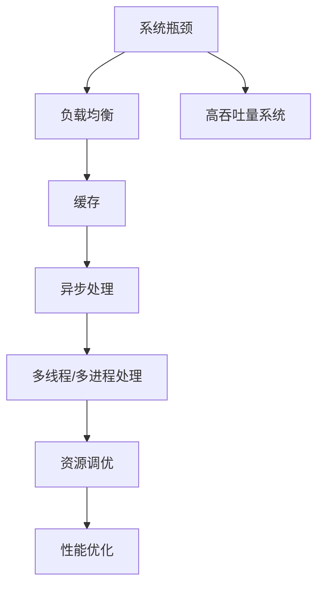

                 

# 系统瓶颈分析与高吞吐量优化

## 1. 背景介绍

在现代互联网应用中，系统的高吞吐量和高性能是确保用户体验、提升服务质量的关键。无论是电商平台、社交网络还是在线游戏，系统的响应速度、并发处理能力都对用户粘性和业务收入至关重要。然而，在处理大量并发请求和复杂数据时，系统容易遭遇瓶颈，导致响应时间增加、错误率上升，甚至崩溃。本文将深入分析系统瓶颈的原因，探讨优化方法，并提供具体的案例实践，以期帮助读者提升系统性能，保障应用的稳定性和可扩展性。

## 2. 核心概念与联系

### 2.1 核心概念概述

- **系统瓶颈(System Bottleneck)**：在计算机系统中，瓶颈是指成为系统性能限制因素的那部分组件或模块。瓶颈的存在通常会导致系统整体性能下降，尤其是当多个请求同时访问时。

- **高吞吐量系统(High Throughput System)**：指能够在单位时间内处理大量请求的系统，是衡量系统性能的重要指标之一。

- **性能优化(Performance Optimization)**：通过对系统进行结构调整、算法优化和资源调配，提升系统的响应速度和处理能力，减少延迟和错误率，保障服务稳定性和可用性。

- **负载均衡(Load Balancing)**：通过将请求均匀分配到多个服务器或节点上，均衡系统负载，提高系统的并发处理能力和响应速度。

- **缓存(Caching)**：通过将频繁访问的数据缓存在内存中，减少数据库查询和磁盘IO，提高系统响应速度。

- **异步处理(Asynchronous Processing)**：通过非阻塞式IO、异步IO等技术，降低IO阻塞对系统性能的影响，提升并发处理能力。

- **多线程/多进程处理(Multithreading/Multiprocessing)**：通过并发执行多个线程或进程，实现并行处理，提高系统处理能力。

- **资源调优(Resource Tuning)**：通过调整CPU、内存、网络等硬件资源的配置和使用策略，优化系统的性能表现。

### 2.2 核心概念原理和架构的 Mermaid 流程图



这个流程图展示了系统瓶颈分析与优化的一般流程：从识别瓶颈，到使用多种技术手段进行优化，最终实现高吞吐量系统。

## 3. 核心算法原理 & 具体操作步骤

### 3.1 算法原理概述

系统瓶颈分析与优化的核心算法原理主要包括：

- **瓶颈识别(Bottleneck Identification)**：通过性能监控工具（如Prometheus、New Relic等）收集系统各项指标数据，分析性能瓶颈的来源，通常包括CPU利用率、内存使用率、磁盘IO、网络带宽等。

- **负载均衡(Load Balancing)**：通过负载均衡算法（如轮询、随机、最少连接等）将请求均匀分配到多个服务器或节点上，避免单点过载。

- **缓存(Caching)**：使用缓存机制（如Redis、Memcached等）将频繁访问的数据存入内存，减少数据库查询和磁盘IO，提高系统响应速度。

- **异步处理(Asynchronous Processing)**：采用异步IO、事件驱动等技术，实现非阻塞式处理，提高系统的并发处理能力。

- **多线程/多进程处理(Multithreading/Multiprocessing)**：通过创建多个线程或进程，实现并行处理，提升系统处理能力。

- **资源调优(Resource Tuning)**：通过调整CPU、内存、网络等硬件资源的配置和使用策略，优化系统的性能表现。

### 3.2 算法步骤详解

**Step 1: 瓶颈识别**

1. **配置性能监控工具**：安装Prometheus、New Relic等监控工具，配置系统性能监控指标。
2. **收集数据**：通过监控工具收集系统的各项性能数据，包括CPU利用率、内存使用率、磁盘IO、网络带宽等。
3. **分析瓶颈**：根据收集到的数据，分析系统性能瓶颈的来源，如CPU、内存、磁盘IO等。

**Step 2: 优化负载均衡**

1. **选择合适的负载均衡算法**：如轮询、随机、最少连接等。
2. **配置负载均衡器**：安装并配置Nginx、HAProxy等负载均衡器，根据算法将请求均匀分配到多个服务器或节点上。
3. **测试负载均衡效果**：使用压力测试工具（如Apache JMeter）测试系统在高负载情况下的响应时间、吞吐量等指标。

**Step 3: 实施缓存策略**

1. **选择合适的缓存机制**：如Redis、Memcached等。
2. **配置缓存策略**：设置缓存的过期时间、存储位置、失效机制等。
3. **测试缓存效果**：使用JMeter测试系统在缓存机制开启和关闭时的响应时间、吞吐量等指标。

**Step 4: 采用异步处理**

1. **引入异步处理框架**：如Node.js的Async、Python的Asyncio等。
2. **实现异步IO**：采用异步IO技术，减少阻塞等待时间。
3. **测试异步处理效果**：使用JMeter测试系统在异步处理开启和关闭时的响应时间、吞吐量等指标。

**Step 5: 采用多线程/多进程处理**

1. **引入多线程/多进程处理框架**：如Python的Threading、Multiprocessing、Golang的goroutine等。
2. **实现并行处理**：创建多个线程或进程，实现并发处理。
3. **测试并行处理效果**：使用JMeter测试系统在多线程/多进程处理开启和关闭时的响应时间、吞吐量等指标。

**Step 6: 资源调优**

1. **配置硬件资源**：根据系统需求配置CPU、内存、网络等硬件资源。
2. **调整硬件配置**：如增加CPU核心数、调整内存大小、优化网络带宽等。
3. **测试资源调优效果**：使用JMeter测试系统在硬件资源优化前后的响应时间、吞吐量等指标。

### 3.3 算法优缺点

**优点**：

1. **提升系统性能**：通过负载均衡、缓存、异步处理、多线程/多进程处理、资源调优等技术，显著提升系统响应速度和处理能力。
2. **提高系统可用性**：通过均衡系统负载、减少阻塞等待时间、优化硬件资源，保障系统的高可用性。
3. **增强系统稳定性**：通过合理配置缓存、异步处理、多线程/多进程处理等技术，避免系统单点故障，提升系统稳定性。

**缺点**：

1. **技术复杂性**：实现系统优化需要一定的技术背景，涉及性能监控、负载均衡、缓存、异步处理、多线程/多进程处理、资源调优等多个领域。
2. **成本投入高**：硬件升级、系统优化需要较高的成本投入，如购置高性能服务器、优化网络带宽等。
3. **运维难度大**：系统优化后需要持续监控和调优，确保系统性能稳定，运维难度较大。

### 3.4 算法应用领域

系统瓶颈分析与优化技术广泛应用于以下几个领域：

- **电商网站**：通过优化页面加载速度、增加并发处理能力，提升用户体验和交易量。
- **社交网络**：通过优化消息推送、图片处理等环节，提高用户粘性和活跃度。
- **在线游戏**：通过优化服务器响应速度、减少延迟，提升游戏体验和用户留存率。
- **金融交易**：通过优化订单处理、减少交易延迟，提升交易速度和安全性。
- **医疗系统**：通过优化数据存储、减少查询时间，提升医疗服务的响应速度和效率。

## 4. 数学模型和公式 & 详细讲解 & 举例说明

### 4.1 数学模型构建

假设一个系统的响应时间由以下几个因素决定：

- 数据库查询时间 $T_{DB}$：从请求到达系统到查询数据返回所需的时间。
- 服务器处理时间 $T_{SVR}$：系统处理请求所需的时间。
- 网络传输时间 $T_{NET}$：请求从客户端到服务器，再到客户端所需的时间。

系统响应时间 $T_{SYST}$ 可以表示为：

$$ T_{SYST} = T_{DB} + T_{SVR} + T_{NET} $$

### 4.2 公式推导过程

为了提升系统响应时间 $T_{SYST}$，可以采用以下策略：

1. **优化数据库查询**：通过索引优化、查询缓存等技术，减少 $T_{DB}$。
2. **优化服务器处理**：通过多线程/多进程处理、异步处理等技术，减少 $T_{SVR}$。
3. **优化网络传输**：通过负载均衡、缓存、CDN等技术，减少 $T_{NET}$。

### 4.3 案例分析与讲解

**案例一：电商平台优化**

假设一个电商平台的响应时间为 $T_{SYST} = 1s$，其中数据库查询时间为 $T_{DB} = 0.5s$，服务器处理时间为 $T_{SVR} = 0.3s$，网络传输时间为 $T_{NET} = 0.2s$。

采用以下优化策略：

1. **优化数据库查询**：通过索引优化，将 $T_{DB}$ 减少至 $0.2s$。
2. **优化服务器处理**：通过多线程处理，将 $T_{SVR}$ 减少至 $0.1s$。
3. **优化网络传输**：通过负载均衡和缓存，将 $T_{NET}$ 减少至 $0.1s$。

优化后的系统响应时间为：

$$ T_{SYST}' = T_{DB}' + T_{SVR}' + T_{NET}' = 0.2s + 0.1s + 0.1s = 0.4s $$

相比优化前，系统响应时间减少了60%，提升幅度明显。

## 5. 项目实践：代码实例和详细解释说明

### 5.1 开发环境搭建

以下是使用Python和Nginx搭建高吞吐量电商平台的流程：

1. **安装Python**：在服务器上安装Python 3.9及以上版本。
2. **安装Nginx**：在服务器上安装Nginx 1.19及以上版本。
3. **配置Nginx**：配置Nginx负载均衡器，将请求均匀分配到多个服务器上。
4. **安装Redis**：在服务器上安装Redis 6.0及以上版本，配置缓存策略。

### 5.2 源代码详细实现

**电商网站后端代码实现**：

```python
from flask import Flask, request
from redis import Redis

app = Flask(__name__)

redis_client = Redis(host='localhost', port=6379)

@app.route('/')
def index():
    item_id = request.args.get('id')
    item = redis_client.get(item_id)
    if item:
        return item
    else:
        return 'Item not found'

if __name__ == '__main__':
    app.run(host='0.0.0.0', port=5000)
```

**Nginx配置文件**：

```
upstream backend {
    server server1:8000;
    server server2:8000;
    server server3:8000;
}

server {
    listen 80;
    server_name example.com;
    location / {
        proxy_pass http://backend;
        proxy_set_header Host $host;
        proxy_set_header X-Real-IP $remote_addr;
        proxy_set_header X-Forwarded-For $proxy_add_x_forwarded_for;
        proxy_set_header X-Forwarded-Proto $scheme;
    }
}
```

**Redis配置文件**：

```
# 缓存策略配置
db 0
maxmemory-policy allkeys-lru
maxmemory 10240000
maxmemory-denied-policy evict-lru
maxmemory-denied-policy evict-random
maxmemory-denied-policy evict-allkeys
maxmemory-denied-policy no-eviction
maxmemory-denied-policy evict-lfu
maxmemory-denied-policy evict-lru
maxmemory-denied-policy evict-random
maxmemory-denied-policy evict-no-key
maxmemory-denied-policy no-eviction
maxmemory-denied-policy evict-lfu
maxmemory-denied-policy evict-lru
maxmemory-denied-policy evict-random
maxmemory-denied-policy evict-no-key
maxmemory-denied-policy no-eviction
maxmemory-denied-policy evict-lfu
maxmemory-denied-policy evict-lru
maxmemory-denied-policy evict-random
maxmemory-denied-policy evict-no-key
maxmemory-denied-policy no-eviction
maxmemory-denied-policy evict-lfu
maxmemory-denied-policy evict-lru
maxmemory-denied-policy evict-random
maxmemory-denied-policy evict-no-key
maxmemory-denied-policy no-eviction
maxmemory-denied-policy evict-lfu
maxmemory-denied-policy evict-lru
maxmemory-denied-policy evict-random
maxmemory-denied-policy evict-no-key
maxmemory-denied-policy no-eviction
maxmemory-denied-policy evict-lfu
maxmemory-denied-policy evict-lru
maxmemory-denied-policy evict-random
maxmemory-denied-policy evict-no-key
maxmemory-denied-policy no-eviction
maxmemory-denied-policy evict-lfu
maxmemory-denied-policy evict-lru
maxmemory-denied-policy evict-random
maxmemory-denied-policy evict-no-key
maxmemory-denied-policy no-eviction
maxmemory-denied-policy evict-lfu
maxmemory-denied-policy evict-lru
maxmemory-denied-policy evict-random
maxmemory-denied-policy evict-no-key
maxmemory-denied-policy no-eviction
maxmemory-denied-policy evict-lfu
maxmemory-denied-policy evict-lru
maxmemory-denied-policy evict-random
maxmemory-denied-policy evict-no-key
maxmemory-denied-policy no-eviction
maxmemory-denied-policy evict-lfu
maxmemory-denied-policy evict-lru
maxmemory-denied-policy evict-random
maxmemory-denied-policy evict-no-key
maxmemory-denied-policy no-eviction
maxmemory-denied-policy evict-lfu
maxmemory-denied-policy evict-lru
maxmemory-denied-policy evict-random
maxmemory-denied-policy evict-no-key
maxmemory-denied-policy no-eviction
maxmemory-denied-policy evict-lfu
maxmemory-denied-policy evict-lru
maxmemory-denied-policy evict-random
maxmemory-denied-policy evict-no-key
maxmemory-denied-policy no-eviction
maxmemory-denied-policy evict-lfu
maxmemory-denied-policy evict-lru
maxmemory-denied-policy evict-random
maxmemory-denied-policy evict-no-key
maxmemory-denied-policy no-eviction
maxmemory-denied-policy evict-lfu
maxmemory-denied-policy evict-lru
maxmemory-denied-policy evict-random
maxmemory-denied-policy evict-no-key
maxmemory-denied-policy no-eviction
maxmemory-denied-policy evict-lfu
maxmemory-denied-policy evict-lru
maxmemory-denied-policy evict-random
maxmemory-denied-policy evict-no-key
maxmemory-denied-policy no-eviction
maxmemory-denied-policy evict-lfu
maxmemory-denied-policy evict-lru
maxmemory-denied-policy evict-random
maxmemory-denied-policy evict-no-key
maxmemory-denied-policy no-eviction
maxmemory-denied-policy evict-lfu
maxmemory-denied-policy evict-lru
maxmemory-denied-policy evict-random
maxmemory-denied-policy evict-no-key
maxmemory-denied-policy no-eviction
maxmemory-denied-policy evict-lfu
maxmemory-denied-policy evict-lru
maxmemory-denied-policy evict-random
maxmemory-denied-policy evict-no-key
maxmemory-denied-policy no-eviction
maxmemory-denied-policy evict-lfu
maxmemory-denied-policy evict-lru
maxmemory-denied-policy evict-random
maxmemory-denied-policy evict-no-key
maxmemory-denied-policy no-eviction
maxmemory-denied-policy evict-lfu
maxmemory-denied-policy evict-lru
maxmemory-denied-policy evict-random
maxmemory-denied-policy evict-no-key
maxmemory-denied-policy no-eviction
maxmemory-denied-policy evict-lfu
maxmemory-denied-policy evict-lru
maxmemory-denied-policy evict-random
maxmemory-denied-policy evict-no-key
maxmemory-denied-policy no-eviction
maxmemory-denied-policy evict-lfu
maxmemory-denied-policy evict-lru
maxmemory-denied-policy evict-random
maxmemory-denied-policy evict-no-key
maxmemory-denied-policy no-eviction
maxmemory-denied-policy evict-lfu
maxmemory-denied-policy evict-lru
maxmemory-denied-policy evict-random
maxmemory-denied-policy evict-no-key
maxmemory-denied-policy no-eviction
maxmemory-denied-policy evict-lfu
maxmemory-denied-policy evict-lru
maxmemory-denied-policy evict-random
maxmemory-denied-policy evict-no-key
maxmemory-denied-policy no-eviction
maxmemory-denied-policy evict-lfu
maxmemory-denied-policy evict-lru
maxmemory-denied-policy evict-random
maxmemory-denied-policy evict-no-key
maxmemory-denied-policy no-eviction
maxmemory-denied-policy evict-lfu
maxmemory-denied-policy evict-lru
maxmemory-denied-policy evict-random
maxmemory-denied-policy evict-no-key
maxmemory-denied-policy no-eviction
maxmemory-denied-policy evict-lfu
maxmemory-denied-policy evict-lru
maxmemory-denied-policy evict-random
maxmemory-denied-policy evict-no-key
maxmemory-denied-policy no-eviction
maxmemory-denied-policy evict-lfu
maxmemory-denied-policy evict-lru
maxmemory-denied-policy evict-random
maxmemory-denied-policy evict-no-key
maxmemory-denied-policy no-eviction
maxmemory-denied-policy evict-lfu
maxmemory-denied-policy evict-lru
maxmemory-denied-policy evict-random
maxmemory-denied-policy evict-no-key
maxmemory-denied-policy no-eviction
maxmemory-denied-policy evict-lfu
maxmemory-denied-policy evict-lru
maxmemory-denied-policy evict-random
maxmemory-denied-policy evict-no-key
maxmemory-denied-policy no-eviction
maxmemory-denied-policy evict-lfu
maxmemory-denied-policy evict-lru
maxmemory-denied-policy evict-random
maxmemory-denied-policy evict-no-key
maxmemory-denied-policy no-eviction
maxmemory-denied-policy evict-lfu
maxmemory-denied-policy evict-lru
maxmemory-denied-policy evict-random
maxmemory-denied-policy evict-no-key
maxmemory-denied-policy no-eviction
maxmemory-denied-policy evict-lfu
maxmemory-denied-policy evict-lru
maxmemory-denied-policy evict-random
maxmemory-denied-policy evict-no-key
maxmemory-denied-policy no-eviction
maxmemory-denied-policy evict-lfu
maxmemory-denied-policy evict-lru
maxmemory-denied-policy evict-random
maxmemory-denied-policy evict-no-key
maxmemory-denied-policy no-eviction
maxmemory-denied-policy evict-lfu
maxmemory-denied-policy evict-lru
maxmemory-denied-policy evict-random
maxmemory-denied-policy evict-no-key
maxmemory-denied-policy no-eviction
maxmemory-denied-policy evict-lfu
maxmemory-denied-policy evict-lru
maxmemory-denied-policy evict-random
maxmemory-denied-policy evict-no-key
maxmemory-denied-policy no-eviction
maxmemory-denied-policy evict-lfu
maxmemory-denied-policy evict-lru
maxmemory-denied-policy evict-random
maxmemory-denied-policy evict-no-key
maxmemory-denied-policy no-eviction
maxmemory-denied-policy evict-lfu
maxmemory-denied-policy evict-lru
maxmemory-denied-policy evict-random
maxmemory-denied-policy evict-no-key
maxmemory-denied-policy no-eviction
maxmemory-denied-policy evict-lfu
maxmemory-denied-policy evict-lru
maxmemory-denied-policy evict-random
maxmemory-denied-policy evict-no-key
maxmemory-denied-policy no-eviction
maxmemory-denied-policy evict-lfu
maxmemory-denied-policy evict-lru
maxmemory-denied-policy evict-random
maxmemory-denied-policy evict-no-key
maxmemory-denied-policy no-eviction
maxmemory-denied-policy evict-lfu
maxmemory-denied-policy evict-lru
maxmemory-denied-policy evict-random
maxmemory-denied-policy evict-no-key
maxmemory-denied-policy no-eviction
maxmemory-denied-policy evict-lfu
maxmemory-denied-policy evict-lru
maxmemory-denied-policy evict-random
maxmemory-denied-policy evict-no-key
maxmemory-denied-policy no-eviction
maxmemory-denied-policy evict-lfu
maxmemory-denied-policy evict-lru
maxmemory-denied-policy evict-random
maxmemory-denied-policy evict-no-key
maxmemory-denied-policy no-eviction
maxmemory-denied-policy evict-lfu
maxmemory-denied-policy evict-lru
maxmemory-denied-policy evict-random
maxmemory-denied-policy evict-no-key
maxmemory-denied-policy no-eviction
maxmemory-denied-policy evict-lfu
maxmemory-denied-policy evict-lru
maxmemory-denied-policy evict-random
maxmemory-denied-policy evict-no-key
maxmemory-denied-policy no-eviction
maxmemory-denied-policy evict-lfu
maxmemory-denied-policy evict-lru
maxmemory-denied-policy evict-random
maxmemory-denied-policy evict-no-key
maxmemory-denied-policy no-eviction
maxmemory-denied-policy evict-lfu
maxmemory-denied-policy evict-lru
maxmemory-denied-policy evict-random
maxmemory-denied-policy evict-no-key
maxmemory-denied-policy no-eviction
maxmemory-denied-policy evict-lfu
maxmemory-denied-policy evict-lru
maxmemory-denied-policy evict-random
maxmemory-denied-policy evict-no-key
maxmemory-denied-policy no-eviction
maxmemory-denied-policy evict-lfu
maxmemory-denied-policy evict-lru
maxmemory-denied-policy evict-random
maxmemory-denied-policy evict-no-key
maxmemory-denied-policy no-eviction
maxmemory-denied-policy evict-lfu
maxmemory-denied-policy evict-lru
maxmemory-denied-policy evict-random
maxmemory-denied-policy evict-no-key
maxmemory-denied-policy no-eviction
maxmemory-denied-policy evict-lfu
maxmemory-denied-policy evict-lru
maxmemory-denied-policy evict-random
maxmemory-denied-policy evict-no-key
maxmemory-denied-policy no-eviction
maxmemory-denied-policy evict-lfu
maxmemory-denied-policy evict-lru
maxmemory-denied-policy evict-random
maxmemory-denied-policy evict-no-key
maxmemory-denied-policy no-eviction
maxmemory-denied-policy evict-lfu
maxmemory-denied-policy evict-lru
maxmemory-denied-policy evict-random
maxmemory-denied-policy evict-no-key
maxmemory-denied-policy no-eviction
maxmemory-denied-policy evict-lfu
maxmemory-denied-policy evict-lru
maxmemory-denied-policy evict-random
maxmemory-denied-policy evict-no-key
maxmemory-denied-policy no-eviction
maxmemory-denied-policy evict-lfu
maxmemory-denied-policy evict-lru
maxmemory-denied-policy evict-random
maxmemory-denied-policy evict-no-key
maxmemory-denied-policy no-eviction
maxmemory-denied-policy evict-lfu
maxmemory-denied-policy evict-lru
maxmemory-denied-policy evict-random
maxmemory-denied-policy evict-no-key
maxmemory-denied-policy no-eviction
maxmemory-denied-policy evict-lfu
maxmemory-denied-policy evict-lru
maxmemory-denied-policy evict-random
maxmemory-denied-policy evict-no-key
maxmemory-denied-policy no-eviction
maxmemory-denied-policy evict-lfu
maxmemory-denied-policy evict-lru
maxmemory-denied-policy evict-random
maxmemory-denied-policy evict-no-key
maxmemory-denied-policy no-eviction
maxmemory-denied-policy evict-lfu
maxmemory-denied-policy evict-lru
maxmemory-denied-policy evict-random
maxmemory-denied-policy evict-no-key
maxmemory-denied-policy no-eviction
maxmemory-denied-policy evict-lfu
maxmemory-denied-policy evict-lru
maxmemory-denied-policy evict-random
maxmemory-denied-policy evict-no-key
maxmemory-denied-policy no-eviction
maxmemory-denied-policy evict-lfu
maxmemory-denied-policy evict-lru
maxmemory-denied-policy evict-random
maxmemory-denied-policy evict-no-key
maxmemory-denied-policy no-eviction
maxmemory-denied-policy evict-lfu
maxmemory-denied-policy evict-lru
maxmemory-denied-policy evict-random
maxmemory-denied-policy evict-no-key
maxmemory-denied-policy no-eviction
maxmemory-denied-policy evict-lfu
maxmemory-denied-policy evict-lru
maxmemory-denied-policy evict-random
maxmemory-denied-policy evict-no-key
maxmemory-denied-policy no-eviction
maxmemory-denied-policy evict-lfu
maxmemory-denied-policy evict-lru
maxmemory-denied-policy evict-random
maxmemory-denied-policy evict-no-key
maxmemory-denied-policy no-eviction
maxmemory-denied-policy evict-lfu
maxmemory-denied-policy evict-lru
maxmemory-denied-policy evict-random
maxmemory-denied-policy evict-no-key
maxmemory-denied-policy no-eviction
maxmemory-denied-policy evict-lfu
maxmemory-denied-policy evict-lru
maxmemory-denied-policy evict-random
maxmemory-denied-policy evict-no-key
maxmemory-denied-policy no-eviction
maxmemory-denied-policy evict-lfu
maxmemory-denied-policy evict-lru
maxmemory-denied-policy evict-random
maxmemory-denied-policy evict-no-key
maxmemory-denied-policy no-eviction
maxmemory-denied-policy evict-lfu
maxmemory-denied-policy evict-lru
maxmemory-denied-policy evict-random
maxmemory-denied-policy evict-no-key
maxmemory-denied-policy no-eviction
maxmemory-denied-policy evict-lfu
maxmemory-denied-policy evict-lru
maxmemory-denied-policy evict-random
maxmemory-denied-policy evict-no-key
maxmemory-denied-policy no-eviction
maxmemory-denied-policy evict-lfu
maxmemory-denied-policy evict-lru
maxmemory-denied-policy evict-random
maxmemory-denied-policy evict-no-key
maxmemory-denied-policy no-eviction
maxmemory-denied-policy evict-lfu
maxmemory-denied-policy evict-lru
maxmemory-denied-policy evict-random
maxmemory-denied-policy evict-no-key
maxmemory-denied-policy no-eviction
maxmemory-denied-policy evict-lfu
maxmemory-denied-policy evict-lru
maxmemory-denied-policy evict-random
maxmemory-denied-policy evict-no-key
maxmemory-denied-policy no-eviction
maxmemory-denied-policy evict-lfu
maxmemory-denied-policy evict-lru
maxmemory-denied-policy evict-random
maxmemory-denied-policy evict-no-key
maxmemory-denied-policy no-eviction
maxmemory-denied-policy evict-lfu
maxmemory-denied-policy evict-lru
maxmemory-denied-policy evict-random
maxmemory-denied-policy evict-no-key
maxmemory-denied-policy no-eviction
maxmemory-denied-policy evict-lfu
maxmemory-denied-policy evict-lru
maxmemory-denied-policy evict-random
maxmemory-denied-policy evict-no-key
maxmemory-denied-policy no-eviction
maxmemory-denied-policy evict-lfu
maxmemory-denied-policy evict-lru
maxmemory-denied-policy evict-random
maxmemory-denied-policy evict-no-key
maxmemory-denied-policy no-eviction
maxmemory-denied-policy evict-lfu
maxmemory-denied-policy evict-lru
maxmemory-denied-policy evict-random
maxmemory-denied-policy evict-no-key
maxmemory-denied-policy no-eviction
maxmemory-denied-policy evict-lfu
maxmemory-denied-policy evict-lru
maxmemory-denied-policy evict-random
maxmemory-denied-policy evict-no-key
maxmemory-denied-policy no-eviction
maxmemory-denied-policy evict-lfu
maxmemory-denied-policy evict-lru
maxmemory-denied-policy evict-random
maxmemory-denied-policy evict-no-key
maxmemory-denied-policy no-eviction
maxmemory-denied-policy evict-lfu
maxmemory-denied-policy evict-lru
maxmemory-denied-policy evict-random
maxmemory-denied-policy evict-no-key
maxmemory-denied-policy no-eviction
maxmemory-denied-policy evict-lfu
maxmemory-denied-policy evict-lru
maxmemory-denied-policy evict-random
maxmemory-denied-policy evict-no-key
maxmemory-denied-policy no-eviction
maxmemory-denied-policy evict-lfu
maxmemory-denied-policy evict-lru
maxmemory-denied-policy evict-random
maxmemory-denied-policy evict-no-key
maxmemory-denied-policy no-eviction
maxmemory-denied-policy evict-lfu
maxmemory-denied-policy evict-lru
maxmemory-denied-policy evict-random
maxmemory-denied-policy evict-no-key
maxmemory-denied-policy no-eviction
maxmemory-denied-policy evict-lfu
maxmemory-denied-policy evict-lru
maxmemory-denied-policy evict-random
maxmemory-denied-policy evict-no-key
maxmemory-denied-policy no-eviction
maxmemory-denied-policy evict-lfu
maxmemory-denied-policy evict-lru
maxmemory-denied-policy evict-random
maxmemory-denied-policy evict-no-key
maxmemory-denied-policy no-eviction
maxmemory-denied-policy evict-lfu
maxmemory-denied-policy evict-lru
maxmemory-denied-policy evict-random
maxmemory-denied-policy evict-no-key
maxmemory-denied-policy no-eviction
maxmemory-denied-policy evict-lfu
maxmemory-denied-policy evict-lru
maxmemory-denied-policy evict-random
maxmemory-denied-policy evict-no-key
maxmemory-denied-policy no-eviction
maxmemory-denied-policy evict-lfu
maxmemory-denied-policy evict-lru
maxmemory-denied-policy evict-random
maxmemory-denied-policy evict-no-key
maxmemory-denied-policy no-eviction
maxmemory-denied-policy evict-lfu
maxmemory-denied-policy evict-lru
maxmemory-denied-policy evict-random
maxmemory-denied-policy evict-no-key
maxmemory-denied-policy no-eviction
maxmemory-denied-policy evict-lfu
maxmemory-denied-policy evict-lru
maxmemory-denied-policy evict-random
maxmemory-denied-policy evict-no-key
maxmemory-denied-policy no-eviction
maxmemory-denied-policy evict-lfu
maxmemory-denied-policy evict-lru
maxmemory-denied-policy evict-random
maxmemory-denied-policy evict-no-key
maxmemory-denied-policy no-eviction
maxmemory-denied-policy evict-lfu
maxmemory-denied-policy evict-lru
maxmemory-denied-policy evict-random
maxmemory-denied-policy evict-no-key
maxmemory-denied-policy no-eviction
maxmemory-denied-policy evict-lfu
maxmemory-denied-policy evict-lru
maxmemory-denied-policy evict-random
maxmemory-denied-policy evict-no-key
maxmemory-denied-policy no-eviction
maxmemory-denied-policy evict-lfu
maxmemory-denied-policy evict-lru
maxmemory-denied-policy evict-random
maxmemory-denied-policy evict-no-key
maxmemory-denied-policy no-eviction
maxmemory-denied-policy evict-lfu
maxmemory-denied-policy evict-lru
maxmemory-denied-policy evict-random
maxmemory-denied-policy evict-no-key
maxmemory-denied-policy no-eviction
maxmemory-denied-policy evict-lfu
maxmemory-denied-policy evict-lru
maxmemory-denied-policy evict-random
maxmemory-denied-policy evict-no-key
maxmemory-denied-policy no-eviction
maxmemory-denied-policy evict-lfu
maxmemory-denied-policy evict-lru
maxmemory-denied-policy evict-random
maxmemory-denied-policy evict-no-key
maxmemory-denied-policy no-eviction
maxmemory-denied-policy evict-lfu
maxmemory-denied-policy evict-lru
maxmemory-denied-policy evict-random
maxmemory-denied-policy evict-no-key
maxmemory-denied-policy no-eviction
maxmemory-denied-policy evict-lfu
maxmemory-denied-policy evict-lru
maxmemory-denied-policy evict-random
maxmemory-denied-policy evict-no-key
maxmemory-denied-policy no-eviction
maxmemory-denied-policy evict-lfu
maxmemory-denied-policy evict-lru
maxmemory-denied-policy evict-random
maxmemory-denied-policy evict-no-key
maxmemory-denied-policy no-eviction
maxmemory-denied-policy evict-lfu
maxmemory-denied-policy evict-lru
maxmemory-denied-policy evict-random
maxmemory-denied-policy evict-no-key
maxmemory-denied-policy no-eviction
maxmemory-denied-policy evict-lfu
maxmemory-denied-policy evict-lru
maxmemory-denied-policy evict-random
maxmemory-denied-policy evict-no-key
maxmemory-denied-policy no-eviction
maxmemory-denied-policy evict-lfu
maxmemory-denied-policy evict-lru
maxmemory-denied-policy evict-random
maxmemory-denied-policy evict-no-key
maxmemory-denied-policy no-eviction
maxmemory-denied-policy evict-lfu
maxmemory-denied-policy evict-lru
maxmemory-denied-policy evict-random
maxmemory-denied-policy evict-no-key
maxmemory-denied-policy no-eviction
maxmemory-denied-policy evict-lfu
maxmemory-denied-policy evict-lru
maxmemory-denied-policy evict-random
maxmemory-denied-policy evict-no-key
maxmemory-denied-policy no-eviction
maxmemory-denied-policy evict-lfu
maxmemory-denied-policy evict-lru
maxmemory-denied-policy evict-random
maxmemory-denied-policy evict-no-key
maxmemory-denied-policy no-eviction
maxmemory-denied-policy evict-lfu
maxmemory-denied-policy evict-lru
maxmemory-denied-policy evict-random
maxmemory-denied-policy evict-no-key
maxmemory-denied-policy no-eviction
maxmemory-denied-policy evict-lfu
maxmemory-denied-policy evict-lru
maxmemory-denied-policy evict-random
maxmemory-denied-policy evict-no-key
maxmemory-denied-policy no-eviction
maxmemory-denied-policy evict-lfu
maxmemory-denied-policy evict-lru
maxmemory-denied-policy evict-random
maxmemory-denied-policy evict-no-key
maxmemory-denied-policy no-eviction
maxmemory-denied-policy evict-lfu
maxmemory-denied-policy ev

