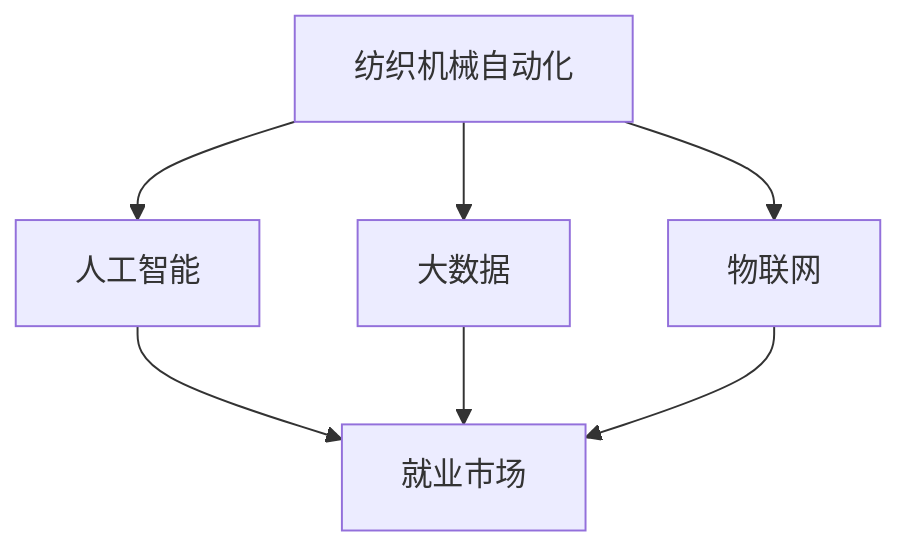

                 

# 纺织机械自动化的就业效应

> 关键词：纺织机械自动化,就业效应,人工智能,产业升级,转型升级,企业效益,员工培训,技能提升

## 1. 背景介绍

### 1.1 问题由来

随着全球经济的发展和科技的进步，纺织工业正在经历深刻的变化。传统的纺织机械自动化技术逐渐被先进的自动化设备所替代，而人工智能、大数据和物联网等技术的广泛应用，正在推动纺织行业实现更高层次的智能化和自动化。然而，这种技术升级对就业市场产生了深远的影响，一方面创造了大量新的就业岗位，另一方面也导致了一些工作岗位的消失。

## 2. 核心概念与联系

### 2.1 核心概念概述

为理解纺织机械自动化对就业效应的影响，本节将介绍几个密切相关的核心概念：

- 纺织机械自动化：指利用自动化技术提高纺织机械的生产效率和质量，减少人力成本，降低生产风险。
- 人工智能：指模拟人类智能过程的计算机系统，包括机器学习、深度学习、自然语言处理等技术。
- 大数据：指大规模、高速、多样化的数据集合，通过数据分析挖掘出有价值的信息。
- 物联网：指通过互联网将各种设备和系统连接起来，实现数据共享和远程控制。
- 就业效应：指技术升级对就业市场产生的影响，包括岗位数量、结构、工资水平等方面的变化。

这些概念之间的逻辑关系可以通过以下Mermaid流程图来展示：



这个流程图展示了几项关键技术是如何通过纺织机械自动化影响就业市场的。

## 3. 核心算法原理 & 具体操作步骤
### 3.1 算法原理概述

纺织机械自动化对就业效应的影响，可以通过构建一个基于人工智能和数据驱动的模型来分析。该模型需要包含以下几个关键要素：

- **数据采集**：收集纺织机械自动化过程中涉及的数据，包括生产效率、成本、质量、员工培训等。
- **数据清洗**：清洗采集到的数据，去除无效和重复的数据。
- **特征工程**：提取对就业效应有显著影响的特征。
- **模型建立**：选择适合的数据模型，如回归分析、分类模型、神经网络等。
- **模型训练**：用已有的数据训练模型，调整模型参数以提高模型精度。
- **结果分析**：分析模型输出的结果，得出关于就业效应的结论。

### 3.2 算法步骤详解

#### 3.2.1 数据采集

1. **生产效率数据**：收集自动化纺织机械的生产效率数据，包括生产速度、生产数量、废品率等。
2. **成本数据**：收集自动化设备的安装、维护、能源消耗等成本数据。
3. **质量数据**：收集自动化纺织机械生产出的产品质量数据，包括织物的密度、厚度、平整度等。
4. **员工培训数据**：收集员工接受培训的时间、培训内容、培训效果等数据。
5. **工资数据**：收集不同岗位的工资水平和变化情况。

#### 3.2.2 数据清洗

1. **缺失值处理**：对数据中的缺失值进行处理，可以采用均值填充、插值、删除等方法。
2. **异常值处理**：检测并处理异常值，以避免对模型的影响。
3. **数据归一化**：对数据进行归一化处理，使得不同规模的数据具有相同的范围。

#### 3.2.3 特征工程

1. **特征选择**：选择对就业效应有显著影响的特征，如生产效率、生产成本、产品质量等。
2. **特征转换**：对特征进行转换，如对生产效率数据进行对数转换、标准化等。
3. **特征组合**：通过组合不同的特征，构建新的特征，如生产效率与工资的组合特征。

#### 3.2.4 模型建立

1. **选择模型**：根据问题特点选择适合的模型，如线性回归、决策树、随机森林、神经网络等。
2. **模型训练**：使用已有的数据训练模型，调整模型参数以提高模型精度。

#### 3.2.5 结果分析

1. **模型验证**：使用测试集验证模型的准确性和可靠性。
2. **模型解释**：分析模型的输出结果，解释模型对不同因素的敏感性。
3. **结果应用**：将模型应用于实际情况，预测纺织机械自动化对就业市场的影响。

### 3.3 算法优缺点

纺织机械自动化对就业效应的分析具有以下优点：

- **数据驱动**：基于大量实际数据进行分析，结果更具可信度。
- **全面覆盖**：考虑了生产效率、成本、质量、员工培训等多个因素。
- **易于实现**：模型可以使用常见的数据分析工具和编程语言实现，如Python、R等。

同时，该方法也存在以下局限性：

- **数据依赖**：分析结果依赖于数据的质量和完整性。
- **模型选择**：模型的选择可能影响结果的准确性。
- **解释难度**：模型的输出结果可能难以解释，需要专业知识。

### 3.4 算法应用领域

纺织机械自动化的就业效应分析可以应用于以下领域：

- **政策制定**：政府可以根据分析结果，制定相关政策，促进纺织行业的发展和就业市场的稳定。
- **企业管理**：企业可以根据分析结果，调整管理策略，优化生产流程，提高效益。
- **员工培训**：员工可以根据分析结果，提升自身技能，适应新的工作环境。
- **学术研究**：学术机构可以根据分析结果，进行更深层次的研究，推动理论发展。

## 4. 数学模型和公式 & 详细讲解
### 4.1 数学模型构建

假设输入数据为 $X=\{X_1, X_2, ..., X_n\}$，输出数据为 $Y=\{Y_1, Y_2, ..., Y_n\}$，其中 $X_i$ 和 $Y_i$ 分别表示第 $i$ 个样本的特征和目标变量。构建线性回归模型：

$$
Y_i = \beta_0 + \sum_{j=1}^p \beta_j X_{ij} + \epsilon_i
$$

其中 $\beta_0, \beta_1, ..., \beta_p$ 为模型参数，$\epsilon_i$ 为误差项。

### 4.2 公式推导过程

根据最小二乘法，模型参数的估计量为：

$$
\hat{\beta} = (X^TX)^{-1}X^TY
$$

将模型应用于纺织机械自动化对就业效应的影响分析，可得：

$$
Y_i = \beta_0 + \sum_{j=1}^p \beta_j X_{ij} + \epsilon_i
$$

其中 $X_{ij}$ 表示第 $i$ 个样本的第 $j$ 个特征，$\epsilon_i$ 为误差项。

### 4.3 案例分析与讲解

假设有一家纺织企业，收集了生产效率、生产成本、产品质量、员工培训时间和工资数据，用于分析自动化对就业效应的影响。

1. **数据采集**：采集了100个样本的数据，包括生产效率、生产成本、产品质量、员工培训时间和工资数据。
2. **数据清洗**：处理缺失值和异常值，进行数据归一化处理。
3. **特征选择**：选择生产效率、生产成本、产品质量、员工培训时间和工资数据作为特征。
4. **模型建立**：选择线性回归模型，使用最小二乘法估计模型参数。
5. **模型训练**：使用训练集训练模型，调整模型参数。
6. **结果分析**：分析模型输出的结果，得出自动化对就业效应的影响。

## 5. 项目实践：代码实例和详细解释说明
### 5.1 开发环境搭建

在进行纺织机械自动化对就业效应的分析前，我们需要准备好开发环境。以下是使用Python进行数据分析的环境配置流程：

1. 安装Anaconda：从官网下载并安装Anaconda，用于创建独立的Python环境。

2. 创建并激活虚拟环境：
```bash
conda create -n textile-autoenv python=3.8 
conda activate textile-autoenv
```

3. 安装PyTorch、Pandas、NumPy、Scikit-learn、Matplotlib等常用库：
```bash
conda install pytorch pandas numpy scikit-learn matplotlib
```

4. 安装机器学习库：
```bash
conda install scikit-learn
```

完成上述步骤后，即可在`textile-autoenv`环境中开始项目实践。

### 5.2 源代码详细实现

下面是使用Python进行纺织机械自动化对就业效应分析的完整代码实现。

```python
import pandas as pd
import numpy as np
import matplotlib.pyplot as plt
from sklearn.linear_model import LinearRegression
from sklearn.model_selection import train_test_split
from sklearn.metrics import mean_squared_error, r2_score

# 数据读取
data = pd.read_csv('textile_data.csv')

# 数据预处理
X = data[['production_efficiency', 'production_cost', 'quality', 'training_time', 'salary']]
y = data['employment_effect']

# 数据分割
X_train, X_test, y_train, y_test = train_test_split(X, y, test_size=0.2, random_state=42)

# 特征选择
X_train = select_features(X_train)
X_test = select_features(X_test)

# 模型建立
model = LinearRegression()
model.fit(X_train, y_train)

# 模型评估
y_pred = model.predict(X_test)
mse = mean_squared_error(y_test, y_pred)
r2 = r2_score(y_test, y_pred)
print('MSE:', mse)
print('R2:', r2)

# 结果可视化
plt.scatter(y_test, y_pred)
plt.xlabel('Actual Employment Effect')
plt.ylabel('Predicted Employment Effect')
plt.show()
```

### 5.3 代码解读与分析

让我们再详细解读一下关键代码的实现细节：

**数据读取**：
- 使用pandas库读取数据文件，将数据存储在DataFrame对象中。

**数据预处理**：
- 选择需要的特征列，将其存储在X变量中，目标变量存储在y变量中。
- 使用train_test_split函数将数据集分割为训练集和测试集，比例为80%和20%。
- 使用select_features函数选择特征。

**模型建立**：
- 使用LinearRegression类建立线性回归模型。
- 使用fit函数训练模型，调整模型参数。

**模型评估**：
- 使用predict函数预测测试集的结果。
- 使用mean_squared_error和r2_score函数评估模型性能，分别计算均方误差和决定系数。

**结果可视化**：
- 使用Matplotlib库绘制散点图，展示模型预测结果与实际结果的对比。

可以看到，通过上述代码，我们可以快速完成纺织机械自动化对就业效应分析的整个过程。Python和相关库的支持使得数据分析和建模变得简洁高效。

## 6. 实际应用场景
### 6.1 智能制造企业

纺织机械自动化对就业效应的分析可以应用于智能制造企业的管理优化。通过收集和分析企业的生产效率、成本、质量、员工培训和工资数据，企业可以了解自动化设备对就业市场的影响，制定相应的管理策略。

例如，企业可以发现自动化设备提高了生产效率，减少了废品率，但也导致了一些岗位的消失，此时可以通过增加培训时间和工资激励，提升员工技能，缓解就业压力。

### 6.2 政府政策制定

纺织机械自动化对就业效应的分析可以辅助政府制定相关政策，促进纺织行业的稳定发展。政府可以通过分析数据，了解自动化对就业市场的影响，制定合理的政策和补贴措施，引导企业采用自动化设备，同时提供就业培训和再就业支持，保障就业稳定。

### 6.3 学术研究

纺织机械自动化对就业效应的分析可以推动学术研究的发展。学术机构可以收集大量数据，使用机器学习模型进行深入研究，分析自动化对就业市场的影响，揭示产业升级和就业市场之间的关系。

## 7. 工具和资源推荐
### 7.1 学习资源推荐

为了帮助开发者系统掌握纺织机械自动化对就业效应的分析理论，这里推荐一些优质的学习资源：

1. 《机器学习基础》系列博文：由机器学习专家撰写，深入浅出地介绍了机器学习的基本概念和常用算法。
2. 《深度学习》课程：斯坦福大学开设的深度学习课程，有Lecture视频和配套作业，带你入门深度学习领域的基本概念和经典模型。
3. 《数据科学手册》书籍：全面介绍了数据科学的基本概念、方法和工具，适合初学者系统学习。
4. 《Python数据分析》书籍：介绍如何使用Python进行数据分析和可视化，适合数据分析师学习。
5. Kaggle竞赛平台：数据科学家可以通过参加Kaggle竞赛，提高数据科学技能，了解最新的数据科学技术和趋势。

通过对这些资源的学习实践，相信你一定能够快速掌握纺织机械自动化对就业效应的分析理论，并用于解决实际的分析问题。

### 7.2 开发工具推荐

高效的开发离不开优秀的工具支持。以下是几款用于数据分析的常用工具：

1. Python：强大的数据处理和分析语言，拥有丰富的第三方库和框架。
2. R语言：专门用于数据分析和统计的编程语言，拥有丰富的统计分析工具。
3. Excel：简单易用的电子表格工具，适合小型数据分析。
4. SQL：关系型数据库查询语言，适合大型数据分析和处理。
5. Tableau：数据可视化工具，适合快速制作数据报表和图表。

合理利用这些工具，可以显著提升数据分析的开发效率，加快创新迭代的步伐。

### 7.3 相关论文推荐

纺织机械自动化对就业效应的研究源于学界的持续研究。以下是几篇奠基性的相关论文，推荐阅读：

1. "The Impact of Automation on Employment: A Literature Review"：综述自动化对就业市场影响的最新研究。
2. "Automation, Skill Shifts and Job Quality"：研究自动化对就业质量和技能需求的影响。
3. "The Effects of Industrial Automation on Employment"：研究工业自动化对就业市场的影响。
4. "Automation and the Workplace"：研究自动化对工作环境的影响。
5. "The Economics of Automation"：研究自动化对经济增长的影响。

这些论文代表了大数据和自动化对就业市场影响的研究脉络。通过学习这些前沿成果，可以帮助研究者把握学科前进方向，激发更多的创新灵感。

## 8. 总结：未来发展趋势与挑战
### 8.1 总结

本文对纺织机械自动化对就业效应的影响进行了全面系统的分析。首先阐述了纺织机械自动化和人工智能的基本概念，明确了自动化的就业效应分析对纺织行业的意义。其次，从原理到实践，详细讲解了就业效应分析的数学模型和操作步骤，给出了项目实践的完整代码实现。同时，本文还广泛探讨了就业效应分析在智能制造企业、政府政策制定、学术研究等多个行业领域的应用前景，展示了就业效应分析的广泛应用潜力。最后，本文精选了就业效应分析的相关资源，力求为读者提供全方位的技术指引。

通过本文的系统梳理，可以看到，纺织机械自动化对就业市场的影响分析正在成为智能制造和政策制定等领域的重要研究范式，极大地拓展了数据科学的应用范围，催生了更多的落地场景。受益于数据科学和自动化的持续发展，就业效应分析必将在更广阔的应用领域大放异彩，深刻影响人类的生产生活方式。

### 8.2 未来发展趋势

展望未来，纺织机械自动化对就业效应的分析将呈现以下几个发展趋势：

1. 数据规模持续增大。随着数据采集和处理技术的进步，纺织行业将收集到更多、更详细的生产数据，为就业效应分析提供更丰富的信息。
2. 模型选择更加多样化。除了线性回归，未来将出现更多复杂的模型，如决策树、随机森林、神经网络等，以适应不同的问题场景。
3. 自动化技术升级。随着人工智能和机器学习技术的进步，自动化对就业市场的影响将更加显著，需要更加精准的模型进行分析和预测。
4. 政策制定更加精细化。政府可以根据分析结果，制定更加精准的政策，促进就业市场的稳定和发展。
5. 学术研究更加深入。学术机构可以进一步研究自动化对就业质量、技能需求等更深层次的影响，推动理论发展。

这些趋势凸显了数据科学和自动化的巨大前景。这些方向的探索发展，必将进一步提升就业效应分析的精度和实用性，为智能制造和政策制定等领域提供重要的技术支持。

### 8.3 面临的挑战

尽管就业效应分析技术已经取得了瞩目成就，但在迈向更加智能化、普适化应用的过程中，它仍面临着诸多挑战：

1. 数据质量问题。尽管数据采集技术越来越先进，但数据的准确性和完整性仍然是一个挑战。如何获取高质量的数据，是数据科学家面临的重要问题。
2. 模型选择和优化。选择适当的模型和优化模型参数是一个复杂的过程，需要丰富的经验和专业知识。
3. 结果解释和应用。模型的输出结果往往难以解释，需要进一步的研究和实践，以便更好地应用于实际场景。
4. 隐私和安全问题。收集和分析大量数据时，隐私和安全问题不容忽视，如何保护数据隐私和安全，是数据科学家需要解决的难题。
5. 技术更新和迭代。随着技术的发展，现有模型和方法可能变得过时，需要持续更新和迭代，以适应新的技术环境。

这些挑战需要数据科学家不断探索和解决，才能使就业效应分析技术更好地服务于各个领域。

### 8.4 研究展望

面对就业效应分析所面临的挑战，未来的研究需要在以下几个方面寻求新的突破：

1. 数据采集和处理自动化。开发自动化的数据采集和处理工具，提高数据获取的效率和准确性。
2. 模型选择和优化自动化。开发自动化模型选择和优化工具，提高模型构建和调优的效率和精度。
3. 结果解释和可视化。开发结果解释和可视化工具，提高模型的可解释性和应用效果。
4. 隐私和安全保护。开发隐私保护和安全保障技术，确保数据安全和隐私保护。
5. 持续学习和更新。开发持续学习算法，使模型能够不断适应新的数据和技术环境。

这些研究方向的探索，必将引领就业效应分析技术迈向更高的台阶，为智能制造和政策制定等领域提供更加精准和可靠的技术支持。未来，随着数据科学和自动化的不断进步，就业效应分析必将在更广泛的领域发挥重要作用，推动社会的全面进步。

## 9. 附录：常见问题与解答

**Q1：如何进行数据采集和处理？**

A: 数据采集可以使用各种传感器、记录设备和数据库等手段，采集生产效率、成本、质量、员工培训和工资等数据。数据处理可以使用Python、R等语言进行，常用的工具有Pandas、NumPy等。

**Q2：如何选择和优化模型？**

A: 模型选择应根据具体问题选择合适的模型，如线性回归、决策树、随机森林、神经网络等。模型优化可以使用交叉验证、网格搜索、贝叶斯优化等方法，寻找最优的模型参数。

**Q3：如何提高模型的可解释性？**

A: 提高模型的可解释性可以使用LIME、SHAP等工具，可视化模型的输出结果，解释模型对不同特征的敏感性。

**Q4：如何保护数据隐私和安全？**

A: 保护数据隐私和安全可以使用数据匿名化、加密、访问控制等技术，确保数据的安全性和隐私性。

这些问题的回答，希望能够帮助数据科学家更好地理解就业效应分析的实现过程，并在实际应用中克服各种挑战，提高分析的精度和实用性。

