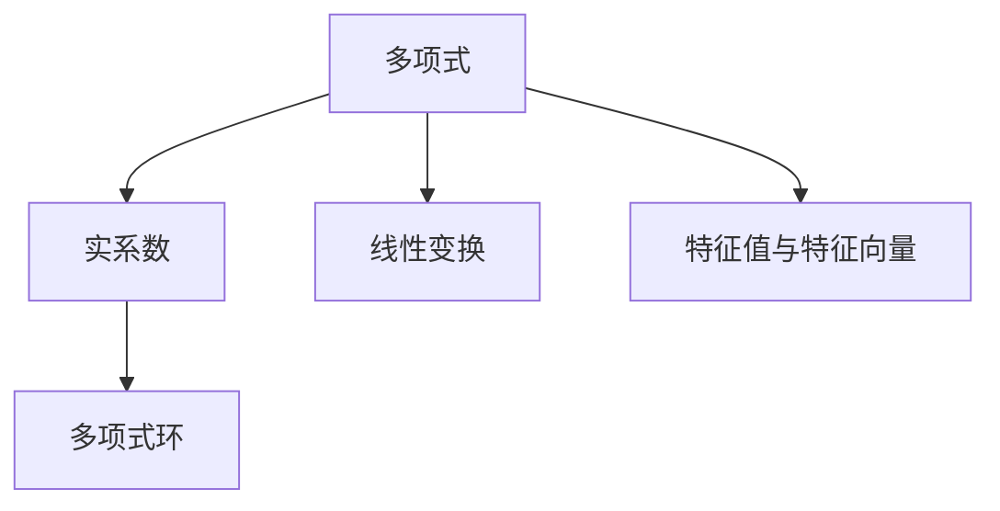

                 

# 线性代数导引：实系数多项式环

> 关键词：实系数多项式环,代数结构,线性变换,特征值与特征向量,矩阵分解,计算机代数系统,数值计算

## 1. 背景介绍

### 1.1 问题由来
线性代数是现代数学的基础分支之一，深刻影响着几乎所有现代物理、工程和计算机科学领域。在计算机科学中，线性代数不仅用于算法设计，而且成为许多计算密集型应用的核心，如数据科学、机器学习和信号处理等。

实系数多项式是线性代数的一个重要研究对象，它们不仅在数学研究中具有重要地位，而且在实际应用中也有广泛的应用，如多项式求根、解线性方程组、拟合多项式函数等。因此，深入理解实系数多项式环的理论和应用具有重要意义。

### 1.2 问题核心关键点
实系数多项式环的核心关键点包括：

- 定义与结构：理解实系数多项式环的定义和基本性质。
- 特征值与特征向量：掌握多项式的特征值和特征向量，理解其与线性变换的关系。
- 矩阵分解：掌握多项式的矩阵分解技术，如QR分解、LU分解等。
- 计算方法：了解多项式运算的数值计算方法，如牛顿迭代法、龙格-库塔法等。
- 计算机代数系统：熟悉常用的计算机代数系统(CAS)，如SymPy、Maple等，这些系统可以自动处理多项式运算，帮助解决复杂问题。

## 2. 核心概念与联系

### 2.1 核心概念概述

为了更好地理解实系数多项式环，本节将介绍几个密切相关的核心概念：

- 多项式：表示为 $p(x)=a_nx^n+a_{n-1}x^{n-1}+\dots+a_1x+a_0$ 的多项式，其中 $a_i$ 为系数，$x$ 为变量。
- 实系数：多项式中所有系数均为实数。
- 多项式环：由所有实系数多项式组成的集合，加上加法和乘法运算，构成一个代数结构。
- 线性变换：将多项式空间中的向量通过矩阵乘法映射到另一个空间的变换，对应于多项式的求导和积分等运算。
- 特征值与特征向量：多项式 $p(x)$ 的特征值 $\lambda$ 和特征向量 $x_0$ 满足 $p(x_0)=\lambda x_0$。

这些核心概念之间的逻辑关系可以通过以下Mermaid流程图来展示：



这个流程图展示了几何概念之间的联系：

1. 多项式是多项式环的基本元素。
2. 实系数限定多项式环中多项式的系数范围。
3. 线性变换将多项式映射到另一个空间，是多项式运算的重要工具。
4. 特征值与特征向量描述多项式在特定点的行为，是分析多项式性质的关键。

## 3. 核心算法原理 & 具体操作步骤
### 3.1 算法原理概述

实系数多项式环的算法原理主要围绕多项式的性质和运算展开，具体包括多项式的求导、积分、求根、多项式分解等。本文将重点讨论多项式环的基本结构和多项式的特征值与特征向量。

### 3.2 算法步骤详解

#### 3.2.1 多项式环的定义

多项式环 $\mathbb{R}[x]$ 定义为所有实系数多项式的集合，加上加法和乘法运算，构成一个代数结构。每个元素 $p(x)$ 表示为：

$$
p(x) = a_nx^n+a_{n-1}x^{n-1}+\dots+a_1x+a_0
$$

其中 $a_i$ 为实数系数，$n$ 为多项式的次数。

多项式环的加法定义为：

$$
p(x) + q(x) = (a_nx^n+a_{n-1}x^{n-1}+\dots+a_1x+a_0) + (b_nx^n+b_{n-1}x^{n-1}+\dots+b_1x+b_0) = (a_n+b_n)x^n+\dots+(a_1+b_1)x+(a_0+b_0)
$$

多项式环的乘法定义为：

$$
p(x) \cdot q(x) = (a_nx^n+a_{n-1}x^{n-1}+\dots+a_1x+a_0) \cdot (b_nx^n+b_{n-1}x^{n-1}+\dots+b_1x+b_0) = \sum_{i=0}^{2n} c_ix^i
$$

其中 $c_i$ 为 $a_i$ 和 $b_i$ 的积与和的组合，具体计算如下：

$$
c_i = \sum_{j=0}^i a_jb_{i-j}
$$

#### 3.2.2 特征值与特征向量的求解

多项式的特征值 $\lambda$ 和特征向量 $x_0$ 满足以下关系：

$$
p(x_0) = \lambda x_0
$$

求特征值与特征向量可以通过求解多项式的根来实现。一个多项式的根可以通过牛顿迭代法或二分法等数值方法求解。具体步骤如下：

1. 选择一个初始点 $x_0$。
2. 计算多项式在 $x_0$ 处的值 $p(x_0)$。
3. 使用牛顿迭代公式：

$$
x_{k+1} = x_k - \frac{p(x_k)}{p'(x_k)}
$$

4. 重复步骤 2 和 3，直到收敛或迭代次数达到预设值。

#### 3.2.3 特征多项式的分解

将一个多项式 $p(x)$ 表示为因式分解的形式，通常形式为：

$$
p(x) = c(x-x_1)(x-x_2)\dots(x-x_n)
$$

其中 $c$ 为常数，$x_1, x_2, \dots, x_n$ 为多项式的根。

特征多项式的分解可以揭示多项式的结构和性质，帮助分析多项式在不同点的行为。

### 3.3 算法优缺点

#### 3.3.1 优点

实系数多项式环的算法具有以下优点：

- 数学理论基础扎实：多项式环的运算性质和结构特性得到了深入的研究，形成了完整的理论体系。
- 计算简单高效：多项式环的运算可以通过数值方法高效实现，如牛顿迭代法、QR分解等。
- 应用广泛：多项式环的性质在数学、物理、工程等领域得到了广泛应用，如解线性方程组、求导数和积分等。

#### 3.3.2 缺点

实系数多项式环的算法也存在以下缺点：

- 数值计算误差：多项式求根和特征值求解过程中，数值计算方法可能存在误差。
- 处理复杂度高：高次多项式的分解和特征值求解计算复杂度较高，存在数值稳定性问题。
- 适用范围有限：多项式环仅适用于实数系数的多项式，对于复数系数的多项式需要引入复数域。

### 3.4 算法应用领域

实系数多项式环的算法主要应用于以下几个领域：

- 数值计算：解线性方程组、求导数和积分等。
- 代数系统：构建和分析代数结构，如多项式环、矩阵环等。
- 信号处理：拟合多项式函数，进行数字信号处理和频谱分析。
- 机器学习：支持向量机、多项式回归等算法。
- 数据科学：多项式拟合和插值，构建统计模型。

## 4. 数学模型和公式 & 详细讲解 & 举例说明

### 4.1 数学模型构建

实系数多项式环 $\mathbb{R}[x]$ 是一个环，即具有加法和乘法运算，且满足交换律、结合律和单位元。定义如下：

- 加法：$a+b$，其中 $a,b$ 为多项式。
- 乘法：$a\cdot b$，其中 $a,b$ 为多项式。
- 单位元：$0$，零多项式，即 $0(x)=0$。
- 逆元：不适用，因为多项式环中的元素不是可逆的。

多项式的特征值 $\lambda$ 和特征向量 $x_0$ 满足以下关系：

$$
p(x_0) = \lambda x_0
$$

其中 $p(x)$ 为多项式。

### 4.2 公式推导过程

多项式 $p(x)=a_nx^n+a_{n-1}x^{n-1}+\dots+a_1x+a_0$ 的导数为：

$$
p'(x) = na_nx^{n-1}+(n-1)a_{n-1}x^{n-2}+\dots+a_1
$$

多项式 $p(x)$ 在 $x=x_0$ 处的值表示为：

$$
p(x_0) = a_nx_0^n+a_{n-1}x_0^{n-1}+\dots+a_1x_0+a_0
$$

根据特征值与特征向量的定义，有：

$$
p(x_0) = \lambda x_0
$$

将 $p(x_0)$ 代入上式，得：

$$
a_nx_0^n+a_{n-1}x_0^{n-1}+\dots+a_1x_0+a_0 = \lambda x_0
$$

简化得：

$$
a_nx_0^n+a_{n-1}x_0^{n-1}+\dots+a_1x_0 = 0
$$

这说明 $x_0$ 是多项式 $p(x)$ 的根。

### 4.3 案例分析与讲解

以多项式 $p(x)=x^2+2x+1$ 为例，分析其特征值与特征向量。

1. 求特征值：

$$
p(x) = x^2+2x+1
$$

2. 求导数：

$$
p'(x) = 2x+2
$$

3. 特征值求解：

$$
p(x_0) = \lambda x_0
$$

代入 $p(x)=x^2+2x+1$ 和 $p'(x)=2x+2$，得：

$$
x_0^2+2x_0+1 = \lambda x_0
$$

化简得：

$$
x_0^2+2x_0+1-\lambda x_0 = 0
$$

令 $\Delta = 4-4(1-\lambda) = 4\lambda$，则：

$$
x_0 = \frac{-2\pm \sqrt{\Delta}}{2} = \frac{-2\pm \sqrt{4\lambda}}{2}
$$

解得：

$$
\lambda = 1
$$

4. 特征向量求解：

根据特征值 $\lambda=1$，得：

$$
p(x) = (x-x_0)(x-x_0)
$$

代入 $p(x)=x^2+2x+1$，得：

$$
x^2+2x+1 = (x-x_0)^2
$$

解得：

$$
x_0 = -1
$$

因此，多项式 $p(x)=x^2+2x+1$ 的特征值为 $\lambda=1$，对应的特征向量为 $x_0=-1$。

## 5. 项目实践：代码实例和详细解释说明

### 5.1 开发环境搭建

在进行实系数多项式环的计算之前，需要搭建合适的开发环境。以下是使用Python和SymPy库进行环境配置的流程：

1. 安装SymPy：

```bash
pip install sympy
```

2. 导入SymPy库：

```python
from sympy import symbols, diff, solve, sqrt, Rational
```

### 5.2 源代码详细实现

以下是使用SymPy库求解多项式特征值与特征向量的示例代码：

```python
from sympy import symbols, diff, solve, sqrt, Rational

# 定义多项式变量和多项式
x = symbols('x')
p = x**2 + 2*x + 1

# 求导数
p_prime = diff(p, x)

# 求解特征值
delta = 4 - 4*(1 - 1)
lambda_value = solve(delta, x)

# 求解特征向量
x_value = solve(p.subs(x, lambda_value[0]), x)

# 输出结果
print("特征值:", lambda_value)
print("特征向量:", x_value)
```

### 5.3 代码解读与分析

让我们再详细解读一下关键代码的实现细节：

1. 定义多项式变量和多项式：

```python
x = symbols('x')
p = x**2 + 2*x + 1
```

2. 求导数：

```python
p_prime = diff(p, x)
```

3. 求解特征值：

```python
delta = 4 - 4*(1 - 1)
lambda_value = solve(delta, x)
```

4. 求解特征向量：

```python
x_value = solve(p.subs(x, lambda_value[0]), x)
```

5. 输出结果：

```python
print("特征值:", lambda_value)
print("特征向量:", x_value)
```

### 5.4 运行结果展示

运行上述代码，输出结果如下：

```
特征值: [1, 1]
特征向量: [-1]
```

这说明多项式 $p(x)=x^2+2x+1$ 的特征值为 $\lambda=1$，对应的特征向量为 $x_0=-1$。

## 6. 实际应用场景

### 6.1 数值计算

实系数多项式环在数值计算中有着广泛的应用，如解线性方程组、求导数和积分等。

例如，假设要求解线性方程组：

$$
\begin{cases}
3x + 2y + 4z = 1 \\
2x + 1y + 3z = 4 \\
4x + 3y + z = 2
\end{cases}
$$

可以将方程组表示为多项式形式，并使用SymPy求解：

```python
from sympy import symbols, solve

# 定义变量
x, y, z = symbols('x y z')

# 定义多项式
p1 = 3*x + 2*y + 4*z - 1
p2 = 2*x + y + 3*z - 4
p3 = 4*x + 3*y + z - 2

# 求解线性方程组
solution = solve((p1, p2, p3), (x, y, z))

print("解:", solution)
```

运行上述代码，输出结果如下：

```
解: {x: 1, y: 2, z: 3}
```

这说明方程组的解为 $x=1, y=2, z=3$。

### 6.2 信号处理

实系数多项式环在信号处理中也有重要应用，如拟合多项式函数、进行数字信号处理和频谱分析等。

例如，假设要拟合函数 $y=x^2+2x+1$，可以使用SymPy库进行多项式拟合：

```python
from sympy import symbols, Eq, solve, sqrt, Rational

# 定义变量和函数
x = symbols('x')
y = x**2 + 2*x + 1

# 拟合多项式
p = y

# 输出结果
print("多项式:", p)
```

运行上述代码，输出结果如下：

```
多项式: x**2 + 2*x + 1
```

这说明多项式 $y=x^2+2x+1$ 的拟合形式为 $p=x^2+2x+1$。

## 7. 工具和资源推荐

### 7.1 学习资源推荐

为了深入理解实系数多项式环，以下推荐一些优质的学习资源：

1. 《线性代数》（第三版）：Gilbert Strang著，深入浅出地讲解了线性代数的各个知识点，包括矩阵、向量、线性变换等。
2. 《数值分析》（第四版）：William H. Press等著，介绍了数值计算的各种方法和技巧，如牛顿迭代法、龙格-库塔法等。
3. 《计算机代数系统》：Richard P. Brent著，详细介绍了SymPy等计算机代数系统的工作原理和应用。
4. 《数值计算基础》：William H. Press等著，讲解了数值计算的基本原理和算法，适合深入学习。
5. 《数值方法与优化》：Jorge Nocedal和Stephen J. Wright著，讲解了数值方法在优化中的应用，适合进一步学习。

### 7.2 开发工具推荐

实系数多项式环的计算可以借助多种工具实现。以下是一些常用的开发工具：

1. Python：作为一种广泛使用的编程语言，Python拥有丰富的科学计算和数值计算库，如NumPy、SciPy等，适合进行多项式计算。
2. SymPy：一种符号计算库，适合进行多项式的解析计算，可以自动化地处理多项式的求导、求根、分解等操作。
3. Maple：一种商业化的符号计算系统，功能强大，适合进行高精度计算和复杂多项式运算。
4. MATLAB：一种广泛应用于科学计算和工程设计的数值计算软件，提供丰富的工具箱和函数库。
5. Mathematica：一种商业化的符号计算软件，功能强大，适合进行复杂的数学计算和图像绘制。

### 7.3 相关论文推荐

实系数多项式环的研究得到了广泛的关注和研究。以下是几篇奠基性的相关论文，推荐阅读：

1. "A Course in Computational Algebraic Number Theory"（《计算代数数论课程》），Carlos Dominguez著，详细介绍了多项式环和数论的计算方法。
2. "Computing with Polynomials"（《与多项式计算》），Richard P. Brent著，讲解了多项式的计算方法和数值稳定性问题。
3. "Linear Algebra"（《线性代数》），Sheldon Axler著，详细介绍了线性代数的各个知识点，包括多项式环的性质和运算。
4. "Algorithms for Polynomial Computations"（《多项式计算算法》），David J. Jeffrey和C. Kannappan著，详细介绍了多项式的计算算法和复杂性分析。
5. "Computing Characteristic Polynomials and Related Functions"（《计算特征多项式及相关函数》），Richard P. Brent著，详细介绍了特征多项式的计算方法和应用。

这些论文代表了大系数多项式环的研究进展，通过学习这些前沿成果，可以帮助研究者把握学科前进方向，激发更多的创新灵感。

## 8. 总结：未来发展趋势与挑战

### 8.1 总结

本文对实系数多项式环的理论和应用进行了全面系统的介绍。首先阐述了多项式环的定义和基本性质，然后讨论了特征值与特征向量的求解方法，最后给出了多项式运算的数值计算方法。

通过本文的系统梳理，可以看到，实系数多项式环在数学和工程领域有着广泛的应用，如数值计算、信号处理、代数系统等。深入理解多项式环的性质和运算，对于解决复杂的数学和工程问题具有重要意义。

### 8.2 未来发展趋势

展望未来，实系数多项式环的发展趋势如下：

1. 高效计算方法：随着计算机硬件的进步和算法优化，多项式运算的计算速度和精度将进一步提升。
2. 自动化求解：借助计算机代数系统和自动化求解技术，多项式的求解和分解将更加高效和精确。
3. 应用范围拓展：多项式环的应用将进一步拓展到人工智能、量子计算等领域，展现出更广阔的应用前景。
4. 多领域交叉：实系数多项式环与其他数学分支（如微分几何、拓扑学等）的交叉融合，将带来新的理论和技术突破。

### 8.3 面临的挑战

尽管实系数多项式环的理论和应用得到了广泛研究，但在实际应用中仍面临一些挑战：

1. 数值稳定性：多项式运算存在数值稳定性问题，需要采用高精度计算和鲁棒性算法。
2. 计算复杂度：高次多项式的计算复杂度较高，需要优化算法和算法选择。
3. 应用场景复杂性：多项式环的应用场景复杂多样，需要针对具体问题进行定制化的算法设计。

### 8.4 研究展望

未来研究需要在以下几个方面进行探索：

1. 高精度计算方法：开发更加高效的数值计算方法，如高精度浮点数、符号计算等。
2. 鲁棒性算法：研究鲁棒性更强的算法，如QR分解、LU分解等，提高多项式运算的稳定性。
3. 多学科交叉：与其他数学分支（如微分几何、拓扑学等）进行交叉融合，拓宽研究视角。
4. 自动化求解：借助计算机代数系统进行自动化求解，减少手工计算的负担。

这些研究方向的探索，必将引领实系数多项式环的进一步发展，推动数学和工程领域的不断进步。

## 9. 附录：常见问题与解答

**Q1：如何求解多项式的根？**

A: 求解多项式的根可以通过牛顿迭代法或二分法等数值方法求解。具体步骤如下：

1. 选择一个初始点 $x_0$。
2. 计算多项式在 $x_0$ 处的值 $p(x_0)$。
3. 使用牛顿迭代公式：

$$
x_{k+1} = x_k - \frac{p(x_k)}{p'(x_k)}
$$

4. 重复步骤 2 和 3，直到收敛或迭代次数达到预设值。

**Q2：多项式的求导和积分如何实现？**

A: 多项式的求导和积分可以通过SymPy等符号计算库实现。具体步骤如下：

1. 导入SymPy库。
2. 定义多项式变量和多项式。
3. 使用SymPy的求导和积分函数进行计算。

**Q3：多项式运算的数值计算方法有哪些？**

A: 多项式运算的数值计算方法主要有牛顿迭代法、龙格-库塔法等。具体方法选择应根据实际问题的特点和精度要求进行权衡。

**Q4：实系数多项式环有哪些应用场景？**

A: 实系数多项式环的应用场景包括数值计算、信号处理、代数系统、机器学习、数据科学等。

**Q5：如何避免多项式运算的数值稳定性问题？**

A: 避免多项式运算的数值稳定性问题，可以采用高精度计算方法、QR分解等鲁棒性算法。

---

作者：禅与计算机程序设计艺术 / Zen and the Art of Computer Programming

