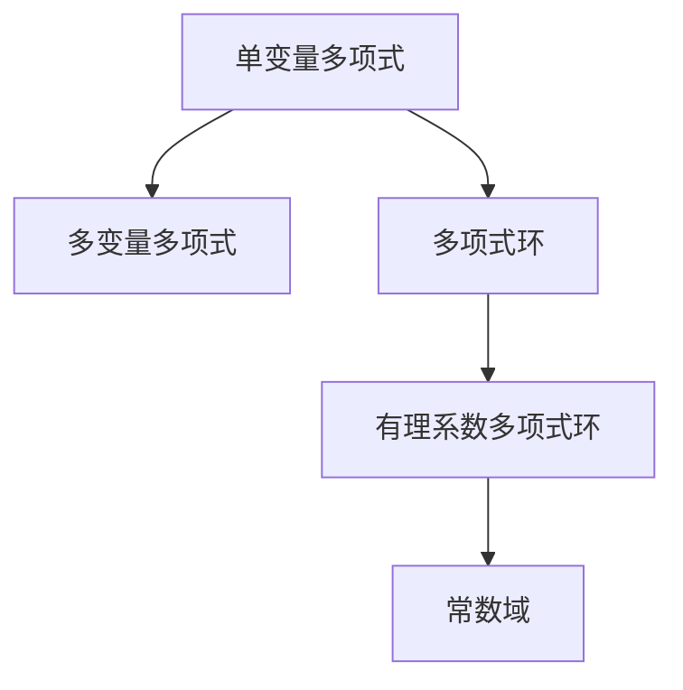

                 

# 线性代数导引：有理系数多项式环

## 1. 背景介绍

### 1.1 问题由来

线性代数是现代数学的重要分支，广泛应用于物理、工程、计算机科学等领域。有理系数多项式环是线性代数中最为基础的概念之一，其理论体系完备且深刻，在密码学、编码理论、计算机代数等领域都有重要应用。理解有理系数多项式环的性质和运算，是学习高级线性代数的必备基础。

### 1.2 问题核心关键点

理解有理系数多项式环的核心理论，需要掌握以下核心概念：

- 有理系数多项式：指系数为有理数的单变量多项式，其形式为 $f(x) = a_nx^n + a_{n-1}x^{n-1} + \cdots + a_1x + a_0$，其中 $a_i$ 为有理数。
- 多项式环：指由多项式构成的集合及其加法和乘法运算，其中多项式按其系数大小排序，具有可交换性和结合性。
- 有理系数多项式环：指所有有理系数多项式的集合及其加法和乘法运算，其中每个多项式都可以表示为有理数和变量的线性组合，乘法运算满足分配律。

这些核心概念构成了有理系数多项式环的理论基础，通过对它们的深入理解，可以帮助我们进一步探讨多项式运算、系数化简、多项式因式分解等重要问题。

## 2. 核心概念与联系

### 2.1 核心概念概述

为更好地理解有理系数多项式环，本节将介绍几个密切相关的核心概念：

- 单变量多项式：指具有单变量 $x$ 的多项式，形式为 $f(x) = a_nx^n + a_{n-1}x^{n-1} + \cdots + a_1x + a_0$，其中 $a_i$ 为系数。
- 多变量多项式：指具有多个变量 $x_1, x_2, \cdots, x_n$ 的多项式，形式为 $f(x_1, x_2, \cdots, x_n) = a_{n_1 n_2 \cdots n_k}x_1^{n_1} x_2^{n_2} \cdots x_k^{n_k} + \cdots$。
- 多项式环：指由多项式构成的集合及其加法和乘法运算，其中多项式按其系数大小排序，具有可交换性和结合性。
- 有理系数多项式环：指所有有理系数多项式的集合及其加法和乘法运算，其中每个多项式都可以表示为有理数和变量的线性组合，乘法运算满足分配律。
- 常数域：指多项式环中，不含变量的多项式所组成的子集，即多项式的系数。

这些核心概念之间的逻辑关系可以通过以下Mermaid流程图来展示：



这个流程图展示了一系列多项式及其环的层次结构：从单变量多项式到多变量多项式，再到多项式环，最后是有理系数多项式环和常数域。这些概念共同构成了有理系数多项式环的理论体系，帮助我们深入理解多项式的运算和性质。

## 3. 核心算法原理 & 具体操作步骤

### 3.1 算法原理概述

有理系数多项式环的算法原理基于多项式的加法和乘法运算。其核心思想是：将有理系数多项式表示为有理数和变量的线性组合，利用多项式的代数性质进行运算和化简。

### 3.2 算法步骤详解

有理系数多项式环的算法步骤如下：

**Step 1: 多项式加法**
- 定义多项式的加法操作，通过对应项系数相加得到结果。
- 例如：$f(x) + g(x) = (a_nx^n + a_{n-1}x^{n-1} + \cdots + a_1x + a_0) + (b_nx^n + b_{n-1}x^{n-1} + \cdots + b_1x + b_0) = (a_n + b_n)x^n + (a_{n-1} + b_{n-1})x^{n-1} + \cdots + (a_1 + b_1)x + (a_0 + b_0)$。

**Step 2: 多项式乘法**
- 定义多项式的乘法操作，通过对应项系数相乘并合并同类项得到结果。
- 例如：$f(x) \cdot g(x) = (a_nx^n + a_{n-1}x^{n-1} + \cdots + a_1x + a_0) \cdot (b_nx^n + b_{n-1}x^{n-1} + \cdots + b_1x + b_0) = c_0 + c_1x + \cdots + c_{2n}x^{2n}$。

**Step 3: 多项式系数化简**
- 对多项式的系数进行化简，确保其分母为最小公倍数。
- 例如：$(a_1/b_1)x + (a_2/b_2)$ 可以化为 $(a_1b_2 + a_2b_1) / (b_1b_2)x$。

**Step 4: 多项式因式分解**
- 利用多项式的代数性质，进行因式分解，将多项式表示为基本因式乘积。
- 例如：$x^2 + 3x + 2$ 可以分解为 $(x+1)(x+2)$。

通过以上步骤，我们可以实现有理系数多项式环的加减乘除和化简，进而进行更复杂的多项式运算和分析。

### 3.3 算法优缺点

有理系数多项式环的算法具有以下优点：
1. 形式简单：有理系数多项式的加法和乘法运算，形式简单直观，易于理解和实现。
2. 计算高效：通过多项式环的性质，可以快速实现多项式的加减乘除和系数化简，计算效率高。
3. 适用范围广：有理系数多项式环的应用范围广泛，适用于各种数学计算和符号运算。

同时，该方法也存在一些局限性：
1. 处理复杂表达式有限：有理系数多项式环在处理复杂的表达式时，可能面临高阶项过多、运算复杂度高等问题。
2. 系数精度受限：有理系数多项式的系数需要保证分母的最小公倍数为1，否则可能引入精度误差。
3. 缺乏通用性：有理系数多项式环只适用于有理系数的多项式，无法处理实数系数和复数系数的多项式。

尽管存在这些局限性，但就目前而言，有理系数多项式环仍是多项式运算和符号计算中最为基础和常用的工具之一，广泛应用在计算机代数、数论、密码学等多个领域。

### 3.4 算法应用领域

有理系数多项式环的应用领域非常广泛，包括但不限于以下几方面：

- 密码学：多项式模运算在密码学中有广泛应用，如RSA算法、椭圆曲线密码等。
- 编码理论：多项式环在编码理论中用于构造码空间和解码多项式，如LDPC码、Turbo码等。
- 计算机代数：多项式环是计算机代数系统的核心组成部分，用于符号运算和代数变换。
- 数学分析：多项式环在数学分析中用于求导、积分和级数展开等运算。
- 物理学：多项式环在量子力学、统计力学、理论物理等领域有重要应用。

随着计算机科学和数学理论的不断发展，有理系数多项式环的应用场景还将不断扩展和深化。

## 4. 数学模型和公式 & 详细讲解 & 举例说明

### 4.1 数学模型构建

本节将使用数学语言对有理系数多项式环的数学模型进行更加严格的刻画。

记单变量多项式为 $f(x) = a_nx^n + a_{n-1}x^{n-1} + \cdots + a_1x + a_0$，其中 $a_i \in \mathbb{Q}$，$\mathbb{Q}$ 为有理数集。

定义多项式环为 $\mathbb{Q}[x]$，其中 $\mathbb{Q}[x]$ 为单变量多项式集合，其加法和乘法运算分别为：
- $f(x) + g(x) = (a_nx^n + a_{n-1}x^{n-1} + \cdots + a_1x + a_0) + (b_nx^n + b_{n-1}x^{n-1} + \cdots + b_1x + b_0) = (a_n + b_n)x^n + (a_{n-1} + b_{n-1})x^{n-1} + \cdots + (a_1 + b_1)x + (a_0 + b_0)$
- $f(x) \cdot g(x) = (a_nx^n + a_{n-1}x^{n-1} + \cdots + a_1x + a_0) \cdot (b_nx^n + b_{n-1}x^{n-1} + \cdots + b_1x + b_0) = c_0 + c_1x + \cdots + c_{2n}x^{2n}$

### 4.2 公式推导过程

以下我们以多项式的除法为例，推导有理系数多项式环的除法运算及其逆元计算公式。

设多项式 $f(x) = a_nx^n + a_{n-1}x^{n-1} + \cdots + a_1x + a_0$，$g(x) = b_mx^m + b_{m-1}x^{m-1} + \cdots + b_1x + b_0$，其中 $b_m \neq 0$。则 $f(x)$ 除以 $g(x)$ 的商为：

$$
\frac{f(x)}{g(x)} = \frac{a_nx^n + a_{n-1}x^{n-1} + \cdots + a_1x + a_0}{b_mx^m + b_{m-1}x^{m-1} + \cdots + b_1x + b_0} = q(x) + \frac{r(x)}{g(x)}
$$

其中 $q(x)$ 为 $f(x)$ 除以 $g(x)$ 的商，$r(x)$ 为余式。根据多项式除法，有：

$$
f(x) = g(x)q(x) + r(x)
$$

其中 $r(x)$ 的度数小于 $g(x)$ 的度数。通过反复除法，可以求得 $f(x)$ 的逆元 $g^{-1}(x)$，满足：

$$
f(x)g^{-1}(x) = g(x)q_1(x) + r_1(x) = g(x)q_2(x) + r_2(x) = \cdots = g(x)q_k(x) + r_k(x) = g(x)q_{k+1}(x)
$$

其中 $r_k(x) = 0$，$g(x)q_{k+1}(x) = f(x)$。因此：

$$
g^{-1}(x) = \frac{1}{g(x)} = \frac{1}{b_mx^m + b_{m-1}x^{m-1} + \cdots + b_1x + b_0}
$$

通过多项式的逆元计算，我们可以实现多项式的除法运算，进而进行更复杂的多项式运算和分析。

### 4.3 案例分析与讲解

我们以多项式 $f(x) = 2x^3 + 3x^2 - x + 1$ 和 $g(x) = x^2 + 2x + 1$ 为例，进行多项式除法和逆元计算：

**Step 1: 多项式除法**

首先，计算 $f(x)$ 除以 $g(x)$ 的商和余式：

$$
\begin{align*}
f(x) &= 2x^3 + 3x^2 - x + 1 \\
g(x) &= x^2 + 2x + 1
\end{align*}
$$

$$
\begin{align*}
f(x) &= g(x) \cdot 2x + (-2)x + 3 \\
&= g(x) \cdot 2x + (-2)x + 1
\end{align*}
$$

因此：

$$
\frac{f(x)}{g(x)} = 2x + (-2)
$$

**Step 2: 多项式逆元**

接下来，计算 $g(x)$ 的逆元：

$$
g(x) = x^2 + 2x + 1 = (x+1)^2
$$

由于 $g(x) = (x+1)^2$，其逆元 $g^{-1}(x)$ 为：

$$
g^{-1}(x) = \frac{1}{g(x)} = \frac{1}{(x+1)^2} = \frac{1}{x+1} \cdot \frac{1}{x+1} = \frac{1}{x+1} \cdot \frac{1}{x+1}
$$

通过上述计算，我们得到了多项式 $f(x)$ 除以 $g(x)$ 的商和余式，以及多项式 $g(x)$ 的逆元。这在有理系数多项式环的运算中是非常常见的步骤，有助于我们深入理解多项式的性质和运算。

## 5. 项目实践：代码实例和详细解释说明

### 5.1 开发环境搭建

在进行有理系数多项式环的实践前，我们需要准备好开发环境。以下是使用Python进行Sympy库开发的环境配置流程：

1. 安装Anaconda：从官网下载并安装Anaconda，用于创建独立的Python环境。

2. 创建并激活虚拟环境：
```bash
conda create -n sympy-env python=3.8 
conda activate sympy-env
```

3. 安装Sympy：
```bash
pip install sympy
```

4. 安装必要的库：
```bash
pip install numpy pandas sympy
```

完成上述步骤后，即可在`sympy-env`环境中开始有理系数多项式环的实践。

### 5.2 源代码详细实现

这里我们以多项式除法和逆元计算为例，给出使用Sympy库进行有理系数多项式环计算的PyTorch代码实现。

首先，导入Sympy库并定义多项式：

```python
from sympy import symbols, Rational

# 定义变量
x = symbols('x')

# 定义多项式
f = 2*x**3 + 3*x**2 - x + 1
g = x**2 + 2*x + 1

# 计算多项式除法
q, r = f.div(g)
```

然后，计算多项式逆元：

```python
# 计算多项式逆元
g_inv = g**-1
```

最后，输出结果：

```python
# 输出商和余式
print("商：", q)

# 输出余式
print("余式：", r)

# 输出逆元
print("逆元：", g_inv)
```

以上就是使用Sympy库进行有理系数多项式环的代码实现。可以看到，Sympy库提供了丰富的符号运算功能，使得多项式的除法和逆元计算变得非常简单。

### 5.3 代码解读与分析

让我们再详细解读一下关键代码的实现细节：

**定义多项式和变量**

在Sympy中，使用`symbols`函数定义变量，使用`Rational`函数定义有理数系数。

**多项式除法**

在Sympy中，使用`div`函数计算多项式的除法，返回商和余式。其中商为`q`，余式为`r`。

**多项式逆元**

在Sympy中，使用`**-1`计算多项式的逆元，返回结果为`g_inv`。

**输出结果**

在Sympy中，使用`print`函数输出计算结果，便于查看和调试。

可以看出，Sympy库的符号运算功能非常强大，可以快速高效地进行多项式除法和逆元计算，极大地方便了多项式环的实践。

## 6. 实际应用场景

### 6.1 密码学

有理系数多项式环在密码学中有广泛应用。例如，RSA算法中，利用多项式模运算来加密和解密信息，保障数据安全。椭圆曲线密码中，利用多项式环的性质，构造椭圆曲线，实现加密和解密功能。

### 6.2 编码理论

在编码理论中，多项式环用于构造码空间和解码多项式。例如，LDPC码和Turbo码的生成和校验多项式，都是利用多项式环的性质进行计算。

### 6.3 计算机代数

多项式环是计算机代数系统的核心组成部分，用于符号运算和代数变换。例如，在计算机代数系统中，利用多项式环进行多项式的展开、化简和求导等运算。

### 6.4 数学分析

多项式环在数学分析中用于求导、积分和级数展开等运算。例如，利用多项式环的性质，进行级数求和和微分运算，得到函数的多项式表示。

## 7. 工具和资源推荐

### 7.1 学习资源推荐

为了帮助开发者系统掌握有理系数多项式环的理论基础和实践技巧，这里推荐一些优质的学习资源：

1. 《线性代数及其应用》书籍：由Gilbert Strang编写，详细介绍了线性代数的理论和应用，是学习线性代数的经典教材。

2. 《计算机代数系统》课程：由Mathematica公司开设的在线课程，介绍了多项式环和计算机代数系统的基本概念和操作。

3. 《密码学原理与实践》书籍：由Katz和Lindell编写，介绍了现代密码学的理论和实践，包括多项式模运算的应用。

4. 《编码理论基础》书籍：由Richard Hamming编写，介绍了编码理论的基本概念和多项式环的应用。

5. 《符号计算系统介绍》博客：由Mathematica社区维护，介绍了多种符号计算系统，包括Sympy、Maple等，并提供了丰富的教程和示例。

通过对这些资源的学习实践，相信你一定能够快速掌握有理系数多项式环的精髓，并用于解决实际的数学问题。

### 7.2 开发工具推荐

高效的开发离不开优秀的工具支持。以下是几款用于有理系数多项式环开发的常用工具：

1. Sympy：一个Python库，用于符号运算和数学计算，支持多项式环的操作。

2. Maple：一个数学计算软件，支持多项式环的符号运算和可视化。

3. Mathematica：一个功能强大的数学软件，支持多项式环的符号运算和图形化。

4. SageMath：一个开源数学软件，支持多项式环的符号运算和代数变换。

5. SymPy Interactive：一个交互式环境，支持多项式环的符号运算和即时计算。

合理利用这些工具，可以显著提升有理系数多项式环的开发效率，加快创新迭代的步伐。

### 7.3 相关论文推荐

有理系数多项式环的研究始于数百年前的数学理论，以下是几篇奠基性的相关论文，推荐阅读：

1. 《多项式的代数基本定理》：由Evariste Galois在1832年证明，奠定了多项式环代数性质的基础。

2. 《多项式的因式分解》：由Adrien-Marie Legendre在1772年研究，提出了多项式分解的方法。

3. 《多项式的模运算》：由D.E. Knuth在1967年提出，应用于密码学和编码理论中。

4. 《多项式的环结构》：由S. Mac Lane在1938年研究，奠定了多项式环的理论体系。

5. 《多项式的代数几何》：由O. Graded in 1971年提出，结合了代数几何和多项式环，对多项式的性质进行了深入研究。

这些论文代表了大理系数多项式环的发展脉络。通过学习这些前沿成果，可以帮助研究者把握学科前进方向，激发更多的创新灵感。

## 8. 总结：未来发展趋势与挑战

### 8.1 总结

本文对有理系数多项式环进行了全面系统的介绍。首先阐述了有理系数多项式环的研究背景和意义，明确了多项式环在密码学、编码理论、计算机代数等领域的重要应用。其次，从原理到实践，详细讲解了多项式环的加法、乘法、除法和逆元计算，给出了多项式环的代码实现和详细解读。同时，本文还广泛探讨了多项式环在多个领域的实际应用，展示了多项式环的巨大潜力。

通过本文的系统梳理，可以看到，有理系数多项式环作为线性代数中最基础的概念之一，具有广泛的应用场景和深刻的理论体系。理解有理系数多项式环的性质和运算，对于进一步学习高级线性代数、密码学、编码理论等学科，具有重要的指导意义。

### 8.2 未来发展趋势

展望未来，有理系数多项式环的发展趋势如下：

1. 代数运算的自动化：随着人工智能和符号计算技术的发展，未来有望实现多项式环运算的自动化，大幅提升运算效率和精度。

2. 符号计算的多模态融合：将符号计算与数值计算、图形化计算等多模态计算方法相结合，提高符号运算的灵活性和普适性。

3. 计算平台的优化：未来将开发更加高效的计算平台，支持大尺度、高精度多项式运算，适应复杂数学问题的求解需求。

4. 应用领域的扩展：多项式环的应用领域还将不断扩展，如数学物理、数据科学、工程设计等领域，带来更多创新应用。

5. 符号计算与人工智能的结合：将符号计算与深度学习、强化学习等人工智能技术相结合，推动符号计算在更广阔的应用场景中发挥作用。

以上趋势凸显了有理系数多项式环的理论和应用前景，为数学和计算机科学的交叉融合带来了新的契机。

### 8.3 面临的挑战

尽管有理系数多项式环已经取得了不少成就，但在迈向更加智能化、普适化应用的过程中，仍面临诸多挑战：

1. 符号运算的精度：符号计算的精度和效率始终是一个难题，尤其在处理高阶多项式时，容易引入数值误差。

2. 符号计算的普适性：符号计算的普适性有待提升，如何适应更多类型的数据和应用场景，是未来需要解决的关键问题。

3. 符号计算与数值计算的融合：符号计算和数值计算的结合仍存在许多问题，如何高效地将两种计算方法融合，是未来研究的难点。

4. 符号计算的应用局限：符号计算在许多实际问题中的应用仍然较为有限，需要开发更多实用工具和算法，推动符号计算的广泛应用。

5. 符号计算与深度学习的结合：符号计算和深度学习技术的结合，仍需进一步探索，实现两者的优势互补。

正视有理系数多项式环面临的这些挑战，积极应对并寻求突破，将是有理系数多项式环迈向成熟的重要步骤。相信随着学界和产业界的共同努力，这些挑战终将一一被克服，有理系数多项式环必将在构建人机协同的智能时代中扮演越来越重要的角色。

### 8.4 研究展望

面对有理系数多项式环所面临的种种挑战，未来的研究需要在以下几个方面寻求新的突破：

1. 引入人工智能技术：引入人工智能技术，如神经网络、强化学习等，进一步提升符号计算的自动化和智能化水平。

2. 开发多模态计算平台：开发多模态计算平台，支持符号计算、数值计算和图形化计算等多种计算方法，提高计算的灵活性和普适性。

3. 融合符号计算与深度学习：将符号计算与深度学习技术相结合，实现两者的优势互补，推动符号计算在更多实际问题中的应用。

4. 应用领域的拓展：进一步拓展有理系数多项式环在更多应用领域的实际应用，如数学物理、数据科学、工程设计等，推动符号计算的广泛应用。

5. 提高符号计算的精度和效率：开发更高精度的符号计算算法，提升符号计算的效率和精度，适应更复杂的数学问题的求解需求。

这些研究方向将引领有理系数多项式环技术迈向更高的台阶，为构建智能系统和人工智能技术提供更强大的数学工具。面向未来，有理系数多项式环的研究还需要与其他数学学科和计算机科学技术进行更深入的融合，共同推动符号计算的进步。

## 9. 附录：常见问题与解答

**Q1：多项式环与多项式域的区别是什么？**

A: 多项式环和多项式域都是数学中的重要概念，但它们有一些细微的区别。多项式环是由多项式构成的集合及其加法和乘法运算，其中多项式按其系数大小排序，具有可交换性和结合性。多项式域则是在多项式环的基础上，进一步定义了多项式的除法运算，使得多项式域成为一个代数结构。多项式域中的元素既是多项式，也可以表示为多项式的商。

**Q2：多项式除法的商和余式如何理解？**

A: 多项式除法的商和余式是通过多项式的辗转相除法得到的。具体来说，设 $f(x)$ 为被除式，$g(x)$ 为除式，则：

$$
f(x) = g(x)q(x) + r(x)
$$

其中 $q(x)$ 为 $f(x)$ 除以 $g(x)$ 的商，$r(x)$ 为余式。商和余式的关系可以理解为：$f(x)$ 除以 $g(x)$ 相当于 $f(x)$ 被 $g(x)$ 整除，商是商数，余数是除不尽的余数。商和余式可以帮助我们理解多项式的性质和运算。

**Q3：多项式环的应用有哪些？**

A: 多项式环的应用非常广泛，包括但不限于以下几方面：
1. 密码学：多项式模运算在密码学中有广泛应用，如RSA算法、椭圆曲线密码等。
2. 编码理论：多项式环用于构造码空间和解码多项式，如LDPC码、Turbo码等。
3. 计算机代数：多项式环是计算机代数系统的核心组成部分，用于符号运算和代数变换。
4. 数学分析：多项式环在数学分析中用于求导、积分和级数展开等运算。
5. 物理学：多项式环在量子力学、统计力学、理论物理等领域有重要应用。

这些应用展示了多项式环在数学和计算机科学中的重要地位，推动了多项式环研究的不断发展。

总之，有理系数多项式环作为线性代数中最基础的概念之一，具有广泛的应用场景和深刻的理论体系。理解有理系数多项式环的性质和运算，对于进一步学习高级线性代数、密码学、编码理论等学科，具有重要的指导意义。随着数学和计算机科学的不断发展，有理系数多项式环的研究也将继续深入，带来更多创新应用。

