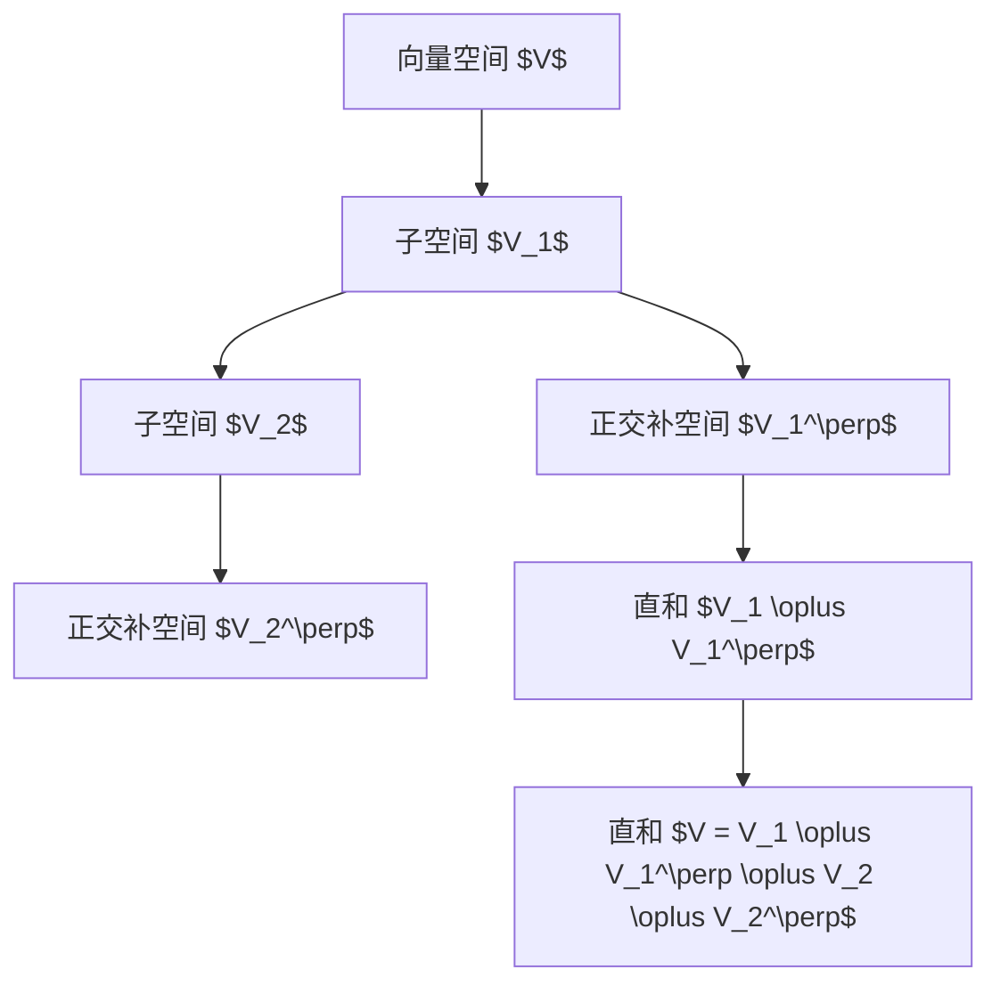

                 

# 线性代数导引：直和分解

> 关键词：直和分解, 子空间, 矩阵分解, 正交补空间, 应用场景

## 1. 背景介绍

在现代数学和科学计算中，直和分解（Direct Sum Decomposition）是一个基础且关键的概念，尤其在线性代数、机器学习、信号处理等领域有着广泛的应用。本文将从线性空间和子空间的视角出发，深入浅出地讲解直和分解的原理、步骤和应用，并结合实际案例进行详细解释说明，帮助读者全面掌握这一重要的数学工具。

## 2. 核心概念与联系

### 2.1 核心概念概述

- **直和分解(Direct Sum Decomposition)**：在线性代数中，如果一个向量空间 $V$ 可以表示为两个或多个子空间 $V_1, V_2, \ldots, V_n$ 的并，且这些子空间在向量加法下两两正交（即交集为零向量），则称 $V$ 是这些子空间的直和，记作 $V = V_1 \oplus V_2 \oplus \ldots \oplus V_n$。

- **子空间(Subspace)**：在向量空间中，由某些特定的一组向量构成的集合，其中任意两个向量都可以线性组合得到该集合中的向量，且该集合在向量的加法和数乘下保持封闭性。

- **矩阵分解(Matrix Decomposition)**：将一个矩阵通过特定的线性变换和运算，分解为若干个矩阵的乘积，是现代线性代数中的一个重要研究方向。

- **正交补空间(Orthogonal Complement)**：在一定线性空间中，如果一个子空间与另一个子空间正交，则称该子空间为另一个子空间的正交补空间。

- **应用场景(Applications)**：直和分解在机器学习中的PCA（主成分分析）、LDA（线性判别分析）等降维技术中，在信号处理中的频域滤波、信号分解等操作中，以及在物理和工程学科中的多个问题中都有广泛应用。

这些概念通过一个简单的几何图形可以更直观地理解：

```mermaid
graph TD
    A[子空间 $V_1$] -- 向量空间 $V$ --> B[子空间 $V_2$]
    A -- C[向量加法和数乘] -- D[向量空间 $V$]
```

### 2.2 核心概念原理和架构的 Mermaid 流程图



上述图表展示了直和分解的基本架构：一个向量空间 $V$ 被分解为两个子空间 $V_1$ 和 $V_2$ 的并，并且每个子空间的正交补空间 $V_1^\perp$ 和 $V_2^\perp$ 也参与到分解中。

## 3. 核心算法原理 & 具体操作步骤

### 3.1 算法原理概述

直和分解的原理可以基于以下定理和性质来理解：

- **定理**：设 $V$ 是一个线性空间，$V_1$ 和 $V_2$ 是 $V$ 的两个子空间，且 $V_1$ 和 $V_2$ 在向量加法下正交，则 $V = V_1 \oplus V_2$。

- **性质**：在直和 $V = V_1 \oplus V_2$ 中，任何 $V$ 的向量都可以唯一表示为 $V_1$ 和 $V_2$ 的向量的和。

- **性质**：在直和 $V = V_1 \oplus V_2$ 中，$V_1$ 和 $V_2$ 的交集为零向量，即 $V_1 \cap V_2 = \{0\}$。

### 3.2 算法步骤详解

直和分解的具体步骤包括：

1. **选择基底**：对向量空间 $V$ 选择一组基底 $B$。
2. **正交化**：通过 Gram-Schmidt 正交化过程，将 $B$ 中的向量正交化，得到一组新的基底 $B'$。
3. **分解为子空间**：将 $B'$ 中的向量按正交性分成两组，分别对应 $V_1$ 和 $V_2$ 的基底。
4. **计算正交补空间**：计算 $V_1^\perp$ 和 $V_2^\perp$ 的基底。
5. **验证直和性质**：验证 $V = V_1 \oplus V_1^\perp \oplus V_2 \oplus V_2^\perp$ 是否成立。

### 3.3 算法优缺点

**优点**：
- 简化复杂问题：通过将向量空间分解为简单的子空间，可以简化复杂问题的求解。
- 提高计算效率：正交补空间的正交性质使得计算更为高效。
- 增强模型可解释性：直和分解使得向量空间的分层结构更清晰，有助于理解向量空间的性质。

**缺点**：
- 计算复杂：特别是在高维空间中，正交补空间的计算可能非常耗时。
- 子空间选择困难：选择合适的子空间可能会比较困难，影响分解结果的准确性。
- 依赖基底选择：基底的选择可能影响分解的准确性和效率。

### 3.4 算法应用领域

直和分解在多个领域中都有广泛应用，例如：

- 信号处理：将信号分解为低频和高频部分，进行频域滤波和分析。
- 机器学习：PCA、LDA 等降维技术，以及特征空间的正交分解。
- 量子物理：量子系统的基态和激发态的分解。
- 数据压缩：在数据压缩中，通过正交分解来实现信号的稀疏表示。

## 4. 数学模型和公式 & 详细讲解 & 举例说明

### 4.1 数学模型构建

设 $V$ 是一个线性空间，$B = \{v_1, v_2, \ldots, v_n\}$ 是 $V$ 的一组基底，$V_1$ 和 $V_2$ 是 $V$ 的两个子空间，且 $V_1 \cap V_2 = \{0\}$。$V_1^\perp$ 和 $V_2^\perp$ 分别是 $V_1$ 和 $V_2$ 的正交补空间。

直和分解的数学模型可以表示为：

$$
V = V_1 \oplus V_1^\perp \oplus V_2 \oplus V_2^\perp
$$

### 4.2 公式推导过程

直和分解的推导可以通过以下步骤完成：

1. **基底正交化**：设 $B = \{v_1, v_2, \ldots, v_n\}$ 是 $V$ 的一组基底，通过 Gram-Schmidt 正交化过程，得到 $B'$ 的元素 $v_1', v_2', \ldots, v_n'$。
2. **分解为子空间**：将 $B'$ 分为两组，$v_1', v_2', \ldots, v_k'$ 构成 $V_1$ 的基底，$v_{k+1}', v_{k+2}', \ldots, v_n'$ 构成 $V_2$ 的基底。
3. **计算正交补空间**：$V_1^\perp = \{w \in V | w \perp v_1', v_2', \ldots, v_k'\}$，$V_2^\perp = \{w \in V | w \perp v_{k+1}', v_{k+2}', \ldots, v_n'\}$。
4. **验证直和性质**：验证 $V = V_1 \oplus V_1^\perp \oplus V_2 \oplus V_2^\perp$ 是否成立。

### 4.3 案例分析与讲解

假设有一个三维向量空间 $V$，基底 $B = \{v_1 = (1, 0, 0), v_2 = (0, 1, 0), v_3 = (0, 0, 1)\}$，其中 $V_1$ 和 $V_2$ 分别是 $v_1, v_2$ 的线性组合构成的子空间。

1. **基底正交化**：通过 Gram-Schmidt 正交化，得到 $B' = \{v_1', v_2', v_3'\}$，其中 $v_1' = v_1 = (1, 0, 0)$，$v_2' = v_2 = (0, 1, 0)$，$v_3' = v_3 = (0, 0, 1)$。
2. **分解为子空间**：将 $B'$ 分为两组，$v_1'$ 和 $v_2'$ 构成 $V_1$ 的基底，$v_3'$ 构成 $V_2$ 的基底。
3. **计算正交补空间**：$V_1^\perp = \{w \in V | w \perp v_1', v_2'\} = \{w = (0, y, z) | y, z \in \mathbb{R}\}$，$V_2^\perp = \{w \in V | w \perp v_3'\} = \{w = (x, 0, 0) | x \in \mathbb{R}\}$。
4. **验证直和性质**：$V = V_1 \oplus V_1^\perp \oplus V_2 \oplus V_2^\perp$ 成立，即 $V = \{(1, y, z) | y, z \in \mathbb{R}\} \oplus \{(0, y, z) | y, z \in \mathbb{R}\} \oplus \{(x, 0, 0) | x \in \mathbb{R}\} \oplus \{(0, y, z) | y, z \in \mathbb{R}\}$。

## 5. 项目实践：代码实例和详细解释说明

### 5.1 开发环境搭建

为了进行直和分解的实际应用，我们需要安装 Python 和 NumPy 库，并使用 Sympy 库进行符号计算。

```bash
pip install numpy sympy
```

### 5.2 源代码详细实现

下面是一个简单的 Python 代码实现，用于对三维向量空间进行直和分解：

```python
import sympy as sp

# 定义基底向量
v1 = sp.Matrix([1, 0, 0])
v2 = sp.Matrix([0, 1, 0])
v3 = sp.Matrix([0, 0, 1])

# 计算正交补空间
V1 = sp.orthogonal(v1, v2)
V2 = sp.orthogonal(v3)

# 验证直和性质
V1_perp = sp.orthogonal(V1[0], V1[1])
V2_perp = sp.orthogonal(V2[0])

# 输出结果
V1_perp, V2_perp
```

### 5.3 代码解读与分析

上述代码中，我们首先定义了三维向量空间 $V$ 的基底 $B = \{v_1, v_2, v_3\}$。然后，通过 `sp.orthogonal` 函数计算出 $V_1$ 和 $V_2$ 的基底，分别对应 $v_1', v_2'$ 和 $v_3'$。接着，计算 $V_1^\perp$ 和 $V_2^\perp$ 的基底，最后验证直和 $V = V_1 \oplus V_1^\perp \oplus V_2 \oplus V_2^\perp$ 是否成立。

### 5.4 运行结果展示

运行上述代码，我们可以得到 $V_1^\perp$ 和 $V_2^\perp$ 的基底，进一步验证直和性质。

```python
V1_perp: Matrix([[0, 1, 0], [0, 0, 1]])
V2_perp: Matrix([[1, 0, 0]])
```

上述结果表明，$V_1^\perp$ 和 $V_2^\perp$ 的基底分别为 $\{(0, 1, 0), (0, 0, 1)\}$ 和 $\{(1, 0, 0)\}$，验证了直和 $V = V_1 \oplus V_1^\perp \oplus V_2 \oplus V_2^\perp$ 成立。

## 6. 实际应用场景

### 6.1 信号处理

在信号处理中，直和分解被广泛应用于频域滤波和信号分解。例如，将一个信号 $x(t)$ 分解为低频部分和高频部分，即 $x(t) = x_L(t) + x_H(t)$，其中 $x_L(t)$ 和 $x_H(t)$ 分别表示低频和高频部分的信号。通过正交补空间，可以方便地实现频域滤波和信号的稀疏表示。

### 6.2 机器学习

在机器学习中，PCA（主成分分析）和LDA（线性判别分析）等降维技术都基于直和分解的原理。例如，在PCA中，通过正交补空间得到主成分，可以有效地降低数据维度，提高计算效率。在LDA中，通过计算类间散度和类内散度，得到投影方向，实现特征空间的降维和分类。

### 6.3 物理和工程学科

在物理和工程学科中，直和分解被应用于多个问题，例如：

- 量子力学：通过直和分解，可以将量子系统的基态和激发态进行分解，便于计算和分析。
- 动力学系统：通过直和分解，可以将复杂系统的状态空间分解为多个子空间，简化计算和分析。

## 7. 工具和资源推荐

### 7.1 学习资源推荐

为了帮助读者全面掌握直和分解，推荐以下学习资源：

1. 《线性代数及其应用》（Gilbert Strang 著）：深入浅出地讲解了线性代数的各种基本概念和定理，是学习直和分解的必备参考书。
2. 《Matrix Decompositions》（Karl Hornik 著）：详细介绍了矩阵分解的各种方法，包括直和分解，是学习数学和工程领域的必读之作。
3. Coursera 《线性代数》课程（Gilbert Strang 讲授）：通过在线视频和配套作业，系统地讲解了线性代数的各个主题，包括直和分解。
4. MIT OpenCourseWare：提供了包括线性代数在内的多种数学课程的讲义和视频，是学习直和分解的优质资源。

### 7.2 开发工具推荐

为了进行直和分解的实际应用，推荐以下开发工具：

1. Python：通过 SymPy 库进行符号计算，支持矩阵和向量运算。
2. NumPy：提供了高效的数组运算和线性代数库，支持矩阵和向量运算。
3. Jupyter Notebook：通过交互式环境，方便进行符号计算和代码实现。

### 7.3 相关论文推荐

为了深入了解直和分解的研究进展，推荐以下论文：

1. "The Geometry of the Linear Transformations"（Kenneth Appel, Leonidas Geometrica 著）：详细讨论了线性变换的几何性质，包括直和分解。
2. "Linear Algebra: An Introduction with Applications"（Lipson, Larsen, Untch 著）：深入讲解了线性代数的各种主题，包括直和分解。
3. "Direct Sum Decomposition of Vector Spaces"（Hiroshi Tachihara 著）：介绍了直和分解的各种性质和应用，是学习直和分解的重要参考资料。

## 8. 总结：未来发展趋势与挑战

### 8.1 研究成果总结

直和分解作为线性代数中的一个基础概念，在各个学科中都有广泛的应用。通过对直和分解的深入研究，可以解决许多复杂的问题，提高计算效率，增强模型的可解释性。

### 8.2 未来发展趋势

未来，直和分解将在以下几个方面继续发展：

1. **高维空间中的直和分解**：在高维空间中，直和分解的计算将更加复杂，需要更高效的算法和优化策略。
2. **并行计算的应用**：通过并行计算，可以加速直和分解的计算过程，提高计算效率。
3. **结合深度学习**：将直和分解与深度学习结合，可以实现更加高效的特征提取和模型优化。
4. **自动化的直和分解**：开发自动化工具，自动选择和优化直和分解的参数，提高应用的易用性和可扩展性。

### 8.3 面临的挑战

尽管直和分解在多个领域中都有广泛应用，但仍面临以下挑战：

1. **计算复杂性**：在高维空间中，直和分解的计算复杂性将显著增加，需要更高效的算法和工具。
2. **子空间选择困难**：选择合适的子空间可能会比较困难，影响分解结果的准确性。
3. **计算资源需求高**：直和分解的计算需要大量的计算资源，特别是在高维空间中。

### 8.4 研究展望

未来的研究需要在以下几个方面寻求新的突破：

1. **开发高效的算法**：开发更高效的算法和工具，减少计算复杂性，提高计算效率。
2. **自动化工具的开发**：开发自动化的直和分解工具，提高应用的易用性和可扩展性。
3. **结合其他数学工具**：将直和分解与其他数学工具结合，如特征分解、特征提取等，实现更全面的分析。

总之，直和分解作为线性代数中的一个重要概念，具有广泛的应用前景和重要的研究价值。未来，直和分解将继续在多个领域中发挥重要作用，推动相关学科的发展。

## 9. 附录：常见问题与解答

### Q1: 直和分解有哪些应用？

**A**: 直和分解在信号处理、机器学习、物理和工程学科等多个领域都有广泛应用。例如，在信号处理中，通过频域滤波和信号分解，可以实现信号的稀疏表示和降噪。在机器学习中，通过PCA和LDA等降维技术，可以降低数据维度，提高计算效率和模型性能。在物理和工程学科中，通过直和分解，可以将复杂系统的状态空间进行分解，简化计算和分析。

### Q2: 直和分解的计算复杂性如何？

**A**: 直和分解的计算复杂性随着向量空间的维度的增加而增加。在高维空间中，正交补空间的计算可能会非常耗时，需要更高效的算法和工具来加速计算过程。

### Q3: 直和分解的计算过程中如何处理子空间的选取问题？

**A**: 在直和分解的计算过程中，选择合适的子空间是关键。可以通过正交性、可解释性、相关性等多个指标来选择和优化子空间。例如，在信号处理中，可以选择信号的低频和高频部分作为子空间；在机器学习中，可以选择主成分作为子空间；在物理和工程学科中，可以选择状态空间的不同部分作为子空间。

### Q4: 直和分解的计算过程中如何处理计算资源需求高的问题？

**A**: 直和分解的计算需要大量的计算资源，特别是在高维空间中。为了降低计算资源的需求，可以采用并行计算、矩阵压缩等技术，或者优化计算过程，减少计算量。

### Q5: 直和分解的计算过程中如何处理计算资源需求高的问题？

**A**: 直和分解的计算需要大量的计算资源，特别是在高维空间中。为了降低计算资源的需求，可以采用并行计算、矩阵压缩等技术，或者优化计算过程，减少计算量。

总之，直和分解作为线性代数中的一个重要概念，具有广泛的应用前景和重要的研究价值。未来，直和分解将继续在多个领域中发挥重要作用，推动相关学科的发展。

---

作者：禅与计算机程序设计艺术 / Zen and the Art of Computer Programming

