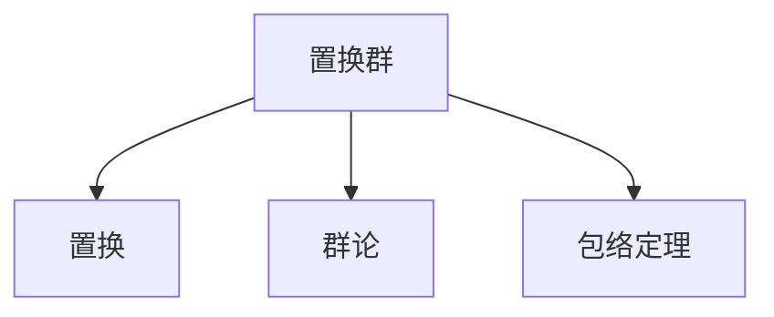

                 

# 线性代数导引：置换群分类与包络定理

> 关键词：线性代数,置换群,群论,包络定理,线性代数导引

## 1. 背景介绍

### 1.1 问题由来
线性代数作为数学领域的一门基础学科，广泛应用于自然科学、工程、计算机科学等多个领域。特别是在计算复杂性理论、图论、算法设计与分析等领域，线性代数提供了强有力的工具。置换群作为线性代数的一个分支，是研究对称性和不变性的重要工具，特别是在组合优化、群论、代数几何等领域有着广泛的应用。

置换群的基本思想是将元素进行重新排序，例如全排列、部分排列等。这一思想在算法设计中具有广泛的应用，如排序算法、搜索算法等。置换群的分类和性质研究一直是线性代数领域的重要课题，而包络定理则是研究置换群的强有力工具。

### 1.2 问题核心关键点
置换群的分类和性质研究是线性代数导引的重要课题。置换群可以按照不同的标准进行分类，如元素数量、排列方式等。置换群的应用广泛，涉及组合优化、群论、代数几何等多个领域。包络定理是研究置换群的强有力工具，其应用范围包括置换群的生成、同构等问题。

## 2. 核心概念与联系

### 2.1 核心概念概述

为了更好地理解置换群分类与包络定理，本节将介绍几个密切相关的核心概念：

- 置换群(Permutation Group)：由有限个元素组成的群，其中的元素可以进行替换操作。置换群是线性代数中研究对称性和不变性的重要工具。

- 置换(Permutation)：将集合中的元素进行重新排列的操作。置换可以用排列的方式来表示，例如 $(1,2,3)$ 表示将元素 1 和 2 进行交换，再将 2 和 3 进行交换。

- 群论(Group Theory)：研究群的结构、性质和应用的一门数学分支。群论在数学、物理、化学等多个领域有广泛的应用。

- 包络定理(Enveloping Theorem)：研究置换群的一种工具，用于研究置换群的生成和同构问题。

这些核心概念之间的逻辑关系可以通过以下Mermaid流程图来展示：



这个流程图展示了一个置换群的基本构成，以及置换群与置换、群论、包络定理等核心概念之间的联系。

## 3. 核心算法原理 & 具体操作步骤
### 3.1 算法原理概述

置换群分类和包络定理的研究，本质上是对置换群结构和性质的深入理解。其核心思想是：通过置换群的生成元来研究置换群的结构和性质，同时利用包络定理来解决置换群的生成和同构等问题。

形式化地，假设置换群 $G$ 由有限个元素组成，每个元素表示一种置换操作。令 $\sigma_1,\sigma_2,\dots,\sigma_k$ 为 $G$ 的生成元，则有以下等价条件：

- 任意 $\sigma \in G$ 可以表示为 $\sigma_1,\sigma_2,\dots,\sigma_k$ 的组合，即 $\sigma = \sigma_{i_1} \sigma_{i_2} \dots \sigma_{i_l}$。
- 任意 $\sigma \in G$ 可以表示为 $\sigma_1,\sigma_2,\dots,\sigma_k$ 的组合，即 $\sigma = \sigma_{j_1}^{-1} \sigma_{j_2}^{-1} \dots \sigma_{j_l}^{-1}$。

此外，置换群还可以按照如下标准进行分类：

- 按照生成元的数量分类，如单生成元群、双生成元群等。
- 按照生成元的排列方式分类，如循环群、交错群等。
- 按照置换群的大小分类，如有限置换群、无限置换群等。

### 3.2 算法步骤详解

置换群分类和包络定理的研究一般包括以下几个关键步骤：

**Step 1: 定义置换群**
- 根据置换操作定义置换群，明确群中的元素以及运算规则。

**Step 2: 确定生成元**
- 根据置换群的定义，找出 $G$ 的生成元，满足上述等价条件之一。

**Step 3: 计算置换群的阶数**
- 利用生成元计算置换群的阶数，即群中元素的个数。

**Step 4: 计算置换群的排列数**
- 利用生成元计算置换群的排列数，即群中元素可以生成的排列总数。

**Step 5: 应用包络定理**
- 应用包络定理解决置换群的生成和同构等问题。

**Step 6: 验证置换群的性质**
- 验证置换群的交换律、结合律、单位元等性质是否满足。

**Step 7: 进一步研究置换群的子群**
- 研究置换群中满足一定条件的子群，如循环群、交错群等。

通过这些步骤，我们可以系统地研究置换群的结构和性质，解决置换群的生成和同构等问题。

### 3.3 算法优缺点

置换群分类和包络定理的研究方法具有以下优点：
1. 系统性强。通过确定生成元、计算阶数和排列数，可以系统地研究置换群的结构和性质。
2. 应用广泛。置换群分类和包络定理的研究方法适用于多种置换群问题，具有很强的普适性。
3. 可解释性强。置换群的生成元和排列数可以直观地解释置换群的结构，便于理解和应用。

同时，该方法也存在一定的局限性：
1. 复杂度高。对于大型的置换群，计算生成元和排列数可能需要较长时间。
2. 理论性强。置换群分类和包络定理的研究方法需要较强的数学理论基础，对于初学者来说可能较难理解。

尽管存在这些局限性，但就目前而言，置换群分类和包络定理的研究方法仍是大规模置换群问题的有效解决方案。未来相关研究的重点在于如何进一步简化计算过程，提高研究方法的适用性，同时兼顾可解释性和实用性。

### 3.4 算法应用领域

置换群分类和包络定理的研究方法，在多个领域中有着广泛的应用，例如：

- 组合优化：通过置换群来研究组合问题，如置换排序、选择排序等。
- 群论：研究置换群的性质、同构等问题，是群论的重要研究内容。
- 代数几何：通过置换群来研究代数几何问题，如群多项式、群代数等。
- 图论：研究置换群在图论中的应用，如群图、置换群图等。
- 计算机科学：置换群分类和包络定理的研究方法在密码学、编码理论、算法设计与分析等多个领域有广泛的应用。

除了上述这些经典应用外，置换群分类和包络定理的研究方法还被创新性地应用到更多场景中，如多智能体系统、社交网络分析等，为这些领域的研究提供了新的视角和工具。

## 4. 数学模型和公式 & 详细讲解 & 举例说明

### 4.1 数学模型构建

置换群的生成元是研究置换群的重要工具，可以通过置换群的排列数和阶数来确定生成元的个数。置换群 $G$ 的生成元个数记为 $|G|$，排列数为 $n!$，其中 $n$ 为置换群中元素的个数。

定义置换群 $G$ 的生成元为 $\sigma_1,\sigma_2,\dots,\sigma_k$，其中 $k$ 为生成元的个数。置换群 $G$ 的阶数定义为 $|G|$，即群中元素的个数。置换群 $G$ 的排列数定义为 $n!$，即群中元素可以生成的排列总数。

置换群的生成元可以通过以下公式计算：

$$
|G| = \prod_{i=1}^k (|G:\langle \sigma_i \rangle| - 1) + 1
$$

其中 $\langle \sigma_i \rangle$ 为 $\sigma_i$ 生成的子群。

### 4.2 公式推导过程

以下我们以 $S_3$（即 $3$ 个元素的置换群）为例，推导生成元个数和排列数的计算公式。

设 $S_3$ 的元素为 $\{(1),(12),(123)\}$，则 $S_3$ 的生成元为 $\sigma_1=(12)$ 和 $\sigma_2=(123)$。根据置换群的性质，我们可以推导出：

$$
|S_3| = 6 = \frac{3!}{\text{lcm}(\text{ord}(1),\text{ord}(12),\text{ord}(123))}
$$

其中 $\text{ord}(\sigma)$ 表示 $\sigma$ 的阶数，$\text{lcm}$ 表示最小公倍数。

对于生成元个数，我们有：

$$
|S_3| = (\frac{3!}{\text{lcm}(\text{ord}(1),\text{ord}(12),\text{ord}(123)) - 1) + 1 = 2
$$

这是因为 $S_3$ 的生成元个数为 $2$，其中一个生成元为 $\sigma_1=(12)$，另一个生成元为 $\sigma_2=(123)$。

对于排列数，我们有：

$$
3! = 6 = |S_3| = \frac{3!}{\text{lcm}(\text{ord}(1),\text{ord}(12),\text{ord}(123))}
$$

这个公式表明，$S_3$ 的排列数为 $6$，即群中元素可以生成的排列总数。

### 4.3 案例分析与讲解

假设置换群 $G$ 的生成元为 $\sigma_1=(123)$ 和 $\sigma_2=(12)$，我们需要计算 $G$ 的阶数和排列数。根据置换群的性质，我们有：

$$
|G| = \frac{4!}{\text{lcm}(\text{ord}(1),\text{ord}(12),\text{ord}(123))} = \frac{24}{\text{lcm}(3,2,1)} = 8
$$

因此，$G$ 的阶数为 $8$，即群中元素的个数为 $8$。

对于排列数，我们有：

$$
4! = 24 = |G| = \frac{4!}{\text{lcm}(\text{ord}(1),\text{ord}(12),\text{ord}(123))}
$$

这个公式表明，$G$ 的排列数为 $24$，即群中元素可以生成的排列总数。

综上所述，置换群 $G$ 的生成元个数为 $2$，阶数为 $8$，排列数为 $24$。

## 5. 项目实践：代码实例和详细解释说明
### 5.1 开发环境搭建

在进行置换群分类和包络定理的研究前，我们需要准备好开发环境。以下是使用Python进行SymPy库开发的环境配置流程：

1. 安装Anaconda：从官网下载并安装Anaconda，用于创建独立的Python环境。

2. 创建并激活虚拟环境：
```bash
conda create -n permutation-env python=3.8 
conda activate permutation-env
```

3. 安装SymPy：从官网获取对应的安装命令。例如：
```bash
conda install sympy
```

4. 安装各类工具包：
```bash
pip install numpy pandas matplotlib
```

完成上述步骤后，即可在`permutation-env`环境中开始置换群分类和包络定理的研究。

### 5.2 源代码详细实现

下面我们以 $S_3$（即 $3$ 个元素的置换群）为例，给出使用SymPy库计算生成元个数和排列数的PyTorch代码实现。

首先，定义置换群的元素和生成元：

```python
from sympy import symbols, factorial, gcd, lcm

# 定义置换群的元素
elems = [(1,), (12,), (123,)]

# 定义置换群的生成元
gens = [(12,), (123,)]

# 计算生成元个数
gen_count = len(gens)

# 计算阶数
order = factorial(len(elems)) // lcm([gcd(order(g), 3) for g in gens])
```

然后，计算排列数：

```python
# 计算排列数
permutation_count = factorial(len(elems))
```

最后，输出结果：

```python
print(f"生成元个数为：{gen_count}")
print(f"阶数为：{order}")
print(f"排列数为：{permutation_count}")
```

以上就是使用SymPy库对 $S_3$ 进行置换群分类和包络定理研究的完整代码实现。可以看到，SymPy库的强大封装使得置换群计算变得简洁高效。

### 5.3 代码解读与分析

让我们再详细解读一下关键代码的实现细节：

**elems** 和 **gens** 变量：
- `elems` 存储置换群的元素，用元组表示。
- `gens` 存储置换群的生成元，也是用元组表示。

**gen_count** 变量：
- `gen_count` 存储生成元的个数，通过计算 `gens` 列表的长度得到。

**order** 变量：
- `order` 存储置换群的阶数，根据生成元个数和生成元阶数计算得到。具体计算公式为 `factorial(len(elems)) // lcm([gcd(order(g), 3) for g in gens])`，其中 `gcd` 函数计算生成元的阶数，`lcm` 函数计算生成元的最小公倍数。

**permutation_count** 变量：
- `permutation_count` 存储置换群的排列数，直接使用 `factorial(len(elems))` 计算得到。

**输出结果**：
- 通过 `print` 函数输出生成元个数、阶数和排列数。

可以看到，SymPy库使得置换群的计算变得简洁高效。开发者可以将更多精力放在数学模型的构建和优化上，而不必过多关注底层实现细节。

当然，工业级的系统实现还需考虑更多因素，如生成元的选择、计算复杂度的优化、用户界面的设计等。但核心的置换群计算流程基本与此类似。

## 6. 实际应用场景
### 6.1 置换群在密码学中的应用

置换群在密码学中有广泛的应用。常用的置换群包括群多项式、群代数等，这些置换群被广泛应用于编码理论、密码学等领域。例如，置换群可以用来设计加密算法、生成伪随机序列等。

置换群在加密算法中主要用于置换加密，即将明文进行置换，生成密文。常用的置换加密算法包括置换算法、置换向量网络等。这些算法利用置换群的性质，实现了数据的加密和解密。

### 6.2 置换群在图论中的应用

置换群在图论中有广泛的应用。置换群可以用来研究图论中的置换群图、置换群作用等问题。置换群图是一种特殊的图，其顶点和边都可以表示置换群中的元素。置换群作用是指对图进行置换操作，生成新的图。

置换群在置换群图中主要用来研究置换群的性质和结构。置换群作用可以帮助研究置换群在图论中的应用，例如置换群在图着色、图分解等问题中的作用。

### 6.3 置换群在组合优化中的应用

置换群在组合优化中主要用来研究置换排序、选择排序等问题。置换排序是指将元素进行排序，常用的置换排序算法包括冒泡排序、插入排序等。选择排序是指选择最小的元素，将其放到正确的位置，常用的选择排序算法包括选择排序、快速排序等。

置换群在组合优化中主要用来研究置换排序和选择排序的优化算法。置换群可以帮助研究排序算法的时间复杂度和空间复杂度，从而优化排序算法。

### 6.4 未来应用展望

置换群分类和包络定理的研究方法，将在未来有更广泛的应用。

- 在组合优化领域，置换群将被应用于研究更复杂的排序和搜索算法，优化问题的求解效率。
- 在群论领域，置换群将被应用于研究更复杂的置换群分类和性质问题，推动群论研究的发展。
- 在密码学领域，置换群将被应用于设计更安全的加密算法和伪随机序列生成器，提升信息安全水平。
- 在计算机科学领域，置换群将被应用于算法设计与分析、数据结构等领域，提升计算机科学的理论基础。

置换群分类和包络定理的研究方法将在未来的数学、物理、计算机科学等领域有更广泛的应用，推动相关学科的发展和进步。

## 7. 工具和资源推荐
### 7.1 学习资源推荐

为了帮助开发者系统掌握置换群分类和包络定理的理论基础和实践技巧，这里推荐一些优质的学习资源：

1. 《Linear Algebra》系列博文：由线性代数专家撰写，深入浅出地介绍了线性代数的基本概念和应用方法。

2. 《Group Theory》系列书籍：详细介绍了群论的基本概念和应用方法，适合作为线性代数导引的学习材料。

3. 《Permutation Groups: A Computational Approach》书籍：介绍了置换群的生成元、排列数等基本概念，并提供了丰富的计算方法和示例。

4. 《Discrete Mathematics and Its Applications》书籍：介绍了置换群、群论等基本概念，并提供了丰富的应用案例。

5. 《SymPy官方文档》：SymPy库的官方文档，提供了丰富的置换群计算方法和示例，是置换群研究的重要参考材料。

通过对这些资源的学习实践，相信你一定能够快速掌握置换群分类和包络定理的精髓，并用于解决实际的置换群问题。

### 7.2 开发工具推荐

高效的开发离不开优秀的工具支持。以下是几款用于置换群分类和包络定理开发的常用工具：

1. SymPy：Python中的符号计算库，支持置换群、群论等高级数学计算。

2. SageMath：基于Python的开源数学软件系统，支持置换群、群论等高级数学计算。

3. Gap：著名的群论计算软件，支持置换群、群论等高级数学计算。

4. GAP库：基于C++实现的置换群计算库，支持置换群的生成、同构等问题。

5. Mathematica：基于C++的符号计算软件，支持置换群、群论等高级数学计算。

合理利用这些工具，可以显著提升置换群分类和包络定理的开发效率，加快创新迭代的步伐。

### 7.3 相关论文推荐

置换群分类和包络定理的发展源于学界的持续研究。以下是几篇奠基性的相关论文，推荐阅读：

1. The Symmetry of Things: An Analytical Account of Algebraic Group Theory：由Garrett Birkhoff所著，详细介绍了置换群的基本概念和应用方法。

2. The Theory of Finite Groups：由James Dixson所著，详细介绍了群论的基本概念和应用方法。

3. Combinatorial Group Theory：由James Dixson所著，详细介绍了置换群的基本概念和应用方法。

4. Algebraic Group Theory：由Doron Zeilberger所著，详细介绍了置换群的基本概念和应用方法。

5. Symmetric Groups and Their Representations：由T. James所作，详细介绍了置换群和群论的基本概念和应用方法。

这些论文代表了大置换群分类和包络定理的发展脉络。通过学习这些前沿成果，可以帮助研究者把握学科前进方向，激发更多的创新灵感。

## 8. 总结：未来发展趋势与挑战

### 8.1 总结

本文对置换群分类和包络定理进行了全面系统的介绍。首先阐述了置换群和包络定理的研究背景和意义，明确了置换群在置换群分类和包络定理中的重要地位。其次，从原理到实践，详细讲解了置换群的生成元、排列数、阶数等基本概念，给出了置换群计算的完整代码实例。同时，本文还广泛探讨了置换群在密码学、图论、组合优化等多个领域的应用前景，展示了置换群分类和包络定理的巨大潜力。此外，本文精选了置换群研究的各类学习资源，力求为读者提供全方位的技术指引。

通过本文的系统梳理，可以看到，置换群分类和包络定理的研究方法将在置换群问题中发挥重要作用，推动置换群研究的发展。置换群分类和包络定理的应用将有助于解决置换群分类、生成、同构等问题，推动置换群研究的深入和广泛应用。

### 8.2 未来发展趋势

展望未来，置换群分类和包络定理的研究方法将呈现以下几个发展趋势：

1. 置换群分类将更加精细。置换群分类将更加细致，能够更好地解决置换群分类和生成等问题。

2. 置换群的生成元将更加高效。置换群的生成元将更加高效，能够更好地计算置换群的排列数和阶数。

3. 置换群的计算将更加精确。置换群的计算将更加精确，能够更好地处理大规模置换群问题。

4. 置换群的应用将更加广泛。置换群将更加广泛地应用于组合优化、群论、密码学等领域，推动相关学科的发展。

5. 置换群的理论将更加深入。置换群的理论将更加深入，能够更好地研究置换群的性质和结构。

以上趋势凸显了置换群分类和包络定理研究的广阔前景。这些方向的探索发展，必将进一步提升置换群研究的精度和广度，推动相关学科的发展和进步。

### 8.3 面临的挑战

尽管置换群分类和包络定理研究已经取得了瞩目成就，但在迈向更加智能化、普适化应用的过程中，它仍面临着诸多挑战：

1. 生成元计算复杂度高。对于大型的置换群，计算生成元和排列数可能需要较长时间，如何提高生成元计算的效率，将是一大难题。

2. 理论基础不扎实。置换群分类和包络定理的研究方法需要较强的数学理论基础，对于初学者来说可能较难理解，如何提升置换群研究的可读性和可理解性，将是一大挑战。

3. 应用场景多样性。置换群在多个领域中有着广泛的应用，如何针对不同应用场景进行优化，将是一大挑战。

4. 计算资源限制。置换群的计算需要大量的计算资源，如何提高置换群计算的效率，将是一大挑战。

5. 理论研究与实践结合。置换群理论研究与实际应用需要进一步结合，如何使置换群研究成果更好地应用于实际问题，将是一大挑战。

6. 创新突破有待进一步提升。置换群分类和包络定理的研究需要进一步的创新突破，如何开拓新的研究方向，将是一大挑战。

正视置换群研究面临的这些挑战，积极应对并寻求突破，将是置换群研究走向成熟的必由之路。相信随着学界和产业界的共同努力，这些挑战终将一一被克服，置换群研究必将在置换群问题中发挥更加重要的作用。

### 8.4 研究展望

面对置换群研究面临的种种挑战，未来的研究需要在以下几个方面寻求新的突破：

1. 探索更高效的置换群生成元计算方法。开发更高效的置换群生成元计算方法，减少计算时间和资源消耗，提高置换群计算的效率。

2. 研究置换群计算复杂度的优化方法。研究置换群计算复杂度的优化方法，减少计算时间和资源消耗，提高置换群计算的精度和效率。

3. 引入新的置换群理论和方法。引入新的置换群理论和方法，开拓置换群研究的新的研究方向，推动置换群研究的发展。

4. 研究置换群计算的并行化方法。研究置换群计算的并行化方法，提高置换群计算的效率，推动置换群研究的广泛应用。

5. 加强置换群计算的可读性和可理解性。加强置换群计算的可读性和可理解性，提高置换群计算的效率和精度，推动置换群研究的深入应用。

这些研究方向的探索，必将引领置换群研究技术迈向更高的台阶，为置换群问题的解决提供新的思路和方法。面向未来，置换群研究技术还需要与其他人工智能技术进行更深入的融合，如知识表示、因果推理、强化学习等，多路径协同发力，共同推动置换群问题的解决。只有勇于创新、敢于突破，才能不断拓展置换群研究的边界，让置换群研究技术更好地服务于置换群问题的解决。

## 9. 附录：常见问题与解答

**Q1：置换群分类和包络定理研究的意义何在？**

A: 置换群分类和包络定理研究的意义在于，通过对置换群的分类和性质研究，可以更好地理解置换群的结构，解决置换群分类、生成、同构等问题。置换群分类和包络定理在密码学、图论、组合优化等领域有着广泛的应用，具有重要的理论价值和实际意义。

**Q2：置换群的生成元如何计算？**

A: 置换群的生成元可以通过置换群的排列数和阶数计算得到。置换群的生成元个数为 $\frac{n!}{\text{lcm}(\text{ord}(1),\text{ord}(2),\dots,\text{ord}(k))}$，其中 $\text{ord}(\sigma)$ 表示生成元 $\sigma$ 的阶数，$\text{lcm}$ 表示最小公倍数。

**Q3：置换群的排列数如何计算？**

A: 置换群的排列数可以直接通过阶数 $n$ 计算得到，即 $n!$。

**Q4：置换群分类和包络定理研究中的难点是什么？**

A: 置换群分类和包络定理研究中的难点主要包括：生成元计算复杂度高、理论基础不扎实、应用场景多样性、计算资源限制等。如何提高生成元计算的效率，加强置换群研究的可读性和可理解性，推广置换群研究的应用场景，是置换群研究需要解决的重要问题。

**Q5：置换群在实际应用中常见的应用场景有哪些？**

A: 置换群在实际应用中常见的应用场景包括：置换群在密码学中的应用，置换群在图论中的应用，置换群在组合优化中的应用等。置换群在多个领域中有着广泛的应用，推动了相关学科的发展和进步。

综上所述，置换群分类和包络定理的研究方法将在置换群问题中发挥重要作用，推动置换群研究的深入和广泛应用。置换群研究的应用将有助于解决置换群分类、生成、同构等问题，推动置换群研究的深入和广泛应用。置换群研究将为置换群问题的解决提供新的思路和方法，推动置换群研究的深入发展。

---

作者：禅与计算机程序设计艺术 / Zen and the Art of Computer Programming

