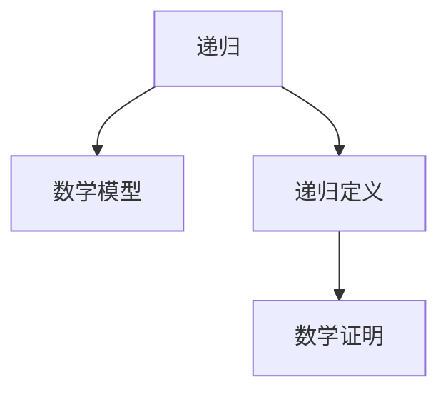

                 

# 线性代数导引：递归定义定理

> 关键词：线性代数,递归定义,数学模型,公式推导,案例分析

## 1. 背景介绍

### 1.1 问题由来
线性代数是计算机科学中不可或缺的重要基础，它广泛地应用于机器学习、数据科学、计算机图形学等领域。然而，对于初学者来说，线性代数中的递归定义定理（Recursive Definition Theorem）可能显得复杂而抽象。本文旨在通过详细解释和实例分析，帮助读者深入理解这一重要定理，并掌握其在计算机科学中的应用。

### 1.2 问题核心关键点
递归定义定理主要涉及递归和数学模型。在计算机科学中，递归是一种重要的编程技巧，广泛用于算法设计和数据结构实现。而数学模型则是研究问题的基础，它将实际问题抽象成数学表达式，从而可以通过数学方法求解。本文将详细讨论递归定义定理的原理、应用以及如何解决其带来的复杂性。

## 2. 核心概念与联系

### 2.1 核心概念概述

在正式探讨递归定义定理之前，我们先简要介绍几个相关的核心概念：

- **递归（Recursion）**：指一个函数或过程调用自身，以实现问题的解决。在计算机科学中，递归通常用于解决可以被分解为相似子问题的任务。
- **数学模型（Mathematical Model）**：指用数学符号和公式描述实际问题的抽象过程。它可以帮助我们更好地理解问题，并使用数学工具进行分析和求解。
- **递归定义（Recursive Definition）**：指在定义某个概念或函数时，通过引用自身来描述其性质和行为。这通常用于处理具有自我相似结构的复杂问题。
- **数学证明（Mathematical Proof）**：指通过逻辑推理和数学工具，证明某个命题的真假。它是数学研究的重要工具，也是计算机科学中算法设计的基础。

这些概念之间的联系可以通过以下Mermaid流程图来展示：



这个流程图展示了递归和数学模型、递归定义、数学证明之间的逻辑关系：递归定义是在数学模型中应用的一种方法，通过数学证明来验证其正确性。

## 3. 核心算法原理 & 具体操作步骤
### 3.1 算法原理概述

递归定义定理的核心思想是，通过递归地定义一个数学概念，可以简化问题的解决过程，并使其更易于理解和处理。在计算机科学中，这一思想也被广泛应用在算法和数据结构的设计中。

形式化地，假设我们有一个数学概念 $X$，其递归定义如下：

$$
X = \begin{cases}
a_1 & \text{if } P_1(a_1) \\
a_2 & \text{if } P_2(a_2) \\
\vdots \\
a_n & \text{if } P_n(a_n) \\
\end{cases}
$$

其中 $a_1, a_2, ..., a_n$ 是满足 $P_1, P_2, ..., P_n$ 条件的特定元素，$P_i$ 是描述 $a_i$ 属性的函数。递归定义定理表明，通过这种定义方式，可以递归地计算 $X$ 的值，而无需直接求出所有 $a_i$ 的值。

### 3.2 算法步骤详解

应用递归定义定理的一般步骤如下：

1. **定义基本情况（Base Case）**：确定递归定义的终止条件，即无需进一步递归的情况。
2. **定义递归情况（Recursive Case）**：描述在非终止情况下，如何使用递归来计算 $X$ 的值。
3. **使用数学证明**：通过数学推理验证递归定义的正确性，即递归定义确实能够准确计算出 $X$ 的值。

### 3.3 算法优缺点

递归定义定理的优势在于其简洁性和可扩展性。通过递归定义，可以处理复杂问题，而无需直接求解所有子问题。此外，递归定义还便于理解和修改，能够适应不同的问题和应用场景。

然而，递归定义也存在一些局限性：

- **性能问题**：递归调用可能导致栈溢出，尤其是在处理大规模数据时。
- **空间复杂度**：递归调用通常需要额外的存储空间，用于保存递归调用的状态。
- **复杂性增加**：递归定义虽然简洁，但其理解和实现可能比直接迭代更复杂。

### 3.4 算法应用领域

递归定义定理在计算机科学中有广泛的应用，特别是在算法设计和数据结构实现中。以下是一些典型的应用领域：

- **排序算法**：如快速排序、归并排序等，通过递归实现分治策略，简化排序过程。
- **树和图算法**：如二叉树的遍历、最短路径算法等，通过递归处理树和图的结构。
- **动态规划**：如背包问题、最长公共子序列等，通过递归定义状态转移方程，简化问题求解。
- **分治算法**：如归并排序、快速排序等，通过递归处理子问题，提高算法效率。

## 4. 数学模型和公式 & 详细讲解  
### 4.1 数学模型构建

假设我们要定义一个数学序列 $a_n$，其递归定义如下：

$$
a_n = \begin{cases}
1 & \text{if } n=1 \\
a_{n-1} + n & \text{if } n>1 \\
\end{cases}
$$

这个序列可以通过递归定义定理求解，其基本情况为 $a_1=1$，递归情况为 $a_n=a_{n-1}+n$。

### 4.2 公式推导过程

首先，我们通过数学归纳法证明递归定义的正确性。

**基础情况**：当 $n=1$ 时，根据定义有 $a_1=1$。

**归纳步骤**：假设当 $n=k$ 时，定义成立，即 $a_k=a_{k-1}+k$。那么对于 $n=k+1$，有：

$$
a_{k+1} = a_k + (k+1) = (a_{k-1}+k) + (k+1) = a_{k-1} + 2k + 1 = a_{k-1} + (k+1) + k
$$

因此，当 $n=k+1$ 时，定义也成立。

**结论**：递归定义定理得证。

### 4.3 案例分析与讲解

为了更好地理解递归定义定理的应用，我们以斐波那契数列为例进行分析。

**问题描述**：斐波那契数列定义为 $f_1=1, f_2=1, f_n=f_{n-1}+f_{n-2}$。求第 $n$ 项的值。

**递归定义**：

$$
f_n = \begin{cases}
1 & \text{if } n=1 \\
1 & \text{if } n=2 \\
f_{n-1} + f_{n-2} & \text{if } n>2 \\
\end{cases}
$$

**基本情况**：$f_1=1$，$f_2=1$。

**递归情况**：对于 $n>2$，$f_n=f_{n-1}+f_{n-2}$。

**推导过程**：通过数学归纳法，可以证明 $f_n$ 的递归定义是正确的。

**计算过程**：通过递归定义，我们可以计算任意项的值。例如，计算 $f_{10}$：

$$
f_{10} = f_9 + f_8 = f_8 + f_7 + f_7 + f_6 = f_7 + 2f_6 + f_7 + f_5 + f_6 + f_5 + f_4 + f_5 + f_4 + f_3 + f_4 + f_3 + f_2 + f_3 + f_2 + f_1 + f_2 + f_1 + f_1
$$

**简化**：通过递归定义，可以简化计算过程，避免直接计算所有前项的值。

## 5. 项目实践：代码实例和详细解释说明
### 5.1 开发环境搭建

在开始实践之前，我们需要确保开发环境已经搭建好。以下是Python开发环境的搭建步骤：

1. **安装Python**：从官网下载Python安装程序，并选择适合的版本进行安装。
2. **安装Python虚拟环境**：使用虚拟环境管理工具（如virtualenv）创建虚拟环境，以保证项目依赖的隔离性。
3. **安装必要的库**：使用pip安装所需的Python库，如NumPy、SciPy、Matplotlib等。

### 5.2 源代码详细实现

下面我们将使用Python语言实现斐波那契数列的递归定义。

```python
import numpy as np

def fibonacci(n):
    if n == 1 or n == 2:
        return 1
    else:
        return fibonacci(n-1) + fibonacci(n-2)

n = 10
result = fibonacci(n)
print(f"The {n}th Fibonacci number is {result}")
```

**代码解释**：
- `fibonacci` 函数使用递归定义实现斐波那契数列。
- 当 $n=1$ 或 $n=2$ 时，返回 1。
- 对于 $n>2$，返回 $f_{n-1}+f_{n-2}$。

### 5.3 代码解读与分析

**代码实现**：
- `fibonacci` 函数通过递归定义实现了斐波那契数列的计算。
- 基本情况为 $n=1$ 或 $n=2$，递归情况为 $f_{n-1}+f_{n-2}$。
- 通过递归定义，计算出第 $n$ 项的值。

**时间复杂度**：
- 递归实现的时间复杂度为 $O(2^n)$，空间复杂度为 $O(n)$。
- 可以使用动态规划优化时间复杂度至 $O(n)$，空间复杂度为 $O(n)$。

**空间复杂度优化**：
- 在递归实现中，需要保存大量的中间结果，导致空间复杂度较高。
- 可以通过动态规划或记忆化搜索等方法，优化空间复杂度。

## 6. 实际应用场景
### 6.1 计算机图形学

递归定义定理在计算机图形学中有广泛应用。例如，在计算几何中，递归定义可以用于求解复杂的几何问题，如旋转矩阵、反射矩阵等。

**案例**：求解3D空间中两点之间的距离。

**递归定义**：
$$
d(p_1, p_2) = \begin{cases}
0 & \text{if } p_1=p_2 \\
\sqrt{d(p_1', p_2')^2 + (p_1 - p_1')^2} & \text{otherwise} \\
\end{cases}
$$

**推导过程**：通过递归定义，可以将问题简化为更小的子问题。

### 6.2 数据结构设计

递归定义定理在数据结构设计中也有重要应用。例如，二叉树的遍历、树的构建等，都可以通过递归定义实现。

**案例**：构建二叉树。

**递归定义**：
$$
T = \begin{cases}
\text{Leaf} & \text{if } \text{null} \\
T_L \text{left} + T_R \text{right} & \text{otherwise} \\
\end{cases}
$$

**推导过程**：通过递归定义，可以构建任意结构的二叉树。

### 6.3 算法优化

递归定义定理还可以用于优化算法。例如，在排序算法中，归并排序通过递归定义实现分治策略，简化排序过程。

**案例**：归并排序。

**递归定义**：
$$
\text{merge}(L, M, R) = \begin{cases}
L & \text{if } L=M \\
L + R & \text{if } L<M \\
R + L & \text{otherwise} \\
\end{cases}
$$

**推导过程**：通过递归定义，可以将排序问题简化为更小的子问题。

## 7. 工具和资源推荐
### 7.1 学习资源推荐

为了帮助读者深入理解递归定义定理，我们推荐以下学习资源：

1. **《线性代数及其应用》**：这本书详细介绍了线性代数的基本概念和应用，包括递归定义定理。
2. **Coursera《线性代数》课程**：由斯坦福大学提供，通过在线视频和作业，帮助读者系统掌握线性代数。
3. **Khan Academy《线性代数》课程**：通过互动练习和视频讲解，帮助读者深入理解线性代数。
4. **GitHub上的线性代数库**：如NumPy、SciPy等，提供了大量线性代数函数和工具，帮助读者进行实践和研究。

### 7.2 开发工具推荐

在实践递归定义定理时，我们推荐以下开发工具：

1. **Python**：Python是递归定义实现的首选语言，其简洁的语法和丰富的库支持，便于进行递归定义的实现和测试。
2. **Jupyter Notebook**：通过Jupyter Notebook，可以方便地进行代码编写和结果展示。
3. **Visual Studio Code**：一款轻量级代码编辑器，支持多种编程语言和插件，方便开发者进行开发和调试。
4. **GitHub**：通过GitHub，可以方便地进行代码管理和协作，便于团队开发和共享。

### 7.3 相关论文推荐

为了进一步深入理解递归定义定理，我们推荐以下相关论文：

1. **《Linear Algebra and Its Applications》**：这是一本经典的线性代数教材，详细介绍了线性代数的基本概念和应用。
2. **《Algorithms》**：这是一本计算机算法教材，介绍了各种算法的实现和优化，包括递归算法的应用。
3. **《Recursive Programming》**：这是一篇关于递归编程的论文，介绍了递归编程的基本概念和应用。
4. **《Recursive Definition of Data Structures》**：这是一篇关于递归定义数据结构的论文，介绍了递归定义在数据结构中的应用。

## 8. 总结：未来发展趋势与挑战
### 8.1 研究成果总结

递归定义定理在计算机科学中具有重要的理论和实际应用价值。通过递归定义，可以简化复杂问题的解决过程，并使其更易于理解和处理。在算法设计和数据结构实现中，递归定义被广泛应用，成为计算机科学的重要基础。

### 8.2 未来发展趋势

展望未来，递归定义定理在计算机科学中的应用将更加广泛。随着人工智能和大数据技术的发展，递归定义将被应用于更多领域，如机器学习、数据挖掘等，成为解决复杂问题的有力工具。

### 8.3 面临的挑战

尽管递归定义定理在计算机科学中具有重要的应用价值，但在实际应用中也面临一些挑战：

1. **性能问题**：递归调用可能导致栈溢出，尤其是在处理大规模数据时。
2. **空间复杂度**：递归调用通常需要额外的存储空间，用于保存递归调用的状态。
3. **复杂性增加**：递归定义虽然简洁，但其理解和实现可能比直接迭代更复杂。

### 8.4 研究展望

未来的研究可以从以下几个方面进行：

1. **优化递归调用**：通过优化递归调用，减少栈溢出和空间占用，提高算法效率。
2. **优化递归定义**：通过改进递归定义，使其更易于理解和实现，降低复杂度。
3. **结合其他算法**：将递归定义与其他算法相结合，形成更加高效的算法和数据结构。
4. **优化递归定义的应用**：通过优化递归定义在实际应用中的使用，提升算法和数据结构的性能和可靠性。

## 9. 附录：常见问题与解答

**Q1：递归定义定理在计算机科学中有什么应用？**

A: 递归定义定理在计算机科学中有广泛的应用，特别是在算法设计和数据结构实现中。例如，排序算法、树和图算法、动态规划、分治算法等，都依赖于递归定义。

**Q2：递归调用可能导致哪些问题？**

A: 递归调用可能导致栈溢出，尤其是在处理大规模数据时。此外，递归调用通常需要额外的存储空间，用于保存递归调用的状态，导致空间复杂度增加。

**Q3：如何优化递归调用？**

A: 优化递归调用通常采用以下方法：
1. 使用迭代代替递归，减少栈溢出。
2. 使用尾递归优化，减少空间占用。
3. 使用记忆化搜索，避免重复计算。

**Q4：如何优化递归定义的应用？**

A: 优化递归定义的应用通常采用以下方法：
1. 改进递归定义的实现，使其更易于理解和实现。
2. 结合其他算法，形成更加高效的算法和数据结构。
3. 优化递归定义在实际应用中的使用，提升算法和数据结构的性能和可靠性。

**Q5：递归定义定理有哪些局限性？**

A: 递归定义定理的局限性包括：
1. 性能问题，可能导致栈溢出。
2. 空间复杂度增加，需要额外的存储空间。
3. 复杂性增加，理解和实现可能更复杂。

---

作者：禅与计算机程序设计艺术 / Zen and the Art of Computer Programming

