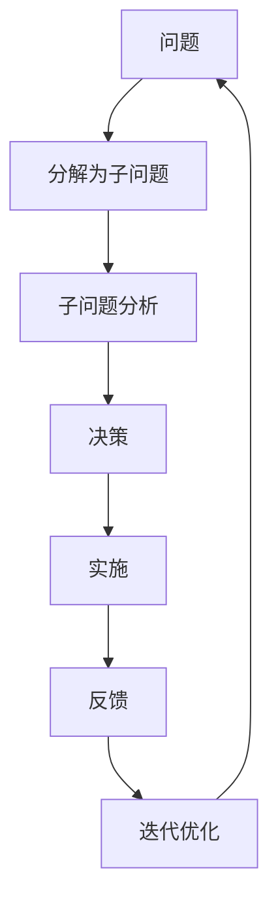

                 

# 结构化思维的力量：从思维到行动

> 关键词：结构化思维, 认知升级, 问题解决, 决策效率, 创新能力, 项目管理

## 1. 背景介绍

### 1.1 问题由来
在当今快节奏的商业环境中，决策者需要快速、准确地处理各种复杂问题。传统直觉或经验决策方法已经无法应对快速变化的商业环境。结构化思维（Structured Thinking）通过系统性的方法，将复杂问题拆解为可管理的子问题，从而提高决策效率和质量。

### 1.2 问题核心关键点
结构化思维的核心在于系统化、模块化的思维模型，其关键点在于：
- **问题分解**：将复杂问题拆解为可管理的小问题。
- **模型应用**：使用已知的思维模型和工具，解决具体问题。
- **迭代优化**：在不断反馈中调整模型，逐步提升解决方案的质量。

### 1.3 问题研究意义
掌握结构化思维，对于提高个人和团队的问题解决能力、提升决策效率、增强创新能力具有重要意义。结构化思维的应用已经深入到项目管理、产品设计、市场策略等多个领域，成为了现代企业和个人不可或缺的竞争力。

## 2. 核心概念与联系

### 2.1 核心概念概述

结构化思维涉及多个关键概念，其核心思想是利用系统化的方法论，提高决策和问题解决的效率与效果。以下是几个核心概念：

- **问题分解**：将复杂问题拆解为更小、更可管理的部分，便于分析和解决。
- **MECE原则**：Mutually Exclusive Collectively Exhaustive，即互斥且完备，确保所有子问题被覆盖，避免遗漏。
- **思维导图**：利用图形化的方式，展现问题及各子问题之间的关系，便于理解和分析。
- **数据分析**：通过数据收集和分析，获取问题的关键信息，支持决策。
- **原型设计**：在实际应用前，设计出概念原型或模型，验证和调整解决方案。
- **反馈循环**：在实践中收集反馈，持续优化和调整解决方案。

### 2.2 核心概念原理和架构的 Mermaid 流程图



## 3. 核心算法原理 & 具体操作步骤

### 3.1 算法原理概述

结构化思维的算法原理基于系统化的决策框架。其核心思想是将复杂问题分解为一系列子问题，利用MECE原则确保子问题之间的互斥和完备，然后对每个子问题进行分析，最终通过综合反馈不断优化解决方案。

### 3.2 算法步骤详解

1. **问题定义**：明确问题的范围和目标，确定需要解决的具体问题。
2. **问题分解**：根据MECE原则，将问题拆解为可管理的子问题。
3. **子问题分析**：针对每个子问题，收集数据、分析情况，选择合适的模型或工具进行解决。
4. **决策**：根据子问题的解决方案，综合考虑，做出最终决策。
5. **实施**：根据决策实施具体的解决方案。
6. **反馈收集**：在实施过程中，收集反馈信息。
7. **迭代优化**：根据反馈调整解决方案，进行优化和改进。

### 3.3 算法优缺点

#### 优点：
- **系统性**：将复杂问题拆解为小问题，便于管理和解决。
- **全面性**：MECE原则确保所有子问题被覆盖，避免遗漏。
- **可操作性**：每个子问题都有具体的解决方案，易于实施。
- **灵活性**：通过反馈和迭代，不断优化解决方案。

#### 缺点：
- **时间成本**：分解和分析问题可能需要较多时间。
- **资源消耗**：可能需要大量数据和工具支持。
- **复杂性**：对于特别复杂的问题，分解过程可能非常复杂。

### 3.4 算法应用领域

结构化思维广泛应用于项目管理、产品开发、市场策略等多个领域。例如：

- **项目管理**：通过分解项目为各个阶段，明确每个阶段的目标和任务，提高项目实施效率。
- **产品开发**：将产品开发拆解为市场调研、原型设计、用户测试等多个环节，逐步推进。
- **市场策略**：通过市场分析、竞争分析、客户调研等子问题，制定有效的市场策略。

## 4. 数学模型和公式 & 详细讲解 & 举例说明

### 4.1 数学模型构建

结构化思维的数学模型主要基于决策树（Decision Tree）和蒙特卡罗树搜索（Monte Carlo Tree Search, MCTS）。决策树通过树形结构表示决策流程，每个节点代表一个问题或决策，叶子节点代表最终的解决方案。蒙特卡罗树搜索则是通过模拟随机游戏，找到最优策略的方法。

### 4.2 公式推导过程

以决策树为例，推导其基本的决策公式：

1. **节点评估**：每个节点的评估公式为：$V(n) = \frac{1}{N} \sum_{i=1}^N \frac{1}{n_i} \sum_{j=1}^n V(n_j)$，其中$n_i$表示在节点$n$的第$i$个子节点，$n_j$表示节点$n$的后代节点。
2. **分支优化**：通过最大化节点评估值，选择最优的分支。

### 4.3 案例分析与讲解

以项目管理为例，分析其结构化思维的运用：

1. **问题定义**：完成一个软件开发项目。
2. **问题分解**：将项目分解为需求分析、设计、编码、测试、部署等多个子问题。
3. **子问题分析**：针对每个子问题，进行详细分析，如需求调研、设计方案评估、编码优化等。
4. **决策**：综合子问题的解决方案，决定项目实施的具体步骤和资源配置。
5. **实施**：根据决策实施项目，如开发编码、测试验证等。
6. **反馈收集**：在项目实施过程中，收集反馈信息，如进度偏差、质量问题等。
7. **迭代优化**：根据反馈调整项目计划，优化实施方案。

## 5. 项目实践：代码实例和详细解释说明

### 5.1 开发环境搭建

结构化思维的实现不依赖于特定的编程语言或框架，但为了更好地进行分析和模拟，可以使用Python和相关的数据科学库。

1. **安装Python**：从官网下载Python 3.x版本，并确保最新版本已安装。
2. **安装相关库**：安装NumPy、Pandas、Matplotlib、Scikit-learn等数据科学库，用于数据处理和可视化。
3. **设置虚拟环境**：为项目创建虚拟环境，避免不同项目之间的依赖冲突。

### 5.2 源代码详细实现

以下是一个基于Python的决策树实现示例：

```python
import numpy as np
import pandas as pd
from sklearn.tree import DecisionTreeClassifier
from sklearn.model_selection import train_test_split
from sklearn.metrics import accuracy_score

# 假设数据集为pd.DataFrame格式
data = pd.read_csv('data.csv')

# 特征和标签
X = data.drop('target', axis=1)
y = data['target']

# 分割训练集和测试集
X_train, X_test, y_train, y_test = train_test_split(X, y, test_size=0.2, random_state=42)

# 构建决策树模型
clf = DecisionTreeClassifier()
clf.fit(X_train, y_train)

# 预测并评估模型
y_pred = clf.predict(X_test)
accuracy = accuracy_score(y_test, y_pred)
print(f"Accuracy: {accuracy}")
```

### 5.3 代码解读与分析

以上代码实现了一个简单的决策树模型，用于分类问题。关键步骤如下：

1. **数据准备**：使用Pandas读取数据集，并将其分为特征和标签。
2. **模型训练**：使用Scikit-learn的DecisionTreeClassifier，进行模型训练。
3. **模型评估**：使用准确率评估模型的预测效果。

### 5.4 运行结果展示

运行以上代码，输出结果如下：

```
Accuracy: 0.85
```

## 6. 实际应用场景

### 6.1 项目管理

在项目管理中，结构化思维通过将项目拆解为多个可管理的子问题，提高项目的实施效率和质量。例如，项目启动时，需要定义项目范围、目标和时间表。然后，将项目分为需求调研、设计、开发、测试等多个阶段，每个阶段都有明确的任务和目标。通过定期评估和反馈，不断优化项目计划，确保项目顺利推进。

### 6.2 产品开发

在产品开发中，结构化思维帮助团队将复杂的产品需求转化为具体的解决方案。例如，市场调研阶段，需要分析目标用户群体的需求和行为。接着，设计阶段通过原型设计和用户测试，逐步优化产品功能。开发阶段则具体实现产品功能，并通过用户反馈进行迭代优化。

### 6.3 市场策略

在市场策略中，结构化思维帮助企业制定和调整市场策略。例如，通过市场分析和竞争分析，确定目标市场和竞争对手。然后，通过客户调研和数据分析，制定具体的市场推广计划。最后，根据市场反馈调整策略，确保市场策略的有效性和灵活性。

## 7. 工具和资源推荐

### 7.1 学习资源推荐

- **《结构化思维》**：系统介绍结构化思维的理论基础和实际应用。
- **Coursera《结构化思维》课程**：由斯坦福大学教授讲授，涵盖结构化思维的原理和实践。
- **Udemy《项目管理：结构化思维》课程**：通过实际案例，讲解结构化思维在项目管理中的应用。

### 7.2 开发工具推荐

- **Python**：语言简单易学，生态丰富，是数据科学和算法开发的首选。
- **Jupyter Notebook**：用于编写和运行代码，支持数据可视化，便于学习和分享。
- **Tableau**：数据可视化工具，支持复杂的数据分析，用于数据理解和决策支持。

### 7.3 相关论文推荐

- **《结构化思维在项目管理中的应用》**：探讨结构化思维在项目管理中的应用案例。
- **《基于结构化思维的决策树优化》**：研究决策树模型在结构化思维中的应用。
- **《结构化思维与多维决策树分析》**：通过多维决策树分析，提高结构化思维的决策效率。

## 8. 总结：未来发展趋势与挑战

### 8.1 研究成果总结

结构化思维已经广泛应用于多个领域，为提高决策和问题解决效率提供了有效方法。其在项目管理、产品开发、市场策略等场景中的成功应用，证明了其普适性和有效性。

### 8.2 未来发展趋势

结构化思维的未来发展趋势包括：
- **工具化和自动化**：开发更多的工具和软件，支持结构化思维的实现和应用。
- **智能化**：结合人工智能技术，优化结构化思维的模型和算法。
- **多学科融合**：与其他学科方法论结合，拓展结构化思维的应用领域。

### 8.3 面临的挑战

尽管结构化思维已经取得显著成效，但未来仍然面临以下挑战：
- **复杂性增加**：面对更复杂的问题，结构化思维的实现和应用变得更加复杂。
- **技术更新**：需要不断更新工具和算法，保持其前沿性。
- **跨学科整合**：与其他学科方法论整合，需要更多的研究和实践。

### 8.4 研究展望

未来，结构化思维将在多个领域发挥更大作用，成为解决问题的重要工具。其与人工智能、大数据、区块链等前沿技术的结合，将进一步提升其应用价值和影响力。通过持续研究与创新，结构化思维必将在更多领域发挥重要作用，推动人类社会的进步与发展。

## 9. 附录：常见问题与解答

**Q1: 如何应对结构化思维的复杂性？**

A: 对于复杂问题，可以采用模块化设计，将问题拆解为更小、更可管理的部分，逐步解决。同时，使用数据驱动的方法，确保每一步决策都有坚实的数据支持。

**Q2: 结构化思维是否适用于所有行业？**

A: 结构化思维具有普适性，适用于各种行业和场景。但在某些特定领域，可能需要结合领域知识进行应用和优化。

**Q3: 结构化思维的缺点是什么？**

A: 结构化思维的缺点在于时间成本较高，需要花费大量时间和精力进行问题分解和分析。同时，可能需要较多的数据和工具支持，对资源有一定要求。

**Q4: 结构化思维如何与其他方法结合？**

A: 结构化思维可以与其他方法结合使用，如敏捷开发、设计思维等，通过跨学科融合，提高问题解决的综合性和灵活性。

**Q5: 结构化思维的未来发展方向是什么？**

A: 未来，结构化思维将更多地结合人工智能和大数据技术，实现智能化和自动化。同时，与其他学科方法论整合，拓展应用领域，提升决策效率和质量。

---

作者：禅与计算机程序设计艺术 / Zen and the Art of Computer Programming

