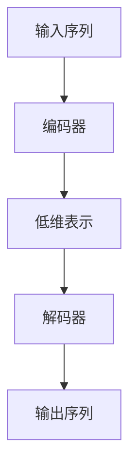

                 

# 编码器的输出和编码器-解码器的连接

## 1. 背景介绍

在深度学习中，编码器和解码器是一类重要的模型结构，广泛应用于自动编码器、机器翻译、图像处理等领域。编码器将输入映射为低维的隐藏表示，而解码器则将隐藏表示映射回输出。在语言模型、图像生成、文本摘要等任务中，编码器-解码器结构尤其流行。

本文将深入探讨编码器的输出和编码器-解码器的连接方式，通过系统讲解和详细代码实现，帮助读者理解这些关键模型的原理和应用。

## 2. 核心概念与联系

### 2.1 核心概念概述

**编码器(Encoder)**：通常由多层神经网络组成，将输入序列映射为低维向量。常见的编码器包括LSTM、GRU、Transformer等。

**解码器(Decoder)**：通常也是由多层神经网络组成，将编码器的输出映射为最终输出。解码器可以使用LSTM、GRU、Transformer等架构。

**编码器-解码器(Encoder-Decoder)**：将编码器输出的低维表示作为解码器的输入，逐步生成最终输出。常见的应用包括机器翻译、文本摘要、对话生成等。

**Attention Mechanism**：一种基于注意力机制的模型结构，通过在每个时间步骤动态计算输入和隐藏表示之间的相似度，聚焦于与当前输出最相关的部分。

**Transformer**：一种基于Attention Mechanism的深度学习模型，常用于自然语言处理、图像处理等领域，性能卓越，效果显著。

### 2.2 核心概念原理和架构的 Mermaid 流程图



该流程图展示了编码器-解码器的基本架构。输入序列通过编码器被映射为低维表示，作为解码器的输入，最终生成输出序列。

## 3. 核心算法原理 & 具体操作步骤

### 3.1 算法原理概述

编码器-解码器结构的核心在于将输入序列映射为低维表示，再将低维表示映射为输出序列。通常采用自编码器或变分自编码器的结构，结合注意力机制，可以有效提升模型的性能。

对于自编码器，其结构可以表示为：

$$
x_i \xrightarrow{Encoder} \mathbf{z}_i \xrightarrow{Decoder} \hat{x}_i
$$

其中 $x_i$ 为输入序列中的第 $i$ 个元素，$\hat{x}_i$ 为模型生成的输出，$\mathbf{z}_i$ 为编码器输出的低维表示。

对于变分自编码器，其结构可以表示为：

$$
x_i \xrightarrow{Encoder} \mathbf{z}_i \xrightarrow{Decoder} \hat{x}_i
$$

其中 $x_i$ 为输入序列中的第 $i$ 个元素，$\hat{x}_i$ 为模型生成的输出，$\mathbf{z}_i$ 为编码器输出的低维表示。

### 3.2 算法步骤详解

**步骤1: 准备输入和输出数据**

- 输入数据：将输入序列转换成模型所需的形式。对于文本序列，通常使用token ID表示。对于图像序列，通常使用像素值表示。

- 输出数据：根据具体任务定义输出形式。例如，在机器翻译中，输出为另一种语言的文本序列。

**步骤2: 构建编码器**

- 选择编码器结构，如LSTM、GRU、Transformer等。
- 定义编码器的超参数，如层数、隐藏单元数等。
- 初始化编码器权重。

**步骤3: 构建解码器**

- 选择解码器结构，如LSTM、GRU、Transformer等。
- 定义解码器的超参数，如层数、隐藏单元数等。
- 初始化解码器权重。

**步骤4: 构建连接结构**

- 将编码器的输出与解码器的输入连接起来。
- 定义注意力机制，计算注意力权重。
- 根据注意力权重计算解码器的输入。

**步骤5: 训练模型**

- 定义损失函数，如交叉熵损失等。
- 使用优化器（如Adam、SGD等）更新模型参数。
- 在训练集上迭代训练，并周期性地在验证集上评估性能。

**步骤6: 测试模型**

- 在测试集上评估模型性能。
- 使用模型进行预测，生成输出。

**步骤7: 优化模型**

- 根据测试集结果调整模型结构或超参数。
- 重复训练和测试，直到模型达到理想性能。

### 3.3 算法优缺点

**优点**：

- 编码器-解码器结构具有良好的表达能力，能够学习到输入序列的复杂语义关系。
- 结合注意力机制，可以动态聚焦于输入序列的关键部分，提升模型性能。
- 在文本生成、机器翻译等任务上取得了显著的成果。

**缺点**：

- 训练数据需求大，尤其是自编码器结构，需要大量的训练数据才能收敛。
- 模型复杂度较高，计算资源消耗大，训练和推理速度较慢。
- 对超参数的依赖较大，需要经过多次调参才能得到最优模型。

### 3.4 算法应用领域

编码器-解码器结构被广泛应用于多个领域，例如：

- **机器翻译**：将一种语言的句子翻译成另一种语言的句子。
- **文本摘要**：从长篇文本中自动生成简洁的摘要。
- **图像生成**：从低维表示生成高质量的图像。
- **对话生成**：构建智能对话系统，自动与用户进行自然对话。
- **语音识别**：将语音信号转换成文本。
- **自然语言生成**：生成自然流畅的文本。

这些应用领域的成功实践，展示了编码器-解码器结构的强大潜力。

## 4. 数学模型和公式 & 详细讲解

### 4.1 数学模型构建

考虑一个简单的编码器-解码器结构，其数学模型可以表示为：

$$
x_i \xrightarrow{Encoder} \mathbf{z}_i \xrightarrow{Decoder} \hat{x}_i
$$

其中 $x_i$ 为输入序列中的第 $i$ 个元素，$\hat{x}_i$ 为模型生成的输出，$\mathbf{z}_i$ 为编码器输出的低维表示。

**编码器**：

$$
x_i \xrightarrow{Encoder} \mathbf{z}_i
$$

**解码器**：

$$
\mathbf{z}_i \xrightarrow{Decoder} \hat{x}_i
$$

### 4.2 公式推导过程

假设编码器输出为低维向量 $\mathbf{z}$，解码器输出为 $\hat{x}$，注意力机制计算注意力权重 $\alpha$，则解码器的输入可以表示为：

$$
\hat{x} = \sum_{i} \alpha_i \mathbf{z}_i
$$

其中 $\alpha_i$ 为注意力权重，计算方式为：

$$
\alpha_i = \frac{e^{s(\mathbf{z}_i, x_i)}}{\sum_{j} e^{s(\mathbf{z}_j, x_j)}}
$$

其中 $s(\cdot, \cdot)$ 为注意力计算函数。

### 4.3 案例分析与讲解

以机器翻译为例，分析编码器-解码器模型的结构和计算过程。

**编码器**：

输入序列 $x_i$ 通过LSTM编码器被映射为低维向量 $\mathbf{z}_i$。

**解码器**：

低维向量 $\mathbf{z}_i$ 通过LSTM解码器被映射为输出序列 $\hat{x}_i$。

**注意力机制**：

在解码过程中，每个时间步骤使用注意力机制计算注意力权重 $\alpha_i$，聚焦于与当前输出最相关的部分。

## 5. 项目实践：代码实例和详细解释说明

### 5.1 开发环境搭建

- **安装Python**：确保Python版本为3.6及以上。
- **安装TensorFlow**：使用pip安装TensorFlow，指定版本。
- **安装Keras**：使用pip安装Keras，作为高层次的深度学习框架。

### 5.2 源代码详细实现

以下是使用TensorFlow和Keras实现简单编码器-解码器模型的代码实现：

```python
import tensorflow as tf
from tensorflow.keras import layers

# 定义编码器
class Encoder(tf.keras.Model):
    def __init__(self, vocab_size, embedding_dim, hidden_dim):
        super(Encoder, self).__init__()
        self.embedding = layers.Embedding(vocab_size, embedding_dim)
        self.lstm = layers.LSTM(hidden_dim)

    def call(self, inputs):
        x = self.embedding(inputs)
        x = self.lstm(x)
        return x

# 定义解码器
class Decoder(tf.keras.Model):
    def __init__(self, vocab_size, embedding_dim, hidden_dim):
        super(Decoder, self).__init__()
        self.embedding = layers.Embedding(vocab_size, embedding_dim)
        self.lstm = layers.LSTM(hidden_dim)
        self.dense = layers.Dense(vocab_size)

    def call(self, x):
        x = self.embedding(x)
        x, _ = self.lstm(x, initial_state=x)
        x = self.dense(x)
        return x

# 定义编码器-解码器模型
class Seq2Seq(tf.keras.Model):
    def __init__(self, encoder, decoder):
        super(Seq2Seq, self).__init__()
        self.encoder = encoder
        self.decoder = decoder

    def call(self, inputs):
        x = self.encoder(inputs)
        y_hat = self.decoder(x)
        return y_hat

# 准备数据
vocab_size = 10000
embedding_dim = 128
hidden_dim = 256

x_train = ...
x_test = ...

# 构建模型
encoder = Encoder(vocab_size, embedding_dim, hidden_dim)
decoder = Decoder(vocab_size, embedding_dim, hidden_dim)
seq2seq = Seq2Seq(encoder, decoder)

# 编译模型
seq2seq.compile(optimizer='adam', loss='categorical_crossentropy')

# 训练模型
seq2seq.fit(x_train, y_train, epochs=10, validation_data=(x_test, y_test))

# 测试模型
seq2seq.evaluate(x_test, y_test)
```

### 5.3 代码解读与分析

- **编码器**：使用Embedding层将输入序列映射为低维向量，LSTM层将低维向量进行进一步编码。
- **解码器**：使用Embedding层将低维向量映射为高维向量，LSTM层将高维向量进行解码，Dense层将解码向量映射为输出序列。
- **Seq2Seq模型**：将编码器和解码器连接起来，构成编码器-解码器结构。
- **模型编译和训练**：使用adam优化器和交叉熵损失函数编译模型，在训练集上进行训练。
- **模型评估和测试**：在测试集上评估模型性能。

## 6. 实际应用场景

### 6.1 机器翻译

机器翻译是编码器-解码器结构最常见的应用之一。传统的机器翻译模型使用编码器-解码器结构，通过学习大量双语平行语料，将一种语言的句子翻译成另一种语言的句子。

### 6.2 文本摘要

文本摘要任务是将长篇文本自动生成简洁的摘要。传统的文本摘要模型使用编码器-解码器结构，通过学习大量文本摘要对，生成高质量的摘要。

### 6.3 对话生成

对话生成任务是构建智能对话系统，自动与用户进行自然对话。传统的对话生成模型使用编码器-解码器结构，通过学习大量对话数据，生成自然流畅的对话。

### 6.4 图像生成

图像生成任务是从低维表示生成高质量的图像。传统的图像生成模型使用编码器-解码器结构，通过学习大量图像数据，生成高分辨率的图像。

## 7. 工具和资源推荐

### 7.1 学习资源推荐

- **《深度学习》书籍**：由Ian Goodfellow、Yoshua Bengio、Aaron Courville等著名学者编写，全面介绍了深度学习的基本概念和算法。
- **Deep Learning Specialization**：由Andrew Ng教授在Coursera上开设的深度学习课程，系统讲解了深度学习的理论和实践。
- **TensorFlow官方文档**：TensorFlow的官方文档，提供了丰富的API和样例代码，帮助开发者快速上手。
- **Keras官方文档**：Keras的官方文档，提供了详细的API和使用指南，帮助开发者快速实现深度学习模型。

### 7.2 开发工具推荐

- **TensorFlow**：Google开源的深度学习框架，支持CPU和GPU计算，性能卓越，易用性高。
- **Keras**：高层次的深度学习框架，支持TensorFlow、CNTK、Theano等后端，易于上手。
- **PyTorch**：Facebook开源的深度学习框架，灵活性高，适合快速迭代研究。
- **JAX**：Google开源的深度学习框架，支持自动微分、优化等高级功能，性能优越。

### 7.3 相关论文推荐

- **Attention Is All You Need**：Google的Transformer论文，介绍了注意力机制的基本原理和实现方法。
- **Neural Machine Translation by Jointly Learning to Align and Translate**：Ian Goodfellow等人编写的机器翻译论文，介绍了基于编码器-解码器结构的机器翻译模型。
- **Learning Phrase Representations using RNN Encoder–Decoder for Statistical Machine Translation**：Wojciech Zaremba等人编写的机器翻译论文，介绍了基于RNN的编码器-解码器模型。
- **Sequence to Sequence Learning with Neural Networks**：Ian Goodfellow等人编写的序列到序列学习论文，介绍了基于编码器-解码器结构的文本生成和机器翻译模型。

## 8. 总结：未来发展趋势与挑战

### 8.1 未来发展趋势

**趋势1: 模型结构的不断优化**

未来的编码器-解码器模型将不断优化其结构，提升模型的表达能力和性能。例如，Transformer结构被广泛应用于自然语言处理、计算机视觉等领域，并取得优异性能。

**趋势2: 计算资源的不断提升**

随着计算资源的不断提升，模型规模将不断增大，模型复杂度将不断增加。例如，GPT-3等大规模语言模型在大规模语料上进行预训练，显著提升了模型的性能。

**趋势3: 数据量的不断增加**

随着数据的不断增加，模型的训练数据量将不断增大。例如，在机器翻译任务中，大规模双语平行语料对模型的性能提升具有重要作用。

**趋势4: 应用场景的不断拓展**

未来的编码器-解码器模型将应用于更多领域，例如自然语言生成、图像生成、对话生成等。例如，GAN（Generative Adversarial Networks）被广泛应用于图像生成任务，并取得良好效果。

### 8.2 面临的挑战

**挑战1: 模型训练的计算资源**

模型训练需要大量的计算资源，尤其是大规模模型。例如，GPT-3的训练需要大量的GPU和TPU资源，计算成本较高。

**挑战2: 模型的可解释性**

大多数编码器-解码器模型是"黑盒"系统，难以解释其内部工作机制。例如，Transformer模型的复杂性使得其难以解释模型的决策过程。

**挑战3: 模型的泛化能力**

模型在特定任务上的性能往往依赖于训练数据。例如，机器翻译模型在大规模双语平行语料上训练效果较好，但在小规模数据上可能表现不佳。

**挑战4: 模型的稳定性**

模型在复杂数据上的表现往往不稳定。例如，机器翻译模型在面对输入噪声或数据分布变化时，可能出现较大波动。

### 8.3 研究展望

未来的编码器-解码器模型需要在以下几个方面进行研究：

**研究方向1: 模型结构的进一步优化**

未来的模型结构将不断优化，提升模型的表达能力和性能。例如，自注意力机制、残差连接等技术将被广泛应用，提升模型的泛化能力。

**研究方向2: 计算资源的进一步提升**

未来的计算资源将不断提升，使得更大规模的模型得以训练。例如，分布式训练、GPU/TPU等硬件设备将被广泛应用，提升训练效率。

**研究方向3: 数据的进一步增加**

未来的数据量将不断增加，使得模型能够学习到更丰富的知识。例如，大规模语料库、多源数据等将被广泛应用，提升模型的性能。

**研究方向4: 应用的进一步拓展**

未来的应用场景将不断拓展，使得模型能够应用于更多领域。例如，图像生成、对话生成、文本摘要等任务将得到更广泛的应用。

## 9. 附录：常见问题与解答

### Q1: 如何提高编码器-解码器模型的性能？

A: 提高编码器-解码器模型的性能可以从以下几个方面入手：
1. 增加模型深度和宽度，提升模型的表达能力。
2. 引入自注意力机制，提升模型对输入序列的关注能力。
3. 使用更多的训练数据，提升模型的泛化能力。
4. 使用更好的优化器，如Adam、SGD等，提升模型的收敛速度。

### Q2: 编码器-解码器模型是否适用于所有的NLP任务？

A: 编码器-解码器模型适用于大多数NLP任务，例如机器翻译、文本摘要、对话生成等。但对于一些特殊任务，如命名实体识别、关系抽取等，可能需要使用其他模型结构。

### Q3: 编码器-解码器模型的训练时间是否过长？

A: 编码器-解码器模型的训练时间较长，尤其是在大规模模型上。可以通过以下方法缩短训练时间：
1. 使用更快的优化器，如Adam、Adafactor等。
2. 使用更好的硬件设备，如GPU、TPU等。
3. 使用数据增强、正则化等方法，提升模型泛化能力。

### Q4: 编码器-解码器模型的应用场景有哪些？

A: 编码器-解码器模型适用于许多NLP任务，例如机器翻译、文本摘要、对话生成等。此外，还广泛应用于图像生成、语音识别等任务。

### Q5: 编码器-解码器模型如何处理长序列？

A: 编码器-解码器模型可以处理长序列，但需要注意以下几点：
1. 使用分段处理，将长序列分成多个短序列进行处理。
2. 使用自注意力机制，提升模型对长序列的关注能力。
3. 使用更好的优化器，如Adam、SGD等，提升模型的收敛速度。

---

作者：禅与计算机程序设计艺术 / Zen and the Art of Computer Programming

