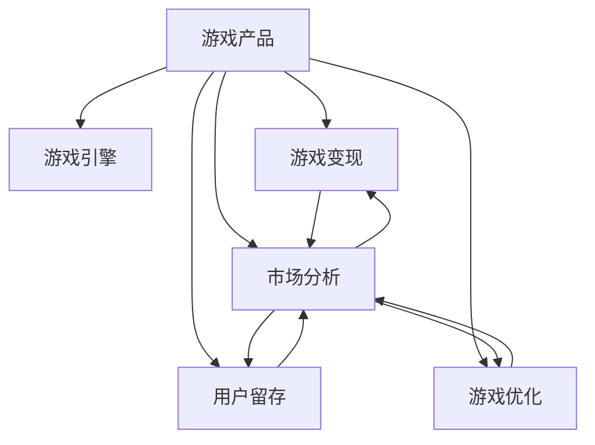

                 

## 1. 背景介绍

### 1.1 问题由来

随着互联网技术的迅猛发展，网络游戏市场正以前所未有的速度扩张。根据统计数据，2020年全球游戏市场规模已突破1500亿美元，成为仅次于电影产业的第二大娱乐消费市场。这一数字还在不断攀升。游戏市场不仅创造了巨大的经济价值，还带动了虚拟硬件、广告、数据分析等多个产业链的繁荣。

然而，游戏创业的门槛和竞争程度也在不断提升。如何开发出优质游戏并实现商业变现，成为众多游戏创业者面临的巨大挑战。以顶尖游戏公司为例，网易游戏、腾讯游戏、育碧游戏等，无一不是手握大量资源和研发实力，才能在激烈的市场竞争中站稳脚跟。对于初创企业，如何在资源有限的情况下，打造出具有市场竞争力的游戏产品，并快速实现盈利，是一个亟待解决的难题。

### 1.2 问题核心关键点

游戏创业的核心在于打造优质的游戏产品，并构建稳固的商业模式，最终实现盈利。具体而言，包括以下几个关键点：

1. **游戏产品开发**：如何设计和开发出受玩家欢迎的游戏产品，满足不同玩家群体的需求。
2. **商业变现模式**：游戏公司如何通过内购、广告、订阅等方式实现收入增长。
3. **用户留存与运营**：如何在激烈的市场竞争中，保持玩家的高活跃度和长期留存。
4. **市场分析与策略**：如何快速定位目标市场，制定合适的市场推广策略，最大化商业价值。
5. **技术创新与优化**：如何利用先进的编程语言、引擎和开发工具，实现游戏性能和用户体验的提升。

## 2. 核心概念与联系

### 2.1 核心概念概述

为更好地理解游戏创业的本质和实现路径，本节将介绍几个关键核心概念：

- **游戏产品**：指通过编程实现的虚拟世界，包括角色扮演、策略模拟、体育竞技等多种类型。
- **游戏引擎**：提供游戏开发所需的底层支持和功能模块，如Unity、Unreal Engine等。
- **游戏变现**：指游戏公司通过内购、广告、订阅等方式，实现商业价值的转化。
- **用户留存**：指玩家在游戏中的长期活跃度和留存率，通常以月活跃用户（MAU）和日活跃用户（DAU）为衡量指标。
- **市场分析**：通过数据分析、用户调研等方式，理解市场需求和玩家行为，从而制定有效的市场策略。
- **游戏优化**：通过技术手段提升游戏性能和用户体验，如图形渲染优化、游戏逻辑优化等。

这些核心概念之间的逻辑关系可以通过以下Mermaid流程图来展示：



这个流程图展示出游戏创业的关键环节：

1. 游戏产品开发：以游戏引擎为基础，构建虚拟世界。
2. 游戏变现：通过内购、广告等方式，实现商业价值的转化。
3. 用户留存：保持玩家活跃度和留存率，提升商业价值。
4. 市场分析：通过数据分析和用户调研，制定市场策略。
5. 游戏优化：提升游戏性能和用户体验，进一步提升玩家留存和变现能力。

## 3. 核心算法原理 & 具体操作步骤

### 3.1 算法原理概述

游戏创业的实质是通过设计和优化虚拟世界，实现商业价值的最大化。这一过程包括游戏产品开发、变现模式设计、用户留存运营、市场策略制定和游戏优化等多个环节。其中，游戏产品的开发和优化是基础，变现模式和用户留存运营是关键，市场分析是方向指引。

具体而言，游戏创业的核心算法可以归纳为以下四个步骤：

1. **游戏产品设计与开发**：通过游戏引擎，设计和实现满足玩家需求的游戏产品。
2. **商业变现模式设计**：根据目标市场，选择合适的内购、广告、订阅等变现模式。
3. **用户留存与运营**：通过持续更新和优化游戏产品，提升用户体验，并通过奖励机制和社区建设，增强用户粘性。
4. **市场分析与策略制定**：通过数据分析和用户调研，理解市场需求和玩家行为，制定有效的市场推广策略。

### 3.2 算法步骤详解

#### 3.2.1 游戏产品设计与开发

**Step 1: 确定游戏类型与核心玩法**

根据目标市场和用户需求，确定游戏类型（如角色扮演、策略模拟、体育竞技等）和核心玩法。游戏类型决定了游戏的基本框架和规则，而核心玩法则构成了游戏的主要交互和乐趣。

**Step 2: 选择游戏引擎与开发工具**

选择合适的游戏引擎（如Unity、Unreal Engine）和开发工具，构建游戏的基础框架。游戏引擎提供了游戏开发所需的底层支持和功能模块，如图形渲染、物理引擎、音频处理等。

**Step 3: 设计和实现游戏元素**

在确定游戏类型和核心玩法后，设计和实现游戏的各种元素，包括角色、场景、道具、任务等。这些元素构成了游戏的核心体验，是吸引玩家的重要因素。

**Step 4: 测试与优化**

完成游戏开发后，进行全面的测试，包括功能测试、性能测试和用户体验测试。通过测试，找出问题并优化游戏性能和用户体验，确保游戏的高品质和稳定性。

#### 3.2.2 商业变现模式设计

**Step 1: 选择合适的变现模式**

根据目标市场和用户行为，选择合适的内购、广告、订阅等变现模式。内购模式适用于重度玩家，提供高级道具、皮肤等；广告模式适用于轻量级游戏，通过展示广告或游戏内广告实现变现；订阅模式适用于长期用户，提供稳定的收入流。

**Step 2: 设计激励机制**

通过设计激励机制，引导玩家进行付费和长期留存。如道具和皮肤解锁、限时活动、积分兑换等，提升玩家消费意愿和留存率。

**Step 3: 优化变现流程**

优化变现流程，确保交易的顺畅和安全。如设计友好的支付界面、保证交易数据的安全性、及时处理玩家投诉等，提升玩家满意度和信任度。

#### 3.2.3 用户留存与运营

**Step 1: 用户数据分析**

通过数据分析工具，收集和分析玩家行为数据，如游戏时长、消费金额、活跃度等。根据数据反馈，制定用户留存和运营策略。

**Step 2: 持续更新与优化**

根据玩家反馈和市场趋势，持续更新和优化游戏内容，如新增任务、场景、道具等，保持游戏的新鲜感和吸引力。

**Step 3: 社区建设与互动**

通过构建游戏社区，增强玩家之间的互动和粘性。如建立玩家论坛、举办玩家活动、发布玩家投稿等，提升玩家参与度和留存率。

#### 3.2.4 市场分析与策略制定

**Step 1: 市场调研与用户调研**

通过市场调研和用户调研，了解市场需求和玩家行为。如分析竞品游戏、收集玩家反馈、进行问卷调查等，为市场策略制定提供数据支持。

**Step 2: 目标市场定位**

根据调研结果，明确目标市场和玩家群体。如针对儿童、青少年、成年人等不同年龄段，制定不同的市场策略。

**Step 3: 市场推广策略**

制定市场推广策略，选择适合的推广渠道和工具。如通过广告平台投放广告、与游戏平台合作、举办线上线下活动等，提升游戏的知名度和用户规模。

### 3.3 算法优缺点

**优点**：

- 灵活性高：根据市场需求和玩家反馈，灵活调整游戏内容和变现模式。
- 快速迭代：通过持续优化和更新，保持游戏的高品质和市场竞争力。
- 数据驱动：通过数据分析和用户调研，制定有效的市场策略，提升商业价值。

**缺点**：

- 高投入：游戏开发和市场推广需要大量资金和技术投入。
- 市场竞争激烈：游戏市场竞争激烈，如何快速适应市场变化是一个挑战。
- 技术门槛高：游戏开发需要较强的编程技能和艺术设计能力，门槛较高。

尽管存在这些缺点，但通过合理的策略和团队协作，这些挑战是可以克服的。

### 3.4 算法应用领域

基于以上核心算法原理，游戏创业可以在多个领域进行应用：

- **游戏产品开发**：适用于所有类型的游戏开发，包括2D、3D、桌面、移动端等。
- **商业变现**：适用于内购、广告、订阅等不同变现模式的游戏公司。
- **用户留存与运营**：适用于所有希望提升玩家活跃度和留存率的游戏。
- **市场分析**：适用于希望了解市场趋势和玩家行为的游戏公司。
- **游戏优化**：适用于所有需要提升游戏性能和用户体验的游戏开发团队。

## 4. 数学模型和公式 & 详细讲解 & 举例说明

### 4.1 数学模型构建

在上述核心算法的每个步骤中，都可以构建相应的数学模型，以指导游戏创业实践。以下是几个关键的数学模型：

**游戏用户留存模型**：

$$
\text{留存率} = f(\text{游戏体验}，\text{激励机制}，\text{社区互动})
$$

**广告效果评估模型**：

$$
\text{广告ROI} = \frac{\text{广告收入}}{\text{广告成本}} = \frac{N_{\text{点击}} \times C_{\text{点击}}}{N_{\text{展示}} \times C_{\text{展示}}}
$$

**游戏内购收入模型**：

$$
\text{收入} = \sum_{i} P_i \times Q_i
$$

其中 $P_i$ 为第 $i$ 项内购产品的价格，$Q_i$ 为第 $i$ 项内购产品的销量。

### 4.2 公式推导过程

以**游戏用户留存模型**为例，进行详细推导。

假设游戏体验、激励机制和社区互动对用户留存的影响分别为 $X$、$Y$、$Z$，则用户留存率 $R$ 可以表示为：

$$
R = f(X, Y, Z)
$$

其中 $f$ 为非线性函数。由于影响用户留存的因素多种多样，因此 $f$ 的具体形式取决于实际数据和分析方法。例如，可以通过回归分析、决策树、神经网络等方法构建 $f$，从而获得更精确的用户留存预测模型。

### 4.3 案例分析与讲解

以**广告效果评估模型**为例，进行案例分析。

假设某游戏公司通过搜索引擎广告推广游戏，投放了10000个展示位置，每个展示位置的价格为0.1元，总共花费了1000元。同时，广告带来了5000次点击，每次点击的收入为0.5元。

根据广告效果评估模型，该广告的ROI计算如下：

$$
\text{广告ROI} = \frac{5000 \times 0.5}{10000 \times 0.1} = 5
$$

由此可见，该广告的ROI为5，即每投入1元广告费用，能带来5元的收入，显示出广告的效果显著。

## 5. 项目实践：代码实例和详细解释说明

### 5.1 开发环境搭建

在进行游戏创业实践前，我们需要准备好开发环境。以下是使用C++和Unity开发的环境配置流程：

1. 安装Unity Hub：从官网下载并安装Unity Hub，用于管理不同版本的Unity引擎和项目。
2. 下载并安装Unity引擎：根据项目需求，从Unity官网下载并安装对应版本的Unity引擎。
3. 安装Visual Studio或Xcode：作为代码编写工具，Visual Studio和Xcode都是常用的选择。
4. 安装游戏开发所需的插件和工具：如Maya、Photoshop等，提升游戏开发效率和效果。

完成上述步骤后，即可在Unity环境中开始游戏创业实践。

### 5.2 源代码详细实现

这里我们以《宝藏猎人》（Treasure Hunter）这款动作冒险游戏为例，给出使用Unity引擎开发游戏的代码实现。

**角色控制脚本**：

```c++
using UnityEngine;
using System.Collections;

public class CharacterController : MonoBehaviour
{
    public float moveSpeed = 10.0f;
    public float jumpForce = 5.0f;
    public Rigidbody rb;

    void Update()
    {
        float moveX = Input.GetAxis("Horizontal");
        float moveY = Input.GetAxis("Vertical");

        rb.velocity = new Vector3(moveX * moveSpeed, moveY * moveSpeed, 0);
        rb.AddForce(new Vector3(0, jumpForce, 0) * Input.GetButtonDown("Jump"));
    }
}
```

**游戏逻辑脚本**：

```c++
using UnityEngine;
using System.Collections;

public class GameLogic : MonoBehaviour
{
    public GameObject player;
    public GameObject enemy;

    void Update()
    {
        Vector3 playerPosition = player.transform.position;
        Vector3 enemyPosition = enemy.transform.position;

        if (Vector3.Distance(playerPosition, enemyPosition) < 10)
        {
            player.SetActive(false);
            enemy.SetActive(false);
        }
    }
}
```

**游戏场景脚本**：

```c++
using UnityEngine;
using System.Collections;

public class SceneController : MonoBehaviour
{
    public GameObject[] levels;

    void Update()
    {
        int levelIndex = 0;

        if (Input.GetButtonDown("LoadLevel"))
        {
            levelIndex = Random.Range(0, levels.Length);
            SceneManager.LoadScene(levelIndex);
        }
    }
}
```

**动画特效脚本**：

```c++
using UnityEngine;
using System.Collections;

public class EffectController : MonoBehaviour
{
    public GameObject effect;

    void OnCollisionEnter2D(Collision2D collision)
    {
        if (collision.gameObject.tag == "Player")
        {
            GameObject effectInstance = Instantiate(effect, transform.position, transform.rotation);
        }
    }
}
```

这些代码实现展示了Unity游戏开发的几个关键部分，包括角色控制、游戏逻辑、场景切换和动画特效。开发者可以根据实际需求，进一步完善和优化游戏功能。

### 5.3 代码解读与分析

让我们再详细解读一下关键代码的实现细节：

**角色控制脚本**：

- `Update`方法：实时更新角色的位置和速度。
- `rb.velocity`：设置角色在X、Y轴的速度。
- `rb.AddForce`：对角色施加跳跃力。

**游戏逻辑脚本**：

- `Update`方法：实时判断玩家和敌人之间的距离。
- `player.SetActive(false)`：将玩家和敌人从场景中移除。

**游戏场景脚本**：

- `Update`方法：实时判断是否加载下一个关卡。
- `SceneManager.LoadScene(levelIndex)`：加载指定索引的关卡。

**动画特效脚本**：

- `OnCollisionEnter2D`方法：检测角色与游戏对象的碰撞。
- `Instantiate`方法：创建特效实例。

这些代码展示了Unity游戏开发的常用语法和逻辑，开发者可以通过进一步学习和实践，逐步掌握Unity的开发技巧。

## 6. 实际应用场景

### 6.1 智能客服系统

游戏创业的另一个重要应用场景是智能客服系统。通过构建虚拟世界，使玩家能够在互动中解决游戏内的问题，提升玩家的游戏体验。同时，游戏公司可以借助智能客服系统，处理玩家在游戏中的各种疑问和投诉，提升客户满意度和忠诚度。

在技术实现上，可以收集游戏内的玩家咨询数据，构建监督学习模型，对常见问题进行分类和回答。微调后的模型可以嵌入游戏系统，提供实时的客服支持，进一步提升玩家的游戏体验。

### 6.2 金融交易平台

游戏创业可以应用于金融交易平台的开发和优化。通过构建虚拟交易市场，玩家可以进行虚拟资产交易，模拟真实的金融交易场景。游戏公司可以借助金融交易平台，提升玩家的金融知识和投资技能，同时提供实时的交易分析和决策支持。

在技术实现上，可以构建游戏化交易平台，通过设定虚拟货币、市场波动等规则，模拟真实的金融市场。微调后的模型可以提供实时的市场分析和交易建议，提升玩家的投资水平和收益。

### 6.3 虚拟现实（VR）/增强现实（AR）

游戏创业可以应用于VR/AR领域的开发和创新。通过构建虚拟现实场景，玩家可以沉浸在虚拟世界中，享受真实的互动体验。游戏公司可以借助VR/AR技术，提升玩家的沉浸感和体验感，同时探索新的商业模式。

在技术实现上，可以开发基于Unity的VR/AR游戏，通过3D建模和虚拟引擎，构建逼真的虚拟场景。微调后的模型可以提供实时的互动和沉浸体验，提升玩家的游戏体验。

### 6.4 未来应用展望

随着游戏创业技术的发展，未来游戏创业将呈现以下几个趋势：

1. **云计算和边缘计算**：通过云计算和边缘计算技术，实现游戏的高并发和大规模运行，提升游戏性能和用户体验。
2. **区块链技术**：通过区块链技术，实现游戏资产的不可篡改和透明交易，提升游戏的安全性和可信度。
3. **物联网技术**：通过物联网技术，实现游戏设备的互联互通，提升游戏交互和协作性。
4. **人工智能技术**：通过人工智能技术，实现游戏内NPC的智能决策和互动，提升游戏的智能化水平。
5. **跨平台开发**：通过跨平台开发技术，实现游戏的多设备、多平台支持，提升游戏的覆盖范围和用户规模。
6. **虚拟现实技术**：通过虚拟现实技术，实现更逼真、沉浸的游戏体验，提升玩家的体验感和投入感。

这些趋势将进一步推动游戏创业技术的创新和发展，为游戏市场带来更多的商业价值和用户体验。

## 7. 工具和资源推荐

### 7.1 学习资源推荐

为了帮助开发者系统掌握游戏创业的理论基础和实践技巧，这里推荐一些优质的学习资源：

1. 《Unity游戏开发实战教程》：通过实际案例，系统介绍Unity引擎的开发技巧和最佳实践。
2. 《Unity3D游戏开发入门与实战》：从基础知识到高级技巧，全面覆盖Unity游戏开发的各个方面。
3. 《C#游戏开发实战》：通过实际项目，深入讲解C#语言的在游戏开发中的应用。
4. 《Unity多线程编程》：详细介绍Unity多线程编程的原理和应用，提升游戏开发的性能和效率。
5. 《Unity编辑器插件开发》：通过实际项目，详细讲解Unity编辑器插件的开发技巧和优化方法。

通过这些资源的学习，相信你一定能够快速掌握游戏创业的精髓，并用于解决实际的开发问题。

### 7.2 开发工具推荐

高效的开发离不开优秀的工具支持。以下是几款用于游戏创业开发的常用工具：

1. Unity Hub：用于管理不同版本的Unity引擎和项目。
2. Visual Studio：作为代码编写工具，Visual Studio是常用的选择。
3. Blender：用于3D建模和动画制作，提升游戏美术效果。
4. Adobe Creative Suite：用于图片、视频、音频等素材处理，提升游戏内容的质量。
5. Maya：用于3D建模和动画制作，提升游戏美术效果。

合理利用这些工具，可以显著提升游戏创业的开发效率，加快创新迭代的步伐。

### 7.3 相关论文推荐

游戏创业的发展离不开学界的持续研究。以下是几篇奠基性的相关论文，推荐阅读：

1. 《Unity游戏开发入门与实战》：由Unity官方文档编写，全面介绍Unity引擎的开发技巧和最佳实践。
2. 《Unity3D游戏开发入门与实战》：由Unity官方文档编写，全面覆盖Unity游戏开发的各个方面。
3. 《C#游戏开发实战》：通过实际项目，深入讲解C#语言的在游戏开发中的应用。
4. 《Unity多线程编程》：详细介绍Unity多线程编程的原理和应用，提升游戏开发的性能和效率。
5. 《Unity编辑器插件开发》：通过实际项目，详细讲解Unity编辑器插件的开发技巧和优化方法。

这些论文代表了大语言模型微调技术的发展脉络。通过学习这些前沿成果，可以帮助研究者把握学科前进方向，激发更多的创新灵感。

## 8. 总结：未来发展趋势与挑战

### 8.1 研究成果总结

本文对基于游戏创业的方法进行了全面系统的介绍。首先阐述了游戏创业的核心算法和关键环节，明确了游戏创业在虚拟世界中的商业价值。其次，从原理到实践，详细讲解了游戏创业的数学模型和操作步骤，给出了游戏创业任务开发的完整代码实例。同时，本文还广泛探讨了游戏创业在智能客服、金融交易平台、虚拟现实（VR）/增强现实（AR）等多个领域的应用前景，展示了游戏创业范式的广阔潜力。

通过本文的系统梳理，可以看到，游戏创业技术正在成为游戏市场的重要推动力，极大地拓展了游戏产品的应用边界，催生了更多的落地场景。得益于云计算、人工智能、区块链等前沿技术的推动，游戏创业必将在更多领域得到应用，为游戏市场带来更多的商业价值和用户体验。

### 8.2 未来发展趋势

展望未来，游戏创业技术将呈现以下几个发展趋势：

1. **云计算和边缘计算**：通过云计算和边缘计算技术，实现游戏的高并发和大规模运行，提升游戏性能和用户体验。
2. **区块链技术**：通过区块链技术，实现游戏资产的不可篡改和透明交易，提升游戏的安全性和可信度。
3. **物联网技术**：通过物联网技术，实现游戏设备的互联互通，提升游戏交互和协作性。
4. **人工智能技术**：通过人工智能技术，实现游戏内NPC的智能决策和互动，提升游戏的智能化水平。
5. **跨平台开发**：通过跨平台开发技术，实现游戏的多设备、多平台支持，提升游戏的覆盖范围和用户规模。
6. **虚拟现实技术**：通过虚拟现实技术，实现更逼真、沉浸的游戏体验，提升玩家的体验感和投入感。

这些趋势凸显了游戏创业技术的广阔前景。这些方向的探索发展，必将进一步提升游戏系统的性能和用户体验，为游戏市场带来更多的商业价值和用户体验。

### 8.3 面临的挑战

尽管游戏创业技术已经取得了瞩目成就，但在迈向更加智能化、普适化应用的过程中，它仍面临着诸多挑战：

1. **高投入**：游戏创业需要大量资金和技术投入，设备、软件、开发工具等硬件资源需求较大。
2. **技术门槛高**：游戏开发需要较强的编程技能和艺术设计能力，门槛较高。
3. **市场竞争激烈**：游戏市场竞争激烈，如何快速适应市场变化是一个挑战。
4. **技术更新快**：游戏技术发展迅速，如何不断学习新技术、掌握新工具是一个长期挑战。
5. **人才稀缺**：游戏开发人才稀缺，需要大量的高质量人才来支撑项目开发。

尽管存在这些挑战，但通过合理的策略和团队协作，这些挑战是可以克服的。

### 8.4 研究展望

面向未来，游戏创业技术需要在以下几个方面寻求新的突破：

1. **降低投入**：通过云计算、共享资源、开源技术等方式，降低游戏创业的资金和技术门槛。
2. **提升效率**：通过工具优化、代码重用、代码复用等技术，提升游戏开发的效率和质量。
3. **创新体验**：通过新的交互方式、游戏机制、虚拟现实技术等，提升游戏的创新性和沉浸感。
4. **加强社区**：通过构建游戏社区、玩家联盟、开发者平台等方式，提升玩家的粘性和参与度。
5. **多平台支持**：通过跨平台开发技术，实现游戏的多设备、多平台支持，提升游戏的覆盖范围和用户规模。

这些研究方向的探索，必将引领游戏创业技术迈向更高的台阶，为游戏市场带来更多的商业价值和用户体验。

## 9. 附录：常见问题与解答

**Q1：游戏创业是否适用于所有类型的游戏公司？**

A: 游戏创业技术适用于大多数游戏公司，特别是中小型游戏公司。通过灵活调整游戏类型、变现模式和用户留存策略，可以实现快速开发和迭代，提升商业价值。

**Q2：如何选择合适的游戏引擎和开发工具？**

A: 选择游戏引擎和开发工具时，需要根据项目需求和团队技术水平进行综合考虑。如Unity适用于2D、3D、移动端等多种平台，C#语言在游戏开发中应用广泛，Blender和Maya等工具在3D建模和动画制作方面表现出色。

**Q3：游戏创业需要投入多少资金？**

A: 游戏创业需要投入的资金量较大，包括开发工具、游戏引擎、服务器、带宽等硬件资源，以及开发团队的工资和运营成本。具体投入量需要根据项目规模和市场推广策略进行详细预算。

**Q4：如何提升游戏创业的效率和质量？**

A: 提升游戏创业效率和质量的方法包括：使用高效的工具和插件、进行代码重用和复用、采用敏捷开发方法、持续学习和迭代等。

**Q5：如何吸引和保留玩家？**

A: 吸引和保留玩家的方法包括：设计有趣的游戏内容、提供优质客户服务、建设活跃的社区、进行定期的活动和奖励等。

---

作者：禅与计算机程序设计艺术 / Zen and the Art of Computer Programming

