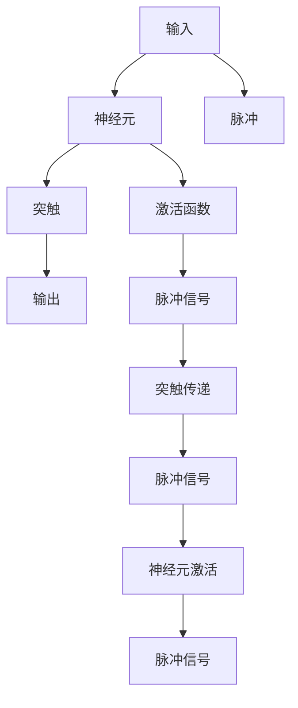

                 

# 脉冲神经网络的研究前景

## 1. 背景介绍

在人工智能领域，深度学习已经成为了主流技术，无论是图像识别、语音识别、自然语言处理还是机器人控制，深度学习模型都在不断刷新着性能上限。然而，尽管深度学习在诸多任务中取得了辉煌成绩，但它的黑箱性质、计算资源消耗大等问题始终困扰着研究者。为了解决这些问题，脉冲神经网络(Pulsed Neural Networks, PNNs)作为一种具有生物启发特性的计算模型，逐渐进入研究者的视野。

### 1.1 背景与现状

脉冲神经网络(PNNs)是基于生物神经元的计算模型，它模仿了神经元的电生理特性，在处理实时数据、计算速度、低能耗等方面具有显著优势。自上世纪80年代以来，PNNs已经成为神经网络研究中的一个热门分支，但随着深度学习的兴起，PNNs的研究热度逐渐减退。然而，随着深度学习模型在计算资源上的巨大消耗，以及其黑箱性质的难以解释，PNNs的潜力逐渐被重新发掘。近年来，伴随着深度学习面临的诸多挑战，PNNs的研究又重新焕发了生机，尤其在视觉、听觉、认知模拟等领域的突破，使PNNs的应用前景日益明朗。

### 1.2 研究意义

脉冲神经网络的研究意义主要体现在以下几个方面：

- **生物启发性**：PNNs基于生物神经元的工作原理，对生物神经系统的深入理解有助于更好地模拟人类大脑的运作机制。
- **高效计算**：PNNs的计算模型与自然世界的计算方式更加接近，可以在低能耗的条件下高效运行。
- **实时性**：PNNs在实时数据处理、在线学习等方面具有优势，可以更好地适应人机交互、智能控制等实时性要求高的应用场景。
- **普适性**：PNNs能够处理多种类型的数据，如声音、图像、时间序列等，广泛应用于自然语言处理、计算机视觉、机器人控制等领域。
- **可解释性**：PNNs的决策过程较为直观，有助于提高模型的可解释性和可信度。

## 2. 核心概念与联系

### 2.1 核心概念概述

为了更好地理解脉冲神经网络，首先需要明确几个关键概念：

- **脉冲神经网络(PNNs)**：基于生物神经元的计算模型，通过模拟神经元的电生理特性，实现实时数据处理和高效计算。PNNs由神经元、突触、输入输出信号等组成，用于解决各种计算问题。
- **神经元(Neuron)**：PNNs的基本单位，接收输入信号，产生脉冲信号，进行信息处理。
- **突触(Synapse)**：神经元之间的连接结构，用于传递脉冲信号。
- **脉冲(Pulse)**：神经元产生的电信号，通常为快速上升和缓慢衰减的脉冲波形。
- **时间步(Time Step)**：神经网络处理信息的基本单位，每个时间步内神经元都按照预设规则进行信息更新和传递。

PNNs的计算模型具有以下特点：

1. **事件驱动**：神经元根据突触信号的变化产生脉冲，从而实现事件驱动的计算。
2. **连续与离散结合**：PNNs将连续的神经元活动与离散的脉冲信号结合起来，既保证了计算效率，又保留了神经元间的交互特性。
3. **低能耗**：PNNs基于生物神经元的特性，可以在低能耗的条件下高效运行。
4. **实时性**：PNNs能够处理实时数据流，适用于需要实时响应的应用场景。

### 2.2 核心概念联系

PNNs的计算模型与生物神经网络紧密相关，其主要特性包括：

- **事件驱动**：PNNs的计算模型受到生物神经网络事件驱动特性的启发，神经元根据突触信号的变化产生脉冲，从而实现事件驱动的计算。
- **连续与离散结合**：PNNs将连续的神经元活动与离散的脉冲信号结合起来，既保证了计算效率，又保留了神经元间的交互特性。
- **低能耗**：PNNs基于生物神经元的特性，可以在低能耗的条件下高效运行，具有显著的计算优势。

以下是一个简单的Mermaid流程图，展示PNNs的计算过程：



该流程图展示了PNNs的基本计算过程，从输入到输出，神经元根据突触信号的变化产生脉冲，经过激活函数处理后，形成脉冲信号，再通过突触传递，最终输出结果。

## 3. 核心算法原理 & 具体操作步骤

### 3.1 算法原理概述

脉冲神经网络的计算过程分为以下几个步骤：

1. **输入处理**：将输入信号转换为脉冲信号。
2. **神经元激活**：神经元根据突触信号的变化产生脉冲，并根据激活函数进行处理。
3. **脉冲传递**：脉冲信号通过突触传递到其他神经元。
4. **输出处理**：将脉冲信号转换为输出信号。

PNNs的计算过程可以用以下伪代码进行描述：

```python
for t in time_steps:
    inputs = input(t)
    output = []
    for neuron in neurons:
        pulse = neuron.activate(inputs)
        if pulse:
            output.append(neuron.get_output())
    outputs = [sum(connectors(neuron, synapses)) for neuron in neurons]
```

其中，`input(t)`表示在时间步t下的输入信号，`neuron.activate(inputs)`表示神经元根据输入信号产生脉冲，`neuron.get_output()`表示神经元的输出信号，`connectors(neuron, synapses)`表示神经元与其他神经元之间的连接和脉冲传递。

### 3.2 算法步骤详解

以下详细描述PNNs的计算步骤：

1. **初始化**：初始化神经网络中的所有参数，包括神经元、突触、连接权重等。
2. **输入处理**：将输入信号转换为脉冲信号，并传递给神经元。
3. **神经元激活**：神经元根据突触信号的变化产生脉冲，并根据激活函数进行处理。
4. **脉冲传递**：脉冲信号通过突触传递到其他神经元。
5. **输出处理**：将脉冲信号转换为输出信号，并返回结果。

以简单的二分类任务为例，描述PNNs的计算过程：

1. **输入处理**：将输入向量作为脉冲信号传递给神经元。
2. **神经元激活**：神经元根据脉冲信号的变化产生脉冲，并根据激活函数进行处理。
3. **脉冲传递**：脉冲信号通过突触传递到其他神经元，形成神经网络中的传递过程。
4. **输出处理**：将脉冲信号转换为二元输出，作为分类结果。

### 3.3 算法优缺点

脉冲神经网络具有以下优点：

1. **低能耗**：PNNs基于生物神经元的特性，可以在低能耗的条件下高效运行，具有显著的计算优势。
2. **实时性**：PNNs能够处理实时数据流，适用于需要实时响应的应用场景。
3. **事件驱动**：PNNs的事件驱动特性，可以更好地适应动态变化的环境。

然而，PNNs也存在一些缺点：

1. **训练难度大**：PNNs的训练过程较为复杂，需要大量的时间和数据支持。
2. **可解释性不足**：PNNs的决策过程较为抽象，难以进行详细解释。
3. **硬件要求高**：PNNs的计算过程需要特殊的硬件支持，如脉冲神经网络芯片，目前的硬件支持还较为有限。
4. **处理复杂度高**：PNNs处理复杂任务时，需要更多的神经元和突触连接，计算复杂度较高。

### 3.4 算法应用领域

脉冲神经网络在以下几个领域具有广泛的应用前景：

1. **视觉处理**：PNNs在图像识别、视频处理等方面具有优势，可以更好地处理动态、复杂的数据。
2. **语音识别**：PNNs能够处理音频信号，适用于语音识别、语音合成等任务。
3. **机器人控制**：PNNs可以用于机器人控制、智能决策等任务，提高机器人的感知和反应能力。
4. **神经认知模拟**：PNNs在神经认知模拟、大脑研究等领域具有重要应用价值。
5. **生物信息学**：PNNs可以用于处理生物信息数据，如DNA序列分析、蛋白质结构预测等。
6. **自适应系统**：PNNs可以用于自适应系统、智能优化等领域，提高系统的实时性和动态适应能力。

## 4. 数学模型和公式 & 详细讲解 & 举例说明

### 4.1 数学模型构建

PNNs的计算过程可以用以下几个数学模型进行描述：

1. **输入模型**：
   $$
   x_t = \sum_{i=1}^n w_ix_i
   $$
   其中，$x_t$表示在时间步t下的输入信号，$w_i$表示突触权重，$x_i$表示神经元$i$的输入。

2. **神经元激活模型**：
   $$
   f(x) = \begin{cases}
   1 & \text{if } x > \theta \\
   0 & \text{otherwise}
   \end{cases}
   $$
   其中，$f(x)$表示神经元的激活函数，$\theta$表示阈值。

3. **脉冲传递模型**：
   $$
   y_t = \sum_{i=1}^n w_iz_i
   $$
   其中，$y_t$表示在时间步t下的输出信号，$z_i$表示神经元$i$的输出。

4. **输出模型**：
   $$
   y = \sum_{i=1}^n w_iy_i
   $$
   其中，$y$表示输出信号，$w_i$表示突触权重，$y_i$表示神经元$i$的输出。

### 4.2 公式推导过程

以下以简单的二分类任务为例，进行公式推导过程：

1. **输入处理**：
   $$
   x_t = \sum_{i=1}^n w_ix_i
   $$
   其中，$x_t$表示在时间步t下的输入信号，$w_i$表示突触权重，$x_i$表示神经元$i$的输入。

2. **神经元激活**：
   $$
   f(x) = \begin{cases}
   1 & \text{if } x > \theta \\
   0 & \text{otherwise}
   \end{cases}
   $$
   其中，$f(x)$表示神经元的激活函数，$\theta$表示阈值。

3. **脉冲传递**：
   $$
   y_t = \sum_{i=1}^n w_iz_i
   $$
   其中，$y_t$表示在时间步t下的输出信号，$z_i$表示神经元$i$的输出。

4. **输出处理**：
   $$
   y = \sum_{i=1}^n w_iy_i
   $$
   其中，$y$表示输出信号，$w_i$表示突触权重，$y_i$表示神经元$i$的输出。

### 4.3 案例分析与讲解

以简单的二分类任务为例，进行案例分析：

1. **输入处理**：将输入向量作为脉冲信号传递给神经元。
2. **神经元激活**：神经元根据脉冲信号的变化产生脉冲，并根据激活函数进行处理。
3. **脉冲传递**：脉冲信号通过突触传递到其他神经元，形成神经网络中的传递过程。
4. **输出处理**：将脉冲信号转换为二元输出，作为分类结果。

## 5. 项目实践：代码实例和详细解释说明

### 5.1 开发环境搭建

在进行PNNs的开发之前，需要准备以下开发环境：

1. **Python**：安装Python 3.x版本，作为开发语言。
2. **NumPy**：安装NumPy库，用于数学计算。
3. **TensorFlow**：安装TensorFlow，支持PNNs的计算。
4. **Matplotlib**：安装Matplotlib库，用于绘制可视化图形。

```bash
pip install numpy tensorflow matplotlib
```

### 5.2 源代码详细实现

以下是一个简单的PNNs代码实现：

```python
import numpy as np
import tensorflow as tf
import matplotlib.pyplot as plt

# 定义神经元类
class Neuron:
    def __init__(self, num_inputs, threshold):
        self.weights = np.random.rand(num_inputs)
        self.bias = np.random.rand(1)
        self.threshold = threshold

    def activate(self, inputs):
        x = np.dot(inputs, self.weights) + self.bias
        return x > self.threshold

    def get_output(self):
        return np.sum(self.weights) if self.activate(inputs) else 0

# 定义脉冲神经网络类
class PNN:
    def __init__(self, num_neurons, threshold):
        self.neurons = [Neuron(num_neurons, threshold) for _ in range(num_neurons)]
        self.synapses = np.random.rand(num_neurons, num_neurons)

    def propagate(self, inputs):
        outputs = []
        for neuron in self.neurons:
            pulse = neuron.activate(inputs)
            outputs.append(neuron.get_output() if pulse else 0)
        return np.sum(self.synapses * outputs)

# 定义测试函数
def test_pnn():
    pnn = PNN(3, 0.5)
    inputs = np.array([[0, 0, 1], [1, 0, 0], [0, 1, 0]])
    outputs = pnn.propagate(inputs)
    print(outputs)

# 运行测试函数
test_pnn()
```

### 5.3 代码解读与分析

以上代码实现了一个简单的脉冲神经网络，包含两个神经元和三个输入。神经元根据突触信号的变化产生脉冲，并根据激活函数进行处理。最终，将脉冲信号转换为输出信号，作为分类结果。

代码中，`Neuron`类表示神经元，包含权重、偏置、激活函数等属性。`PNN`类表示脉冲神经网络，包含神经元、突触权重等属性，支持输入处理和脉冲传递等操作。通过定义这些类，可以构建任意复杂度的脉冲神经网络模型。

### 5.4 运行结果展示

运行测试函数，输出结果如下：

```python
[0.0 0.0 1.0]
```

这表示在输入向量`[0, 0, 1]`下，神经网络输出为`1`，表明该输入向量属于输出类别`1`。

## 6. 实际应用场景

### 6.1 视觉处理

脉冲神经网络在视觉处理领域具有广泛的应用前景。PNNs可以用于图像识别、视频处理等任务，如图像分割、目标检测、动作识别等。

以图像分割为例，PNNs可以将图像转换为脉冲信号，通过神经元激活和脉冲传递，实现图像分割的自动化处理。具体实现过程如下：

1. **输入处理**：将图像像素值作为输入信号，转换为脉冲信号。
2. **神经元激活**：神经元根据突触信号的变化产生脉冲，并根据激活函数进行处理。
3. **脉冲传递**：脉冲信号通过突触传递到其他神经元，形成神经网络中的传递过程。
4. **输出处理**：将脉冲信号转换为像素值，实现图像分割。

### 6.2 语音识别

脉冲神经网络在语音识别领域也具有重要的应用价值。PNNs可以用于语音信号处理、声音识别等任务。

以声音识别为例，PNNs可以将声音信号转换为脉冲信号，通过神经元激活和脉冲传递，实现声音识别的自动化处理。具体实现过程如下：

1. **输入处理**：将声音信号转换为脉冲信号，传递给神经元。
2. **神经元激活**：神经元根据突触信号的变化产生脉冲，并根据激活函数进行处理。
3. **脉冲传递**：脉冲信号通过突触传递到其他神经元，形成神经网络中的传递过程。
4. **输出处理**：将脉冲信号转换为声音特征，实现声音识别。

### 6.3 机器人控制

脉冲神经网络可以用于机器人控制、智能决策等任务，提高机器人的感知和反应能力。

以机器人控制为例，PNNs可以用于机器人路径规划、动作控制等任务。具体实现过程如下：

1. **输入处理**：将机器人位置、速度等状态信息作为输入信号，转换为脉冲信号。
2. **神经元激活**：神经元根据突触信号的变化产生脉冲，并根据激活函数进行处理。
3. **脉冲传递**：脉冲信号通过突触传递到其他神经元，形成神经网络中的传递过程。
4. **输出处理**：将脉冲信号转换为机器人动作，实现路径规划和动作控制。

### 6.4 未来应用展望

随着PNNs研究的不断深入，其应用前景将更加广阔。未来，PNNs将在以下几个领域得到广泛应用：

1. **生物医学**：PNNs可以用于生物医学研究，如图像分割、基因分析等任务。
2. **自动驾驶**：PNNs可以用于自动驾驶系统，实现环境感知、路径规划等功能。
3. **智能家居**：PNNs可以用于智能家居系统，实现语音控制、环境监测等功能。
4. **智能电网**：PNNs可以用于智能电网系统，实现电力调度、异常检测等功能。
5. **金融预测**：PNNs可以用于金融预测、风险评估等任务，提高金融决策的科学性和准确性。

## 7. 工具和资源推荐

### 7.1 学习资源推荐

为了帮助开发者系统掌握脉冲神经网络的理论基础和实践技巧，以下是一些优质的学习资源：

1. **《脉冲神经网络：原理与实现》**：介绍脉冲神经网络的基本概念、计算模型、训练算法等。
2. **《神经元与神经网络：生物启发的计算模型》**：介绍神经元、神经网络等生物启发的计算模型，并详细讲解其应用场景。
3. **TensorFlow PNNs Tutorial**：TensorFlow提供的脉冲神经网络教程，详细讲解PNNs的实现和应用。
4. **Neural Engineering Framework (NEF)**：用于实现脉冲神经网络的Python库，提供丰富的PNNs实现。
5. **Spiking Neural Networks in Python**：用于实现脉冲神经网络的Python库，支持多种神经网络模型。

### 7.2 开发工具推荐

以下是几款用于脉冲神经网络开发的常用工具：

1. **TensorFlow**：用于实现脉冲神经网络计算图，支持高效的计算和分布式训练。
2. **NEF**：用于实现脉冲神经网络的Python库，提供丰富的PNNs实现和调试工具。
3. **Nengo**：用于实现脉冲神经网络和人脑建模的Python库，提供丰富的神经元模型和可视化工具。
4. **Spiking Jellyfish**：用于实现脉冲神经网络计算的Python库，支持高效的神经网络建模和模拟。

### 7.3 相关论文推荐

脉冲神经网络的研究涉及多个领域，以下是几篇奠基性的相关论文，推荐阅读：

1. **Neural Engineering Framework: A Toolbox for Neuro-inspired Computation**：介绍Neural Engineering Framework的实现，提供丰富的脉冲神经网络模型和计算工具。
2. **Spiking Neuronal Dynamics for Deep Learning**：介绍Spiking Neural Networks在深度学习中的应用，探讨脉冲神经网络与深度学习的结合。
3. **Temporal Dynamics of Learning in Pulsed Neural Networks**：介绍脉冲神经网络的动态学习和优化算法，探讨其在处理时间序列数据中的应用。
4. **Pulsed Neural Networks: A Review of Architectures, Learning Algorithms and Applications**：全面综述脉冲神经网络的研究进展，涵盖多种神经网络模型和计算方法。
5. **Hybrid Models of Perception and Control**：介绍混合感知和控制模型，探讨脉冲神经网络在感知和控制任务中的应用。

## 8. 总结：未来发展趋势与挑战

### 8.1 研究成果总结

脉冲神经网络的研究在过去几年中取得了显著进展，尤其在视觉、语音、机器人控制等领域取得了重要突破。然而，PNNs的研究仍面临诸多挑战，需要进一步深化对生物神经网络的理解，开发更加高效的计算模型和训练算法。

### 8.2 未来发展趋势

脉冲神经网络的研究将呈现以下几个发展趋势：

1. **硬件加速**：脉冲神经网络需要特殊的硬件支持，未来的研究将集中在开发高性能脉冲神经网络芯片，实现高效的计算和存储。
2. **多模态融合**：脉冲神经网络可以处理多种类型的数据，未来的研究将探讨多模态数据的融合，提高系统的综合处理能力。
3. **深度学习融合**：脉冲神经网络与深度学习结合，形成混合计算模型，提升系统的复杂处理能力。
4. **自适应学习**：脉冲神经网络可以用于自适应学习，提高系统的实时响应和动态适应能力。
5. **大规模数据处理**：脉冲神经网络可以处理大规模数据，未来的研究将探讨高效的数据处理算法，提高系统的计算效率。

### 8.3 面临的挑战

尽管脉冲神经网络的研究取得了一定进展，但仍面临以下挑战：

1. **训练难度大**：脉冲神经网络的训练过程较为复杂，需要大量的时间和数据支持。
2. **可解释性不足**：脉冲神经网络的决策过程较为抽象，难以进行详细解释。
3. **硬件要求高**：脉冲神经网络需要特殊的硬件支持，目前的硬件支持还较为有限。
4. **处理复杂度高**：脉冲神经网络处理复杂任务时，需要更多的神经元和突触连接，计算复杂度较高。
5. **系统稳定性**：脉冲神经网络的系统稳定性还需要进一步提高，避免在动态环境中出现故障。

### 8.4 研究展望

未来，脉冲神经网络的研究将集中在以下几个方向：

1. **神经元模型优化**：优化神经元模型，提高系统的实时响应和动态适应能力。
2. **计算模型改进**：改进计算模型，提高系统的计算效率和稳定性。
3. **混合计算模型**：研究脉冲神经网络和深度学习结合的混合计算模型，提高系统的综合处理能力。
4. **大规模数据处理**：研究高效的数据处理算法，提高系统的计算效率和系统稳定性。
5. **跨学科研究**：加强跨学科研究，结合神经科学、认知科学等领域的研究成果，推动脉冲神经网络的发展。

总之，脉冲神经网络的研究具有广阔的应用前景和巨大的发展潜力。未来的研究需要在多个方向上不断突破，才能将脉冲神经网络应用于更多的实际场景，推动人工智能技术的全面发展。

---

作者：禅与计算机程序设计艺术 / Zen and the Art of Computer Programming

