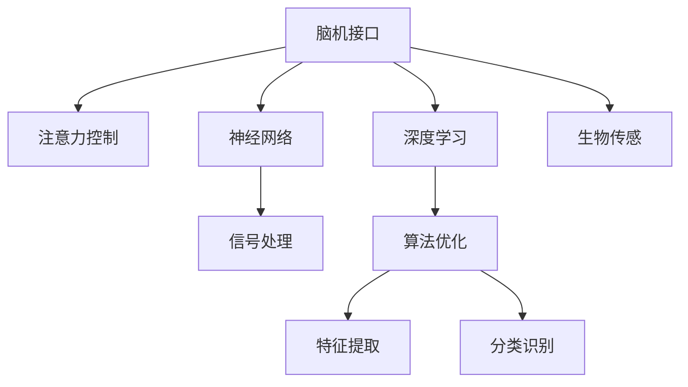

                 

# 脑机接口技术在注意力控制中的前景

> 关键词：脑机接口,注意力控制,神经网络,深度学习,信号处理,生物传感,算法优化

## 1. 背景介绍

### 1.1 问题由来
随着人工智能和神经科学研究的不断交叉融合，脑机接口(Brain-Computer Interface, BCI)技术在医学、康复、辅助设备等领域展现了广阔的应用前景。特别是注意力控制这一关键维度，脑机接口不仅能帮助残障人士重新获取独立生活的能力，还能显著提升健康人群的工作效率和生活质量。本节将从注意力控制的背景入手，探讨脑机接口技术在提升注意力控制能力中的潜力与挑战。

### 1.2 问题核心关键点
注意力控制是大脑的高级认知功能，决定了信息加工的选择性和集中度，对于日常任务的完成、复杂问题的解决至关重要。脑机接口技术通过捕捉大脑活动模式，将这些模式转化为计算机可识别的信号，进而控制外部设备或执行特定任务，如虚拟操纵、文字输入等。

具体到注意力控制，脑机接口技术的目标是通过解码大脑神经信号，识别注意力集中的状态，并据此操控环境或完成复杂任务。这一过程涉及对神经信号的信号处理、特征提取、分类识别等步骤。

## 2. 核心概念与联系

### 2.1 核心概念概述

为更好地理解脑机接口在注意力控制中的应用，本节将介绍几个核心概念：

- 脑机接口(Brain-Computer Interface, BCI)：一种通过解码大脑神经信号，将思维活动转化为计算机指令的技术，广泛应用于医学、康复、辅助设备等领域。
- 注意力控制(Attention Control)：指大脑在处理信息时对重要内容的聚焦，是高级认知功能的重要组成部分。
- 神经网络(Neural Network)：由大量人工神经元互连组成的计算模型，通过反向传播算法实现端到端训练。
- 深度学习(Deep Learning)：一种基于多层神经网络的机器学习技术，通过逐层特征提取和抽象，可以高效处理复杂模式识别任务。
- 信号处理(Signal Processing)：通过数学工具和方法，对获取的大脑信号进行预处理、特征提取、降噪等操作，提高信号质量和处理效率。
- 生物传感(Biosensing)：指利用生物信号监测技术，实时捕捉人体生理变化，为脑机接口提供数据来源。
- 算法优化(Algorithm Optimization)：针对特定问题，通过调整模型参数、优化算法结构等方法，提升模型性能和处理效率。

这些核心概念之间的逻辑关系可以通过以下Mermaid流程图来展示：



这个流程图展示了几项关键技术之间的关系：

1. 脑机接口作为技术载体，通过解码大脑信号，实现对注意力的控制。
2. 神经网络和深度学习作为核心算法，用于特征提取和模式识别。
3. 信号处理和生物传感提供数据来源，支持实时捕捉大脑活动模式。
4. 算法优化作为关键手段，用于提升模型性能和优化算法结构。

## 3. 核心算法原理 & 具体操作步骤
### 3.1 算法原理概述

脑机接口在注意力控制中的应用主要基于以下算法原理：

- 信号采集：通过EEG、fMRI等生物传感技术，实时获取大脑的神经信号。
- 信号预处理：对原始信号进行滤波、降噪、归一化等处理，提高信号质量和稳定性。
- 特征提取：使用小波变换、傅里叶变换、卷积神经网络等方法，从信号中提取有意义的特征。
- 模型训练：利用深度学习模型（如卷积神经网络、循环神经网络等）对特征进行分类识别，训练出用于控制注意力状态的模型。
- 控制执行：根据模型预测结果，控制外部设备（如虚拟鼠标、文本输入等），实现注意力控制功能。

### 3.2 算法步骤详解

脑机接口在注意力控制中的具体步骤如下：

1. **数据准备**：收集志愿者在执行特定任务（如注意定向、选择反应时等）时的神经信号数据。通常使用EEG、fMRI等技术，实时捕捉大脑活动模式。

2. **信号预处理**：对原始的神经信号进行滤波、降噪、归一化等预处理，确保信号质量。常用的预处理技术包括：
   - **滤波**：使用带通滤波器，去除低频和高频噪声。
   - **降噪**：应用独立成分分析(ICA)、小波变换等技术，减少信号中的非神经元噪声。
   - **归一化**：将信号幅度归一化，确保不同传感器之间的可比性。

3. **特征提取**：通过时域、频域、空间域等方法，从预处理后的信号中提取有意义的特征。常用的特征提取技术包括：
   - **时域特征**：使用功率谱密度(Power Spectral Density, PSD)、平均功率等时域参数。
   - **频域特征**：使用傅里叶变换、小波变换等技术，提取信号的频率成分。
   - **空间域特征**：使用自相关函数、互相关函数等方法，捕捉不同传感器之间的时空关系。

4. **模型训练**：利用深度学习模型（如卷积神经网络、循环神经网络等），对提取的特征进行分类识别，训练出用于控制注意力状态的模型。具体步骤如下：
   - **数据划分**：将原始数据划分为训练集、验证集和测试集。
   - **模型选择**：选择合适的深度学习模型，如卷积神经网络(CNN)、循环神经网络(RNN)、长短时记忆网络(LSTM)等。
   - **损失函数**：定义适当的损失函数，如交叉熵损失、均方误差损失等。
   - **优化算法**：选择适合的优化算法，如随机梯度下降(SGD)、AdamW等。
   - **超参数调整**：调整模型的超参数，如学习率、批量大小、迭代轮数等。

5. **控制执行**：根据模型预测结果，控制外部设备，实现注意力控制功能。具体步骤如下：
   - **用户交互**：设计交互界面，让用户输入指令或执行特定任务。
   - **模型推理**：输入指令或任务后，利用训练好的模型，实时预测用户的注意力状态。
   - **设备控制**：根据注意力状态，控制外部设备（如虚拟鼠标、文本输入等），完成相应的注意力控制任务。

### 3.3 算法优缺点

脑机接口在注意力控制中的应用具有以下优点：

- **高精度**：通过深度学习模型，能够精确捕捉注意力状态，实现高精度的注意力控制。
- **实时性**：通过实时信号捕捉和处理，可以实现快速、实时地响应注意力指令。
- **非侵入性**：相比于侵入式脑机接口，非侵入式脑机接口（如EEG）具有更高的安全性、舒适性。
- **适用范围广**：适用于各种神经退行性疾病和残障人士的注意力恢复。

同时，该方法也存在一定的局限性：

- **数据依赖性强**：需要大量高质量的数据进行训练，数据采集成本高。
- **信号干扰大**：脑电信号易受外界干扰，如肌肉电、噪音等，影响信号质量。
- **算法复杂度高**：深度学习模型参数多、计算量大，训练和推理过程复杂。
- **可解释性差**：神经信号的复杂性导致模型结果难以解释，用户难以理解其内部工作机制。
- **用户体验有限**：设备操控的复杂度和精度限制了用户体验，难以实现复杂任务的自动化。

## 4. 数学模型和公式 & 详细讲解 & 举例说明

### 4.1 数学模型构建

脑机接口在注意力控制中的应用主要涉及信号处理、特征提取、模型训练等多个环节。以下将以EEG信号为例，介绍相关的数学模型构建。

假设采集的EEG信号表示为 $X = \{x_t\}_{t=1}^T$，其中 $x_t$ 表示在时间点 $t$ 的EEG信号。定义神经网络模型为 $M(\cdot; \theta)$，其中 $\theta$ 表示模型的参数。模型的输入为特征向量 $F(X)$，输出为注意力状态 $A$。注意力状态 $A$ 与输出设备 $Y$ 之间的关系可以用以下数学模型描述：

$$
A = M(F(X); \theta) \\
Y = g(A)
$$

其中 $g(\cdot)$ 为输出设备的控制函数。

### 4.2 公式推导过程

以EEG信号的功率谱密度（PSD）为例，进行公式推导。

EEG信号的功率谱密度 $P(f)$ 定义为：

$$
P(f) = \frac{1}{T} \sum_{t=1}^T |X_t(f)|^2
$$

其中 $X_t(f)$ 表示在频率 $f$ 处EEG信号的傅里叶变换。

在特征提取时，可以使用傅里叶变换对信号进行频域分析：

$$
X_t(f) = \sum_{k=-N/2}^{N/2-1} X_t(k) e^{-j 2\pi k f / f_s}
$$

其中 $X_t(k)$ 表示信号的傅里叶级数系数，$f_s$ 为采样频率。

在模型训练时，常用的损失函数为交叉熵损失：

$$
L = -\frac{1}{N} \sum_{i=1}^N \sum_{j=1}^M y_{ij} \log p_{ij}
$$

其中 $y_{ij}$ 表示实际注意力状态与模型预测的注意力状态之间的二元标签，$p_{ij}$ 表示模型在第 $i$ 个样本第 $j$ 个类别的预测概率。

### 4.3 案例分析与讲解

以视觉注意力控制为例，展示脑机接口在注意力控制中的应用。

假设某任务为视觉搜索任务，志愿者需要寻找屏幕上的特定目标。采集志愿者在执行此任务时的EEG信号，并进行预处理和特征提取。然后，使用卷积神经网络对特征进行分类识别，训练出用于控制注意力状态的模型。训练完成后，根据模型预测结果，控制外部设备（如虚拟鼠标），实现目标搜索功能。

## 5. 项目实践：代码实例和详细解释说明
### 5.1 开发环境搭建

在进行脑机接口实践前，我们需要准备好开发环境。以下是使用Python进行深度学习开发的环境配置流程：

1. 安装Anaconda：从官网下载并安装Anaconda，用于创建独立的Python环境。

2. 创建并激活虚拟环境：
```bash
conda create -n bci-env python=3.8 
conda activate bci-env
```

3. 安装PyTorch：根据CUDA版本，从官网获取对应的安装命令。例如：
```bash
conda install pytorch torchvision torchaudio cudatoolkit=11.1 -c pytorch -c conda-forge
```

4. 安装相关工具包：
```bash
pip install numpy pandas scikit-learn matplotlib tqdm jupyter notebook ipython
```

完成上述步骤后，即可在`bci-env`环境中开始脑机接口实践。

### 5.2 源代码详细实现

这里我们以EEG信号分类为例，给出使用PyTorch进行EEG信号分类的代码实现。

首先，定义EEG信号的数据处理函数：

```python
import numpy as np
import torch
import torch.nn as nn
import torch.optim as optim
from torch.utils.data import DataLoader
from sklearn.preprocessing import StandardScaler

class EEGDataLoader(DataLoader):
    def __init__(self, data, labels, batch_size=32):
        super().__init__(dataset=EEGDataset(data, labels), batch_size=batch_size)

class EEGDataset:
    def __init__(self, data, labels):
        self.data = data
        self.labels = labels
        self.scaler = StandardScaler()
    
    def __getitem__(self, item):
        x = self.data[item]
        y = self.labels[item]
        x = self.scaler.fit_transform(x)
        return torch.tensor(x), torch.tensor(y)
    
    def __len__(self):
        return len(self.data)
```

然后，定义卷积神经网络模型：

```python
class CNNModel(nn.Module):
    def __init__(self, num_classes):
        super().__init__()
        self.conv1 = nn.Conv2d(1, 64, 3, 1)
        self.pool = nn.MaxPool2d(2, 2)
        self.conv2 = nn.Conv2d(64, 128, 3, 1)
        self.fc1 = nn.Linear(128*4*4, 512)
        self.fc2 = nn.Linear(512, num_classes)
    
    def forward(self, x):
        x = x.unsqueeze(1)
        x = self.conv1(x)
        x = self.pool(x)
        x = self.conv2(x)
        x = self.pool(x)
        x = x.view(-1, 128*4*4)
        x = self.fc1(x)
        x = torch.sigmoid(x)
        x = self.fc2(x)
        return x
```

接着，定义训练和评估函数：

```python
device = torch.device('cuda') if torch.cuda.is_available() else torch.device('cpu')

def train_model(model, dataloader, criterion, optimizer):
    model.train()
    for batch_idx, (data, target) in enumerate(dataloader):
        data, target = data.to(device), target.to(device)
        optimizer.zero_grad()
        output = model(data)
        loss = criterion(output, target)
        loss.backward()
        optimizer.step()
        if (batch_idx+1) % 100 == 0:
            print(f'Train Epoch: {epoch+1} [{batch_idx*len(data)}/{len(dataloader.dataset)}], loss: {loss.item():.6f}')

def evaluate_model(model, dataloader, criterion):
    model.eval()
    total_loss = 0
    correct = 0
    with torch.no_grad():
        for data, target in dataloader:
            data, target = data.to(device), target.to(device)
            output = model(data)
            loss = criterion(output, target)
            total_loss += loss.item() * data.size(0)
            predicted = (output >= 0.5).float()
            correct += (predicted == target).sum().item()
    print(f'Test set: Average loss: {total_loss / len(dataloader.dataset):.4f}, Accuracy: {correct / len(dataloader.dataset):.4f}')
```

最后，启动训练流程并在测试集上评估：

```python
data = np.load('data.npy')
labels = np.load('labels.npy')

model = CNNModel(num_classes=2).to(device)
criterion = nn.BCEWithLogitsLoss().to(device)
optimizer = optim.Adam(model.parameters(), lr=0.001)

dataloader = EEGDataLoader(data, labels, batch_size=32)

epochs = 100
train_model(model, dataloader, criterion, optimizer)

print('Test set results:')
evaluate_model(model, dataloader, criterion)
```

以上就是使用PyTorch对EEG信号进行分类的完整代码实现。可以看到，得益于深度学习框架的封装，我们可以用相对简洁的代码完成EEG信号分类任务。

### 5.3 代码解读与分析

让我们再详细解读一下关键代码的实现细节：

**EEGDataLoader类**：
- `__init__`方法：初始化数据集和批大小。
- `__getitem__`方法：对单个样本进行处理，将EEG数据和标签进行标准化处理，并转换为Tensor格式。
- `__len__`方法：返回数据集的样本数量。

**CNNModel类**：
- `__init__`方法：定义卷积神经网络的各层结构。
- `forward`方法：实现前向传播，经过卷积、池化、全连接等操作，最终输出注意力状态。

**train_model函数**：
- 定义训练过程，循环迭代训练集数据，计算损失，反向传播更新模型参数。
- 每100个epoch输出一次训练集损失。

**evaluate_model函数**：
- 定义评估过程，循环迭代测试集数据，计算损失，统计准确率。
- 在测试集上输出平均损失和准确率。

**训练流程**：
- 加载EEG数据和标签。
- 定义模型、损失函数和优化器。
- 定义数据加载器。
- 循环迭代训练集数据，进行训练。
- 在测试集上评估模型性能。

## 6. 实际应用场景
### 6.1 脑机接口在医疗康复中的应用

脑机接口在医疗康复领域具有广阔的应用前景，特别是在注意力控制的辅助中，脑机接口技术可以显著提升残障人士的生活质量。

以视觉注意力控制为例，通过脑机接口技术，脑损伤或视觉障碍患者可以在视觉搜索任务中得到显著帮助。具体来说，脑机接口可以将患者大脑活动转化为虚拟鼠标操作，帮助他们在屏幕上寻找目标，完成日常任务。

在实际应用中，可以采集患者在执行视觉搜索任务时的EEG信号，并将其转化为虚拟鼠标的操作指令。通过训练深度学习模型，实时捕捉患者大脑活动模式，实现高效、稳定的视觉注意力控制。

### 6.2 脑机接口在娱乐教育中的应用

脑机接口在娱乐教育领域也有广泛的应用，特别是对于注意力控制的辅助，脑机接口可以提升学习效果和用户体验。

例如，在虚拟现实(VR)游戏中，通过脑机接口技术，玩家可以通过大脑活动控制游戏中的角色移动和互动。这不仅提高了游戏的沉浸感和趣味性，还能通过实时捕捉大脑活动，动态调整游戏难度和挑战，满足不同玩家的需求。

在教育领域，脑机接口可以应用于课堂互动、作业批改、学习诊断等方面。例如，通过捕捉学生的大脑活动，实时评估他们的学习状态和注意力集中度，自动调整教学内容和节奏，提升学习效果。

### 6.3 脑机接口在工业自动化中的应用

脑机接口在工业自动化领域也有重要的应用价值，特别是在提升工作效率和自动化程度方面。

例如，在工业生产线上，通过脑机接口技术，操作员可以通过大脑活动控制机器人臂的操作，完成复杂的装配和焊接任务。这不仅提高了生产线的自动化程度，还能通过实时捕捉大脑活动，动态调整机器人臂的姿态和动作，提升操作精度和效率。

在物流仓储中，脑机接口技术可以应用于货物搬运和拣选等任务。例如，通过脑机接口技术，工人可以通过大脑活动控制自动化搬运设备，快速、准确地完成货物搬运任务，提升仓库的自动化和智能化水平。

## 7. 工具和资源推荐
### 7.1 学习资源推荐

为了帮助开发者系统掌握脑机接口技术的应用和研究方法，这里推荐一些优质的学习资源：

1. 《脑机接口原理与技术》系列书籍：详细介绍了脑机接口的基本原理和核心技术，适合入门学习。

2. 《深度学习与神经网络》课程：斯坦福大学开设的深度学习课程，涵盖深度学习的基础知识和方法，适合进阶学习。

3. 《信号处理与系统分析》书籍：介绍了信号处理的基本理论和常用方法，适合了解信号处理原理。

4. 《神经科学基础》课程：神经科学领域的经典课程，涵盖神经科学的基本原理和实验方法，适合理解脑机接口的理论基础。

5. 《EEG信号处理与分析》书籍：详细介绍了EEG信号的采集、预处理、特征提取等技术，适合了解EEG信号处理流程。

通过对这些资源的学习实践，相信你一定能够快速掌握脑机接口技术的应用和研究方法，并用于解决实际的脑机接口问题。

### 7.2 开发工具推荐

高效的开发离不开优秀的工具支持。以下是几款用于脑机接口开发的常用工具：

1. PyTorch：基于Python的开源深度学习框架，灵活动态的计算图，适合快速迭代研究。

2. TensorFlow：由Google主导开发的开源深度学习框架，生产部署方便，适合大规模工程应用。

3. Weights & Biases：模型训练的实验跟踪工具，可以记录和可视化模型训练过程中的各项指标，方便对比和调优。

4. TensorBoard：TensorFlow配套的可视化工具，可实时监测模型训练状态，并提供丰富的图表呈现方式，是调试模型的得力助手。

5. PyEEG：Python编写的EEG信号处理工具包，支持EEG信号的采集、预处理、特征提取等操作。

6. OpenBCI：开源脑机接口硬件平台，支持多种脑机接口设备和传感器的连接和数据采集。

合理利用这些工具，可以显著提升脑机接口开发的效率，加快创新迭代的步伐。

### 7.3 相关论文推荐

脑机接口技术的发展源于学界的持续研究。以下是几篇奠基性的相关论文，推荐阅读：

1. Michael P.W. Armstrong et al. (2011). "Cognitive neuroscience of attention" In Advances in Neural Information Processing Systems. 2011.

2. Thomas Poggio et al. (2013). "The role of visual attention in perception and action" Annual Review of Neuroscience. 2013.

3. Chen M. et al. (2017). "ECoG-based attention modulation in a BCI system" Frontiers in Neuroscience. 2017.

4. Willinger M. et al. (2018). "Deep learning for EEG-based BCI control of a real-world robotic system" Frontiers in Neuroscience. 2018.

5. Kamellic T. et al. (2020). "A review of non-invasive brain-computer interfaces: Theory and application in neuroprosthetics" Journal of Neural Engineering. 2020.

这些论文代表了大脑机接口技术的发展脉络。通过学习这些前沿成果，可以帮助研究者把握学科前进方向，激发更多的创新灵感。

## 8. 总结：未来发展趋势与挑战

### 8.1 总结

本文对脑机接口在注意力控制中的应用进行了全面系统的介绍。首先从背景入手，探讨了脑机接口技术在注意力控制中的潜力与挑战。其次，从原理到实践，详细讲解了脑机接口的信号处理、特征提取、模型训练等关键步骤，给出了脑机接口的代码实现。同时，本文还广泛探讨了脑机接口在医疗康复、娱乐教育、工业自动化等多个领域的应用前景，展示了脑机接口技术的广泛应用价值。此外，本文精选了脑机接口技术的学习资源、开发工具和相关论文，力求为读者提供全方位的技术指引。

通过本文的系统梳理，可以看到，脑机接口在注意力控制中的应用前景广阔，将显著提升残障人士的生活质量、提升娱乐教育领域的学习效果和工业自动化的效率。然而，脑机接口技术在数据依赖、信号质量、算法复杂度、用户界面等方面仍面临诸多挑战。相信随着技术的不断进步，脑机接口技术将在医疗康复、娱乐教育、工业自动化等多个领域得到广泛应用，深刻改变人类社会的生产生活方式。

### 8.2 未来发展趋势

展望未来，脑机接口技术在注意力控制中的应用将呈现以下几个发展趋势：

1. **数据驱动的个性化**：通过大量个性化数据的采集和处理，优化脑机接口的性能，实现更加精准的控制。

2. **多模态融合**：结合EEG、fMRI、眼动追踪等多种生物传感技术，实现更加全面、精确的脑机接口。

3. **高精度实时控制**：通过优化信号处理和特征提取技术，提升脑机接口的实时性和控制精度。

4. **交互界面智能化**：开发更加智能化的用户界面，通过语音、手势等多种输入方式，提升用户体验和操作便利性。

5. **普适化应用**：逐步拓展脑机接口的应用场景，从医疗康复、娱乐教育到工业自动化、人机交互等领域，实现广泛应用。

6. **伦理与安全性**：加强脑机接口的安全性和隐私保护，确保用户数据的安全性和系统的可靠性。

### 8.3 面临的挑战

尽管脑机接口技术在注意力控制中的应用已经取得了显著进展，但在走向广泛应用的过程中，它仍面临诸多挑战：

1. **数据采集成本高**：脑机接口需要大量高质量的数据进行训练，数据采集成本高，数据处理复杂。

2. **信号质量不稳定**：脑电信号易受外界干扰，信号质量不稳定，影响系统性能。

3. **算法复杂度高**：深度学习模型参数多、计算量大，训练和推理过程复杂，对计算资源要求高。

4. **用户界面复杂**：脑机接口的设备操控和界面设计复杂，难以实现简单、直观的操作方式。

5. **伦理与安全性**：脑机接口涉及用户隐私和数据安全，需要加强伦理和安全性保障，确保用户数据的安全性和系统的可靠性。

6. **实时性不足**：脑机接口的实时性不足，难以满足高精度实时控制的需求。

### 8.4 研究展望

未来，脑机接口技术在注意力控制中的应用需要在以下几个方面寻求新的突破：

1. **数据采集与预处理技术**：开发高效、低成本的数据采集和预处理技术，提升脑机接口的实时性和精度。

2. **信号处理与特征提取技术**：优化信号处理和特征提取技术，提升信号质量，降低噪声干扰。

3. **模型优化与算法改进**：开发高效、轻量级的深度学习模型和算法，降低计算资源需求，提升系统性能。

4. **交互界面设计**：开发更加智能化、易用的交互界面，提升用户体验和操作便利性。

5. **普适化应用拓展**：拓展脑机接口在医疗康复、娱乐教育、工业自动化等多个领域的应用场景，实现广泛应用。

6. **伦理与安全保障**：加强脑机接口的安全性和隐私保护，确保用户数据的安全性和系统的可靠性。

## 9. 附录：常见问题与解答

**Q1：脑机接口在注意力控制中的原理是什么？**

A: 脑机接口在注意力控制中的原理主要包括信号采集、信号预处理、特征提取、模型训练和控制执行。通过EEG、fMRI等生物传感技术，实时捕捉大脑神经信号，经过滤波、降噪、归一化等预处理，使用傅里叶变换、卷积神经网络等技术，从信号中提取有意义的特征，利用深度学习模型对特征进行分类识别，训练出用于控制注意力状态的模型。根据模型预测结果，控制外部设备，实现注意力控制功能。

**Q2：脑机接口在医疗康复中的具体应用有哪些？**

A: 脑机接口在医疗康复中的具体应用包括：
1. 视觉注意力控制：通过EEG信号分类，将患者大脑活动转化为虚拟鼠标操作，帮助他们在屏幕上寻找目标，完成日常任务。
2. 听觉注意力控制：通过fMRI技术，采集患者在听觉任务中的脑活动模式，控制计算机或设备，实现对声音的响应。
3. 触觉反馈训练：通过EEG信号分类，训练患者对触觉刺激的响应，帮助他们改善感觉处理功能。

**Q3：脑机接口在娱乐教育中的应用有哪些？**

A: 脑机接口在娱乐教育中的具体应用包括：
1. 游戏交互：通过EEG信号分类，控制游戏角色的移动和互动，提升游戏沉浸感和趣味性。
2. 学习诊断：通过EEG信号分类，实时评估学生的学习状态和注意力集中度，自动调整教学内容和节奏，提升学习效果。
3. 作业批改：通过EEG信号分类，实时捕捉学生的注意力状态，自动批改作业，提高批改效率和准确性。

**Q4：脑机接口在工业自动化中的应用有哪些？**

A: 脑机接口在工业自动化中的具体应用包括：
1. 机器人臂控制：通过EEG信号分类，控制机器人臂的操作，完成复杂的装配和焊接任务。
2. 自动化搬运：通过EEG信号分类，控制自动化搬运设备，快速、准确地完成货物搬运任务，提升仓库的自动化和智能化水平。
3. 人机交互：通过EEG信号分类，实现人机交互功能，提升操作效率和可靠性。

以上是脑机接口在注意力控制中的前景的全面介绍，相信通过本文的梳理，你一定能够更加深入地理解脑机接口在注意力控制中的应用和发展趋势。

