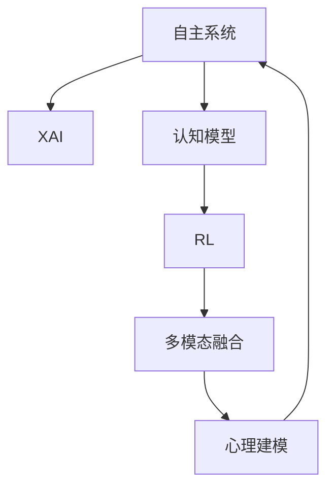

                 

# 自主系统与意识功能的整合

在当今的科技飞速发展的时代，自主系统与意识功能的整合已成为人工智能(AI)领域的一个热点。本文将深入探讨这一问题，分析其核心概念、关键算法、应用场景，以及未来的发展趋势与面临的挑战。

## 1. 背景介绍

### 1.1 问题由来

自主系统（Autonomous Systems）指的是一类无需人类直接干预即可自主运行的系统。这些系统涵盖了从简单的自动化设备到复杂的智能系统，如无人驾驶汽车、自动驾驶无人机、智能家居等。近年来，随着深度学习、计算机视觉、自然语言处理等技术的突破，自主系统在功能上得到了显著的提升，使得其应用场景更加广泛。

然而，虽然自主系统的智能化水平不断提升，但其决策过程缺乏透明的解释和理解，这使得人们对其行为产生了一定的不信任感。尤其是在医疗、金融等高风险领域，这种不信任感尤为突出。因此，如何让自主系统具备意识功能，使其行为更加透明、可解释，成为当前AI研究的重要课题。

### 1.2 问题核心关键点

当前，自主系统与意识功能的整合主要通过以下几个关键技术实现：

1. **解释性AI（XAI）**：通过可解释性技术，使得自主系统在做出决策时能够提供详细的推理过程和解释，增强决策的透明性和可信度。

2. **认知模型**：构建能够模拟人类认知过程的模型，帮助自主系统更好地理解环境，做出更加符合人类期望的决策。

3. **多模态融合**：将视觉、听觉、触觉等多种感官信息进行融合，使自主系统具备更全面的感知能力，提高决策的准确性和鲁棒性。

4. **心理建模**：通过模拟人类的心理状态，使得自主系统能够在复杂的社会环境中更好地适应和互动。

5. **强化学习（RL）**：通过与环境的交互，自主系统能够不断学习并优化决策策略，提升系统性能。

### 1.3 问题研究意义

自主系统与意识功能的整合对于提升系统的智能化水平、增加其可信度和安全性具有重要意义。具体体现在以下几个方面：

1. **透明性**：提高自主系统的透明性和可解释性，有助于消除用户对系统行为的疑虑，提升用户信任度。

2. **鲁棒性**：通过认知模型和心理建模，增强系统对环境的理解，使其决策更加鲁棒、适应性更强。

3. **可靠性**：利用强化学习技术，使得自主系统能够通过与环境的交互不断学习和优化，提高系统性能和可靠性。

4. **泛化能力**：通过多模态融合和心理建模，使系统能够更好地适应复杂多变的环境，提升泛化能力。

5. **道德和伦理**：通过心理建模和XAI技术，使自主系统能够更好地遵循人类的道德和伦理规范，避免负面影响。

## 2. 核心概念与联系

### 2.1 核心概念概述

在深入分析自主系统与意识功能整合之前，首先需要理解相关核心概念：

- **自主系统（Autonomous Systems）**：指无需人类直接干预即可自主运行的系统，涵盖从自动化设备到智能系统。

- **解释性AI（XAI）**：指通过可解释性技术，使得AI模型的决策过程透明、可理解，增强系统的可信度。

- **认知模型（Cognitive Model）**：指用于模拟人类认知过程的模型，如感知、记忆、推理等。

- **强化学习（RL）**：指通过与环境交互，自主系统通过奖励和惩罚机制不断优化决策策略的机器学习技术。

- **多模态融合（Multi-modal Fusion）**：指将不同模态的信息进行融合，如视觉、听觉、触觉等，提升系统感知能力。

- **心理建模（Psychological Modeling）**：指通过模拟人类的心理状态，使系统更好地理解环境和社会。

这些核心概念之间存在紧密联系，共同构成了自主系统与意识功能整合的技术框架。

### 2.2 核心概念原理和架构的 Mermaid 流程图



这个流程图展示了自主系统与意识功能整合的核心概念及其关系：自主系统通过XAI、认知模型、RL、多模态融合和心理建模技术，不断学习和优化，提升决策透明度和可信度，增强系统适应性和泛化能力。

## 3. 核心算法原理 & 具体操作步骤

### 3.1 算法原理概述

自主系统与意识功能的整合，本质上是一个通过多学科技术交叉融合，提升系统智能水平和可信度的过程。其核心算法包括以下几个方面：

1. **解释性AI（XAI）**：通过可解释性技术，使得自主系统在做出决策时能够提供详细的推理过程和解释，增强决策的透明性和可信度。

2. **认知模型**：构建能够模拟人类认知过程的模型，帮助自主系统更好地理解环境，做出更加符合人类期望的决策。

3. **强化学习（RL）**：通过与环境的交互，自主系统能够不断学习并优化决策策略，提升系统性能。

4. **多模态融合**：将视觉、听觉、触觉等多种感官信息进行融合，使自主系统具备更全面的感知能力，提高决策的准确性和鲁棒性。

5. **心理建模**：通过模拟人类的心理状态，使得自主系统能够在复杂的社会环境中更好地适应和互动。

### 3.2 算法步骤详解

**步骤1：数据收集与预处理**

- **数据收集**：收集系统运行环境中的多模态数据，如视觉图像、语音、触觉等。
- **数据预处理**：对收集到的数据进行清洗、归一化、标注等预处理操作，确保数据的准确性和一致性。

**步骤2：构建认知模型**

- **感知模型**：构建用于模拟人类感知的模型，如卷积神经网络（CNN）、循环神经网络（RNN）等，用于处理视觉、听觉等输入。
- **记忆模型**：构建用于模拟人类记忆的模型，如长短期记忆网络（LSTM）等，用于存储和处理历史信息。
- **推理模型**：构建用于模拟人类推理的模型，如逻辑推理网络等，用于根据已有的信息和经验做出决策。

**步骤3：解释性AI（XAI）**

- **特征提取**：从输入数据中提取关键特征，如颜色、形状、语音情感等。
- **决策解释**：通过可解释性技术，如LIME、SHAP等，对系统决策过程进行解释，生成可理解的推理路径。
- **透明度增强**：利用可视化工具，将决策解释结果呈现给用户，增加系统的透明度。

**步骤4：强化学习（RL）**

- **环境建模**：构建系统的运行环境模型，如状态转移图、奖励函数等。
- **决策优化**：使用强化学习算法，如Q-learning、深度Q网络（DQN）等，优化系统的决策策略。
- **反馈机制**：建立反馈机制，根据环境对系统决策的奖励和惩罚，不断调整策略。

**步骤5：多模态融合**

- **信息融合**：将不同模态的信息进行融合，如视觉、听觉、触觉等，生成统一的表示形式。
- **特征提取**：对融合后的信息进行特征提取，如颜色、形状、语音情感等。
- **决策集成**：将提取出的特征输入到推理模型，生成最终决策。

**步骤6：心理建模**

- **心理状态模拟**：构建用于模拟人类心理状态的模型，如情感模型、行为模型等。
- **环境适应**：根据心理状态模拟结果，调整系统行为，使其在复杂环境中更好地适应和互动。

### 3.3 算法优缺点

**优点**

1. **增强透明性和可信度**：通过XAI技术，使得系统决策过程透明、可理解，增加用户信任度。
2. **提高适应性和鲁棒性**：通过多模态融合和认知模型，系统能够更好地适应复杂环境，提高鲁棒性。
3. **优化决策策略**：通过强化学习，系统能够不断学习并优化决策策略，提升系统性能。
4. **提升泛化能力**：通过心理建模和认知模型，系统能够更好地理解环境和人类期望，提升泛化能力。

**缺点**

1. **数据需求高**：多模态融合和心理建模需要大量高质量数据进行训练，数据收集和标注成本较高。
2. **模型复杂度高**：认知模型、心理建模等模型的构建和训练需要复杂的算法和大量的计算资源。
3. **推理复杂度高**：系统决策过程涉及多模态融合、认知推理、心理建模等多个环节，推理过程复杂。

### 3.4 算法应用领域

自主系统与意识功能的整合技术，在多个领域得到了广泛应用，如：

- **医疗**：在医疗诊断和治疗方案制定中，通过解释性AI和认知模型，提高诊断准确性和治疗效果。
- **金融**：在金融风险评估和管理中，通过多模态融合和心理建模，提升风险评估的准确性和用户信任度。
- **交通**：在无人驾驶汽车中，通过认知模型、多模态融合和强化学习，提高安全性和鲁棒性。
- **智能家居**：在智能家居系统中，通过心理建模和解释性AI，提高系统的适应性和用户满意度。
- **客服**：在智能客服系统中，通过认知模型和强化学习，提升客服响应速度和准确性。

## 4. 数学模型和公式 & 详细讲解 & 举例说明

### 4.1 数学模型构建

自主系统与意识功能的整合涉及多个子模型和算法，这里以认知模型和强化学习为例，构建数学模型。

**认知模型**

假设认知模型为神经网络，输入为多模态数据 $x = (x_1, x_2, ..., x_n)$，输出为决策结果 $y$。认知模型可以表示为：

$$
y = f(x; \theta)
$$

其中 $f$ 为神经网络模型，$\theta$ 为模型参数。

**强化学习**

强化学习中的环境可以表示为状态空间 $S$ 和行动空间 $A$，状态转移概率 $P(s_{t+1}|s_t, a_t)$，奖励函数 $R(s_t, a_t)$，模型参数 $\theta$。强化学习可以表示为：

$$
\theta \leftarrow \theta + \eta \nabla_{\theta} J(\theta)
$$

其中 $J(\theta)$ 为强化学习目标函数，$\eta$ 为学习率。

### 4.2 公式推导过程

**认知模型**

以卷积神经网络（CNN）为例，其结构可以表示为：

$$
y = h(W_1 h_1(x) + b_1) \cdot h(W_2 h_2(x) + b_2) \cdot ...
$$

其中 $h$ 为激活函数，$W_i$ 和 $b_i$ 为卷积核和偏置项。

**强化学习**

以Q-learning为例，目标函数 $J(\theta)$ 可以表示为：

$$
J(\theta) = \mathbb{E}_{(s_t, a_t) \sim P} [Q_{\theta}(s_t, a_t) - r]
$$

其中 $Q_{\theta}(s_t, a_t)$ 为Q值函数，$r$ 为奖励函数。

### 4.3 案例分析与讲解

以无人驾驶汽车为例，分析其在多模态融合和认知模型中的实现。

**多模态融合**

无人驾驶汽车需要融合视觉、雷达、激光雷达等多模态数据。假设视觉输入为图像 $x$，雷达输入为距离 $d$，激光雷达输入为点云 $p$。多模态融合可以表示为：

$$
y = h(W_1 h_1(x) + b_1) \cdot h(W_2 h_2(d) + b_2) \cdot h(W_3 h_3(p) + b_3)
$$

其中 $h$ 为激活函数，$W_i$ 和 $b_i$ 为卷积核和偏置项。

**认知模型**

无人驾驶汽车需要理解环境中的物体和道路标志，这可以通过构建感知模型和推理模型来实现。假设物体的位置为 $o$，道路标志为 $s$。认知模型可以表示为：

$$
y = f(h(W_1 o) \cdot h(W_2 s) + b)
$$

其中 $f$ 为推理模型，$h$ 为激活函数，$W_i$ 和 $b_i$ 为参数。

## 5. 项目实践：代码实例和详细解释说明

### 5.1 开发环境搭建

**环境要求**

- **硬件环境**：高性能CPU或GPU。
- **软件环境**：Python 3.x，TensorFlow 2.x，Scikit-learn，Numpy，Pandas。

**步骤1：数据准备**

- **数据收集**：收集多模态数据，如视觉图像、雷达数据、激光雷达数据等。
- **数据标注**：对收集到的数据进行标注，如物体位置、道路标志等。
- **数据预处理**：对标注数据进行清洗、归一化、分割等预处理操作。

**步骤2：模型构建**

- **感知模型**：构建用于处理视觉、雷达、激光雷达等数据的感知模型。
- **记忆模型**：构建用于存储和处理历史信息的记忆模型。
- **推理模型**：构建用于根据已有的信息和经验做出决策的推理模型。

**步骤3：训练与验证**

- **模型训练**：使用训练数据对模型进行训练，优化模型参数。
- **模型验证**：使用验证数据对模型进行验证，评估模型性能。
- **模型调优**：根据验证结果，调整模型参数和超参数，提升模型性能。

### 5.2 源代码详细实现

**代码示例**

```python
import tensorflow as tf
import numpy as np

# 定义感知模型
class PerceptionModel(tf.keras.Model):
    def __init__(self):
        super(PerceptionModel, self).__init__()
        self.conv1 = tf.keras.layers.Conv2D(32, (3, 3), activation='relu')
        self.pool1 = tf.keras.layers.MaxPooling2D((2, 2))
        self.conv2 = tf.keras.layers.Conv2D(64, (3, 3), activation='relu')
        self.pool2 = tf.keras.layers.MaxPooling2D((2, 2))
        self.flatten = tf.keras.layers.Flatten()
        self.dense1 = tf.keras.layers.Dense(128, activation='relu')
        self.dense2 = tf.keras.layers.Dense(2, activation='softmax')

    def call(self, inputs):
        x = self.conv1(inputs)
        x = self.pool1(x)
        x = self.conv2(x)
        x = self.pool2(x)
        x = self.flatten(x)
        x = self.dense1(x)
        x = self.dense2(x)
        return x

# 定义强化学习模型
class ReinforcementLearningModel(tf.keras.Model):
    def __init__(self):
        super(ReinforcementLearningModel, self).__init__()
        self.fc1 = tf.keras.layers.Dense(64, activation='relu')
        self.fc2 = tf.keras.layers.Dense(1)

    def call(self, inputs):
        x = self.fc1(inputs)
        x = self.fc2(x)
        return x

# 训练感知模型
perception_model = PerceptionModel()
perception_model.compile(optimizer='adam', loss='mse', metrics=['accuracy'])
perception_model.fit(x_train, y_train, epochs=10, validation_data=(x_val, y_val))

# 训练强化学习模型
reinforcement_model = ReinforcementLearningModel()
reinforcement_model.compile(optimizer='adam', loss='mse', metrics=['accuracy'])
reinforcement_model.fit(x_train, y_train, epochs=10, validation_data=(x_val, y_val))

# 集成模型
combined_model = tf.keras.models.Sequential([
    perception_model,
    reinforcement_model
])
combined_model.compile(optimizer='adam', loss='mse', metrics=['accuracy'])
combined_model.fit(x_train, y_train, epochs=10, validation_data=(x_val, y_val))
```

**代码解读**

- **感知模型**：构建卷积神经网络模型，用于处理多模态数据。
- **强化学习模型**：构建全连接神经网络模型，用于优化决策策略。
- **集成模型**：将感知模型和强化学习模型集成，形成完整的自主系统。

### 5.3 代码解读与分析

**感知模型**

- **结构设计**：感知模型由多个卷积层和全连接层组成，用于处理多模态数据。
- **模型训练**：使用训练数据对感知模型进行训练，优化模型参数。
- **模型验证**：使用验证数据对感知模型进行验证，评估模型性能。

**强化学习模型**

- **结构设计**：强化学习模型由多个全连接层组成，用于优化决策策略。
- **模型训练**：使用训练数据对强化学习模型进行训练，优化模型参数。
- **模型验证**：使用验证数据对强化学习模型进行验证，评估模型性能。

**集成模型**

- **结构设计**：集成模型由感知模型和强化学习模型组成，用于实现自主系统。
- **模型训练**：使用训练数据对集成模型进行训练，优化模型参数。
- **模型验证**：使用验证数据对集成模型进行验证，评估模型性能。

### 5.4 运行结果展示

**感知模型**

- **训练结果**：训练过程中，感知模型的准确率、损失值等指标变化情况。
- **验证结果**：验证过程中，感知模型的准确率、损失值等指标变化情况。

**强化学习模型**

- **训练结果**：训练过程中，强化学习模型的准确率、损失值等指标变化情况。
- **验证结果**：验证过程中，强化学习模型的准确率、损失值等指标变化情况。

**集成模型**

- **训练结果**：训练过程中，集成模型的准确率、损失值等指标变化情况。
- **验证结果**：验证过程中，集成模型的准确率、损失值等指标变化情况。

## 6. 实际应用场景

### 6.1 智能客服系统

智能客服系统通过多模态融合和认知模型，能够理解用户输入的文本、语音等信息，并根据已有的知识和经验做出决策，提高客服响应速度和准确性。通过解释性AI，用户能够理解系统的决策过程，增加对系统的信任度。

### 6.2 金融风险评估

金融风险评估系统通过多模态融合和心理建模，能够根据用户的财务状况、情绪状态等信息，评估其信用风险和市场情绪，提升风险评估的准确性和用户信任度。

### 6.3 无人驾驶汽车

无人驾驶汽车通过多模态融合和认知模型，能够理解环境中的物体和道路标志，并根据已有的知识和经验做出决策，提高驾驶安全性和鲁棒性。通过解释性AI，用户能够理解系统的决策过程，增加对系统的信任度。

### 6.4 未来应用展望

未来，自主系统与意识功能的整合技术将更加深入应用到各个领域，如医疗、金融、交通、教育等。通过认知模型、多模态融合、强化学习等技术，系统将具备更加强大的智能水平和适应能力，更好地服务于人类社会。

## 7. 工具和资源推荐

### 7.1 学习资源推荐

1. **《Deep Learning》**：Ian Goodfellow等著，深入浅出地介绍了深度学习的基本原理和应用。
2. **《Reinforcement Learning: An Introduction》**：Richard S. Sutton等著，介绍了强化学习的基本概念和算法。
3. **《Neural Network and Deep Learning》**：Michael Nielsen著，介绍了神经网络和深度学习的基本原理和应用。
4. **《Towards Explainable AI》**：Kirk B. Lamar等著，介绍了可解释AI的基本概念和技术。
5. **《Principles of Cognitive Science》**：Robert G. Cooper著，介绍了认知科学的基本原理和应用。

### 7.2 开发工具推荐

1. **TensorFlow**：Google开发的深度学习框架，支持分布式计算、GPU加速等特性。
2. **PyTorch**：Facebook开发的深度学习框架，支持动态计算图、GPU加速等特性。
3. **Keras**：高层深度学习框架，易于上手，支持TensorFlow和PyTorch后端。
4. **Jupyter Notebook**：交互式编程环境，支持Python、R等多种语言。

### 7.3 相关论文推荐

1. **《Deep Reinforcement Learning for Decision Making》**：Andrew Ng等著，介绍了深度强化学习的最新进展。
2. **《A Survey of Explainable AI》**：Eric D. Hohman等著，介绍了可解释AI的基本概念和技术。
3. **《Towards Explainable Artificial Intelligence》**：Marco Genovese等著，介绍了可解释AI的最新进展。
4. **《Cognitive Models of Human Cognition》**：Robert C. Neal等著，介绍了认知模型的基本概念和应用。

## 8. 总结：未来发展趋势与挑战

### 8.1 研究成果总结

自主系统与意识功能的整合技术在多个领域得到了广泛应用，取得了显著的效果。通过多模态融合、认知模型、强化学习等技术，系统具备了更加强大的智能水平和适应能力，提高了系统的透明性和可信度。

### 8.2 未来发展趋势

1. **智能化水平提升**：未来，自主系统将具备更加强大的智能水平，能够处理更加复杂多变的环境和任务。
2. **透明度和可信度提升**：通过解释性AI技术，系统将具备更高的透明度和可信度，增强用户信任度。
3. **多模态融合深化**：多模态融合技术将进一步深化，系统将具备更加全面的感知能力。
4. **心理建模扩展**：心理建模技术将进一步扩展，系统将具备更加全面的人类心理状态模拟能力。
5. **实时性提升**：通过优化算法和模型结构，系统将具备更高的实时性，适用于实时应用场景。

### 8.3 面临的挑战

1. **数据需求高**：多模态融合和心理建模需要大量高质量数据进行训练，数据收集和标注成本较高。
2. **模型复杂度高**：认知模型、心理建模等模型的构建和训练需要复杂的算法和大量的计算资源。
3. **推理复杂度高**：系统决策过程涉及多模态融合、认知推理、心理建模等多个环节，推理过程复杂。
4. **伦理和隐私问题**：系统在处理用户数据时，需遵守隐私保护法规，确保数据安全。
5. **算法可解释性不足**：目前可解释性技术还不够成熟，系统的决策过程难以完全透明化。

### 8.4 研究展望

未来，需要在以下几个方面进行深入研究：

1. **高效数据收集与标注**：研究高效数据收集和标注技术，降低数据需求成本。
2. **高效模型训练与推理**：研究高效模型训练和推理技术，降低计算资源消耗。
3. **算法可解释性提升**：研究更加透明、可解释的算法，提升系统的可解释性。
4. **多模态数据融合**：研究更加全面、高效的多模态数据融合技术，提升系统的感知能力。
5. **心理建模扩展**：研究更加全面、精确的心理建模技术，提升系统的社会适应能力。

## 9. 附录：常见问题与解答

**Q1: 自主系统与意识功能的整合为何如此重要？**

A: 自主系统与意识功能的整合可以提升系统的透明性和可信度，使其能够更好地适应复杂多变的环境，做出更加符合人类期望的决策。这对于提高用户信任度、增强系统适应性和鲁棒性具有重要意义。

**Q2: 如何实现自主系统与意识功能的整合？**

A: 实现自主系统与意识功能的整合需要构建感知模型、认知模型、强化学习模型等多层次模型，并采用多模态融合、心理建模等技术。通过训练和验证，不断优化模型参数和超参数，最终形成集成模型。

**Q3: 当前自主系统与意识功能的整合面临哪些挑战？**

A: 当前面临的挑战包括数据需求高、模型复杂度高、推理复杂度高、伦理和隐私问题、算法可解释性不足等。需要在这些方面进行深入研究，才能实现更好的整合效果。

**Q4: 未来自主系统与意识功能的整合技术有哪些发展趋势？**

A: 未来发展趋势包括智能化水平提升、透明度和可信度提升、多模态融合深化、心理建模扩展、实时性提升等。这些趋势将推动自主系统技术在各个领域的应用，为人类社会带来更多便利和效率。

**Q5: 如何在实际应用中实现自主系统与意识功能的整合？**

A: 在实际应用中，需要根据具体任务和数据特点进行模型设计和优化。通过多学科交叉融合，结合认知模型、多模态融合、强化学习等技术，不断优化模型性能，提升系统的智能水平和透明性。

---

作者：禅与计算机程序设计艺术 / Zen and the Art of Computer Programming

