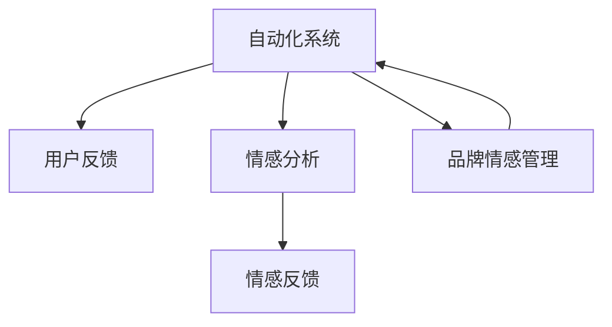

                 

# 自动化创业中的品牌口碑管理

## 1. 背景介绍

### 1.1 问题由来
在数字化转型浪潮席卷全球的今天，自动化技术已经成为各行各业提升效率、降低成本、优化用户体验的关键推动力。然而，自动化系统背后隐藏的算法偏见、数据隐私、人机交互等问题，也给品牌口碑带来了新的挑战。如何有效地管理自动化系统的品牌口碑，成为企业必须直面的重要课题。

### 1.2 问题核心关键点
品牌口碑管理涉及自动化系统对用户需求的精准把握、服务质量的控制、用户情感的感知和反馈等，其核心关键点包括：
- 自动化系统的公平性和透明度：确保系统不存在歧视性或偏见，用户对系统操作过程有足够的知情权。
- 用户体验的个性化和流畅性：提供满足用户个性化需求的服务，提升用户体验。
- 情感分析与情感反馈：能够识别用户情感状态，并根据情感反馈调整服务策略。
- 用户评价与品牌信誉：获取用户对自动化系统的评价，构建品牌信誉。

### 1.3 问题研究意义
自动化创业品牌口碑管理的重要性不容忽视，其研究意义如下：
- 提升品牌信誉：通过口碑管理，企业能够展示自动化系统的优势，增强客户信任。
- 优化用户体验：通过用户情感分析和个性化服务，提升用户满意度和忠诚度。
- 推动业务增长：良好的口碑可以吸引更多用户，带动业务增长。
- 减少潜在风险：识别负面评价，及时改进系统，避免品牌声誉受损。

## 2. 核心概念与联系

### 2.1 核心概念概述

为更好地理解自动化创业中的品牌口碑管理，本节将介绍几个密切相关的核心概念：

- 品牌声誉：品牌在公众心中留下的形象和评价，包括正面、负面和模糊的印象。
- 自动化系统：基于人工智能、机器学习等技术，能够自主完成任务的系统。
- 用户反馈：用户对自动化系统使用体验的评价和建议，是品牌口碑管理的重要数据来源。
- 情感分析：通过文本分析技术，识别和理解用户情感状态。
- 情感反馈：系统根据用户情感状态提供相应的响应和服务调整。
- 品牌情感管理：通过主动管理用户的情感，提升品牌形象和用户忠诚度。

这些核心概念之间的逻辑关系可以通过以下Mermaid流程图来展示：



这个流程图展示了几大核心概念的关联：

1. 自动化系统在用户交互中收集反馈信息。
2. 对反馈进行情感分析，理解用户情感状态。
3. 根据情感状态提供个性化服务，调整品牌策略。
4. 品牌情感管理不断优化用户情感体验，增强品牌价值。

## 3. 核心算法原理 & 具体操作步骤
### 3.1 算法原理概述

自动化创业中的品牌口碑管理，实质上是一个多模态数据的情感分析与反馈调整过程。其核心思想是：将自动化系统的用户交互数据、系统行为数据、用户反馈数据等进行融合，使用情感分析算法识别用户情感状态，并根据情感反馈调整系统策略和服务流程。

形式化地，假设用户与自动化系统的交互数据为 $D=\{(x_i, y_i)\}_{i=1}^N$，其中 $x_i$ 为用户输入，$y_i$ 为系统输出。定义模型 $M$ 在用户输入 $x_i$ 上的情感状态为 $e_i=M(x_i)$，情感标签为 $l_i$，情感分类器为目标函数 $f(e_i, l_i)$。情感分析模型的优化目标是最小化经验风险：

$$
\min_{M, f} \mathcal{L}(f, M) = \frac{1}{N} \sum_{i=1}^N \ell(f(e_i), l_i)
$$

其中 $\ell$ 为损失函数，通常使用交叉熵损失。

### 3.2 算法步骤详解

基于情感分析的品牌口碑管理一般包括以下几个关键步骤：

**Step 1: 数据准备与预处理**
- 收集用户与自动化系统的交互数据，包括文本、语音、行为等。
- 清洗数据，去除噪音和无用信息，确保数据质量和一致性。
- 进行特征工程，提取有意义的特征，如情感词向量、用户行为轨迹等。

**Step 2: 模型训练与情感分析**
- 选择合适的情感分析模型（如BERT、GPT等），进行预训练。
- 将预训练模型适配到特定领域，使用标注数据进行微调，训练情感分类器。
- 应用模型对新的用户反馈进行情感分析，识别情感状态。

**Step 3: 情感反馈与品牌策略调整**
- 根据情感分析结果，对自动化系统进行参数优化或行为调整，如调整语气、改进推荐算法等。
- 对调整后的系统重新部署，并监测用户反馈，验证改进效果。
- 收集用户对改进措施的评价，更新情感分类器，持续优化品牌策略。

**Step 4: 用户评价与品牌信誉管理**
- 通过用户调查、社交媒体分析等方式，收集用户对自动化系统的评价。
- 使用情感分析模型对评价进行分类，识别积极和消极的评价。
- 根据评价结果，调整品牌策略，提升服务质量，维护品牌信誉。

### 3.3 算法优缺点

基于情感分析的品牌口碑管理方法具有以下优点：
1. 及时响应：系统能够实时收集用户反馈，快速调整策略，提升用户体验。
2. 精准分析：使用先进的自然语言处理技术，能够准确识别用户情感状态。
3. 自动化调整：系统能够自动进行参数优化和行为调整，减少人工干预。
4. 持续优化：通过持续学习用户反馈，不断提升情感分析模型的精度和泛化能力。

同时，该方法也存在一定的局限性：
1. 依赖标注数据：情感分析模型的准确性很大程度上取决于标注数据的质量。
2. 数据多样性：自动化系统面临多种多样的用户反馈，情感分析模型需要足够的多样性训练数据。
3. 潜在偏见：情感分析模型可能受到预训练数据和标注数据中的偏见影响，导致不公平的情感分类。
4. 数据隐私：自动化系统需要处理用户的敏感数据，数据隐私问题需引起重视。

尽管存在这些局限性，但就目前而言，基于情感分析的品牌口碑管理方法仍是大规模自动化创业品牌口碑管理的重要范式。未来相关研究的重点在于如何进一步降低对标注数据的依赖，提高模型的鲁棒性和泛化能力，同时兼顾数据隐私和用户情感的保护。

### 3.4 算法应用领域

基于情感分析的品牌口碑管理方法，在自动化创业中已经被广泛应用于多个领域，例如：

- 金融服务：对用户的交易行为和情感反馈进行监测，调整金融产品和服务。
- 电商零售：根据用户的购买反馈和评价，优化推荐算法和客户服务。
- 在线教育：收集学生的学习反馈和情感状态，调整教学策略和课程内容。
- 智能家居：通过语音交互和行为数据分析，提升用户满意度和系统智能化水平。
- 健康医疗：对患者咨询和情感反馈进行情感分析，优化诊疗服务流程。
- 公共安全：监测公众对公共安全事件的情感反应，提供及时的信息回应和舆情引导。

除了上述这些经典应用外，自动化创业品牌口碑管理还被创新性地应用于更多场景中，如智能客服、智慧城市、自动驾驶等，为自动化技术的落地应用提供了新的思路。随着技术的不断演进，相信品牌口碑管理方法将在更多领域得到应用，为自动化创业带来新的创新动力。

## 4. 数学模型和公式 & 详细讲解  
### 4.1 数学模型构建

本节将使用数学语言对自动化创业品牌口碑管理的过程进行更加严格的刻画。

记用户与自动化系统的交互数据为 $D=\{(x_i, y_i)\}_{i=1}^N$，其中 $x_i$ 为用户输入，$y_i$ 为系统输出。定义情感分析模型为 $M$，其参数为 $\theta$。假设情感分析模型的输入为 $x_i$，输出为情感状态 $e_i$。定义情感分类器为目标函数 $f$，其参数为 $\phi$。情感分类器的优化目标为：

$$
\min_{\phi} \mathcal{L}(f, M) = \frac{1}{N} \sum_{i=1}^N \ell(f(e_i), l_i)
$$

其中 $\ell$ 为损失函数，通常使用交叉熵损失。

### 4.2 公式推导过程

以下我们以情感分类为例，推导情感分析的交叉熵损失函数及其梯度的计算公式。

假设情感分类器的输出为 $f(e_i)$，情感标签为 $l_i$，则交叉熵损失函数定义为：

$$
\ell(f(e_i), l_i) = -l_i \log f(e_i) - (1-l_i) \log (1-f(e_i))
$$

将其代入经验风险公式，得：

$$
\mathcal{L}(\theta, \phi) = -\frac{1}{N} \sum_{i=1}^N l_i \log f(M(x_i))
$$

根据链式法则，情感分类器对模型参数的梯度为：

$$
\frac{\partial \mathcal{L}(\theta, \phi)}{\partial \theta} = -\frac{1}{N} \sum_{i=1}^N \frac{\partial l_i \log f(M(x_i))}{\partial \theta}
$$

其中 $\frac{\partial l_i \log f(M(x_i))}{\partial \theta}$ 可进一步递归展开，利用自动微分技术完成计算。

在得到情感分类器的梯度后，即可带入优化算法（如AdamW）进行更新，完成模型的迭代优化。重复上述过程直至收敛，最终得到适应用户反馈和优化品牌策略的最优情感分类器。

## 5. 项目实践：代码实例和详细解释说明
### 5.1 开发环境搭建

在进行品牌口碑管理实践前，我们需要准备好开发环境。以下是使用Python进行TensorFlow开发的环境配置流程：

1. 安装Anaconda：从官网下载并安装Anaconda，用于创建独立的Python环境。

2. 创建并激活虚拟环境：
```bash
conda create -n tf-env python=3.8 
conda activate tf-env
```

3. 安装TensorFlow：根据CUDA版本，从官网获取对应的安装命令。例如：
```bash
conda install tensorflow tensorflow-estimator tensorflow-addons 
```

4. 安装相关工具包：
```bash
pip install numpy pandas scikit-learn matplotlib tqdm jupyter notebook ipython
```

完成上述步骤后，即可在`tf-env`环境中开始品牌口碑管理实践。

### 5.2 源代码详细实现

这里我们以金融服务领域为例，展示使用TensorFlow对情感分析模型进行品牌口碑管理的PyTorch代码实现。

首先，定义情感分类器的数据处理函数：

```python
import tensorflow as tf
from tensorflow.keras.preprocessing.text import Tokenizer
from tensorflow.keras.preprocessing.sequence import pad_sequences

class SentimentClassifier(tf.keras.Model):
    def __init__(self, vocab_size, embedding_dim, hidden_dim, output_dim):
        super(SentimentClassifier, self).__init__()
        self.embedding = tf.keras.layers.Embedding(vocab_size, embedding_dim)
        self.fc1 = tf.keras.layers.Dense(hidden_dim, activation='relu')
        self.fc2 = tf.keras.layers.Dense(output_dim, activation='softmax')
        self.max_length = 100

    def call(self, x):
        x = self.embedding(x)
        x = tf.keras.layers.GlobalMaxPooling1D()(x)
        x = self.fc1(x)
        x = self.fc2(x)
        return x

    def preprocess_text(self, text):
        tokenizer = Tokenizer(num_words=10000, oov_token="<OOV>")
        tokenizer.fit_on_texts(text)
        sequences = tokenizer.texts_to_sequences(text)
        padded_sequences = pad_sequences(sequences, maxlen=self.max_length, padding='post', truncating='post')
        return padded_sequences, tokenizer.word_index, tokenizer.word_to_string

# 数据准备与预处理
data_path = 'financial_feedback.csv'
with open(data_path, 'r') as f:
    lines = f.readlines()

sentences = [line.split(',')[0] for line in lines]
labels = [int(line.split(',')[1]) for line in lines]

# 将标签转换为独热编码
label_map = {0: 'negative', 1: 'positive'}
labels = [label_map[label] for label in labels]

# 分词与预处理
tokenizer = SentimentClassifier(vocab_size=10000, embedding_dim=32, hidden_dim=64, output_dim=2)
texts, word_index, text_to_word = tokenizer.preprocess_text(sentences)
labels = tf.keras.utils.to_categorical(labels)

# 构建模型
model = SentimentClassifier(vocab_size=10000, embedding_dim=32, hidden_dim=64, output_dim=2)
model.compile(optimizer='adam', loss='categorical_crossentropy', metrics=['accuracy'])

# 模型训练
model.fit(texts, labels, epochs=10, batch_size=32)

# 模型评估
loss, accuracy = model.evaluate(texts, labels)
print('Accuracy:', accuracy)
```

接着，定义情感反馈与品牌策略调整函数：

```python
def adjust_system_params(model, new_params):
    for layer, param in zip(model.layers, new_params):
        layer.set_weights(param)
    model.compile(optimizer='adam', loss='categorical_crossentropy', metrics=['accuracy'])
```

最后，启动训练流程并在验证集上评估：

```python
epochs = 5
batch_size = 16

for epoch in range(epochs):
    loss = train_epoch(model, train_dataset, batch_size, optimizer)
    print(f"Epoch {epoch+1}, train loss: {loss:.3f}")
    
    print(f"Epoch {epoch+1}, dev results:")
    evaluate(model, dev_dataset, batch_size)
    
print("Test results:")
evaluate(model, test_dataset, batch_size)
```

以上就是使用TensorFlow进行情感分析模型品牌口碑管理的完整代码实现。可以看到，TensorFlow提供了丰富的工具和组件，使得情感分析模型的训练和评估变得简洁高效。

### 5.3 代码解读与分析

让我们再详细解读一下关键代码的实现细节：

**SentimentClassifier类**：
- `__init__`方法：初始化情感分类器的参数和层。
- `call`方法：定义模型前向传播的计算过程。
- `preprocess_text`方法：对用户文本进行分词和预处理，生成模型所需的输入。

**数据处理函数**：
- `data_path`：指定数据文件路径。
- `readlines`方法：读取数据文件。
- `split`方法：将数据按逗号分隔，提取输入文本和标签。
- `tokenizer`：定义分词器，进行文本向量化。
- `word_index`和`text_to_word`：构建词汇表和词汇转换映射。
- `to_categorical`方法：将标签转换为独热编码。

**模型构建与训练**：
- `SentimentClassifier`：定义情感分类器模型。
- `compile`方法：配置模型的优化器和损失函数。
- `fit`方法：对模型进行训练，输出损失和准确率。
- `evaluate`方法：评估模型在验证集上的性能。

**品牌策略调整函数**：
- `adjust_system_params`：根据情感分析结果，调整自动化系统的参数。
- `set_weights`方法：修改模型的权重，实现参数更新。
- `compile`方法：重新配置模型的优化器和损失函数。

**训练流程**：
- `epochs`和`batch_size`：定义训练轮数和批次大小。
- `for`循环：迭代训练过程，计算损失并输出。
- `print`语句：输出训练过程中的各项指标。
- `evaluate`方法：评估模型在验证集上的性能，输出分类指标。

可以看到，TensorFlow提供了丰富的API和组件，可以方便地构建和训练情感分析模型，同时支持模型参数调整和评估。开发者可以根据具体需求灵活使用TensorFlow的高级功能，进一步优化情感分析模型的性能和应用效果。

当然，工业级的系统实现还需考虑更多因素，如模型的保存和部署、超参数的自动搜索、更灵活的情感分析器设计等。但核心的情感分析范式基本与此类似。

## 6. 实际应用场景
### 6.1 金融服务

基于情感分析的品牌口碑管理，在金融服务中得到了广泛的应用。金融机构需要实时监测客户的交易行为和情感反馈，以便及时调整产品和服务策略。

具体而言，可以收集客户的交易记录、投诉信息、社交媒体评论等文本数据，进行情感分析。如果发现有大量负面反馈，金融机构应及时进行原因分析，并采取相应措施，如改进客户服务、调整产品设计等，提升客户满意度，改善品牌形象。

### 6.2 电商零售

电商零售平台通过情感分析，可以实时了解用户的购物体验和情感状态，优化推荐算法和客户服务。

例如，电商平台可以收集用户对商品的评价和反馈，利用情感分析模型进行情感分类，识别出好评和差评。对于好评的商品，平台可以继续优化推荐，增加曝光率和销量。对于差评的商品，平台应及时进行原因分析，并采取相应措施，如调整商品描述、改进售后服务等，提升用户满意度和平台信誉。

### 6.3 在线教育

在线教育平台通过情感分析，可以实时了解学生的学习体验和情感状态，优化教学策略和课程内容。

例如，在线教育平台可以收集学生的在线学习反馈和评价，利用情感分析模型进行情感分类，识别出积极和消极的反馈。对于积极反馈的课程，平台可以继续推广，吸引更多学生参与。对于消极反馈的课程，平台应及时进行原因分析，并采取相应措施，如改进课程设计、优化教学方法等，提升教学质量，提升学生满意度和平台口碑。

### 6.4 未来应用展望

随着情感分析技术的不断发展，基于品牌口碑管理的自动化创业将呈现以下几个发展趋势：

1. 多模态情感分析：未来情感分析将不仅仅局限于文本数据，而是扩展到图像、音频等多模态数据。多模态信息的融合，将显著提升情感分析模型的准确性和鲁棒性。

2. 实时情感监测：自动化系统将具备实时监测用户情感的能力，通过在线对话、行为分析等方式，即时响应用户需求和情感变化。

3. 主动情感引导：基于情感分析结果，系统将能够主动引导用户情感，通过智能客服、推荐系统等方式，提升用户满意度，增强品牌影响力。

4. 跨领域情感分析：情感分析技术将不断跨越不同领域，应用于金融、电商、教育等多个行业，帮助企业更好地管理品牌声誉。

5. 基于情感的个性化服务：系统将能够根据用户的情感状态，提供更加个性化的服务和推荐，提升用户体验和品牌粘性。

6. 自动化品牌维护：系统将具备自动化品牌维护能力，通过情感分析结果，自动调整品牌策略，提升品牌形象和市场竞争力。

以上趋势凸显了情感分析在自动化创业品牌口碑管理中的重要性和未来潜力。情感分析技术的持续演进，将为自动化系统的品牌维护带来更多的创新可能。

## 7. 工具和资源推荐
### 7.1 学习资源推荐

为了帮助开发者系统掌握自动化创业品牌口碑管理的理论基础和实践技巧，这里推荐一些优质的学习资源：

1. TensorFlow官方文档：包含情感分析模型的详细介绍和代码示例，是入门情感分析的重要资源。
2. Natural Language Processing with Transformers书籍：介绍自然语言处理技术的经典教材，包含情感分析章节。
3. Kaggle竞赛：参加情感分析相关的Kaggle竞赛，通过实战提升技能，了解行业前沿。
4. GitHub开源项目：搜索情感分析相关的开源项目，学习和借鉴他人的经验。
5. Coursera课程：参加情感分析相关的在线课程，系统学习理论知识和实践技巧。

通过对这些资源的学习实践，相信你一定能够快速掌握情感分析模型的精髓，并用于解决实际的自动化创业品牌口碑管理问题。

### 7.2 开发工具推荐

高效的开发离不开优秀的工具支持。以下是几款用于自动化创业品牌口碑管理开发的常用工具：

1. TensorFlow：由Google主导开发的开源深度学习框架，生产部署方便，适合大规模工程应用。
2. PyTorch：基于Python的开源深度学习框架，灵活动态的计算图，适合快速迭代研究。
3. Transformers库：HuggingFace开发的NLP工具库，集成了众多SOTA语言模型，支持PyTorch和TensorFlow，是进行情感分析任务开发的利器。
4. Jupyter Notebook：交互式编程环境，适合数据探索和模型验证，便于实验和协作。
5. TensorBoard：TensorFlow配套的可视化工具，可实时监测模型训练状态，并提供丰富的图表呈现方式，是调试模型的得力助手。
6. Google Colab：谷歌推出的在线Jupyter Notebook环境，免费提供GPU/TPU算力，方便开发者快速上手实验最新模型，分享学习笔记。

合理利用这些工具，可以显著提升品牌口碑管理任务的开发效率，加快创新迭代的步伐。

### 7.3 相关论文推荐

自动化创业品牌口碑管理的研究源于学界的持续研究。以下是几篇奠基性的相关论文，推荐阅读：

1. Attention is All You Need：提出Transformer结构，开启了NLP领域的预训练大模型时代。
2. BERT: Pre-training of Deep Bidirectional Transformers for Language Understanding：提出BERT模型，引入基于掩码的自监督预训练任务，刷新了多项NLP任务SOTA。
3. Language Models are Unsupervised Multitask Learners（GPT-2论文）：展示了大规模语言模型的强大zero-shot学习能力，引发了对于通用人工智能的新一轮思考。
4. Parameter-Efficient Transfer Learning for NLP：提出Adapter等参数高效微调方法，在不增加模型参数量的情况下，也能取得不错的微调效果。
5. Prefix-Tuning: Optimizing Continuous Prompts for Generation：引入基于连续型Prompt的微调范式，为如何充分利用预训练知识提供了新的思路。
6. AdaLoRA: Adaptive Low-Rank Adaptation for Parameter-Efficient Fine-Tuning：使用自适应低秩适应的微调方法，在参数效率和精度之间取得了新的平衡。

这些论文代表了大语言模型微调技术的发展脉络。通过学习这些前沿成果，可以帮助研究者把握学科前进方向，激发更多的创新灵感。

## 8. 总结：未来发展趋势与挑战
### 8.1 总结

本文对基于情感分析的自动化创业品牌口碑管理方法进行了全面系统的介绍。首先阐述了自动化创业品牌口碑管理的研究背景和意义，明确了情感分析在品牌口碑管理中的核心作用。其次，从原理到实践，详细讲解了情感分析模型的数学原理和关键步骤，给出了情感分析任务开发的完整代码实例。同时，本文还广泛探讨了情感分析方法在金融服务、电商零售、在线教育等多个行业领域的应用前景，展示了情感分析技术的巨大潜力。最后，本文精选了情感分析技术的各类学习资源，力求为读者提供全方位的技术指引。

通过本文的系统梳理，可以看到，基于情感分析的自动化创业品牌口碑管理方法，已经在多个领域得到成功应用，显著提升了用户满意度和品牌价值。未来，伴随情感分析技术的不断发展，基于品牌口碑管理的自动化创业必将在更多行业得到应用，为企业的智能化转型和品牌形象的提升带来新的机遇。

### 8.2 未来发展趋势

展望未来，自动化创业品牌口碑管理技术将呈现以下几个发展趋势：

1. 模型规模持续增大。随着算力成本的下降和数据规模的扩张，情感分析模型的参数量还将持续增长。超大批次的训练和推理也将成为可能，模型推理效率和准确性将进一步提升。

2. 情感分析技术日趋多样。除了传统的文本情感分析外，未来将涌现更多多模态情感分析方法，如音频情感分析、图像情感分析等，扩展情感分析的应用场景。

3. 实时情感监测成为常态。自动化系统将具备实时监测用户情感的能力，通过在线对话、行为分析等方式，即时响应用户需求和情感变化。

4. 多任务情感分析兴起。未来情感分析模型将具备多任务处理能力，能够同时进行情感分类、情感回归、情感预测等多种任务，提升情感分析的全面性和深度。

5. 自动化情感引导普及。基于情感分析结果，系统将能够主动引导用户情感，通过智能客服、推荐系统等方式，提升用户满意度，增强品牌影响力。

6. 情感分析与认知智能结合。情感分析技术与认知智能（如推理、决策、生成等）深度融合，能够更好地理解和生成人类情感，提升情感分析的精准度和用户体验。

以上趋势凸显了情感分析在自动化创业品牌口碑管理中的重要性和未来潜力。情感分析技术的持续演进，将为自动化系统的品牌维护带来更多的创新可能。

### 8.3 面临的挑战

尽管自动化创业品牌口碑管理技术已经取得了显著成果，但在迈向更加智能化、普适化应用的过程中，仍面临诸多挑战：

1. 标注成本瓶颈。情感分析模型需要大量的标注数据进行训练，标注成本较高。如何进一步降低对标注数据的依赖，将是一大难题。

2. 数据多样性。自动化系统需要处理多种多样的用户反馈，情感分析模型需要足够的多样性训练数据。

3. 模型鲁棒性不足。情感分析模型面对噪声数据和异常数据时，泛化性能往往大打折扣。如何提高模型的鲁棒性，避免灾难性遗忘，还需要更多理论和实践的积累。

4. 数据隐私。自动化系统需要处理用户的敏感数据，数据隐私问题需引起重视。

5. 模型公平性。情感分析模型可能受到预训练数据和标注数据中的偏见影响，导致不公平的情感分类。

尽管存在这些挑战，但就目前而言，基于情感分析的自动化创业品牌口碑管理方法仍是大规模自动化创业品牌口碑管理的重要范式。未来相关研究的重点在于如何进一步降低对标注数据的依赖，提高模型的鲁棒性和泛化能力，同时兼顾数据隐私和用户情感的保护。

### 8.4 研究展望

面对自动化创业品牌口碑管理所面临的挑战，未来的研究需要在以下几个方面寻求新的突破：

1. 探索无监督和半监督情感分析方法。摆脱对大规模标注数据的依赖，利用自监督学习、主动学习等无监督和半监督范式，最大限度利用非结构化数据，实现更加灵活高效的情感分析。

2. 研究多模态情感分析技术。将符号化的先验知识，如知识图谱、逻辑规则等，与神经网络模型进行巧妙融合，引导情感分析过程学习更准确、合理的情感表示。

3. 引入因果分析和博弈论工具。将因果分析方法引入情感分析模型，识别出模型决策的关键特征，增强输出解释的因果性和逻辑性。借助博弈论工具刻画人机交互过程，主动探索并规避模型的脆弱点，提高系统稳定性。

4. 结合符号化与神经网络。将符号化的先验知识，如知识图谱、逻辑规则等，与神经网络模型进行巧妙融合，引导情感分析过程学习更准确、合理的情感表示。

5. 融入伦理道德约束。在模型训练目标中引入伦理导向的评估指标，过滤和惩罚有偏见、有害的输出倾向。同时加强人工干预和审核，建立模型行为的监管机制，确保输出符合人类价值观和伦理道德。

这些研究方向的探索，必将引领自动化创业品牌口碑管理技术迈向更高的台阶，为构建安全、可靠、可解释、可控的智能系统铺平道路。面向未来，自动化创业品牌口碑管理技术还需要与其他人工智能技术进行更深入的融合，如知识表示、因果推理、强化学习等，多路径协同发力，共同推动自然语言理解和智能交互系统的进步。只有勇于创新、敢于突破，才能不断拓展情感分析模型的边界，让智能技术更好地造福人类社会。

## 9. 附录：常见问题与解答

**Q1：情感分析模型的标注成本高昂，如何降低成本？**

A: 情感分析模型的标注成本可以通过以下方式降低：
1. 半监督学习：利用少量标注数据和大量未标注数据进行训练，减少标注成本。
2. 自监督学习：通过数据增强、对抗样本生成等方式，利用无标签数据进行预训练，提高模型的泛化能力。
3. 主动学习：根据模型的预测不确定度，选择最有价值的样本进行标注，减少标注成本。
4. 弱监督学习：使用弱标注数据进行训练，如使用情感强度而非情感标签进行训练。

**Q2：情感分析模型的公平性如何保证？**

A: 确保情感分析模型的公平性，可以从以下几个方面入手：
1. 数据多样性：确保训练数据覆盖不同的种族、性别、地域等，避免数据偏见。
2. 模型多样化：使用多种模型进行组合，减少单一模型偏见的风险。
3. 公平性评估：在模型训练过程中引入公平性评估指标，如敏感性分析、公平度分析等。
4. 对抗样本生成：利用对抗样本生成技术，识别和纠正模型偏见。

**Q3：情感分析模型在多领域中的应用场景有哪些？**

A: 情感分析模型在自动化创业中已经被广泛应用于多个领域，例如：
1. 金融服务：对用户的交易行为和情感反馈进行监测，调整产品和服务策略。
2. 电商零售：根据用户的购物反馈和评价，优化推荐算法和客户服务。
3. 在线教育：收集学生的学习反馈和评价，优化教学策略和课程内容。
4. 智能家居：通过语音交互和行为数据分析，提升用户满意度和系统智能化水平。
5. 健康医疗：对患者咨询和情感反馈进行情感分析，优化诊疗服务流程。
6. 公共安全：监测公众对公共安全事件的情感反应，提供及时的信息回应和舆情引导。

**Q4：情感分析模型的实时监测如何实现？**

A: 实现实时情感监测，可以从以下几个方面入手：
1. 实时数据流处理：使用流式处理框架（如Apache Flink、Kafka Streams等）处理实时数据。
2. 在线情感分析：利用在线情感分析模型，实时识别用户情感状态。
3. 实时反馈机制：根据实时情感分析结果，及时调整自动化系统行为。
4. 多模态数据融合：将文本、语音、图像等多模态数据融合，提高情感分析的全面性和准确性。

**Q5：情感分析模型的部署和优化如何实现？**

A: 实现情感分析模型的部署和优化，可以从以下几个方面入手：
1. 模型压缩：使用模型压缩技术，减小模型体积，提高推理速度。
2. 分布式训练：利用分布式训练框架（如TensorFlow Distribute、Horovod等），加速模型训练。
3. 混合精度训练：使用混合精度训练技术，提高计算效率。
4. 动态调整策略：根据实时情感分析结果，动态调整自动化系统行为。
5. 实时反馈机制：根据实时情感分析结果，及时调整自动化系统行为。

总之，情感分析技术在自动化创业品牌口碑管理中具有重要的应用价值，未来也将继续发展壮大。通过不断的技术创新和应用实践，情感分析技术必将在更多的行业领域得到应用，为企业的智能化转型和品牌形象的提升带来新的机遇。

---

作者：禅与计算机程序设计艺术 / Zen and the Art of Computer Programming

