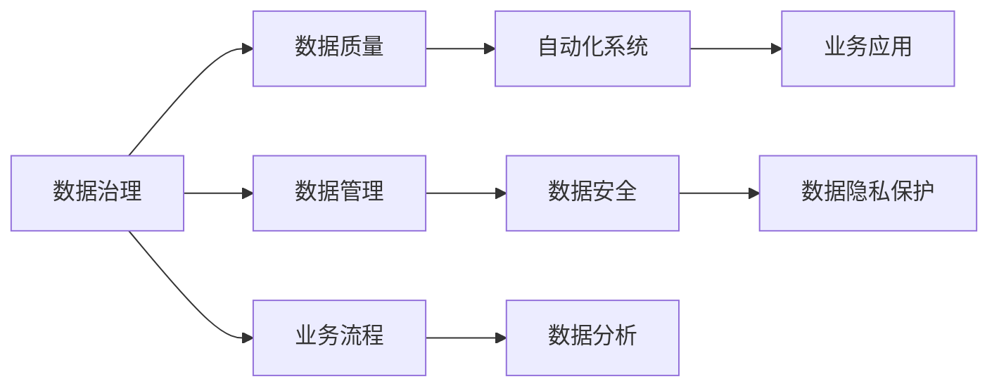

                 

# 自动化创业中的数据治理与管理

在自动化创业中，数据治理与管理是决定企业成败的关键因素之一。正确地管理和使用数据，不仅可以提升自动化系统的性能，还可以带来巨大的商业价值。本文将系统地介绍自动化创业中数据治理与管理的核心概念、原理和具体操作步骤，帮助创业者更好地应对数据管理中的挑战。

## 1. 背景介绍

### 1.1 问题由来
在自动化创业领域，数据治理与管理已经成为关键环节。随着AI技术的发展，数据的重要性日益凸显。但是，数据管理的复杂性和多样性也使得数据治理成为了一个充满挑战的课题。如何有效地收集、存储、使用和管理数据，成为了创业公司的核心问题。

### 1.2 问题核心关键点
数据治理与管理的核心关键点包括数据质量、数据安全和数据隐私保护。高质量的数据是自动化系统高效运行的基础，而数据安全和隐私保护则直接影响到企业的合规性和市场信任度。

## 2. 核心概念与联系

### 2.1 核心概念概述
- **数据治理(Data Governance)**：指对企业数据资源进行规划、监控和控制，确保数据质量、安全和隐私，最大化数据价值的过程。
- **数据管理(Data Management)**：涉及数据的采集、存储、处理、分析和使用的全生命周期管理。
- **数据质量(Data Quality)**：数据的准确性、完整性、一致性、及时性和可信度。
- **数据安全和隐私保护(Data Security & Privacy)**：确保数据在处理和传输过程中的安全性和隐私保护，遵守相关法律法规。

### 2.2 核心概念原理和架构的 Mermaid 流程图



## 3. 核心算法原理 & 具体操作步骤

### 3.1 算法原理概述
自动化创业中的数据治理与管理，本质上是一个数据质量控制、安全和隐私保护的过程。其核心目标是确保数据的一致性、完整性和安全性，使其能够有效地支持自动化系统的运行和业务应用的实现。

### 3.2 算法步骤详解

**Step 1: 数据收集与整合**

- **数据收集**：从不同渠道（如销售系统、客户关系管理系统、传感器、互联网等）收集数据，确保数据来源的全面性和多样性。
- **数据整合**：采用ETL（Extract, Transform, Load）技术，将不同来源的数据整合到一个统一的数据仓库中，便于后续处理和分析。

**Step 2: 数据清洗与预处理**

- **数据清洗**：去除数据中的噪声、重复和错误信息，确保数据的一致性和准确性。
- **数据预处理**：对数据进行标准化、归一化和特征工程，提升数据的质量和可分析性。

**Step 3: 数据存储与管理**

- **数据存储**：选择适合的数据库和存储技术（如关系型数据库、NoSQL数据库、数据湖等），确保数据的可访问性和可扩展性。
- **数据管理**：建立数据管理规范和流程，确保数据的一致性和安全性。

**Step 4: 数据分析与挖掘**

- **数据分析**：采用统计分析和机器学习方法，从数据中提取有价值的信息和洞见。
- **数据挖掘**：通过数据挖掘技术，发现数据中的模式和趋势，为决策提供支持。

**Step 5: 数据可视化与展示**

- **数据可视化**：将分析结果通过图表、仪表盘等方式展示，便于业务人员理解和决策。
- **数据展示**：将可视化结果集成到自动化系统中，支持业务应用的实现。

### 3.3 算法优缺点

**优点**：
- 提升数据质量，确保自动化系统的性能和可靠性。
- 增强数据安全性和隐私保护，保障合规性。
- 支持业务应用和决策，带来商业价值。

**缺点**：
- 数据治理与管理需要投入大量人力和资源。
- 数据安全和隐私保护的复杂性。
- 数据清洗和预处理过程可能影响数据的时效性。

### 3.4 算法应用领域

数据治理与管理在自动化创业中广泛应用于以下领域：

- **自动化系统开发**：支持自动化系统的设计和实现，确保数据的质量和可用性。
- **业务流程优化**：通过数据分析和挖掘，优化业务流程，提升运营效率。
- **市场分析与预测**：利用数据挖掘技术，进行市场分析和预测，支持战略决策。
- **客户关系管理**：通过客户数据的管理和分析，提升客户体验和忠诚度。
- **风险管理**：利用数据安全与隐私保护技术，防范数据泄露和滥用风险。

## 4. 数学模型和公式 & 详细讲解 & 举例说明

### 4.1 数学模型构建

在自动化创业中，数据治理与管理的数学模型主要涉及数据质量评估、数据安全保护和隐私保护等方面。以下是几个常见的数学模型：

1. **数据质量评估模型**：
   - 数据一致性检查：使用数据对比技术，检查数据的一致性。
   - 数据完整性评估：使用缺失值分析，评估数据的完整性。
   - 数据准确性验证：使用统计方法和机器学习算法，验证数据的准确性。

2. **数据安全保护模型**：
   - 加密算法：使用对称加密、非对称加密等算法，保护数据在传输和存储过程中的安全性。
   - 访问控制：使用RBAC（Role-Based Access Control）等技术，控制数据的访问权限。

3. **隐私保护模型**：
   - 数据匿名化：使用数据脱敏和扰动技术，保护个人隐私。
   - 差分隐私：使用差分隐私算法，确保数据在统计分析中的隐私保护。

### 4.2 公式推导过程

以数据一致性检查为例，推导一致性检查的公式：

设 $D$ 为数据集，$A$ 为检查的属性集合，$C_A$ 为 $A$ 的检查函数集合，则数据一致性检查的公式为：

$$
\text{CheckConsistency}(D, A, C_A) = \bigwedge_{a \in A} \bigwedge_{c \in C_A} c(a(D))
$$

其中，$\bigwedge$ 表示逻辑与，$c$ 表示 $A$ 中属性 $a$ 的检查函数，$D$ 表示数据集。

### 4.3 案例分析与讲解

假设某电商企业收集了大量的用户交易数据，需要对其进行数据治理和管理。根据上述模型，可以采取以下步骤：

1. **数据收集**：从订单系统、支付系统、物流系统等收集用户交易数据。
2. **数据清洗**：去除重复订单、异常支付记录等噪声数据，确保数据的一致性。
3. **数据存储**：将清洗后的数据存储在数据仓库中，便于后续分析。
4. **数据可视化**：通过可视化工具，展示交易数据的趋势和洞见。
5. **业务应用**：根据可视化结果，优化库存管理和营销策略，提升用户体验。

## 5. 项目实践：代码实例和详细解释说明

### 5.1 开发环境搭建

在自动化创业中，数据治理与管理需要依赖多种工具和框架。以下是常见的开发环境搭建流程：

1. **环境配置**：
   - 安装Python和Pandas、NumPy等数据处理库。
   - 安装SQLite或其他数据库系统。
   - 配置ETL工具（如Apache Nifi）。

2. **数据集准备**：
   - 准备原始数据集，并进行初步清洗。
   - 划分训练集和测试集。

### 5.2 源代码详细实现

以下是一个简单的Python代码示例，展示了如何使用Pandas进行数据清洗和预处理：

```python
import pandas as pd
import numpy as np

# 读取原始数据集
df = pd.read_csv('raw_data.csv')

# 数据清洗
df = df.drop_duplicates()  # 去除重复记录
df = df.dropna()  # 去除缺失值
df = df.drop('unneeded_column', axis=1)  # 删除无用列

# 数据预处理
df['new_column'] = df['old_column'].map(lambda x: x.upper())  # 字符串转换
df['date_column'] = pd.to_datetime(df['date_column'])  # 日期转换

# 数据存储
df.to_csv('cleaned_data.csv', index=False)

# 数据可视化
import matplotlib.pyplot as plt

plt.hist(df['value_column'], bins=10)
plt.title('Value Distribution')
plt.xlabel('Value')
plt.ylabel('Frequency')
plt.show()
```

### 5.3 代码解读与分析

**代码解读**：
- 读取原始数据集，并进行数据清洗，去除重复和缺失记录，删除无用列。
- 对数据进行预处理，包括字符串转换和日期转换。
- 将清洗后的数据存储为新的CSV文件。
- 使用Matplotlib进行数据可视化，展示数值列的分布。

**分析**：
- 数据清洗是数据治理中的关键步骤，直接影响数据质量和后续分析结果。
- 数据预处理需要根据具体业务场景进行，如字符串转换、日期转换等。
- 数据可视化可以帮助业务人员更好地理解数据，支持决策。

### 5.4 运行结果展示

运行上述代码，可以生成 cleaned_data.csv 文件和值分布的柱状图。通过这些输出，可以直观地看到数据的清洗和预处理效果，以及数值列的分布情况。

## 6. 实际应用场景

### 6.1 智能制造

在智能制造领域，数据治理与管理可以支持自动化生产线上的质量控制和故障预测。通过对生产数据的管理和分析，可以实时监控设备状态，预测设备故障，提升生产效率和产品质量。

### 6.2 金融科技

在金融科技领域，数据治理与管理可以支持风险管理和欺诈检测。通过对交易数据的治理和分析，可以实时监控交易风险，识别欺诈行为，保障金融安全。

### 6.3 智慧城市

在智慧城市领域，数据治理与管理可以支持城市交通管理和公共安全。通过对交通数据的治理和分析，可以优化交通流量，减少拥堵，提升城市交通效率。

### 6.4 未来应用展望

未来，数据治理与管理将在自动化创业中扮演更加重要的角色。随着物联网、5G等新技术的发展，数据量将呈爆炸式增长，数据治理与管理的需求也将更加迫切。如何有效管理和利用数据，将成为企业成功的关键。

## 7. 工具和资源推荐

### 7.1 学习资源推荐

1. **《数据治理与管理》课程**：在线课程平台上的数据治理与管理课程，涵盖数据收集、数据清洗、数据存储和数据可视化等方面的内容。
2. **《大数据技术与应用》书籍**：介绍大数据技术及其在企业中的应用，包括数据治理与管理的技术和方法。
3. **《Python数据科学手册》**：介绍Python在数据科学中的应用，包括数据处理、数据分析和数据可视化。

### 7.2 开发工具推荐

1. **Pandas**：Python中用于数据处理和分析的库，支持数据清洗、数据转换和数据可视化。
2. **NumPy**：Python中用于科学计算的库，支持高效的数据处理和数值计算。
3. **Apache Nifi**：ETL工具，支持数据的采集、转换和存储。
4. **SQLite**：轻量级的关系型数据库，支持数据的存储和管理。
5. **Jupyter Notebook**：Python代码的交互式开发环境，支持数据处理和可视化。

### 7.3 相关论文推荐

1. **《数据治理与隐私保护综述》**：综述数据治理与隐私保护的研究进展，提出未来研究方向。
2. **《自动化系统中数据治理的挑战与解决方案》**：探讨自动化系统中数据治理的挑战和解决方案，提出创新思路。
3. **《数据安全与隐私保护技术》**：介绍数据安全与隐私保护的技术和方法，支持自动化创业中的数据治理。

## 8. 总结：未来发展趋势与挑战

### 8.1 研究成果总结

数据治理与管理在自动化创业中扮演着重要的角色，帮助企业提升数据质量、保障数据安全、优化业务流程，带来商业价值。随着技术的发展，数据治理与管理的方法和工具也在不断进步，但仍然面临数据安全、隐私保护等方面的挑战。

### 8.2 未来发展趋势

未来，数据治理与管理将向着以下几个方向发展：

1. **自动化数据治理**：利用人工智能和自动化技术，提高数据治理的效率和准确性。
2. **数据治理工具集成**：将数据治理工具与其他自动化系统集成，提升整体系统的协同能力。
3. **数据治理的云化**：将数据治理技术部署在云平台上，支持大规模数据治理和灵活扩展。
4. **数据治理的标准化**：制定数据治理的标准和规范，提升数据治理的一致性和可靠性。

### 8.3 面临的挑战

数据治理与管理在自动化创业中面临以下挑战：

1. **数据隐私保护**：如何在保护隐私的前提下进行数据分析，是一个重要的挑战。
2. **数据治理的复杂性**：数据治理涉及多个环节，包括数据收集、清洗、存储、分析等，需要跨部门的协调和配合。
3. **数据治理的持续性**：数据治理是一个持续的过程，需要不断地监控和优化，确保数据的质量和可用性。

### 8.4 研究展望

未来，数据治理与管理的研究方向将集中在以下几个方面：

1. **隐私保护技术**：研究新的隐私保护技术，如差分隐私、联邦学习等，保障数据隐私。
2. **自动化数据治理**：开发自动化数据治理工具，提升数据治理的效率和效果。
3. **数据治理的生态系统**：构建数据治理的生态系统，整合多方资源和能力，提升数据治理的整体水平。
4. **跨领域数据治理**：研究跨领域数据治理的方法和技术，支持不同领域的数据治理需求。

## 9. 附录：常见问题与解答

**Q1: 数据治理与管理的核心挑战是什么？**

A: 数据治理与管理的核心挑战包括数据质量、数据安全和隐私保护。数据质量是自动化系统高效运行的基础，数据安全和隐私保护则是合规性和市场信任的关键。

**Q2: 数据治理与管理的最佳实践是什么？**

A: 数据治理与管理的最佳实践包括：
- 建立数据治理框架，明确数据治理的职责和流程。
- 实施数据质量管理，定期评估和优化数据质量。
- 采用数据安全与隐私保护技术，保障数据的安全性和隐私性。
- 使用数据可视化工具，支持业务决策和应用开发。

**Q3: 如何有效地进行数据治理？**

A: 有效的数据治理需要以下几个步骤：
- 明确数据治理的目标和范围。
- 制定数据治理的标准和规范。
- 实施数据治理的工具和技术。
- 建立数据治理的团队和流程。
- 持续监控和优化数据治理的效果。

**Q4: 如何保障数据的安全性和隐私性？**

A: 保障数据的安全性和隐私性需要以下几个步骤：
- 采用加密技术和访问控制机制，保护数据的机密性和完整性。
- 实施数据脱敏和扰动技术，保护数据的隐私性。
- 建立数据治理的审计和监控机制，及时发现和应对安全威胁。

**Q5: 数据治理与管理对自动化创业有哪些影响？**

A: 数据治理与管理对自动化创业有以下影响：
- 提升数据质量，支持自动化系统的设计和实现。
- 增强数据安全性和隐私保护，保障合规性。
- 支持业务应用和决策，带来商业价值。
- 优化业务流程，提升运营效率。

---

作者：禅与计算机程序设计艺术 / Zen and the Art of Computer Programming

