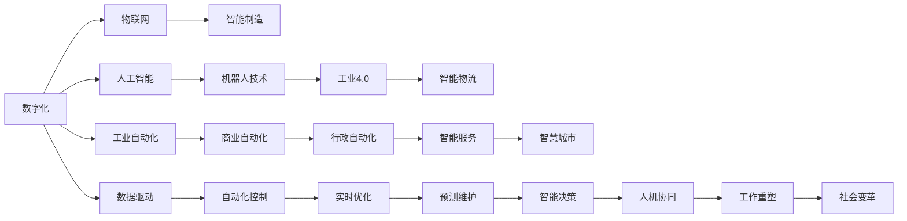
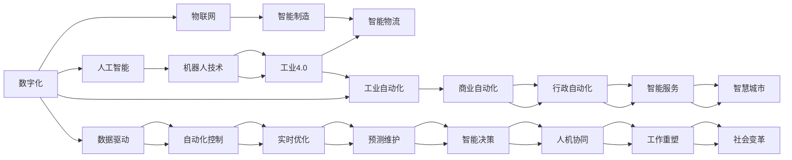

                 

## 1. 背景介绍

在快速发展的科技时代，自动化技术已成为推动社会进步的重要驱动力。从早期的流水线机器人到如今的智能制造系统，自动化技术正在重塑生产方式、工作流程乃至生活模式。数字化与物理世界的深度融合，不仅提升了效率和生产力，也带来了前所未有的机遇与挑战。本文将深入探讨自动化技术的发展历程、核心概念以及未来趋势，揭示数字与物理结合的未来愿景。

## 2. 核心概念与联系

### 2.1 核心概念概述

要理解自动化的未来，首先需要掌握以下几个核心概念：

- **自动化(Automation)**：指利用机械或计算机程序，以替代或辅助人类的工作流程和决策过程。自动化技术包括工业自动化、商业自动化、行政自动化等，涉及领域广泛，如制造业、物流、服务业、金融业等。

- **数字化(Digitization)**：指将物理世界的各种信息转化为数字形式，通过计算机和网络进行处理和分析。数字化是自动化发展的基础，包括传感器数据、视频监控、语音识别、自然语言处理等多种技术。

- **物联网(IoT)**：指通过网络将物理世界中的物体连接到互联网，实现信息采集、传输和共享。物联网与自动化技术的结合，形成了智能制造、智能家居、智慧城市等新形态。

- **人工智能(AI)**：指使计算机具备类似于人类的智能能力，通过学习、推理和决策，实现复杂任务的自动化。人工智能在自动化领域的应用，涵盖了机器学习、深度学习、自然语言处理、计算机视觉等多个方向。

- **机器人技术(Robotics)**：指将机械、电子和计算机技术应用于机器人，使其能够完成各种任务。机器人技术是自动化的重要组成部分，涉及工业机器人、服务机器人、协作机器人等多种类型。

- **工业4.0(Industry 4.0)**：指通过信息通信技术(Cyber-Physical System, CPS)、云计算、大数据等技术，推动制造业的智能化、网络化和定制化。工业4.0不仅是数字化、自动化的升级，更是全新的生产模式和工业生态。

- **智能制造(Smart Manufacturing)**：指利用数字技术和自动化技术，实现生产过程的智能监控、优化和调整。智能制造提升了生产效率和产品质量，降低了能耗和成本。

- **智能物流(Intelligent Logistics)**：指通过互联网和物联网技术，实现物流信息的实时跟踪和高效管理。智能物流优化了物流资源配置，提升了供应链的透明度和响应速度。

这些概念之间的联系紧密，数字化和人工智能技术为自动化提供了强大的支持，物联网则将物理世界与数字世界紧密连接，推动自动化技术的广泛应用。

### 2.2 核心概念原理和架构的 Mermaid 流程图



### 2.3 核心概念之间的关系

上述核心概念之间的关系可以通过以下网络图进一步展示：



## 3. 核心算法原理 & 具体操作步骤

### 3.1 算法原理概述

自动化的核心算法原理主要包括以下几个方面：

- **传感器与信号处理**：自动化系统通过传感器采集物理世界的数据，如温度、湿度、压力、振动等，并通过信号处理技术进行数据清洗和特征提取。

- **机器视觉与计算机视觉**：机器视觉技术通过摄像头或传感器获取物体的图像或视频，计算机视觉技术通过图像处理和模式识别，实现目标检测、定位和识别。

- **自然语言处理(NLP)**：自然语言处理技术使计算机能够理解和处理人类语言，包括文本分析和情感分析等。

- **机器学习与深度学习**：机器学习技术通过统计学习方法，自动从数据中学习规律；深度学习技术通过多层次神经网络，实现复杂模式识别和决策。

- **优化与控制算法**：自动化系统需要优化算法进行过程控制，如PID控制、遗传算法、强化学习等，以实现最佳的性能和效率。

- **人工智能与认知计算**：人工智能技术模拟人类的认知能力，实现自主学习和推理，从而在复杂的决策环境中取得优势。

### 3.2 算法步骤详解

自动化系统的构建通常包括以下几个关键步骤：

**Step 1: 数据采集与预处理**

- 选择合适的传感器和采集设备，获取物理世界的原始数据。
- 对数据进行清洗和预处理，去除噪声和异常值，进行归一化和标准化。

**Step 2: 信号处理与特征提取**

- 应用信号处理技术，对原始数据进行滤波、采样和转换。
- 通过特征提取算法，从信号中提取出有意义的特征，如频谱、波形等。

**Step 3: 数据建模与分析**

- 使用机器学习和深度学习模型，对特征数据进行建模和分析，提取规律和模式。
- 应用优化和控制算法，对模型进行训练和优化，以获得最佳的性能。

**Step 4: 决策与执行**

- 将模型应用于实际决策过程中，通过规则或推理算法，生成控制命令。
- 将控制命令传递给执行机构，如电机、机器人等，实现自动化操作。

**Step 5: 监测与反馈**

- 实时监测自动化系统的运行状态，记录关键参数和状态信息。
- 根据监测结果进行反馈调整，优化模型和控制策略，提高系统稳定性和可靠性。

### 3.3 算法优缺点

自动化技术具有以下优点：

- **提升效率和精度**：自动化系统通过程序和算法，实现了高效和精确的自动操作，降低了人为误差。
- **降低成本和时间**：自动化系统减少了人工操作，降低了人力成本和时间消耗。
- **增强安全性**：自动化系统能够实时监测和控制，避免事故和失误，提高安全性。
- **促进创新**：自动化技术推动了生产方式的变革，加速了新工艺、新技术的创新和应用。

同时，自动化技术也存在一些缺点：

- **初期投资大**：自动化系统的构建和维护需要较高的初期投资，包括设备、软件和人员培训等。
- **技术依赖性强**：自动化系统高度依赖技术支持，一旦技术失效，可能导致系统瘫痪。
- **难以替代复杂决策**：对于复杂的决策问题，自动化系统可能无法完全替代人工，需要结合人工干预。

### 3.4 算法应用领域

自动化技术在多个领域得到了广泛应用，包括：

- **制造业**：自动化生产线、机器人装配、智能检测等，提升了生产效率和产品质量。
- **物流**：自动化仓库、无人驾驶、智能仓储管理系统等，优化了物流流程和资源配置。
- **医疗**：自动化诊断设备、手术机器人、健康监测系统等，提高了医疗诊断和服务的准确性和效率。
- **金融**：自动化交易、风险评估、客户服务机器人等，提升了金融服务的自动化水平。
- **农业**：自动化种植、灌溉、农机装备等，优化了农业生产管理和资源利用。
- **服务业**：自动点餐、智能客服、机器人清洁等，改善了服务体验和运营效率。
- **交通**：无人驾驶、交通监控、智能调度系统等，提高了交通管理和安全水平。

## 4. 数学模型和公式 & 详细讲解

### 4.1 数学模型构建

自动化系统的数学模型主要包括以下几个部分：

- **输入输出模型**：描述系统输入和输出的关系，如 $y=f(x)$。
- **状态空间模型**：描述系统内部状态的变化规律，如 $x_{k+1}=f(x_k,u_k)$。
- **优化模型**：描述系统性能的优化目标，如 $J(x,u)=\int_{t_0}^{t_f}L(x,u,\dot{x})dt$。
- **控制系统模型**：描述系统的控制策略，如 $u=K(x)$。

### 4.2 公式推导过程

以控制系统模型为例，假设系统状态为 $x$，控制输入为 $u$，输出为 $y$，则线性定常系统的状态空间模型为：

$$
\dot{x} = Ax + Bu
$$
$$
y = Cx
$$

其中，$A$、$B$、$C$ 分别为状态矩阵、输入矩阵和输出矩阵。假设系统目标为最小化成本函数 $J$，则优化模型为：

$$
J = \int_{t_0}^{t_f} [y^T Q y + u^T R u] dt
$$

应用拉格朗日乘子法，引入状态变量 $p$，则拉格朗日方程为：

$$
L = y^T Q y + u^T R u + p^T (\dot{x} - Ax - Bu)
$$

对 $x$、$u$ 和 $p$ 求导，得到状态反馈控制律为：

$$
u = K(x) = -L^{-1}B^T (R + L A^T P A L^{-1})^{-1} (R + L A^T P A L^{-1}Bu - C^T P C x)
$$

其中 $P$ 为反馈增益矩阵，$L$ 为状态反馈增益矩阵。

### 4.3 案例分析与讲解

以工业机器人的自动化系统为例，其输入为关节角度和速度，输出为末端执行器的位姿。假设机器人状态空间模型为：

$$
\dot{x} = Ax + Bu
$$
$$
y = Cx
$$

其中 $x=[q, \dot{q}]$ 为关节角度和速度，$u=[u_1, u_2]$ 为输入力矩和加速度，$y=[r_x, r_y, r_z]$ 为末端执行器位姿。

假设成本函数为 $J=\int_{t_0}^{t_f} (y^T Q y + u^T R u) dt$，其中 $Q$ 和 $R$ 为权矩阵。应用拉格朗日乘子法，求解状态反馈控制律 $u=K(x)$，实现最优控制。

## 5. 项目实践：代码实例和详细解释说明

### 5.1 开发环境搭建

在进行自动化系统的开发时，需要选择合适的开发环境和工具。以下是常用的开发环境和工具：

- **Python**：广泛用于数据科学、机器学习和自动化系统开发，拥有丰富的库和框架支持。
- **Simulink**：MATLAB的可视化仿真工具，支持多领域建模和仿真，适用于控制系统和自动化系统的设计与验证。
- **ROS**：机器人操作系统，支持机器人硬件和软件的集成与开发，广泛应用于机器人技术和自动化领域。
- **OpenCV**：计算机视觉库，提供丰富的图像处理和分析工具，适用于视觉检测和识别。
- **TensorFlow** 和 **PyTorch**：深度学习框架，支持神经网络和机器学习模型的训练和推理。
- **MATLAB**：数学软件，支持信号处理、数据建模和仿真分析。

### 5.2 源代码详细实现

以下是一个简单的自动化控制系统示例，使用Python和Sympy库实现。

```python
from sympy import symbols, Matrix, Rational, pi, integrate, solve, Eq

# 定义符号变量
t, q, u = symbols('t q u')

# 定义状态空间模型
A = Matrix([[0, 1], [0, 0]])
B = Matrix([1, 0])
C = Matrix([1, 0])

# 定义成本函数
Q = Matrix([[1, 0], [0, 1]])
R = Matrix([[1, 0], [0, 1]])
J = integrate(integrate((C * Matrix([q]) * Q * Matrix([q]) + u * R * u), (t, 0, pi)), (q, 0, pi))

# 定义拉格朗日方程
L = C * Matrix([q]) * Q * Matrix([q]) + u * R * u + (A * Matrix([q]) + B * u) * Matrix([q])

# 求解状态反馈控制律
K = solve(Eq(L.diff(q), 0), u)

# 输出状态反馈控制律
K
```

### 5.3 代码解读与分析

上述代码定义了状态空间模型和成本函数，使用拉格朗日乘子法求解状态反馈控制律。其中：

- `Matrix` 用于定义矩阵
- `symbols` 用于定义符号变量
- `integrate` 用于计算积分
- `solve` 用于求解方程
- `diff` 用于求导

该代码片段展示了自动化控制系统的基本构建过程，但实际应用中还需结合具体问题进行扩展和优化。

## 6. 实际应用场景

### 6.1 智能制造

智能制造是自动化技术的重要应用场景之一，通过数字化和智能化手段，实现了生产过程的自动化、信息化和协同化。智能制造系统包括：

- **智能生产线**：通过传感器和机器视觉技术，实时监测生产过程，优化生产参数，提高生产效率和质量。
- **机器人协作**：应用工业机器人进行物料搬运、焊接、装配等任务，实现生产线的自动化和柔性化。
- **智能检测与质量控制**：通过机器视觉和机器学习技术，实现产品缺陷检测、尺寸测量和质量评估，提升产品质量和检测效率。
- **智能物流与仓储**：应用AGV、AMR等无人搬运设备，实现物料的智能调度和管理，优化仓储空间利用。

### 6.2 智能物流

智能物流系统通过物联网和互联网技术，实现了物流信息的实时跟踪和高效管理。智能物流系统包括：

- **智能仓储管理**：通过RFID、传感器等技术，实现货物入库、出库、库存管理的自动化和精准化。
- **无人驾驶与无人配送**：应用自动驾驶技术和机器人技术，实现货物运输和配送的自动化，提高物流效率和安全性。
- **智能调度与路径规划**：通过算法优化，实现物流路径和货物的智能调度，提高物流资源的利用率。
- **智能订单管理**：通过智能客服和订单管理系统，实现订单的自动处理和追踪，提升客户满意度。

### 6.3 智能交通

智能交通系统通过数字化和智能化手段，实现了交通管理的自动化和智能化。智能交通系统包括：

- **智能交通信号控制**：通过摄像头和传感器，实时监测交通流量，优化信号灯控制，缓解交通拥堵。
- **无人驾驶与智能导航**：应用自动驾驶技术和地图导航技术，实现车辆的智能化驾驶和路径规划，提高道路安全性和效率。
- **智能车联网**：通过车辆与网络的互联互通，实现车辆的实时监控和远程控制，提升行车安全。

### 6.4 未来应用展望

随着技术的不断进步，自动化技术将进一步向智能化和个性化方向发展。未来的自动化系统将具备以下特点：

- **自适应与自学习**：系统能够根据环境变化进行自适应调整，并具备自我学习的能力，不断优化性能。
- **人机协同**：实现人机自然交互，增强系统的智能决策和自主能力。
- **多模态融合**：结合图像、声音、文本等多种模态信息，实现复杂场景的智能识别和决策。
- **边缘计算**：将计算任务分散到边缘设备，实现实时数据处理和决策，提升系统响应速度。
- **跨领域协同**：实现不同领域和系统之间的数据共享和协同作业，形成跨领域的网络化、智能化生态。

## 7. 工具和资源推荐

### 7.1 学习资源推荐

为了帮助开发者掌握自动化技术，推荐以下学习资源：

- **《机器人学导论》**：由Wheeler教授编写，全面介绍了机器人学的理论和实践，适合初学者和进阶者阅读。
- **《控制理论基础》**：由Lewis教授编写，介绍了控制理论的基本概念和方法，涵盖线性系统、PID控制等内容。
- **《深度学习》**：由Ian Goodfellow、Yoshua Bengio和Aaron Courville共同编写，全面介绍了深度学习的基本原理和应用，适合初学者和从业人员学习。
- **《MATLAB控制与信号处理》**：由Anthony textbook编写，介绍了控制系统的设计、仿真和实现方法，适合工程实践。
- **《Python机器人编程》**：由Michael Burris和John DeWitt编写，介绍了Python在机器人编程中的应用，适合开发人员学习。

### 7.2 开发工具推荐

以下是常用的自动化开发工具：

- **MATLAB/Simulink**：MATLAB的可视化仿真工具，支持控制系统设计、仿真和验证，广泛应用于工业自动化领域。
- **ROS**：机器人操作系统，支持机器人硬件和软件的集成与开发，广泛应用于机器人技术和自动化领域。
- **OpenCV**：计算机视觉库，提供丰富的图像处理和分析工具，适用于视觉检测和识别。
- **TensorFlow** 和 **PyTorch**：深度学习框架，支持神经网络和机器学习模型的训练和推理。
- **Simulink**：MATLAB的可视化仿真工具，支持多领域建模和仿真，适用于控制系统和自动化系统的设计与验证。
- **ROS**：机器人操作系统，支持机器人硬件和软件的集成与开发，广泛应用于机器人技术和自动化领域。

### 7.3 相关论文推荐

以下是几篇经典的自动化相关论文，推荐阅读：

- **"Industrial Robotics: The State of the Art"**：综述工业机器人的研究进展，介绍了各种工业机器人的设计、控制和应用。
- **"Control of Robot Manipulators"**：由Isaac Krasman和Nathan M Banker编写，介绍了机器人操作臂的控制方法，包括雅可比逆矩阵、力控制等。
- **"Deep Reinforcement Learning for Autonomous Vehicle Control"**：由Gerakaris等人编写，介绍了深度强化学习在自动驾驶中的应用，推动了自动驾驶技术的发展。
- **"Smart Manufacturing: A Survey"**：由Sun等人编写，综述了智能制造的研究进展，介绍了各种智能制造系统的设计和实现。

## 8. 总结：未来发展趋势与挑战

### 8.1 研究成果总结

自动化技术的发展离不开研究人员的不断探索和创新。以下是几个重要的研究成果：

- **工业4.0**：通过数字化和智能化手段，实现了生产过程的自动化、信息化和协同化，推动了制造业的升级转型。
- **智能制造**：通过自动化、信息化和智能化手段，提升了生产效率和产品质量，优化了生产资源配置。
- **机器人技术**：推动了机器人技术的发展，实现了自动化生产的柔性化和智能化的升级。
- **控制系统**：通过控制理论和优化算法，实现了复杂系统的自动化和智能化。

### 8.2 未来发展趋势

未来，自动化技术将呈现以下几个发展趋势：

- **智能化和自适应**：自动化系统将具备更加智能化的决策和自适应的能力，能够根据环境变化进行动态调整。
- **协同化和网络化**：自动化系统将更加注重协同化和网络化，实现跨领域和跨系统的数据共享和协同作业。
- **个性化和定制化**：自动化系统将更加注重个性化和定制化，根据用户需求提供定制化的服务。
- **人机协同和增强现实**：自动化系统将更加注重人机协同和增强现实，实现更加自然的人机交互。
- **人工智能和认知计算**：自动化系统将更加注重人工智能和认知计算，实现更加复杂的决策和智能推理。

### 8.3 面临的挑战

尽管自动化技术取得了显著进展，但仍面临诸多挑战：

- **技术瓶颈**：自动化系统高度依赖技术支持，一旦技术失效，可能导致系统瘫痪。
- **成本问题**：自动化系统的构建和维护需要较高的初期投资，中小企业难以承受。
- **伦理和安全**：自动化系统可能涉及隐私和伦理问题，如数据安全、隐私保护等。
- **社会适应**：自动化系统可能引发就业和社会变革，需要考虑社会适应和人员再培训等问题。

### 8.4 研究展望

面对自动化技术面临的挑战，未来的研究方向包括：

- **技术突破**：在传感器、机器人、控制算法等方面进行技术突破，提升系统的稳定性和可靠性。
- **成本控制**：在自动化系统的设计、生产和维护方面进行优化，降低成本，提高系统的经济性和可扩展性。
- **伦理和法律**：制定自动化系统的伦理和法律规范，确保系统的安全和合规性。
- **社会适应**：开展自动化系统的社会适应性研究，推动社会变革，提高公众对自动化技术的接受度。

总之，自动化技术将继续在各个领域发挥重要作用，推动社会进步和经济发展。面对未来，我们需要在技术、伦理、社会等方面进行全方位的探索和研究，才能更好地应对自动化技术带来的挑战，实现数字化与物理世界的深度融合。

---

作者：禅与计算机程序设计艺术 / Zen and the Art of Computer Programming

