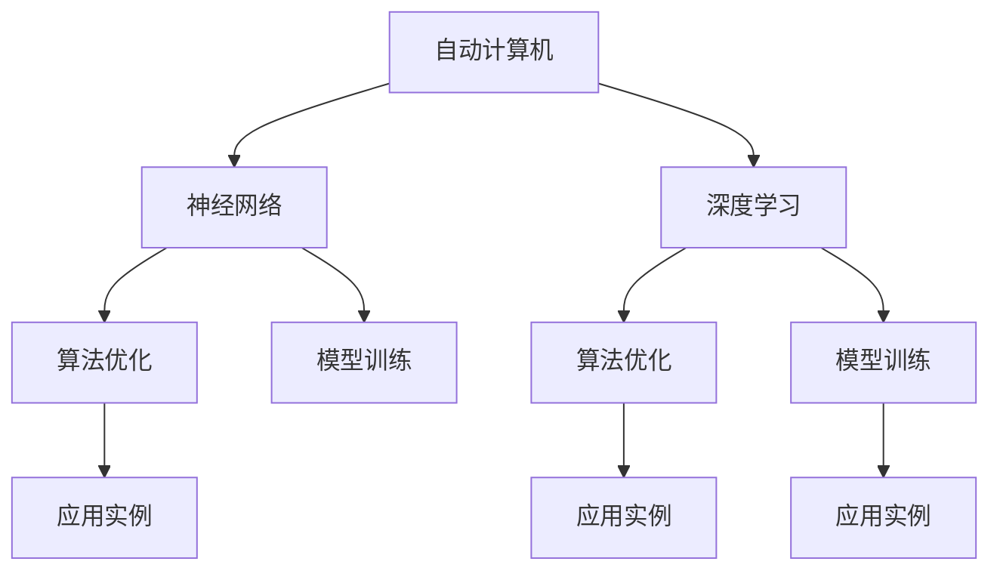

                 

# 自动计算机与神经网络的研究

> 关键词：自动计算机,神经网络,深度学习,计算机科学,算法优化,模型训练,应用实例

## 1. 背景介绍

### 1.1 问题由来

在计算机科学的发展历程中，神经网络作为一种重要的模拟生物神经系统的计算模型，自20世纪50年代以来，经历了多次起伏。尽管早期的研究进展不尽如人意，但随着深度学习技术的兴起，神经网络的应用和研究再次引起了广泛关注。自动计算机(Automatic Computer)，作为神经网络的一种变体，通过模拟人脑处理信息的方式，实现了对复杂问题的有效求解。本文旨在深入探讨自动计算机与神经网络的原理与联系，为读者提供对这一领域全面系统的理解。

### 1.2 问题核心关键点

自动计算机与神经网络的研究涉及多个核心概念，包括：

- 自动计算机(Automatic Computer)：一种模拟人脑神经系统处理信息的计算模型，能够自动进行复杂的数学运算，解决诸如模式识别、信号处理等问题。
- 神经网络(Neural Network)：由大量节点（神经元）组成的计算模型，通过多层结构模拟人脑处理信息的方式，广泛应用于图像识别、语音识别、自然语言处理等领域。
- 深度学习(Deep Learning)：利用多层神经网络模拟人脑处理信息的方式，实现对大规模数据的高效处理，是当前人工智能技术的重要支柱。
- 算法优化：为提高神经网络的计算效率和精度，研究者开发了多种优化算法，如随机梯度下降(SGD)、Adam、Adagrad等。
- 模型训练：通过反向传播算法对神经网络进行训练，使其适应特定的任务需求。
- 应用实例：自动计算机与神经网络在图像识别、语音识别、自然语言处理等领域取得了显著成效，如AlphaGo、GPT-3等。

这些核心概念相互关联，共同构成了自动计算机与神经网络研究的基石。通过理解这些概念，可以更好地把握其工作原理和优化方向。

## 2. 核心概念与联系

### 2.1 核心概念概述

为更好地理解自动计算机与神经网络的原理与联系，本节将介绍几个密切相关的核心概念：

- **自动计算机(Automatic Computer)**：由Hilbert于1926年提出，通过模拟人脑神经系统处理信息的方式，实现了对复杂数学问题的有效求解。自动计算机的特点在于其“自动”特性，即在输入一定条件下，无需人工干预，即可输出正确结果。
- **神经网络(Neural Network)**：由大量节点（神经元）组成的计算模型，通过多层结构模拟人脑处理信息的方式，广泛应用于图像识别、语音识别、自然语言处理等领域。
- **深度学习(Deep Learning)**：利用多层神经网络模拟人脑处理信息的方式，实现对大规模数据的高效处理，是当前人工智能技术的重要支柱。
- **算法优化**：为提高神经网络的计算效率和精度，研究者开发了多种优化算法，如随机梯度下降(SGD)、Adam、Adagrad等。
- **模型训练**：通过反向传播算法对神经网络进行训练，使其适应特定的任务需求。
- **应用实例**：自动计算机与神经网络在图像识别、语音识别、自然语言处理等领域取得了显著成效，如AlphaGo、GPT-3等。

这些核心概念之间的逻辑关系可以通过以下Mermaid流程图来展示：



这个流程图展示了一自动计算机、神经网络、深度学习、算法优化、模型训练和应用实例之间的内在联系。

## 3. 核心算法原理 & 具体操作步骤

### 3.1 算法原理概述

自动计算机与神经网络的核心算法原理可简述如下：

- **神经网络**：由多层神经元组成的网络结构，通过前向传播和反向传播进行训练，不断调整权重参数，以最小化损失函数。其中，前向传播用于计算输入数据经过网络层的输出，反向传播则用于计算损失函数对权重参数的梯度，从而更新权重参数。
- **深度学习**：通过增加网络层数，神经网络可以处理更加复杂的非线性关系，从而实现对大规模数据的有效处理。深度学习的关键在于使用反向传播算法进行高效的参数更新。
- **算法优化**：为了提高神经网络的训练速度和收敛性，研究者开发了多种优化算法，如随机梯度下降(SGD)、Adam、Adagrad等。这些算法通过调整学习率、动量等参数，优化了神经网络的训练过程。

### 3.2 算法步骤详解

基于神经网络的自动计算机与深度学习的核心算法步骤主要包括：

**Step 1: 模型设计**

- 确定网络结构：根据任务需求，设计合适的网络结构，包括层数、节点数、激活函数等。
- 选择损失函数：根据任务目标，选择合适的损失函数，如交叉熵、均方误差等。
- 确定优化器：选择合适的优化算法，如SGD、Adam、Adagrad等。

**Step 2: 数据预处理**

- 数据标准化：对输入数据进行归一化，使其符合模型期望的分布。
- 数据增强：通过旋转、翻转等方式扩充训练数据集，提高模型鲁棒性。
- 数据划分：将数据集划分为训练集、验证集和测试集。

**Step 3: 模型训练**

- 前向传播：将输入数据输入网络，计算每个节点的激活值。
- 计算损失：将网络的输出与真实标签进行比较，计算损失函数值。
- 反向传播：根据损失函数的梯度，计算每个权重参数的梯度。
- 参数更新：使用优化算法，更新权重参数，使得损失函数值最小化。

**Step 4: 模型评估**

- 验证集评估：使用验证集对模型进行评估，选择合适的超参数。
- 测试集评估：在测试集上评估模型性能，确定最终模型。

### 3.3 算法优缺点

自动计算机与神经网络的研究涉及多种算法，这些算法具有以下优缺点：

**优点**：

- 适应性强：神经网络能够处理复杂的非线性关系，适应多种数据类型和任务需求。
- 高效性：通过反向传播算法，神经网络能够高效地进行参数更新，加速模型训练。
- 鲁棒性：深度学习技术在处理大规模数据时表现出色，具有一定的鲁棒性。

**缺点**：

- 数据依赖：神经网络的效果高度依赖于训练数据的质量和数量。
- 模型复杂性：深层神经网络结构复杂，不易解释，难以调试。
- 计算资源需求高：训练深层神经网络需要大量的计算资源，可能导致硬件成本高。

### 3.4 算法应用领域

自动计算机与神经网络的研究在多个领域都有广泛的应用：

- **图像识别**：通过神经网络对图像进行处理和分类，广泛应用于自动驾驶、医学影像分析等领域。
- **语音识别**：利用神经网络对语音信号进行处理和识别，应用于语音助手、智能客服等领域。
- **自然语言处理**：通过神经网络对文本进行处理和分析，实现自动翻译、文本生成等任务。
- **信号处理**：利用神经网络对信号进行滤波、降噪等处理，应用于音频处理、通信等领域。
- **模式识别**：通过神经网络对复杂模式进行处理和识别，应用于异常检测、目标跟踪等领域。

## 4. 数学模型和公式 & 详细讲解 & 举例说明

### 4.1 数学模型构建

在神经网络与深度学习的数学建模中，我们通常使用如下数学模型：

- **神经元模型**：每个神经元接收输入信号，通过加权和和激活函数进行计算。神经元输出为：

$$
z = \sum_{i=1}^n w_iz_i + b
$$

$$
a = \sigma(z)
$$

其中，$z$为输入信号，$w_i$为权重，$b$为偏置，$\sigma$为激活函数。

- **前向传播**：将输入信号经过网络层进行计算，最终得到输出结果：

$$
\hat{y} = h \left( x \right) = \sigma \left( W_l h_{l-1} + b_l \right)
$$

其中，$h_{l-1}$为前一层的输出结果，$W_l$为当前层的权重矩阵，$b_l$为偏置向量。

- **损失函数**：选择合适的损失函数，如交叉熵、均方误差等，用于衡量模型的预测结果与真实标签之间的差异。例如，交叉熵损失函数：

$$
L = -\frac{1}{N} \sum_{i=1}^N \sum_{j=1}^C y_{ij} \log p_{ij}
$$

其中，$y_{ij}$为真实标签，$p_{ij}$为模型的预测概率。

- **反向传播**：计算损失函数对权重参数的梯度，并根据梯度更新权重参数。反向传播的计算过程如下：

$$
\frac{\partial L}{\partial z_l} = \frac{\partial L}{\partial h_l} \frac{\partial h_l}{\partial z_l}
$$

其中，$\frac{\partial L}{\partial h_l}$为损失函数对当前层输出的梯度，$\frac{\partial h_l}{\partial z_l}$为激活函数对当前层输出的导数。

### 4.2 公式推导过程

以下是交叉熵损失函数的详细推导过程：

**Step 1: 引入交叉熵损失函数**

设模型的真实标签为 $y_{ij}$，预测概率为 $p_{ij}$。交叉熵损失函数定义为：

$$
L = -\frac{1}{N} \sum_{i=1}^N \sum_{j=1}^C y_{ij} \log p_{ij}
$$

**Step 2: 推导梯度表达式**

设模型的输出为 $\hat{y}$，真实标签为 $y$。交叉熵损失函数对模型输出的梯度为：

$$
\frac{\partial L}{\partial \hat{y}} = -\frac{1}{N} \sum_{i=1}^N \frac{y_i}{\hat{y}_i} - \frac{1}{N} \sum_{i=1}^N \frac{1-y_i}{1-\hat{y}_i}
$$

其中，$y_i$为真实标签，$\hat{y}_i$为模型的预测结果。

**Step 3: 推导反向传播公式**

将上述梯度表达式代入反向传播公式，得到：

$$
\frac{\partial L}{\partial z_l} = \frac{\partial L}{\partial h_l} \frac{\partial h_l}{\partial z_l} = \frac{\partial L}{\partial h_l} \sigma'(z_l)
$$

其中，$\sigma'$为激活函数的导数。

### 4.3 案例分析与讲解

以图像分类为例，解释神经网络在图像识别任务中的应用：

- **数据预处理**：将图像数据进行归一化、裁剪、旋转等预处理，生成训练集和测试集。
- **模型设计**：选择合适的网络结构，如卷积神经网络(CNN)，设计输入层、卷积层、池化层、全连接层等。
- **模型训练**：将图像数据输入网络，计算损失函数，反向传播更新权重参数。
- **模型评估**：在测试集上评估模型性能，如准确率、召回率等。

## 5. 项目实践：代码实例和详细解释说明

### 5.1 开发环境搭建

在进行神经网络与深度学习实践前，我们需要准备好开发环境。以下是使用Python进行TensorFlow开发的环境配置流程：

1. 安装Anaconda：从官网下载并安装Anaconda，用于创建独立的Python环境。

2. 创建并激活虚拟环境：
```bash
conda create -n tf-env python=3.8 
conda activate tf-env
```

3. 安装TensorFlow：根据CUDA版本，从官网获取对应的安装命令。例如：
```bash
pip install tensorflow
```

4. 安装各类工具包：
```bash
pip install numpy pandas scikit-learn matplotlib tqdm jupyter notebook ipython
```

完成上述步骤后，即可在`tf-env`环境中开始神经网络与深度学习的实践。

### 5.2 源代码详细实现

下面我们以图像分类为例，给出使用TensorFlow进行神经网络训练的Python代码实现。

```python
import tensorflow as tf
from tensorflow.keras import layers
from tensorflow.keras.datasets import mnist
from tensorflow.keras.utils import to_categorical

# 加载数据集
(train_images, train_labels), (test_images, test_labels) = mnist.load_data()

# 数据预处理
train_images = train_images.reshape(-1, 28, 28, 1) / 255.0
test_images = test_images.reshape(-1, 28, 28, 1) / 255.0

# 数据标准化
train_images = train_images - 0.5
test_images = test_images - 0.5

# 数据标签编码
train_labels = to_categorical(train_labels)
test_labels = to_categorical(test_labels)

# 定义模型
model = tf.keras.Sequential([
    layers.Conv2D(32, (3, 3), activation='relu', input_shape=(28, 28, 1)),
    layers.MaxPooling2D((2, 2)),
    layers.Conv2D(64, (3, 3), activation='relu'),
    layers.MaxPooling2D((2, 2)),
    layers.Flatten(),
    layers.Dense(64, activation='relu'),
    layers.Dense(10, activation='softmax')
])

# 定义损失函数和优化器
loss_fn = tf.keras.losses.CategoricalCrossentropy()
optimizer = tf.keras.optimizers.Adam()

# 编译模型
model.compile(optimizer=optimizer, loss=loss_fn, metrics=['accuracy'])

# 训练模型
model.fit(train_images, train_labels, epochs=5, batch_size=64, validation_data=(test_images, test_labels))
```

以上就是使用TensorFlow对MNIST数据集进行图像分类的神经网络训练的完整代码实现。可以看到，TensorFlow提供了强大的API，使得神经网络的构建和训练变得简洁高效。

### 5.3 代码解读与分析

让我们再详细解读一下关键代码的实现细节：

**数据加载与预处理**：
- 使用`tf.keras.datasets.mnist.load_data()`加载MNIST数据集。
- 将图像数据reshape为(28, 28, 1)的维度，并进行归一化。
- 对数据进行标准化，即将均值设为0.5，使得数据中心化。
- 使用`to_categorical`函数对标签进行one-hot编码。

**模型定义**：
- 使用`tf.keras.Sequential`定义一个序列模型，包含多个卷积层、池化层和全连接层。
- 卷积层使用32个3x3的卷积核，激活函数为ReLU。
- 池化层使用2x2的最大池化，下采样。
- 最后两个全连接层分别有64个神经元和10个神经元，激活函数分别为ReLU和softmax。

**模型编译与训练**：
- 定义损失函数为交叉熵损失函数。
- 定义优化器为Adam。
- 使用`model.compile`方法编译模型，指定优化器和损失函数。
- 使用`model.fit`方法训练模型，指定训练集、验证集、训练轮数和批次大小。

**模型评估**：
- 在测试集上评估模型性能，输出准确率等指标。

可以看到，TensorFlow使得神经网络的构建和训练变得简单易懂，开发者可以更专注于模型的设计和优化。

## 6. 实际应用场景

### 6.1 智能推荐系统

智能推荐系统通过神经网络与深度学习技术，对用户行为和物品属性进行建模，从而实现个性化推荐。具体实现过程如下：

- **数据收集**：收集用户浏览、点击、评价等行为数据。
- **数据预处理**：对数据进行清洗、归一化、特征工程等处理，生成训练集和测试集。
- **模型设计**：选择合适的网络结构，如协同过滤、内容过滤等。
- **模型训练**：将用户行为和物品属性输入网络，计算损失函数，反向传播更新权重参数。
- **模型评估**：在测试集上评估模型性能，如准确率、召回率、F1分数等。

智能推荐系统能够根据用户的历史行为，预测其对新物品的兴趣，从而实现个性化推荐，提升用户满意度。

### 6.2 自动驾驶

自动驾驶系统通过神经网络与深度学习技术，对感知、决策、控制等环节进行建模，实现无人驾驶。具体实现过程如下：

- **数据收集**：收集车辆传感器、摄像头、雷达等数据。
- **数据预处理**：对数据进行清洗、归一化、特征工程等处理，生成训练集和测试集。
- **模型设计**：选择合适的网络结构，如卷积神经网络(CNN)、循环神经网络(RNN)等。
- **模型训练**：将传感器数据输入网络，计算损失函数，反向传播更新权重参数。
- **模型评估**：在测试集上评估模型性能，如准确率、召回率、F1分数等。

自动驾驶系统能够对道路环境进行实时感知，做出合理的决策，从而实现无人驾驶，提升交通安全性。

### 6.3 自然语言处理

自然语言处理通过神经网络与深度学习技术，对文本数据进行建模，实现文本分类、情感分析、机器翻译等任务。具体实现过程如下：

- **数据收集**：收集文本数据，如新闻、评论、社交媒体等。
- **数据预处理**：对数据进行清洗、分词、向量化等处理，生成训练集和测试集。
- **模型设计**：选择合适的网络结构，如循环神经网络(RNN)、长短时记忆网络(LSTM)、卷积神经网络(CNN)等。
- **模型训练**：将文本数据输入网络，计算损失函数，反向传播更新权重参数。
- **模型评估**：在测试集上评估模型性能，如准确率、召回率、F1分数等。

自然语言处理能够对文本数据进行自动处理和分析，提升信息检索、文本生成等任务的效率和准确性。

## 7. 工具和资源推荐

### 7.1 学习资源推荐

为了帮助开发者系统掌握神经网络与深度学习的理论基础和实践技巧，这里推荐一些优质的学习资源：

1. **《深度学习》（Goodfellow等）**：斯坦福大学Andrew Ng教授的入门经典，系统介绍了深度学习的基本概念和算法。
2. **《神经网络与深度学习》（Goodfellow等）**：斯坦福大学Andrew Ng教授的进阶读物，深入探讨了神经网络的原理和应用。
3. **《动手学深度学习》（李沐等）**：动手实践，通过项目驱动学习，介绍了深度学习的核心概念和算法。
4. **CS231n：卷积神经网络**：斯坦福大学开设的计算机视觉课程，介绍了卷积神经网络的原理和应用。
5. **CS224n：自然语言处理**：斯坦福大学开设的自然语言处理课程，介绍了自然语言处理的经典算法和模型。

通过对这些资源的学习实践，相信你一定能够快速掌握神经网络与深度学习的精髓，并用于解决实际的NLP问题。

### 7.2 开发工具推荐

高效的开发离不开优秀的工具支持。以下是几款用于神经网络与深度学习开发的常用工具：

1. **PyTorch**：基于Python的开源深度学习框架，灵活动态的计算图，适合快速迭代研究。
2. **TensorFlow**：由Google主导开发的开源深度学习框架，生产部署方便，适合大规模工程应用。
3. **Keras**：高级神经网络API，简洁易用，适合快速原型开发。
4. **MXNet**：跨平台的深度学习框架，支持多种编程语言和硬件设备。
5. **JAX**：Google开发的基于Python的深度学习框架，支持自动微分和优化，高效易用。

合理利用这些工具，可以显著提升神经网络与深度学习的开发效率，加快创新迭代的步伐。

### 7.3 相关论文推荐

神经网络与深度学习的发展源于学界的持续研究。以下是几篇奠基性的相关论文，推荐阅读：

1. **《Neural Networks and Deep Learning》（Goodfellow等）**：斯坦福大学Andrew Ng教授的博士论文，系统介绍了神经网络和深度学习的基本原理和算法。
2. **《Convolutional Neural Networks for Visual Recognition》（LeCun等）**：Yann LeCun等人在2015年发表的NIPS论文，介绍了卷积神经网络在计算机视觉中的应用。
3. **《Attention Is All You Need》（Vaswani等）**：Google团队在2017年发表的NIPS论文，提出了Transformer结构，开启了深度学习的新篇章。
4. **《Imagenet Classification with Deep Convolutional Neural Networks》（Krizhevsky等）**：Geoffrey Hinton团队在2012年发表的ICML论文，介绍了卷积神经网络在图像分类中的应用。
5. **《A Survey of Deep Learning Techniques》（Kaplan等）**：Kaplan等人在2018年发表的Survey论文，系统总结了深度学习领域的最新研究成果和应用方向。

这些论文代表了大神经网络与深度学习的发展脉络。通过学习这些前沿成果，可以帮助研究者把握学科前进方向，激发更多的创新灵感。

## 8. 总结：未来发展趋势与挑战

### 8.1 总结

本文对神经网络与深度学习的原理与联系进行了全面系统的介绍。首先阐述了神经网络与深度学习的研究背景和意义，明确了其对计算机科学发展的重要贡献。其次，从原理到实践，详细讲解了神经网络的数学模型和关键步骤，给出了神经网络训练的完整代码实例。同时，本文还广泛探讨了神经网络与深度学习在智能推荐、自动驾驶、自然语言处理等领域的应用前景，展示了其在解决复杂问题中的强大能力。此外，本文精选了神经网络与深度学习的各类学习资源，力求为读者提供全方位的技术指引。

通过本文的系统梳理，可以看到，神经网络与深度学习在复杂问题求解中发挥了重要作用，从理论到应用取得了丰硕成果。未来，随着技术的发展，神经网络与深度学习必将在更多领域得到应用，为计算机科学的发展注入新的动力。

### 8.2 未来发展趋势

展望未来，神经网络与深度学习的发展趋势如下：

1. **模型规模增大**：随着硬件算力的提升和数据量的增加，神经网络的模型规模将不断增大，模型性能将进一步提升。
2. **算法优化改进**：为提高神经网络的训练速度和收敛性，研究者将不断改进优化算法，如自适应学习率、批量归一化等。
3. **模型结构优化**：为减少模型参数量和计算复杂度，研究者将不断优化模型结构，如卷积神经网络、注意力机制等。
4. **跨模态学习**：神经网络与深度学习将逐步向多模态领域扩展，如图像、语音、文本等，实现跨模态信息的融合。
5. **自动化学习**：研究者将进一步研究自动化学习机制，如强化学习、元学习等，提升神经网络的自适应能力和迁移能力。
6. **模型可解释性**：为增强神经网络的可解释性，研究者将开发更多可视化工具和解释方法，提高模型的透明性。

这些趋势凸显了神经网络与深度学习的发展潜力，预示着其在更多领域的应用前景。

### 8.3 面临的挑战

尽管神经网络与深度学习取得了巨大成功，但在迈向更加智能化、普适化应用的过程中，仍面临诸多挑战：

1. **数据依赖**：神经网络与深度学习的性能高度依赖于数据的质量和数量，获取高质量数据成本高。
2. **计算资源需求高**：大规模神经网络的训练和推理需要大量计算资源，导致硬件成本高。
3. **模型复杂性**：深层神经网络结构复杂，难以解释和调试。
4. **泛化能力不足**：神经网络与深度学习在面对新任务和新数据时，泛化能力不足。
5. **伦理问题**：神经网络与深度学习在应用过程中可能存在伦理和隐私问题，如数据泄露、偏见等问题。

### 8.4 研究展望

面对神经网络与深度学习面临的挑战，未来的研究需要在以下几个方面寻求新的突破：

1. **无监督学习**：探索无监督学习范式，摆脱对大规模标注数据的依赖，利用自监督学习、主动学习等方法，最大化数据利用率。
2. **轻量级模型**：开发轻量级神经网络模型，如MobileNet、EfficientNet等，提升模型的计算效率和实时性。
3. **自动化学习**：研究自动化学习机制，如强化学习、元学习等，提升模型的自适应能力和迁移能力。
4. **可解释性**：开发更多可视化工具和解释方法，提高模型的透明性和可解释性。
5. **跨模态学习**：研究跨模态信息的融合，实现图像、语音、文本等多种模态数据的协同建模。

这些研究方向将为神经网络与深度学习带来新的突破，推动其进一步发展和应用。

## 9. 附录：常见问题与解答

**Q1：神经网络与深度学习是否适用于所有计算机科学领域？**

A: 神经网络与深度学习在计算机科学中的适用范围非常广泛，但在某些领域（如生物信息学、自然语言处理）表现更为出色。对于其他领域（如系统编程、数据结构等），神经网络与深度学习的适用性较低。

**Q2：如何选择合适的神经网络与深度学习框架？**

A: 选择合适的神经网络与深度学习框架需要考虑以下几个因素：

1. **易用性**：如Keras、PyTorch等高级API，易于上手和调试。
2. **性能**：如TensorFlow、MXNet等高性能框架，适合大规模工程应用。
3. **社区支持**：如TensorFlow、PyTorch等框架拥有庞大的社区和丰富的资源，便于学习与交流。
4. **模型库**：如TensorFlow、PyTorch等框架拥有丰富的预训练模型库，便于快速开发和应用。

**Q3：神经网络与深度学习在实际应用中需要注意哪些问题？**

A: 神经网络与深度学习在实际应用中需要注意以下几个问题：

1. **数据预处理**：数据的清洗、归一化、特征工程等预处理是模型的关键。
2. **模型选择**：选择合适的模型结构和优化算法，平衡性能和效率。
3. **超参数调优**：通过网格搜索、随机搜索等方法，找到最优的超参数组合。
4. **模型评估**：选择合适的评估指标，如准确率、召回率、F1分数等，评估模型性能。
5. **模型部署**：选择合适的部署平台，优化模型推理速度，确保应用稳定。

**Q4：神经网络与深度学习在未来的发展方向是什么？**

A: 神经网络与深度学习的未来发展方向如下：

1. **自动化学习**：研究自动化学习机制，如强化学习、元学习等，提升模型的自适应能力和迁移能力。
2. **跨模态学习**：研究跨模态信息的融合，实现图像、语音、文本等多种模态数据的协同建模。
3. **轻量级模型**：开发轻量级神经网络模型，提升模型的计算效率和实时性。
4. **可解释性**：开发更多可视化工具和解释方法，提高模型的透明性和可解释性。

这些方向将推动神经网络与深度学习的进一步发展和应用。

---

作者：禅与计算机程序设计艺术 / Zen and the Art of Computer Programming

