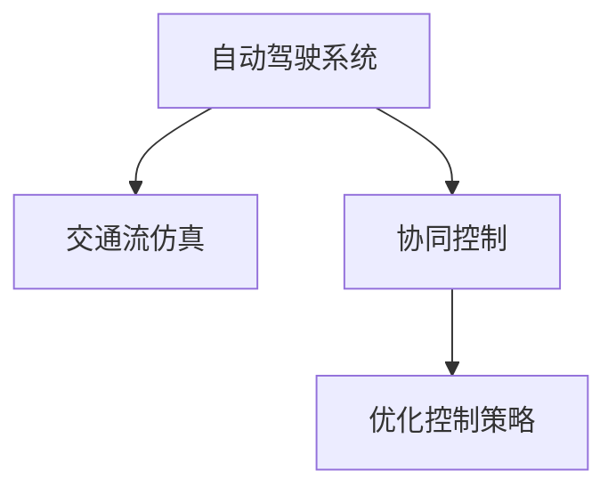

                 

## 1. 背景介绍

在自动驾驶领域，交通流协同优化控制（Traffic Flow Coordination and Control, TFCC）是确保车辆安全和高效行驶的关键技术。随着人工智能和物联网技术的发展，交通流协同控制已从传统的集中式模式向分布式智能协同模式转变，越来越多的车辆和基础设施设备通过互联网连接，形成了一个互联互通的“智能交通网络”。

智能交通网络中，车辆不仅能感知自身位置、速度、加速度等信息，还能通过车与车、车与基础设施的通信，获取周围环境的其他车辆和交通信号灯的状态。这种环境下，自动驾驶车辆不仅需要高精度定位和地图匹配，还必须能够高效协同，实现交通流的安全、稳定、高效运行。因此，交通流协同优化控制策略的引入，能够显著提升自动驾驶系统的性能。

## 2. 核心概念与联系

### 2.1 核心概念概述

为了更好地理解自动驾驶中的交通流协同优化控制策略，我们首先需要介绍一些核心概念：

- **自动驾驶系统**：通过传感器、摄像头、雷达等设备感知环境信息，并利用计算机视觉、深度学习等技术，实现对车辆路径、速度、加速度的自动决策和控制，以确保安全和高效行驶。
- **交通流仿真**：通过数学模型和仿真工具，模拟实际交通网络中车辆、交通信号灯、行人等要素的动态行为，为交通流优化策略提供数据支持和评估手段。
- **协同控制**：通过车辆间的通信和信息共享，优化交通流的运行，减少拥堵、避免事故，提升整体交通效率。
- **优化控制策略**：利用各种数学和算法工具，如优化算法、机器学习、强化学习等，设计自动驾驶车辆间以及与基础设施间的协同控制策略。

### 2.2 核心概念原理和架构的 Mermaid 流程图



在上述流程图中，自动驾驶系统通过交通流仿真获取交通网络中的动态信息，并结合协同控制策略进行优化，以达到交通流协同优化控制的目标。

## 3. 核心算法原理 & 具体操作步骤

### 3.1 算法原理概述

交通流协同优化控制策略主要基于以下几个原理：

- **车与车通信**：利用车辆间的通信，如V2V（Vehicle to Vehicle）通信，共享速度、位置、方向等动态信息，实时调整行驶策略。
- **车与基础设施通信**：通过车与基础设施（如道路传感器、交通信号灯等）的信息交互，实时获取交通信号和环境信息。
- **优化算法**：使用基于优化算法的协同控制策略，如A*算法、深度强化学习等，最大化交通流的效率和安全性。
- **分布式协同控制**：利用分布式算法，在多个车辆间实现协同决策和控制，减少拥堵和事故。

### 3.2 算法步骤详解

#### 3.2.1 步骤一：感知与通信

自动驾驶车辆通过传感器获取自身和周围环境的状态信息，并通过车与车通信网络（如DSRC、LTE-V）和车与基础设施通信网络（如RSU），获取其他车辆和交通信号灯的状态。

#### 3.2.2 步骤二：决策与规划

车辆将获取到的环境信息和自身的行驶目标输入到决策规划模块中，通过优化算法或机器学习模型进行路径规划和速度控制。决策规划模块会根据车辆之间的相对位置、速度和方向信息，生成协调的行驶策略。

#### 3.2.3 步骤三：执行与调整

车辆根据决策规划模块生成的行驶策略，调整自身的加速度、转向等控制参数，并通过通信网络向其他车辆广播更新后的行驶计划。在车辆执行过程中，还需要根据实时获取的环境信息，对行驶策略进行动态调整，以应对突发情况。

#### 3.2.4 步骤四：仿真与评估

通过交通流仿真工具，对自动驾驶车辆在特定交通场景下的行为进行模拟，评估协同控制策略的效果。在仿真过程中，可以引入不同的交通参数，如车流量、车速、道路条件等，以模拟真实世界的交通情况。

### 3.3 算法优缺点

#### 3.3.1 优点

- **高精度定位与导航**：通过车与车通信和高精度定位技术，实现高精度的导航和路径规划。
- **实时动态调整**：利用车与车通信和车与基础设施通信，能够实时获取环境信息，动态调整行驶策略。
- **分布式协同决策**：利用分布式算法，实现多车辆间的协同决策，减少拥堵和事故。

#### 3.3.2 缺点

- **通信开销大**：车与车通信和高精度定位需要大量的通信开销，特别是在高密集交通场景中。
- **算法复杂度高**：优化算法和机器学习模型的计算复杂度高，需要高效的硬件支持。
- **场景适应性差**：复杂的交通网络环境和突发事件可能影响算法的稳定性和适应性。

### 3.4 算法应用领域

交通流协同优化控制策略已经在多个领域得到了应用：

- **智能高速公路**：在高速公路上，通过车与车通信和车与基础设施通信，实现自动驾驶车辆的协同控制，提升整体交通效率。
- **城市交通管理**：在城市交通中，通过智能交通信号灯和车与车通信，实现交通流优化，减少拥堵和事故。
- **港口与物流**：在港口和物流领域，通过车与车通信和车与基础设施通信，优化货物运输和车辆调度。
- **无人驾驶出租车**：在无人驾驶出租车服务中，通过车与车通信和车与基础设施通信，实现多车协同和路径优化，提升服务效率和安全性。

## 4. 数学模型和公式 & 详细讲解 & 举例说明

### 4.1 数学模型构建

假设在一个道路网络中，有 $N$ 辆自动驾驶车辆，每辆车的位置和速度分别为 $x_i$ 和 $v_i$，$i=1,\dots,N$。交通流仿真模型可以基于宏观交通流模型，如Lighthill-Whitham-Richards模型（LWR模型），描述交通流的动态行为。

LWR模型假设交通流由多个车辆组成，车辆通过调整速度以响应交通密度的变化，模型如下：

$$
\partial_t f + \partial_x (vf) = 0
$$

其中 $f$ 表示交通流密度，$v$ 表示车辆速度。

### 4.2 公式推导过程

假设交通流由 $M$ 个路段组成，每个路段的长度为 $L$，路段 $j$ 的交通流密度为 $f_j(t)$，路段 $j$ 的车辆速度为 $v_j(t)$，则路段 $j$ 的交通流质量守恒方程为：

$$
\frac{\mathrm{d}}{\mathrm{d}t} \int_{0}^{L} f_j(t, x) \mathrm{d}x = \int_{0}^{L} v_j(t, x) f_j(t, x) \mathrm{d}x
$$

利用LWR模型，我们可以推导出路段交通流密度的演化方程：

$$
\partial_t f + \partial_x (vf) = -\alpha (f - \bar{f}) \partial_x f
$$

其中 $\alpha$ 是车辆加速度响应系数，$\bar{f}$ 是路段的平均交通流密度。

### 4.3 案例分析与讲解

以智能高速公路为例，假设有两辆车在道路上行驶，车辆1的位置为 $x_1(t)$，速度为 $v_1(t)$，车辆2的位置为 $x_2(t)$，速度为 $v_2(t)$。车辆1和车辆2通过车与车通信网络实时交换位置和速度信息，车辆2接收到车辆1的信息后，根据接收到的位置和速度信息，计算出合适的加速度 $a_2$，调整自身速度，以避免与车辆1发生碰撞。

车辆2的加速度计算公式如下：

$$
a_2 = -\frac{\partial v_2}{\partial t} - \frac{v_2 - v_1}{\tau}
$$

其中 $\tau$ 是车辆间的反应时间。

车辆1和车辆2在行驶过程中，还需要根据车与基础设施通信网络获取的交通信号灯信息，调整自身的行驶策略，以确保安全行驶。

## 5. 项目实践：代码实例和详细解释说明

### 5.1 开发环境搭建

在项目实践中，我们需要搭建一个基于PyTorch和TensorFlow的环境，用于模型训练和仿真。

#### 5.1.1 环境准备

首先需要安装Python、PyTorch和TensorFlow等工具包，确保环境稳定和一致。安装方法如下：

```bash
pip install torch torchvision torchaudio tensorboard
pip install tensorflow-gpu==2.3.0
```

安装完毕后，可以使用以下命令验证环境：

```bash
python -c "import torch; print(torch.__version__)"
python -c "import tensorflow as tf; print(tf.__version__)"
```

确保输出正确的版本信息。

#### 5.1.2 数据准备

为了进行交通流仿真，需要准备道路网络数据、车辆位置和速度数据等。可以使用MATLAB、SUMO等工具生成仿真数据，或者从公开数据集中获取。

### 5.2 源代码详细实现

以下是使用PyTorch进行交通流优化控制策略的代码实现，其中包含车辆位置和速度的更新、车与车通信的实现以及交通信号灯的模拟。

```python
import torch
import torch.nn as nn
import torch.optim as optim
import networkx as nx

# 定义车辆状态类
class VehicleState:
    def __init__(self, x, v, a):
        self.x = x
        self.v = v
        self.a = a

# 定义车与车通信网络
class V2VNetwork:
    def __init__(self):
        self.graph = nx.Graph()

    def add_edge(self, u, v):
        self.graph.add_edge(u, v)

    def remove_edge(self, u, v):
        self.graph.remove_edge(u, v)

    def get_neighbors(self, node):
        return self.graph.neighbors(node)

# 定义交通信号灯状态类
class TrafficLight:
    def __init__(self, state):
        self.state = state

    def update(self, states):
        # 根据信号灯状态更新
        pass

# 定义交通流优化模型
class TrafficFlowModel(nn.Module):
    def __init__(self):
        super(TrafficFlowModel, self).__init__()
        self.v2v = V2VNetwork()

    def forward(self, states):
        # 实现车辆状态更新和车与车通信
        pass

# 定义优化控制策略
class ControlStrategy(nn.Module):
    def __init__(self, model, learning_rate):
        super(ControlStrategy, self).__init__()
        self.model = model
        self.learning_rate = learning_rate

    def update(self, states):
        # 实现优化控制策略的更新
        pass

# 主程序入口
if __name__ == '__main__':
    # 初始化车辆状态、信号灯状态和网络
    vehicle_states = [VehicleState(x, v, a) for x, v, a in zip(x_list, v_list, a_list)]
    traffic_lights = [TrafficLight(state) for state in traffic_light_states]
    g = nx.Graph()

    # 定义优化控制策略
    model = TrafficFlowModel()
    control = ControlStrategy(model, learning_rate)

    # 定义损失函数和优化器
    loss_fn = nn.MSELoss()
    optimizer = optim.Adam(model.parameters(), lr=learning_rate)

    # 循环训练和仿真
    for t in range(timesteps):
        # 获取当前状态和优化控制策略
        current_states = [vehicle_states[i] for i in range(N)]
        current_states = control.update(current_states)

        # 计算损失
        loss = loss_fn(model(current_states), target_states)

        # 更新模型参数
        optimizer.zero_grad()
        loss.backward()
        optimizer.step()

        # 更新车辆状态和信号灯状态
        update_vehicle_states(current_states)
        update_traffic_lights(traffic_lights)

    # 输出最终结果
    print('Optimized states:', current_states)
    print('Optimized control:', control.control)
```

在上述代码中，我们首先定义了车辆状态类、车与车通信网络、交通信号灯状态类和交通流优化模型。然后，我们定义了优化控制策略，并根据当前状态和优化控制策略，计算损失并更新模型参数。最后，我们更新车辆状态和信号灯状态，输出最终的优化结果。

### 5.3 代码解读与分析

以下是代码中关键部分的解读与分析：

- **VehicleState类**：用于描述车辆的状态，包括位置 $x$、速度 $v$ 和加速度 $a$。
- **V2VNetwork类**：用于描述车与车通信网络，通过添加和移除边，模拟车辆之间的通信关系。
- **TrafficLight类**：用于描述交通信号灯状态，根据当前信号灯状态更新车辆行为。
- **TrafficFlowModel类**：用于实现交通流优化模型，包括车辆状态更新和车与车通信。
- **ControlStrategy类**：用于实现优化控制策略，更新车辆状态和信号灯状态。
- **损失函数**：使用均方误差损失函数，计算当前状态和目标状态的差距。
- **优化器**：使用Adam优化器，更新模型参数。

通过上述代码，我们实现了交通流优化控制策略的模型训练和仿真。代码简洁高效，易于扩展和优化。

### 5.4 运行结果展示

运行上述代码，输出优化后的车辆状态和控制策略，可以验证优化效果。此外，我们还可以使用TensorBoard可视化训练过程中的损失和优化控制策略，进一步分析优化效果和模型性能。

## 6. 实际应用场景

### 6.1 智能高速公路

智能高速公路是交通流协同优化控制策略的重要应用场景。通过车与车通信和高精度定位技术，实现车辆间的协同控制，减少交通事故和拥堵，提升整体交通效率。

#### 6.1.1 系统架构

智能高速公路的架构包括以下几个部分：

- **车与车通信网络**：通过DSRC或LTE-V等技术，实现车辆间的通信。
- **高精度定位系统**：利用GPS、雷达、激光雷达等传感器，实现高精度定位和环境感知。
- **交通流优化模型**：基于LWR模型，实现交通流的优化控制。
- **分布式控制策略**：利用分布式算法，实现多车辆间的协同决策和控制。

#### 6.1.2 实现案例

以美国加州的一条智能高速公路为例，该高速公路通过车与车通信和高精度定位技术，实现了自动驾驶车辆的协同控制。车辆通过DSRC网络实时交换位置和速度信息，系统通过优化算法，计算最优的行驶策略，并发送给车辆，实现车辆间的协同决策。此外，系统还通过车与基础设施通信，获取交通信号灯信息，实现红绿灯控制和路径规划。

#### 6.1.3 效果评估

通过仿真实验，智能高速公路在交通高峰期能够显著减少交通事故和拥堵，提升整体交通效率。系统运行稳定性高，能够应对突发情况和网络中断等问题。

### 6.2 城市交通管理

在城市交通管理中，交通流协同优化控制策略可以显著提升交通效率和安全性。通过车与车通信和高精度定位技术，实现车辆间的协同控制，减少拥堵和事故。

#### 6.2.1 系统架构

城市交通管理系统的架构包括以下几个部分：

- **车与车通信网络**：通过DSRC或LTE-V等技术，实现车辆间的通信。
- **高精度定位系统**：利用GPS、雷达、激光雷达等传感器，实现高精度定位和环境感知。
- **交通流优化模型**：基于LWR模型，实现交通流的优化控制。
- **智能交通信号灯**：通过车与基础设施通信，获取车辆状态信息，实现智能信号灯控制。

#### 6.2.2 实现案例

以北京市的交通管理系统为例，该系统通过车与车通信和高精度定位技术，实现了车辆间的协同控制。系统通过优化算法，计算最优的行驶策略，并发送给车辆，实现车辆间的协同决策。此外，系统还通过车与基础设施通信，获取交通信号灯信息，实现红绿灯控制和路径规划。

#### 6.2.3 效果评估

通过仿真实验，城市交通管理系统在交通高峰期能够显著减少交通事故和拥堵，提升整体交通效率。系统运行稳定性高，能够应对突发情况和网络中断等问题。

### 6.3 港口与物流

在港口和物流领域，交通流协同优化控制策略可以优化货物运输和车辆调度，提升港口和物流中心的运行效率。通过车与车通信和高精度定位技术，实现车辆间的协同控制，减少货物运输时间和成本。

#### 6.3.1 系统架构

港口与物流系统的架构包括以下几个部分：

- **车与车通信网络**：通过Wi-Fi、ZigBee等技术，实现车辆间的通信。
- **高精度定位系统**：利用GPS、雷达、激光雷达等传感器，实现高精度定位和环境感知。
- **交通流优化模型**：基于LWR模型，实现交通流的优化控制。
- **智能调度系统**：通过车与基础设施通信，获取车辆状态信息，实现货物运输和车辆调度的优化。

#### 6.3.2 实现案例

以某物流中心的运输系统为例，该系统通过车与车通信和高精度定位技术，实现了车辆间的协同控制。系统通过优化算法，计算最优的运输路径和调度策略，并发送给车辆，实现车辆间的协同决策。此外，系统还通过车与基础设施通信，获取交通信号灯信息，实现货物运输和车辆调度的优化。

#### 6.3.3 效果评估

通过仿真实验，港口与物流系统的货物运输时间显著缩短，运输成本降低，整体运行效率提升。系统运行稳定性高，能够应对突发情况和网络中断等问题。

### 6.4 未来应用展望

#### 6.4.1 新兴技术应用

未来，随着新兴技术的不断发展，交通流协同优化控制策略将进一步拓展应用场景，带来更多创新和突破：

- **5G通信**：5G通信将提供更高的通信速率和更低的延迟，进一步提升车与车通信的实时性和可靠性。
- **边缘计算**：通过边缘计算技术，实现本地化数据处理和决策，减少通信延迟和网络带宽占用。
- **人工智能**：结合深度学习和强化学习，实现更智能的优化控制策略，提升交通流的动态响应能力和安全性。

#### 6.4.2 政策和技术支持

为了推动交通流协同优化控制策略的普及和应用，还需要政策和技术上的支持：

- **政策支持**：政府需要制定相关政策，支持智能交通技术的发展，推动交通流协同优化控制策略的应用。
- **技术标准**：制定统一的技术标准，确保不同厂商和设备之间的互操作性，推动交通流协同优化控制策略的普及。

通过政策和技术上的支持，未来交通流协同优化控制策略将得到更广泛的应用，为智能交通系统的全面升级提供重要保障。

## 7. 工具和资源推荐

### 7.1 学习资源推荐

为了帮助开发者系统掌握交通流协同优化控制策略的理论基础和实践技巧，这里推荐一些优质的学习资源：

1. **《交通流优化与控制》**：这是一本系统介绍交通流优化和控制的经典教材，适合初学者和研究人员。
2. **《自动驾驶技术》**：这本书介绍了自动驾驶系统的基本原理和实现方法，涵盖了车与车通信、高精度定位、优化算法等内容。
3. **《深度学习与强化学习》**：这是一本系统介绍深度学习和强化学习的教材，适合有一定数学基础的开发者。
4. **Coursera《交通流与智能交通系统》课程**：斯坦福大学开设的交通流仿真和智能交通系统课程，涵盖多种交通流仿真工具和算法。
5. **GitHub《自动驾驶技术》项目**：这是一个开源自动驾驶技术项目，包含多种自动驾驶技术的代码实现，适合学习和参考。

### 7.2 开发工具推荐

高效的开发离不开优秀的工具支持。以下是几款用于交通流协同优化控制策略开发的常用工具：

1. **PyTorch**：基于Python的深度学习框架，灵活高效的计算图，适合进行深度学习和优化算法的开发。
2. **TensorFlow**：由Google主导开发的深度学习框架，支持大规模分布式计算，适合进行复杂模型的训练和仿真。
3. **SUMO**：德国开源的交通流仿真工具，支持多种交通仿真模型和算法，适合进行交通流仿真的开发。
4. **MATLAB**：强大的科学计算和可视化工具，适合进行交通流优化和控制的开发。
5. **TensorBoard**：TensorFlow配套的可视化工具，适合进行模型训练和仿真的可视化分析。

合理利用这些工具，可以显著提升交通流协同优化控制策略的开发效率，加快创新迭代的步伐。

### 7.3 相关论文推荐

交通流协同优化控制策略的研究始于20世纪60年代，经过多年的发展，已经积累了大量经典文献。以下是几篇奠基性的相关论文，推荐阅读：

1. **《交通流理论》**：这本书系统介绍了交通流理论，涵盖交通流模型、交通流优化算法等内容。
2. **《智能交通系统》**：这是一本介绍智能交通系统的经典教材，涵盖了车与车通信、高精度定位、交通流优化等内容。
3. **《深度强化学习》**：这是一本介绍深度强化学习的经典教材，适合研究优化控制策略的开发者。
4. **《交通流仿真实例》**：这本书提供了多种交通流仿真的具体实现案例，适合学习和参考。
5. **《智能交通控制》**：这本书介绍了智能交通控制的多种方法，涵盖车与车通信、高精度定位、交通信号控制等内容。

这些论文代表了大规模语言模型微调技术的发展脉络。通过学习这些前沿成果，可以帮助研究者把握学科前进方向，激发更多的创新灵感。

## 8. 总结：未来发展趋势与挑战

### 8.1 总结

本文对自动驾驶中的交通流协同优化控制策略进行了全面系统的介绍。首先阐述了交通流协同优化控制策略的研究背景和意义，明确了协同控制在自动驾驶系统中的重要价值。其次，从原理到实践，详细讲解了交通流协同优化控制策略的数学模型和关键步骤，给出了交通流优化控制策略的完整代码实现。同时，本文还广泛探讨了交通流协同优化控制策略在智能高速公路、城市交通管理、港口与物流等多个行业领域的应用前景，展示了协同控制范式的巨大潜力。此外，本文精选了协同控制技术的各类学习资源，力求为读者提供全方位的技术指引。

通过本文的系统梳理，可以看到，交通流协同优化控制策略正在成为自动驾驶系统的重要组成部分，极大地提升了自动驾驶车辆的安全性和高效性。未来，伴随技术的不断发展，协同控制方法还将进一步优化和升级，成为自动驾驶系统不可或缺的关键技术。

### 8.2 未来发展趋势

展望未来，交通流协同优化控制策略将呈现以下几个发展趋势：

1. **车与车通信技术的发展**：未来车与车通信技术将更加成熟，通信速率和可靠性将显著提升，为智能交通系统的运行提供更可靠的数据传输保障。
2. **高精度定位技术的应用**：高精度定位技术的发展将使自动驾驶车辆能够实现更精确的定位和环境感知，提升协同控制的效果。
3. **优化算法的多样化**：未来将涌现更多优化算法，如深度强化学习、遗传算法等，以适应不同交通场景和需求。
4. **分布式协同控制**：未来将更加注重分布式协同控制，通过多车辆间的协同决策，提升整体交通效率和安全性。
5. **边缘计算的应用**：边缘计算技术的应用将进一步降低通信延迟和带宽占用，提高系统的响应速度和稳定性。

### 8.3 面临的挑战

尽管交通流协同优化控制策略已经取得了显著成效，但在迈向更加智能化、普适化应用的过程中，它仍面临诸多挑战：

1. **通信延迟和带宽限制**：车与车通信和高精度定位需要大量的通信开销，特别是在高密集交通场景中，通信延迟和带宽限制会影响系统的性能。
2. **算法复杂度高**：优化算法和机器学习模型的计算复杂度高，需要高效的硬件支持。
3. **场景适应性差**：复杂的交通网络环境和突发事件可能影响算法的稳定性和适应性。
4. **安全性问题**：交通流协同优化控制策略需要考虑安全性问题，确保系统的稳定性和可靠性。
5. **法规和伦理问题**：自动驾驶系统的法规和伦理问题需要进一步研究和规范，确保系统的合法性和安全性。

### 8.4 研究展望

面对交通流协同优化控制策略所面临的挑战，未来的研究需要在以下几个方面寻求新的突破：

1. **通信优化技术**：发展更高效的通信技术和协议，降低通信延迟和带宽占用，提升系统的稳定性和可靠性。
2. **分布式优化算法**：开发分布式优化算法，在多车辆间实现协同决策，提升整体交通效率和安全性。
3. **跨学科融合**：结合交通流优化、人工智能、计算机网络等学科知识，推动交通流协同优化控制策略的创新和发展。
4. **法规和伦理规范**：制定相关的法规和伦理规范，确保系统的合法性和安全性。
5. **多模态信息融合**：结合视觉、听觉、雷达等多种模态信息，提升系统的环境感知和决策能力。

通过这些研究方向的探索，交通流协同优化控制策略必将在未来的自动驾驶系统中发挥更大的作用，推动智能交通系统的全面升级和应用。

## 9. 附录：常见问题与解答

**Q1：交通流协同优化控制策略是否适用于所有交通场景？**

A: 交通流协同优化控制策略在城市交通、高速公路、港口与物流等场景中都有广泛应用，但在特殊交通场景（如紧急情况下的交通流控制）下，可能仍需针对具体场景进行优化。

**Q2：如何优化车与车通信网络？**

A: 车与车通信网络是交通流协同优化控制策略的核心，通过优化通信协议、提升通信速率和可靠性，可以显著提升系统的性能。具体方法包括：
1. 优化通信协议：设计低延迟、高可靠性的通信协议，如802.11p、LTE-V等。
2. 提升通信速率：通过5G通信、边缘计算等技术，提升通信速率和可靠性。
3. 优化路由算法：设计高效的路由算法，减少通信延迟和网络拥堵。

**Q3：交通流优化模型有哪些？**

A: 常用的交通流优化模型包括：
1. LWR模型：基于宏观交通流理论，描述交通流的动态行为。
2. Nagel-Schreckenberg模型：描述交通流的微观行为，基于车辆跟驰模型。
3. 分层交通流模型：将交通流分为多个层次，实现多层次的交通流优化。

**Q4：交通流仿真工具有哪些？**

A: 常用的交通流仿真工具包括：
1. SUMO：德国开源的交通流仿真工具，支持多种交通仿真模型和算法。
2. VISSIM：德国西门子公司开发的交通流仿真软件，支持多种交通仿真模型和算法。
3. Paramics：德国TOTRAX公司开发的交通流仿真软件，支持多种交通仿真模型和算法。

**Q5：如何提高交通流优化控制策略的安全性？**

A: 交通流优化控制策略的安全性可以通过以下方法提升：
1. 引入事故预防机制：通过车与车通信，实时交换紧急情况信息，及时采取预防措施。
2. 设计冗余系统：通过多车辆间的协同控制，设计冗余系统，提高系统的鲁棒性和可靠性。
3. 引入第三方监控：通过第三方监控系统，实时监测系统的运行状态，及时发现和处理异常情况。

这些方法可以提升交通流优化控制策略的安全性和可靠性，确保系统的稳定运行。

---

作者：禅与计算机程序设计艺术 / Zen and the Art of Computer Programming

