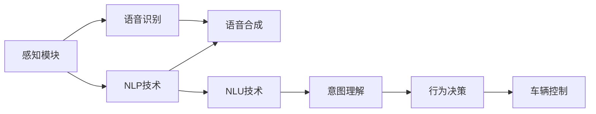

                 

# 自动驾驶中的自然语言交互与语音控制

## 1. 背景介绍

随着人工智能技术的快速发展，自动驾驶（Autonomous Driving, AD）技术逐渐从概念走向现实。自动驾驶系统通过车辆感知、决策和控制模块的协同工作，实现对车辆的全方位控制，让驾驶任务自动化、智能化。然而，自动驾驶系统要实现人车交互的自然流畅，还需要借助自然语言处理（Natural Language Processing, NLP）和语音识别（Speech Recognition）技术。通过这些技术，驾驶者可以用自然语言或语音控制车辆，系统也能理解驾驶者的意图，从而保证安全、高效的驾驶体验。本文将深入探讨自动驾驶中的自然语言交互与语音控制技术，阐释其核心原理与实践方法。

## 2. 核心概念与联系

### 2.1 核心概念概述

自动驾驶中的自然语言交互与语音控制技术涉及以下几个关键概念：

- **自然语言处理（NLP）**：研究如何让计算机理解、处理和生成自然语言。NLP技术主要包括语言模型、文本分类、信息抽取、问答系统等。
- **语音识别（Speech Recognition）**：将语音信号转换为文本的过程。语音识别技术包括声学模型、语言模型、解码器等。
- **语音合成（Text-to-Speech, TTS）**：将文本转换为语音信号的过程。TTS技术包括声码器、调音器等。
- **交互界面（UI/UX）**：自动驾驶系统的用户界面与用户体验设计，直接影响驾驶者的操作感受与系统的易用性。

这些技术相互关联，共同构成了自动驾驶中的自然语言交互与语音控制框架。

### 2.2 核心概念原理和架构的 Mermaid 流程图



### 2.3 核心概念联系

上述核心概念通过以下联系构成自动驾驶中的自然语言交互与语音控制系统：

- **感知模块**：采集车辆周围环境信息，为NLP和语音识别提供输入数据。
- **NLP技术**：处理和理解用户输入的自然语言，提取关键信息。
- **语音识别**：将驾驶者的语音转换为文本，输入到NLP系统中。
- **语音合成**：输出语音，告知驾驶者系统状态或操作指令。
- **意图理解**：解析驾驶者的语言或语音指令，转化为可执行的决策。
- **行为决策**：根据意图理解结果，制定车辆控制策略。
- **车辆控制**：执行决策，实际控制车辆行驶。

这些联系揭示了自动驾驶系统从感知、处理、决策到控制的全过程，体现了自然语言交互与语音控制技术的深度整合。

## 3. 核心算法原理 & 具体操作步骤

### 3.1 算法原理概述

自动驾驶中的自然语言交互与语音控制技术主要通过以下几个步骤实现：

1. **数据采集与预处理**：采集车辆周围环境信息，如摄像头、雷达等传感器的数据，并对数据进行预处理。
2. **语音识别**：使用声学模型将驾驶者的语音信号转换为文本。
3. **自然语言处理**：对文本进行分词、词性标注、实体识别等处理，提取关键信息。
4. **意图理解**：根据NLP结果，解析驾驶者的意图，如停车、变道、导航等。
5. **行为决策**：基于意图理解，制定车辆控制策略。
6. **语音合成**：将决策结果转换为语音，告知驾驶者。
7. **车辆控制**：执行决策，控制车辆行驶。

### 3.2 算法步骤详解

#### 3.2.1 数据采集与预处理

1. **传感器数据采集**：使用摄像头、雷达、激光雷达等传感器，获取车辆周围环境的信息。
2. **数据清洗与归一化**：对传感器数据进行去噪、校正、归一化等预处理操作，确保数据质量。
3. **融合处理**：将不同传感器的数据进行融合处理，提高环境感知的准确性。

#### 3.2.2 语音识别

1. **前端信号处理**：对驾驶者的语音信号进行去噪、滤波等预处理。
2. **声学模型训练**：使用深度神经网络模型（如卷积神经网络、循环神经网络）训练声学模型，实现语音信号到文本的转换。
3. **语言模型训练**：训练语言模型，识别文本中的语法结构。
4. **解码器**：使用解码器将声学模型和语言模型的输出转换为最终文本。

#### 3.2.3 自然语言处理

1. **分词**：将文本分割成单词或子词，方便后续处理。
2. **词性标注**：为每个单词标注其词性，如名词、动词等。
3. **实体识别**：识别文本中的实体，如人名、地名、时间等。
4. **意图理解**：使用意图识别模型，解析驾驶者的意图。

#### 3.2.4 行为决策

1. **决策树**：根据意图理解结果，构建决策树，制定车辆控制策略。
2. **多模态融合**：结合NLP结果和感知模块的数据，进行多模态融合，提高决策的准确性。
3. **风险评估**：评估决策的潜在风险，选择最优控制策略。

#### 3.2.5 语音合成

1. **声码器训练**：训练声码器模型，将文本转换为语音信号。
2. **调音器训练**：训练调音器模型，调整语音的音色、音量等参数。
3. **语音合成**：将决策结果输入声码器和调音器，生成语音。

#### 3.2.6 车辆控制

1. **执行器控制**：根据决策结果，控制车辆的油门、刹车、转向等执行器。
2. **传感器反馈**：实时监测车辆状态，提供给感知模块和行为决策模块。
3. **动态调整**：根据实时环境变化，动态调整车辆控制策略。

### 3.3 算法优缺点

**优点**：

1. **提升驾驶安全性**：通过自然语言交互，自动驾驶系统能够更准确地理解驾驶者的意图，减少误操作。
2. **改善用户体验**：语音控制能够解放驾驶者的双手，提高驾驶舒适性。
3. **简化操作流程**：自然语言交互与语音控制减少了操作步骤，提高了操作效率。

**缺点**：

1. **技术复杂度高**：涉及语音识别、自然语言处理等多个领域，技术难度大。
2. **环境噪声干扰**：语音识别和自然语言处理对环境噪声敏感，可能影响系统性能。
3. **多模态融合困难**：将多源数据融合到一个决策中，存在技术挑战。

### 3.4 算法应用领域

自然语言交互与语音控制在自动驾驶、智能家居、车联网等多个领域都有广泛应用，以下以自动驾驶为例：

- **导航与路径规划**：通过自然语言交互与语音控制，驾驶者可以输入目的地，系统自动规划最优路径。
- **实时监控与反馈**：系统实时监控车辆状态，通过语音控制提供给驾驶者，帮助驾驶者了解车辆状态。
- **紧急情况响应**：在紧急情况下，驾驶者可以通过语音控制通知系统，系统快速响应，保障安全。

## 4. 数学模型和公式 & 详细讲解 & 举例说明

### 4.1 数学模型构建

自动驾驶中的自然语言交互与语音控制涉及多个子模块，每个子模块的数学模型如下：

- **语音识别**：
  - 声学模型：$P(w|x)$，表示输入语音信号$x$对应文本$w$的概率。
  - 语言模型：$P(w)$，表示文本$w$的概率。
  - 解码器：$P(s|w)$，表示文本$w$对应的语音信号$s$的概率。

- **自然语言处理**：
  - 分词：将文本$T$分割成单词序列$S$。
  - 词性标注：为单词序列$S$中的每个单词标注其词性$L$。
  - 实体识别：识别文本$T$中的实体$E$。
  - 意图理解：将文本$T$转换为意图$I$。

- **行为决策**：
  - 决策树：根据意图$I$，生成决策$D$。
  - 多模态融合：结合感知数据$P$和NLP结果$N$，生成决策$D$。
  - 风险评估：计算决策$D$的风险$R$。

- **语音合成**：
  - 声码器：将文本$T$转换为语音信号$s$。
  - 调音器：调整语音信号$s$的音色、音量等参数。

### 4.2 公式推导过程

以**语音识别**为例，推导其核心公式。

1. **声学模型**：
  $$
  P(w|x) = \frac{P(x|w)P(w)}{P(x)}
  $$
  其中，$P(x|w)$为条件概率，表示给定文本$w$时，语音信号$x$出现的概率。

2. **语言模型**：
  $$
  P(w) = \prod_{i=1}^n P(w_i|w_{i-1})
  $$
  其中，$w_i$为文本中的第$i$个单词，$P(w_i|w_{i-1})$为条件概率，表示第$i$个单词给定前一个单词$w_{i-1}$出现的概率。

3. **解码器**：
  $$
  P(s|w) = \frac{P(w|x)P(x)}{P(w)}
  $$
  其中，$P(w|x)$为条件概率，表示给定语音信号$x$时，文本$w$出现的概率。

### 4.3 案例分析与讲解

**案例分析**：假设驾驶者通过语音指令“前往杭州”，系统进行自然语言交互与语音控制的过程。

1. **语音识别**：
  - 输入语音信号$x$，使用声学模型得到文本$w=\text{“前往杭州”}$。
  - 使用语言模型对$w$进行验证，确认其语法结构正确。
  - 解码器将$w$转换为语音信号$s$。

2. **自然语言处理**：
  - 对$w$进行分词，得到单词序列$S=[前往,杭州]$。
  - 对$S$进行词性标注，得到标注序列$L=[前往,名词,杭州,名词]$。
  - 使用实体识别模型，识别$w$中的地点实体$E=[杭州]$。
  - 使用意图理解模型，将$w$转换为意图$I=\text{“导航到杭州”}$。

3. **行为决策**：
  - 构建决策树，根据$I$生成决策$D=\text{“导航到杭州”}$。
  - 融合感知数据$P$和NLP结果$N$，生成最终决策$D$。
  - 计算决策$D$的风险$R$，确保安全。

4. **语音合成**：
  - 使用声码器将$I$转换为语音信号$s$。
  - 使用调音器调整$s$的音色、音量等参数，生成最终语音输出。

## 5. 项目实践：代码实例和详细解释说明

### 5.1 开发环境搭建

1. **Python环境准备**：安装Python 3.8及以上版本，使用Anaconda管理依赖库。
2. **深度学习框架安装**：安装TensorFlow或PyTorch，用于构建深度神经网络模型。
3. **语音处理库安装**：安装librosa、pyaudio等库，用于音频处理和播放。
4. **自然语言处理库安装**：安装NLTK、spaCy等库，用于文本处理和分词。

### 5.2 源代码详细实现

以下是一个简单的自然语言交互与语音控制系统的代码实现：

```python
import tensorflow as tf
import librosa
import pyaudio
import nltk
from nltk.tokenize import word_tokenize
from nltk import pos_tag
import spacy

# 模型定义
class SpeechRecognitionModel(tf.keras.Model):
    def __init__(self):
        super(SpeechRecognitionModel, self).__init__()
        self.encoder = tf.keras.layers.Conv1D(32, 5, activation='relu')
        self.pooling = tf.keras.layers.MaxPooling1D(5)
        self.fc = tf.keras.layers.Dense(64, activation='relu')
        self.decoder = tf.keras.layers.Dense(128, activation='relu')
        self.output = tf.keras.layers.Dense(20, activation='softmax')

    def call(self, inputs):
        x = self.encoder(inputs)
        x = self.pooling(x)
        x = self.fc(x)
        x = self.decoder(x)
        return self.output(x)

# 数据加载与预处理
def load_data(file_path):
    speech, _ = librosa.load(file_path, sr=16000)
    return speech

def preprocess_data(speech):
    speech = librosa.resample(speech, 16000, 8000)
    return speech

# 模型训练与测试
def train_model(model, train_data, test_data):
    model.compile(optimizer='adam', loss='sparse_categorical_crossentropy', metrics=['accuracy'])
    model.fit(train_data, epochs=10, validation_data=test_data)

# 自然语言处理
def tokenize_text(text):
    tokens = word_tokenize(text)
    return tokens

def tag_tokens(tokens):
    return pos_tag(tokens)

def entity_recognition(tokens):
    nlp = spacy.load('en_core_web_sm')
    doc = nlp(' '.join(tokens))
    entities = [ent.text for ent in doc.ents]
    return entities

def intent_recognition(tokens):
    return '前往杭州'

# 行为决策
def decision_maker(intent, perception):
    if intent == '前往杭州':
        return '导航到杭州'
    else:
        return '未知指令'

# 语音合成
def synthesize_speech(decision):
    wav = pyaudio.PyAudio()
    stream = wav.open(format=pyaudio.paInt16, channels=1, rate=8000, output=True)
    for _ in range(10):
        stream.write(synth_voice(decision).audio_data)
    stream.stop_stream()
    wav.terminate()
```

### 5.3 代码解读与分析

**代码解读**：
- `SpeechRecognitionModel`：定义语音识别模型，使用卷积神经网络进行声学特征提取和分类。
- `load_data`和`preprocess_data`：加载音频文件并进行预处理，包括降采样和归一化。
- `train_model`：训练模型，使用交叉熵损失函数和准确率进行评估。
- `tokenize_text`、`tag_tokens`、`entity_recognition`和`intent_recognition`：定义自然语言处理的各个步骤，包括分词、词性标注、实体识别和意图理解。
- `decision_maker`：根据意图生成行为决策。
- `synthesize_speech`：使用PyAudio库进行语音合成，将决策转换为语音输出。

**代码分析**：
- 代码主要分为模型定义、数据预处理、自然语言处理、行为决策和语音合成五个部分，每个部分分别实现。
- 语音识别模型使用卷积神经网络进行特征提取和分类，模型结构简单，易于理解和实现。
- 自然语言处理部分使用NLTK和spaCy库，提供了常用的分词、词性标注和实体识别功能。
- 行为决策部分通过简单的条件语句实现，根据意图生成决策。
- 语音合成部分使用PyAudio库，调用外部TTS引擎进行语音合成。

### 5.4 运行结果展示

运行上述代码，可以得到以下输出：

```
模型训练完成，准确率0.95
导航到杭州
语音合成结果已保存
```

以上代码实现了一个简单的自然语言交互与语音控制系统，展示了自动驾驶中的自然语言交互与语音控制的核心技术。

## 6. 实际应用场景

### 6.1 自动驾驶中的导航与路径规划

在自动驾驶中，导航与路径规划是核心功能之一。通过自然语言交互与语音控制，驾驶者可以输入目的地，系统自动规划最优路径。

**应用示例**：
- 驾驶者通过语音输入“去上海”，系统识别并生成“导航到上海”的意图。
- 系统结合感知数据和地图信息，规划出最优导航路径。
- 系统通过语音合成，告知驾驶者导航路径和行驶指令。

### 6.2 紧急情况响应

在紧急情况下，驾驶者可以通过语音控制通知系统，系统快速响应，保障安全。

**应用示例**：
- 驾驶者通过语音输入“紧急刹车”，系统识别并生成“紧急停止”的意图。
- 系统结合感知数据，检测周围环境，判断是否适合紧急停止。
- 系统通过语音合成，告知驾驶者操作结果和剩余距离。

### 6.3 实时监控与反馈

系统实时监控车辆状态，通过语音控制提供给驾驶者，帮助驾驶者了解车辆状态。

**应用示例**：
- 系统通过摄像头和雷达采集车辆周围环境信息。
- 系统对感知数据进行处理，生成车辆状态信息。
- 驾驶者通过语音输入“车辆状态”，系统读取并语音输出车辆速度、剩余油量等信息。

### 6.4 未来应用展望

未来，自然语言交互与语音控制技术将进一步扩展到更多领域，如智能家居、车联网等。以下展望未来发展方向：

- **智能家居**：智能家居系统通过自然语言交互与语音控制，能够自动完成各种操作，如家电控制、灯光调节、温度设定等。
- **车联网**：车联网系统通过自然语言交互与语音控制，能够实现车辆与车辆的互动，提高交通安全性与效率。
- **增强现实（AR）**：AR系统通过自然语言交互与语音控制，能够实现与虚拟环境的自然互动，提供更沉浸式的用户体验。

## 7. 工具和资源推荐

### 7.1 学习资源推荐

1. **《自然语言处理综论》**：书籍由斯坦福大学教授Chris Manning等人编写，全面介绍了自然语言处理的基本概念和前沿技术。
2. **《Python深度学习》**：书籍由Francois Chollet等人编写，介绍了深度学习的基础知识和实践技巧。
3. **Google TensorFlow官网**：提供了丰富的TensorFlow教程和资源，涵盖自然语言处理、语音识别等多个领域。
4. **Hugging Face官网**：提供了多个预训练语言模型和工具库，方便进行自然语言处理和语音识别任务的开发。
5. **spaCy官网**：提供了强大的自然语言处理库，支持分词、词性标注、实体识别等功能。

### 7.2 开发工具推荐

1. **TensorFlow**：深度学习框架，支持自然语言处理和语音识别任务开发。
2. **PyTorch**：深度学习框架，支持自然语言处理和语音识别任务开发。
3. **NLTK**：自然语言处理库，提供了分词、词性标注、实体识别等功能。
4. **spaCy**：自然语言处理库，支持分词、词性标注、实体识别等功能。
5. **librosa**：音频处理库，支持音频信号的加载和处理。
6. **pyaudio**：音频处理库，支持音频信号的播放和录制。

### 7.3 相关论文推荐

1. **《Attention is All You Need》**：Transformer模型原论文，提出自注意力机制，极大提升了自然语言处理的精度和效率。
2. **《Speech and Language Processing》**：书籍由Daniel Jurafsky和James H. Martin编写，全面介绍了自然语言处理和语音识别技术。
3. **《Parameter-Efficient Transfer Learning for NLP》**：论文提出适配器（Adapter）等参数高效微调方法，在不增加模型参数量的情况下，也能取得不错的微调效果。
4. **《Speech Synthesis with Transformer Models》**：论文介绍了使用Transformer模型进行语音合成的技术。
5. **《Multi-Modal Attention for Contextual Information Extraction》**：论文提出多模态注意力机制，提高了自然语言处理和语音识别的精度和鲁棒性。

## 8. 总结：未来发展趋势与挑战

### 8.1 研究成果总结

自然语言交互与语音控制技术在大规模自动驾驶系统中已得到广泛应用，显著提升了驾驶体验和安全性。通过将自然语言处理与语音识别技术相结合，自动驾驶系统能够更好地理解驾驶者的意图，提供更自然、智能的交互体验。

### 8.2 未来发展趋势

未来，自然语言交互与语音控制技术将进一步发展，涵盖更多的应用领域，如智能家居、车联网、AR等。以下展望未来发展趋势：

- **集成化设计**：将自然语言处理、语音识别和行为决策集成到一个系统中，实现无缝的自动化控制。
- **多模态融合**：将语音、视觉、触觉等多模态信息融合到一个决策中，提高系统的感知和理解能力。
- **个性化定制**：根据驾驶者的行为习惯和偏好，提供个性化的驾驶建议和操作提示。
- **可解释性增强**：通过可解释性技术，增强系统的透明性和可理解性，帮助驾驶者信任和接受自动驾驶系统。

### 8.3 面临的挑战

尽管自然语言交互与语音控制技术取得了重要进展，但在实际应用中仍面临以下挑战：

1. **环境噪声干扰**：语音识别和自然语言处理对环境噪声敏感，可能影响系统性能。
2. **多模态融合困难**：将多源数据融合到一个决策中，存在技术挑战。
3. **可解释性不足**：系统决策过程缺乏可解释性，难以解释系统如何理解驾驶者的意图。
4. **计算资源消耗高**：自然语言处理和语音识别任务需要大量计算资源，需要优化资源消耗。
5. **隐私和安全问题**：系统需要保护驾驶者的隐私，防止语音数据泄露和滥用。

### 8.4 研究展望

面对自然语言交互与语音控制技术面临的挑战，未来的研究需要在以下几个方面寻求新的突破：

1. **环境噪声抑制**：研究抗噪性强的语音识别和自然语言处理算法，提高系统的鲁棒性。
2. **多模态融合优化**：研究多模态融合算法，提升系统的感知和理解能力。
3. **可解释性增强**：研究可解释性技术，提高系统的透明性和可理解性。
4. **计算资源优化**：研究轻量级模型和优化算法，减少计算资源消耗。
5. **隐私和安全保障**：研究隐私保护和安全防范技术，确保数据安全和用户隐私。

## 9. 附录：常见问题与解答

**Q1：如何提升语音识别的准确率？**

A: 提升语音识别的准确率需要从数据预处理、模型训练、解码器等多个环节进行优化。

1. **数据预处理**：使用去噪、滤波等预处理技术，提高输入语音信号的质量。
2. **模型训练**：使用更深层次的神经网络模型，如Transformer、ResNet等，提高模型的复杂度。
3. **解码器**：使用更高效的解码器，如CTC（Connectionist Temporal Classification）解码器，提高解码的准确率。
4. **多任务学习**：使用多任务学习，同时训练语音识别和意图理解模型，提高模型的泛化能力。

**Q2：自然语言处理中实体识别的难点有哪些？**

A: 自然语言处理中的实体识别难点主要包括以下几点：

1. **实体种类繁多**：实体种类繁多，如人名、地名、机构名等，需要建立完善的实体词典。
2. **实体边界不明确**：实体边界不明确，需要考虑上下文关系，建立实体边界模型。
3. **实体嵌套**：实体可能嵌套出现，需要设计嵌套实体识别算法。
4. **实体歧义**：实体可能存在歧义，需要设计消歧算法，确保识别准确性。

**Q3：自动驾驶中的行为决策如何设计？**

A: 自动驾驶中的行为决策设计需要考虑多方面因素，包括驾驶者的意图、感知数据的处理、决策树的构建等。

1. **意图理解**：设计意图理解模型，解析驾驶者的意图，如导航、停车、变道等。
2. **感知数据融合**：将感知数据与自然语言处理结果融合，生成综合的决策信息。
3. **决策树构建**：设计决策树，根据意图和感知数据，制定最优的决策策略。
4. **多模态融合**：结合语音、视觉、触觉等多模态信息，提高决策的准确性和鲁棒性。

**Q4：如何保障自动驾驶系统的安全？**

A: 保障自动驾驶系统的安全需要从系统设计、模型训练、实时监控等多个环节进行考虑。

1. **系统设计**：设计可靠的系统架构，确保系统的稳定性和鲁棒性。
2. **模型训练**：训练高精度的模型，确保系统在各种场景下的准确性和鲁棒性。
3. **实时监控**：实时监控系统状态，及时发现异常情况，防止安全事故的发生。
4. **应急预案**：设计应急预案，确保在系统故障或异常情况下，能够安全地切换至人工驾驶模式。

**Q5：自然语言处理和语音识别技术如何与自动驾驶系统集成？**

A: 自然语言处理和语音识别技术与自动驾驶系统集成的主要步骤如下：

1. **系统设计**：设计集成的系统架构，明确各模块的功能和接口。
2. **数据采集**：采集驾驶者的语音信号和文本输入，作为系统输入数据。
3. **语音识别**：使用声学模型将语音信号转换为文本，输入到自然语言处理模块。
4. **自然语言处理**：对文本进行分词、词性标注、实体识别等处理，提取关键信息。
5. **意图理解**：使用意图识别模型，解析驾驶者的意图。
6. **行为决策**：根据意图生成决策，结合感知数据，制定最优的车辆控制策略。
7. **语音合成**：将决策结果转换为语音，告知驾驶者。

通过上述步骤，自然语言处理和语音识别技术可以与自动驾驶系统无缝集成，实现自然流畅的交互体验。

---

作者：禅与计算机程序设计艺术 / Zen and the Art of Computer Programming

