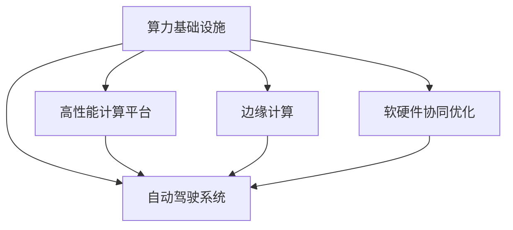

                 

## 1. 背景介绍

### 1.1 问题由来

随着自动驾驶技术的迅猛发展，对算力的需求也愈发迫切。高精度的感知、决策和控制任务，要求实时处理海量数据，计算需求高，且性能必须稳定可靠。算力竞赛是实现高性能自动驾驶系统的重要保障，对算力资源的竞争日益激烈。

### 1.2 问题核心关键点

算力竞赛的核心是如何在有限的资源限制下，设计高效、可靠、可扩展的算力基础设施，以满足自动驾驶系统的高性能需求。通常，这需要从算力硬件、软件架构、算法优化等不同层面综合考虑，进行全面的优化。

### 1.3 问题研究意义

对自动驾驶领域进行算力竞赛的研究，对推动自动驾驶技术发展具有重要意义：

1. **性能提升**：通过优化算力系统，可以实现更高的计算速度和更低的延迟，提升自动驾驶系统的性能。
2. **成本控制**：合理配置和利用算力资源，有助于降低系统开发和维护成本。
3. **可靠性增强**：高可靠性的算力系统，能确保自动驾驶系统在极端环境下的稳定运行。
4. **安全性提高**：通过算力优化，提升系统对突发状况的应对能力，提高自动驾驶系统的安全性。
5. **规模化部署**：高效算力系统有利于自动驾驶技术的快速部署和规模化应用。

## 2. 核心概念与联系

### 2.1 核心概念概述

为更好地理解自动驾驶领域的算力竞赛，本节将介绍几个关键概念：

- **算力基础设施**：指的是支撑自动驾驶系统运行的计算硬件和软件系统，包括CPU、GPU、FPGA、ASIC等芯片，以及分布式计算平台等。
- **高性能计算平台**：专门用于复杂计算任务的高性能计算机系统，如图形处理单元(GPU)和张量处理单元(TPU)等。
- **边缘计算**：将计算任务分散到靠近数据源的分布式计算节点，减少数据传输和处理延迟，适用于自动驾驶等需要实时响应的场景。
- **软硬件协同优化**：通过硬件架构优化、软件算法优化和系统协同设计，实现算力系统的性能和效率最大化。
- **自动驾驶系统**：结合感知、决策和控制模块，在无人驾驶条件下运行，实现车辆自主导航和决策的系统。

这些概念之间的逻辑关系可以通过以下Mermaid流程图来展示：



这个流程图展示了算力竞赛的核心概念及其之间的关系：

1. 自动驾驶系统的运行依赖于高性能计算平台。
2. 边缘计算提供了实时响应所需的计算能力。
3. 软硬件协同优化提升了整个算力系统的效率。

这些概念共同构成了自动驾驶系统算力竞赛的基础框架，使得系统能够高效、稳定地运行。

## 3. 核心算法原理 & 具体操作步骤

### 3.1 算法原理概述

自动驾驶算力竞赛的核心是如何在资源受限的条件下，通过软硬件协同优化，提升计算性能和资源利用效率。算力竞赛的优化目标通常包括：

- **提高计算速度**：通过并行计算、任务调度等技术，实现更高的计算速度。
- **降低延迟**：优化数据流和任务调度，减少任务执行的延迟。
- **增加资源利用率**：合理分配计算资源，提升资源利用效率。
- **增强可扩展性**：设计可扩展的算力架构，支持大规模系统部署。

### 3.2 算法步骤详解

自动驾驶算力竞赛的优化步骤通常包括以下几个关键环节：

**Step 1: 硬件选型与优化**

- 根据任务需求，选择合适的计算硬件，如CPU、GPU、TPU等。
- 通过芯片设计、工艺优化等技术，提升硬件的计算能力和能效比。
- 利用多核、多线程等技术，提高硬件的并行计算能力。

**Step 2: 软件架构设计**

- 采用分布式计算架构，如Spark、Ray等，实现任务并行处理。
- 优化数据流图，减少数据传输和存储开销。
- 设计高效的算法和模型，提升任务处理速度。

**Step 3: 系统协同优化**

- 通过硬件和软件的协同设计，优化系统性能。
- 采用资源调度策略，如FIFO、Round Robin等，合理分配计算资源。
- 实现软硬件的实时数据交换，提高系统响应速度。

**Step 4: 实际测试与评估**

- 搭建算力竞赛的实验环境，进行实际测试。
- 监测关键性能指标，如吞吐量、延迟等。
- 根据测试结果，进行反馈和优化。

**Step 5: 部署与优化**

- 将优化后的算力系统部署到实际应用场景中。
- 持续监测性能和资源使用情况，进行动态调整。
- 不断迭代和优化，提升算力系统性能。

### 3.3 算法优缺点

自动驾驶算力竞赛的优化方法具有以下优点：

1. **高效性**：通过优化硬件和软件设计，提高计算性能和资源利用效率。
2. **可扩展性**：设计可扩展的算力架构，支持大规模系统部署。
3. **灵活性**：根据任务需求，灵活配置和优化计算资源。
4. **可靠性**：通过冗余设计和故障切换机制，提高算力系统的可靠性。

同时，该方法也存在一些局限性：

1. **高成本**：优化算力系统需要大量的硬件和软件投入，成本较高。
2. **复杂性**：设计高效的算力系统需要综合考虑多方面的因素，复杂度高。
3. **性能瓶颈**：在硬件和软件资源有限的情况下，优化效果可能受限。
4. **灵活性受限**：在特定硬件架构下，优化空间有限。

尽管存在这些局限性，但就目前而言，基于软硬件协同优化的算力竞赛方法仍是实现高性能自动驾驶系统的重要手段。

### 3.4 算法应用领域

自动驾驶算力竞赛优化方法在自动驾驶领域有广泛应用，涵盖以下几个方面：

- **感知模块**：通过优化感知算法和模型，提升车辆对环境的实时感知能力。
- **决策模块**：通过优化决策算法和模型，提升车辆对复杂路况的智能决策能力。
- **控制模块**：通过优化控制算法和模型，实现车辆的精确控制和导航。
- **数据处理**：通过优化数据处理流程，实现对海量数据的高效处理和分析。
- **系统集成**：通过优化系统集成和调度，实现各个模块的协同工作。

除了上述这些核心模块外，算力竞赛优化方法还被应用于自动驾驶系统的测试验证、仿真模拟等环节，为自动驾驶技术的开发和验证提供了强有力的支持。

## 4. 数学模型和公式 & 详细讲解 & 举例说明

### 4.1 数学模型构建

自动驾驶算力竞赛优化的数学模型通常包括两部分：

- **硬件模型**：描述计算硬件的计算能力和资源限制。
- **任务模型**：描述自动驾驶系统的任务需求和性能要求。

以硬件资源优化为例，假设硬件计算单元数量为 $n$，每个计算单元的计算能力为 $p$，资源限制为 $C$。任务模型描述了一个典型的自动驾驶任务，需要 $T$ 的时间完成。计算资源的使用情况可以表示为：

$$
\sum_{i=1}^n C_i \leq C
$$

其中 $C_i$ 为第 $i$ 个计算单元分配的资源。

### 4.2 公式推导过程

为了优化资源分配，需要建立目标函数和约束条件。假设目标是最小化总计算时间，即最小化 $T$。优化问题可以表示为：

$$
\min_{C_i} \sum_{i=1}^n \frac{T}{p_iC_i}
$$

在满足资源限制的前提下，找到最优的 $C_i$ 值。

### 4.3 案例分析与讲解

假设某自动驾驶系统需要在1小时内完成任务，计算硬件为10个GPU，每个GPU的计算能力为200Gflops，资源限制为500Gflops。优化目标是分配计算资源以最小化总计算时间。

**案例1: 等比例分配**

将资源等比例分配到每个GPU上，即每个GPU分配50Gflops的资源。此时，总计算时间为：

$$
T = \frac{500}{10 \times 200} = 1 \text{小时}
$$

**案例2: 优化分配**

通过优化算法，可以发现最优分配为：前3个GPU分配100Gflops，后7个GPU分配60Gflops。此时，总计算时间为：

$$
T = \frac{500}{3 \times 200 + 7 \times 60} \approx 0.5 \text{小时}
$$

可以看到，通过优化分配，总计算时间减少了50%。这说明，合理分配资源可以显著提升系统的性能。

## 5. 项目实践：代码实例和详细解释说明

### 5.1 开发环境搭建

在进行自动驾驶算力竞赛的实践前，我们需要准备好开发环境。以下是使用Python进行PyTorch开发的环境配置流程：

1. 安装Anaconda：从官网下载并安装Anaconda，用于创建独立的Python环境。

2. 创建并激活虚拟环境：
```bash
conda create -n pytorch-env python=3.8 
conda activate pytorch-env
```

3. 安装PyTorch：根据CUDA版本，从官网获取对应的安装命令。例如：
```bash
conda install pytorch torchvision torchaudio cudatoolkit=11.1 -c pytorch -c conda-forge
```

4. 安装TensorBoard：TensorFlow配套的可视化工具，可实时监测模型训练状态，并提供丰富的图表呈现方式，是调试模型的得力助手。

5. 安装相关依赖：
```bash
pip install numpy pandas scikit-learn tqdm jupyter notebook ipython
```

完成上述步骤后，即可在`pytorch-env`环境中开始算力竞赛的实践。

### 5.2 源代码详细实现

下面以自动驾驶系统的感知模块为例，给出使用PyTorch进行算力竞赛优化的PyTorch代码实现。

首先，定义感知任务的损失函数：

```python
from torch import nn
import torch

class DetectionLoss(nn.Module):
    def __init__(self):
        super(DetectionLoss, self).__init__()

    def forward(self, predictions, targets):
        # 计算损失
        loss = self.calc_loss(predictions, targets)
        return loss
```

然后，定义模型的前向传播函数：

```python
class DetectionModel(nn.Module):
    def __init__(self):
        super(DetectionModel, self).__init__()
        # 定义模型结构

    def forward(self, x):
        # 前向传播计算预测结果
        outputs = self.model(x)
        return outputs
```

接着，定义优化器：

```python
from torch.optim import AdamW

optimizer = AdamW(model.parameters(), lr=0.001)
```

最后，定义训练函数：

```python
def train(dataloader, model, optimizer, num_epochs, batch_size):
    for epoch in range(num_epochs):
        model.train()
        for batch in dataloader:
            x = batch[0].to(device)
            y = batch[1].to(device)
            optimizer.zero_grad()
            outputs = model(x)
            loss = detection_loss(outputs, y)
            loss.backward()
            optimizer.step()
```

### 5.3 代码解读与分析

让我们再详细解读一下关键代码的实现细节：

**DetectionLoss类**：
- `__init__`方法：初始化损失函数。
- `forward`方法：计算预测结果与真实标签之间的损失。

**DetectionModel类**：
- `__init__`方法：初始化模型结构。
- `forward`方法：前向传播计算预测结果。

**train函数**：
- 定义训练循环，循环迭代训练集，进行模型前向传播和反向传播。
- 使用AdamW优化器更新模型参数。

以上代码展示了自动驾驶系统感知模块的基本训练流程。在实际应用中，还需要进行更多优化，如模型裁剪、量化加速等。

## 6. 实际应用场景

### 6.1 自动驾驶系统部署

自动驾驶算力竞赛优化方法可以广泛应用于自动驾驶系统的部署。通过优化硬件和软件设计，可以实现高性能、高可靠性的系统部署。

在技术实现上，可以设计专用的算力平台，使用GPU、TPU等高性能硬件进行计算加速。同时，采用分布式计算架构，如TensorFlow分布式训练、PyTorch分布式数据并行等，实现任务并行处理。在软件层面，设计高效的感知、决策和控制算法，提升系统性能。

### 6.2 自动驾驶系统测试

自动驾驶算力竞赛优化方法还可以应用于系统测试环节。通过优化测试环境，可以提升测试效率和覆盖率。

在测试环境搭建上，可以采用高性能计算平台，如GPU集群、TPU等，进行大规模并行测试。同时，设计高效的测试用例和数据生成流程，确保测试结果的全面性和准确性。在测试结果分析上，可以借助TensorBoard等可视化工具，实时监控和分析测试性能，及时发现和解决问题。

### 6.3 自动驾驶系统优化

自动驾驶算力竞赛优化方法还可以用于系统优化和迭代改进。通过持续优化算力系统，提升系统性能和稳定性。

在优化流程上，可以采用A/B测试、模型调参等手段，逐步提升系统性能。在优化策略上，可以引入模型裁剪、量化加速等技术，减小系统资源消耗。在优化反馈上，可以建立持续优化机制，持续监测系统性能，不断进行优化迭代。

### 6.4 未来应用展望

随着自动驾驶技术的不断发展，基于算力竞赛的优化方法将呈现以下几个发展趋势：

1. **超大规模硬件**：随着算力硬件的不断进步，未来将出现超大规模的计算平台，如Google的Tensor Processing Unit (TPU)。这些平台将提供更强大的计算能力，支持更复杂的自动驾驶任务。

2. **软件定义基础设施**：未来的算力系统将更多采用软件定义的方式，通过灵活的软件架构实现高效的资源分配和任务调度。这将进一步提升算力系统的灵活性和可扩展性。

3. **硬件加速技术**：随着硬件加速技术的发展，如GPU、TPU、FPGA等，未来将出现更多高效率的计算硬件。这些硬件将显著提升算力系统的性能和能效比。

4. **边缘计算**：未来的算力系统将更多采用边缘计算的方式，将计算任务分散到靠近数据源的分布式节点，减少数据传输和处理延迟，实现实时响应的高性能计算。

5. **多模态计算**：未来的自动驾驶系统将更多采用多模态计算的方式，将视觉、语音、传感器数据等融合起来，实现更全面的感知和决策。

6. **自适应计算**：未来的算力系统将更多采用自适应计算的方式，根据任务需求动态调整计算资源，实现最优的计算性能。

以上趋势凸显了自动驾驶算力竞赛的广阔前景。这些方向的探索发展，必将进一步提升自动驾驶系统的性能和安全性，为智能交通的实现提供强有力的技术支撑。

## 7. 工具和资源推荐

### 7.1 学习资源推荐

为了帮助开发者系统掌握自动驾驶领域的算力竞赛，这里推荐一些优质的学习资源：

1. **《深度学习》** 书籍：由深度学习领域的权威专家撰写，详细介绍了深度学习的基本原理和应用实例，包括自动驾驶算法和算力竞赛。

2. **《自动驾驶系统设计》** 课程：由自动驾驶领域的专家讲授，介绍了自动驾驶系统设计的基本流程和关键技术。

3. **NVIDIA DeepLearning SDK**：NVIDIA提供的深度学习开发工具包，包括GPU加速、分布式计算等功能，是实现高性能算力系统的必备资源。

4. **TensorFlow** 和 **PyTorch** 官方文档：这两个深度学习框架的官方文档，提供了大量的算法和模型实现，是进行自动驾驶系统开发的重要参考。

5. **TensorBoard** 和 **VisualDL**：这两个可视化工具，可以实时监控和分析计算性能，是调试算力系统的有力助手。

通过对这些资源的学习实践，相信你一定能够快速掌握自动驾驶算力竞赛的精髓，并用于解决实际的自动驾驶问题。

### 7.2 开发工具推荐

高效的开发离不开优秀的工具支持。以下是几款用于自动驾驶算力竞赛开发的常用工具：

1. **NVIDIA CUDA**：NVIDIA提供的GPU加速开发工具，支持高性能计算和深度学习应用。

2. **NVIDIA Triton Inference Server**：NVIDIA提供的推理服务器，支持GPU加速和分布式推理，是部署高性能算力系统的理想选择。

3. **PyTorch** 和 **TensorFlow**：两个深度学习框架，提供了丰富的算法和模型实现，支持分布式计算和优化。

4. **TensorBoard** 和 **VisualDL**：两个可视化工具，可以实时监控和分析计算性能，是调试算力系统的有力助手。

5. **Jupyter Notebook** 和 **Google Colab**：两个轻量级开发环境，支持交互式编程和实时实验，是快速开发算力竞赛原型的好帮手。

合理利用这些工具，可以显著提升自动驾驶算力竞赛任务的开发效率，加快创新迭代的步伐。

### 7.3 相关论文推荐

自动驾驶领域算力竞赛的发展源于学界的持续研究。以下是几篇奠基性的相关论文，推荐阅读：

1. **《深度学习加速自动驾驶系统》**：介绍了深度学习在自动驾驶系统中的应用，包括算力竞赛优化的基本原理和实践方法。

2. **《分布式深度学习架构》**：讨论了分布式深度学习架构的设计和优化，适用于自动驾驶系统的并行计算需求。

3. **《GPU加速深度学习》**：介绍了GPU加速深度学习的原理和应用，适用于高性能算力系统的开发。

4. **《边缘计算在自动驾驶中的应用》**：介绍了边缘计算在自动驾驶系统中的优势和应用，适用于实时响应的高性能计算需求。

5. **《自适应计算技术》**：介绍了自适应计算技术的基本原理和应用，适用于动态调整计算资源的需求。

这些论文代表了大规模自动驾驶算力竞赛的发展脉络。通过学习这些前沿成果，可以帮助研究者把握学科前进方向，激发更多的创新灵感。

## 8. 总结：未来发展趋势与挑战

### 8.1 总结

本文对自动驾驶领域的算力竞赛进行了全面系统的介绍。首先阐述了算力竞赛的研究背景和意义，明确了算力竞赛在实现高性能自动驾驶系统中的重要作用。其次，从原理到实践，详细讲解了算力竞赛的数学模型和关键步骤，给出了算力竞赛任务开发的完整代码实例。同时，本文还广泛探讨了算力竞赛方法在自动驾驶系统部署、测试、优化等多个环节的应用前景，展示了算力竞赛范式的巨大潜力。此外，本文精选了算力竞赛技术的各类学习资源，力求为读者提供全方位的技术指引。

通过本文的系统梳理，可以看到，基于算力竞赛优化的自动驾驶系统已经在性能、成本和可靠性等方面取得了显著的进步。未来，伴随算力硬件和软件技术的不断演进，算力竞赛优化方法将进一步提升自动驾驶系统的综合性能，为智能交通的实现提供强有力的技术支撑。

### 8.2 未来发展趋势

展望未来，自动驾驶领域算力竞赛技术将呈现以下几个发展趋势：

1. **高性能硬件**：随着算力硬件的不断进步，未来的算力系统将使用更高效的GPU、TPU、FPGA等，提供更强大的计算能力。

2. **软件定义基础设施**：未来的算力系统将更多采用软件定义的方式，通过灵活的软件架构实现高效的资源分配和任务调度。

3. **分布式计算**：未来的算力系统将更多采用分布式计算的方式，利用大规模集群提升计算效率和稳定性。

4. **边缘计算**：未来的算力系统将更多采用边缘计算的方式，将计算任务分散到靠近数据源的分布式节点，实现实时响应的高性能计算。

5. **多模态计算**：未来的自动驾驶系统将更多采用多模态计算的方式，将视觉、语音、传感器数据等融合起来，实现更全面的感知和决策。

6. **自适应计算**：未来的算力系统将更多采用自适应计算的方式，根据任务需求动态调整计算资源，实现最优的计算性能。

以上趋势凸显了自动驾驶领域算力竞赛的广阔前景。这些方向的探索发展，必将进一步提升自动驾驶系统的性能和安全性，为智能交通的实现提供强有力的技术支撑。

### 8.3 面临的挑战

尽管自动驾驶领域算力竞赛技术已经取得了瞩目成就，但在迈向更加智能化、普适化应用的过程中，它仍面临着诸多挑战：

1. **硬件成本高**：高效率的算力系统往往需要高性能硬件，这些硬件的成本较高，增加了系统开发和维护成本。

2. **资源消耗大**：高性能算力系统的资源消耗较大，需要有效的资源管理和优化策略。

3. **系统复杂性高**：设计高效的算力系统需要综合考虑多方面的因素，包括硬件、软件、算法等，复杂度高。

4. **实时性要求高**：自动驾驶系统对实时性的要求极高，如何设计高效的数据流和任务调度策略，满足实时性需求，仍是重要课题。

5. **安全性挑战**：算力系统的安全性和可靠性需要高度保证，如何设计冗余和容错机制，确保系统稳定运行，仍需深入研究。

6. **数据隐私问题**：自动驾驶系统需要处理大量敏感数据，如何保护用户隐私，防止数据泄露，仍需关注。

以上挑战凸显了自动驾驶领域算力竞赛的复杂性和复杂性。尽管存在这些挑战，但随着技术的不断演进，相信算力竞赛优化方法将不断取得突破，进一步推动自动驾驶技术的发展。

### 8.4 研究展望

面对自动驾驶领域算力竞赛所面临的种种挑战，未来的研究需要在以下几个方面寻求新的突破：

1. **新硬件技术**：研究和开发新型高效计算硬件，如新型GPU、TPU、FPGA等，提升算力系统的性能和能效比。

2. **软件定义架构**：研究新型软件定义架构，提升算力系统的灵活性和可扩展性。

3. **分布式计算优化**：研究和优化分布式计算架构，提高系统计算效率和稳定性。

4. **实时性优化**：研究和优化实时性算法和模型，提升系统响应速度和稳定性。

5. **数据隐私保护**：研究和开发数据隐私保护技术，确保系统数据安全。

6. **系统可靠性设计**：研究和设计高可靠性的算力系统，确保系统稳定运行。

这些研究方向的探索，必将引领自动驾驶领域算力竞赛技术迈向更高的台阶，为智能交通的实现提供强有力的技术支撑。面向未来，自动驾驶领域算力竞赛技术还需要与其他人工智能技术进行更深入的融合，如知识表示、因果推理、强化学习等，多路径协同发力，共同推动自动驾驶技术的发展。只有勇于创新、敢于突破，才能不断拓展自动驾驶系统的边界，让智能交通技术更好地造福人类社会。

---

作者：禅与计算机程序设计艺术 / Zen and the Art of Computer Programming

